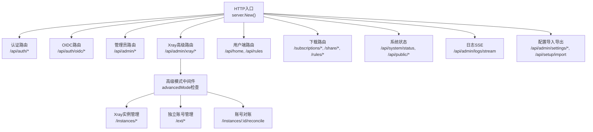
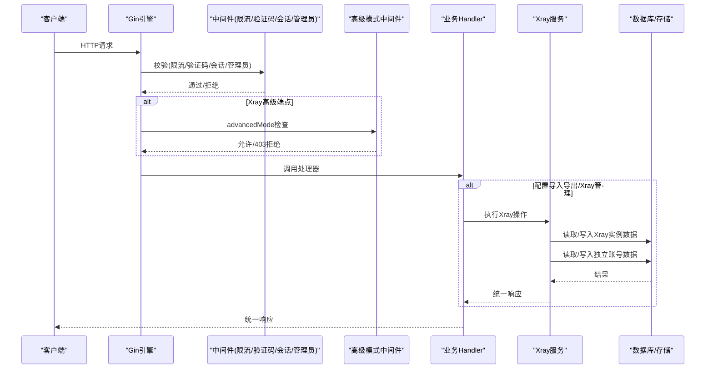
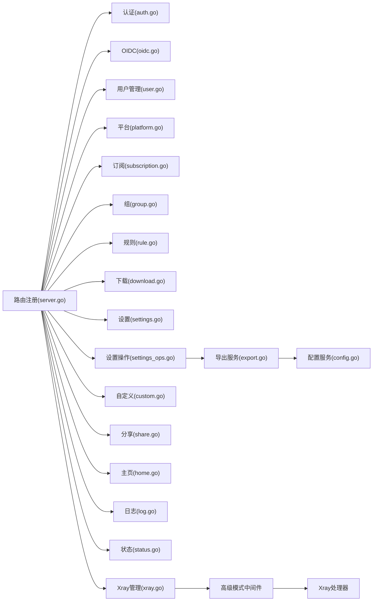
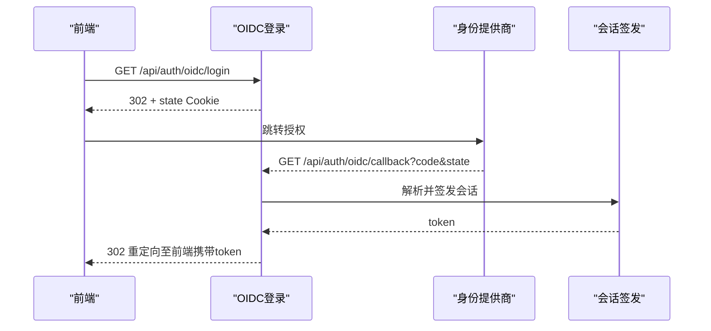
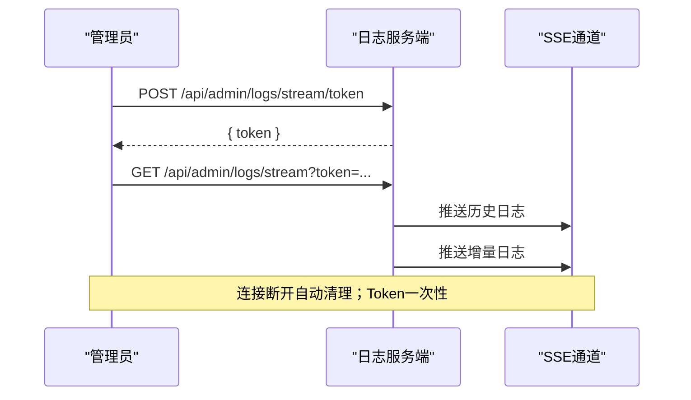
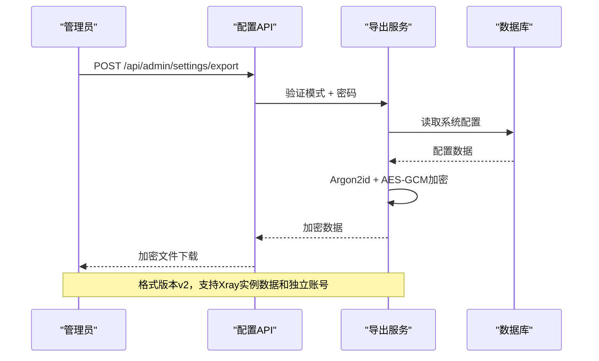
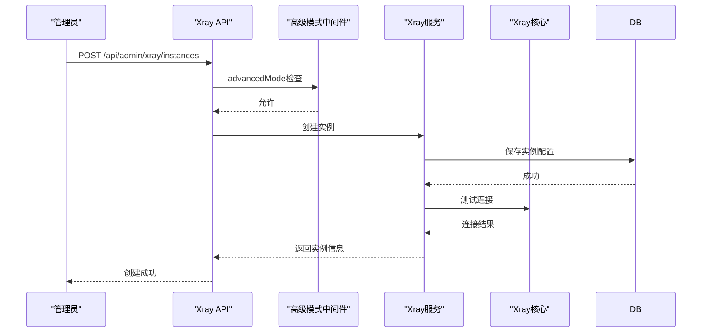
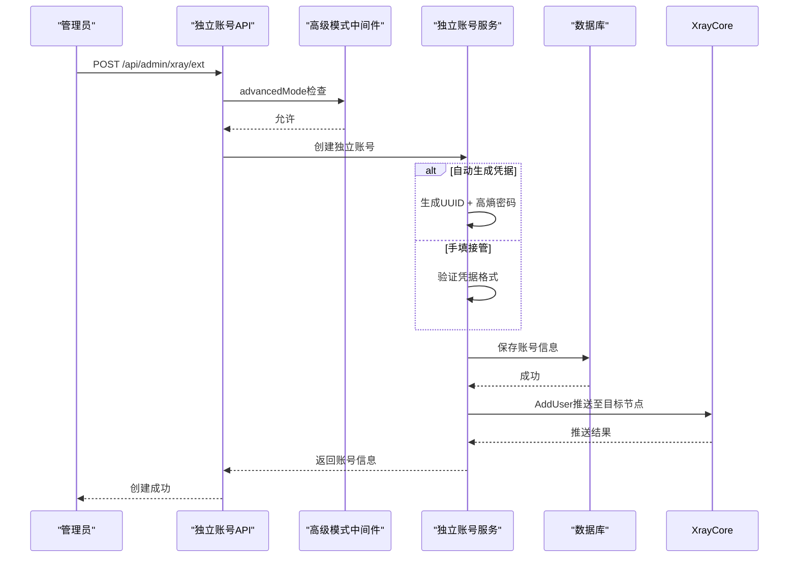

# API接口文档

<cite>
**本文引用的文件**
- [backend/internal/server/server.go](file://backend/internal/server/server.go)
- [backend/internal/server/auth.go](file://backend/internal/server/auth.go)
- [backend/internal/server/oidc.go](file://backend/internal/server/oidc.go)
- [backend/internal/server/log.go](file://backend/internal/server/log.go)
- [backend/internal/server/user.go](file://backend/internal/server/user.go)
- [backend/internal/server/subscription.go](file://backend/internal/server/subscription.go)
- [backend/internal/server/platform.go](file://backend/internal/server/platform.go)
- [backend/internal/server/group.go](file://backend/internal/server/group.go)
- [backend/internal/server/rule.go](file://backend/internal/server/rule.go)
- [backend/internal/server/download.go](file://backend/internal/server/download.go)
- [backend/internal/server/settings.go](file://backend/internal/server/settings.go)
- [backend/internal/server/settings_ops.go](file://backend/internal/server/settings_ops.go)
- [backend/internal/config/export.go](file://backend/internal/config/export.go)
- [Design2.md](../../../../../docs/reports/Design/Design2.md)
- [Design2-UI.md](../../../../../docs/reports/Design/Design2-UI.md)
</cite>

## 更新摘要
**变更内容**
- **新增独立账号管理API**：完整实现Xray独立账号CRUD端点（/api/admin/xray/ext/*），支持凭据生成与手填接管、配额管理、推送目标选择
- **增强对账响应结构**：reconcile端点返回扩展的ext_orphans数组，区分疑似独立账号残留与常规无头用户
- **高级模式中间件保护**：所有/api/admin/xray/*端点受advanced_mode配置开关保护，OFF时统一返回403
- **配置导入导出增强**：format_version=2支持xray_instances与独立账号数据完整导出，slug保持机制确保节点命名一致性
- **实例级对账能力**：支持按实例维度进行账号对账，包含待补推、无头用户、疑似独立账号残留三分区展示

## 目录
1. [简介](#简介)
2. [项目结构](#项目结构)
3. [核心组件](#核心组件)
4. [架构总览](#架构总览)
5. [详细端点说明](#详细端点说明)
6. [依赖关系分析](#依赖关系分析)
7. [性能与限流](#性能与限流)
8. [故障排查指南](#故障排查指南)
9. [结论](#结论)
10. [附录](#附录)

## 简介
本文件为VPN订阅管理系统的完整RESTful API参考，覆盖认证、OIDC、用户管理、平台与订阅、规则、分享与自定义订阅、下载、设置、日志、系统状态等全部对外接口。文档包含：
- HTTP方法与URL路径
- 请求参数（JSON表单/查询参数/文件上传）
- 响应格式与统一包装
- 状态码与错误处理
- 认证方式（会话Cookie、短期Token、OIDC回调）
- WebSocket/SSE实时日志连接协议
- 版本管理、速率限制与安全注意事项
- **新增**：完整的Xray实例管理与独立账号管理能力，支持高级模式下的四协议代理管理

**重要更新**：系统现已全面支持Xray实例管理和独立账号功能，通过高级模式中间件保护高级端点，提供完整的实例CRUD、节点检测、账号对账、独立账号管理等高级特性。配置导入导出功能升级至v2格式，支持完整的Xray实例数据和独立账号数据迁移。

## 项目结构
后端采用Gin路由装配，按业务域拆分处理器并集中注册：
- 认证与OIDC：/api/auth、/api/auth/oidc
- 管理员面板：/api/admin/*
- Xray高级管理：/api/admin/xray/*（高级模式）
- 用户端数据：/api/home、/api/rules
- 下载与预览：/subscriptions/*、/share/*、/rules/*、/api/subscriptions/preview
- 系统能力：/api/system/status、/api/public/announcement、/api/site/info
- 日志SSE：/api/admin/logs/stream
- 配置导入导出：/api/admin/settings/export、/api/admin/settings/import、/api/setup/import

图表来源
- [backend/internal/server/server.go:63-157](file://backend/internal/server/server.go#L63-L157)
- [Design2.md:375-376](../../../../../docs/reports/Design/Design2.md#L375-L376)

章节来源
- [backend/internal/server/server.go:63-157](file://backend/internal/server/server.go#L63-L157)
- [Design2.md:375-376](../../../../../docs/reports/Design/Design2.md#L375-L376)

## 核心组件
- 统一响应封装：OK/Fail/ListData
- 中间件链：请求日志、panic恢复、信任代理、限流、验证码、会话/管理员鉴权
- 服务装配：auth、setup、oidc、captcha、ratelimit、version、platform、subscription、group、token、download、custom、share、rule、mail、approval、config、log、backup、dataclear、emergency
- **新增**：高级模式中间件（advancedMode）保护Xray相关端点
- **新增**：Xray实例管理与独立账号管理服务

**高级模式特性**：
| 特性 | 描述 | 保护范围 |
|------|------|----------|
| advanced_mode开关 | 控制高级功能可用性 | /api/admin/xray/* 全部端点 |
| 四协议支持 | vless/vmess/trojan/shadowsocks | 实例节点管理 |
| 独立账号管理 | 面板账号体系之外的Xray账号 | /api/admin/xray/ext/* |
| 实例级对账 | 按实例维度进行账号同步检查 | /api/admin/xray/instances/:id/reconcile |
| 流量采集 | 逐用户和独立账号串行采集 | cron任务 |

章节来源
- [backend/internal/server/server.go:40-157](file://backend/internal/server/server.go#L40-L157)
- [Design2.md:375-376](../../../../../docs/reports/Design/Design2.md#L375-L376)
- [Design2.md:401-411](../../../../../docs/reports/Design/Design2.md#L401-L411)

## 架构总览

图表来源
- [backend/internal/server/server.go:63-157](file://backend/internal/server/server.go#L63-L157)
- [Design2.md:375-376](../../../../../docs/reports/Design/Design2.md#L375-L376)

## 详细端点说明

### 通用约定
- 内容类型：默认application/json；文件上传使用multipart/form-data
- 统一响应：
  - 成功：{ data }
  - 列表：{ list, total }
  - 失败：{ error }
- 鉴权：
  - 会话Cookie：由Session中间件注入用户ID与角色
  - 短期Token：用于SSE连接（一次性）
  - OIDC：授权码流程+state Cookie保护
- 限流：按IP或Key计数，超限返回429
- 缓存控制：下载类端点强制no-store/no-cache
- **新增**：高级模式中间件保护，advanced_mode=OFF时返回403

章节来源
- [backend/internal/server/server.go:40-50](file://backend/internal/server/server.go#L40-L50)
- [Design2.md:375-376](../../../../../docs/reports/Design/Design2.md#L375-L376)

### 认证接口
- POST /api/auth/register
  - 描述：本地注册（受本地登录开关与自注册策略控制）
  - 请求体：username、email、password
  - 响应：激活用户返回token、expires_at、status、is_admin；否则返回pending提示
  - 状态码：200/400/403/409/500
- POST /api/auth/login
  - 描述：本地登录
  - 请求体：email、password、remember
  - 响应：token、expires_at、user信息
  - 状态码：200/400/401/500
- GET /api/auth/me
  - 描述：当前用户信息（含group_name）
  - 鉴权：会话
  - 状态码：200/401
- POST /api/auth/logout
  - 描述：客户端清除本地会话
  - 鉴权：会话
  - 状态码：200
- POST /api/auth/forgot
  - 描述：发送密码重置邮件（防枚举）
  - 请求体：email
  - 状态码：200/400/500
- POST /api/auth/reset
  - 描述：重置密码（令牌校验）
  - 请求体：token、password
  - 状态码：200/400/500

章节来源
- [backend/internal/server/auth.go:24-34](file://backend/internal/server/auth.go#L24-L34)
- [backend/internal/server/auth.go:44-91](file://backend/internal/server/auth.go#L44-L91)
- [backend/internal/server/auth.go:99-134](file://backend/internal/server/auth.go#L99-L134)
- [backend/internal/server/auth.go:137-157](file://backend/internal/server/auth.go#L137-L157)
- [backend/internal/server/auth.go:159-196](file://backend/internal/server/auth.go#L159-L196)

### OIDC接口
- GET /api/auth/oidc/login
  - 描述：发起OIDC授权（302跳转），写入state Cookie
  - 状态码：302/500
- GET /api/auth/oidc/callback
  - 描述：OIDC回调（state三重校验、用后即删）
  - 成功：重定向至前端携带token或pending页
  - 状态码：302/500
- POST /api/auth/oidc/mock/login
  - 描述：开发模拟登录（Dev+mock）
  - 请求体：email、username、email_verified、roles、groups
  - 响应：token、expires_at、status或pending
  - 状态码：200/400/409/500
- POST /api/auth/oidc/bind
  - 描述：绑定OIDC到当前会话（需会话）
  - 响应：auth_url（供前端跳转）
  - 状态码：200/500
- POST /api/oidc/test
  - 描述：测试OIDC连接（不落库）
  - 请求体：provider_type、base_url、realm、client_id、client_secret
  - 状态码：200/400/500

章节来源
- [backend/internal/server/oidc.go:19-27](file://backend/internal/server/oidc.go#L19-L27)
- [backend/internal/server/oidc.go:31-40](file://backend/internal/server/oidc.go#L31-L40)
- [backend/internal/server/oidc.go:42-90](file://backend/internal/server/oidc.go#L42-L90)
- [backend/internal/server/oidc.go:92-125](file://backend/internal/server/oidc.go#L92-L125)
- [backend/internal/server/oidc.go:127-139](file://backend/internal/server/oidc.go#L127-L139)
- [backend/internal/server/oidc.go:141-163](file://backend/internal/server/oidc.go#L141-L163)

### **新增**：Xray实例管理（高级模式）
- GET /api/admin/xray/instances
  - 描述：Xray实例列表（含采集状态）
  - 鉴权：会话 + 管理员 + 高级模式
  - 响应：list包含name/slug/api_addr/api_tag/enabled/last_collect_at/collect_status/collect_error
  - 状态码：200/403/500
- POST /api/admin/xray/instances
  - 描述：创建Xray实例
  - 请求体：name、slug、api_addr、api_tag、enabled
  - 状态码：200/400/409/403/500
- PUT /api/admin/xray/instances/:id
  - 描述：更新实例配置
  - 请求体：name、api_addr、api_tag、enabled
  - 状态码：200/400/404/403/500
- DELETE /api/admin/xray/instances/:id
  - 描述：删除实例（级联清理关联数据）
  - 状态码：200/404/403/500
- POST /api/admin/xray/instances/test
  - 描述：测试实例连接（不落库）
  - 请求体：api_addr、api_tag
  - 响应：{ ok, error? }
  - 状态码：200/400/403/500
- POST /api/admin/xray/instances/:id/detect
  - 描述：检测实例节点（ListInbounds upsert）
  - 响应：{ added, updated, missing, skipped: [{tag, reason}] }
  - 状态码：200/400/404/403/500
- POST /api/admin/xray/init
  - 描述：批量初始化（对所有active用户执行AddUser）
  - 响应：{ synced, failed }
  - 状态码：200/403/500

章节来源
- [Design2-UI.md:514-517](../../../../../docs/reports/Design/Design2-UI.md#L514-L517)
- [Design2.md:375-376](../../../../../docs/reports/Design/Design2.md#L375-L376)

### **新增**：账号对账（高级模式）
- GET /api/admin/xray/instances/:id/reconcile
  - 描述：实例级账号对账（期望集 vs 实际集合）
  - 响应：{ to_push: [...], orphans: [...], ext_orphans: [...] }
  - 说明：to_push=待补推，orphans=常规无头用户，ext_orphans=疑似独立账号残留
  - 状态码：200/404/403/500
- POST /api/admin/xray/instances/:id/reconcile/push
  - 描述：一键补推（对待补推全集）
  - 响应：计数回执
  - 状态码：200/404/403/500
- POST /api/admin/xray/instances/:id/reconcile/clean
  - 描述：一键清理（对无头用户和疑似独立账号残留）
  - 请求体：勾选的清理项
  - 响应：计数回执
  - 状态码：200/404/403/500

章节来源
- [Design2-UI.md:518](../../../../../docs/reports/Design/Design2-UI.md#L518)
- [Design2.md:375-376](../../../../../docs/reports/Design/Design2.md#L375-L376)

### **新增**：独立账号管理（高级模式）
- GET /api/admin/xray/ext
  - 描述：独立账号列表（含本月用量和推送摘要）
  - 鉴权：会话 + 管理员 + 高级模式
  - 响应：list包含name/email/quota/quota_exceeded/本月用量/推送摘要
  - 状态码：200/403/500
- POST /api/admin/xray/ext
  - 描述：创建独立账号（双轨：自动生成或手填接管）
  - 请求体：name、credential_mode（generate/manual）、凭据（手填时）、推送目标列表
  - 说明：推送目标仅限四协议、allocatable=1、enabled节点
  - 状态码：200/400/409/403/500
- PUT /api/admin/xray/ext/:id
  - 描述：更新独立账号（名称、配额、推送目标）
  - 请求体：name、quota、推送目标列表
  - 状态码：200/400/404/409/403/500
- DELETE /api/admin/xray/ext/:id
  - 描述：删除独立账号（级联清理推送记录）
  - 状态码：200/404/403/500
- GET /api/admin/xray/ext/:id/credentials
  - 描述：获取独立账号凭据（AES-256-GCM解密）
  - 响应：{ uuid, proxy_secret }
  - 安全：敏感端点，前端复制警示文案
  - 状态码：200/404/403/500
- POST /api/admin/xray/ext/:id/reset-quota
  - 描述：重置独立账号配额（清当月累计 + 重新AddUser）
  - 响应：计数回执
  - 状态码：200/404/403/500

章节来源
- [Design2-UI.md:522-524](../../../../../docs/reports/Design/Design2-UI.md#L522-L524)
- [Design2.md:401-411](../../../../../docs/reports/Design/Design2.md#L401-L411)

### 管理员-用户管理
- GET /api/admin/users
  - 描述：用户列表（分页、关键词搜索）
  - 查询：page、size、keyword
  - 响应：list、total
  - 状态码：200/500
- POST /api/admin/users
  - 描述：新建用户
  - 请求体：username、email、password
  - 状态码：200/400/409/500
- PUT /api/admin/users/:id
  - 描述：编辑/换组；可选补填email
  - 请求体：group_id、email
  - 状态码：200/400/404/500
- PUT /api/admin/users/:id/role
  - 描述：角色变更（admin↔user）
  - 请求体：role
  - 状态码：200/400/403/500
- POST /api/admin/users/:id/tokens/revoke
  - 描述：吊销所有下载Token
  - 状态码：200/500
- POST /api/admin/users/:id/password/reset
  - 描述：重置密码（send_email/direct）
  - 请求体：mode
  - 状态码：200/400/500
- DELETE /api/admin/users/:id/oidc
  - 描述：清除OIDC绑定（返回has_password）
  - 状态码：200/400/404/500
- PUT /api/admin/users/:id/status
  - 描述：禁用/启用（disabled）
  - 状态码：200/400/500
- DELETE /api/admin/users/:id
  - 描述：删除用户（级联）
  - 状态码：200/400/404/500
- POST /api/admin/users/send_password_links
  - 描述：批量发送密码设置链接（回执计数）
  - 状态码：200/400/500

章节来源
- [backend/internal/server/user.go:19-32](file://backend/internal/server/user.go#L19-L32)
- [backend/internal/server/user.go:54-67](file://backend/internal/server/user.go#L54-L67)
- [backend/internal/server/user.go:69-89](file://backend/internal/server/user.go#L69-89)
- [backend/internal/server/user.go:91-121](file://backend/internal/server/user.go#L91-L121)
- [backend/internal/server/user.go:123-146](file://backend/internal/server/user.go#L123-L146)
- [backend/internal/server/user.go:148-159](file://backend/internal/server/user.go#L148-L159)
- [backend/internal/server/user.go:161-196](file://backend/internal/server/user.go#L161-L196)
- [backend/internal/server/user.go:198-213](file://backend/internal/server/user.go#L198-L213)
- [backend/internal/server/user.go:215-238](file://backend/internal/server/user.go#L215-L238)
- [backend/internal/server/user.go:240-256](file://backend/internal/server/user.go#L240-L256)
- [backend/internal/server/user.go:258-274](file://backend/internal/server/user.go#L258-L274)

### 管理员-平台
- GET /api/admin/platforms
  - 描述：平台列表
  - 状态码：200/500
- POST /api/admin/platforms
  - 描述：创建平台
  - 请求体：name、description、schemes、extra_headers
  - 状态码：200/400/500
- GET /api/admin/platforms/:id
  - 描述：获取平台详情
  - 状态码：200/404/500
- PUT /api/admin/platforms/:id
  - 描述：更新平台（slug只读）
  - 状态码：200/400/404/500
- DELETE /api/admin/platforms/:id
  - 描述：删除平台（级联）
  - 状态码：200/404/500
- POST /api/admin/platforms/:id/installer
  - 描述：上传安装包（≤300MB）
  - 请求体：multipart file
  - 状态码：200/400/404/500
- DELETE /api/admin/platforms/:id/installer
  - 描述：删除安装包
  - 状态码：200/404/500

章节来源
- [backend/internal/server/platform.go:19-30](file://backend/internal/server/platform.go#L19-L30)
- [backend/internal/server/platform.go:50-57](file://backend/internal/server/platform.go#L50-L57)
- [backend/internal/server/platform.go:59-74](file://backend/internal/server/platform.go#L59-L74)
- [backend/internal/server/platform.go:76-92](file://backend/internal/server/platform.go#L76-L92)
- [backend/internal/server/platform.go:94-118](file://backend/internal/server/platform.go#L94-L118)
- [backend/internal/server/platform.go:120-135](file://backend/internal/server/platform.go#L120-L135)
- [backend/internal/server/platform.go:137-163](file://backend/internal/server/platform.go#L137-L163)
- [backend/internal/server/platform.go:165-180](file://backend/internal/server/platform.go#L165-L180)

### 管理员-订阅与版本
- GET /api/admin/subscriptions
  - 描述：订阅列表（含关联组与被选定标记）
  - 状态码：200/500
- POST /api/admin/subscriptions
  - 描述：创建订阅
  - 请求体：platform_id、name、slug（可选）、group_ids
  - 状态码：200/400/409/500
- PUT /api/admin/subscriptions/:id
  - 描述：更新订阅（名称、组）
  - 状态码：200/400/404/500
- DELETE /api/admin/subscriptions/:id
  - 描述：删除订阅
  - 状态码：200/404/500
- GET /api/admin/subscriptions/:id/versions
  - 描述：版本列表（含当前激活标记）
  - 状态码：200/500
- POST /api/admin/subscriptions/:id/versions
  - 描述：创建版本（文件上传或文本模式）
  - 查询：mode=upload|text
  - 请求体：文件或多行文本
  - 状态码：200/400/500
- PUT /api/admin/subscriptions/:id/versions/current
  - 描述：切换当前版本（原子）
  - 请求体：version_no
  - 状态码：200/400/404/500
- GET /api/admin/subscriptions/:id/versions/:ver/preview
  - 描述：预览版本内容（text/plain，no-store）
  - 状态码：200/404/500
- DELETE /api/admin/subscriptions/:id/versions/:ver
  - 描述：删除版本（不可删最后/当前）
  - 状态码：200/400/404/500
- GET /api/admin/slug/check
  - 描述：标识唯一性即时校验
  - 查询：slug、type、id
  - 状态码：200/500

章节来源
- [backend/internal/server/subscription.go:21-38](file://backend/internal/server/subscription.go#L21-L38)
- [backend/internal/server/subscription.go:56-63](file://backend/internal/server/subscription.go#L56-L63)
- [backend/internal/server/subscription.go:65-90](file://backend/internal/server/subscription.go#L65-L90)
- [backend/internal/server/subscription.go:92-115](file://backend/internal/server/subscription.go#L92-L115)
- [backend/internal/server/subscription.go:117-132](file://backend/internal/server/subscription.go#L117-L132)
- [backend/internal/server/subscription.go:134-148](file://backend/internal/server/subscription.go#L134-L148)
- [backend/internal/server/subscription.go:152-170](file://backend/internal/server/subscription.go#L152-L170)
- [backend/internal/server/subscription.go:174-192](file://backend/internal/server/subscription.go#L174-L192)
- [backend/internal/server/subscription.go:194-235](file://backend/internal/server/subscription.go#L194-L235)
- [backend/internal/server/subscription.go:237-260](file://backend/internal/server/subscription.go#L237-L260)
- [backend/internal/server/subscription.go:262-283](file://backend/internal/server/subscription.go#L262-L283)
- [backend/internal/server/subscription.go:285-309](file://backend/internal/server/subscription.go#L285-L309)

### 管理员-用户组
- GET /api/admin/groups
  - 描述：组列表（含关联订阅数、用户数、needs_reselect）
  - 状态码：200/500
- GET /api/admin/groups/:id
  - 描述：组详情（基础信息+每平台选定）
  - 状态码：200/404/500
- POST /api/admin/groups
  - 描述：创建组
  - 请求体：name
  - 状态码：200/400/409/500
- PUT /api/admin/groups/:id
  - 描述：改名+关联订阅+每平台选定（整体提交）
  - 请求体：name、sub_ids、selections
  - 状态码：200/400/404/500
- DELETE /api/admin/groups/:id
  - 描述：删除组（迁入默认组）
  - 状态码：200/400/404/500
- PUT /api/admin/groups/:id/selections
  - 描述：每平台选定（subscription_id=0取消）
  - 请求体：selections
  - 状态码：200/400/404/500

章节来源
- [backend/internal/server/group.go:18-27](file://backend/internal/server/group.go#L18-L27)
- [backend/internal/server/group.go:29-36](file://backend/internal/server/group.go#L29-L36)
- [backend/internal/server/group.go:38-60](file://backend/internal/server/group.go#L38-60)
- [backend/internal/server/group.go:62-80](file://backend/internal/server/group.go#L62-80)
- [backend/internal/server/group.go:82-117](file://backend/internal/server/group.go#L82-L117)
- [backend/internal/server/group.go:119-138](file://backend/internal/server/group.go#L119-L138)
- [backend/internal/server/group.go:140-167](file://backend/internal/server/group.go#L140-L167)

### 管理员-规则
- GET /api/admin/rules
  - 描述：规则列表
  - 状态码：200/500
- POST /api/admin/rules
  - 描述：创建规则（文件/文本双模式）
  - 查询：mode=upload|text
  - 请求体：name、slug（可选）、client_type、schemes、text或文件
  - 状态码：200/400/409/500
- PUT /api/admin/rules/:id
  - 描述：重命名
  - 请求体：name
  - 状态码：200/400/404/500
- DELETE /api/admin/rules/:id
  - 描述：删除
  - 状态码：200/404/500
- POST /api/admin/rules/:id/token/refresh
  - 描述：刷新全局Token
  - 状态码：200/500
- 版本端点：/api/admin/rules/:id/versions/*（同订阅通用模式）

章节来源
- [backend/internal/server/rule.go:22-40](file://backend/internal/server/rule.go#L22-40)
- [backend/internal/server/rule.go:42-49](file://backend/internal/server/rule.go#L42-L49)
- [backend/internal/server/rule.go:51-105](file://backend/internal/server/rule.go#L51-L105)
- [backend/internal/server/rule.go:107-129](file://backend/internal/server/rule.go#L107-L129)
- [backend/internal/server/rule.go:131-146](file://backend/internal/server/rule.go#L131-L146)
- [backend/internal/server/rule.go:148-159](file://backend/internal/server/rule.go#L148-L159)
- [backend/internal/server/rule.go:186-206](file://backend/internal/server/rule.go#L186-L206)

### 用户端-规则
- GET /api/rules
  - 描述：规则卡片列表（含全局Token）
  - 鉴权：会话
  - 状态码：200/500
- GET /api/rules/:id/preview
  - 描述：预览当前版本（text/plain，no-store）
  - 鉴权：会话
  - 状态码：200/404/500

章节来源
- [backend/internal/server/rule.go:22-40](file://backend/internal/server/rule.go#L22-L40)
- [backend/internal/server/rule.go:161-169](file://backend/internal/server/rule.go#L161-L169)
- [backend/internal/server/rule.go:171-184](file://backend/internal/server/rule.go#L171-L184)

### 下载与预览
- GET /subscriptions/:platform/download?token=...
  - 描述：用户订阅下载（限流20/min，禁缓存）
  - 成功：返回配置内容（可带Content-Disposition）
  - 未分配：返回纯文本注释块（HTTP 200）
  - 无效Token/无版本：404
  - 状态码：200/404/500
- GET /share/:slug/download?token=...
  - 描述：分享订阅下载（公开，限流）
  - 状态码：200/404/500
- GET /rules/:slug/download?token=...
  - 描述：规则下载（公开，限流）
  - 状态码：200/404/500
- GET /api/subscriptions/preview
  - 描述：会话凭据预览（管理员可指定subscription_id）
  - 鉴权：会话
  - 状态码：200/404/500

章节来源
- [backend/internal/server/download.go:23-30](file://backend/internal/server/download.go#L23-L30)
- [backend/internal/server/download.go:38-69](file://backend/internal/server/download.go#L38-L69)
- [backend/internal/server/download.go:71-98](file://backend/internal/server/download.go#L71-L98)
- [backend/internal/server/download.go:100-127](file://backend/internal/server/download.go#L100-L127)
- [backend/internal/server/download.go:129-156](file://backend/internal/server/download.go#L129-L156)

### 用户端-主页数据
- GET /api/home/platforms
  - 描述：平台卡片（含下载Token/URL；管理员显示池内订阅）
  - 鉴权：会话
  - 状态码：200/500
- POST /api/home/token/refresh
  - 描述：刷新指定平台下载Token（旧失效）
  - 请求体：platform_id
  - 状态码：200/400/404/500
- GET /api/home/updated_at
  - 描述：可见订阅更新时间戳（管理员全池）
  - 鉴权：会话
  - 状态码：200/500

章节来源
- [backend/internal/server/home.go:37-43](file://backend/internal/server/home.go#L37-L43)
- [backend/internal/server/home.go:69-164](file://backend/internal/server/home.go#L69-L164)
- [backend/internal/server/home.go:166-194](file://backend/internal/server/home.go#L166-L194)
- [backend/internal/server/home.go:214-254](file://backend/internal/server/home.go#L214-L254)
- [backend/internal/server/home.go:256-343](file://backend/internal/server/home.go#L256-L343)

### 管理员-设置
- GET/PUT/DELETE /api/admin/settings/oidc
  - 描述：OIDC配置读取/保存/清空
  - 状态码：200/400/500
- GET/PUT /api/admin/settings/oidc-rules
  - 描述：OIDC启用规则（审批开关、白名单）
  - 状态码：200/400/500
- GET/PUT /api/admin/settings/local-auth
  - 描述：本地认证开关
  - 状态码：200/400/500
- GET/PUT /api/admin/settings/captcha
  - 描述：验证码配置
  - 状态码：200/400/500
- GET/PUT /api/admin/settings/smtp
  - 描述：SMTP配置
  - 状态码：200/400/500
- GET/PUT/DELETE /api/admin/settings/site
  - 描述：站点信息（名称+ICON文件可选）
  - 状态码：200/400/500
- GET/PUT /api/admin/settings/ratelimit
  - 描述：速率限制配置（返回trust_proxy生效值）
  - 状态码：200/400/500
- GET/PUT /api/admin/settings/log-level
  - 描述：日志级别
  - 状态码：200/400/500
- GET/PUT /api/admin/settings/announcement
  - 描述：公告与页脚（首页/登录页/页脚）
  - 状态码：200/400/500
- GET/PUT /api/admin/settings/debug
  - 描述：调试模式开关
  - 状态码：200/400/500
- POST /api/admin/settings/oidc/test
  - 描述：管理员专用OIDC连接测试
  - 状态码：200/400/500
- GET /api/site/info
  - 描述：站点信息公开（无需鉴权）
  - 状态码：200

**新增**：高级模式配置（四协议支持）
- advanced_mode：控制Xray实例管理功能开关
- 配置项：xray_api_addr、xray_api_tag等实例连接参数
- 安全考虑：仅管理员可访问，支持配置导入导出时的签名验证
- **协议支持**：高级模式启用后支持四协议（vless/vmess/trojan/shadowsocks）的完整功能

章节来源
- [backend/internal/server/settings.go:51-81](file://backend/internal/server/settings.go#L51-L81)
- [backend/internal/server/settings.go:83-137](file://backend/internal/server/settings.go#L83-L137)
- [backend/internal/server/settings.go:139-165](file://backend/internal/server/settings.go#L139-L165)
- [backend/internal/server/settings.go:167-203](file://backend/internal/server/settings.go#L167-L203)
- [backend/internal/server/settings.go:205-222](file://backend/internal/server/settings.go#L205-L222)
- [backend/internal/server/settings.go:224-262](file://backend/internal/server/settings.go#L224-L262)
- [backend/internal/server/settings.go:264-282](file://backend/internal/server/settings.go#L264-L282)
- [backend/internal/server/settings.go:284-303](file://backend/internal/server/settings.go#L284-L303)
- [backend/internal/server/settings.go:305-338](file://backend/internal/server/settings.go#L305-L338)
- [backend/internal/server/settings.go:340-359](file://backend/internal/server/settings.go#L340-L359)

### 管理员-自定义订阅
- POST /api/admin/users/:id/custom?mode=upload|text
  - 描述：上传/覆盖自定义订阅（文件/文本）
  - 请求体：platform_id、text或文件
  - 状态码：200/400/500
- DELETE /api/admin/users/:id/custom/:platform
  - 描述：删除自定义订阅
  - 状态码：200/404/500
- 版本端点：/api/admin/customs/:id/versions/*（同通用模式）

章节来源
- [backend/internal/server/custom.go:21-32](file://backend/internal/server/custom.go#L21-L32)
- [backend/internal/server/custom.go:34-82](file://backend/internal/server/custom.go#L34-L82)
- [backend/internal/server/custom.go:84-103](file://backend/internal/server/custom.go#L84-L103)
- [backend/internal/server/custom.go:105-126](file://backend/internal/server/custom.go#L105-L126)

### 管理员-分享订阅
- GET /api/admin/shares
  - 描述：分享列表（含token_status）
  - 状态码：200/500
- POST /api/admin/shares
  - 描述：创建分享（名称+首版本）
  - 状态码：200/400/500
- PUT /api/admin/shares/:id
  - 描述：重命名
  - 状态码：200/400/404/500
- DELETE /api/admin/shares/:id
  - 描述：删除
  - 状态码：200/404/500
- POST /api/admin/shares/:id/token/refresh
  - 描述：轮替Token（支持恢复）
  - 状态码：200/404/500
- POST /api/admin/shares/:id/token/revoke
  - 描述：吊销Token（立即失效）
  - 状态码：200/404/500
- 版本端点：/api/admin/shares/:id/versions/*（同通用模式）

章节来源
- [backend/internal/server/share.go:20-36](file://backend/internal/server/share.go#L20-L36)
- [backend/internal/server/share.go:38-45](file://backend/internal/server/share.go#L38-L45)
- [backend/internal/server/share.go:47-91](file://backend/internal/server/share.go#L47-L91)
- [backend/internal/server/share.go:93-115](file://backend/internal/server/share.go#L93-L115)
- [backend/internal/server/share.go:117-132](file://backend/internal/server/share.go#L117-L132)
- [backend/internal/server/share.go:134-168](file://backend/internal/server/share.go#L134-L168)
- [backend/internal/server/share.go:170-191](file://backend/internal/server/share.go#L170-L191)

### 系统状态与公告
- GET /api/system/status
  - 描述：系统状态（configured/app_mode/emergency/本地认证/注册/OIDC/验证码）
  - 状态码：200/500
- GET /api/public/announcement
  - 描述：公告/页脚公开端点
  - 状态码：200

**新增**：高级模式状态检测（四协议支持）
- 系统状态包含advanced_mode标志位
- 支持Xray实例连接状态检测
- 提供实例管理能力可用性指示
- **协议支持检测**：显示当前支持的协议类型（vless/vmess/trojan/shadowsocks）

章节来源
- [backend/internal/server/status.go:22-37](file://backend/internal/server/status.go#L22-L37)
- [backend/internal/server/status.go:39-79](file://backend/internal/server/status.go#L39-L79)

### 日志与SSE实时流
- GET /api/admin/logs/access
  - 描述：访问日志查询（日期范围+分页）
  - 查询：from、to、page、size
  - 鉴权：会话+管理员
  - 状态码：200/400/500
- POST /api/admin/logs/access/clear
  - 描述：清空访问日志
  - 鉴权：会话+管理员
  - 状态码：200/500
- POST /api/admin/logs/stream/token
  - 描述：换取一次性短期Token（用于SSE）
  - 鉴权：会话+管理员
  - 状态码：200/500
- GET /api/admin/logs/stream?token=...
  - 描述：SSE实时日志流（先推历史，再推增量；连接断开自动清理）
  - 鉴权：一次性短期Token（EventSource无法带Header）
  - 协议：text/event-stream；消息格式：data: <json>\n\n
  - 限制：8连接上限；连接建立即消费Token
  - 状态码：200/401/429

章节来源
- [backend/internal/server/log.go:21-30](file://backend/internal/server/log.go#L21-L30)
- [backend/internal/server/log.go:32-51](file://backend/internal/server/log.go#L32-L51)
- [backend/internal/server/log.go:53-61](file://backend/internal/server/log.go#L53-L61)
- [backend/internal/server/log.go:63-113](file://backend/internal/server/log.go#L63-L113)

### **新增**：配置导入导出接口
- POST /api/admin/settings/export
  - 描述：导出加密配置文件（仅Production模式）
  - 请求体：{ password }（≥8字符）
  - 响应：加密文件下载（application/octet-stream）
  - 内容：全部系统配置 + 站点信息（ICON base64）
  - 格式版本：v2（支持Xray实例数据和独立账号）
  - 状态码：200/400/403/500
- POST /api/admin/settings/import
  - 描述：导入配置文件（仅Production模式）
  - 请求体：multipart form（file + password + confirm_word=IMPORT）
  - 行为：事务内严格整体覆盖（先清空再写入）
  - 效果：签名密钥替换 → 全部会话立即失效
  - 状态码：200/400/403/500
- POST /api/setup/import
  - 描述：Setup导入（未配置状态暴露）
  - 限制：按IP限流（5/min）
  - 行为：同事务创建预置默认组与默认平台
  - 状态码：200/400/403/409/500

**增强功能特性**：
- **Xray实例数据支持**：完整导出xray_instances表的所有字段（name、slug、api_addr、api_tag、enabled）
- **独立账号数据支持**：完整导出xray_ext_accounts和xray_ext_users表的账号信息和推送记录
- **Slug保持机制**：导入时slug原样沿用，不重新生成，确保节点命名一致性
- **高级模式同步**：advanced_mode配置键随payload整体覆盖导入
- **安全保护**：Argon2id派生密钥 + AES-256-GCM加密，防止配置泄露
- **回滚机制**：导入失败时事务回滚，确保数据一致性

章节来源
- [backend/internal/server/settings_ops.go:28-38](file://backend/internal/server/settings_ops.go#L28-L38)
- [backend/internal/server/settings_ops.go:56-80](file://backend/internal/server/settings_ops.go#L56-L80)
- [backend/internal/server/settings_ops.go:82-99](file://backend/internal/server/settings_ops.go#L82-L99)
- [backend/internal/server/settings_ops.go:101-139](file://backend/internal/server/settings_ops.go#L101-L139)
- [backend/internal/config/export.go:66-133](file://backend/internal/config/export.go#L66-L133)
- [backend/internal/config/export.go:135-187](file://backend/internal/config/export.go#L135-L187)
- [Design2.md:259](../../../../../docs/reports/Design/Design2.md#L259)

## 依赖关系分析
- 路由注册集中在server.New中，按顺序注入各域服务与中间件
- 鉴权中间件复用：SessionMiddleware与AdminMiddleware
- 限流中间件：按Key（register/login/forgot/download）限制频率
- 验证码中间件：在注册/登录/忘记密码上叠加
- 版本模块：订阅/规则/自定义/分享共用版本CRUD与预览
- **新增**：高级模式中间件保护Xray相关端点
- **新增**：配置导入导出服务依赖生产环境模式检查与安全验证

图表来源
- [backend/internal/server/server.go:63-157](file://backend/internal/server/server.go#L63-L157)
- [backend/internal/server/settings_ops.go:28-38](file://backend/internal/server/settings_ops.go#L28-L38)
- [Design2.md:375-376](../../../../../docs/reports/Design/Design2.md#L375-L376)

章节来源
- [backend/internal/server/server.go:63-157](file://backend/internal/server/server.go#L63-L157)

## 性能与限流
- 限流策略：
  - 注册/登录/忘记密码：分别限制（KeyRegister/Login/Forgot）
  - 下载：按IP限制20次/分钟
  - Setup导入：按IP限制5次/分钟
- 缓存控制：下载类端点强制no-store/no-cache
- 内存安全：大文件流式处理，避免整读内存
- 并发与连接：SSE连接上限8；事件源一次性Token防重放
- 优雅退出：HTTP服务支持上下文关闭与超时
- **新增**：配置导入导出生产环境限制，Dev模式返回403
- **新增**：高级模式中间件保护，减少不必要的Xray操作开销

章节来源
- [backend/internal/server/auth.go:24-34](file://backend/internal/server/auth.go#L24-L34)
- [backend/internal/server/download.go:23-36](file://backend/internal/server/download.go#L23-L36)
- [backend/internal/server/log.go:63-113](file://backend/internal/server/log.go#L63-L113)
- [backend/internal/server/server.go:239-258](file://backend/internal/server/server.go#L239-L258)
- [backend/internal/server/settings_ops.go:35-37](file://backend/internal/server/settings_ops.go#L35-L37)
- [Design2.md:375-376](../../../../../docs/reports/Design/Design2.md#L375-L376)

## 故障排查指南
- 常见状态码：
  - 400：参数校验失败/业务参数错误
  - 401：会话无效/短期Token无效
  - 403：权限不足/最后管理员保护/生产环境限制/高级模式未开启
  - 404：资源不存在/版本缺失
  - 409：冲突（邮箱/标识重复）
  - 429：限流触发
  - 500：服务器内部错误
- 调试建议：
  - 开启debug_mode以在5xx时返回更多详情
  - 检查限流Key与阈值
  - 确认OIDC state Cookie与回调参数一致
  - SSE连接失败时检查短期Token是否已消费
- **新增**：配置导入导出问题排查
  - 检查运行模式是否为Production
  - 验证导出密码长度（≥8字符）
  - 确认导入确认词为"IMPORT"
  - 检查文件格式与加密完整性
  - 查看导入后的会话失效情况
- **新增**：高级模式问题排查
  - 检查advanced_mode配置开关状态
  - 验证Xray实例连接配置（api_addr、api_tag）
  - 确认节点检测刷新是否成功
  - 检查独立账号推送目标是否有效

章节来源
- [backend/internal/server/server.go:225-237](file://backend/internal/server/server.go#L225-L237)
- [backend/internal/server/settings.go:340-359](file://backend/internal/server/settings.go#L340-L359)
- [backend/internal/server/log.go:63-113](file://backend/internal/server/log.go#L63-L113)
- [backend/internal/server/settings_ops.go:67-76](file://backend/internal/server/settings_ops.go#L67-76)
- [backend/internal/config/export.go:68-74](file://backend/internal/config/export.go#L68-L74)
- [Design2.md:375-376](../../../../../docs/reports/Design/Design2.md#L375-L376)

## 结论
本API文档覆盖了系统的全部对外接口，明确了认证、鉴权、限流、版本管理与SSE实时日志等关键机制。**重大更新**：系统现已全面支持Xray实例管理和独立账号功能，通过高级模式中间件保护高级端点，提供完整的实例CRUD、节点检测、账号对账、独立账号管理等高级特性。新增的配置导入导出接口提供了安全的配置备份与迁移能力，支持高级模式配置同步和严格的整体覆盖语义。建议在集成时严格遵循统一响应格式、错误码约定与缓存控制策略，并结合限流与调试模式进行稳定性保障。

## 附录

### 认证流程图（OIDC）

图表来源
- [backend/internal/server/oidc.go:31-40](file://backend/internal/server/oidc.go#L31-L40)
- [backend/internal/server/oidc.go:42-90](file://backend/internal/server/oidc.go#L42-L90)

### SSE日志流时序

图表来源
- [backend/internal/server/log.go:53-113](file://backend/internal/server/log.go#L53-L113)

### 配置导入导出流程

图表来源
- [backend/internal/server/settings_ops.go:56-80](file://backend/internal/server/settings_ops.go#L56-L80)
- [backend/internal/config/export.go:66-133](file://backend/internal/config/export.go#L66-L133)

### Xray实例管理流程

图表来源
- [Design2.md:375-376](../../../../../docs/reports/Design/Design2.md#L375-L376)
- [Design2-UI.md:514-517](../../../../../docs/reports/Design/Design2-UI.md#L514-L517)

### 独立账号管理流程

图表来源
- [Design2.md:401-411](../../../../../docs/reports/Design/Design2.md#L401-L411)
- [Design2-UI.md:522-524](../../../../../docs/reports/Design/Design2-UI.md#L522-L524)

### 配置导入导出特性对比
| 特性 | 基础版 | 增强版(v2) |
|------|--------|------------|
| 格式版本 | v1 | v2 |
| Xray实例数据 | ✗ | ✓ |
| 独立账号数据 | ✗ | ✓ |
| 实例字段完整度 | ✗ | name/slug/api_addr/api_tag/enabled |
| Slug保持机制 | ✗ | ✓ |
| 高级模式同步 | ✗ | ✓ |
| 安全加密 | ✓ | ✓ |
| 事务回滚 | ✓ | ✓ |

**Section sources**
- [backend/internal/server/settings_ops.go:56-80](file://backend/internal/server/settings_ops.go#L56-L80)
- [backend/internal/config/export.go:66-133](file://backend/internal/config/export.go#L66-L133)
- [Design2.md:259](../../../../../docs/reports/Design/Design2.md#L259)
- [Design2.md:375-376](../../../../../docs/reports/Design/Design2.md#L375-L376)
- [Design2.md:401-411](../../../../../docs/reports/Design/Design2.md#L401-L411)
- [Design2-UI.md:514-524](../../../../../docs/reports/Design/Design2-UI.md#L514-L524)