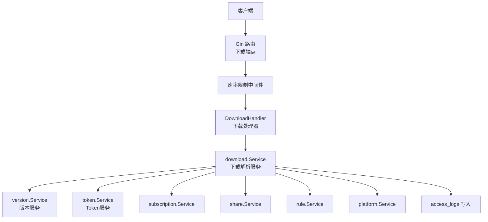
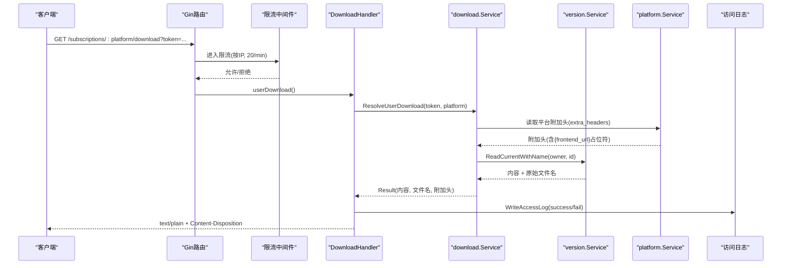
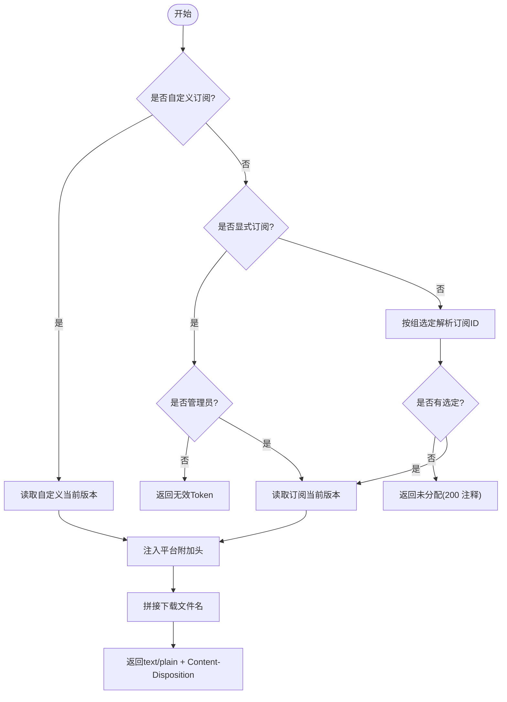
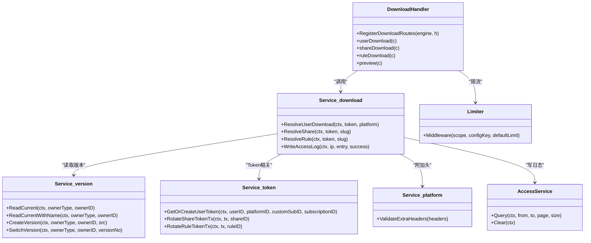

# 下载API

<cite>
**本文引用的文件**
- [backend/internal/server/download.go](file://backend/internal/server/download.go)
- [backend/internal/download/download.go](file://backend/internal/download/download.go)
- [backend/internal/version/version.go](file://backend/internal/version/version.go)
- [backend/internal/token/token.go](file://backend/internal/token/token.go)
- [backend/internal/ratelimit/ratelimit.go](file://backend/internal/ratelimit/ratelimit.go)
- [backend/internal/log/access.go](file://backend/internal/log/access.go)
- [backend/internal/platform/platform.go](file://backend/internal/platform/platform.go)
- [backend/internal/share/share.go](file://backend/internal/share/share.go)
- [backend/internal/subscription/subscription.go](file://backend/internal/subscription/subscription.go)
- [backend/internal/rule/rule.go](file://backend/internal/rule/rule.go)
- [frontend/src/api/subscription.ts](file://frontend/src/api/subscription.ts)
- [frontend/src/api/rule.ts](file://frontend/src/api/rule.ts)
- [frontend/src/api/share.ts](file://frontend/src/api/share.ts)
- [README.md](file://README.md)
</cite>

## 目录
1. [简介](#简介)
2. [项目结构](#项目结构)
3. [核心组件](#核心组件)
4. [架构总览](#架构总览)
5. [详细组件分析](#详细组件分析)
6. [依赖关系分析](#依赖关系分析)
7. [性能与限制](#性能与限制)
8. [安全特性](#安全特性)
9. [客户端配置示例](#客户端配置示例)
10. [故障排除指南](#故障排除指南)
11. [结论](#结论)

## 简介
本文件面向“订阅分发、规则分发、分享链接访问”的下载API，覆盖认证方式（匿名访问、Token验证）、文件类型支持、下载统计、订阅分发机制、版本选择逻辑、客户端适配、速率限制、防盗链、访问日志等。文档同时提供不同客户端的配置示例与常见问题排查方法。

## 项目结构
后端采用分层设计：
- 接入层：Gin路由注册下载端点，统一限流、禁缓存、响应头设置与访问日志记录。
- 服务层：下载解析服务负责按Token解析目标资源、附加平台级响应头、构造文件名与内容。
- 版本服务：统一管理四类资源的版本创建、切换、读取与清理。
- Token服务：管理用户下载Token、分享Token、规则Token的生成、轮替与吊销。
- 业务服务：订阅池、分享、规则、平台等业务能力。
- 安全与可观测性：速率限制中间件、访问日志服务。

图表来源
- [backend/internal/server/download.go:24-30](file://backend/internal/server/download.go#L24-L30)
- [backend/internal/download/download.go:25-35](file://backend/internal/download/download.go#L25-L35)
- [backend/internal/version/version.go:50-59](file://backend/internal/version/version.go#L50-L59)
- [backend/internal/token/token.go:19-27](file://backend/internal/token/token.go#L19-L27)

章节来源
- [backend/internal/server/download.go:24-30](file://backend/internal/server/download.go#L24-L30)
- [backend/internal/download/download.go:25-35](file://backend/internal/download/download.go#L25-L35)

## 核心组件
- 下载处理器（DownloadHandler）：注册并处理三类下载端点与预览接口，统一限流、禁用缓存、设置Content-Disposition与平台附加头，记录访问日志。
- 下载解析服务（download.Service）：根据Token解析用户订阅、分享订阅、规则；注入平台附加头；计算下载文件名；写访问日志。
- 版本服务（version.Service）：以DB为权威源维护当前版本指针，提供读当前版本、创建/切换/删除版本、启动自检等能力。
- Token服务（token.Service）：为用户、分享、规则生成/轮替/吊销Token，保证并发安全与幂等。
- 平台服务（platform.Service）：管理平台元数据与附加响应头，校验头键值合法性，防止响应头注入。
- 访问日志服务（log.AccessService）：查询与清空访问日志，供审计与排障。

章节来源
- [backend/internal/server/download.go:16-30](file://backend/internal/server/download.go#L16-L30)
- [backend/internal/download/download.go:25-51](file://backend/internal/download/download.go#L25-L51)
- [backend/internal/version/version.go:50-69](file://backend/internal/version/version.go#L50-L69)
- [backend/internal/token/token.go:19-27](file://backend/internal/token/token.go#L19-L27)
- [backend/internal/platform/platform.go:36-59](file://backend/internal/platform/platform.go#L36-L59)
- [backend/internal/log/access.go:16-39](file://backend/internal/log/access.go#L16-L39)

## 架构总览
下载请求从客户端进入，经Gin路由分组后由限流中间件保护，再由DownloadHandler调用download.Service进行解析，最终通过version.Service读取当前版本内容并返回。平台附加头在解析阶段注入，文件名由资源名与原始扩展名拼接。所有成功/失败均写入访问日志。

图表来源
- [backend/internal/server/download.go:38-68](file://backend/internal/server/download.go#L38-L68)
- [backend/internal/download/download.go:53-117](file://backend/internal/download/download.go#L53-L117)
- [backend/internal/version/version.go:394-426](file://backend/internal/version/version.go#L394-L426)
- [backend/internal/platform/platform.go:232-245](file://backend/internal/platform/platform.go#L232-L245)
- [backend/internal/log/access.go:41-92](file://backend/internal/log/access.go#L41-L92)

## 详细组件分析

### 下载端点与认证方式
- 订阅下载：GET /subscriptions/:platform/download?token=...
  - 认证：基于Token验证；路径中的平台标识必须与Token绑定一致，否则视为无效Token。
  - 未分配：当用户在该平台无组选定且无自定义时，返回HTTP 200纯文本注释块（提示未分配）。
  - 无版本：返回404，并在访问日志中标记fail_reason=version_missing。
- 分享下载：GET /share/:slug/download?token=...
  - 认证：基于分享Token与slug匹配；表缺失或Token无效等同无效Token。
  - 文件名：使用分享名称+原始扩展名。
- 规则下载：GET /rules/:slug/download?token=...
  - 认证：基于规则Token与slug匹配；表缺失或Token无效等同无效Token。
  - 文件名：使用规则名称+原始扩展名。
- 会话预览：GET /api/subscriptions/preview（需登录会话）
  - 管理员可指定subscription_id预览任意订阅；普通用户忽略该参数并按分发优先级返回。

章节来源
- [backend/internal/server/download.go:24-30](file://backend/internal/server/download.go#L24-L30)
- [backend/internal/server/download.go:38-68](file://backend/internal/server/download.go#L38-L68)
- [backend/internal/server/download.go:71-98](file://backend/internal/server/download.go#L71-L98)
- [backend/internal/server/download.go:100-127](file://backend/internal/server/download.go#L100-L127)
- [backend/internal/server/download.go:129-155](file://backend/internal/server/download.go#L129-L155)
- [backend/internal/download/download.go:53-117](file://backend/internal/download/download.go#L53-L117)
- [backend/internal/download/download.go:198-253](file://backend/internal/download/download.go#L198-L253)

### 订阅分发机制与版本选择
- 三态Token：
  - 自定义订阅：直接返回对应自定义内容。
  - 显式订阅：仅管理员可用，实时校验角色仍为管理员。
  - 无标识：按「用户所属组 → 组在该平台选定 → 内容」实时解析。
- 版本选择：
  - 以DB记录的current_version为准，读取对应版本文件；无版本则返回ErrVersionNotFound。
  - 文件名保留上传时的原始扩展名；若无扩展名则按类型补默认扩展名。
- 平台附加头：
  - 从平台配置读取extra_headers，支持{frontend_url}占位符替换，用于客户端重定向或回调。

图表来源
- [backend/internal/download/download.go:53-117](file://backend/internal/download/download.go#L53-L117)
- [backend/internal/version/version.go:394-426](file://backend/internal/version/version.go#L394-L426)
- [backend/internal/platform/platform.go:232-245](file://backend/internal/platform/platform.go#L232-L245)

章节来源
- [backend/internal/download/download.go:53-117](file://backend/internal/download/download.go#L53-L117)
- [backend/internal/version/version.go:394-426](file://backend/internal/version/version.go#L394-L426)
- [backend/internal/platform/platform.go:232-245](file://backend/internal/platform/platform.go#L232-L245)

### 分享与规则下载
- 分享：
  - 创建时自动生成Token；支持刷新与吊销；列表仅在active时返回Token。
  - 下载时校验share_tokens与share_subscriptions的slug一致性。
- 规则：
  - 创建时自动生成全局共享Token；支持刷新；列表包含刷新时间。
  - 下载时校验rule_tokens与rules的slug一致性。

章节来源
- [backend/internal/share/share.go:47-83](file://backend/internal/share/share.go#L47-L83)
- [backend/internal/share/share.go:112-145](file://backend/internal/share/share.go#L112-L145)
- [backend/internal/share/share.go:177-203](file://backend/internal/share/share.go#L177-L203)
- [backend/internal/rule/rule.go:51-102](file://backend/internal/rule/rule.go#L51-L102)
- [backend/internal/rule/rule.go:131-164](file://backend/internal/rule/rule.go#L131-L164)
- [backend/internal/rule/rule.go:166-192](file://backend/internal/rule/rule.go#L166-L192)

### 访问日志与下载统计
- 每次下载成功/失败均记录access_logs，字段包括用户ID、IP、下载类型、平台、资源标识、状态、失败原因、时间。
- 失败原因包括token_invalid、unassigned、version_missing等。
- 支持按日期范围分页查询与清空。

章节来源
- [backend/internal/download/download.go:275-302](file://backend/internal/download/download.go#L275-L302)
- [backend/internal/log/access.go:41-92](file://backend/internal/log/access.go#L41-L92)

## 依赖关系分析
- DownloadHandler依赖download.Service、ratelimit.Limiter、session中间件。
- download.Service依赖store.Store、version.Service、config.Service、slog.Logger。
- version.Service依赖store.Store、文件系统、slog.Logger。
- token.Service依赖store.Store、slog.Logger。
- platform.Service依赖store.Store、version.Service、slog.Logger。
- log.AccessService依赖*sql.DB、slog.Logger。

图表来源
- [backend/internal/server/download.go:16-30](file://backend/internal/server/download.go#L16-L30)
- [backend/internal/download/download.go:25-51](file://backend/internal/download/download.go#L25-L51)
- [backend/internal/version/version.go:50-69](file://backend/internal/version/version.go#L50-L69)
- [backend/internal/token/token.go:19-27](file://backend/internal/token/token.go#L19-L27)
- [backend/internal/platform/platform.go:36-59](file://backend/internal/platform/platform.go#L36-L59)
- [backend/internal/log/access.go:16-39](file://backend/internal/log/access.go#L16-L39)

## 性能与限制
- 速率限制：下载端点按IP固定窗口限流，默认20次/分钟，可通过系统配置动态调整；超限返回Retry-After。
- 内容大小：版本内容最大50MB；安装包最大300MB。
- 版本数量：每份资源最多保留5个版本，超出自动驱逐最旧非激活版本。
- 并发安全：版本创建/切换在BEGIN IMMEDIATE事务内完成，symlink原子替换；Token创建复用键先查后建，冲突重试。
- 缓存控制：下载端点强制no-store/no-cache，避免CDN/浏览器缓存导致配置过期。

章节来源
- [backend/internal/ratelimit/ratelimit.go:17-59](file://backend/internal/ratelimit/ratelimit.go#L17-L59)
- [backend/internal/version/version.go:25-38](file://backend/internal/version/version.go#L25-L38)
- [backend/internal/version/version.go:125-180](file://backend/internal/version/version.go#L125-L180)
- [backend/internal/token/token.go:48-88](file://backend/internal/token/token.go#L48-L88)
- [backend/internal/server/download.go:32-36](file://backend/internal/server/download.go#L32-L36)

## 安全特性
- 认证方式：
  - 匿名访问：分享与规则下载通过独立Token实现匿名访问。
  - Token验证：用户订阅下载需携带有效Token，且路径平台标识必须与Token绑定一致。
- 防盗链：
  - Token与slug双重校验，防止跨资源访问。
  - 平台附加头键值严格校验，防止响应头注入。
- 访问日志：
  - 全量记录下载请求的成功/失败及失败原因，便于审计与排障。
- 速率限制：
  - 按IP限流，防止滥用与DDoS。

章节来源
- [backend/internal/download/download.go:53-117](file://backend/internal/download/download.go#L53-L117)
- [backend/internal/download/download.go:198-253](file://backend/internal/download/download.go#L198-L253)
- [backend/internal/platform/platform.go:232-245](file://backend/internal/platform/platform.go#L232-L245)
- [backend/internal/ratelimit/ratelimit.go:17-59](file://backend/internal/ratelimit/ratelimit.go#L17-L59)
- [backend/internal/log/access.go:41-92](file://backend/internal/log/access.go#L41-L92)

## 客户端配置示例
以下为常见客户端的下载配置示例（请替换域名、端口与Token）：

- Clash Verge / Clash Meta
  - 订阅URL：https://your-domain.com/subscriptions/clash-verge/download?token=YOUR_TOKEN
  - 说明：服务端会返回text/plain，Clash系列客户端可直接导入；若平台配置了附加头（如重定向），客户端将遵循。

- v2rayNG
  - 订阅URL：https://your-domain.com/subscriptions/v2rayng/download?token=YOUR_TOKEN
  - 说明：v2rayNG支持YAML/JSON订阅格式；服务端保留原始扩展名，便于客户端识别。

- Shadowrocket
  - 分流规则URL：https://your-domain.com/rules/shadowrocket-rule/download?token=YOUR_RULE_TOKEN
  - 说明：规则类型为.conf；Shadowrocket可通过URL直接导入规则。

- 分享链接（匿名）
  - 分享订阅URL：https://your-domain.com/share/share-slug/download?token=SHARE_TOKEN
  - 规则URL：https://your-domain.com/rules/rule-slug/download?token=RULE_TOKEN
  - 说明：无需登录即可访问，适合临时访客或公开分发。

前端API参考：
- 订阅管理：[frontend/src/api/subscription.ts](file://frontend/src/api/subscription.ts)
- 规则管理：[frontend/src/api/rule.ts](file://frontend/src/api/rule.ts)
- 分享管理：[frontend/src/api/share.ts](file://frontend/src/api/share.ts)

章节来源
- [frontend/src/api/subscription.ts:25-35](file://frontend/src/api/subscription.ts#L25-L35)
- [frontend/src/api/rule.ts:16-27](file://frontend/src/api/rule.ts#L16-L27)
- [frontend/src/api/share.ts:14-21](file://frontend/src/api/share.ts#L14-L21)

## 故障排除指南
- 404 资源不存在
  - 可能原因：Token无效、平台标识不匹配、无版本、分享/规则表缺失。
  - 排查：检查Token是否正确；确认路径中的平台/资源slug与Token绑定一致；确认已创建并激活版本。
- 200 未分配
  - 可能原因：用户在该平台无自定义订阅且无组选定。
  - 排查：确认用户所属组已在该平台选定订阅；或上传自定义订阅覆盖。
- 访问频繁被限流
  - 现象：收到Retry-After提示。
  - 排查：降低拉取频率；调整系统配置中的下载限流阈值。
- 客户端无法更新
  - 现象：客户端长时间未获取新配置。
  - 排查：确认订阅链接长期有效；检查客户端定时策略；查看访问日志确认请求是否成功。
- 附件头异常
  - 现象：客户端重定向或行为异常。
  - 排查：检查平台附加头键值是否符合规范；确保{frontend_url}占位符正确替换。

章节来源
- [backend/internal/server/download.go:38-68](file://backend/internal/server/download.go#L38-L68)
- [backend/internal/server/download.go:71-98](file://backend/internal/server/download.go#L71-L98)
- [backend/internal/server/download.go:100-127](file://backend/internal/server/download.go#L100-L127)
- [backend/internal/ratelimit/ratelimit.go:40-59](file://backend/internal/ratelimit/ratelimit.go#L40-L59)
- [backend/internal/log/access.go:41-92](file://backend/internal/log/access.go#L41-L92)

## 结论
本下载API通过Token认证与平台附加头机制，实现了安全的订阅、规则与分享分发；版本服务确保以DB为权威源的一致性；速率限制与访问日志提供了必要的防护与可观测性。结合多客户端支持与完善的故障排除指南，可满足团队或个人对VPN订阅集中管理与分发的需求。