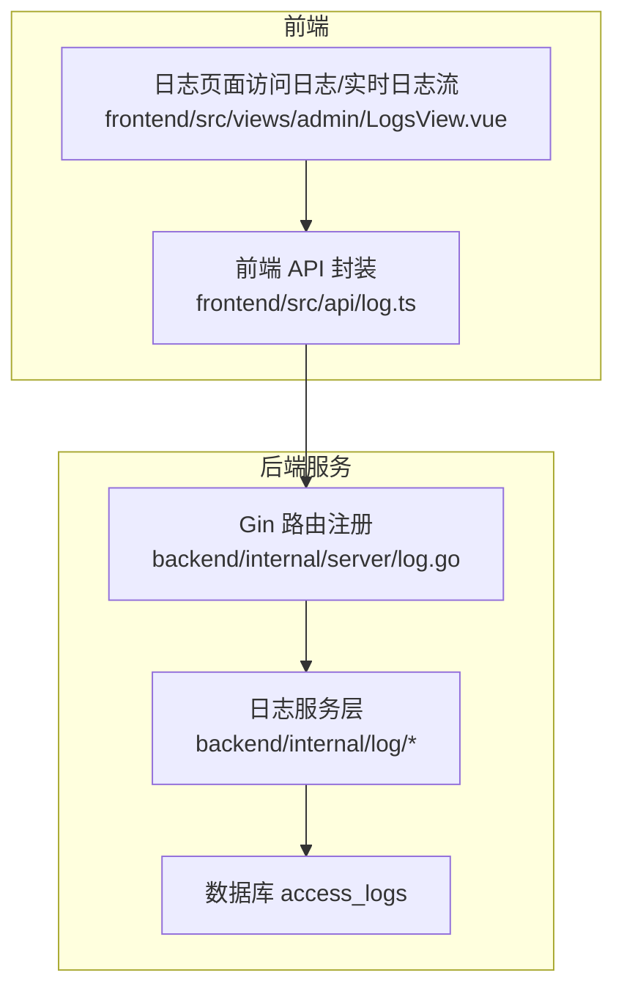
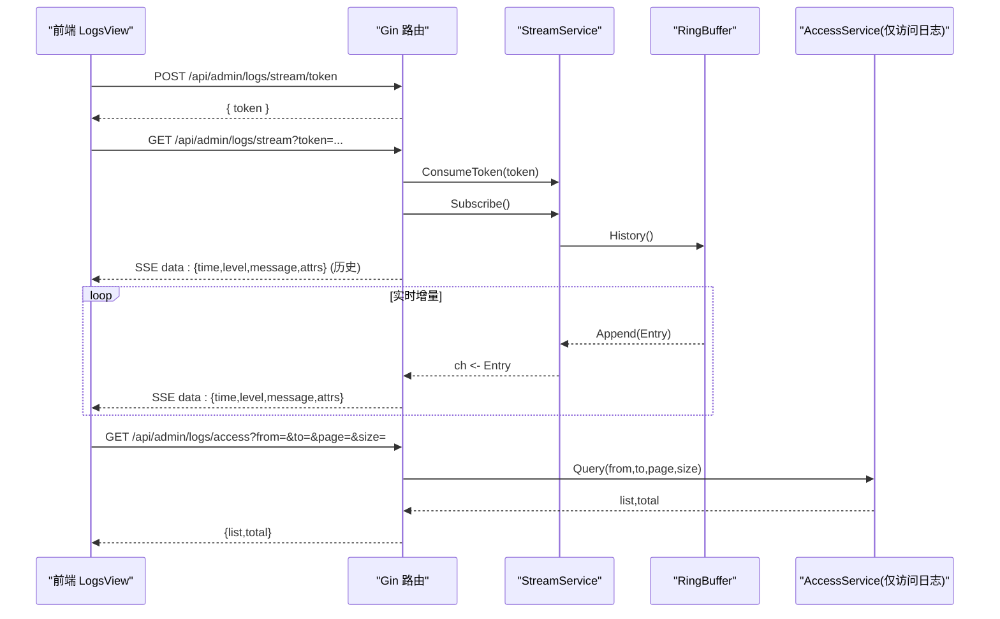
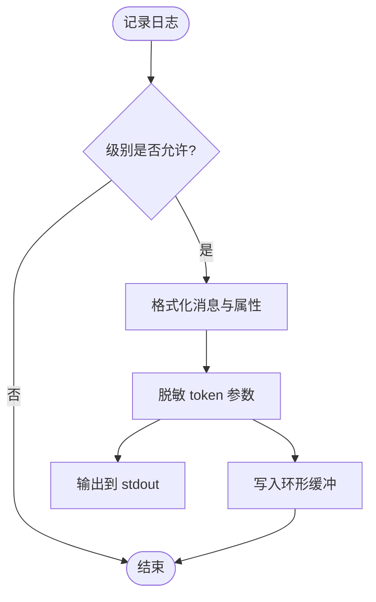
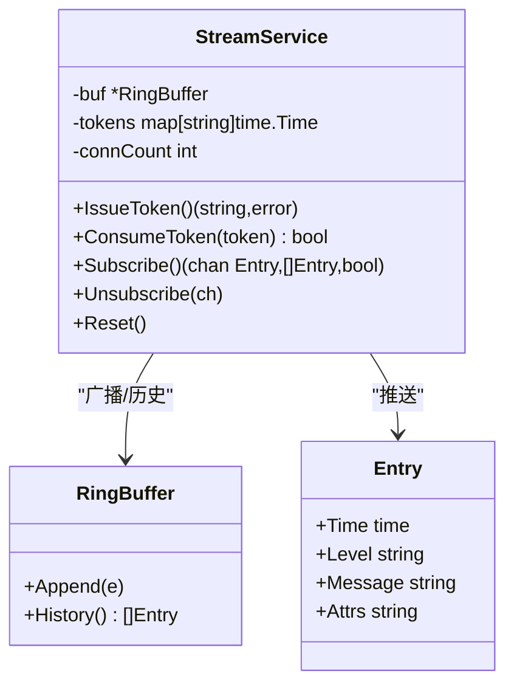
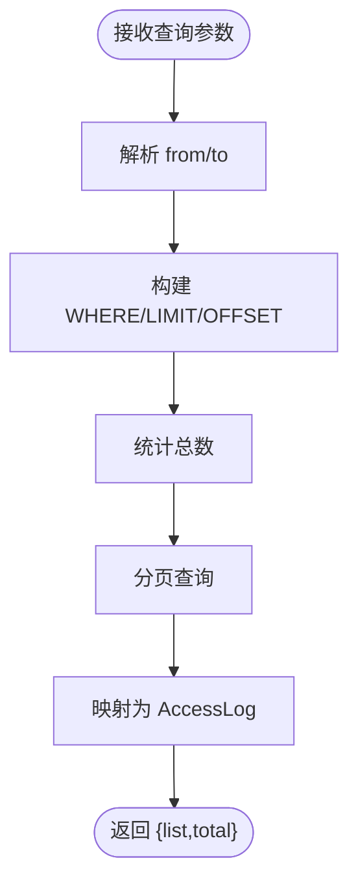
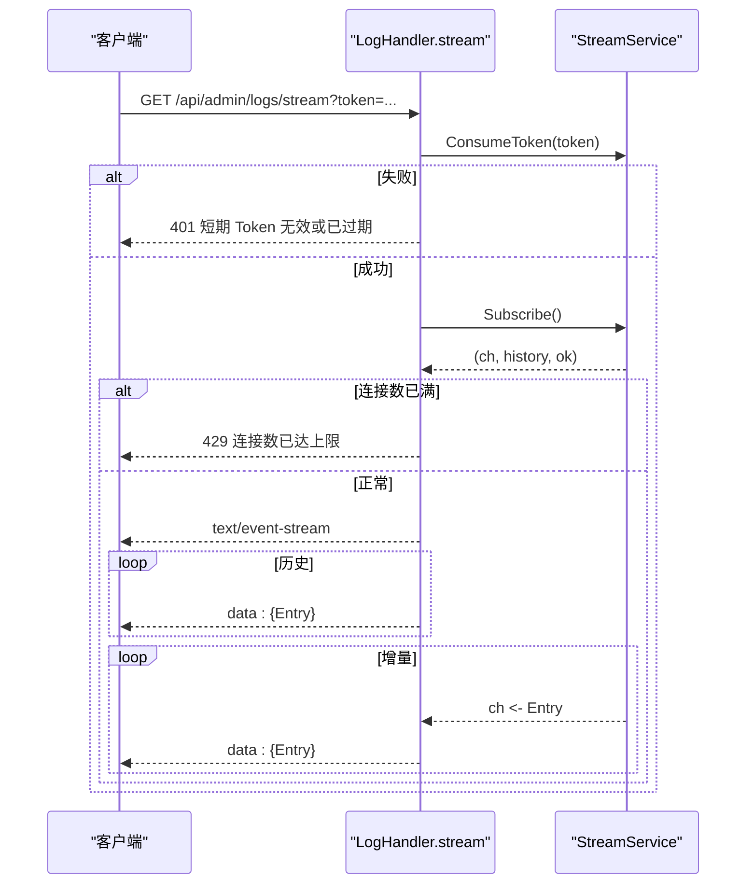
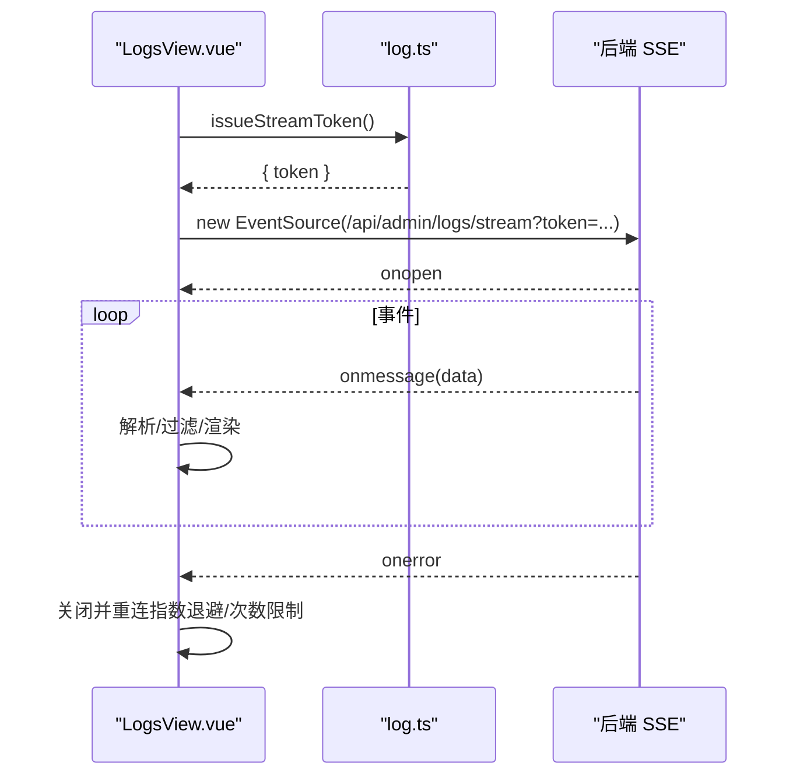
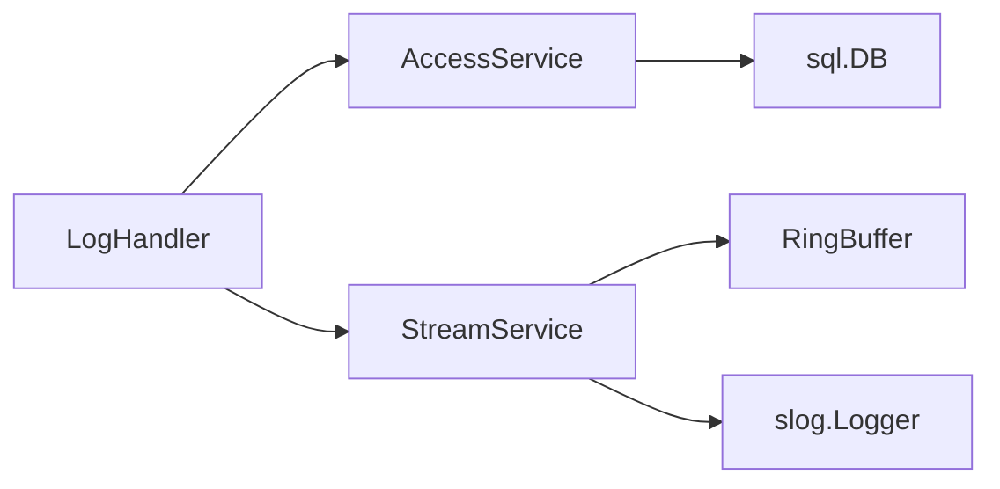

# 实时日志API

<cite>
**本文引用的文件**
- [backend/internal/log/log.go](file://backend/internal/log/log.go)
- [backend/internal/log/stream.go](file://backend/internal/log/stream.go)
- [backend/internal/log/access.go](file://backend/internal/log/access.go)
- [backend/internal/server/log.go](file://backend/internal/server/log.go)
- [frontend/src/api/log.ts](file://frontend/src/api/log.ts)
- [frontend/src/views/admin/LogsView.vue](file://frontend/src/views/admin/LogsView.vue)
- [backend/internal/config/config.go](file://backend/internal/config/config.go)
</cite>

## 目录
1. [简介](#简介)
2. [项目结构](#项目结构)
3. [核心组件](#核心组件)
4. [架构总览](#架构总览)
5. [详细组件分析](#详细组件分析)
6. [依赖关系分析](#依赖关系分析)
7. [性能与存储策略](#性能与存储策略)
8. [故障诊断与排错](#故障诊断与排错)
9. [结论](#结论)
10. [附录：接口与消息规范](#附录接口与消息规范)

## 简介
本文件面向“实时日志API”的完整技术文档，覆盖以下能力：
- SSE（Server-Sent Events）连接建立、日志流订阅、断线重连机制
- 访问日志查询（按日期范围、分页）、清空
- 日志级别管理（运行时切换）
- 内存环形缓冲与历史回放
- 一次性短期 Token 鉴权（适配 EventSource 无法带 Header 的限制）
- 前端集成示例与监控面板使用方式
- 性能优化建议与常见问题排查

## 项目结构
后端采用 Go + Gin 框架，日志子系统位于 backend/internal/log；HTTP 路由在 backend/internal/server；前端通过 Vue + Ant Design Vue 提供可视化界面。

**图表来源**
- [backend/internal/server/log.go:21-30](file://backend/internal/server/log.go#L21-L30)
- [backend/internal/log/access.go:16-25](file://backend/internal/log/access.go#L16-L25)
- [frontend/src/api/log.ts:24-29](file://frontend/src/api/log.ts#L24-L29)
- [frontend/src/views/admin/LogsView.vue:1-10](file://frontend/src/views/admin/LogsView.vue#L1-L10)

**章节来源**
- [backend/internal/server/log.go:21-30](file://backend/internal/server/log.go#L21-L30)
- [backend/internal/log/access.go:16-25](file://backend/internal/log/access.go#L16-L25)
- [frontend/src/api/log.ts:24-29](file://frontend/src/api/log.ts#L24-L29)
- [frontend/src/views/admin/LogsView.vue:1-10](file://frontend/src/views/admin/LogsView.vue#L1-L10)

## 核心组件
- 结构化日志与脱敏：支持 console/json 双格式输出，运行时级别切换，token 参数自动脱敏
- 实时日志流：内存环形缓冲（最近 500 条），SSE 推送，一次性短期 Token 鉴权，全局 8 连接上限
- 访问日志：按日期范围分页查询、清空，关联用户名展示
- 配置：log_level 等系统配置键

**章节来源**
- [backend/internal/log/log.go:21-57](file://backend/internal/log/log.go#L21-L57)
- [backend/internal/log/stream.go:16-28](file://backend/internal/log/stream.go#L16-L28)
- [backend/internal/log/access.go:16-41](file://backend/internal/log/access.go#L16-L41)
- [backend/internal/config/config.go:24-37](file://backend/internal/config/config.go#L24-L37)

## 架构总览
整体流程：
- 管理员通过前端“日志查看”页签进入
- 访问日志：调用 GET /api/admin/logs/access?from=&to=&page=&size= 进行分页查询
- 实时日志流：先 POST /api/admin/logs/stream/token 换取一次性短期 Token，再使用 EventSource 连接 GET /api/admin/logs/stream?token=...
- 后端将业务日志写入 stdout 的同时，经 RingHandler 写入内存环形缓冲；SSE 端点从缓冲中先回放历史，再推送增量
- 前端对事件进行解析、过滤、渲染，并实现断线重连

**图表来源**
- [backend/internal/server/log.go:21-30](file://backend/internal/server/log.go#L21-L30)
- [backend/internal/server/log.go:53-112](file://backend/internal/server/log.go#L53-L112)
- [backend/internal/log/stream.go:117-191](file://backend/internal/log/stream.go#L117-L191)
- [backend/internal/log/access.go:41-92](file://backend/internal/log/access.go#L41-L92)
- [frontend/src/views/admin/LogsView.vue:80-115](file://frontend/src/views/admin/LogsView.vue#L80-L115)

## 详细组件分析

### 结构化日志与脱敏（log.go）
- 支持运行时级别切换（debug/info/warn/error），立即生效
- 支持 console 与 json 两种输出格式
- 外层 RedactHandler 对消息与字符串属性中的 token 查询参数值统一替换为 ***，避免敏感信息泄露
- 可注入 RingBuffer 作为 Handler 链的一部分，使日志同时进入内存缓冲供 SSE 消费

**图表来源**
- [backend/internal/log/log.go:21-57](file://backend/internal/log/log.go#L21-L57)
- [backend/internal/log/log.go:62-117](file://backend/internal/log/log.go#L62-L117)

**章节来源**
- [backend/internal/log/log.go:21-57](file://backend/internal/log/log.go#L21-L57)
- [backend/internal/log/log.go:62-117](file://backend/internal/log/log.go#L62-L117)

### 实时日志流（stream.go）
- 环形缓冲：固定容量（默认 500 条），满后覆盖最旧；订阅者消费慢时丢弃新消息，防止阻塞日志管道
- 一次性短期 Token：随机生成，未使用 5 分钟过期，用后即删，保障安全
- 连接上限：全局最多 8 个 SSE 连接，超出返回 429
- 历史回放：新连接先推送缓冲历史，再推送增量
- 重置：一键清空时清理 Token、缓冲、断开全部活跃连接

**图表来源**
- [backend/internal/log/stream.go:16-28](file://backend/internal/log/stream.go#L16-L28)
- [backend/internal/log/stream.go:31-65](file://backend/internal/log/stream.go#L31-L65)
- [backend/internal/log/stream.go:117-208](file://backend/internal/log/stream.go#L117-L208)

**章节来源**
- [backend/internal/log/stream.go:16-28](file://backend/internal/log/stream.go#L16-L28)
- [backend/internal/log/stream.go:31-65](file://backend/internal/log/stream.go#L31-L65)
- [backend/internal/log/stream.go:117-208](file://backend/internal/log/stream.go#L117-L208)

### 访问日志查询（access.go）
- 支持按 from/to 日期范围筛选（YYYY-MM-DD），为空表示不限
- 后端分页：默认 size=20，最大 100；page 从 1 开始
- 联查 users 表获取 username，空用户显示空串
- 支持清空全部访问日志

**图表来源**
- [backend/internal/log/access.go:41-92](file://backend/internal/log/access.go#L41-L92)
- [backend/internal/log/access.go:103-122](file://backend/internal/log/access.go#L103-L122)

**章节来源**
- [backend/internal/log/access.go:41-92](file://backend/internal/log/access.go#L41-L92)
- [backend/internal/log/access.go:103-122](file://backend/internal/log/access.go#L103-L122)

### HTTP 路由与 SSE 处理（server/log.go）
- 路由分组：/api/admin/logs 下包含访问日志查询、清空、换 Token；/api/admin/logs/stream 独立注册以绕过会话中间件（EventSource 限制）
- SSE 处理：校验一次性 Token，订阅缓冲，先推历史，再推增量；客户端断开或请求取消即退出
- 错误码：401（Token 无效/过期）、429（连接数达上限）

**图表来源**
- [backend/internal/server/log.go:21-30](file://backend/internal/server/log.go#L21-L30)
- [backend/internal/server/log.go:53-112](file://backend/internal/server/log.go#L53-L112)

**章节来源**
- [backend/internal/server/log.go:21-30](file://backend/internal/server/log.go#L21-L30)
- [backend/internal/server/log.go:53-112](file://backend/internal/server/log.go#L53-L112)

### 前端集成（LogsView.vue 与 log.ts）
- 访问日志：调用 queryAccessLogs/clearAccessLogs，支持日期范围选择与分页
- 实时日志流：
  - 先调用 issueStreamToken 换取一次性 Token
  - 使用浏览器 EventSource 连接 /api/admin/logs/stream?token=...
  - onmessage 解析 JSON，支持级别过滤、暂停/继续、清屏、滚动跟随
  - onerror 触发重连逻辑，多次失败提示可能达到连接上限
- 数据模型：AccessLog、LogEntry 与后端一致

**图表来源**
- [frontend/src/views/admin/LogsView.vue:80-115](file://frontend/src/views/admin/LogsView.vue#L80-L115)
- [frontend/src/api/log.ts:24-29](file://frontend/src/api/log.ts#L24-L29)

**章节来源**
- [frontend/src/views/admin/LogsView.vue:80-115](file://frontend/src/views/admin/LogsView.vue#L80-L115)
- [frontend/src/api/log.ts:24-29](file://frontend/src/api/log.ts#L24-L29)

## 依赖关系分析
- LogHandler 依赖 AccessService 与 StreamService
- StreamService 依赖 RingBuffer 与 slog.Logger
- AccessService 依赖 sql.DB（避免循环依赖）
- 前端依赖后端 REST/SSE 接口，使用统一的 http 封装

**图表来源**
- [backend/internal/server/log.go:15-19](file://backend/internal/server/log.go#L15-L19)
- [backend/internal/log/stream.go:117-128](file://backend/internal/log/stream.go#L117-L128)
- [backend/internal/log/access.go:16-25](file://backend/internal/log/access.go#L16-L25)

**章节来源**
- [backend/internal/server/log.go:15-19](file://backend/internal/server/log.go#L15-L19)
- [backend/internal/log/stream.go:117-128](file://backend/internal/log/stream.go#L117-L128)
- [backend/internal/log/access.go:16-25](file://backend/internal/log/access.go#L16-L25)

## 性能与存储策略
- 内存环形缓冲：固定容量（默认 500 条），满后覆盖最旧；当底层数组容量超过阈值时进行紧凑化拷贝，防止内存缓慢膨胀
- 非阻塞广播：订阅者消费慢则丢弃新消息，避免阻塞日志主路径
- 连接上限：全局 8 个 SSE 连接，防止资源耗尽
- 一次性 Token：降低重放风险，未使用 5 分钟过期，用后即删
- 访问日志分页：默认 20 条/页，最大 100 条/页，减少单次响应体积
- 脱敏：所有日志输出前统一脱敏 token 参数，避免敏感信息泄露

[本节为通用性能讨论，不直接分析具体文件]

## 故障诊断与排错
- 401 短期 Token 无效或已过期：检查前端是否正确调用换 Token 接口并在有效期内建立连接
- 429 连接数已达上限：关闭其他日志页或浏览器标签，等待连接释放后重试
- 无日志输出：确认日志级别设置（log_level）与业务模块是否正常记录日志；检查 stdout 与缓冲是否被注入
- 前端重连频繁：检查网络稳定性与服务端连接上限；多次失败会提示可能达到连接上限
- 访问日志为空：确认日期范围是否正确；确认数据写入与定时清理任务是否生效

**章节来源**
- [backend/internal/server/log.go:63-72](file://backend/internal/server/log.go#L63-L72)
- [frontend/src/views/admin/LogsView.vue:99-115](file://frontend/src/views/admin/LogsView.vue#L99-L115)
- [backend/internal/config/config.go:24-37](file://backend/internal/config/config.go#L24-L37)

## 结论
该实时日志API通过“结构化日志 + 内存环形缓冲 + SSE 流式推送”的组合，提供了低延迟、高吞吐的日志观测能力；配合一次性短期 Token 与连接上限控制，兼顾了安全性与稳定性。访问日志的分页查询与清空功能满足日常运维需求。前端实现了直观的操作界面与断线重连机制，便于快速定位问题。

[本节为总结性内容，不直接分析具体文件]

## 附录：接口与消息规范

### 接口定义
- 获取访问日志
  - 方法：GET
  - 路径：/api/admin/logs/access
  - 查询参数：from（YYYY-MM-DD，可选）、to（YYYY-MM-DD，可选）、page（>=1，默认1）、size（1..100，默认20）
  - 响应体：{ list: AccessLog[], total: number }
- 清空访问日志
  - 方法：POST
  - 路径：/api/admin/logs/access/clear
  - 响应体：标准成功响应
- 换取一次性短期 Token
  - 方法：POST
  - 路径：/api/admin/logs/stream/token
  - 响应体：{ token: string }
- 订阅实时日志流（SSE）
  - 方法：GET
  - 路径：/api/admin/logs/stream
  - 查询参数：token（一次性短期 Token）
  - 响应类型：text/event-stream
  - 事件体：JSON，字段见下方消息格式

**章节来源**
- [backend/internal/server/log.go:21-30](file://backend/internal/server/log.go#L21-L30)
- [backend/internal/server/log.go:32-61](file://backend/internal/server/log.go#L32-L61)
- [backend/internal/server/log.go:63-112](file://backend/internal/server/log.go#L63-L112)
- [frontend/src/api/log.ts:24-29](file://frontend/src/api/log.ts#L24-L29)

### 消息格式
- 实时日志事件（data）
  - time: 时间戳
  - level: 日志级别（info/warn/error/debug）
  - message: 日志消息
  - attrs: 预格式化的键值对串（如 key=value key2=value2）

**章节来源**
- [backend/internal/log/stream.go:22-28](file://backend/internal/log/stream.go#L22-L28)
- [backend/internal/server/log.go:105-112](file://backend/internal/server/log.go#L105-L112)
- [frontend/src/api/log.ts:17-22](file://frontend/src/api/log.ts#L17-L22)

### 日志级别管理
- 运行时级别切换：通过 SetLevel 动态调整（debug/info/warn/error），立即生效
- 配置键：log_level（可通过系统配置持久化）

**章节来源**
- [backend/internal/log/log.go:21-33](file://backend/internal/log/log.go#L21-L33)
- [backend/internal/config/config.go:24-37](file://backend/internal/config/config.go#L24-L37)

### 前端监控集成示例
- 打开“日志查看”页面，切换到“实时日志流”页签
- 自动换取一次性 Token 并建立 SSE 连接
- 支持级别过滤、暂停/继续、清屏、滚动跟随
- 连接断开自动重连，多次失败提示连接上限

**章节来源**
- [frontend/src/views/admin/LogsView.vue:66-146](file://frontend/src/views/admin/LogsView.vue#L66-L146)