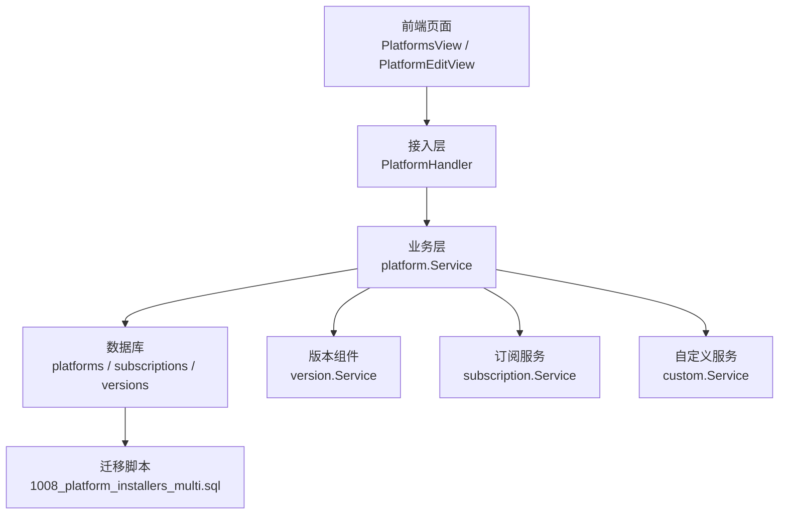
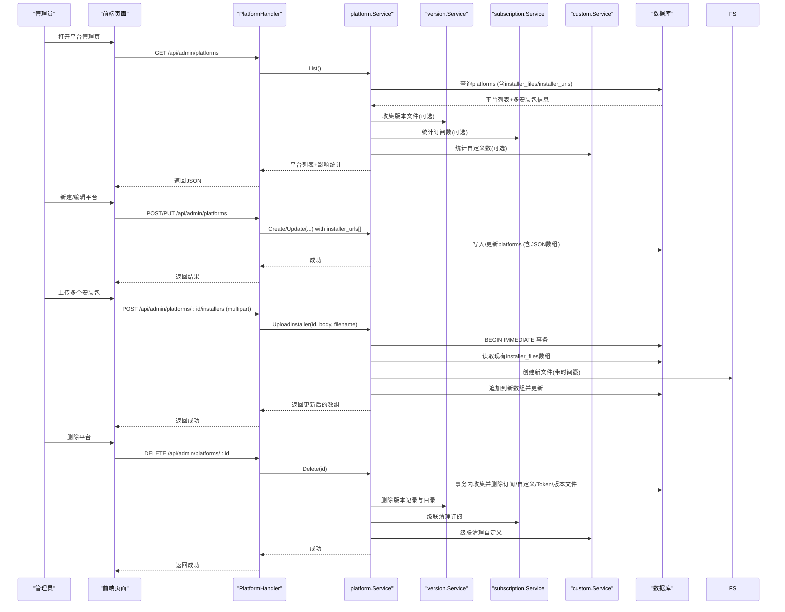
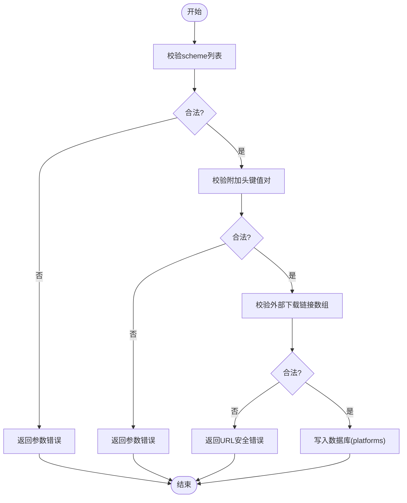
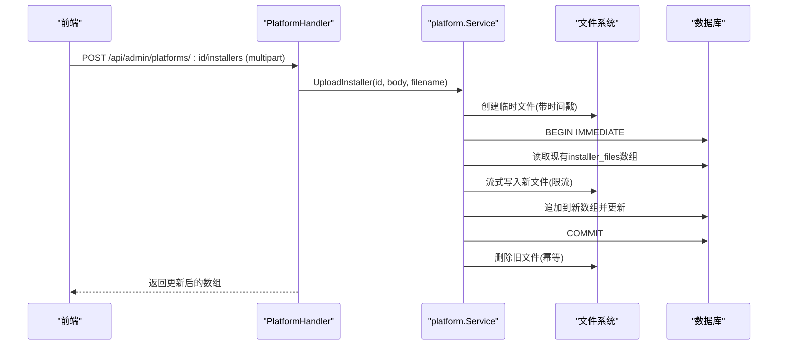
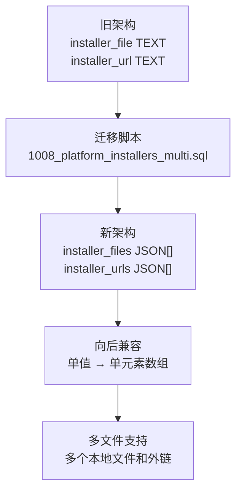
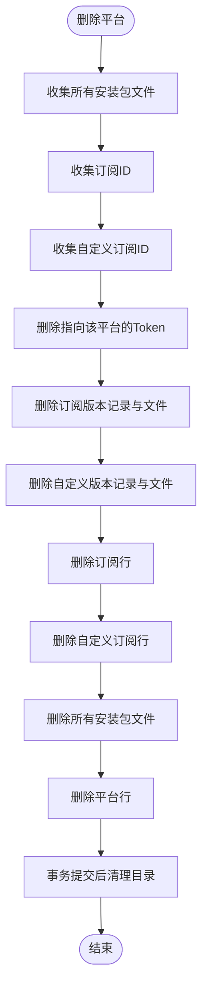
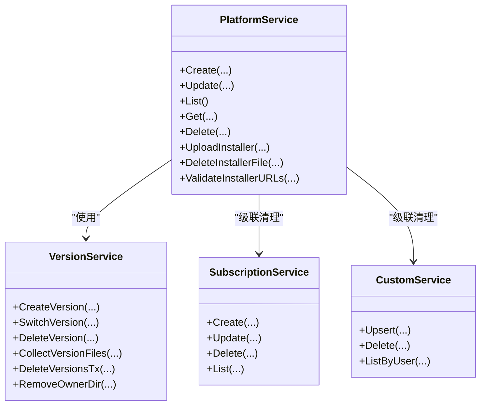

# 平台管理API

<cite>
**本文引用的文件**
- [backend/internal/platform/platform.go](file://backend/internal/platform/platform.go)
- [backend/internal/server/platform.go](file://backend/internal/server/platform.go)
- [backend/internal/subscription/subscription.go](file://backend/internal/subscription/subscription.go)
- [backend/internal/version/version.go](file://backend/internal/version/version.go)
- [backend/internal/custom/custom.go](file://backend/internal/custom/custom.go)
- [backend/migrations/1008_platform_installers_multi.sql](file://backend/migrations/1008_platform_installers_multi.sql)
- [frontend/src/api/platform.ts](file://frontend/src/api/platform.ts)
- [frontend/src/views/admin/PlatformEditView.vue](file://frontend/src/views/admin/PlatformEditView.vue)
- [backend/internal/setup/setup.go](file://backend/internal/setup/setup.go)
- [backend/internal/server/home.go](file://backend/internal/server/home.go)
</cite>

## 更新摘要
**所做更改**
- 更新了安装包数据结构从单值到数组的变更说明
- 新增了多本地文件和外部URL下载链接的支持
- 增强了URL安全验证和错误处理机制
- 更新了数据库迁移和API端点文档
- 添加了新的数据模型和校验规则说明

## 目录
1. [简介](#简介)
2. [项目结构](#项目结构)
3. [核心组件](#核心组件)
4. [架构总览](#架构总览)
5. [详细组件分析](#详细组件分析)
6. [依赖关系分析](#依赖关系分析)
7. [性能与一致性](#性能与一致性)
8. [故障排查指南](#故障排查指南)
9. [结论](#结论)
10. [附录：API 参考与最佳实践](#附录api-参考与最佳实践)

## 简介
本文件面向"VPN订阅管理系统"的平台管理API，覆盖平台创建、编辑、删除、安装包上传/删除、附加响应头配置、平台与订阅的关联关系、版本兼容性检查、平台模板（默认平台）以及自定义平台扩展机制。**最新更新**：API现已支持基于数组的安装包数据结构，允许多个本地文件和外部URL下载链接，并增强了URL安全性验证和错误处理机制。文档同时提供不同VPN客户端平台（如Clash、V2Ray等）的配置示例与最佳实践，帮助管理员快速搭建并维护多平台订阅分发能力。

## 项目结构
平台管理功能由后端服务层、接入层、前端页面与数据库迁移共同构成：
- 业务层：platform.Service 负责平台CRUD、scheme与附加头校验、安装包流式上传/删除、级联删除。
- 接入层：server.PlatformHandler 暴露REST端点，统一鉴权与错误映射。
- 版本组件：version.Service 为订阅/自定义等资源提供版本化存储与当前指针切换。
- 订阅与自定义：subscription.Service 与 custom.Service 体现平台与订阅/自定义的关联与级联清理。
- 前端：PlatformsView 与 PlatformEditView 提供可视化操作；platform.ts 封装HTTP调用。
- 迁移：1008_platform_installers_multi.sql 实现了从单值到数组的数据结构升级。

**图表来源**
- [backend/internal/server/platform.go:20-30](file://backend/internal/server/platform.go#L20-L30)
- [backend/internal/platform/platform.go:36-46](file://backend/internal/platform/platform.go#L36-L46)
- [backend/internal/version/version.go:50-59](file://backend/internal/version/version.go#L50-L59)
- [backend/internal/subscription/subscription.go:28-41](file://backend/internal/subscription/subscription.go#L28-L41)
- [backend/internal/custom/custom.go:23-33](file://backend/internal/custom/custom.go#L23-33)
- [backend/migrations/1008_platform_installers_multi.sql:1-14](file://backend/migrations/1008_platform_installers_multi.sql#L1-L14)

**章节来源**
- [backend/internal/server/platform.go:20-30](file://backend/internal/server/platform.go#L20-L30)
- [backend/internal/platform/platform.go:36-46](file://backend/internal/platform/platform.go#L36-L46)
- [backend/internal/version/version.go:50-59](file://backend/internal/version/version.go#L50-L59)
- [backend/internal/subscription/subscription.go:28-41](file://backend/internal/subscription/subscription.go#L28-L41)
- [backend/internal/custom/custom.go:23-33](file://backend/internal/custom/custom.go#L23-L33)
- [backend/migrations/1008_platform_installers_multi.sql:1-14](file://backend/migrations/1008_platform_installers_multi.sql#L1-L14)

## 核心组件
- **平台资源模型**：包含标识slug、名称、描述、有序scheme列表、附加响应头、**多个本地安装包文件**与**多个外部下载链接**、级联影响统计。
- **平台服务**：实现Create/Update/List/Get/Delete、UploadInstaller/DeleteInstallerFile、级联删除与影响统计。
- **接入处理器**：注册REST路由，参数校验、错误映射、流式文件上传。
- **版本组件**：提供版本创建、切换、删除、当前指针同步、启动自检与目录清理。
- **订阅与自定义**：体现平台与订阅/自定义的关联，支持按平台维度进行级联清理。

**章节来源**
- [backend/internal/platform/platform.go:48-66](file://backend/internal/platform/platform.go#L48-L66)
- [backend/internal/server/platform.go:14-30](file://backend/internal/server/platform.go#L14-L30)
- [backend/internal/version/version.go:61-79](file://backend/internal/version/version.go#L61-L79)
- [backend/internal/subscription/subscription.go:59-75](file://backend/internal/subscription/subscription.go#L59-L75)
- [backend/internal/custom/custom.go:35-43](file://backend/internal/custom/custom.go#L35-L43)

## 架构总览
平台管理的请求流程从前端发起，经Gin路由进入接入层，再委托业务层完成数据持久化与文件落盘，必要时联动版本组件与订阅/自定义服务执行级联操作。**新增的多安装包支持允许同时管理多个本地文件和外部下载链接**。

**图表来源**
- [backend/internal/server/platform.go:20-30](file://backend/internal/server/platform.go#L20-L30)
- [backend/internal/platform/platform.go:68-119](file://backend/internal/platform/platform.go#L68-L119)
- [backend/internal/platform/platform.go:269-334](file://backend/internal/platform/platform.go#L269-L334)
- [backend/internal/platform/platform.go:385-474](file://backend/internal/platform/platform.go#L385-L474)
- [backend/internal/version/version.go:125-180](file://backend/internal/version/version.go#L125-L180)
- [backend/internal/subscription/subscription.go:165-231](file://backend/internal/subscription/subscription.go#L165-L231)
- [backend/internal/custom/custom.go:45-104](file://backend/internal/custom/custom.go#L45-L104)

## 详细组件分析

### 平台CRUD与校验
- 创建平台：自动生成slug（platform-前缀），校验scheme与附加头，**验证外部下载链接数组**，写入platforms表。
- 编辑平台：slug只读，可改名称/描述/scheme/附加头/**外部下载链接数组**。
- 获取平台：回显详情，含**多个安装包文件和外链状态**。
- 列表：返回平台列表，附带删除预览影响统计（订阅/Token/自定义数量）。
- **新增校验规则**：
  - scheme：有序数组，值含{url}占位符，禁止控制字符与空项。
  - 附加头：键符合HTTP头名规范，键与值禁止控制字符，值支持{frontend_url}占位符。
  - **外部下载链接**：仅支持http/https协议，禁止javascript等伪协议，禁止控制字符，地址不能为空。

**图表来源**
- [backend/internal/platform/platform.go:68-99](file://backend/internal/platform/platform.go#L68-L99)
- [backend/internal/platform/platform.go:219-254](file://backend/internal/platform/platform.go#L219-L254)
- [backend/internal/platform/platform.go:270-291](file://backend/internal/platform/platform.go#L270-L291)

**章节来源**
- [backend/internal/platform/platform.go:68-119](file://backend/internal/platform/platform.go#L68-L119)
- [backend/internal/platform/platform.go:219-254](file://backend/internal/platform/platform.go#L219-L254)
- [backend/internal/platform/platform.go:270-291](file://backend/internal/platform/platform.go#L270-L291)

### 多安装包管理与URL安全验证
- **多本地文件上传**：流式落盘，限制≤300MB；文件名带时间戳以突破CDN缓存；事务内读现有数组→生成唯一新名→写新文件→追加到数组→提交后删旧文件；并发安全（O_EXCL + 重试）。
- **多外部下载链接**：支持多个http/https地址，每个链接可设置展示名，增强URL安全性验证。
- **URL安全验证**：
  - 仅允许http/https协议，拒绝javascript:、ftp:等危险协议
  - 禁止控制字符防止注入攻击
  - 地址不能为空，自动去除首尾空白
  - 展示名长度限制（最大200字符）

**图表来源**
- [backend/internal/server/platform.go:137-163](file://backend/internal/server/platform.go#L137-L163)
- [backend/internal/platform/platform.go:269-334](file://backend/internal/platform/platform.go#L269-L334)
- [backend/internal/platform/platform.go:270-291](file://backend/internal/platform/platform.go#L270-L291)

**章节来源**
- [backend/internal/server/platform.go:137-163](file://backend/internal/server/platform.go#L137-L163)
- [backend/internal/platform/platform.go:269-334](file://backend/internal/platform/platform.go#L269-L334)
- [backend/internal/platform/platform.go:270-291](file://backend/internal/platform/platform.go#L270-L291)

### 数据库架构升级
- **数据结构变更**：从单值列 `installer_file`/`installer_url` 升级到JSON数组列 `installer_files`/`installer_urls`
- **向后兼容**：自动迁移存量数据，将单值转换为单元素数组
- **字段定义**：
  - `installer_files`: `[{"name": "原始文件名", "file": "磁盘文件名"}]`
  - `installer_urls`: `[{"name": "展示名", "url": "外部地址"}]`

**图表来源**
- [backend/migrations/1008_platform_installers_multi.sql:1-14](file://backend/migrations/1008_platform_installers_multi.sql#L1-L14)

**章节来源**
- [backend/migrations/1008_platform_installers_multi.sql:1-14](file://backend/migrations/1008_platform_installers_multi.sql#L1-L14)

### 平台删除与级联清理
- 删除平台：事务内收集并删除该平台全部订阅（含版本文件）、下载Token、自定义订阅（含版本文件）、**所有安装包文件**、组在该平台的关联与选定、安装包文件；平台删除后不置needs_reselect标记。
- 影响统计：列表接口附带cascade计数，便于前端二次确认。

**图表来源**
- [backend/internal/platform/platform.go:385-474](file://backend/internal/platform/platform.go#L385-L474)
- [backend/internal/version/version.go:491-515](file://backend/internal/version/version.go#L491-L515)
- [backend/internal/subscription/subscription.go:276-332](file://backend/internal/subscription/subscription.go#L276-L332)
- [backend/internal/custom/custom.go:116-145](file://backend/internal/custom/custom.go#L116-L145)

**章节来源**
- [backend/internal/platform/platform.go:385-474](file://backend/internal/platform/platform.go#L385-L474)
- [backend/internal/version/version.go:491-515](file://backend/internal/version/version.go#L491-L515)
- [backend/internal/subscription/subscription.go:276-332](file://backend/internal/subscription/subscription.go#L276-L332)
- [backend/internal/custom/custom.go:116-145](file://backend/internal/custom/custom.go#L116-L145)

### 平台模板与默认平台
- 系统初始化时预置三个默认平台：Clash Verge、v2rayNG、Shadowrocket，各自内置导入scheme与附加响应头（Clash Verge预置三条兼容头）。
- 新增平台后UI引导管理员为各用户组设置该平台的默认订阅，避免"未分配"状态。

**章节来源**
- [backend/internal/setup/setup.go:144-157](file://backend/internal/setup/setup.go#L144-L157)
- [frontend/src/views/admin/PlatformsView.vue:30-35](file://frontend/src/views/admin/PlatformsView.vue#L30-L35)

### 前端交互与表单校验
- 列表页：双态展示（表格/卡片），显示名称、标识、scheme数量、**多个安装包状态**；删除前展示影响清单。
- 编辑页：支持scheme拖拽排序（首项为一键导入默认方式）、附加头动态行（控制字符即时校验）、**多安装包上传**（进度条）与**多外链输入框**并存。
- **新增功能**：外部下载链接的动态添加/删除，URL格式实时验证。

**章节来源**
- [frontend/src/views/admin/PlatformsView.vue:18-84](file://frontend/src/views/admin/PlatformsView.vue#L18-L84)
- [frontend/src/views/admin/PlatformEditView.vue:45-131](file://frontend/src/views/admin/PlatformEditView.vue#L45-L131)
- [frontend/src/api/platform.ts:22-41](file://frontend/src/api/platform.ts#L22-L41)

## 依赖关系分析
- platform.Service 依赖 store.Store、version.Service、log.Logger。
- server.PlatformHandler 依赖 platform.Service，并通过中间件实现会话与管理员鉴权。
- subscription.Service 与 custom.Service 通过外键或逻辑关联与平台形成级联清理。
- version.Service 提供统一的版本管理能力，供订阅/自定义/分享/规则复用。

**图表来源**
- [backend/internal/platform/platform.go:36-46](file://backend/internal/platform/platform.go#L36-L46)
- [backend/internal/version/version.go:50-59](file://backend/internal/version/version.go#L50-L59)
- [backend/internal/subscription/subscription.go:28-41](file://backend/internal/subscription/subscription.go#L28-L41)
- [backend/internal/custom/custom.go:23-33](file://backend/internal/custom/custom.go#L23-L33)

**章节来源**
- [backend/internal/platform/platform.go:36-46](file://backend/internal/platform/platform.go#L36-L46)
- [backend/internal/version/version.go:50-59](file://backend/internal/version/version.go#L50-L59)
- [backend/internal/subscription/subscription.go:28-41](file://backend/internal/subscription/subscription.go#L28-L41)
- [backend/internal/custom/custom.go:23-33](file://backend/internal/custom/custom.go#L23-L33)

## 性能与一致性
- 流式上传：安装包上传采用流式落盘与大小限制，避免内存占用过高。
- 事务与锁：关键路径使用BEGIN IMMEDIATE事务与库级写锁，防止并发互删与数据不一致。
- **数组操作优化**：JSON数组的追加和更新操作在事务内原子执行，确保数据一致性。
- **URL验证性能**：批量URL验证使用高效的正则表达式和协议检查。
- 版本原子切换：通过临时symlink+rename实现当前指针的原子替换，确保下载一致性。
- 启动自检：启动时重建symlink，保证DB与文件一致。

**章节来源**
- [backend/internal/platform/platform.go:269-334](file://backend/internal/platform/platform.go#L269-L334)
- [backend/internal/version/version.go:218-264](file://backend/internal/version/version.go#L218-L264)
- [backend/internal/version/version.go:438-484](file://backend/internal/version/version.go#L438-L484)

## 故障排查指南
- 参数错误：
  - scheme为空或含控制字符：检查scheme列表是否有效且无控制字符。
  - 附加头键不符合HTTP头名规范或含控制字符：修正键名与值。
  - **外部下载链接无效**：确保仅使用http/https协议，避免javascript:等危险协议。
- 安装包上传失败：
  - 超过300MB限制：减小文件大小或分片处理。
  - 并发冲突：稍后重试，系统会生成唯一文件名。
  - **URL验证失败**：检查URL格式和协议类型。
- 删除平台失败：
  - 平台不存在：确认ID正确。
  - 级联清理失败：查看日志中版本文件或目录删除警告，必要时手动清理。
- 版本相关错误：
  - 不可删除最后一个版本/当前激活版本：先切换或保留至少一个版本。
  - 内容过大：检查订阅/自定义内容大小限制。

**章节来源**
- [backend/internal/platform/platform.go:219-254](file://backend/internal/platform/platform.go#L219-L254)
- [backend/internal/platform/platform.go:269-334](file://backend/internal/platform/platform.go#L269-L334)
- [backend/internal/platform/platform.go:385-474](file://backend/internal/platform/platform.go#L385-L474)
- [backend/internal/version/version.go:303-338](file://backend/internal/version/version.go#L303-L338)

## 结论
平台管理API提供了完整的平台生命周期管理能力，包括创建、编辑、删除、**多安装包上传/删除**、附加响应头配置与级联清理。**最新升级**支持基于数组的安装包数据结构，允许多个本地文件和外部URL下载链接，并增强了URL安全性验证和错误处理机制。通过版本组件与订阅/自定义服务的协作，确保了数据一致性与资源完整性。默认平台模板简化了初始配置，前端交互提升了易用性。建议在生产环境中合理配置附加头与scheme，遵循大小限制与事务约束，以获得稳定高效的订阅分发体验。

## 附录：API 参考与最佳实践

### REST端点
- 列表：GET /api/admin/platforms
- 创建：POST /api/admin/platforms
- 获取：GET /api/admin/platforms/:id
- 编辑：PUT /api/admin/platforms/:id
- 删除：DELETE /api/admin/platforms/:id
- **上传安装包**：POST /api/admin/platforms/:id/installers（multipart file）
- **删除单个安装包**：DELETE /api/admin/platforms/:id/installers/:file
- 公开下载：GET /public/installers/<file>（静态可缓存，无需鉴权）

**章节来源**
- [backend/internal/server/platform.go:20-30](file://backend/internal/server/platform.go#L20-L30)
- [backend/internal/server/platform.go:137-163](file://backend/internal/server/platform.go#L137-L163)

### 数据模型要点
- **平台**：slug（唯一）、name（不强制唯一）、description、schemes（有序数组，含{url}）、extra_headers（键值对，值支持{frontend_url}）、**installer_files（JSON数组）**、**installer_urls（JSON数组）**。
- **安装包文件**：[{name: 原始文件名, file: 磁盘文件名}]
- **外部下载链接**：[{name: 展示名, url: 外部地址}]
- 版本：owner_type、owner_id、version_no、file_path、file_name、current指针。
- 订阅：platform_id、current_version、groups关联。
- 自定义：user_id、platform_id、current_version。

**章节来源**
- [backend/internal/platform/platform.go:48-66](file://backend/internal/platform/platform.go#L48-L66)
- [backend/internal/version/version.go:61-79](file://backend/internal/version/version.go#L61-L79)
- [backend/internal/subscription/subscription.go:59-75](file://backend/internal/subscription/subscription.go#L59-L75)
- [backend/internal/custom/custom.go:35-43](file://backend/internal/custom/custom.go#L35-L43)

### 平台类型与配置示例
- Clash Verge：
  - scheme：clash://install-config?url={url}
  - 附加头：Content-Disposition、profile-update-interval、profile-web-page-url（支持{frontend_url}）
- v2rayNG：
  - scheme：v2rayng://install-config?url={url}
  - 附加头：默认空
- Shadowrocket：
  - scheme：shadowrocket://add/{url}
  - 附加头：默认空

**章节来源**
- [backend/internal/setup/setup.go:144-157](file://backend/internal/setup/setup.go#L144-L157)

### 最佳实践
- 合理配置scheme顺序：首项作为一键导入默认方式，优先选择目标客户端最稳定的协议。
- 谨慎设置附加头：键必须符合HTTP头名规范，避免控制字符；值可使用{frontend_url}动态注入前端地址。
- **多安装包管理**：优先使用本地上传并确保≤300MB；如需外部链接，确保链接稳定可访问且仅使用http/https协议。
- **URL安全**：避免使用javascript:、ftp:等危险协议；确保外部链接地址有效且可访问。
- 删除平台前评估影响：利用列表中的cascade统计了解影响范围，谨慎操作。
- 版本管理：保持每个资源不超过5个版本，及时清理历史版本以避免磁盘膨胀。

**章节来源**
- [backend/internal/platform/platform.go:219-254](file://backend/internal/platform/platform.go#L219-L254)
- [backend/internal/platform/platform.go:270-291](file://backend/internal/platform/platform.go#L270-L291)
- [backend/internal/version/version.go:25-38](file://backend/internal/version/version.go#L25-L38)
- [frontend/src/views/admin/PlatformEditView.vue:45-131](file://frontend/src/views/admin/PlatformEditView.vue#L45-L131)