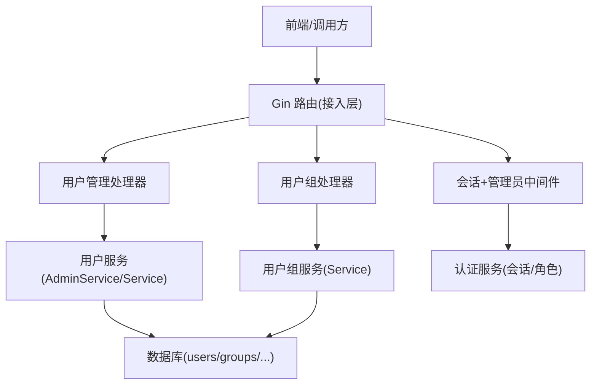
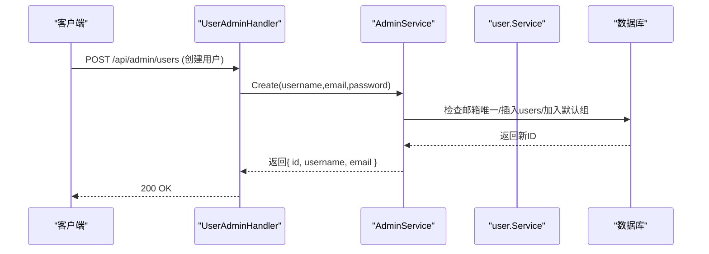
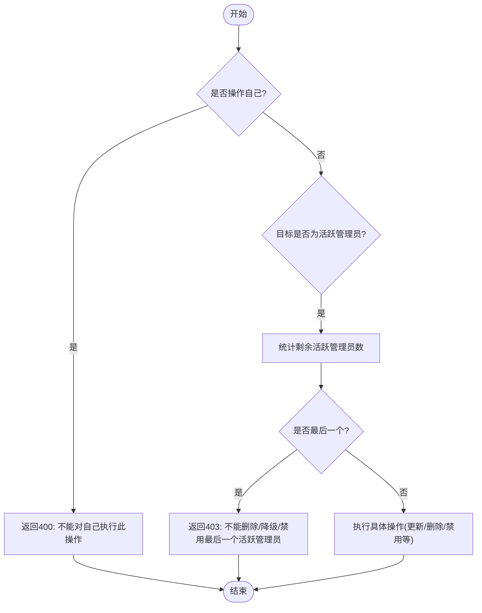
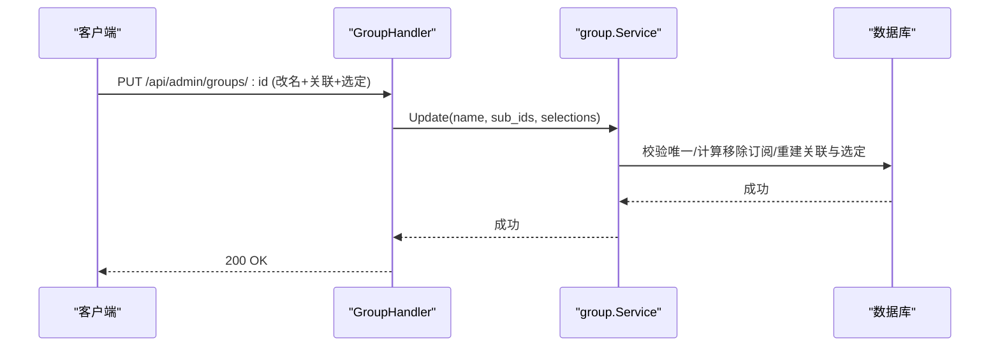
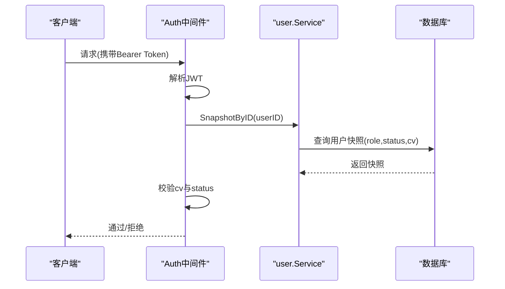
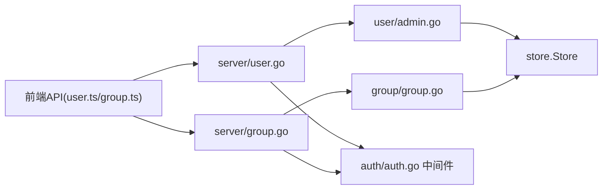

# 用户管理API

<cite>
**本文引用的文件**
- [backend/internal/server/user.go](file://backend/internal/server/user.go)
- [backend/internal/user/admin.go](file://backend/internal/user/admin.go)
- [backend/internal/user/user.go](file://backend/internal/user/user.go)
- [backend/internal/group/group.go](file://backend/internal/group/group.go)
- [backend/internal/server/group.go](file://backend/internal/server/group.go)
- [backend/internal/auth/auth.go](file://backend/internal/auth/auth.go)
- [backend/migrations/0002_users.sql](file://backend/migrations/0002_users.sql)
- [backend/migrations/1003_groups.sql](file://backend/migrations/1003_groups.sql)
- [frontend/src/api/user.ts](file://frontend/src/api/user.ts)
- [frontend/src/api/group.ts](file://frontend/src/api/group.ts)
</cite>

## 目录
1. [简介](#简介)
2. [项目结构](#项目结构)
3. [核心组件](#核心组件)
4. [架构总览](#架构总览)
5. [详细组件分析](#详细组件分析)
6. [依赖关系分析](#依赖关系分析)
7. [性能考虑](#性能考虑)
8. [故障排查指南](#故障排查指南)
9. [结论](#结论)
10. [附录：接口规范与示例](#附录接口规范与示例)

## 简介
本文件面向“用户管理”相关API，覆盖用户CRUD、用户组管理、权限分配、状态管理（启用/禁用）、密码重置、邮箱变更、批量操作等能力。文档同时说明管理员专用接口与普通用户接口的差异，并提供完整的工作流示例与权限验证机制说明。

## 项目结构
后端采用分层设计：
- 接入层（server）：定义HTTP路由、参数校验、错误映射与统一响应。
- 业务层（user/group）：实现用户与用户组的领域逻辑、事务约束与数据一致性。
- 认证与安全（auth）：会话签发/校验、角色鉴权中间件、凭据版本控制。
- 数据层（store + migrations）：数据库访问与表结构迁移。

图表来源
- [backend/internal/server/user.go:19-32](file://backend/internal/server/user.go#L19-L32)
- [backend/internal/server/group.go:18-27](file://backend/internal/server/group.go#L18-L27)
- [backend/internal/auth/auth.go:144-192](file://backend/internal/auth/auth.go#L144-L192)

章节来源
- [backend/internal/server/user.go:19-32](file://backend/internal/server/user.go#L19-L32)
- [backend/internal/server/group.go:18-27](file://backend/internal/server/group.go#L18-L27)
- [backend/internal/auth/auth.go:144-192](file://backend/internal/auth/auth.go#L144-L192)

## 核心组件
- 用户服务（user.Service / user.AdminService）：负责注册、登录、列表查询、创建/编辑/删除用户、角色变更、状态管理、密码重置、邮箱补填、OIDC绑定清理、批量发送密码设置链接等。
- 用户组服务（group.Service）：负责用户组CRUD、每平台订阅选定、关联约束、删组迁入默认组等。
- 认证服务（auth.Service）：提供会话中间件、管理员中间件、凭据版本控制、密码哈希/校验、邮箱规范化等。
- 接入层处理器（server.UserAdminHandler / server.GroupHandler）：暴露REST端点、参数校验、错误映射、统一响应。

章节来源
- [backend/internal/user/user.go:25-36](file://backend/internal/user/user.go#L25-L36)
- [backend/internal/user/admin.go:32-45](file://backend/internal/user/admin.go#L32-L45)
- [backend/internal/group/group.go:24-32](file://backend/internal/group/group.go#L24-L32)
- [backend/internal/auth/auth.go:87-96](file://backend/internal/auth/auth.go#L87-L96)
- [backend/internal/server/user.go:14-32](file://backend/internal/server/user.go#L14-L32)
- [backend/internal/server/group.go:13-27](file://backend/internal/server/group.go#L13-L27)

## 架构总览
用户管理API通过“会话+管理员”双中间件保护，所有写操作均进入业务层进行五重管理员保护校验与事务处理。用户组管理同样受管理员中间件保护，支持按平台为组选定订阅，并在删组时自动将成员迁回默认组。

图表来源
- [backend/internal/server/user.go:69-89](file://backend/internal/server/user.go#L69-L89)
- [backend/internal/user/admin.go:187-235](file://backend/internal/user/admin.go#L187-L235)
- [backend/internal/user/user.go:82-154](file://backend/internal/user/user.go#L82-L154)

章节来源
- [backend/internal/server/user.go:19-32](file://backend/internal/server/user.go#L19-L32)
- [backend/internal/server/group.go:18-27](file://backend/internal/server/group.go#L18-L27)
- [backend/internal/auth/auth.go:144-192](file://backend/internal/auth/auth.go#L144-L192)

## 详细组件分析

### 用户管理（管理员）
- 列表查询：支持分页(page,size)与关键字(keyword)模糊搜索用户名/邮箱。
- 创建用户：用户名+邮箱+密码；邮箱唯一；密码复杂度≥8；新用户自动加入默认组；本地创建默认激活。
- 编辑用户：可调整所属组；可为无邮箱用户补填邮箱（补填后具备设置/重置密码能力）。
- 角色变更：admin↔user；禁止改自己；降级admin→user会级联清除显式下载Token；禁止将最后一个活跃管理员降级。
- 密码重置：
  - direct：生成随机明文密码并返回一次（仅展示），递增credential_version使现有会话失效。
  - send_email：生成一次性重置令牌并通过邮件发送（需配置SMTP）。
- 状态管理：禁用=递增credential_version+物理删除全部Token；启用恢复active。
- 吊销Token：物理删除该用户的全部下载Token。
- 清除OIDC绑定：清空oidc_subject；返回has_password供前端提示风险。
- 删除用户：级联删除Token与自定义订阅及版本文件；待审批账号删除等同于拒绝；禁止删除最后一个活跃管理员。
- 批量操作：为所有已激活的无密码用户批量发送密码设置链接（排除待审批/禁用/无邮箱），返回计数回执。

图表来源
- [backend/internal/user/admin.go:47-63](file://backend/internal/user/admin.go#L47-L63)
- [backend/internal/user/admin.go:258-297](file://backend/internal/user/admin.go#L258-L297)
- [backend/internal/user/admin.go:411-454](file://backend/internal/user/admin.go#L411-L454)
- [backend/internal/user/admin.go:487-569](file://backend/internal/user/admin.go#L487-L569)

章节来源
- [backend/internal/server/user.go:54-274](file://backend/internal/server/user.go#L54-L274)
- [backend/internal/user/admin.go:73-618](file://backend/internal/user/admin.go#L73-L618)

### 用户组管理
- 列表/详情：返回组基础信息、是否需要重新选定、关联订阅数、组内用户数；详情包含当前每平台选定。
- 创建组：名称全局唯一，自动生成slug。
- 更新组：改名+关联订阅多选+每平台选定整体提交；若取消某订阅关联但仍在本次选定中引用则拒绝（防悬空选定）。
- 单独设置选定：为每组每平台指定订阅（或取消选定）；选定必须来自该组关联范围。
- 删除组：预置默认组不可删；删除时将组内用户自动迁入默认组；关联与选定由外键级联清理。

图表来源
- [backend/internal/server/group.go:89-117](file://backend/internal/server/group.go#L89-L117)
- [backend/internal/group/group.go:82-141](file://backend/internal/group/group.go#L82-L141)

章节来源
- [backend/internal/server/group.go:18-168](file://backend/internal/server/group.go#L18-L168)
- [backend/internal/group/group.go:24-373](file://backend/internal/group/group.go#L24-L373)

### 权限与认证机制
- 会话中间件：解析Authorization头中的JWT，实时查库获取用户快照，比对credential_version与status=active，否则拒绝。
- 管理员中间件：要求当前用户role=admin，否则返回403。
- 凭据版本控制：密码重置/禁用等操作会递增credential_version，导致旧会话立即失效。
- 邮箱规范化与密码规则：所有写入入口统一trim+小写化；密码长度至少8字符。

图表来源
- [backend/internal/auth/auth.go:144-192](file://backend/internal/auth/auth.go#L144-L192)
- [backend/internal/user/user.go:189-202](file://backend/internal/user/user.go#L189-L202)

章节来源
- [backend/internal/auth/auth.go:22-50](file://backend/internal/auth/auth.go#L22-L50)
- [backend/internal/auth/auth.go:144-192](file://backend/internal/auth/auth.go#L144-L192)
- [backend/internal/user/user.go:189-202](file://backend/internal/user/user.go#L189-L202)

### 数据模型与约束
- users表：包含id、username、email、role、group_id、password_hash、user_source、status、credential_version等字段；email唯一；role取值admin/user；status取值pending/active/disabled。
- groups与group_selections：groups记录组信息与是否默认；group_selections记录每组每平台的选定订阅，支持取消选定（subscription_id置空）。

章节来源
- [backend/migrations/0002_users.sql:1-17](file://backend/migrations/0002_users.sql#L1-L17)
- [backend/migrations/1003_groups.sql:1-16](file://backend/migrations/1003_groups.sql#L1-L16)

## 依赖关系分析
- 接入层依赖业务层：UserAdminHandler依赖AdminService；GroupHandler依赖group.Service。
- 业务层依赖数据层：通过store.Store访问数据库；使用事务保证一致性。
- 认证层独立：SessionMiddleware与AdminMiddleware可组合到任意需要保护的分组路由上。
- 前端封装：前端api模块对后端路由进行封装，便于调用。

图表来源
- [frontend/src/api/user.ts:24-42](file://frontend/src/api/user.ts#L24-L42)
- [frontend/src/api/group.ts:23-36](file://frontend/src/api/group.ts#L23-L36)
- [backend/internal/server/user.go:19-32](file://backend/internal/server/user.go#L19-L32)
- [backend/internal/server/group.go:18-27](file://backend/internal/server/group.go#L18-L27)

章节来源
- [frontend/src/api/user.ts:24-42](file://frontend/src/api/user.ts#L24-L42)
- [frontend/src/api/group.ts:23-36](file://frontend/src/api/group.ts#L23-L36)
- [backend/internal/server/user.go:19-32](file://backend/internal/server/user.go#L19-L32)
- [backend/internal/server/group.go:18-27](file://backend/internal/server/group.go#L18-L27)

## 性能考虑
- 列表查询采用后端分页与关键字模糊匹配，限制size上限防止滥用。
- 批量填充自定义订阅时使用IN查询避免N+1问题。
- 用户组更新在单事务内完成改名、关联重建与选定重建，减少往返与锁竞争。
- 会话校验每次实时查库，确保凭据版本与状态最新，避免缓存不一致导致的越权。

[本节为通用指导，不直接分析具体文件]

## 故障排查指南
- 400 参数错误：常见于邮箱格式非法、密码长度不足、参数缺失或非法值。
- 403 权限不足：尝试操作最后一个活跃管理员（删除/降级/禁用）或普通用户访问管理员接口。
- 404 用户不存在：目标用户ID无效。
- 409 冲突：邮箱重复或组名重复。
- 未配置SMTP：send_email模式或批量发送密码链接时会失败，需先配置SMTP。
- 会话失效：密码重置或禁用后credential_version递增，旧会话立即失效，需重新登录。

章节来源
- [backend/internal/server/user.go:34-52](file://backend/internal/server/user.go#L34-L52)
- [backend/internal/user/admin.go:22-30](file://backend/internal/user/admin.go#L22-L30)
- [backend/internal/auth/auth.go:144-192](file://backend/internal/auth/auth.go#L144-L192)

## 结论
用户管理API提供了完善的管理员能力，涵盖用户全生命周期、用户组与订阅分发、权限与状态管理、密码与邮箱维护、批量操作等。通过严格的中间件与事务约束，保证了安全性与一致性。建议在生产环境合理配置SMTP、定期审计管理员操作、关注凭据版本与Token吊销策略。

[本节为总结性内容，不直接分析具体文件]

## 附录：接口规范与示例

### 管理员用户管理接口
- GET /api/admin/users
  - 查询参数：page(默认1)、size(默认20, 最大100)、keyword(用户名/邮箱模糊)
  - 响应：{ list: AdminUser[], total: number }
- POST /api/admin/users
  - 请求体：{ username, email, password }
  - 响应：{ id, username, email }
- PUT /api/admin/users/:id
  - 请求体：{ group_id?, email? }（email非空视为补填）
  - 响应：空
- PUT /api/admin/users/:id/role
  - 请求体：{ role: "admin"|"user" }
  - 响应：空
- POST /api/admin/users/:id/tokens/revoke
  - 响应：空
- POST /api/admin/users/:id/password/reset
  - 请求体：{ mode: "send_email"|"direct" }
  - 响应：mode=direct时返回{ password }；mode=send_email返回{ message }
- DELETE /api/admin/users/:id/oidc
  - 响应：{ has_password: boolean }
- PUT /api/admin/users/:id/status
  - 请求体：{ disabled: boolean }
  - 响应：空
- DELETE /api/admin/users/:id
  - 响应：空
- POST /api/admin/users/send_password_links
  - 响应：{ sent, skipped_pending, skipped_disabled, skipped_no_email }

章节来源
- [backend/internal/server/user.go:19-32](file://backend/internal/server/user.go#L19-L32)
- [backend/internal/server/user.go:54-274](file://backend/internal/server/user.go#L54-L274)
- [frontend/src/api/user.ts:24-42](file://frontend/src/api/user.ts#L24-L42)

### 用户组管理接口
- GET /api/admin/groups
  - 响应：{ list: GroupItem[], total: number }
- GET /api/admin/groups/:id
  - 响应：{ group: GroupItem, selections: SelectionItem[] }
- POST /api/admin/groups
  - 请求体：{ name }
  - 响应：GroupItem
- PUT /api/admin/groups/:id
  - 请求体：{ name, sub_ids[], selections[] }
  - 响应：空
- DELETE /api/admin/groups/:id
  - 响应：空
- PUT /api/admin/groups/:id/selections
  - 请求体：{ selections: [{ platform_id, subscription_id }] }
  - 响应：空

章节来源
- [backend/internal/server/group.go:18-27](file://backend/internal/server/group.go#L18-L27)
- [backend/internal/server/group.go:29-168](file://backend/internal/server/group.go#L29-L168)
- [frontend/src/api/group.ts:23-36](file://frontend/src/api/group.ts#L23-L36)

### 工作流示例
- 新建用户并分配组
  - 调用POST /api/admin/users创建用户
  - 调用PUT /api/admin/users/:id设置group_id
- 批量发送密码设置链接
  - 调用POST /api/admin/users/send_password_links
  - 根据回执统计发送/跳过数量
- 禁用用户并吊销Token
  - 调用PUT /api/admin/users/:id/status { disabled: true }
  - 可选调用POST /api/admin/users/:id/tokens/revoke
- 删除用户组并迁移成员
  - 调用DELETE /api/admin/groups/:id
  - 系统自动将组成员迁入默认组

章节来源
- [backend/internal/server/user.go:69-274](file://backend/internal/server/user.go#L69-L274)
- [backend/internal/server/group.go:62-168](file://backend/internal/server/group.go#L62-L168)
- [backend/internal/user/admin.go:187-618](file://backend/internal/user/admin.go#L187-L618)
- [backend/internal/group/group.go:222-248](file://backend/internal/group/group.go#L222-L248)

### 权限验证机制说明
- 所有管理员接口均需携带有效JWT，且当前用户role=admin。
- 会话中间件每次请求实时查库校验用户快照，确保credential_version与status一致。
- 敏感操作（如删除/禁用/降级管理员）内置五重保护，防止误操作与越权。

章节来源
- [backend/internal/auth/auth.go:144-192](file://backend/internal/auth/auth.go#L144-L192)
- [backend/internal/server/user.go:19-32](file://backend/internal/server/user.go#L19-L32)
- [backend/internal/server/group.go:18-27](file://backend/internal/server/group.go#L18-L27)