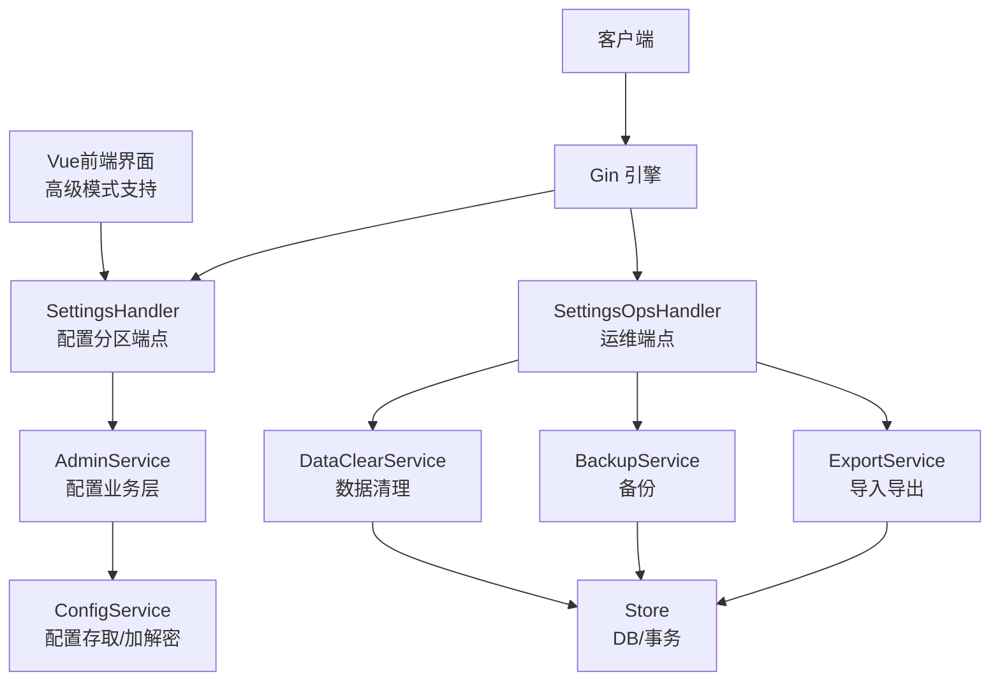
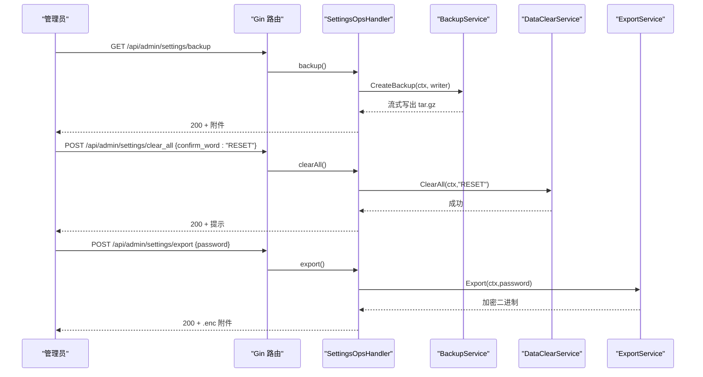
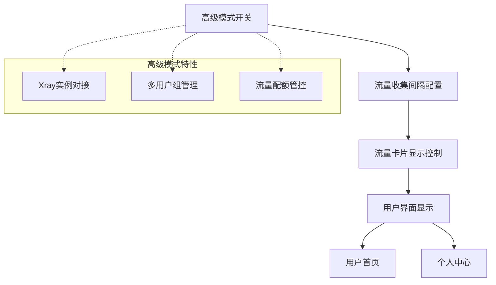
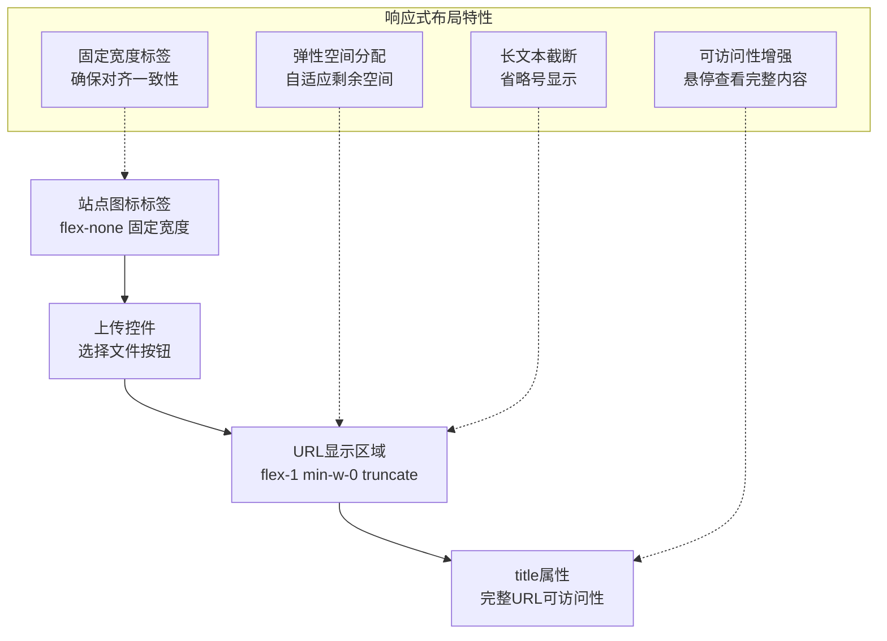
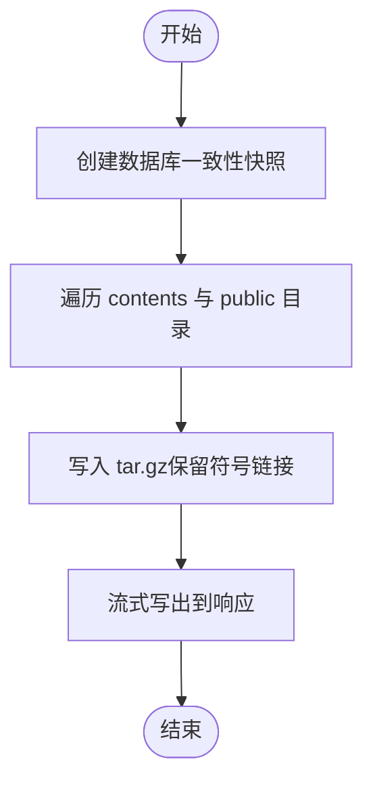
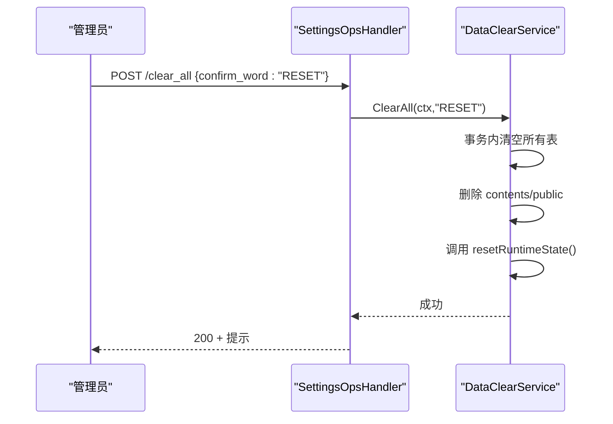
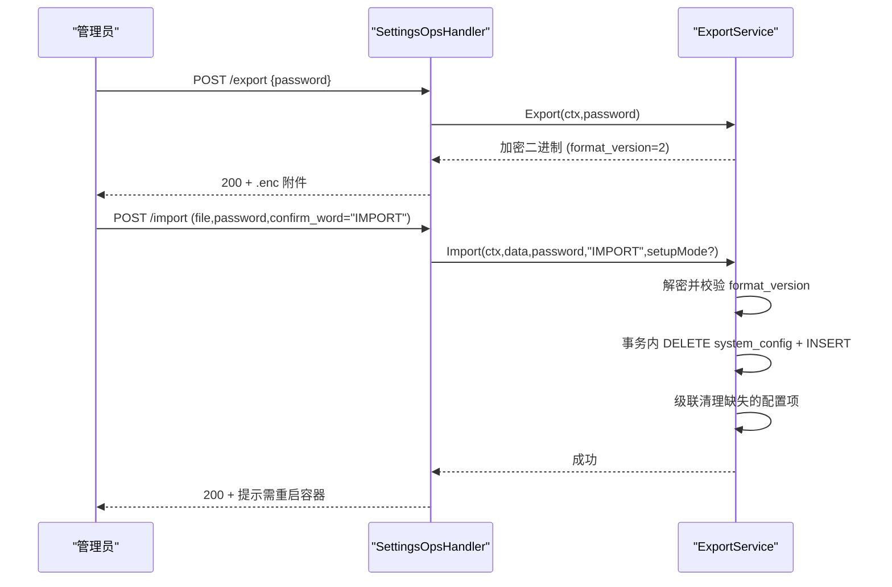
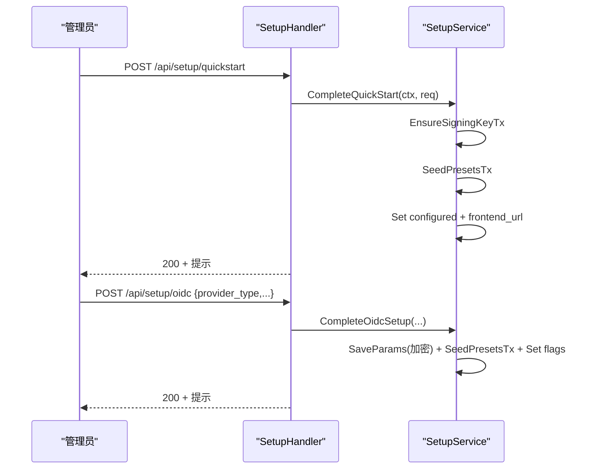
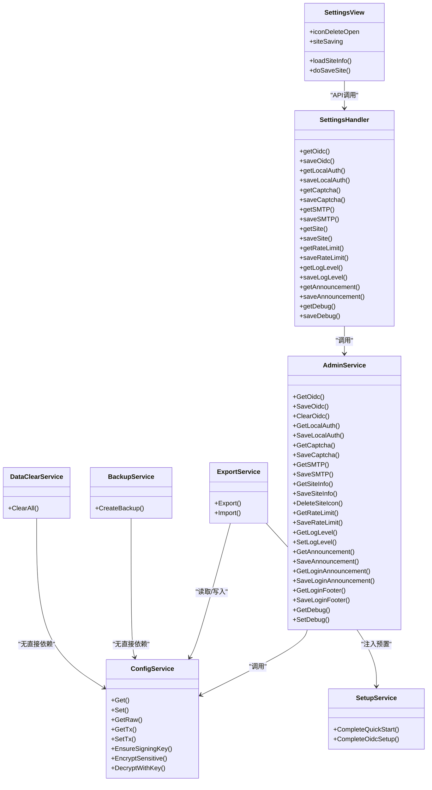

# 系统设置API

<cite>
**本文引用的文件**
- [backend/internal/server/settings.go](file://backend/internal/server/settings.go)
- [backend/internal/server/settings_ops.go](file://backend/internal/server/settings_ops.go)
- [backend/internal/config/config.go](file://backend/internal/config/config.go)
- [backend/internal/config/admin.go](file://backend/internal/config/admin.go)
- [backend/internal/config/export.go](file://backend/internal/config/export.go)
- [backend/internal/backup/backup.go](file://backend/internal/backup/backup.go)
- [backend/internal/dataclear/dataclear.go](file://backend/internal/dataclear/dataclear.go)
- [backend/internal/setup/setup.go](file://backend/internal/setup/setup.go)
- [frontend/src/views/admin/SettingsView.vue](file://frontend/src/views/admin/SettingsView.vue)
- [frontend/src/api/settings.ts](file://frontend/src/api/settings.ts)
</cite>

## 更新摘要
**所做更改**
- 新增高级模式操作支持，包括流量收集间隔、流量卡片显示控制、高级模式切换等新配置项
- 升级导入导出格式至format_version=2，增强配置迁移的完整性和安全性
- 扩展配置分区以支持高级模式相关配置项
- 优化前端界面布局，新增高级模式管理界面

## 目录
1. [简介](#简介)
2. [项目结构](#项目结构)
3. [核心组件](#核心组件)
4. [架构总览](#架构总览)
5. [详细组件分析](#详细组件分析)
6. [依赖关系分析](#依赖关系分析)
7. [性能与一致性](#性能与一致性)
8. [故障排查指南](#故障排查指南)
9. [结论](#结论)
10. [附录：API 清单与示例](#附录api-清单与示例)

## 简介
本文件面向系统设置相关 API，覆盖配置管理、备份恢复、数据导入导出、数据清理、调试模式切换等运维能力。文档按"基础设置、邮件服务、安全设置、高级模式"等分类梳理配置项；说明配置更新接口、验证机制；记录备份创建与下载流程；提供系统初始化、配置迁移、故障恢复的实用示例。

**更新** 新增了高级模式操作支持，包括流量收集间隔配置、流量卡片显示控制开关、高级模式切换功能，以及format_version=2的导入导出格式支持，确保配置迁移的完整性和客户端兼容性。

## 项目结构
后端采用分层设计：
- 接入层（server）：路由注册与请求处理，负责鉴权、参数校验、错误映射。
- 业务层（config、setup、backup、dataclear）：实现配置读写、加密解密、导入导出、备份打包、一键清空等核心逻辑。
- 存储层（store）：数据库访问与事务封装。
- 前端层（Vue.js + Ant Design Vue）：提供管理员界面，支持响应式布局和可访问性优化。

**图表来源**
- [backend/internal/server/settings.go:52-81](file://backend/internal/server/settings.go#L52-L81)
- [backend/internal/server/settings_ops.go:29-38](file://backend/internal/server/settings_ops.go#L29-L38)
- [backend/internal/config/admin.go:76-87](file://backend/internal/config/admin.go#L76-L87)
- [backend/internal/config/config.go:48-55](file://backend/internal/config/config.go#L48-L55)
- [backend/internal/config/export.go:46-59](file://backend/internal/config/export.go#L46-59)
- [backend/internal/backup/backup.go:19-28](file://backend/internal/backup/backup.go#L19-L28)
- [backend/internal/dataclear/dataclear.go:19-30](file://backend/internal/dataclear/dataclear.go#L19-L30)

章节来源
- [backend/internal/server/settings.go:52-81](file://backend/internal/server/settings.go#L52-L81)
- [backend/internal/server/settings_ops.go:29-38](file://backend/internal/server/settings_ops.go#L29-L38)

## 核心组件
- 配置服务（ConfigService）：统一读取/写入 system_config，敏感字段自动加密/解密，支持事务内操作与类型化读取。
- 面板配置服务（AdminService）：按分区组织配置项（OIDC、本地认证、验证码、SMTP、站点信息、限流、日志级别、公告页脚、调试、高级模式），包含参数校验与安全约束。
- 导入导出服务（ExportService）：仅生产模式可用；导出使用 Argon2id + AES-GCM 加密；导入严格整体覆盖并可选 Setup 预置，支持format_version=2。
- 备份服务（BackupService）：SQLite 一致性快照 + contents/public 打包 tar.gz 流式下载。
- 数据清理服务（DataClearService）：一键清空所有数据（确认词 RESET），先清库再删文件，内存态复位。
- Setup 服务（SetupService）：快速开始与 OIDC 高级配置，推导前端地址，预置默认组与平台。
- **新增** 高级模式管理服务：支持流量收集间隔配置、流量卡片显示控制、高级模式切换等功能。
- **新增** 前端界面服务：基于Vue.js和Ant Design Vue构建的管理界面，支持高级模式配置界面。

章节来源
- [backend/internal/config/config.go:48-55](file://backend/internal/config/config.go#L48-L55)
- [backend/internal/config/admin.go:76-87](file://backend/internal/config/admin.go#L76-L87)
- [backend/internal/config/export.go:46-59](file://backend/internal/config/export.go#L46-L59)
- [backend/internal/backup/backup.go:19-28](file://backend/internal/backup/backup.go#L19-L28)
- [backend/internal/dataclear/dataclear.go:19-30](file://backend/internal/dataclear/dataclear.go#L19-L30)
- [backend/internal/setup/setup.go:21-31](file://backend/internal/setup/setup.go#L21-L31)
- [frontend/src/views/admin/SettingsView.vue:1-50](file://frontend/src/views/admin/SettingsView.vue#L1-L50)

## 架构总览
系统设置 API 通过两个分组暴露：
- /api/admin/settings：需会话+管理员中间件，覆盖各配置分区 GET/PUT/DELETE。
- /api/admin/settings（运维）：含 clear_all、export、import、backup；Setup 导入 /api/setup/import 未配置状态暴露且限流。

**图表来源**
- [backend/internal/server/settings_ops.go:29-38](file://backend/internal/server/settings_ops.go#L29-L38)
- [backend/internal/server/settings_ops.go:41-80](file://backend/internal/server/settings_ops.go#L41-L80)
- [backend/internal/backup/backup.go:30-65](file://backend/internal/backup/backup.go#L30-L65)
- [backend/internal/dataclear/dataclear.go:54-82](file://backend/internal/dataclear/dataclear.go#L54-L82)
- [backend/internal/config/export.go:66-133](file://backend/internal/config/export.go#L66-L133)

## 详细组件分析

### 配置分区与配置项分类
- 基础设置
  - 日志级别：GET/PUT /log-level
  - 调试模式：GET/PUT /debug
  - 站点信息：GET/PUT /site（名称 + ICON 上传/删除）
  - 公告与页脚：GET/PUT /announcement（首页/登录页公告与页脚）
- 邮件服务
  - SMTP：GET/PUT /smtp（主机、端口、用户、密码加密、发件人、TLS、启用范围）
- 安全设置
  - 本地认证：GET/PUT /local-auth（允许本地登录、自注册、自注册审批）
  - 验证码：GET/PUT /captcha（提供商、双密钥、启用页面）
  - 速率限制：GET/PUT /ratelimit（登录/注册/忘记密码/下载）
  - OIDC：GET/PUT/DELETE /oidc（提供商类型、BaseURL、Realm、ClientID、Secret 脱敏）、测试连接 /oidc/test
  - OIDC 规则：GET/PUT /oidc-rules（审批开关、白名单）
- 高级模式设置
  - 高级模式开关：GET/PUT /advanced-mode（高级模式切换控制）
  - 流量收集间隔：GET/PUT /traffic-interval（分钟，默认10，≥1）
  - 流量卡片显示：GET/PUT /traffic-card-display（流量卡片显示控制开关）
- 运维操作
  - 一键清空：POST /clear_all
  - 配置导出：POST /export（仅生产）
  - 配置导入：POST /import（面板）与 /api/setup/import（未配置状态，限流）
  - 备份下载：GET /backup

**更新** 新增高级模式相关配置项，包括高级模式开关、流量收集间隔配置、流量卡片显示控制等功能。

章节来源
- [backend/internal/server/settings.go:52-81](file://backend/internal/server/settings.go#L52-L81)
- [backend/internal/server/settings_ops.go:29-38](file://backend/internal/server/settings_ops.go#L29-L38)
- [backend/internal/config/admin.go:108-585](file://backend/internal/config/admin.go#L108-L585)

### 配置更新接口与验证机制
- 参数校验
  - JSON 绑定失败返回 400。
  - 业务校验：如 SMTP Host 必填、限流值为正整数、日志级别枚举、ICON 扩展名与大小限制、公告长度限制等。
  - 高级模式参数校验：流量收集间隔必须为正整数且≥1分钟。
- 安全约束
  - 防认证死锁：本地登录关闭时，若 OIDC 不可用则禁止保存；清空 OIDC 时若本地登录也关则拒绝。
  - 验证码启用时需配置密钥，否则拒绝。
  - 敏感字段 GET 脱敏（***），PUT 空串表示不修改；非空值经 ConfigService 自动加密落库。
- 生效策略
  - 限流、日志级别、调试模式等运行时立即生效。
  - 高级模式开关变更立即生效，影响侧边栏入口显示。
  - 流量收集间隔配置立即生效，影响采集任务调度。
  - 前端地址/回调地址变更需重启容器生效（启动缓存语义）。

章节来源
- [backend/internal/config/admin.go:157-212](file://backend/internal/config/admin.go#L157-L212)
- [backend/internal/config/admin.go:250-333](file://backend/internal/config/admin.go#L250-L333)
- [backend/internal/config/admin.go:335-388](file://backend/internal/config/admin.go#L335-L388)
- [backend/internal/config/admin.go:390-469](file://backend/internal/config/admin.go#L390-L469)
- [backend/internal/config/admin.go:471-527](file://backend/internal/config/admin.go#L471-L527)
- [backend/internal/config/admin.go:529-585](file://backend/internal/config/admin.go#L529-L585)

### 配置加密与敏感字段
- 签名密钥：系统首次生成或确保存在，用于派生配置加密密钥。
- 敏感字段加密：AES-256-GCM，密钥由签名密钥经 HKDF 派生；密文格式 base64url(nonce ‖ ciphertext)。
- 事务内加解密：Setup/OIDC Setup 等场景在事务中复用同一签名密钥进行加密/解密。

章节来源
- [backend/internal/config/config.go:24-46](file://backend/internal/config/config.go#L24-L46)
- [backend/internal/config/config.go:57-111](file://backend/internal/config/config.go#L57-L111)
- [backend/internal/config/config.go:113-168](file://backend/internal/config/config.go#L113-L168)
- [backend/internal/config/config.go:220-361](file://backend/internal/config/config.go#L220-L361)

### 高级模式配置管理
**新增** 系统现在支持高级模式操作，提供完整的配置管理能力：

#### 高级模式开关
- **功能描述**：控制是否启用Xray实例对接、多用户组与流量配额管控
- **配置项**：`advanced_mode` 布尔值
- **行为特性**：
  - 开启后解锁侧边栏「用户组」和「Xray 实例」入口
  - 关闭时一并移除所有高级模式产生的配置数据
  - 实时生效，无需重启容器

#### 流量收集间隔配置
- **功能描述**：控制逐用户串行采集 Xray 流量的时间间隔
- **配置项**：`traffic_collection_interval` 整数值（分钟）
- **默认值**：10分钟
- **约束条件**：最小值为1分钟，过短会增加实例压力
- **生效方式**：配置变更后立即影响采集任务调度

#### 流量卡片显示控制
- **功能描述**：控制用户首页与个人中心的流量卡片是否展示
- **配置项**：`traffic_card_display` 布尔值
- **默认值**：true（开启）
- **影响范围**：用户首页流量卡片和个人中心流量统计显示
- **两模式通用**：基础模式和高级模式均支持此配置

**图表来源**
- [Design2.md:8-21](../../../../../Design2.md#L8-L21)
- [Design2-UI.md:248-256](../../../../../Design2-UI.md#L248-L256)

章节来源
- [Design2.md:8-21](../../../../../Design2.md#L8-L21)
- [Design2-UI.md:248-256](../../../../../Design2-UI.md#L248-L256)

### 站点信息配置界面UI优化
**更新** 站点信息配置界面现已支持响应式布局，确保在不同屏幕尺寸下都能提供良好的用户体验。

#### 响应式布局设计
- **固定宽度标签**：站点图标标签使用 `flex-none` 类保持固定宽度（w-24），确保在不同屏幕尺寸下标签对齐一致
- **弹性布局**：使用 flexbox 布局实现自适应排列，确保在小屏幕上也能良好显示

#### URL显示优化
- **长URL截断**：当前图标URL显示添加了 `flex-1 min-w-0 truncate` 类组合，当URL过长时自动显示省略号截断
- **可访问性增强**：为截断的URL添加了 `title` 属性，鼠标悬停时可查看完整的URL路径
- **视觉反馈**：使用 `text-xs text-gray-400` 样式类提供清晰的视觉层次

#### 用户体验改进
- **空间利用**：通过合理的布局优化，确保在有限的屏幕空间内展示所有必要信息
- **交互友好**：上传按钮、删除按钮和操作区域保持良好的间距和对齐
- **响应式适配**：界面能够适应从桌面端到移动端的各种屏幕尺寸

**图表来源**
- [frontend/src/views/admin/SettingsView.vue:712-718](file://frontend/src/views/admin/SettingsView.vue#L712-L718)

章节来源
- [frontend/src/views/admin/SettingsView.vue:704-725](file://frontend/src/views/admin/SettingsView.vue#L704-L725)

### 备份创建与下载流程
- 一致性快照：优先 VACUUM INTO；不支持时降级为 WAL checkpoint(FULL) 后拷贝主文件。
- 打包内容：app.db 快照 + contents（版本文件，保留符号链接）+ public（站点资源）。
- 流式输出：直接写到响应 Writer，设置 Content-Type 与文件名头。

**图表来源**
- [backend/internal/backup/backup.go:30-65](file://backend/internal/backup/backup.go#L30-L65)
- [backend/internal/backup/backup.go:67-79](file://backend/internal/backup/backup.go#L67-L79)
- [backend/internal/server/settings_ops.go:141-150](file://backend/internal/server/settings_ops.go#L141-L150)

章节来源
- [backend/internal/backup/backup.go:30-138](file://backend/internal/backup/backup.go#L30-L138)
- [backend/internal/server/settings_ops.go:141-150](file://backend/internal/server/settings_ops.go#L141-L150)

### 数据清理（一键清空）
- 确认词：RESET（二次确认由前端负责）。
- 执行顺序：单事务清空全部业务表与系统配置 → 删除 contents 与 public 目录 → 调用内存态复位回调（限流计数、SSE 连接、短期 Token、实时日志缓冲）。
- 效果：系统回到未配置状态，无需重启；旧会话凭据因签名密钥轮换自然失效。

**图表来源**
- [backend/internal/server/settings_ops.go:41-54](file://backend/internal/server/settings_ops.go#L41-L54)
- [backend/internal/dataclear/dataclear.go:54-82](file://backend/internal/dataclear/dataclear.go#L54-L82)

章节来源
- [backend/internal/dataclear/dataclear.go:1-83](file://backend/internal/dataclear/dataclear.go#L1-L83)
- [backend/internal/server/settings_ops.go:41-54](file://backend/internal/server/settings_ops.go#L41-L54)

### 配置导入导出
- 导出
  - 仅生产模式。
  - 收集 system_config 全量键值（含签名密钥与敏感密文原样导出）+ 站点名称与 ICON base64。
  - 使用 Argon2id 派生密钥 + AES-GCM 加密整个 payload，返回二进制供下载。
  - **更新** 支持format_version=2格式，向后兼容version=1。
- 导入
  - 面板导入：/api/admin/settings/import（multipart 文件 + password + confirm_word=IMPORT）。
  - Setup 导入：/api/setup/import（未配置状态暴露，叠加限流 5/min）。
  - **更新** 事务内严格整体覆盖：先清空 system_config 再写入导出内容（导出文件中不存在的键一并清除），实现完整的表覆盖语义。
  - Setup 导入分支同事务创建预置默认组与默认平台。
  - 导入后 ICON 写入 /public/site/；签名密钥替换导致全部会话立即失效；若含前端地址/回调地址需重启容器。

**图表来源**
- [backend/internal/config/export.go:66-133](file://backend/internal/config/export.go#L66-L133)
- [backend/internal/config/export.go:135-187](file://backend/internal/config/export.go#L135-L187)
- [backend/internal/server/settings_ops.go:56-139](file://backend/internal/server/settings_ops.go#L56-L139)

章节来源
- [backend/internal/config/export.go:1-253](file://backend/internal/config/export.go#L1-L253)
- [backend/internal/server/settings_ops.go:56-139](file://backend/internal/server/settings_ops.go#L56-L139)

### vmess链接兼容性支持
**更新** 系统现在支持vmess链接的alterId=0参数，确保与V2rayN、Clash、Shadowrocket等客户端的兼容性：

#### vmess链接格式规范
- **JSON格式**：vmess链接采用V2rayN JSON格式，包含v/ps/add/port/id/aid/scy/net/type/host/path/tls/sni/alpn/fp等字段
- **查询参数**：添加remarks、udp、alterId=0等查询参数，确保跨客户端兼容性
- **生态兼容**：该混合形态已在SR、Clash、V2rayN等主流客户端中验证

#### 配置模板支持
- **Clash模板**：在vmess节点配置中包含alterId: 0字段
- **Shadowrocket模板**：在vmess链接中添加?alterId=0查询参数
- **标准化处理**：确保生成的vmess链接符合各客户端解析要求

章节来源
- [Design2.md:419-420](../../../../../Design2.md#L419-L420)
- [docs/DocTemplates/Clash.yaml.template.md:107-125](../../../../../docs/DocTemplates/Clash.yaml.template.md#L107-L125)

### 系统初始化（快速开始与 OIDC 高级配置）
- 快速开始：确保签名密钥 → 预置默认组与 3 个默认平台 → configured=true → 推导 frontend_url。
- OIDC 高级配置：保存提供商参数（Secret 加密）→ 预置默认组/平台 → configured=true → 设置 frontend_url 与 callback_url。
- 前端地址推导：信任转发头策略下优先 X-Forwarded-Host，scheme 根据 TLS 或 X-Forwarded-Proto 推导。

**图表来源**
- [backend/internal/server/setup.go:29-49](file://backend/internal/server/setup.go#L29-L49)
- [backend/internal/server/setup.go:51-113](file://backend/internal/server/setup.go#L51-L113)
- [backend/internal/setup/setup.go:41-69](file://backend/internal/setup/setup.go#L41-L69)
- [backend/internal/setup/setup.go:105-142](file://backend/internal/setup/setup.go#L105-L142)
- [backend/internal/setup/setup.go:159-196](file://backend/internal/setup/setup.go#L159-L196)

章节来源
- [backend/internal/server/setup.go:22-114](file://backend/internal/server/setup.go#L22-L114)
- [backend/internal/setup/setup.go:21-196](file://backend/internal/setup/setup.go#L21-L196)

## 依赖关系分析
- 接入层对业务层的依赖：
  - SettingsHandler 依赖 AdminService（配置分区）、OIDC Service（测试连接）。
  - SettingsOpsHandler 依赖 DataClearService、ExportService、BackupService、SetupService、RateLimit。
- 业务层内部依赖：
  - AdminService 依赖 ConfigService（读写配置、敏感字段加密）、Store（事务）。
  - ExportService 依赖 ConfigService（读取站点信息、版本号）、Store（事务）、SetupService（预置逻辑注入）。
  - BackupService 依赖 Store（数据库路径/查询）、文件系统。
  - DataClearService 依赖 Store（事务）、文件系统、内存态复位回调。
- 循环依赖规避：
  - config 包通过 OidcOps 接口避免与 oidc 包循环依赖。
  - export 包通过注入 seedPresets 函数避免与 setup 包循环依赖。
- **更新** 前端依赖：
  - SettingsView 依赖 Ant Design Vue 组件库和自定义 ConfirmModal 组件。
  - 前端通过 TypeScript 接口定义确保类型安全。
  - 新增高级模式相关的前端组件和状态管理。

**图表来源**
- [backend/internal/server/settings.go:17-81](file://backend/internal/server/settings.go#L17-L81)
- [backend/internal/config/admin.go:76-87](file://backend/internal/config/admin.go#L76-L87)
- [backend/internal/config/config.go:48-55](file://backend/internal/config/config.go#L48-L55)
- [backend/internal/config/export.go:46-59](file://backend/internal/config/export.go#L46-L59)
- [backend/internal/backup/backup.go:19-28](file://backend/internal/backup/backup.go#L19-L28)
- [backend/internal/dataclear/dataclear.go:19-30](file://backend/internal/dataclear/dataclear.go#L19-L30)
- [backend/internal/setup/setup.go:21-31](file://backend/internal/setup/setup.go#L21-L31)
- [frontend/src/views/admin/SettingsView.vue:1-50](file://frontend/src/views/admin/SettingsView.vue#L1-L50)

章节来源
- [backend/internal/server/settings.go:17-81](file://backend/internal/server/settings.go#L17-L81)
- [backend/internal/config/admin.go:76-87](file://backend/internal/config/admin.go#L76-L87)
- [backend/internal/config/config.go:48-55](file://backend/internal/config/config.go#L48-L55)
- [backend/internal/config/export.go:46-59](file://backend/internal/config/export.go#L46-L59)
- [backend/internal/backup/backup.go:19-28](file://backend/internal/backup/backup.go#L19-L28)
- [backend/internal/dataclear/dataclear.go:19-30](file://backend/internal/dataclear/dataclear.go#L19-L30)
- [backend/internal/setup/setup.go:21-31](file://backend/internal/setup/setup.go#L21-L31)

## 性能与一致性
- 备份一致性：VACUUM INTO 保证一致快照；不支持时 WAL checkpoint(FULL) 后拷贝主文件，避免遗漏未 checkpoint 的数据。
- 流式备份：tar.gz 直接写入响应 Writer，降低内存占用。
- 导入导出：
  - 导出：Argon2id 高成本密钥派生（time=1, memory=64MB, threads=4）提升暴力破解成本。
  - 导入：事务内整体覆盖，失败回滚，保证原子性。**更新** 现在支持严格的整体表覆盖语义和format_version=2格式，确保配置完整性。
- 运行时配置：限流、日志级别、调试模式等即时生效，无需重启。
- 高级模式配置：高级模式开关、流量收集间隔等配置变更立即生效，无需重启。
- 前端地址/回调地址：修改后需重启容器生效（启动缓存语义）。
- **更新** 前端性能优化：
  - 响应式布局减少不必要的重绘和回流
  - 图片懒加载和缓存优化
  - 组件按需加载减少初始包大小
  - 高级模式相关组件的延迟加载

[本节为通用性能讨论，不直接分析具体文件]

## 故障排查指南
- 配置读取失败
  - 检查数据库连接与 system_config 表是否存在对应 key。
  - 敏感字段解密失败会返回明确错误，防止静默使用损坏数据。
- 认证死锁
  - 本地登录与 OIDC 均不可用时禁止保存；清空 OIDC 时若本地登录也关将拒绝。
- 验证码启用失败
  - 启用验证码页面但未配置密钥将被拒绝。
- 导入失败
  - 确认词不正确、密码错误或文件损坏将返回 400；格式版本不匹配仅警告不阻断。
  - **更新** 整体表覆盖失败时会回滚所有变更，确保数据一致性；format_version=2格式支持向后兼容。
- 备份失败
  - 快照失败且 WAL checkpoint 降级失败将返回 500；检查 SQLite 驱动版本与权限。
- 一键清空后无法登录
  - 签名密钥已轮换，旧会话失效属预期；重新登录即可。
- **更新** 高级模式相关问题排查
  - 高级模式开关无效：检查数据库中的advanced_mode配置项是否正确设置
  - 流量收集间隔异常：确认配置值为正整数且≥1分钟
  - 流量卡片不显示：检查traffic_card_display配置项和用户权限
  - 高级模式数据丢失：确认关闭高级模式时的确认操作流程
- **更新** 前端界面问题排查
  - 响应式布局异常：检查浏览器开发者工具的响应式设计模式
  - URL截断显示问题：确认CSS类是否正确应用，检查控制台是否有JavaScript错误
  - 可访问性问题：使用屏幕阅读器测试title属性的正确显示
- **更新** vmess链接问题排查
  - alterId参数兼容性：确认客户端版本支持alterId=0参数
  - JSON格式验证：检查vmess链接的JSON结构是否符合规范
  - 跨客户端测试：在V2rayN、Clash、Shadowrocket等不同客户端中验证链接有效性

章节来源
- [backend/internal/config/config.go:57-111](file://backend/internal/config/config.go#L57-L111)
- [backend/internal/config/admin.go:24-29](file://backend/internal/config/admin.go#L24-L29)
- [backend/internal/config/admin.go:157-212](file://backend/internal/config/admin.go#L157-L212)
- [backend/internal/config/admin.go:302-333](file://backend/internal/config/admin.go#L302-L333)
- [backend/internal/config/export.go:135-187](file://backend/internal/config/export.go#L135-L187)
- [backend/internal/backup/backup.go:67-79](file://backend/internal/backup/backup.go#L67-L79)
- [backend/internal/dataclear/dataclear.go:54-82](file://backend/internal/dataclear/dataclear.go#L54-L82)

## 结论
系统设置 API 提供了完整的配置管理、备份恢复、导入导出与运维能力。通过严格的参数校验、敏感字段加密、事务原子性与一致性快照，保障了配置的安全性与可恢复性。**最新的改进包括高级模式操作支持、流量收集间隔配置、流量卡片显示控制、format_version=2的导入导出格式支持**，进一步提升了系统的可靠性和功能完整性。建议在生产环境启用导出/导入功能，定期备份，并在变更前做好迁移核对与回滚预案。

[本节为总结，不直接分析具体文件]

## 附录：API 清单与示例

### 配置分区端点（需会话+管理员）
- OIDC
  - GET /api/admin/settings/oidc
  - PUT /api/admin/settings/oidc
  - DELETE /api/admin/settings/oidc
  - POST /api/admin/settings/oidc/test
- OIDC 规则
  - GET /api/admin/settings/oidc-rules
  - PUT /api/admin/settings/oidc-rules
- 本地认证
  - GET /api/admin/settings/local-auth
  - PUT /api/admin/settings/local-auth
- 验证码
  - GET /api/admin/settings/captcha
  - PUT /api/admin/settings/captcha
- SMTP
  - GET /api/admin/settings/smtp
  - PUT /api/admin/settings/smtp
- 站点信息
  - GET /api/admin/settings/site
  - PUT /api/admin/settings/site（multipart：site_name + icon）
  - DELETE /api/admin/settings/site/icon
- 速率限制
  - GET /api/admin/settings/ratelimit
  - PUT /api/admin/settings/ratelimit
- 日志级别
  - GET /api/admin/settings/log-level
  - PUT /api/admin/settings/log-level
- 公告与页脚
  - GET /api/admin/settings/announcement
  - PUT /api/admin/settings/announcement
- 调试模式
  - GET /api/admin/settings/debug
  - PUT /api/admin/settings/debug
- **新增** 高级模式设置
  - GET /api/admin/settings/advanced-mode
  - PUT /api/admin/settings/advanced-mode
  - GET /api/admin/settings/traffic-interval
  - PUT /api/admin/settings/traffic-interval
  - GET /api/admin/settings/traffic-card-display
  - PUT /api/admin/settings/traffic-card-display

章节来源
- [backend/internal/server/settings.go:52-81](file://backend/internal/server/settings.go#L52-L81)
- [backend/internal/server/settings.go:85-359](file://backend/internal/server/settings.go#L85-L359)

### 运维端点
- 一键清空
  - POST /api/admin/settings/clear_all
  - Body: { confirm_word: "RESET" }
- 配置导出
  - POST /api/admin/settings/export
  - Body: { password }（≥8 字符，仅生产）
- 配置导入
  - POST /api/admin/settings/import（面板）
  - POST /api/setup/import（未配置状态，限流）
  - Multipart: file + password + confirm_word="IMPORT"
- 备份下载
  - GET /api/admin/settings/backup
  - 返回 tar.gz 流式下载

章节来源
- [backend/internal/server/settings_ops.go:29-38](file://backend/internal/server/settings_ops.go#L29-L38)
- [backend/internal/server/settings_ops.go:41-150](file://backend/internal/server/settings_ops.go#L41-L150)

### 实用示例
- 系统初始化（快速开始）
  - 调用 POST /api/setup/quickstart，完成签名密钥生成、预置默认组与平台、configured 置位与 frontend_url 推导。
- 系统初始化（OIDC 高级配置）
  - 调用 POST /api/setup/oidc，保存提供商参数（Secret 加密）、预置数据、设置 frontend_url 与 callback_url。
- 配置迁移
  - 导出：POST /api/admin/settings/export，获得加密文件。
  - 导入：POST /api/admin/settings/import 或 /api/setup/import，输入密码与确认词 IMPORT，完成严格整体覆盖。
  - **更新** 导入过程现在支持format_version=2格式和完整的表覆盖语义，确保配置的一致性。
- 故障恢复
  - 备份：GET /api/admin/settings/backup 下载 tar.gz。
  - 恢复：手动解包至数据卷，启动后以 DB 为准重建符号链接指针。
- 数据清理
  - 一键清空：POST /api/admin/settings/clear_all，确认词 RESET，系统回到未配置状态。
- **更新** 高级模式配置示例
  - 开启高级模式：PUT /api/admin/settings/advanced-mode {enabled: true}
  - 设置流量收集间隔：PUT /api/admin/settings/traffic-interval {interval: 15}
  - 控制流量卡片显示：PUT /api/admin/settings/traffic-card-display {display: false}
- **更新** 前端界面使用示例
  - 站点图标上传：通过响应式界面上传图标文件，支持拖拽和点击两种方式
  - URL查看：鼠标悬停在截断的URL上可查看完整路径
  - 移动端适配：在移动设备上自动调整布局，确保操作便捷性
- **更新** vmess链接兼容性示例
  - 生成vmess链接：确保包含alterId=0参数以兼容V2rayN、Clash等客户端
  - 模板配置：在Clash YAML配置中使用alterId: 0字段
  - 客户端验证：在不同客户端中测试vmess链接的有效性

章节来源
- [backend/internal/server/setup.go:29-113](file://backend/internal/server/setup.go#L29-L113)
- [backend/internal/server/settings_ops.go:41-150](file://backend/internal/server/settings_ops.go#L41-L150)
- [backend/internal/backup/backup.go:30-65](file://backend/internal/backup/backup.go#L30-L65)
- [frontend/src/views/admin/SettingsView.vue:704-725](file://frontend/src/views/admin/SettingsView.vue#L704-L725)
- [Design2.md:419-420](../../../../../Design2.md#L419-L420)
- [docs/DocTemplates/Clash.yaml.template.md:107-125](../../../../../docs/DocTemplates/Clash.yaml.template.md#L107-L125)