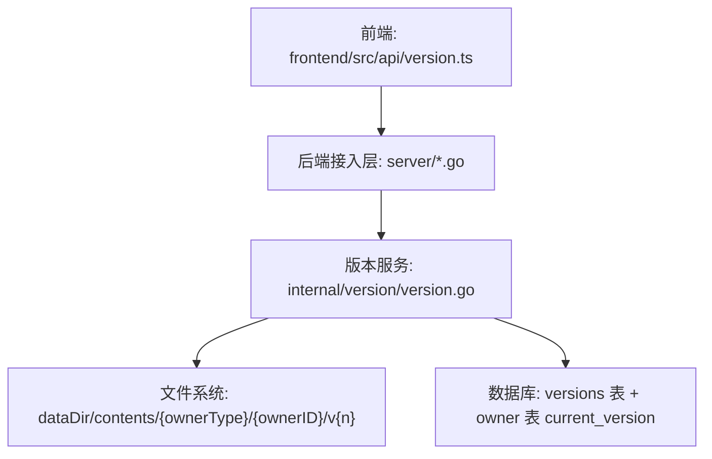
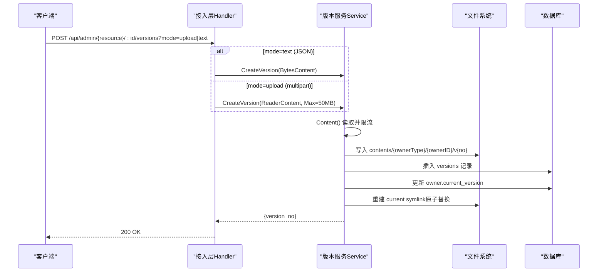
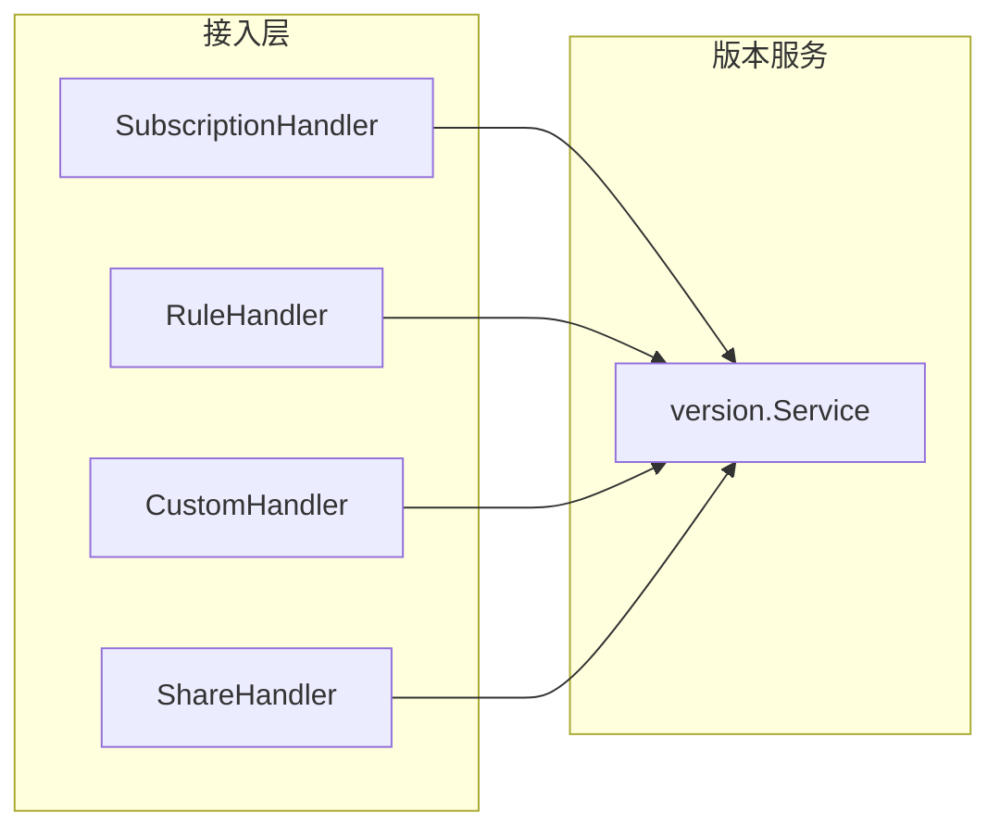

# 文件上传与处理

<cite>
**本文引用的文件**
- [backend/internal/version/version.go](file://backend/internal/version/version.go)
- [backend/internal/server/subscription.go](file://backend/internal/server/subscription.go)
- [backend/internal/server/rule.go](file://backend/internal/server/rule.go)
- [backend/internal/server/custom.go](file://backend/internal/server/custom.go)
- [backend/internal/server/share.go](file://backend/internal/server/share.go)
- [frontend/src/api/version.ts](file://frontend/src/api/version.ts)
</cite>

## 更新摘要
**已进行的更改**
- 移除了YAML语法验证相关的所有文档内容
- 更新了文本模式响应结构说明（不再包含yaml_warning字段）
- 简化了错误处理和警告机制的描述
- 更新了安全扫描现状说明

## 目录
1. [简介](#简介)
2. [项目结构](#项目结构)
3. [核心组件](#核心组件)
4. [架构总览](#架构总览)
5. [详细组件分析](#详细组件分析)
6. [依赖关系分析](#依赖关系分析)
7. [性能考量](#性能考量)
8. [故障排查指南](#故障排查指南)
9. [结论](#结论)
10. [附录：请求示例与错误码](#附录请求示例与错误码)

## 简介
本文件面向"版本创建"接口的双模式支持，覆盖文件上传模式（mode=upload，multipart/form-data）与文本编辑模式（mode=text，JSON）。文档重点说明：
- 文件大小限制与内容类型校验策略
- 文件存储机制、临时文件处理与内存优化
- 文本模式的简单内容处理（无语法检查）
- 安全扫描现状与建议
- 不同上传方式的完整请求示例（curl 与 JavaScript）
- 错误处理机制（文件过大、格式不支持、上传失败等）

## 项目结构
后端采用 Gin 路由 + 领域服务分层。版本管理由通用 Service 提供，订阅、规则、自定义订阅、分享订阅均复用同一套版本端点处理器。前端通过统一的 version API 封装调用。

**图表来源**
- [backend/internal/server/subscription.go:150-235](file://backend/internal/server/subscription.go#L150-L235)
- [backend/internal/version/version.go:125-180](file://backend/internal/version/version.go#L125-L180)

**章节来源**
- [backend/internal/server/subscription.go:1-306](file://backend/internal/server/subscription.go#L1-L306)
- [backend/internal/version/version.go:1-512](file://backend/internal/version/version.go#L1-L512)
- [frontend/src/api/version.ts:1-31](file://frontend/src/api/version.ts#L1-L31)

## 核心组件
- 版本服务 Service：负责版本创建、切换、删除、预览、列表；统一实现大小限制、原子切换、symlink 重建、启动自检、驱逐最旧版本等。
- 接入层 Handler：订阅、规则、自定义订阅、分享订阅的 /versions 端点统一复用通用处理器，支持 mode=upload 与 mode=text。
- 前端 API：根据 payload 类型自动拼接 ?mode=text 或 FormData 上传。

关键约束与能力
- 最大内容大小：50MB（MaxContentSize），在 ReaderContent.Content() 中通过 LimitReader 流式读取并校验。
- 版本上限：每份资源最多 5 个版本，超出时自动驱逐最旧版本（不含当前激活）。
- 原子切换：DB 更新 current_version 与 symlink 原子替换，保证一致性。
- 文本模式：直接保存文本内容，不进行语法检查或格式验证。

**章节来源**
- [backend/internal/version/version.go:25-38](file://backend/internal/version/version.go#L25-L38)
- [backend/internal/version/version.go:88-108](file://backend/internal/version/version.go#L88-L108)
- [backend/internal/version/version.go:125-180](file://backend/internal/version/version.go#L125-L180)
- [backend/internal/server/subscription.go:194-235](file://backend/internal/server/subscription.go#L194-L235)

## 架构总览
版本创建流程（双模式）如下：

**图表来源**
- [backend/internal/server/subscription.go:194-235](file://backend/internal/server/subscription.go#L194-L235)
- [backend/internal/version/version.go:125-180](file://backend/internal/version/version.go#L125-L180)

## 详细组件分析

### 版本服务（version.Service）
职责
- 版本创建：计算版本号、写文件、写记录、切换当前指针、驱逐最旧版本，全部在 BEGIN IMMEDIATE 事务内完成。
- 版本切换：原子更新 DB 与 symlink。
- 版本删除：保护最后一条与当前激活版本。
- 预览与下载：按 DB 当前版本读取内容。
- 内容处理：简单的文本内容保存，不进行语法检查或格式验证。

数据与路径
- 内容根目录：dataDir/contents
- 版本相对路径：{ownerType}/{ownerID}/v{n}
- 当前指针：current symlink（临时文件 + rename 原子替换）

内存与流式处理
- 使用 io.LimitReader 限制读取到 Max+1 字节，避免整读大文件导致 OOM。
- 文本模式直接以 []byte 传递，适合小体积配置。

**章节来源**
- [backend/internal/version/version.go:88-108](file://backend/internal/version/version.go#L88-L108)
- [backend/internal/version/version.go:125-180](file://backend/internal/version/version.go#L125-L180)
- [backend/internal/version/version.go:218-264](file://backend/internal/version/version.go#L218-L264)

### 接入层版本端点（通用处理器）
所有资源（订阅、规则、自定义订阅、分享订阅）共用以下版本端点：
- GET /:id/versions：列出版本（含当前激活标记）
- POST /:id/versions：创建新版本（双模式）
- PUT /:id/versions/current：切换当前版本
- GET /:id/versions/:ver/preview：预览版本内容（text/plain; no-store）
- DELETE /:id/versions/:ver：删除版本（受保护）

双模式实现要点
- mode=text：解析 JSON { text }，构造 BytesContent。
- mode=upload：从 multipart 表单取 file 字段，构造 ReaderContent，并传入原始文件名。
- 文本模式响应仅包含 version_no 字段（移除了 yaml_warning）。

**章节来源**
- [backend/internal/server/subscription.go:150-306](file://backend/internal/server/subscription.go#L150-L306)
- [backend/internal/server/rule.go:186-206](file://backend/internal/server/rule.go#L186-L206)
- [backend/internal/server/custom.go:105-126](file://backend/internal/server/custom.go#L105-L126)
- [backend/internal/server/share.go:170-191](file://backend/internal/server/share.go#L170-L191)

### 前端版本 API
- 自动判断模式：当 payload 不是 FormData 时，自动追加 ?mode=text。
- 文本模式：发送 JSON { text }。
- 文件模式：发送 FormData，包含 file 字段。

**章节来源**
- [frontend/src/api/version.ts:12-23](file://frontend/src/api/version.ts#L12-L23)

## 依赖关系分析
- 接入层依赖版本服务，统一复用 versionCreate/versionList/versionSwitch/versionPreview/versionDelete。
- 版本服务依赖 store（数据库事务）、文件系统（内容目录与 symlink）、日志。
- 前端依赖统一 http 客户端，封装版本接口。

**图表来源**
- [backend/internal/server/subscription.go:150-306](file://backend/internal/server/subscription.go#L150-L306)
- [backend/internal/server/rule.go:186-206](file://backend/internal/server/rule.go#L186-L206)
- [backend/internal/server/custom.go:105-126](file://backend/internal/server/custom.go#L105-L126)
- [backend/internal/server/share.go:170-191](file://backend/internal/server/share.go#L170-L191)

## 性能考量
- 流式读取与限流：ReaderContent 使用 io.LimitReader 限制读取大小，避免将超大文件整体加载到内存。
- 原子切换：symlink 通过临时文件 + os.Rename 原子替换，降低并发切换期间的不一致风险。
- 版本驱逐：超过 5 版自动删除最旧版本，控制磁盘占用。
- 预览与下载：text/plain 直出，无额外序列化开销；禁用缓存头避免中间代理缓存敏感内容。

## 故障排查指南
常见错误与定位
- 内容超过 50MB 限制：
  - 现象：POST 版本创建返回 400，提示"内容超过 50MB 限制"。
  - 原因：ReaderContent.Content() 读取后长度超过 MaxContentSize。
  - 处理：压缩文件或拆分配置；检查前端是否误传了大文件。
- 未接收到文件：
  - 现象：POST 版本创建返回 400，提示"未接收到文件"。
  - 原因：multipart 表单缺少 file 字段或解析失败。
  - 处理：确认前端 FormData 正确附加 file 字段。
- 参数校验失败：
  - 现象：POST 版本创建（文本模式）返回 400，提示"参数校验失败"。
  - 原因：JSON 缺少 text 字段或格式不正确。
  - 处理：检查请求体结构与必填字段。
- 版本不存在：
  - 现象：预览或删除返回 404，提示"版本不存在"。
  - 原因：指定 version_no 不存在。
  - 处理：先获取版本列表再操作。
- 不可删除最后一个/当前激活版本：
  - 现象：删除返回 400，提示相应错误。
  - 原因：保护策略阻止删除最后一条或当前激活版本。
  - 处理：先切换到其他版本后再删除。

**章节来源**
- [backend/internal/server/subscription.go:194-306](file://backend/internal/server/subscription.go#L194-L306)
- [backend/internal/version/version.go:125-180](file://backend/internal/version/version.go#L125-L180)
- [backend/internal/version/version.go:303-338](file://backend/internal/version/version.go#L303-L338)

## 结论
- 版本创建接口同时支持文件上传与文本编辑两种模式，统一通过查询参数 mode 区分。
- 文件大小限制为 50MB，采用流式读取与限流，保障内存安全。
- 文本模式直接保存内容，不进行语法检查或格式验证，简化了处理流程。
- 文件存储采用固定目录结构 + symlink 当前指针，配合事务与原子替换确保一致性。
- 安全方面，当前未对上传文件进行内容类型强校验与恶意内容扫描；建议在接入层增加 MIME 白名单与内容扫描扩展点。

## 附录：请求示例与错误码

### 文件上传模式（mode=upload，multipart/form-data）
- 端点：POST /api/admin/{resource}/:id/versions?mode=upload
- 表单字段：file（二进制文件）
- 成功响应：{ version_no }
- 典型 curl 示例（请替换 URL、Token、资源类型与 ID）：
  - curl -X POST "https://your-domain/api/admin/subscriptions/123/versions?mode=upload" -H "Authorization: Bearer YOUR_TOKEN" -F "file=@subscription.yaml"
  - curl -X POST "https://your-domain/api/admin/rules/456/versions?mode=upload" -H "Authorization: Bearer YOUR_TOKEN" -F "file=@rule.conf"
  - curl -X POST "https://your-domain/api/admin/shares/789/versions?mode=upload" -H "Authorization: Bearer YOUR_TOKEN" -F "file=@share.yaml"
  - curl -X POST "https://your-domain/api/admin/customs/101/versions?mode=upload" -H "Authorization: Bearer YOUR_TOKEN" -F "file=@custom.yaml"

- JavaScript 示例（FormData 上传）：
  - const fd = new FormData(); fd.append('file', fileObject); await fetch('/api/admin/subscriptions/123/versions?mode=upload', { method: 'POST', headers: { Authorization: 'Bearer YOUR_TOKEN' }, body: fd });

**章节来源**
- [backend/internal/server/subscription.go:194-235](file://backend/internal/server/subscription.go#L194-L235)
- [backend/internal/server/rule.go:51-105](file://backend/internal/server/rule.go#L51-L105)
- [backend/internal/server/custom.go:34-82](file://backend/internal/server/custom.go#L34-L82)
- [backend/internal/server/share.go:47-91](file://backend/internal/server/share.go#L47-L91)
- [frontend/src/api/version.ts:16-23](file://frontend/src/api/version.ts#L16-L23)

### 文本编辑模式（mode=text，application/json）
- 端点：POST /api/admin/{resource}/:id/versions?mode=text
- 请求体：{ text: "配置文件内容" }
- 成功响应：{ version_no }
- 典型 curl 示例：
  - curl -X POST "https://your-domain/api/admin/subscriptions/123/versions?mode=text" -H "Authorization: Bearer YOUR_TOKEN" -H "Content-Type: application/json" -d '{"text":"proxies:\\n- name: proxy\\n  type: ss\\n  server: 1.2.3.4\\n  port: 443"}'
  - curl -X POST "https://your-domain/api/admin/rules/456/versions?mode=text" -H "Authorization: Bearer YOUR_TOKEN" -H "Content-Type: application/json" -d '{"text":"# 规则内容..."}'
  - curl -X POST "https://your-domain/api/admin/shares/789/versions?mode=text" -H "Authorization: Bearer YOUR_TOKEN" -H "Content-Type: application/json" -d '{"text":"# 分享内容..."}'
  - curl -X POST "https://your-domain/api/admin/customs/101/versions?mode=text" -H "Authorization: Bearer YOUR_TOKEN" -H "Content-Type: application/json" -d '{"text":"# 自定义内容..."}'

- JavaScript 示例（JSON 文本）：
  - await fetch('/api/admin/subscriptions/123/versions?mode=text', { method: 'POST', headers: { Authorization: 'Bearer YOUR_TOKEN', 'Content-Type': 'application/json' }, body: JSON.stringify({ text: '配置文件内容' }) });

**章节来源**
- [backend/internal/server/subscription.go:194-235](file://backend/internal/server/subscription.go#L194-L235)
- [backend/internal/server/rule.go:51-105](file://backend/internal/server/rule.go#L51-L105)
- [backend/internal/server/custom.go:34-82](file://backend/internal/server/custom.go#L34-L82)
- [backend/internal/server/share.go:47-91](file://backend/internal/server/share.go#L47-L91)
- [frontend/src/api/version.ts:16-23](file://frontend/src/api/version.ts#L16-L23)

### 错误码与处理建议
- 400 参数校验失败：检查 JSON 结构或 multipart 字段是否正确。
- 400 内容超过 50MB 限制：压缩或拆分文件；检查前端是否误传大文件。
- 400 未接收到文件：确认 FormData 中 file 字段已正确附加。
- 404 版本不存在：先获取版本列表，再选择正确的 version_no。
- 400 不可删除最后一个/当前激活版本：先切换到其他版本后再删除。
- 500 服务器内部错误：查看服务端日志，定位异常堆栈。

**章节来源**
- [backend/internal/server/subscription.go:194-306](file://backend/internal/server/subscription.go#L194-L306)
- [backend/internal/version/version.go:125-180](file://backend/internal/version/version.go#L125-L180)
- [backend/internal/version/version.go:303-338](file://backend/internal/version/version.go#L303-L338)

### 文件大小限制与内容类型验证
- 文件大小限制：50MB（MaxContentSize），在 ReaderContent.Content() 中通过 LimitReader 限制读取并校验长度。
- 内容类型验证：当前接入层未对 multipart 文件的 Content-Type 做强制白名单校验；建议在生产环境增加 MIME 白名单（如 .yaml/.yml/.conf 等）与可选的内容扫描扩展点。

**章节来源**
- [backend/internal/version/version.go:88-108](file://backend/internal/version/version.go#L88-L108)
- [backend/internal/server/subscription.go:194-235](file://backend/internal/server/subscription.go#L194-L235)

### 文件存储机制与临时文件处理
- 存储路径：dataDir/contents/{ownerType}/{ownerID}/v{n}
- 当前指针：current symlink，通过临时文件 + os.Rename 原子替换，避免并发切换导致的不一致。
- 事务回滚：任一步骤失败会清理已写文件并回滚数据库记录。

**章节来源**
- [backend/internal/version/version.go:110-123](file://backend/internal/version/version.go#L110-L123)
- [backend/internal/version/version.go:125-180](file://backend/internal/version/version.go#L125-L180)
- [backend/internal/version/version.go:218-264](file://backend/internal/version/version.go#L218-L264)

### 内存使用优化
- 流式读取：ReaderContent 使用 io.LimitReader 限制读取大小，避免整读大文件导致 OOM。
- 文本模式：BytesContent 直接以 []byte 传递，适用于小体积配置。
- 预览与下载：text/plain 直出，无额外序列化开销。

**章节来源**
- [backend/internal/version/version.go:88-108](file://backend/internal/version/version.go#L88-L108)
- [backend/internal/server/subscription.go:262-283](file://backend/internal/server/subscription.go#L262-L283)

### 安全扫描现状与建议
- 现状：当前未对上传文件进行内容类型强校验与恶意内容扫描，也不进行 YAML 语法检查。
- 建议：
  - 接入层增加 MIME 白名单校验（如 .yaml/.yml/.conf）。
  - 引入内容扫描扩展点（如病毒扫描、敏感信息检测）。
  - 对文本模式进行更严格的输入校验与长度限制。