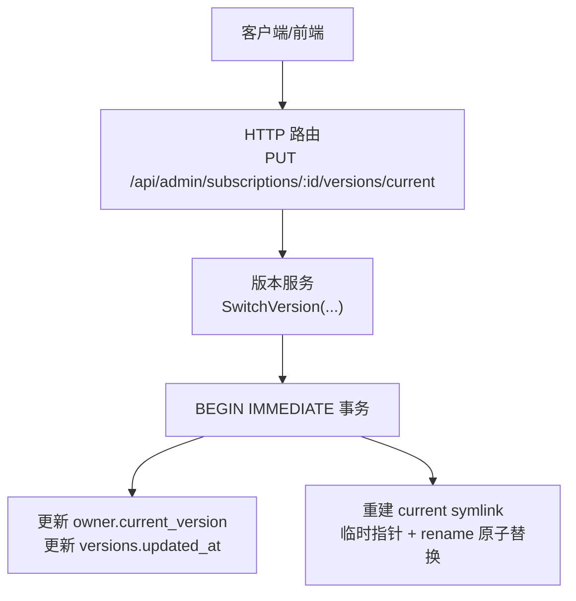
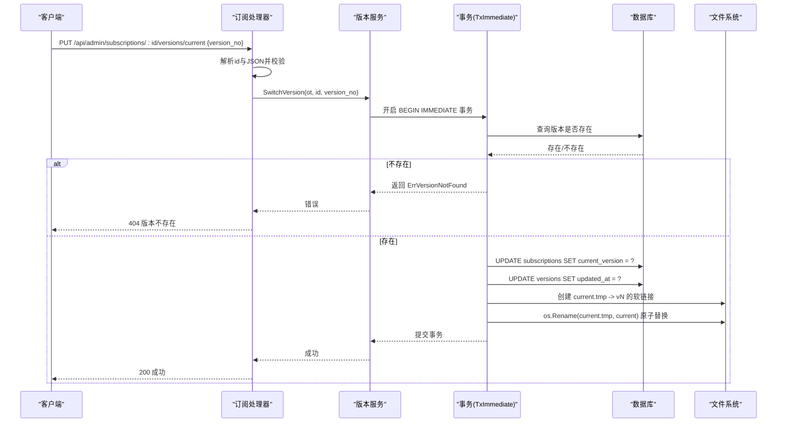
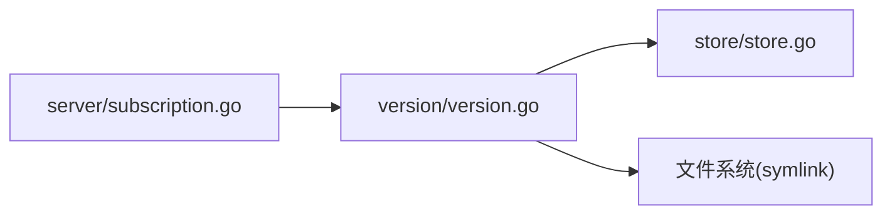

# 版本切换API

<cite>
**本文引用的文件**
- [backend/internal/server/subscription.go](file://backend/internal/server/subscription.go)
- [backend/internal/version/version.go](file://backend/internal/version/version.go)
- [backend/internal/store/store.go](file://backend/internal/store/store.go)
- [frontend/src/api/version.ts](file://frontend/src/api/version.ts)
- [Build2.md](../../../../../../../docs/reports/Build/Build2.md)
</cite>

## 目录
1. [简介](#简介)
2. [项目结构](#项目结构)
3. [核心组件](#核心组件)
4. [架构总览](#架构总览)
5. [详细组件分析](#详细组件分析)
6. [依赖关系分析](#依赖关系分析)
7. [性能与并发特性](#性能与并发特性)
8. [故障排查指南](#故障排查指南)
9. [结论](#结论)
10. [附录：请求与响应示例、错误码、回滚与升级工作流](#附录请求与响应示例错误码回滚与升级工作流)

## 简介
本章节面向管理员，说明 PUT /api/admin/subscriptions/:id/versions/current 接口的职责与行为：以原子方式将指定订阅的“当前版本”切换到目标版本。该接口用于在线发布新版本或回滚到历史版本，保证数据库记录与文件系统指针的一致性，并提供明确的参数校验、存在性检查与错误返回。

## 项目结构
与版本切换相关的后端代码主要分布在以下位置：
- 接入层（HTTP路由与请求处理）：backend/internal/server/subscription.go
- 业务层（版本管理事务组件）：backend/internal/version/version.go
- 数据层（SQLite 事务封装）：backend/internal/store/store.go
- 前端调用封装：frontend/src/api/version.ts
- 设计约束与验收要点：Build2.md

图表来源
- [backend/internal/server/subscription.go:237-260](file://backend/internal/server/subscription.go#L237-L260)
- [backend/internal/version/version.go:218-245](file://backend/internal/version/version.go#L218-L245)
- [backend/internal/store/store.go:147-164](file://backend/internal/store/store.go#L147-L164)

章节来源
- [backend/internal/server/subscription.go:21-38](file://backend/internal/server/subscription.go#L21-L38)
- [backend/internal/version/version.go:25-55](file://backend/internal/version/version.go#L25-L55)
- [backend/internal/store/store.go:31-52](file://backend/internal/store/store.go#L31-L52)

## 核心组件
- 路由与处理器：在订阅模块中注册版本相关端点，其中 PUT /:id/versions/current 由通用 versionSwitch 处理器转发至版本服务。
- 版本服务：提供 SwitchVersion 原子切换能力，包含版本存在性检查、DB 写入、symlink 重建。
- 事务封装：通过 BEGIN IMMEDIATE 事务确保“读→判定→写”串行化，避免并发竞争。
- 前端封装：versionApi.switchCurrent 统一调用该切换接口。

章节来源
- [backend/internal/server/subscription.go:237-260](file://backend/internal/server/subscription.go#L237-L260)
- [backend/internal/version/version.go:218-245](file://backend/internal/version/version.go#L218-L245)
- [backend/internal/store/store.go:147-164](file://backend/internal/store/store.go#L147-L164)
- [frontend/src/api/version.ts:24-25](file://frontend/src/api/version.ts#L24-L25)

## 架构总览
版本切换的整体流程如下：
1. 客户端发送 PUT /api/admin/subscriptions/:id/versions/current，携带 { version_no }。
2. 接入层解析路径参数 id 与 JSON body，进行基础校验。
3. 调用版本服务的 SwitchVersion，在 BEGIN IMMEDIATE 事务内：
   - 校验目标版本是否存在；
   - 更新对应 owner 表的 current_version；
   - 更新该版本的 updated_at；
   - 重建 current symlink（临时文件 + os.Rename 原子替换）。
4. 成功返回统一成功响应；失败按错误类型映射为 HTTP 状态码。

图表来源
- [backend/internal/server/subscription.go:237-260](file://backend/internal/server/subscription.go#L237-L260)
- [backend/internal/version/version.go:218-245](file://backend/internal/version/version.go#L218-L245)
- [backend/internal/store/store.go:147-164](file://backend/internal/store/store.go#L147-L164)

## 详细组件分析

### 接入层：版本切换处理器
- 路由注册：在订阅模块下注册 PUT /:id/versions/current，绑定到 versionSwitch。
- 参数解析与校验：
  - 路径参数 id：必须为正整数，否则返回 400。
  - JSON body：必须包含 version_no，且为必填字段。
- 错误映射：
  - 版本不存在 → 404。
  - 其他异常 → 500。

章节来源
- [backend/internal/server/subscription.go:21-38](file://backend/internal/server/subscription.go#L21-L38)
- [backend/internal/server/subscription.go:237-260](file://backend/internal/server/subscription.go#L237-L260)

### 业务层：原子切换实现
- 版本存在性检查：在事务内查询 versions 表，若不存在则返回业务错误。
- 原子切换步骤：
  - 更新 owner 表（subscriptions）的 current_version；
  - 更新对应版本的 updated_at；
  - 重建 current symlink：先创建临时软链接 current.tmp，再原子替换为 current。
- 时间戳刷新：无论切换到新/旧版本，均刷新该版本的 updated_at，便于首页展示“最近变动”。

章节来源
- [backend/internal/version/version.go:218-245](file://backend/internal/version/version.go#L218-L245)

### 数据层：事务与并发安全
- 事务模式：使用 BEGIN IMMEDIATE 事务，开启即持有写锁，确保“读→判定→写”串行化。
- 并发控制：
  - SQLite 单写者模型（MaxOpenConns=1），配合 busy_timeout 降低冲突概率；
  - BEGIN IMMEDIATE 保证并发场景下的顺序执行与一致性。
- 失败回滚：事务内任何一步失败自动回滚，不留下半更新状态。

章节来源
- [backend/internal/store/store.go:31-52](file://backend/internal/store/store.go#L31-L52)
- [backend/internal/store/store.go:147-164](file://backend/internal/store/store.go#L147-L164)

### 前端调用
- 统一封装：versionApi.switchCurrent(ownerId, versionNo) 调用 PUT /api/admin/subscriptions/:ownerId/versions/current，请求体为 { version_no }。
- 典型用法：在版本管理界面选择目标版本后触发切换，成功后刷新列表。

章节来源
- [frontend/src/api/version.ts:24-25](file://frontend/src/api/version.ts#L24-L25)

## 依赖关系分析
- 路由层依赖版本服务；版本服务依赖数据层事务与文件系统操作。
- 关键依赖链：
  - server/subscription.go → version.Service.SwitchVersion
  - version.Service → store.Store.TxImmediate
  - version.Service → 文件系统（创建/替换 symlink）

图表来源
- [backend/internal/server/subscription.go:237-260](file://backend/internal/server/subscription.go#L237-L260)
- [backend/internal/version/version.go:218-245](file://backend/internal/version/version.go#L218-L245)
- [backend/internal/store/store.go:147-164](file://backend/internal/store/store.go#L147-L164)

章节来源
- [backend/internal/server/subscription.go:237-260](file://backend/internal/server/subscription.go#L237-L260)
- [backend/internal/version/version.go:218-245](file://backend/internal/version/version.go#L218-L245)
- [backend/internal/store/store.go:147-164](file://backend/internal/store/store.go#L147-L164)

## 性能与并发特性
- 事务开销：BEGIN IMMEDIATE 事务带来串行化保障，适合“先读后写”的场景，避免脏读与竞态条件。
- 文件系统操作：symlink 重建采用临时文件 + os.Rename，属于原子替换，切换耗时极低。
- 并发安全：SQLite 单写者模型 + busy_timeout + BEGIN IMMEDIATE，确保高并发下不会丢失更新或产生不一致。
- 扩展性：版本切换仅涉及少量行更新与一次 symlink 重建，性能瓶颈主要在数据库事务与磁盘 I/O。

[本节为通用指导，无需特定文件引用]

## 故障排查指南
- 常见错误与定位：
  - 400 参数错误：检查路径 id 是否为正整数，JSON body 是否包含 version_no。
  - 404 版本不存在：确认目标 version_no 确实属于该订阅，且未被删除。
  - 500 服务器内部错误：查看日志中的事务错误或文件系统错误（如权限不足、磁盘空间不足）。
- 启动自检：
  - 若 DB 的 current_version 与 filesystem 的 current symlink 不一致，启动时会以 DB 为准重建 symlink，避免下载分发指向错误版本。
- 回滚策略：
  - 切换失败时事务自动回滚，DB 与文件系统保持一致；可重试或回退到上一版本。

章节来源
- [backend/internal/version/version.go:438-484](file://backend/internal/version/version.go#L438-L484)
- [backend/internal/server/subscription.go:237-260](file://backend/internal/server/subscription.go#L237-L260)

## 结论
PUT /api/admin/subscriptions/:id/versions/current 提供了安全、原子、可回滚的版本切换能力。通过 BEGIN IMMEDIATE 事务与 symlink 原子替换，确保 DB 与文件系统一致；严格的参数校验与存在性检查保障了接口的健壮性。结合前端的统一封装，可实现平滑的升级与回滚工作流。

[本节为总结，无需特定文件引用]

## 附录：请求与响应示例、错误码、回滚与升级工作流

### 接口定义
- 方法：PUT
- 路径：/api/admin/subscriptions/:id/versions/current
- 认证：需要会话与管理员中间件
- 请求体：{ "version_no": <整数> }

### 请求示例
- 切换订阅 123 的当前版本为 5：
  - PUT /api/admin/subscriptions/123/versions/current
  - Body: { "version_no": 5 }

章节来源
- [backend/internal/server/subscription.go:237-260](file://backend/internal/server/subscription.go#L237-L260)
- [frontend/src/api/version.ts:24-25](file://frontend/src/api/version.ts#L24-L25)

### 响应格式
- 成功：
  - HTTP 200
  - 响应体：{ "code": 0, "data": null }
- 失败：
  - 400 参数错误：{ "code": 400, "message": "参数校验失败" }
  - 404 版本不存在：{ "code": 404, "message": "版本不存在" }
  - 500 服务器内部错误：{ "code": 500, "message": "服务器内部错误" }

章节来源
- [backend/internal/server/subscription.go:237-260](file://backend/internal/server/subscription.go#L237-L260)

### 错误码说明
- 400：参数错误（id 非正整数、缺少 version_no、JSON 解析失败）
- 404：版本不存在（目标 version_no 不属于该订阅或已被删除）
- 500：服务器内部错误（事务失败、文件系统错误等）

章节来源
- [backend/internal/server/subscription.go:237-260](file://backend/internal/server/subscription.go#L237-L260)

### 切换失败的处理策略
- 参数错误：修正请求参数后重试。
- 版本不存在：确认版本号是否正确，必要时先创建新版本。
- 服务器内部错误：查看服务端日志，检查数据库连接、磁盘空间与权限；必要时重启服务以触发启动自检重建 symlink。

章节来源
- [backend/internal/version/version.go:438-484](file://backend/internal/version/version.go#L438-L484)

### 回滚与升级完整工作流示例

#### 升级工作流
1. 创建新版本：POST /api/admin/subscriptions/:id/versions（支持文件上传或文本编辑）
2. 预览新版本：GET /api/admin/subscriptions/:id/versions/:ver/preview
3. 切换当前版本：PUT /api/admin/subscriptions/:id/versions/current { "version_no": N }
4. 验证生效：下载或预览当前版本内容

章节来源
- [backend/internal/server/subscription.go:150-170](file://backend/internal/server/subscription.go#L150-L170)
- [backend/internal/server/subscription.go:194-235](file://backend/internal/server/subscription.go#L194-L235)
- [backend/internal/server/subscription.go:237-260](file://backend/internal/server/subscription.go#L237-L260)

#### 回滚工作流
1. 列出历史版本：GET /api/admin/subscriptions/:id/versions
2. 选择要回滚到的版本号 M
3. 切换当前版本：PUT /api/admin/subscriptions/:id/versions/current { "version_no": M }
4. 验证回滚结果：预览或下载当前版本

章节来源
- [backend/internal/server/subscription.go:150-170](file://backend/internal/server/subscription.go#L150-L170)
- [backend/internal/server/subscription.go:237-260](file://backend/internal/server/subscription.go#L237-L260)

### 设计约束与验收要点（参考）
- 版本号计算与列表更新在单个 BEGIN IMMEDIATE 事务 + 库级写锁内完成；
- 当前指针以 DB 记录为准，symlink 仅作文件组织，启动时自检重建；
- 切换时更新该版本时间戳，首页反映“分发内容最近变动”。

章节来源
- [Build2.md:445-483](../../../../../../../docs/reports/Build/Build2.md#L445-L483)