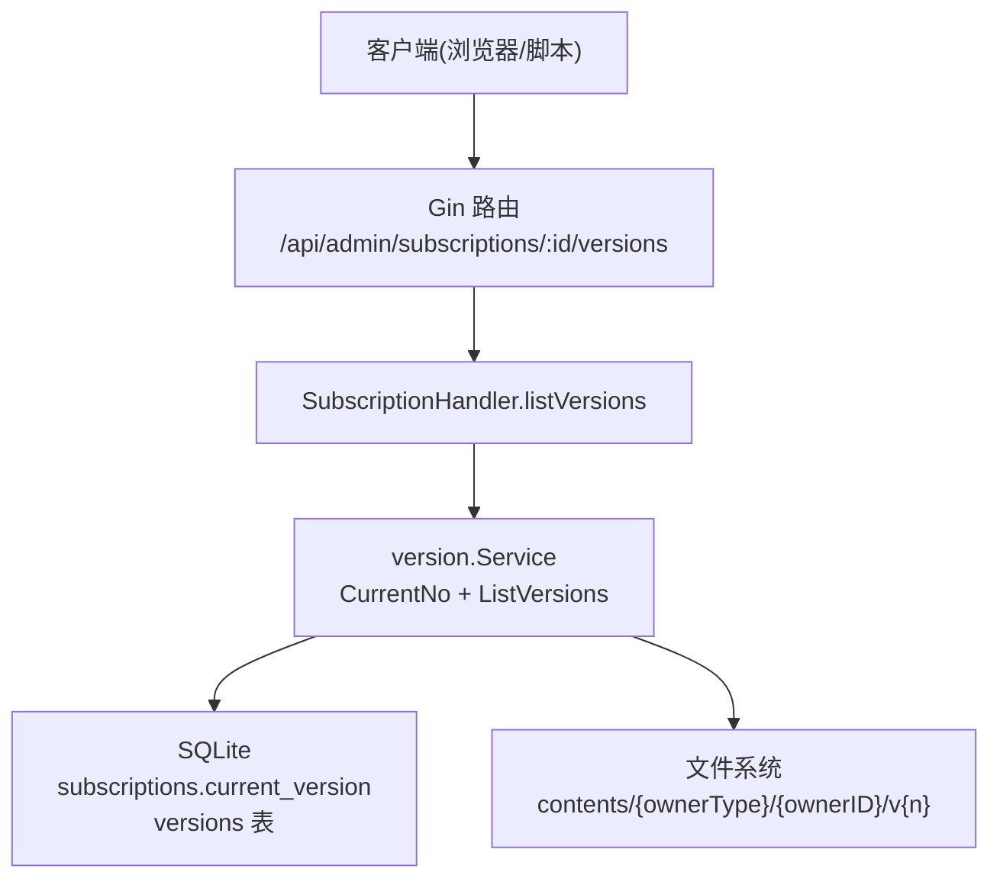
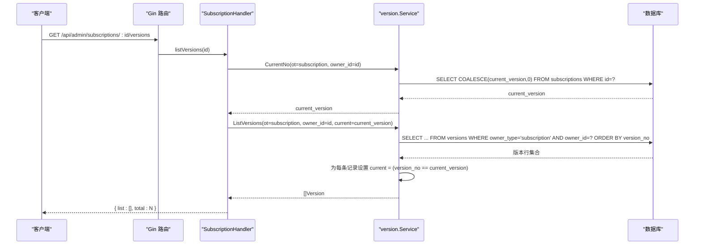
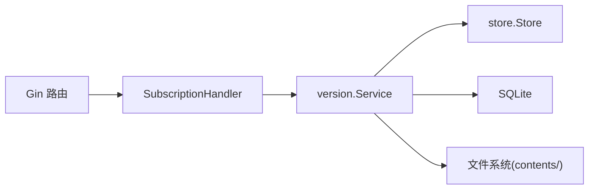

# 版本列表查询API

<cite>
**本文引用的文件**
- [backend/internal/server/subscription.go](file://backend/internal/server/subscription.go)
- [backend/internal/version/version.go](file://backend/internal/version/version.go)
- [backend/migrations/1002_subscriptions_versions.sql](file://backend/migrations/1002_subscriptions_versions.sql)
- [frontend/src/api/version.ts](file://frontend/src/api/version.ts)
- [frontend/src/views/admin/SubscriptionsView.vue](file://frontend/src/views/admin/SubscriptionsView.vue)
</cite>

## 目录
1. [简介](#简介)
2. [项目结构](#项目结构)
3. [核心组件](#核心组件)
4. [架构总览](#架构总览)
5. [详细组件分析](#详细组件分析)
6. [依赖关系分析](#依赖关系分析)
7. [性能考虑](#性能考虑)
8. [故障排查指南](#故障排查指南)
9. [结论](#结论)
10. [附录：请求与响应示例、常见使用场景](#附录请求与响应示例常见使用场景)

## 简介
本文档详细说明 GET /api/admin/subscriptions/:id/versions 接口的功能与实现，包括：
- 获取指定订阅的所有版本历史
- 当前激活版本的标记机制（以数据库 current_version 为准）
- 版本信息的完整字段结构
- 版本排序规则（按版本号降序）
- 响应数据格式与错误处理
- 完整的请求示例、响应示例与常见使用场景

该接口属于管理员端点，需通过会话与管理员中间件鉴权。

## 项目结构
本接口位于后端服务的路由注册层与通用版本服务之间：
- 路由注册：在订阅管理路由组中注册 GET /:id/versions
- 处理器：调用通用版本服务的 CurrentNo 与 ListVersions
- 数据源：versions 表存储版本元数据；subscriptions 表的 current_version 决定“当前激活”版本
- 前端：提供统一版本 API 封装，供订阅管理等页面调用

图表来源
- [backend/internal/server/subscription.go:21-38](file://backend/internal/server/subscription.go#L21-L38)
- [backend/internal/server/subscription.go:174-192](file://backend/internal/server/subscription.go#L174-L192)
- [backend/internal/version/version.go:340-369](file://backend/internal/version/version.go#L340-L369)
- [backend/migrations/1002_subscriptions_versions.sql:3-25](file://backend/migrations/1002_subscriptions_versions.sql#L3-L25)

章节来源
- [backend/internal/server/subscription.go:21-38](file://backend/internal/server/subscription.go#L21-L38)
- [backend/internal/server/subscription.go:174-192](file://backend/internal/server/subscription.go#L174-L192)
- [backend/internal/version/version.go:340-369](file://backend/internal/version/version.go#L340-L369)
- [backend/migrations/1002_subscriptions_versions.sql:3-25](file://backend/migrations/1002_subscriptions_versions.sql#L3-L25)

## 核心组件
- 路由与处理器：在订阅路由组下注册版本相关端点，GET /:id/versions 委托给通用版本列表函数
- 版本服务：提供 CurrentNo（读取当前版本）与 ListVersions（读取版本列表并填充 current 标记）
- 数据模型：Version 包含 version_no、file_path、file_name、current、created_at、updated_at
- 数据库：subscriptions 表维护 current_version；versions 表记录每个资源的多版本信息

章节来源
- [backend/internal/server/subscription.go:21-38](file://backend/internal/server/subscription.go#L21-L38)
- [backend/internal/server/subscription.go:174-192](file://backend/internal/server/subscription.go#L174-L192)
- [backend/internal/version/version.go:61-69](file://backend/internal/version/version.go#L61-L69)
- [backend/migrations/1002_subscriptions_versions.sql:3-25](file://backend/migrations/1002_subscriptions_versions.sql#L3-L25)

## 架构总览
GET /api/admin/subscriptions/:id/versions 的调用链如下：
1. 客户端发起 GET 请求到 /api/admin/subscriptions/:id/versions
2. Gin 路由匹配后进入 SubscriptionHandler.listVersions
3. 解析路径参数 id，调用 version.Service.CurrentNo 获取当前版本号
4. 调用 version.Service.ListVersions 获取版本列表，并将 current 字段根据 current_version 填充
5. 返回统一列表包装结构 { list, total }

图表来源
- [backend/internal/server/subscription.go:174-192](file://backend/internal/server/subscription.go#L174-L192)
- [backend/internal/version/version.go:340-369](file://backend/internal/version/version.go#L340-L369)
- [backend/migrations/1002_subscriptions_versions.sql:3-25](file://backend/migrations/1002_subscriptions_versions.sql#L3-L25)

## 详细组件分析

### 接口定义与鉴权
- 路径：GET /api/admin/subscriptions/:id/versions
- 鉴权：需要会话与管理员中间件（路由组已叠加 sessionMW 与 adminMW）
- 路径参数：
  - id：订阅 ID（正整数），非法或不存在时由 parseID 校验失败返回参数错误

章节来源
- [backend/internal/server/subscription.go:21-38](file://backend/internal/server/subscription.go#L21-L38)
- [backend/internal/server/subscription.go:40-47](file://backend/internal/server/subscription.go#L40-L47)

### 当前激活版本标记机制
- 数据来源：subscriptions 表的 current_version 字段
- 标记逻辑：
  - 先读取当前版本号 current_version
  - 查询 versions 表得到该订阅的所有版本
  - 对每条版本记录，若 version_no == current_version，则 current 为 true，否则为 false
- 语义：当前激活版本以数据库记录为准，symlink 仅用于文件组织

章节来源
- [backend/internal/version/version.go:340-369](file://backend/internal/version/version.go#L340-L369)
- [backend/migrations/1002_subscriptions_versions.sql:3-11](file://backend/migrations/1002_subscriptions_versions.sql#L3-L11)

### 版本信息字段结构
返回的 list 数组每项为 Version 对象，字段如下：
- version_no：整数，版本号（自增，删除后不复用）
- file_path：字符串，版本内容相对路径（contents/{ownerType}/{ownerID}/v{n}）
- file_name：字符串，原始文件名（文本模式为类型默认名）
- current：布尔值，是否为当前激活版本
- created_at：时间戳，创建时间
- updated_at：时间戳，更新时间

章节来源
- [backend/internal/version/version.go:61-69](file://backend/internal/version/version.go#L61-L69)
- [backend/internal/version/version.go:350-369](file://backend/internal/version/version.go#L350-L369)

### 版本排序规则
- 默认排序：按 version_no 升序（数据库查询 ORDER BY version_no）
- 前端展示建议：如需“最新版本在前”，请在前端对 list 进行 reverse 排序（按 version_no 降序）
- 说明：后端不直接返回降序，但可通过前端排序满足 UI 需求

章节来源
- [backend/internal/version/version.go:350-369](file://backend/internal/version/version.go#L350-L369)

### 响应数据格式
- 成功响应：统一列表包装结构
  - { list: Version[], total: number }
- 空列表：list 为空数组 []，total 为 0（避免 null，便于前端 .map 安全遍历）

章节来源
- [backend/internal/server/subscription.go:174-192](file://backend/internal/server/subscription.go#L174-L192)
- [backend/internal/version/version.go:350-369](file://backend/internal/version/version.go#L350-L369)

### 错误处理
- 参数错误：id 非正整数或无法解析 → 400 参数错误
- 服务器错误：数据库或内部异常 → 500 服务器错误
- 业务错误：
  - 版本不存在（切换/预览/删除等场景）→ 404
  - 不可删除最后一个/当前版本（删除场景）→ 400
  - 内容过大（创建场景）→ 400

章节来源
- [backend/internal/server/subscription.go:40-47](file://backend/internal/server/subscription.go#L40-L47)
- [backend/internal/server/subscription.go:174-192](file://backend/internal/server/subscription.go#L174-L192)
- [backend/internal/version/version.go:33-38](file://backend/internal/version/version.go#L33-L38)

### 前端集成与使用
- 前端 API 封装：
  - versionApi(prefix).list(ownerId) 调用 GET ${prefix}/${ownerId}/versions
  - 返回类型为 { list: VersionItem[], total: number }
- 订阅管理页：
  - 通过路由跳转至版本管理页，传入订阅 id
  - 列表展示当前版本标签与操作入口

章节来源
- [frontend/src/api/version.ts:12-16](file://frontend/src/api/version.ts#L12-L16)
- [frontend/src/views/admin/SubscriptionsView.vue:40-43](file://frontend/src/views/admin/SubscriptionsView.vue#L40-L43)

## 依赖关系分析
- 路由依赖：Gin 引擎、会话与管理员中间件
- 处理器依赖：version.Service
- 服务依赖：store.Store（数据库访问）、文件系统（版本内容）
- 数据库依赖：subscriptions.current_version、versions 表

图表来源
- [backend/internal/server/subscription.go:21-38](file://backend/internal/server/subscription.go#L21-L38)
- [backend/internal/version/version.go:50-59](file://backend/internal/version/version.go#L50-L59)

章节来源
- [backend/internal/server/subscription.go:21-38](file://backend/internal/server/subscription.go#L21-L38)
- [backend/internal/version/version.go:50-59](file://backend/internal/version/version.go#L50-L59)

## 性能考虑
- 数据库查询：
  - CurrentNo 单行查询，O(1)
  - ListVersions 按 owner_type 与 owner_id 过滤，索引 idx_versions_owner 提升查询效率
- 内存与序列化：
  - 空列表返回 [] 而非 null，减少前端判空开销
- 并发与事务：
  - 版本创建/切换使用 BEGIN IMMEDIATE 事务保证原子性（与本接口无直接写入，但影响 current_version 一致性）

[本节为一般性指导，无需特定文件引用]

## 故障排查指南
- 问题：返回空列表
  - 检查订阅是否存在且是否有版本记录
  - 确认 subscriptions.current_version 是否为 0（无版本）
- 问题：current 标记不正确
  - 核对 subscriptions.current_version 是否与期望版本一致
  - 检查是否执行过切换当前版本操作
- 问题：前端显示顺序不符合预期
  - 后端按 version_no 升序返回，前端需自行 reverse 实现降序展示

章节来源
- [backend/internal/version/version.go:340-369](file://backend/internal/version/version.go#L340-L369)
- [backend/migrations/1002_subscriptions_versions.sql:3-25](file://backend/migrations/1002_subscriptions_versions.sql#L3-L25)

## 结论
GET /api/admin/subscriptions/:id/versions 提供了获取订阅版本历史的稳定接口，通过数据库 current_version 精确标记当前激活版本，并以统一列表结构返回。结合前端的排序与展示逻辑，可灵活呈现“最新版本在前”的管理界面。接口具备完善的参数校验与错误处理，适用于订阅版本管理与分发流程。

[本节为总结性内容，无需特定文件引用]

## 附录：请求与响应示例、常见使用场景

### 请求示例
- 方法：GET
- 路径：/api/admin/subscriptions/123/versions
- 鉴权：需携带有效会话与管理员权限

章节来源
- [backend/internal/server/subscription.go:21-38](file://backend/internal/server/subscription.go#L21-L38)

### 响应示例
- 成功：
  - 状态码：200
  - 响应体：{ list: [{ version_no, file_path, file_name, current, created_at, updated_at }, ...], total: N }
- 空列表：
  - 状态码：200
  - 响应体：{ list: [], total: 0 }

章节来源
- [backend/internal/server/subscription.go:174-192](file://backend/internal/server/subscription.go#L174-L192)
- [backend/internal/version/version.go:350-369](file://backend/internal/version/version.go#L350-L369)

### 常见使用场景
- 版本管理页面加载：
  - 调用接口获取版本列表，前端按 version_no 降序展示
  - 高亮 current=true 的版本为“当前激活”
- 切换当前版本后刷新：
  - 调用切换接口后再次调用本接口，验证 current 标记更新
- 审计与回滚：
  - 查看历史版本列表，定位变更时间点（created_at/updated_at）
  - 结合预览接口查看具体版本内容

章节来源
- [frontend/src/api/version.ts:12-16](file://frontend/src/api/version.ts#L12-L16)
- [frontend/src/views/admin/SubscriptionsView.vue:40-43](file://frontend/src/views/admin/SubscriptionsView.vue#L40-L43)