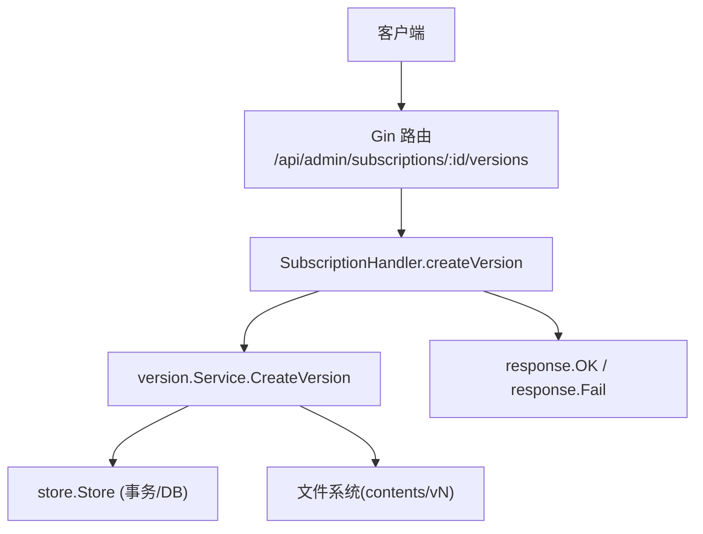
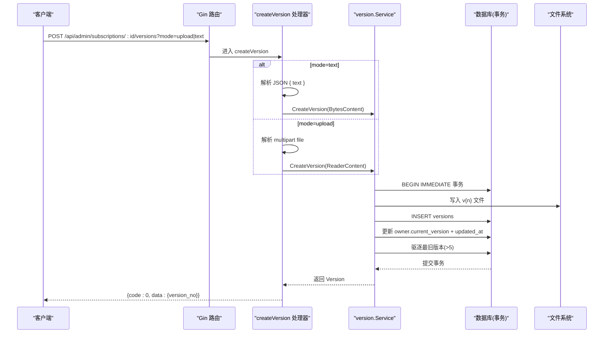
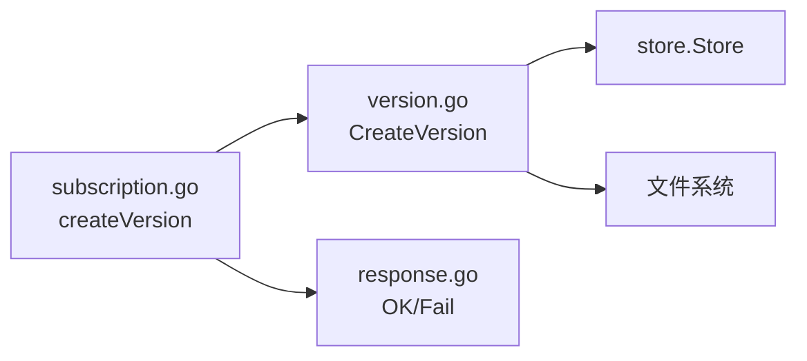

# 版本创建API

<cite>
**本文引用的文件**
- [backend/internal/server/subscription.go](file://backend/internal/server/subscription.go)
- [backend/internal/version/version.go](file://backend/internal/version/version.go)
- [backend/internal/response/response.go](file://backend/internal/response/response.go)
- [frontend/src/api/version.ts](file://frontend/src/api/version.ts)
</cite>

## 更新摘要
**变更内容**
- 移除了YAML语法检查警告功能
- 简化了API响应结构，移除了yaml_warning字段
- 更新了请求与响应示例以反映新的API契约

## 目录
1. [简介](#简介)
2. [项目结构](#项目结构)
3. [核心组件](#核心组件)
4. [架构总览](#架构总览)
5. [详细组件分析](#详细组件分析)
6. [依赖关系分析](#依赖关系分析)
7. [性能考虑](#性能考虑)
8. [故障排查指南](#故障排查指南)
9. [结论](#结论)
10. [附录：请求与响应示例](#附录请求与响应示例)

## 简介
本文档面向后端开发者与前端集成方，完整说明 POST /api/admin/subscriptions/:id/versions 的版本创建接口。该接口支持双模式：
- 文件上传模式（multipart/form-data，mode=upload）：通过表单字段 file 上传内容文件。
- 文本编辑模式（application/json，mode=text）：通过 JSON 体中的 text 字段提交内容。

关键约束与机制：
- 文件大小限制：50MB（MaxContentSize）。超出将返回错误。
- 内容类型验证：文本模式仅校验 JSON 结构与必填字段；文件模式由 multipart 解析。
- 统一响应格式：成功返回 { code: 0, data: { version_no } }；失败返回 { code: 非0, message }。

**已移除功能**：YAML语法检查警告机制已从API响应中移除，不再返回yaml_warning字段。

## 项目结构
本接口位于订阅管理路由组下，采用"接入层处理器 + 业务服务"的分层设计：
- 接入层：在 subscription.go 中注册路由并实现 createVersion 处理器，负责参数解析、模式分流、错误映射。
- 业务层：version.go 提供 CreateVersion 等能力，封装事务、存储、驱逐策略。
- 响应层：response.go 提供 OK/Fail 统一响应封装。
- 前端调用：version.ts 封装了 create 方法，自动根据 payload 类型决定是否追加 ?mode=text。

**图表来源**
- [backend/internal/server/subscription.go:21-38](file://backend/internal/server/subscription.go#L21-L38)
- [backend/internal/server/subscription.go:156-235](file://backend/internal/server/subscription.go#L156-L235)
- [backend/internal/version/version.go:125-180](file://backend/internal/version/version.go#L125-L180)
- [backend/internal/response/response.go:35-50](file://backend/internal/response/response.go#L35-L50)

**章节来源**
- [backend/internal/server/subscription.go:21-38](file://backend/internal/server/subscription.go#L21-L38)
- [backend/internal/version/version.go:25-38](file://backend/internal/version/version.go#L25-L38)
- [backend/internal/response/response.go:14-50](file://backend/internal/response/response.go#L14-L50)
- [frontend/src/api/version.ts:12-23](file://frontend/src/api/version.ts#L12-L23)

## 核心组件
- SubscriptionHandler.createVersion：解析 mode 查询参数，按模式读取内容（JSON 或 multipart），构造 ContentProvider，调用 Service 创建版本。
- version.Service.CreateVersion：在单个 BEGIN IMMEDIATE 事务内完成版本号计算、写文件、写记录、切换当前指针、驱逐最旧版本；严格限制最大内容大小。
- 统一响应：OK/Fail 封装标准响应结构，5xx 对外脱敏（调试模式除外）。

**章节来源**
- [backend/internal/server/subscription.go:156-235](file://backend/internal/server/subscription.go#L156-L235)
- [backend/internal/version/version.go:125-180](file://backend/internal/version/version.go#L125-L180)
- [backend/internal/response/response.go:35-50](file://backend/internal/response/response.go#L35-L50)

## 架构总览
下图展示从请求到响应的完整流程，包括双模式分流、事务写入、驱逐策略。

**图表来源**
- [backend/internal/server/subscription.go:194-235](file://backend/internal/server/subscription.go#L194-L235)
- [backend/internal/version/version.go:125-180](file://backend/internal/version/version.go#L125-L180)

## 详细组件分析

### 路由与处理器
- 路由注册：POST /api/admin/subscriptions/:id/versions 绑定到 SubscriptionHandler.createVersion。
- 参数解析：
  - 查询参数 mode：text 时走 JSON 解析；其他值默认走 multipart 文件上传。
  - 路径参数 id：订阅 ID，非法则返回 400。
- 模式分流：
  - 文本模式：解析 JSON 体 { text }，构造 BytesContent。
  - 文件模式：解析 multipart 的 file 字段，构造 ReaderContent，限制 MaxContentSize。
- 错误处理：
  - 未接收到文件：400。
  - 内容超过 50MB：400。
  - 其他异常：500（对外脱敏）。
- 响应：
  - 成功：{ version_no }。
  - **已移除**：文本模式不再返回 yaml_warning。

**章节来源**
- [backend/internal/server/subscription.go:21-38](file://backend/internal/server/subscription.go#L21-L38)
- [backend/internal/server/subscription.go:156-235](file://backend/internal/server/subscription.go#L156-L235)

### 版本创建服务（事务与驱逐）
- 事务边界：使用 BEGIN IMMEDIATE 事务保证原子性。
- 版本号计算：取已有最大 version_no + 1，删除后不复用。
- 文件写入：写入 contents/{ownerType}/{ownerID}/v{n}。
- 记录写入：INSERT versions，包含 file_path、file_name（文本模式按类型补默认名）。
- 切换当前指针：更新 owner 表 current_version 与版本 updated_at，重建 symlink（临时文件 + rename 原子替换）。
- 驱逐策略：版本数 > 5 时，删除最旧版本（不含当前激活），同步删除文件与记录。
- 错误清理：任一步失败回滚并清理已创建的文件与记录。

**章节来源**
- [backend/internal/version/version.go:125-180](file://backend/internal/version/version.go#L125-L180)
- [backend/internal/version/version.go:182-216](file://backend/internal/version/version.go#L182-L216)
- [backend/internal/version/version.go:234-264](file://backend/internal/version/version.go#L234-L264)

### 统一响应与错误映射
- 成功：OK 返回 { code: 0, data }。
- 失败：Fail 返回 { code: HTTP状态码, message }；5xx 对外脱敏为"服务器内部错误"（调试模式除外）。
- 列表数据：ListData 用于列表接口，此处版本创建不使用。

**章节来源**
- [backend/internal/response/response.go:14-50](file://backend/internal/response/response.go#L14-L50)

## 依赖关系分析
- 耦合关系：
  - 接入层依赖 version.Service 与 response 包。
  - version.Service 依赖 store.Store（事务/DB）与文件系统。
- 外部依赖：
  - Gin 框架用于路由与请求解析。
- 潜在循环依赖：已通过分层与独立 response 包避免。

**图表来源**
- [backend/internal/server/subscription.go:156-235](file://backend/internal/server/subscription.go#L156-L235)
- [backend/internal/version/version.go:125-180](file://backend/internal/version/version.go#L125-L180)
- [backend/internal/response/response.go:35-50](file://backend/internal/response/response.go#L35-L50)

**章节来源**
- [backend/internal/server/subscription.go:156-235](file://backend/internal/server/subscription.go#L156-L235)
- [backend/internal/version/version.go:125-180](file://backend/internal/version/version.go#L125-L180)
- [backend/internal/response/response.go:35-50](file://backend/internal/response/response.go#L35-L50)

## 性能考虑
- 流式读取与限读：文件上传使用 LimitReader 限制读取上限，避免内存溢出。
- 事务最小化：单事务内完成所有写操作，减少锁竞争与不一致风险。
- 驱逐策略：最多保留 5 个版本，自动清理最旧版本，控制存储增长。
- 缓存控制：预览接口设置 no-store，避免中间缓存污染。

## 故障排查指南
- 常见错误与定位：
  - 未接收到文件（mode=upload）：检查 multipart 字段名是否为 file。
  - 内容超过 50MB 限制：确认文件大小与 MaxContentSize 配置。
  - 版本不存在/不可删除：切换或删除逻辑需遵循"不可删当前/最后一个"的规则。
- 日志与调试：
  - 5xx 错误对外脱敏，可在调试模式开启时查看真实错误详情。
  - 驱逐/删除文件失败会记录警告日志，不影响主流程。

**章节来源**
- [backend/internal/server/subscription.go:213-234](file://backend/internal/server/subscription.go#L213-L234)
- [backend/internal/version/version.go:303-338](file://backend/internal/version/version.go#L303-L338)
- [backend/internal/response/response.go:40-50](file://backend/internal/response/response.go#L40-L50)

## 结论
POST /api/admin/subscriptions/:id/versions 提供了灵活的双模式版本创建能力，结合严格的 50MB 限制，既保证了安全性与稳定性，又兼顾了易用性。建议在生产环境中：
- 明确区分 mode=text 与 mode=upload 的使用场景。
- 监控 5xx 错误与驱逐/删除失败的警告日志。
- **注意**：API已移除YAML语法检查功能，不再返回yaml_warning字段。

## 附录：请求与响应示例

### 文本编辑模式（application/json，mode=text）
- 请求
  - URL: POST /api/admin/subscriptions/:id/versions?mode=text
  - Header: Content-Type: application/json
  - Body: { "text": "<你的内容>" }
- 成功响应
  - Status: 200
  - Body: { "code": 0, "data": { "version_no": <数字> } }
- 失败响应
  - 参数校验失败: 400
  - 内容超过 50MB: 400
  - 服务器内部错误: 500（对外脱敏）

**章节来源**
- [backend/internal/server/subscription.go:203-234](file://backend/internal/server/subscription.go#L203-L234)
- [backend/internal/response/response.go:35-50](file://backend/internal/response/response.go#L35-L50)

### 文件上传模式（multipart/form-data，mode=upload）
- 请求
  - URL: POST /api/admin/subscriptions/:id/versions?mode=upload
  - Header: Content-Type: multipart/form-data; boundary=...
  - Form Field: file（二进制文件）
- 成功响应
  - Status: 200
  - Body: { "code": 0, "data": { "version_no": <数字> } }
- 失败响应
  - 未接收到文件: 400
  - 内容超过 50MB: 400
  - 服务器内部错误: 500（对外脱敏）

**章节来源**
- [backend/internal/server/subscription.go:213-234](file://backend/internal/server/subscription.go#L213-L234)
- [backend/internal/version/version.go:88-108](file://backend/internal/version/version.go#L88-L108)
- [backend/internal/response/response.go:35-50](file://backend/internal/response/response.go#L35-L50)

### 前端调用方式
- 文本模式：传入对象 { text }，会自动追加 ?mode=text。
- 文件模式：传入 FormData，不包含 ?mode=text。

**章节来源**
- [frontend/src/api/version.ts:16-23](file://frontend/src/api/version.ts#L16-L23)