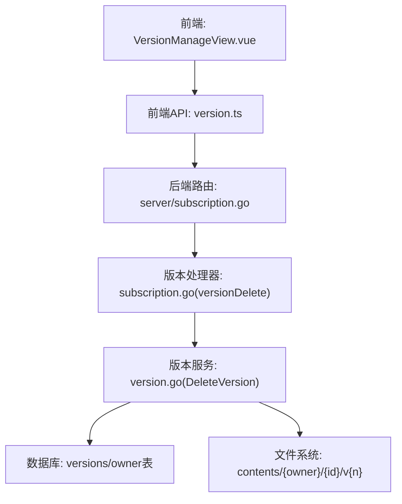
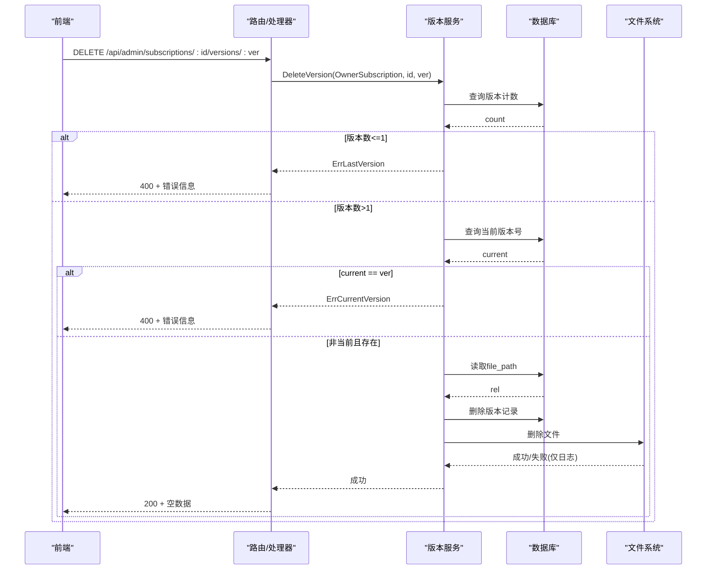
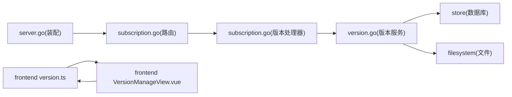
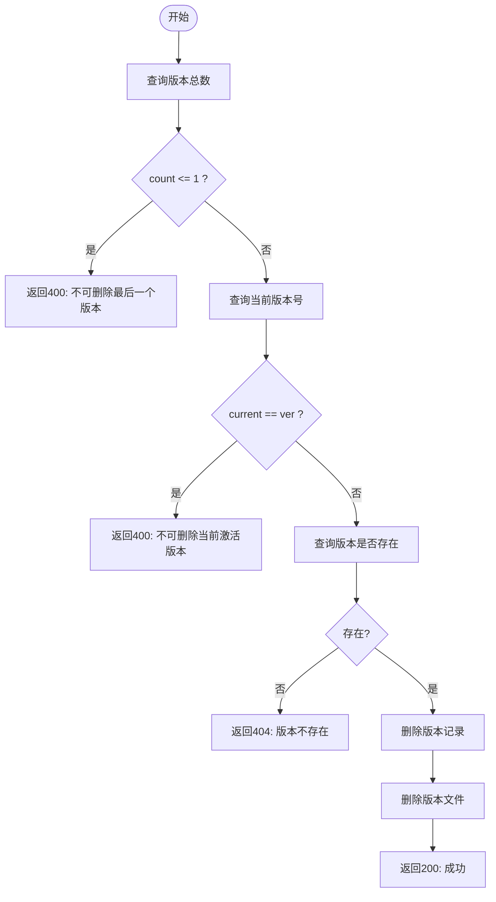

# 版本删除API

<cite>
**本文引用的文件**
- [backend/internal/version/version.go](file://backend/internal/version/version.go)
- [backend/internal/server/subscription.go](file://backend/internal/server/subscription.go)
- [backend/internal/server/server.go](file://backend/internal/server/server.go)
- [frontend/src/api/version.ts](file://frontend/src/api/version.ts)
- [frontend/src/views/admin/VersionManageView.vue](file://frontend/src/views/admin/VersionManageView.vue)
</cite>

## 目录
1. [简介](#简介)
2. [项目结构](#项目结构)
3. [核心组件](#核心组件)
4. [架构总览](#架构总览)
5. [详细组件分析](#详细组件分析)
6. [依赖关系分析](#依赖关系分析)
7. [性能考量](#性能考量)
8. [故障排查指南](#故障排查指南)
9. [结论](#结论)
10. [附录](#附录)

## 简介
本文件面向 DELETE /api/admin/subscriptions/:id/versions/:ver 接口，详细说明其删除限制条件、级联影响、数据一致性保证与错误处理策略。文档包含请求示例、响应格式、错误码说明、删除前安全检查清单以及版本清理最佳实践建议，帮助管理员安全、可预期地管理订阅版本。

## 项目结构
该接口位于“订阅”模块的“版本管理”子路径下，由接入层路由注册并委派给通用版本处理器，最终调用版本服务完成删除逻辑。前端通过统一版本 API 封装发起删除请求，并在界面中提供二次确认与状态提示。

图表来源
- [backend/internal/server/subscription.go:22-38](file://backend/internal/server/subscription.go#L22-L38)
- [backend/internal/server/subscription.go:285-309](file://backend/internal/server/subscription.go#L285-L309)
- [backend/internal/version/version.go:303-338](file://backend/internal/version/version.go#L303-L338)
- [frontend/src/api/version.ts:12-29](file://frontend/src/api/version.ts#L12-L29)
- [frontend/src/views/admin/VersionManageView.vue:114-127](file://frontend/src/views/admin/VersionManageView.vue#L114-L127)

章节来源
- [backend/internal/server/subscription.go:22-38](file://backend/internal/server/subscription.go#L22-L38)
- [backend/internal/server/server.go:86-92](file://backend/internal/server/server.go#L86-L92)
- [backend/internal/version/version.go:303-338](file://backend/internal/version/version.go#L303-L338)
- [frontend/src/api/version.ts:12-29](file://frontend/src/api/version.ts#L12-L29)
- [frontend/src/views/admin/VersionManageView.vue:114-127](file://frontend/src/views/admin/VersionManageView.vue#L114-L127)

## 核心组件
- 路由与中间件：订阅路由组叠加会话与管理员双中间件，确保仅管理员可访问版本操作。
- 版本处理器：统一的版本端点处理器，负责参数解析、业务错误到HTTP状态的映射。
- 版本服务：实现版本创建、切换、预览、删除等核心逻辑，使用事务与写锁保证一致性。
- 前端封装：统一的版本API方法，删除方法为 remove(ownerId, ver)。

章节来源
- [backend/internal/server/server.go:86-92](file://backend/internal/server/server.go#L86-L92)
- [backend/internal/server/subscription.go:22-38](file://backend/internal/server/subscription.go#L22-L38)
- [backend/internal/server/subscription.go:285-309](file://backend/internal/server/subscription.go#L285-L309)
- [backend/internal/version/version.go:303-338](file://backend/internal/version/version.go#L303-L338)
- [frontend/src/api/version.ts:12-29](file://frontend/src/api/version.ts#L12-L29)

## 架构总览
DELETE 请求从前端发起，经路由进入版本处理器，再调用版本服务的 DeleteVersion。服务在事务内执行以下关键步骤：
- 校验资源版本总数（不可删除最后一个）
- 校验目标版本是否为当前激活版本（不可删除当前）
- 校验版本存在性
- 删除版本记录与对应文件
- 返回成功或错误

图表来源
- [backend/internal/server/subscription.go:285-309](file://backend/internal/server/subscription.go#L285-L309)
- [backend/internal/version/version.go:303-338](file://backend/internal/version/version.go#L303-L338)

## 详细组件分析

### 删除限制条件
- 不能删除最后版本：当某资源的版本总数≤1时拒绝删除，避免无可用版本。
- 不能删除当前版本：若目标版本等于 owner 表的 current_version，则拒绝删除，需先切换到其它版本。
- 版本存在性验证：若指定版本不存在，返回“版本不存在”。

这些限制在服务层以明确错误类型表达，并由接入层映射为相应HTTP状态码。

章节来源
- [backend/internal/version/version.go:303-338](file://backend/internal/version/version.go#L303-L338)
- [backend/internal/server/subscription.go:285-309](file://backend/internal/server/subscription.go#L285-L309)

### 删除操作的级联影响
- 版本记录与文件同步删除：删除版本记录后尝试删除对应文件；文件删除失败仅记录警告，不阻断主流程。
- 对下载的影响：由于下载以DB记录的current_version为准，删除非当前版本不会影响已生效的下载内容。
- 对列表与预览的影响：删除后不再出现在版本列表中，预览端点亦将返回“版本不存在”。

章节来源
- [backend/internal/version/version.go:303-338](file://backend/internal/version/version.go#L303-L338)

### 数据一致性保证
- 事务与写锁：删除操作在 BEGIN IMMEDIATE 事务内执行，配合库级写锁，确保并发安全。
- 原子性：版本记录删除与文件删除在同一事务边界内协调；文件删除失败不影响事务提交，但会记录告警以便后续修复。
- 当前指针一致性：删除不涉及 current_version 变更，因此不会破坏当前指针与 symlink 的一致性。

章节来源
- [backend/internal/version/version.go:303-338](file://backend/internal/version/version.go#L303-L338)

### 错误处理策略
- 400 Bad Request：
  - “不可删除最后一个版本”
  - “不可删除当前激活版本，请先切换”
- 404 Not Found：
  - “版本不存在”
- 500 Internal Server Error：
  - 其他未预期错误（如数据库异常、内部错误）

接入层根据业务错误类型映射到HTTP状态码，并返回统一响应结构。

章节来源
- [backend/internal/server/subscription.go:285-309](file://backend/internal/server/subscription.go#L285-L309)
- [backend/internal/version/version.go:303-338](file://backend/internal/version/version.go#L303-L338)

### 请求示例
- 方法：DELETE
- URL：/api/admin/subscriptions/:id/versions/:ver
- 头部：需携带管理员会话凭据（由会话与管理员中间件保障）
- 路径参数：
  - id：订阅ID（正整数）
  - ver：要删除的版本号（正整数）

章节来源
- [backend/internal/server/subscription.go:22-38](file://backend/internal/server/subscription.go#L22-L38)
- [backend/internal/server/subscription.go:285-309](file://backend/internal/server/subscription.go#L285-L309)

### 响应格式
- 成功：
  - HTTP 200
  - 响应体：空数据（统一OK包装）
- 失败：
  - HTTP 400/404/500
  - 响应体：统一Fail包装的错误消息

章节来源
- [backend/internal/server/subscription.go:285-309](file://backend/internal/server/subscription.go#L285-L309)

### 错误码说明
- 400：
  - 不可删除最后一个版本
  - 不可删除当前激活版本，请先切换
- 404：
  - 版本不存在
- 500：
  - 服务器内部错误（数据库或系统异常）

章节来源
- [backend/internal/server/subscription.go:285-309](file://backend/internal/server/subscription.go#L285-L309)
- [backend/internal/version/version.go:303-338](file://backend/internal/version/version.go#L303-L338)

### 删除前的安全检查清单
- 确认目标版本不是当前激活版本（可通过版本列表中的 current 标记判断）
- 确认该资源至少有两个版本（否则无法删除）
- 确认目标版本确实存在（避免误删）
- 确认具备管理员权限与会话有效
- 确认删除后不会影响正在使用的下载（删除非当前版本是安全的）

章节来源
- [backend/internal/version/version.go:303-338](file://backend/internal/version/version.go#L303-L338)
- [frontend/src/views/admin/VersionManageView.vue:114-127](file://frontend/src/views/admin/VersionManageView.vue#L114-L127)

### 版本清理的最佳实践建议
- 优先删除旧版本：保留最近几个历史版本用于回滚与审计。
- 避免删除当前版本：如需清理，请先切换到其它版本再删除。
- 控制版本数量：每份资源最多5个版本（含当前），超出会自动驱逐最旧版本。
- 定期巡检：检查是否存在孤立文件或版本记录不一致的情况，必要时重启服务进行自检重建。
- 谨慎批量删除：批量删除前务必核对版本列表与当前版本标记，避免误删。

章节来源
- [backend/internal/version/version.go:25-38](file://backend/internal/version/version.go#L25-L38)
- [backend/internal/version/version.go:438-484](file://backend/internal/version/version.go#L438-L484)

## 依赖关系分析
- 路由依赖：订阅路由组注册了版本端点，包括删除端点。
- 处理器依赖：版本处理器复用通用删除逻辑，负责错误映射。
- 服务依赖：版本服务依赖存储层（数据库）与文件系统。
- 前端依赖：前端通过统一版本API封装调用删除接口，并提供用户交互与提示。

图表来源
- [backend/internal/server/server.go:86-92](file://backend/internal/server/server.go#L86-L92)
- [backend/internal/server/subscription.go:22-38](file://backend/internal/server/subscription.go#L22-L38)
- [backend/internal/server/subscription.go:285-309](file://backend/internal/server/subscription.go#L285-L309)
- [backend/internal/version/version.go:303-338](file://backend/internal/version/version.go#L303-L338)
- [frontend/src/api/version.ts:12-29](file://frontend/src/api/version.ts#L12-L29)
- [frontend/src/views/admin/VersionManageView.vue:114-127](file://frontend/src/views/admin/VersionManageView.vue#L114-L127)

章节来源
- [backend/internal/server/server.go:86-92](file://backend/internal/server/server.go#L86-L92)
- [backend/internal/server/subscription.go:22-38](file://backend/internal/server/subscription.go#L22-L38)
- [backend/internal/version/version.go:303-338](file://backend/internal/version/version.go#L303-L338)
- [frontend/src/api/version.ts:12-29](file://frontend/src/api/version.ts#L12-L29)
- [frontend/src/views/admin/VersionManageView.vue:114-127](file://frontend/src/views/admin/VersionManageView.vue#L114-L127)

## 性能考量
- 事务开销：删除操作在事务内执行，涉及少量SQL与一次文件删除，整体开销较低。
- 文件I/O：文件删除失败仅记录警告，不阻塞事务提交，避免长时间阻塞。
- 并发安全：BEGIN IMMEDIATE 与库级写锁防止并发写入导致的不一致。
- 缓存与预览：删除非当前版本不影响下载与预览的当前内容读取。

[本节为通用性能讨论，不直接分析具体文件]

## 故障排查指南
- 400 不可删除最后一个版本：
  - 检查该资源是否仅剩一个版本；若有，请先创建新版本或删除整个资源。
- 400 不可删除当前激活版本：
  - 检查版本列表中的 current 标记；如需删除，请先切换到其它版本。
- 404 版本不存在：
  - 检查路径参数是否正确；确认版本编号存在。
- 500 服务器内部错误：
  - 查看服务端日志，定位数据库或文件系统异常；必要时重启服务触发启动自检。

章节来源
- [backend/internal/server/subscription.go:285-309](file://backend/internal/server/subscription.go#L285-L309)
- [backend/internal/version/version.go:303-338](file://backend/internal/version/version.go#L303-L338)
- [backend/internal/version/version.go:438-484](file://backend/internal/version/version.go#L438-L484)

## 结论
DELETE /api/admin/subscriptions/:id/versions/:ver 提供了安全、一致的版本删除能力。通过严格的删除限制、事务与写锁保障、明确的错误处理策略，以及对文件系统的稳健处理，管理员可以可靠地维护订阅版本。建议遵循最佳实践，定期巡检并谨慎操作，以确保系统稳定与数据安全。

[本节为总结性内容，不直接分析具体文件]

## 附录

### 流程图：删除逻辑

图表来源
- [backend/internal/version/version.go:303-338](file://backend/internal/version/version.go#L303-L338)
- [backend/internal/server/subscription.go:285-309](file://backend/internal/server/subscription.go#L285-L309)