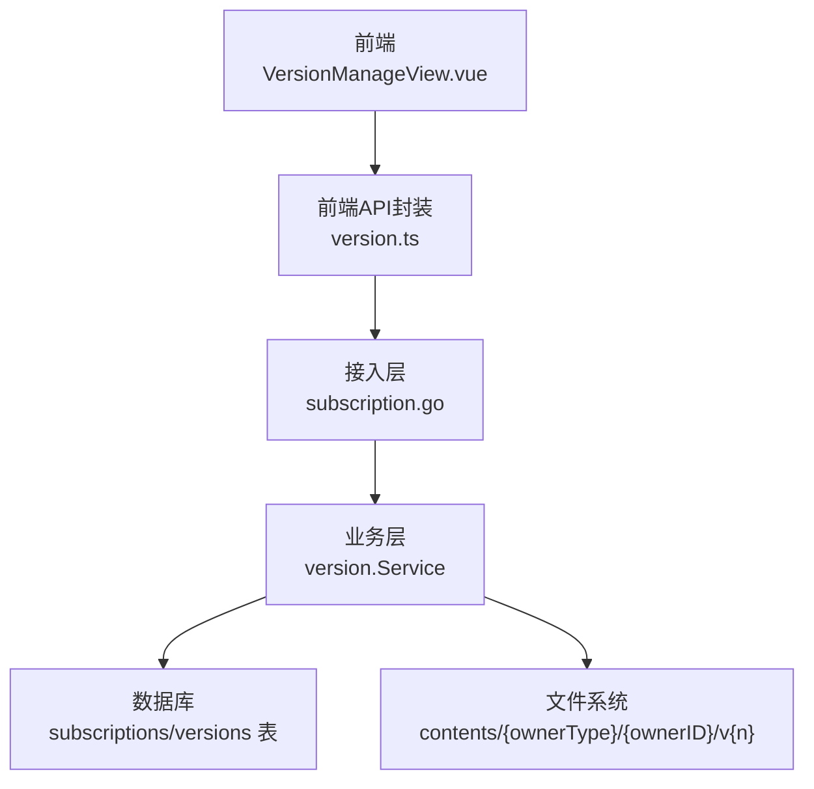
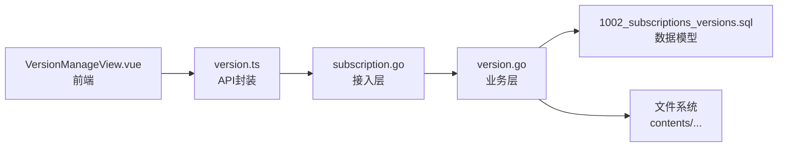
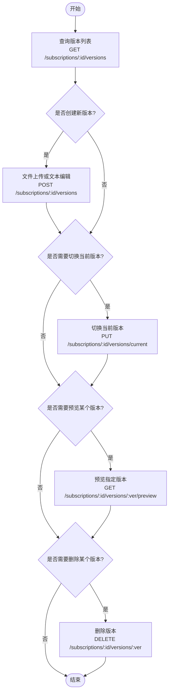

# 版本控制API

<cite>
**本文引用的文件**
- [backend/internal/version/version.go](file://backend/internal/version/version.go)
- [backend/internal/server/subscription.go](file://backend/internal/server/subscription.go)
- [backend/migrations/1002_subscriptions_versions.sql](file://backend/migrations/1002_subscriptions_versions.sql)
- [frontend/src/api/version.ts](file://frontend/src/api/version.ts)
- [frontend/src/views/admin/VersionManageView.vue](file://frontend/src/views/admin/VersionManageView.vue)
- [frontend/src/views/admin/SubscriptionsView.vue](file://frontend/src/views/admin/SubscriptionsView.vue)
</cite>

## 目录
1. [简介](#简介)
2. [项目结构](#项目结构)
3. [核心组件](#核心组件)
4. [架构总览](#架构总览)
5. [详细组件分析](#详细组件分析)
6. [依赖关系分析](#依赖关系分析)
7. [性能考虑](#性能考虑)
8. [故障排查指南](#故障排查指南)
9. [结论](#结论)
10. [附录：完整工作流示例](#附录完整工作流示例)

## 简介
本文件面向“订阅版本控制”的完整 API 文档，覆盖以下接口与机制：
- 版本列表查询：GET /api/admin/subscriptions/:id/versions
- 版本创建：POST /api/admin/subscriptions/:id/versions（支持文件上传与文本编辑两种模式）
- 版本切换：PUT /api/admin/subscriptions/:id/versions/current
- 版本预览：GET /api/admin/subscriptions/:id/versions/:ver/preview
- 版本删除：DELETE /api/admin/subscriptions/:id/versions/:ver

并解释版本号生成规则、当前版本标记机制、版本历史管理策略；说明版本切换的原子性保证、版本预览的缓存控制（no-store）、版本删除的限制条件（不能删除最后版本和当前版本）。文末提供端到端的工作流示例。

## 项目结构
后端采用“接入层 + 业务层 + 数据层”的分层设计：
- 接入层：Gin 路由与处理器，负责参数解析、鉴权中间件、错误映射与响应封装。
- 业务层：version.Service 提供跨资源类型（订阅/规则/自定义/分享）通用的版本管理能力。
- 数据层：SQLite 迁移脚本定义 subscriptions 与 versions 表结构，以及索引约束。

前端通过通用版本 API 封装调用后端接口，并在通用版本管理页面中实现创建、切换、预览、删除等操作。



图表来源
- [backend/internal/server/subscription.go:22-34](file://backend/internal/server/subscription.go#L22-L34)
- [backend/internal/version/version.go:125-180](file://backend/internal/version/version.go#L125-L180)
- [backend/migrations/1002_subscriptions_versions.sql:3-25](file://backend/migrations/1002_subscriptions_versions.sql#L3-L25)

章节来源
- [backend/internal/server/subscription.go:22-34](file://backend/internal/server/subscription.go#L22-L34)
- [backend/internal/version/version.go:1-59](file://backend/internal/version/version.go#L1-L59)
- [backend/migrations/1002_subscriptions_versions.sql:3-25](file://backend/migrations/1002_subscriptions_versions.sql#L3-L25)

## 核心组件
- 版本服务 Service：提供 CreateVersion、SwitchVersion、DeleteVersion、PreviewVersion、ListVersions、CurrentNo 等能力，统一处理事务、文件落盘、symlink 指针与上限驱逐。
- 接入层处理器：将 HTTP 请求映射到 Service 方法，完成参数校验、错误码映射、响应格式与缓存头设置。
- 数据模型：subscriptions 表维护 current_version；versions 表记录每个版本的元数据与文件路径。

章节来源
- [backend/internal/version/version.go:50-69](file://backend/internal/version/version.go#L50-L69)
- [backend/internal/server/subscription.go:152-170](file://backend/internal/server/subscription.go#L152-L170)
- [backend/migrations/1002_subscriptions_versions.sql:3-25](file://backend/migrations/1002_subscriptions_versions.sql#L3-L25)

## 架构总览
版本控制的总体流程如下：
- 创建版本：在单个 BEGIN IMMEDIATE 事务内计算新编号、写入文件、插入版本记录、切换当前指针、执行 5 版上限驱逐；失败回滚并清理文件。
- 切换版本：原子更新 owner 表的 current_version、刷新对应版本 updated_at、以临时 symlink + rename 原子替换 current 指针。
- 预览版本：读取指定版本内容，返回 text/plain 并设置 Cache-Control: no-store。
- 删除版本：校验不可删最后一个与不可删当前激活版本，成功后删除记录与文件。
- 列表查询：按 owner_type/owner_id 列出所有版本，并以 DB 中的 current_version 填充 current 标记。

```mermaid
sequenceDiagram
participant C as "客户端"
participant H as "接入层处理器"
participant S as "版本服务"
participant D as "数据库"
participant F as "文件系统"
C->>H : "POST /subscriptions/ : id/versions"
H->>S : "CreateVersion(OwnerSubscription, id, ContentProvider)"
S->>D : "BEGIN IMMEDIATE; 查询最大version_no"
D-->>S : "max_no"
S->>F : "写 v{max_no+1} 文件"
S->>D : "INSERT versions(...)"
S->>D : "UPDATE subscriptions SET current_version = newNo"
S->>F : "重建 current symlink (临时+rename)"
S->>D : "驱逐最旧版本(超出5版)"
D-->>S : "提交事务"
S-->>H : "返回 {version_no, yaml_warning?}"
H-->>C : "200 OK"
```

图表来源
- [backend/internal/version/version.go:125-180](file://backend/internal/version/version.go#L125-L180)
- [backend/internal/version/version.go:218-245](file://backend/internal/version/version.go#L218-L245)
- [backend/internal/server/subscription.go:194-235](file://backend/internal/server/subscription.go#L194-L235)

章节来源
- [backend/internal/version/version.go:125-180](file://backend/internal/version/version.go#L125-L180)
- [backend/internal/server/subscription.go:194-235](file://backend/internal/server/subscription.go#L194-L235)

## 详细组件分析

### 版本列表查询 GET /api/admin/subscriptions/:id/versions
- 功能：返回某订阅的所有版本，包含 version_no、file_path、file_name、created_at、updated_at，并以 current 字段标识当前激活版本。
- 行为：
  - 先读取该订阅的 current_version（DB），再拉取版本列表，由调用方根据 current_version 填充 current 标记。
  - 空列表返回 []，避免前端 .map 报错。
- 响应：统一包裹为 { list, total } 结构。

章节来源
- [backend/internal/server/subscription.go:174-192](file://backend/internal/server/subscription.go#L174-L192)
- [backend/internal/version/version.go:350-369](file://backend/internal/version/version.go#L350-L369)
- [backend/migrations/1002_subscriptions_versions.sql:3-25](file://backend/migrations/1002_subscriptions_versions.sql#L3-L25)

### 版本创建 POST /api/admin/subscriptions/:id/versions
- 双模式：
  - mode=text：JSON 体包含 text 字段，作为文本编辑创建新版本。
  - 默认（upload）：multipart 表单上传 file，限制大小 ≤ 50MB。
- 行为：
  - 在单个 BEGIN IMMEDIATE 事务内：计算新编号（已有最大编号 + 1）、写入版本文件、插入版本记录、切换当前指针、执行 5 版上限驱逐。
  - 文本模式返回 yaml_warning 提示（仅当内容为 YAML 且语法不合法时），不阻断保存。
- 响应：{ version_no, yaml_warning? }。

章节来源
- [backend/internal/server/subscription.go:194-235](file://backend/internal/server/subscription.go#L194-L235)
- [backend/internal/version/version.go:125-180](file://backend/internal/version/version.go#L125-L180)
- [backend/internal/version/version.go:517-531](file://backend/internal/version/version.go#L517-L531)

### 版本切换 PUT /api/admin/subscriptions/:id/versions/current
- 请求体：{ version_no }
- 行为：
  - 原子切换：更新 subscriptions.current_version、刷新对应版本 updated_at、以临时 symlink + rename 原子替换 current 指针。
  - 若版本不存在则返回 404。
- 语义：切换后所有下载立即生效。

章节来源
- [backend/internal/server/subscription.go:237-260](file://backend/internal/server/subscription.go#L237-L260)
- [backend/internal/version/version.go:218-245](file://backend/internal/version/version.go#L218-L245)

### 版本预览 GET /api/admin/subscriptions/:id/versions/:ver/preview
- 行为：读取指定版本内容，返回 text/plain; charset=utf-8，并设置 Cache-Control: no-store。
- 用途：管理员在线预览历史版本内容，禁止缓存确保始终获取最新内容。

章节来源
- [backend/internal/server/subscription.go:262-283](file://backend/internal/server/subscription.go#L262-L283)
- [backend/internal/version/version.go:371-382](file://backend/internal/version/version.go#L371-L382)

### 版本删除 DELETE /api/admin/subscriptions/:id/versions/:ver
- 限制：
  - 不可删除最后一个版本（至少保留一个）。
  - 不可删除当前激活版本（须先切换到其他版本）。
- 行为：删除版本记录与对应文件；失败仅记日志不阻断主流程（文件删除失败不影响记录删除）。

章节来源
- [backend/internal/server/subscription.go:285-309](file://backend/internal/server/subscription.go#L285-L309)
- [backend/internal/version/version.go:303-338](file://backend/internal/version/version.go#L303-L338)

### 版本号生成规则与当前版本标记机制
- 版本号生成：基于已有最大编号 + 1，删除后不复用；保证并发安全（BEGIN IMMEDIATE 事务串行化）。
- 当前版本标记：
  - 以 subscriptions.current_version 为准；列表查询时据此填充 current 字段。
  - 切换时使用临时 symlink + rename 原子替换 current 指针，确保一致性。
  - 启动自检：若 DB 当前与 symlink 不一致，则以 DB 为准重建 symlink。

章节来源
- [backend/internal/version/version.go:125-180](file://backend/internal/version/version.go#L125-L180)
- [backend/internal/version/version.go:218-245](file://backend/internal/version/version.go#L218-L245)
- [backend/internal/version/version.go:438-484](file://backend/internal/version/version.go#L438-L484)

### 版本历史管理策略
- 最多保留 5 个版本（含当前激活）；超出自动驱逐最旧版本（文件 + 记录）。
- 时间戳口径：每次切换或内容变更都会刷新对应版本的 updated_at，首页反映“分发内容最近变动”。

章节来源
- [backend/internal/version/version.go:25-30](file://backend/internal/version/version.go#L25-L30)
- [backend/internal/version/version.go:182-216](file://backend/internal/version/version.go#L182-L216)
- [backend/internal/version/version.go:234-245](file://backend/internal/version/version.go#L234-L245)

### 前端集成与交互
- 通用版本 API 封装：提供 list、create、switchCurrent、preview、remove 等方法，适配不同资源前缀。
- 版本管理视图：支持文件上传与在线文本编辑双模式；YAML 语法问题仅提示不阻断；预览弹窗使用纯文本渲染；操作按钮对当前版本进行禁用与提示。

章节来源
- [frontend/src/api/version.ts:12-30](file://frontend/src/api/version.ts#L12-L30)
- [frontend/src/views/admin/VersionManageView.vue:43-138](file://frontend/src/views/admin/VersionManageView.vue#L43-L138)
- [frontend/src/views/admin/SubscriptionsView.vue:40-43](file://frontend/src/views/admin/SubscriptionsView.vue#L40-L43)

## 依赖关系分析
- 接入层依赖业务层：SubscriptionHandler 调用 version.Service 完成版本相关逻辑。
- 业务层依赖数据层与文件系统：Service 通过 store.Store 访问 SQLite，并通过文件系统组织版本内容。
- 前端依赖后端 API：VersionManageView 通过 versionApi 调用后端接口。



图表来源
- [backend/internal/server/subscription.go:22-34](file://backend/internal/server/subscription.go#L22-L34)
- [backend/internal/version/version.go:125-180](file://backend/internal/version/version.go#L125-L180)
- [backend/migrations/1002_subscriptions_versions.sql:3-25](file://backend/migrations/1002_subscriptions_versions.sql#L3-L25)
- [frontend/src/views/admin/VersionManageView.vue:28-52](file://frontend/src/views/admin/VersionManageView.vue#L28-L52)
- [frontend/src/api/version.ts:12-30](file://frontend/src/api/version.ts#L12-L30)

章节来源
- [backend/internal/server/subscription.go:22-34](file://backend/internal/server/subscription.go#L22-L34)
- [backend/internal/version/version.go:125-180](file://backend/internal/version/version.go#L125-L180)
- [backend/migrations/1002_subscriptions_versions.sql:3-25](file://backend/migrations/1002_subscriptions_versions.sql#L3-L25)
- [frontend/src/api/version.ts:12-30](file://frontend/src/api/version.ts#L12-L30)
- [frontend/src/views/admin/VersionManageView.vue:28-52](file://frontend/src/views/admin/VersionManageView.vue#L28-L52)

## 性能考虑
- 事务串行化：使用 BEGIN IMMEDIATE 保证并发创建版本时的版本号唯一性与一致性。
- 原子切换：通过临时 symlink + rename 避免竞态，确保下载与预览的一致性。
- 上限驱逐：超过 5 版自动删除最旧版本，减少存储压力。
- 预览禁缓存：设置 Cache-Control: no-store，避免浏览器缓存导致预览内容陈旧。

[本节为通用性能建议，无需特定文件引用]

## 故障排查指南
- 版本不存在：预览或删除时若版本不存在，返回 404。
- 内容过大：上传文件超过 50MB 限制，返回 400。
- 删除限制：尝试删除最后一个或当前激活版本，返回 400 并提示相应原因。
- 启动自检：若 DB 当前与 symlink 不一致，启动时会以 DB 为准重建 symlink。

章节来源
- [backend/internal/version/version.go:303-338](file://backend/internal/version/version.go#L303-L338)
- [backend/internal/version/version.go:371-382](file://backend/internal/version/version.go#L371-L382)
- [backend/internal/version/version.go:438-484](file://backend/internal/version/version.go#L438-L484)

## 结论
本版本控制 API 提供了完整的订阅版本生命周期管理能力，涵盖创建、查询、切换、预览与删除。通过事务串行化、原子切换与上限驱逐策略，确保了数据一致性与系统稳定性。前端提供友好的交互界面，支持文件上传与文本编辑双模式，并对 YAML 语法进行非阻断式提示。整体设计简洁、可扩展，适用于四类资源（订阅/规则/自定义/分享）的统一版本管理。

[本节为总结性内容，无需特定文件引用]

## 附录：完整工作流示例
以下是一个典型的管理员工作流，展示从创建到切换、预览与删除的完整过程：



图表来源
- [backend/internal/server/subscription.go:152-170](file://backend/internal/server/subscription.go#L152-L170)
- [backend/internal/server/subscription.go:194-235](file://backend/internal/server/subscription.go#L194-L235)
- [backend/internal/server/subscription.go:237-260](file://backend/internal/server/subscription.go#L237-L260)
- [backend/internal/server/subscription.go:262-283](file://backend/internal/server/subscription.go#L262-L283)
- [backend/internal/server/subscription.go:285-309](file://backend/internal/server/subscription.go#L285-L309)

章节来源
- [backend/internal/server/subscription.go:152-170](file://backend/internal/server/subscription.go#L152-L170)
- [backend/internal/server/subscription.go:194-235](file://backend/internal/server/subscription.go#L194-L235)
- [backend/internal/server/subscription.go:237-260](file://backend/internal/server/subscription.go#L237-L260)
- [backend/internal/server/subscription.go:262-283](file://backend/internal/server/subscription.go#L262-L283)
- [backend/internal/server/subscription.go:285-309](file://backend/internal/server/subscription.go#L285-L309)