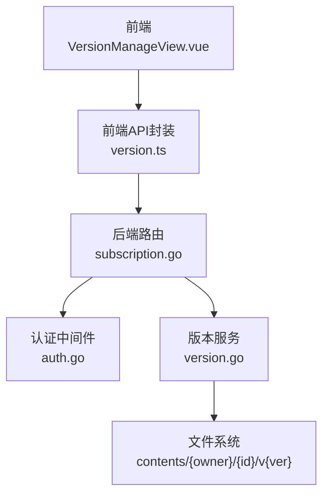
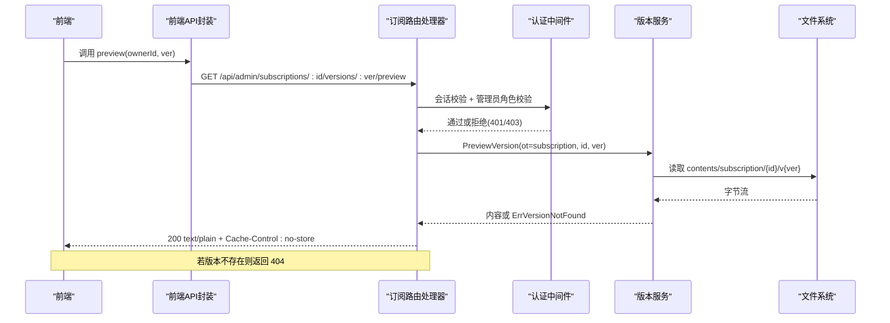
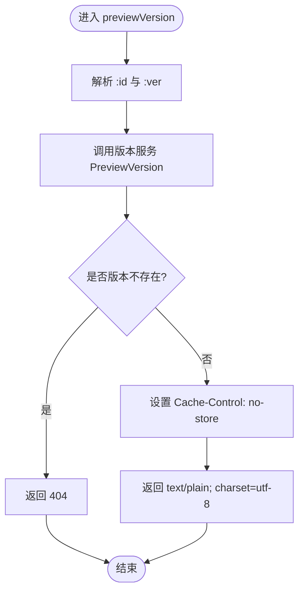
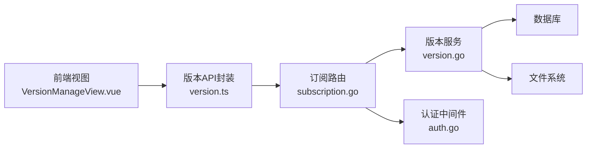

# 版本预览API

<cite>
**本文引用的文件**
- [backend/internal/server/subscription.go](file://backend/internal/server/subscription.go)
- [backend/internal/version/version.go](file://backend/internal/version/version.go)
- [backend/internal/auth/auth.go](file://backend/internal/auth/auth.go)
- [backend/internal/server/server.go](file://backend/internal/server/server.go)
- [frontend/src/api/version.ts](file://frontend/src/api/version.ts)
- [frontend/src/views/admin/VersionManageView.vue](file://frontend/src/views/admin/VersionManageView.vue)
</cite>

## 更新摘要
**变更内容**
- 增强了版本管理界面的预览体验，添加了独立的预览模态框切换状态（previewOpen）
- 改进了加载状态处理和模态框结构，提供更好的用户体验
- 确保用户点击预览按钮时立即获得视觉反馈
- 优化了预览内容的实时获取机制和错误处理流程

## 目录
1. [简介](#简介)
2. [项目结构](#项目结构)
3. [核心组件](#核心组件)
4. [架构总览](#架构总览)
5. [详细组件分析](#详细组件分析)
6. [依赖关系分析](#依赖关系分析)
7. [性能与缓存策略](#性能与缓存策略)
8. [故障排查指南](#故障排查指南)
9. [结论](#结论)
10. [附录：前端集成指南](#附录：前端集成指南)

## 简介
本文档针对管理端"版本预览"接口进行完整说明，覆盖以下要点：
- 接口路径与方法：GET /api/admin/subscriptions/:id/versions/:ver/preview
- 功能：以纯文本形式返回指定订阅的指定版本内容（text/plain; charset=utf-8）
- 缓存控制：响应头设置 Cache-Control: no-store，确保每次请求实时获取最新版本内容
- 权限验证：需通过会话校验与管理员角色校验
- 版本存在性检查：若版本不存在返回 404
- 请求示例、响应格式、错误码与安全考虑
- 前端集成预览功能的实现方式，包括增强的用户体验和即时反馈机制

## 项目结构
该功能涉及后端路由注册、中间件鉴权、版本服务读取文件以及前端调用与展示。关键文件如下：
- 路由注册与处理器：backend/internal/server/subscription.go
- 版本服务（读版本内容）：backend/internal/version/version.go
- 认证中间件（会话+管理员）：backend/internal/auth/auth.go
- 服务器装配（注入中间件与路由）：backend/internal/server/server.go
- 前端版本API封装：frontend/src/api/version.ts
- 前端版本管理视图（含预览弹窗）：frontend/src/views/admin/VersionManageView.vue

**图表来源**
- [backend/internal/server/subscription.go:21-34](file://backend/internal/server/subscription.go#L21-L34)
- [backend/internal/version/version.go:371-382](file://backend/internal/version/version.go#L371-L382)
- [backend/internal/auth/auth.go:144-192](file://backend/internal/auth/auth.go#L144-L192)
- [frontend/src/api/version.ts:26-27](file://frontend/src/api/version.ts#L26-L27)
- [frontend/src/views/admin/VersionManageView.vue:178-191](file://frontend/src/views/admin/VersionManageView.vue#L178-L191)

**章节来源**
- [backend/internal/server/subscription.go:21-34](file://backend/internal/server/subscription.go#L21-L34)
- [backend/internal/server/server.go:86-92](file://backend/internal/server/server.go#L86-L92)

## 核心组件
- 路由与处理器
  - 在订阅管理路由组中注册 GET /:id/versions/:ver/preview，并绑定到 previewVersion 处理器。
  - 处理器负责参数解析、调用版本服务读取内容、设置响应头并返回 text/plain。
- 版本服务
  - PreviewVersion 根据 ownerType、ownerID、versionNo 查询数据库获取文件相对路径，再读取对应文件内容返回。
  - 若未找到版本记录，返回 ErrVersionNotFound。
- 认证中间件
  - SessionMiddleware：校验 Authorization Bearer 令牌，实时查库校验用户状态与凭据版本。
  - AdminMiddleware：校验当前用户角色为 admin。
- 服务器装配
  - 将 sessionMW 与 adminMW 叠加到订阅管理路由组，保证所有子路由均受保护。

**章节来源**
- [backend/internal/server/subscription.go:21-34](file://backend/internal/server/subscription.go#L21-L34)
- [backend/internal/server/subscription.go:164-166](file://backend/internal/server/subscription.go#L164-L166)
- [backend/internal/server/subscription.go:262-283](file://backend/internal/server/subscription.go#L262-L283)
- [backend/internal/version/version.go:371-382](file://backend/internal/version/version.go#L371-L382)
- [backend/internal/auth/auth.go:144-192](file://backend/internal/auth/auth.go#L144-L192)
- [backend/internal/server/server.go:86-92](file://backend/internal/server/server.go#L86-L92)

## 架构总览
下图展示了从前端发起预览请求到后端返回纯文本内容的完整流程，包括鉴权、版本存在性检查、文件读取与缓存控制。

**图表来源**
- [backend/internal/server/subscription.go:262-283](file://backend/internal/server/subscription.go#L262-L283)
- [backend/internal/version/version.go:371-382](file://backend/internal/version/version.go#L371-L382)
- [backend/internal/auth/auth.go:144-192](file://backend/internal/auth/auth.go#L144-L192)
- [frontend/src/api/version.ts:26-27](file://frontend/src/api/version.ts#L26-L27)

## 详细组件分析

### 路由与处理器（订阅版本预览）
- 路由注册
  - 在 /api/admin/subscriptions 下注册 GET /:id/versions/:ver/preview，并叠加会话与管理员中间件。
- 处理器逻辑
  - 解析 :id 与 :ver 参数，调用版本服务读取指定版本内容。
  - 若版本不存在，返回 404；其他错误返回 500。
  - 成功时设置响应头 Cache-Control: no-store，并以 text/plain; charset=utf-8 返回内容。

**图表来源**
- [backend/internal/server/subscription.go:262-283](file://backend/internal/server/subscription.go#L262-L283)
- [backend/internal/version/version.go:371-382](file://backend/internal/version/version.go#L371-L382)

**章节来源**
- [backend/internal/server/subscription.go:21-34](file://backend/internal/server/subscription.go#L21-L34)
- [backend/internal/server/subscription.go:262-283](file://backend/internal/server/subscription.go#L262-L283)

### 版本服务（读取版本内容）
- 数据源
  - 通过数据库查询 versions 表获取 file_path，再拼接 dataDir/contents 路径读取文件。
- 错误处理
  - 未找到版本记录返回 ErrVersionNotFound。
  - 文件读取失败返回相应错误。

**章节来源**
- [backend/internal/version/version.go:371-382](file://backend/internal/version/version.go#L371-L382)

### 认证中间件（会话与管理员）
- 会话校验
  - 解析 Authorization 头中的 Bearer Token，解析并校验用户信息，实时查库比对 credential_version 与 status。
- 管理员校验
  - 校验 CtxUserRole 是否为 admin，否则返回 403。

**章节来源**
- [backend/internal/auth/auth.go:144-192](file://backend/internal/auth/auth.go#L144-L192)

### 服务器装配（中间件注入）
- 订阅路由组使用 SessionMiddleware 与 AdminMiddleware，确保所有订阅相关操作均需登录且具备管理员权限。

**章节来源**
- [backend/internal/server/server.go:86-92](file://backend/internal/server/server.go#L86-L92)

### 前端预览界面增强
**新增功能** 版本管理界面现在提供了增强的预览体验：

- **独立预览模态框状态管理**
  - 使用 `previewOpen` 状态变量控制预览模态框的显示/隐藏
  - 使用 `previewContent` 存储预览内容
  - 使用 `previewing` 状态变量控制加载状态显示

- **即时视觉反馈机制**
  - 点击预览按钮时立即打开模态框并显示加载状态
  - 避免用户等待时的无响应状态
  - 提供清晰的加载提示："加载内容中…"

- **改进的模态框结构**
  - 宽屏预览模式（80%宽度）
  - 纯文本内容展示，禁止HTML渲染
  - 自动换行和溢出处理
  - 最大高度限制（70vh）防止内容过长

- **完善的错误处理**
  - 预览失败时关闭模态框并显示错误通知
  - 清理预览内容和状态
  - 用户友好的错误提示

**章节来源**
- [frontend/src/views/admin/VersionManageView.vue:44-46](file://frontend/src/views/admin/VersionManageView.vue#L44-L46)
- [frontend/src/views/admin/VersionManageView.vue:178-191](file://frontend/src/views/admin/VersionManageView.vue#L178-L191)
- [frontend/src/views/admin/VersionManageView.vue:302-310](file://frontend/src/views/admin/VersionManageView.vue#L302-L310)

## 依赖关系分析
- 路由层依赖版本服务与认证中间件。
- 版本服务依赖数据库与文件系统。
- 前端依赖版本API封装，并通过 responseType: 'text' 接收纯文本。

**图表来源**
- [backend/internal/server/subscription.go:21-34](file://backend/internal/server/subscription.go#L21-L34)
- [backend/internal/version/version.go:371-382](file://backend/internal/version/version.go#L371-L382)
- [backend/internal/auth/auth.go:144-192](file://backend/internal/auth/auth.go#L144-L192)
- [frontend/src/api/version.ts:26-27](file://frontend/src/api/version.ts#L26-L27)
- [frontend/src/views/admin/VersionManageView.vue:178-191](file://frontend/src/views/admin/VersionManageView.vue#L178-L191)

**章节来源**
- [backend/internal/server/subscription.go:21-34](file://backend/internal/server/subscription.go#L21-L34)
- [backend/internal/version/version.go:371-382](file://backend/internal/version/version.go#L371-L382)
- [backend/internal/auth/auth.go:144-192](file://backend/internal/auth/auth.go#L144-L192)
- [frontend/src/api/version.ts:26-27](file://frontend/src/api/version.ts#L26-L27)
- [frontend/src/views/admin/VersionManageView.vue:178-191](file://frontend/src/views/admin/VersionManageView.vue#L178-L191)

## 性能与缓存策略
- 实时获取机制
  - 每次预览请求都会查询数据库并读取文件，确保返回的是磁盘上的实际内容。
- 缓存控制
  - 响应头设置 Cache-Control: no-store，禁止浏览器与代理缓存，避免显示过期内容。
- 文件大小限制
  - 版本创建时限制最大 50MB；预览直接读取已存储文件，无需额外限流。
- 并发与锁
  - 版本切换与列表更新在事务内完成，确保一致性；预览仅读，无写锁竞争。

**章节来源**
- [backend/internal/server/subscription.go:262-283](file://backend/internal/server/subscription.go#L262-L283)
- [backend/internal/version/version.go:25-29](file://backend/internal/version/version.go#L25-L29)

## 故障排查指南
- 401 未授权
  - 检查 Authorization 头是否正确携带 Bearer Token。
  - 确认用户状态为 active 且凭据版本匹配。
- 403 权限不足
  - 确认当前用户角色为 admin。
- 404 版本不存在
  - 检查 :ver 参数对应的版本是否存在于 versions 表。
- 500 服务器内部错误
  - 查看日志定位数据库或文件系统异常。
- 前端预览问题
  - 检查预览模态框状态是否正确管理
  - 确认加载状态和错误处理逻辑
  - 验证预览内容格式和显示样式

**章节来源**
- [backend/internal/auth/auth.go:144-192](file://backend/internal/auth/auth.go#L144-L192)
- [backend/internal/server/subscription.go:262-283](file://backend/internal/server/subscription.go#L262-L283)
- [backend/internal/version/version.go:371-382](file://backend/internal/version/version.go#L371-L382)

## 结论
版本预览接口通过严格的鉴权与 no-store 缓存控制，确保管理员能够安全、实时地查看订阅的指定版本内容。后端采用统一的版本服务抽象，便于扩展到其他资源类型。前端通过增强的预览模态框和即时反馈机制，提供了直观且用户体验良好的内容查看功能。新版本的前端界面确保了用户在点击预览按钮时能够立即获得视觉反馈，提升了整体交互体验。

## 附录：前端集成指南
- 调用方式
  - 使用 versionApi(prefix).preview(ownerId, ver) 发起 GET 请求，设置 responseType: 'text'。
- 展示方式
  - 在模态框中以 <pre> 标签展示纯文本内容，避免HTML渲染。
  - 使用独立的预览模态框状态管理（previewOpen）。
  - 添加加载状态指示器（previewing）提升用户体验。
- 错误处理
  - 捕获网络或业务错误，提示用户并关闭预览。
  - 确保预览状态正确清理和重置。
- 用户体验增强
  - 点击预览按钮时立即打开模态框显示加载状态。
  - 提供清晰的加载提示："加载内容中…"
  - 支持宽屏预览模式和自动内容换行。

**章节来源**
- [frontend/src/api/version.ts:26-27](file://frontend/src/api/version.ts#L26-L27)
- [frontend/src/views/admin/VersionManageView.vue:178-191](file://frontend/src/views/admin/VersionManageView.vue#L178-L191)
- [frontend/src/views/admin/VersionManageView.vue:302-310](file://frontend/src/views/admin/VersionManageView.vue#L302-L310)