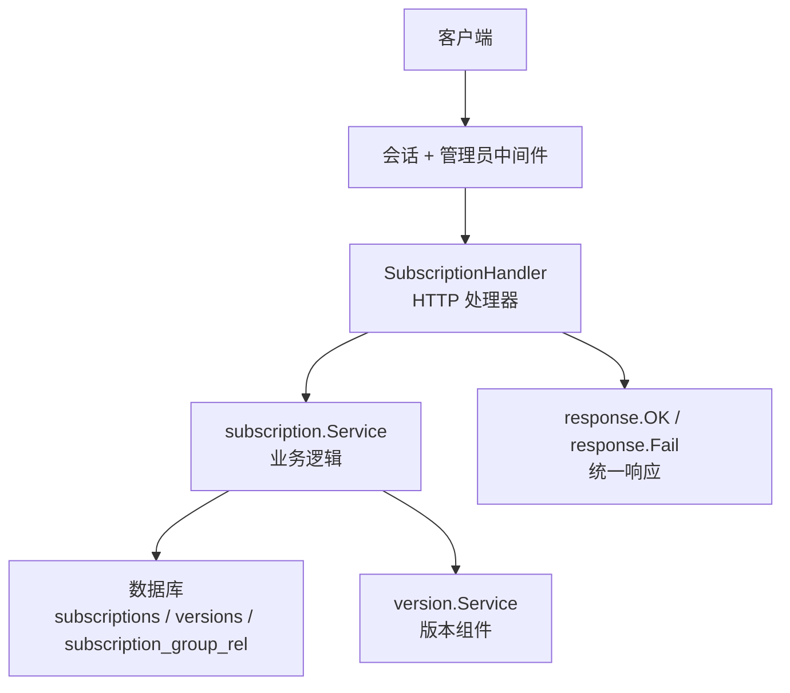
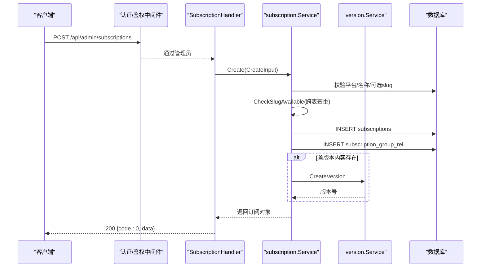
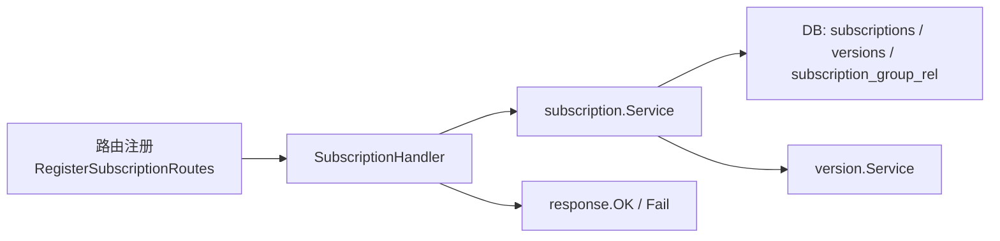

# 订阅基础CRUD操作

<cite>
**本文引用的文件**
- [backend/internal/server/subscription.go](file://backend/internal/server/subscription.go)
- [backend/internal/subscription/subscription.go](file://backend/internal/subscription/subscription.go)
- [backend/internal/response/response.go](file://backend/internal/response/response.go)
- [backend/internal/slug/slug.go](file://backend/internal/slug/slug.go)
- [backend/migrations/1002_subscriptions_versions.sql](file://backend/migrations/1002_subscriptions_versions.sql)
- [frontend/src/api/subscription.ts](file://frontend/src/api/subscription.ts)
- [backend/internal/server/server.go](file://backend/internal/server/server.go)
</cite>

## 目录
1. [简介](#简介)
2. [项目结构](#项目结构)
3. [核心组件](#核心组件)
4. [架构总览](#架构总览)
5. [详细接口说明](#详细接口说明)
6. [依赖关系分析](#依赖关系分析)
7. [性能与一致性](#性能与一致性)
8. [故障排查指南](#故障排查指南)
9. [结论](#结论)

## 简介
本文档面向管理员，详细说明订阅池（Subscription）的 CRUD 管理 API：创建、查询列表、更新、删除。涵盖权限要求、参数校验规则、唯一性检查机制（slug 冲突检测）、错误处理与响应格式，并提供请求/响应示例路径与常见失败场景说明。

## 项目结构
订阅管理的后端实现由“接入层（HTTP Handler）+ 业务层（Service）+ 数据层（Store/DB）”组成，并通过统一响应封装返回标准 JSON。路由注册时叠加了会话中间件与管理员权限中间件，确保仅管理员可访问。

图表来源
- [backend/internal/server/subscription.go:21-38](file://backend/internal/server/subscription.go#L21-L38)
- [backend/internal/server/server.go:86-92](file://backend/internal/server/server.go#L86-L92)
- [backend/internal/response/response.go:14-50](file://backend/internal/response/response.go#L14-L50)

章节来源
- [backend/internal/server/subscription.go:21-38](file://backend/internal/server/subscription.go#L21-L38)
- [backend/internal/server/server.go:86-92](file://backend/internal/server/server.go#L86-L92)

## 核心组件
- SubscriptionHandler：负责解析请求、调用业务服务、统一错误映射与响应。
- subscription.Service：提供订阅的创建、更新、删除、列表查询、slug 可用性检查等能力；包含跨四类资源的全局 slug 唯一性校验。
- version.Service：管理订阅的版本内容（创建、切换、预览、删除）。
- response：统一成功/失败响应结构，5xx 对外脱敏（调试模式除外）。

章节来源
- [backend/internal/server/subscription.go:15-38](file://backend/internal/server/subscription.go#L15-L38)
- [backend/internal/subscription/subscription.go:28-84](file://backend/internal/subscription/subscription.go#L28-L84)
- [backend/internal/response/response.go:14-50](file://backend/internal/response/response.go#L14-L50)

## 架构总览
订阅管理端点挂载在 /api/admin/subscriptions，所有端点均受会话与管理员双重保护。列表按平台分组返回，并附带关联组与被选定数量信息。slug 唯一性在全局命名空间（subscriptions/rules/custom_subscriptions/share_subscriptions）内检查，避免跨资源冲突。

图表来源
- [backend/internal/server/subscription.go:65-90](file://backend/internal/server/subscription.go#L65-L90)
- [backend/internal/subscription/subscription.go:166-231](file://backend/internal/subscription/subscription.go#L166-L231)
- [backend/internal/server/server.go:86-92](file://backend/internal/server/server.go#L86-L92)

## 详细接口说明

### 通用约定
- 权限：必须登录且具备管理员角色。
- 请求体：JSON。
- 响应：统一结构 { code, message?, data? }。列表使用 { list, total } 包裹。
- 错误：非 2xx 时，message 为人类可读提示；5xx 默认对外脱敏为“服务器内部错误”，可在调试模式下返回详情。

章节来源
- [backend/internal/server/server.go:86-92](file://backend/internal/server/server.go#L86-L92)
- [backend/internal/response/response.go:14-50](file://backend/internal/response/response.go#L14-L50)

### 创建订阅
- 方法/路径：POST /api/admin/subscriptions
- 权限：管理员
- 请求体字段
  - platform_id：整数，必填
  - name：字符串，必填，长度 1~100
  - slug：字符串，可选；为空则自动生成（前缀 subscription- + 随机短码），需符合小写字母数字连字符，长度 3~64
  - group_ids：整数数组，可选；将建立订阅与用户组的关联
- 成功响应：{ code:0, data: Subscription }
- 失败场景
  - 400 参数错误：platform_id/name 缺失或非法、slug 格式不合法、平台不存在
  - 409 标识冲突：slug 与其他三类资源之一冲突
  - 500 服务器错误：内部异常（对外脱敏）

章节来源
- [backend/internal/server/subscription.go:49-90](file://backend/internal/server/subscription.go#L49-L90)
- [backend/internal/subscription/subscription.go:166-231](file://backend/internal/subscription/subscription.go#L166-L231)
- [backend/internal/slug/slug.go:15-33](file://backend/internal/slug/slug.go#L15-L33)

### 查询订阅列表
- 方法/路径：GET /api/admin/subscriptions
- 权限：管理员
- 响应：{ code:0, data: { list: PlatformGroup[], total: N } }
  - PlatformGroup：{ platform_id, platform_name, subscriptions[] }
  - Subscription：{ id, slug, name, platform_id, current_version, groups[], selected_by }
- 失败场景：500 服务器错误

章节来源
- [backend/internal/server/subscription.go:56-63](file://backend/internal/server/subscription.go#L56-L63)
- [backend/internal/subscription/subscription.go:353-395](file://backend/internal/subscription/subscription.go#L353-L395)

### 更新订阅
- 方法/路径：PUT /api/admin/subscriptions/:id
- 权限：管理员
- 路径参数
  - id：正整数
- 请求体字段
  - name：字符串，必填，长度 1~100
  - group_ids：整数数组，可选；将重建订阅与用户组的关联
- 成功响应：{ code:0, data: null }
- 失败场景
  - 400 参数错误：name 缺失或非法、id 非法
  - 404 未找到：订阅不存在
  - 500 服务器错误

章节来源
- [backend/internal/server/subscription.go:92-115](file://backend/internal/server/subscription.go#L92-L115)
- [backend/internal/subscription/subscription.go:244-274](file://backend/internal/subscription/subscription.go#L244-L274)

### 删除订阅
- 方法/路径：DELETE /api/admin/subscriptions/:id
- 权限：管理员
- 路径参数
  - id：正整数
- 成功响应：{ code:0, data: null }
- 失败场景
  - 404 未找到：订阅不存在
  - 500 服务器错误
- 级联行为
  - 删除该订阅的全部版本记录与文件
  - 删除指向它的下载 Token（含预览 Token）
  - 清理订阅与用户组的关联；受影响组置空并标记 needs_reselect（由回调注入）

章节来源
- [backend/internal/server/subscription.go:117-132](file://backend/internal/server/subscription.go#L117-L132)
- [backend/internal/subscription/subscription.go:276-332](file://backend/internal/subscription/subscription.go#L276-L332)
- [backend/migrations/1002_subscriptions_versions.sql:1-34](file://backend/migrations/1002_subscriptions_versions.sql#L1-L34)

### 标识唯一性即时校验（前端输入建议）
- 方法/路径：GET /api/admin/slug/check?slug=&type=&id=
- 权限：管理员
- 查询参数
  - slug：待校验的标识
  - type：所有者类型（如 subscription），用于编辑时排除自身
  - id：所有者 ID，配合 type 排除自身
- 响应：{ code:0, data: { available: boolean } }
- 用途：前端在用户输入 slug 时实时提示是否可用

章节来源
- [backend/internal/server/subscription.go:134-148](file://backend/internal/server/subscription.go#L134-L148)
- [backend/internal/subscription/subscription.go:86-115](file://backend/internal/subscription/subscription.go#L86-L115)

## 依赖关系分析
- 路由注册：订阅路由通过 RegisterSubscriptionRoutes 挂载到 /api/admin/subscriptions，并叠加会话与管理员中间件。
- 业务层：subscription.Service 负责校验、事务、跨表 slug 唯一性检查、与版本组件交互。
- 数据层：subscriptions、versions、subscription_group_rel 三张表支撑订阅、版本与组关联。
- 统一响应：response.OK/Fail 保证一致的结构与错误处理策略。

图表来源
- [backend/internal/server/server.go:86-92](file://backend/internal/server/server.go#L86-L92)
- [backend/internal/server/subscription.go:21-38](file://backend/internal/server/subscription.go#L21-L38)
- [backend/internal/subscription/subscription.go:166-231](file://backend/internal/subscription/subscription.go#L166-L231)
- [backend/migrations/1002_subscriptions_versions.sql:1-34](file://backend/migrations/1002_subscriptions_versions.sql#L1-L34)

章节来源
- [backend/internal/server/server.go:86-92](file://backend/internal/server/server.go#L86-L92)
- [backend/internal/server/subscription.go:21-38](file://backend/internal/server/subscription.go#L21-L38)

## 性能与一致性
- 事务：创建、更新、删除均在事务中执行，保证数据一致性。
- 唯一性：slug 生成采用加密安全随机短码，并在事务内跨四类资源查重，冲突自动重试（最多 3 次）。
- 列表查询：按平台分组返回，减少前端聚合成本；空列表返回 [] 而非 null，便于前端安全遍历。
- 文件删除：版本文件在事务提交后异步删除，失败仅记日志不阻断主流程。

章节来源
- [backend/internal/subscription/subscription.go:166-231](file://backend/internal/subscription/subscription.go#L166-L231)
- [backend/internal/slug/slug.go:15-33](file://backend/internal/slug/slug.go#L15-L33)
- [backend/internal/subscription/subscription.go:353-395](file://backend/internal/subscription/subscription.go#L353-L395)
- [backend/internal/subscription/subscription.go:276-332](file://backend/internal/subscription/subscription.go#L276-L332)

## 故障排查指南
- 400 参数错误
  - 检查 platform_id、name、group_ids 是否符合必填与长度限制
  - 检查 slug 是否为小写字母数字连字符，长度 3~64
  - 确认传入的 id 为正整数
- 404 未找到
  - 更新或删除时确认订阅是否存在
- 409 标识冲突
  - 使用 GET /api/admin/slug/check 提前校验 slug 可用性
- 500 服务器错误
  - 默认对外返回“服务器内部错误”；开启调试模式后可查看具体错误信息
- 批量操作
  - 当前接口不支持批量创建/更新/删除；如需批量，请在前端循环调用单个接口

章节来源
- [backend/internal/server/subscription.go:49-132](file://backend/internal/server/subscription.go#L49-L132)
- [backend/internal/response/response.go:40-50](file://backend/internal/response/response.go#L40-L50)

## 结论
订阅管理 API 提供了完整的管理能力，具备严格的权限控制、参数校验与全局 slug 唯一性保障。通过统一响应与事务化操作，确保了数据一致性与良好的错误体验。建议在创建前使用 slug 校验接口进行可用性检查，以提升用户体验。