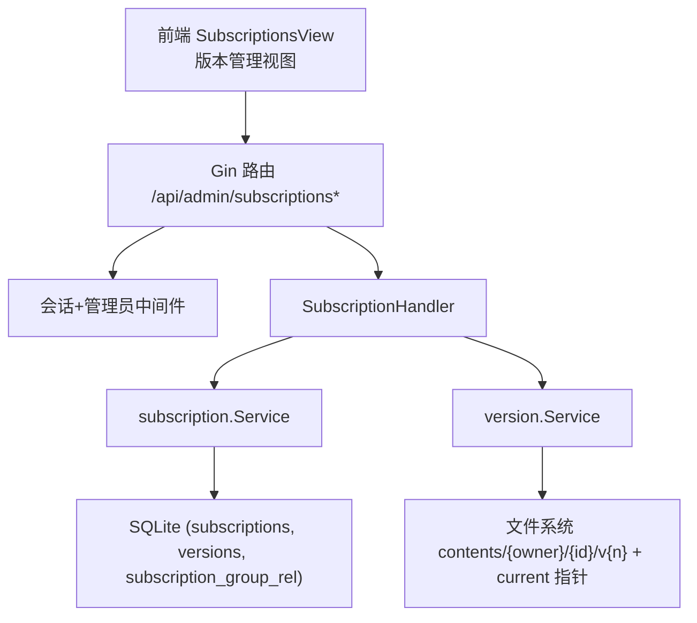
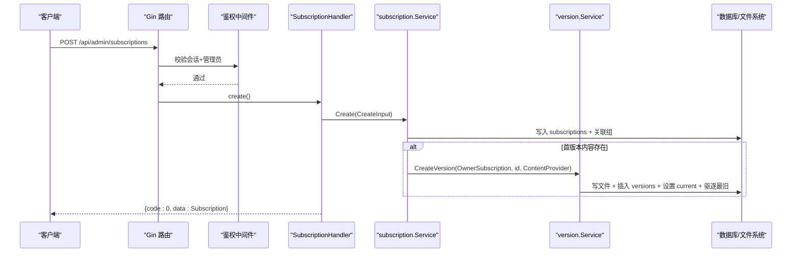
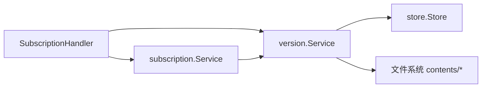

# 订阅管理API

<cite>
**本文引用的文件**
- [backend/internal/server/subscription.go](file://backend/internal/server/subscription.go)
- [backend/internal/subscription/subscription.go](file://backend/internal/subscription/subscription.go)
- [backend/internal/version/version.go](file://backend/internal/version/version.go)
- [backend/internal/auth/auth.go](file://backend/internal/auth/auth.go)
- [backend/internal/response/response.go](file://backend/internal/response/response.go)
- [backend/migrations/1002_subscriptions_versions.sql](file://backend/migrations/1002_subscriptions_versions.sql)
- [frontend/src/api/subscription.ts](file://frontend/src/api/subscription.ts)
- [frontend/src/api/version.ts](file://frontend/src/api/version.ts)
- [frontend/src/views/admin/SubscriptionsView.vue](file://frontend/src/views/admin/SubscriptionsView.vue)
</cite>

## 目录
1. [简介](#简介)
2. [项目结构](#项目结构)
3. [核心组件](#核心组件)
4. [架构总览](#架构总览)
5. [详细组件分析](#详细组件分析)
6. [依赖关系分析](#依赖关系分析)
7. [性能与安全](#性能与安全)
8. [故障排查指南](#故障排查指南)
9. [结论](#结论)
10. [附录：端点与数据模型](#附录端点与数据模型)

## 简介
本文件面向“订阅管理”的完整API文档，覆盖订阅的创建、编辑、删除、版本控制（上传/文本编辑、版本历史、回滚切换、预览）、权限验证（管理员）、文件大小限制与格式校验等。文档同时给出请求参数、响应结构、错误码约定以及完整的生命周期示例，帮助前后端开发者快速集成与排障。

## 项目结构
后端采用分层设计：
- 接入层（server）：路由注册、鉴权中间件叠加、请求解析与统一响应封装
- 业务层（subscription）：订阅CRUD、标识唯一性校验、级联删除
- 版本服务（version）：通用版本管理（上传/文本双模式、当前版本指针、版本驱逐、预览/下载）
- 认证与授权（auth）：会话校验、管理员角色校验
- 数据库迁移（migrations）：订阅表、版本表、关联表定义
- 前端（frontend）：订阅列表、版本管理、版本操作封装

图表来源
- [backend/internal/server/subscription.go:21-38](file://backend/internal/server/subscription.go#L21-L38)
- [backend/internal/subscription/subscription.go:165-231](file://backend/internal/subscription/subscription.go#L165-L231)
- [backend/internal/version/version.go:125-180](file://backend/internal/version/version.go#L125-L180)
- [backend/migrations/1002_subscriptions_versions.sql:1-34](file://backend/migrations/1002_subscriptions_versions.sql#L1-L34)

章节来源
- [backend/internal/server/subscription.go:21-38](file://backend/internal/server/subscription.go#L21-L38)
- [backend/internal/subscription/subscription.go:165-231](file://backend/internal/subscription/subscription.go#L165-L231)
- [backend/internal/version/version.go:125-180](file://backend/internal/version/version.go#L125-L180)
- [backend/migrations/1002_subscriptions_versions.sql:1-34](file://backend/migrations/1002_subscriptions_versions.sql#L1-L34)

## 核心组件
- 订阅处理器 SubscriptionHandler：负责订阅CRUD与版本相关端点的接入处理，统一使用会话+管理员中间件保护
- 订阅服务 subscription.Service：实现订阅创建/更新/删除、标识唯一性检查、组关联、级联删除
- 版本服务 version.Service：提供版本创建（文件/文本）、切换当前版本、预览、删除、列表、启动自检、内容读取等
- 认证中间件：SessionMiddleware 校验会话；AdminMiddleware 校验管理员角色
- 统一响应：OK/Fail/ListData 规范返回结构

章节来源
- [backend/internal/server/subscription.go:15-38](file://backend/internal/server/subscription.go#L15-L38)
- [backend/internal/subscription/subscription.go:28-84](file://backend/internal/subscription/subscription.go#L28-L84)
- [backend/internal/version/version.go:50-79](file://backend/internal/version/version.go#L50-L79)
- [backend/internal/auth/auth.go:144-192](file://backend/internal/auth/auth.go#L144-L192)
- [backend/internal/response/response.go:14-51](file://backend/internal/response/response.go#L14-L51)

## 架构总览
订阅管理API通过Gin路由暴露，所有管理端点均叠加会话与管理员中间件。订阅CRUD由subscription服务完成；版本操作由version服务统一处理，支持文件上传与文本编辑两种模式，并维护当前激活版本指针（DB字段current_version + 软链接current）。

图表来源
- [backend/internal/server/subscription.go:65-90](file://backend/internal/server/subscription.go#L65-L90)
- [backend/internal/subscription/subscription.go:165-231](file://backend/internal/subscription/subscription.go#L165-L231)
- [backend/internal/version/version.go:125-180](file://backend/internal/version/version.go#L125-L180)

## 详细组件分析

### 订阅CRUD端点
- GET /api/admin/subscriptions
  - 功能：按平台分组列出订阅，包含关联组与被选定数量
  - 权限：管理员
  - 响应：{ list: PlatformGroup[], total }
- POST /api/admin/subscriptions
  - 功能：创建订阅（可选slug，为空时自动生成；可携带group_ids；可选首版本内容）
  - 权限：管理员
  - 请求体：platform_id, name, slug?, group_ids[]
  - 响应：{ ...Subscription }
- PUT /api/admin/subscriptions/:id
  - 功能：更新名称与关联组（平台只读）
  - 权限：管理员
  - 请求体：name, group_ids[]
  - 响应：{ code:0 }
- DELETE /api/admin/subscriptions/:id
  - 功能：删除订阅（级联删除版本文件、Token、关联）
  - 权限：管理员
  - 响应：{ code:0 }

章节来源
- [backend/internal/server/subscription.go:21-38](file://backend/internal/server/subscription.go#L21-L38)
- [backend/internal/server/subscription.go:56-132](file://backend/internal/server/subscription.go#L56-L132)
- [backend/internal/subscription/subscription.go:165-332](file://backend/internal/subscription/subscription.go#L165-L332)
- [backend/internal/response/response.go:14-51](file://backend/internal/response/response.go#L14-L51)

### 版本管理端点（订阅）
- GET /api/admin/subscriptions/:id/versions
  - 功能：列出该订阅的所有版本，标注当前激活版本
  - 权限：管理员
  - 响应：{ list: VersionItem[], total }
- POST /api/admin/subscriptions/:id/versions
  - 功能：创建新版本（双模式）
    - 文件上传：multipart/form-data，字段 file；默认 mode=upload
    - 文本编辑：JSON { text }，查询参数 ?mode=text
  - 权限：管理员
  - 大小限制：≤50MB
  - 响应：{ version_no, yaml_warning? }
- PUT /api/admin/subscriptions/:id/versions/current
  - 功能：切换当前激活版本（原子切换）
  - 权限：管理员
  - 请求体：{ version_no }
  - 响应：{ code:0 }
- GET /api/admin/subscriptions/:id/versions/:ver/preview
  - 功能：预览指定版本内容（text/plain，禁用缓存）
  - 权限：管理员
  - 响应：纯文本内容
- DELETE /api/admin/subscriptions/:id/versions/:ver
  - 功能：删除非当前且非最后一个的版本
  - 权限：管理员
  - 响应：{ code:0 }

章节来源
- [backend/internal/server/subscription.go:150-170](file://backend/internal/server/subscription.go#L150-L170)
- [backend/internal/server/subscription.go:174-309](file://backend/internal/server/subscription.go#L174-L309)
- [backend/internal/version/version.go:125-180](file://backend/internal/version/version.go#L125-L180)
- [backend/internal/version/version.go:218-245](file://backend/internal/version/version.go#L218-L245)
- [backend/internal/version/version.go:303-338](file://backend/internal/version/version.go#L303-L338)
- [backend/internal/version/version.go:371-382](file://backend/internal/version/version.go#L371-L382)

### 标识唯一性校验
- GET /api/admin/slug/check?slug=&type=&id=
  - 功能：校验标识是否可用（四类资源全局唯一），编辑时可排除自身
  - 权限：管理员
  - 响应：{ available: boolean }

章节来源
- [backend/internal/server/subscription.go:134-148](file://backend/internal/server/subscription.go#L134-L148)
- [backend/internal/subscription/subscription.go:86-115](file://backend/internal/subscription/subscription.go#L86-L115)

### 权限与安全机制
- 会话校验：SessionMiddleware 校验Authorization头中的JWT，实时查库确认用户状态与凭据版本
- 管理员校验：AdminMiddleware 校验角色为 admin
- 文件大小限制：上传内容最大50MB，超出返回400
- YAML提示：文本模式保存前进行启发式YAML检测，仅提示不阻断
- 标识格式：小写字母数字连字符，长度3~64

章节来源
- [backend/internal/auth/auth.go:144-192](file://backend/internal/auth/auth.go#L144-L192)
- [backend/internal/version/version.go:25-38](file://backend/internal/version/version.go#L25-L38)
- [backend/internal/version/version.go:517-531](file://backend/internal/version/version.go#L517-L531)
- [backend/internal/subscription/subscription.go:18-26](file://backend/internal/subscription/subscription.go#L18-L26)

### 数据模型与存储
- 订阅表 subscriptions：id, slug(唯一), name, platform_id, current_version, created_at, updated_at
- 版本表 versions：id, owner_type, owner_id, version_no, file_path, created_at, updated_at
- 订阅-组关联：subscription_group_rel
- 文件组织：contents/{ownerType}/{ownerID}/v{n}，current 指向当前版本

章节来源
- [backend/migrations/1002_subscriptions_versions.sql:1-34](file://backend/migrations/1002_subscriptions_versions.sql#L1-L34)
- [backend/internal/version/version.go:110-123](file://backend/internal/version/version.go#L110-L123)

### 前端接口封装与页面交互
- 订阅API封装：listSubscriptions, getSubscription, createSubscription, updateSubscription, deleteSubscription, checkSlug
- 版本API封装：versionApi(prefix) 提供 list/create/switchCurrent/preview/remove
- 订阅管理页面：SubscriptionsView 展示按平台分组的订阅，支持新建/编辑/删除与跳转版本管理

章节来源
- [frontend/src/api/subscription.ts:1-35](file://frontend/src/api/subscription.ts#L1-L35)
- [frontend/src/api/version.ts:1-31](file://frontend/src/api/version.ts#L1-L31)
- [frontend/src/views/admin/SubscriptionsView.vue:1-188](file://frontend/src/views/admin/SubscriptionsView.vue#L1-L188)

## 依赖关系分析
- 接入层依赖业务层：SubscriptionHandler 依赖 subscription.Service 与 version.Service
- 业务层依赖版本服务：subscription.Create/Delete 调用 version 进行版本文件的创建/清理
- 版本服务依赖存储与文件系统：读写 versions 表与 contents 目录，维护 current 指针
- 鉴权中间件独立于业务：在路由层组合使用

图表来源
- [backend/internal/server/subscription.go:15-38](file://backend/internal/server/subscription.go#L15-L38)
- [backend/internal/subscription/subscription.go:28-41](file://backend/internal/subscription/subscription.go#L28-L41)
- [backend/internal/version/version.go:50-59](file://backend/internal/version/version.go#L50-L59)

章节来源
- [backend/internal/server/subscription.go:15-38](file://backend/internal/server/subscription.go#L15-L38)
- [backend/internal/subscription/subscription.go:28-41](file://backend/internal/subscription/subscription.go#L28-L41)
- [backend/internal/version/version.go:50-59](file://backend/internal/version/version.go#L50-L59)

## 性能与安全
- 事务与锁：版本创建/切换/删除使用BEGIN IMMEDIATE事务，保证并发安全与一致性
- 版本上限：每份资源最多保留5个版本，自动驱逐最旧（不含当前激活）
- 文件大小：严格限制50MB，避免内存与磁盘压力
- 原子切换：当前版本切换通过临时指针+rename原子替换，避免竞态
- 启动自检：启动时以DB为准重建current软链接，确保一致
- 安全校验：管理员权限、会话校验、标识格式校验、YAML语法提示

章节来源
- [backend/internal/version/version.go:125-180](file://backend/internal/version/version.go#L125-L180)
- [backend/internal/version/version.go:218-245](file://backend/internal/version/version.go#L218-L245)
- [backend/internal/version/version.go:438-484](file://backend/internal/version/version.go#L438-L484)
- [backend/internal/auth/auth.go:144-192](file://backend/internal/auth/auth.go#L144-L192)

## 故障排查指南
- 400 参数错误：常见于缺少必填字段、标识格式非法、超过50MB限制
- 401 未授权：会话缺失或无效、账号未激活
- 403 权限不足：非管理员角色
- 404 资源不存在：订阅或版本不存在
- 409 冲突：标识已被使用
- 500 内部错误：服务器异常（生产环境对外脱敏，调试模式可开启详情）
- 版本删除失败：不可删除最后一个或当前激活版本，需先切换
- YAML警告：文本模式保存时若检测到YAML语法问题，会返回warning提示但不阻断

章节来源
- [backend/internal/server/subscription.go:65-132](file://backend/internal/server/subscription.go#L65-L132)
- [backend/internal/server/subscription.go:194-235](file://backend/internal/server/subscription.go#L194-L235)
- [backend/internal/server/subscription.go:237-309](file://backend/internal/server/subscription.go#L237-L309)
- [backend/internal/version/version.go:303-338](file://backend/internal/version/version.go#L303-L338)
- [backend/internal/response/response.go:35-51](file://backend/internal/response/response.go#L35-L51)

## 结论
订阅管理API提供了完整的订阅生命周期管理能力，结合统一的版本控制系统，实现了安全的文件上传与文本编辑、严格的权限控制、健壮的事务与并发保障，以及友好的前端集成体验。建议在生产环境中启用调试模式开关以便定位5xx错误，并合理配置数据目录与备份策略。

## 附录：端点与数据模型

### 端点清单与说明
- 订阅
  - GET /api/admin/subscriptions → 列表（按平台分组）
  - POST /api/admin/subscriptions → 创建（platform_id, name, slug?, group_ids[]）
  - PUT /api/admin/subscriptions/:id → 更新（name, group_ids[]）
  - DELETE /api/admin/subscriptions/:id → 删除
- 版本
  - GET /api/admin/subscriptions/:id/versions → 列表（含current标记）
  - POST /api/admin/subscriptions/:id/versions → 创建（文件上传或 ?mode=text 文本）
  - PUT /api/admin/subscriptions/:id/versions/current → 切换当前版本（{ version_no }）
  - GET /api/admin/subscriptions/:id/versions/:ver/preview → 预览（text/plain）
  - DELETE /api/admin/subscriptions/:id/versions/:ver → 删除（非当前且非最后一个）
- 辅助
  - GET /api/admin/slug/check?slug=&type=&id= → 标识可用性校验

### 请求与响应结构
- 统一响应
  - 成功：{ code:0, data:... }
  - 列表：{ code:0, data:{ list:[...], total:N } }
  - 失败：{ code:HTTP状态码, message:"..." }
- 订阅对象
  - id, slug, name, platform_id, current_version, groups[], selected_by
- 版本对象
  - version_no, file_path, file_name, current, created_at, updated_at
- 创建版本响应
  - version_no, yaml_warning?（文本模式可能返回）

### 生命周期示例
- 新建订阅并设置首版本
  - 调用 POST /api/admin/subscriptions 创建订阅
  - 调用 POST /api/admin/subscriptions/:id/versions 上传文件或提交文本作为首版本
  - 列表显示 current_version 与版本标签
- 编辑订阅
  - 调用 PUT /api/admin/subscriptions/:id 更新名称与关联组
- 版本管理与回滚
  - 调用 GET /api/admin/subscriptions/:id/versions 查看版本历史
  - 调用 PUT /api/admin/subscriptions/:id/versions/current 切换当前版本（回滚到历史版本）
  - 调用 GET /api/admin/subscriptions/:id/versions/:ver/preview 预览任意版本
  - 调用 DELETE /api/admin/subscriptions/:id/versions/:ver 删除多余历史版本
- 删除订阅
  - 调用 DELETE /api/admin/subscriptions/:id 级联删除版本文件与关联

章节来源
- [backend/internal/server/subscription.go:21-38](file://backend/internal/server/subscription.go#L21-L38)
- [backend/internal/server/subscription.go:56-132](file://backend/internal/server/subscription.go#L56-L132)
- [backend/internal/server/subscription.go:150-309](file://backend/internal/server/subscription.go#L150-L309)
- [backend/internal/subscription/subscription.go:59-84](file://backend/internal/subscription/subscription.go#L59-L84)
- [backend/internal/version/version.go:61-69](file://backend/internal/version/version.go#L61-L69)
- [backend/internal/response/response.go:14-51](file://backend/internal/response/response.go#L14-L51)