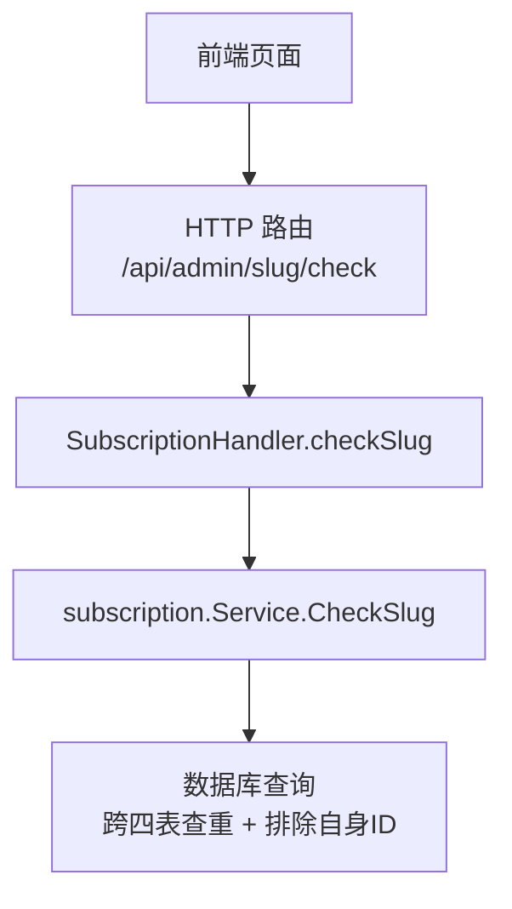
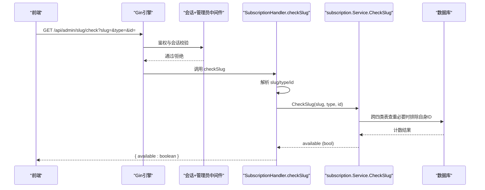
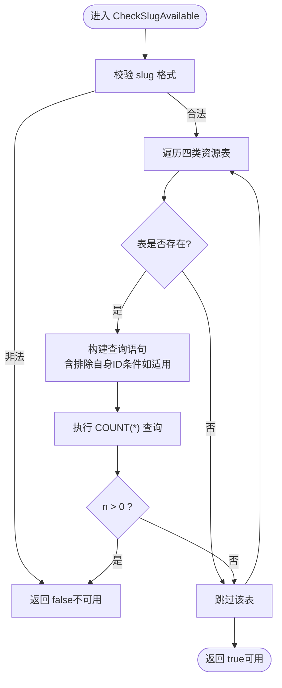
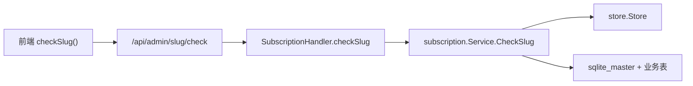

# 验证工具API

<cite>
**本文引用的文件**
- [backend/internal/server/subscription.go](file://backend/internal/server/subscription.go)
- [backend/internal/subscription/subscription.go](file://backend/internal/subscription/subscription.go)
- [frontend/src/api/subscription.ts](file://frontend/src/api/subscription.ts)
</cite>

## 目录
1. [简介](#简介)
2. [项目结构](#项目结构)
3. [核心组件](#核心组件)
4. [架构总览](#架构总览)
5. [详细组件分析](#详细组件分析)
6. [依赖关系分析](#依赖关系分析)
7. [性能考虑](#性能考虑)
8. [故障排查指南](#故障排查指南)
9. [结论](#结论)
10. [附录：前端集成示例](#附录前端集成示例)

## 简介
本文件面向“标识唯一性检查接口”（GET /api/admin/slug/check），用于在前端实时校验订阅标识符（slug）的唯一性，避免用户输入重复值。该接口支持编辑模式下排除自身ID的逻辑，返回统一的可用状态布尔值，并提供清晰的错误处理机制。文档同时给出前端集成建议与性能优化实践（防抖、缓存等）。

## 项目结构
后端采用分层设计：
- 接入层（server）：定义HTTP路由与请求处理，负责参数解析、鉴权中间件调用、统一响应封装。
- 业务层（subscription）：实现跨四类资源的全局唯一性校验逻辑，包含格式校验、表存在性预检、排除自身ID的查询构造。
- 前端（frontend）：提供API封装函数，供页面在用户输入时调用以获取可用性反馈。

图表来源
- [backend/internal/server/subscription.go:21-38](file://backend/internal/server/subscription.go#L21-L38)
- [backend/internal/server/subscription.go:134-148](file://backend/internal/server/subscription.go#L134-L148)
- [backend/internal/subscription/subscription.go:86-115](file://backend/internal/subscription/subscription.go#L86-L115)

章节来源
- [backend/internal/server/subscription.go:21-38](file://backend/internal/server/subscription.go#L21-L38)
- [backend/internal/subscription/subscription.go:86-115](file://backend/internal/subscription/subscription.go#L86-L115)

## 核心组件
- HTTP路由注册：在订阅模块中注册了 /api/admin/slug/check 端点，并叠加会话与管理员双中间件保护。
- 处理器：SubscriptionHandler.checkSlug 负责解析查询参数并调用服务层进行校验。
- 服务层：subscription.Service.CheckSlug 包装 CheckSlugAvailable，完成格式校验、跨四类资源查重与排除自身ID逻辑。

章节来源
- [backend/internal/server/subscription.go:21-38](file://backend/internal/server/subscription.go#L21-L38)
- [backend/internal/server/subscription.go:134-148](file://backend/internal/server/subscription.go#L134-L148)
- [backend/internal/subscription/subscription.go:86-115](file://backend/internal/subscription/subscription.go#L86-L115)

## 架构总览
下图展示了从前端到数据库的完整调用链，包括鉴权、参数解析、业务校验与结果返回。

图表来源
- [backend/internal/server/subscription.go:21-38](file://backend/internal/server/subscription.go#L21-L38)
- [backend/internal/server/subscription.go:134-148](file://backend/internal/server/subscription.go#L134-L148)
- [backend/internal/subscription/subscription.go:86-115](file://backend/internal/subscription/subscription.go#L86-L115)

## 详细组件分析

### 接口定义与行为
- 方法：GET
- 路径：/api/admin/slug/check
- 鉴权：需要登录会话且具备管理员权限（由注册时的中间件保证）
- 查询参数：
  - slug：必填，待校验的标识符
  - type：可选，当前资源的类型名（如 subscriptions），用于编辑时排除自身ID
  - id：可选，当前资源的ID，配合type使用，排除自身记录
- 成功响应体：{ available: boolean }
- 失败响应：统一错误结构，HTTP状态码根据错误类型映射（如参数错误、内部错误等）

章节来源
- [backend/internal/server/subscription.go:21-38](file://backend/internal/server/subscription.go#L21-L38)
- [backend/internal/server/subscription.go:134-148](file://backend/internal/server/subscription.go#L134-L148)

### 处理器：checkSlug
- 职责：解析查询参数，调用服务层进行校验，返回统一JSON响应。
- 关键点：
  - 解析 slug、type、id；id为可选，为空则不传参与排除逻辑。
  - 调用 subscription.Service.CheckSlug 得到布尔结果。
  - 使用统一OK封装返回 { available }。

章节来源
- [backend/internal/server/subscription.go:134-148](file://backend/internal/server/subscription.go#L134-L148)

### 服务层：CheckSlug 与 CheckSlugAvailable
- CheckSlug：便捷包装，直接委托 CheckSlugAvailable。
- CheckSlugAvailable：
  - 格式校验：仅允许小写字母、数字与连字符，长度3~64。
  - 跨四类资源全局唯一命名空间：subscriptions、rules、custom_subscriptions、share_subscriptions。
  - 表存在性预检：若某表尚未建立（迁移未完成），跳过该表检查，避免报错。
  - 排除自身ID：当 type 与当前表名一致且提供了 id，则在SQL中加入 AND id != ? 条件，确保编辑时不会误判自身为冲突。
  - 返回布尔值表示是否可用。

图表来源
- [backend/internal/subscription/subscription.go:86-115](file://backend/internal/subscription/subscription.go#L86-L115)

章节来源
- [backend/internal/subscription/subscription.go:86-115](file://backend/internal/subscription/subscription.go#L86-L115)

### 数据模型与约束
- slug格式：小写字母、数字与连字符，长度3~64。
- 全局唯一范围：跨四类资源（订阅、规则、自定义订阅、分享订阅）。
- 编辑模式排除自身：通过 type 与 id 组合，在对应表中排除当前记录ID。

章节来源
- [backend/internal/subscription/subscription.go:18-26](file://backend/internal/subscription/subscription.go#L18-L26)
- [backend/internal/subscription/subscription.go:86-115](file://backend/internal/subscription/subscription.go#L86-L115)

## 依赖关系分析
- 路由注册依赖：
  - 会话与管理员中间件：确保只有已登录的管理员可访问。
  - SubscriptionHandler：持有 subscription.Service 与 version.Service（后者在本接口未使用）。
- 服务层依赖：
  - store.Store：用于数据库连接与事务操作（本接口使用非事务查询）。
  - 表存在性检查：基于 sqlite_master 判断表是否存在，避免迁移阶段报错。
- 前端依赖：
  - api/subscription.ts 中的 checkSlug 函数，封装了对 /admin/slug/check 的GET请求。

图表来源
- [backend/internal/server/subscription.go:21-38](file://backend/internal/server/subscription.go#L21-L38)
- [backend/internal/server/subscription.go:134-148](file://backend/internal/server/subscription.go#L134-L148)
- [backend/internal/subscription/subscription.go:86-115](file://backend/internal/subscription/subscription.go#L86-L115)
- [frontend/src/api/subscription.ts:33-34](file://frontend/src/api/subscription.ts#L33-L34)

章节来源
- [backend/internal/server/subscription.go:21-38](file://backend/internal/server/subscription.go#L21-L38)
- [backend/internal/subscription/subscription.go:86-115](file://backend/internal/subscription/subscription.go#L86-L115)
- [frontend/src/api/subscription.ts:33-34](file://frontend/src/api/subscription.ts#L33-L34)

## 性能考虑
- 防抖（Debounce）：前端应在用户输入时进行防抖，避免频繁触发校验请求。建议在每次输入后延迟若干毫秒再发起请求，并在下一次输入到来时取消上一次请求。
- 缓存策略：对相同 slug 的结果可在短期内存中缓存，减少重复请求。注意在切换 type/id 或 slug 变化时失效缓存。
- 并发控制：限制同一时间最多一个校验请求，避免竞态导致UI闪烁。
- 网络重试：仅在必要情况下重试失败请求，避免雪崩。
- 服务端优化：当前实现为轻量查询，主要开销在数据库COUNT；在高并发场景下可考虑引入只读副本或缓存层（如Redis）对热点slug做短时缓存。

[本节为通用性能建议，不直接分析具体代码文件]

## 故障排查指南
- 参数错误：
  - 现象：返回统一错误响应，HTTP状态码可能为400。
  - 排查：确认 slug 是否符合格式要求（小写字母、数字、连字符，长度3~64）；确认 type 与 id 传递是否正确。
- 内部错误：
  - 现象：返回统一错误响应，HTTP状态码可能为500。
  - 排查：查看后端日志，确认数据库连接与表存在性检查是否正常；确认迁移是否已完成。
- 编辑模式误判：
  - 现象：编辑自身时仍提示冲突。
  - 排查：确认传入的 type 与 id 是否与当前资源匹配；检查服务层是否在对应表中正确加入 AND id != ? 条件。

章节来源
- [backend/internal/server/subscription.go:134-148](file://backend/internal/server/subscription.go#L134-L148)
- [backend/internal/subscription/subscription.go:86-115](file://backend/internal/subscription/subscription.go#L86-L115)

## 结论
GET /api/admin/slug/check 提供了简洁高效的标识唯一性校验能力，支持跨四类资源的全局唯一性与编辑模式下的自身排除逻辑。结合前端的防抖与缓存策略，可实现流畅的用户体验与良好的系统性能。建议在生产环境中结合限流与监控，确保高并发下的稳定性。

[本节为总结性内容，不直接分析具体代码文件]

## 附录：前端集成示例
以下示例展示如何在用户输入时调用 checkSlug 并进行实时反馈。请根据实际框架调整实现细节。

- 基本调用
  - 新建模式：传入 slug 与 type（如 subscriptions），不传 id。
  - 编辑模式：传入 slug、type 与当前记录的 id，以实现排除自身ID。
- 防抖实现要点
  - 使用定时器或库（如 lodash.debounce）对输入事件进行节流。
  - 在下次输入到来时取消上一次请求，避免过时结果覆盖当前状态。
- 缓存策略
  - 维护一个 Map<slug, {available, timestamp}>，在短时间窗口内复用结果。
  - 当 type 或 id 变化时，清空相关缓存项。
- 错误处理
  - 网络错误或服务器错误时，显示友好提示并允许重试。
  - 对于格式不合法的 slug，直接标记为不可用，无需请求后端。

章节来源
- [frontend/src/api/subscription.ts:33-34](file://frontend/src/api/subscription.ts#L33-L34)
- [backend/internal/server/subscription.go:134-148](file://backend/internal/server/subscription.go#L134-L148)
- [backend/internal/subscription/subscription.go:86-115](file://backend/internal/subscription/subscription.go#L86-L115)