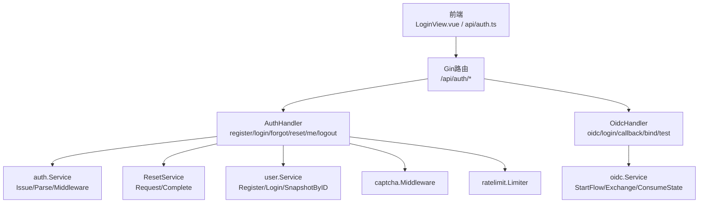
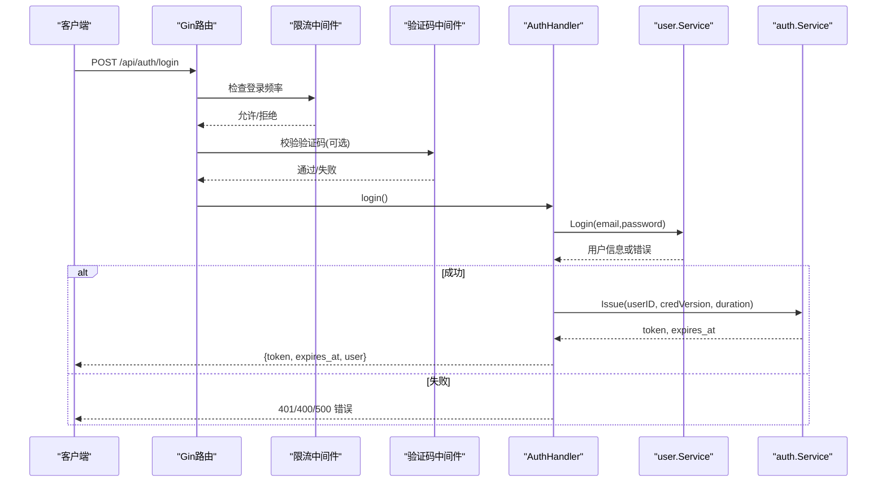
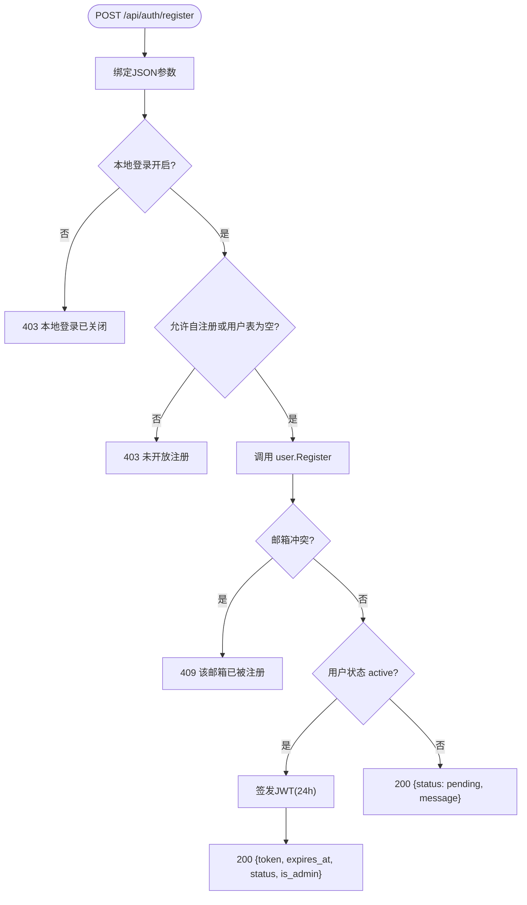
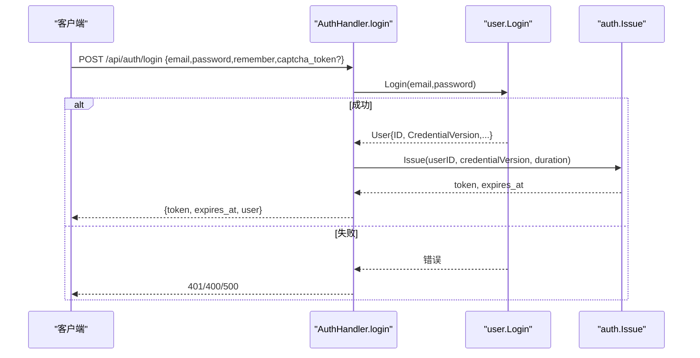
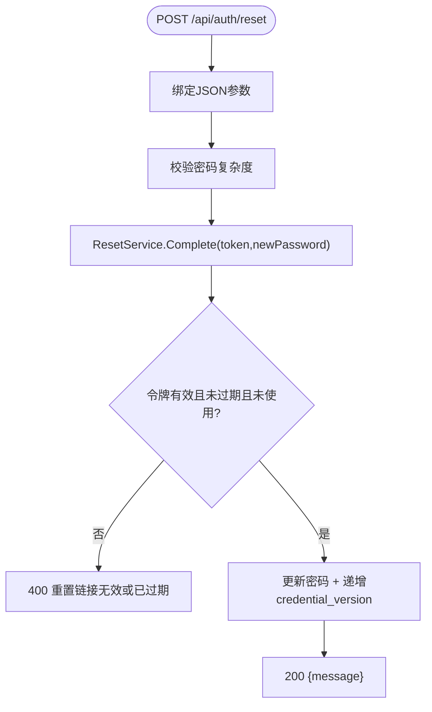
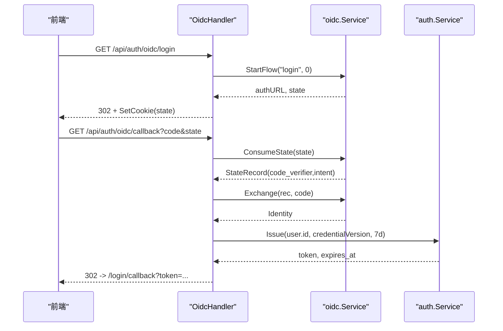
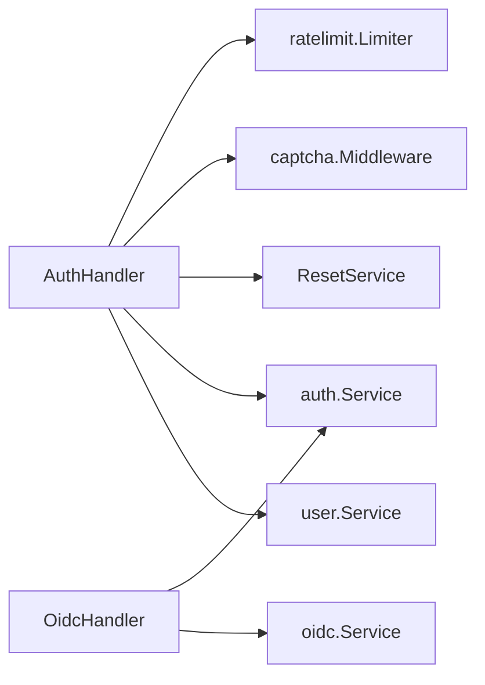

# 认证API

<cite>
**本文引用的文件**
- [backend/internal/server/auth.go](file://backend/internal/server/auth.go)
- [backend/internal/auth/auth.go](file://backend/internal/auth/auth.go)
- [backend/internal/auth/reset.go](file://backend/internal/auth/reset.go)
- [backend/internal/server/oidc.go](file://backend/internal/server/oidc.go)
- [backend/internal/oidc/flow.go](file://backend/internal/oidc/flow.go)
- [backend/internal/captcha/captcha.go](file://backend/internal/captcha/captcha.go)
- [backend/internal/user/user.go](file://backend/internal/user/user.go)
- [frontend/src/api/auth.ts](file://frontend/src/api/auth.ts)
- [frontend/src/views/LoginView.vue](file://frontend/src/views/LoginView.vue)
</cite>

## 目录
1. [简介](#简介)
2. [项目结构](#项目结构)
3. [核心组件](#核心组件)
4. [架构总览](#架构总览)
5. [详细组件分析](#详细组件分析)
6. [依赖关系分析](#依赖关系分析)
7. [性能与安全考虑](#性能与安全考虑)
8. [故障排查指南](#故障排查指南)
9. [结论](#结论)
10. [附录：端点清单与示例](#附录端点清单与示例)

## 简介
本文件面向认证相关API，覆盖本地账号登录、注册、密码重置、OIDC单点登录等能力；详细说明JWT令牌获取流程、会话管理、验证码集成；记录所有认证端点的HTTP方法、URL路径、请求参数、响应格式；包含错误处理机制（无效凭据、账户锁定等）与安全考虑（密码加密、会话超时）；并提供完整的成功与失败场景的请求/响应示例。

## 项目结构
认证能力由后端服务层与接入层共同实现：
- 接入层路由与处理器：位于 server/auth.go、server/oidc.go
- 认证业务层：auth/auth.go（JWT签发/解析、中间件）、auth/reset.go（一次性重置令牌）
- OIDC流程：oidc/flow.go（授权码+PKCE、state持久化、身份交换）
- 验证码：captcha/captcha.go（reCAPTCHA/Turnstile校验中间件）
- 用户服务：user/user.go（注册、登录、快照查询）
- 前端调用：frontend/src/api/auth.ts、LoginView.vue

图表来源
- [backend/internal/server/auth.go:25-34](file://backend/internal/server/auth.go#L25-L34)
- [backend/internal/server/oidc.go:19-27](file://backend/internal/server/oidc.go#L19-L27)
- [backend/internal/auth/auth.go:87-116](file://backend/internal/auth/auth.go#L87-L116)
- [backend/internal/auth/reset.go:36-47](file://backend/internal/auth/reset.go#L36-L47)
- [backend/internal/oidc/flow.go:27-62](file://backend/internal/oidc/flow.go#L27-L62)
- [backend/internal/captcha/captcha.go:108-127](file://backend/internal/captcha/captcha.go#L108-L127)

章节来源
- [backend/internal/server/auth.go:25-34](file://backend/internal/server/auth.go#L25-L34)
- [backend/internal/server/oidc.go:19-27](file://backend/internal/server/oidc.go#L19-L27)

## 核心组件
- JWT与会话
  - 签发：HS256签名，载荷仅含用户ID与凭证版本，附带标准过期时间；支持“记住我”7天与默认24小时两种时长；OIDC固定7天。
  - 解析与校验：每次请求实时查库比对credential_version与状态，确保会话即时失效或禁用生效。
- 密码安全
  - 使用bcrypt哈希存储；统一最小长度校验；邮箱规范化并拒绝控制字符。
- 验证码
  - 可选reCAPTCHA/Turnstile；按页面开关；密钥缺失时跳过并告警；服务端调用提供商验证接口。
- 限流
  - 注册/登录/忘记密码分别设置不同速率限制键与阈值。
- OIDC
  - 授权码模式+PKCE S256；state持久化并用后即删；回调三重校验（Cookie state == 参数 state == 存储记录存在）；支持mock提供商用于开发测试。

章节来源
- [backend/internal/auth/auth.go:22-28](file://backend/internal/auth/auth.go#L22-L28)
- [backend/internal/auth/auth.go:98-135](file://backend/internal/auth/auth.go#L98-L135)
- [backend/internal/auth/auth.go:144-180](file://backend/internal/auth/auth.go#L144-L180)
- [backend/internal/captcha/captcha.go:41-106](file://backend/internal/captcha/captcha.go#L41-L106)
- [backend/internal/oidc/flow.go:27-62](file://backend/internal/oidc/flow.go#L27-L62)
- [backend/internal/oidc/flow.go:95-119](file://backend/internal/oidc/flow.go#L95-L119)

## 架构总览
认证API采用分层设计：接入层负责路由、参数绑定、限流与验证码中间件；业务层封装JWT、用户操作与重置逻辑；OIDC流程通过独立服务完成授权与身份交换。

图表来源
- [backend/internal/server/auth.go:25-34](file://backend/internal/server/auth.go#L25-L34)
- [backend/internal/server/auth.go:93-134](file://backend/internal/server/auth.go#L93-L134)
- [backend/internal/user/user.go:170-187](file://backend/internal/user/user.go#L170-L187)
- [backend/internal/auth/auth.go:98-116](file://backend/internal/auth/auth.go#L98-L116)
- [backend/internal/captcha/captcha.go:108-127](file://backend/internal/captcha/captcha.go#L108-L127)

## 详细组件分析

### 本地账号注册
- 端点
  - POST /api/auth/register
  - 中间件链：限流 → 验证码 → 处理器
- 请求体字段
  - username: 字符串，必填，最大长度64
  - email: 字符串，必填，最大长度254
  - password: 字符串，必填，最大长度128
  - captcha_token: 字符串，可选（当配置启用验证码时必填）
- 行为说明
  - 若本地登录关闭，返回禁止
  - 自注册未开放且用户表非空时，返回未开放注册
  - 邮箱冲突返回冲突
  - 注册成功后若状态为active则签发会话（24小时），否则返回待审批
- 响应
  - 成功(active): {token, expires_at, status, is_admin?}
  - 成功(pending): {status, message}
- 错误
  - 400 参数校验失败
  - 403 本地登录已关闭/未开放注册
  - 409 邮箱已被注册
  - 500 内部错误

图表来源
- [backend/internal/server/auth.go:25-34](file://backend/internal/server/auth.go#L25-L34)
- [backend/internal/server/auth.go:44-91](file://backend/internal/server/auth.go#L44-L91)
- [backend/internal/user/user.go:82-154](file://backend/internal/user/user.go#L82-L154)
- [backend/internal/auth/auth.go:98-116](file://backend/internal/auth/auth.go#L98-L116)

章节来源
- [backend/internal/server/auth.go:44-91](file://backend/internal/server/auth.go#L44-L91)
- [backend/internal/user/user.go:82-154](file://backend/internal/user/user.go#L82-L154)

### 本地账号登录
- 端点
  - POST /api/auth/login
  - 中间件链：限流 → 验证码 → 处理器
- 请求体字段
  - email: 字符串，必填，最大长度254
  - password: 字符串，必填，最大长度128
  - remember: 布尔，可选（true则7天，false则24小时）
  - captcha_token: 字符串，可选（当配置启用验证码时必填）
- 行为说明
  - 本地登录关闭返回禁止
  - 校验邮箱/密码，统一错误提示防枚举
  - 账户未激活或禁用返回未激活/禁用
  - 成功签发JWT并返回用户信息
- 响应
  - 成功: {token, expires_at, user}
- 错误
  - 400 参数校验失败
  - 401 邮箱或密码错误/账号未激活或已被禁用
  - 500 内部错误

图表来源
- [backend/internal/server/auth.go:93-134](file://backend/internal/server/auth.go#L93-L134)
- [backend/internal/user/user.go:170-187](file://backend/internal/user/user.go#L170-L187)
- [backend/internal/auth/auth.go:98-116](file://backend/internal/auth/auth.go#L98-L116)

章节来源
- [backend/internal/server/auth.go:93-134](file://backend/internal/server/auth.go#L93-L134)
- [backend/internal/user/user.go:170-187](file://backend/internal/user/user.go#L170-L187)

### 获取当前用户信息
- 端点
  - GET /api/auth/me
  - 需要Bearer Token鉴权
- 响应
  - 成功: {id, username, email, role, group_id?, status, user_source, group_name?}
- 错误
  - 401 会话凭据缺失/无效/过期/账号未激活或已被禁用

章节来源
- [backend/internal/server/auth.go:136-152](file://backend/internal/server/auth.go#L136-L152)
- [backend/internal/auth/auth.go:144-180](file://backend/internal/auth/auth.go#L144-L180)

### 登出
- 端点
  - POST /api/auth/logout
  - 需要Bearer Token鉴权
- 行为
  - 无服务端会话存储，仅返回成功；前端清除本地token
- 响应
  - 成功: {}

章节来源
- [backend/internal/server/auth.go:154-157](file://backend/internal/server/auth.go#L154-L157)

### 忘记密码（发送重置链接）
- 端点
  - POST /api/auth/forgot
  - 中间件链：限流 → 验证码 → 处理器
- 请求体字段
  - email: 字符串，必填，最大长度254
  - captcha_token: 字符串，可选（当配置启用验证码时必填）
- 行为说明
  - 无论邮箱是否存在均返回统一提示，防止枚举
  - 生成一次性重置令牌（1小时TTL），写入数据库；如SMTP已配置则发送邮件
- 响应
  - 成功: {message: "若该邮箱已注册，重置链接已发送"}
- 错误
  - 400 参数校验失败
  - 500 内部错误

章节来源
- [backend/internal/server/auth.go:159-171](file://backend/internal/server/auth.go#L159-L171)
- [backend/internal/auth/reset.go:54-85](file://backend/internal/auth/reset.go#L54-L85)

### 重置密码（使用一次性令牌）
- 端点
  - POST /api/auth/reset
- 请求体字段
  - token: 字符串，必填，最大长度256
  - password: 字符串，必填，最大长度128
- 行为说明
  - 校验新密码复杂度
  - 校验令牌存在、未过期、未使用；用后即删
  - 更新密码并递增credential_version，使现有会话立即失效
- 响应
  - 成功: {message: "密码已重置，请使用新密码登录"}
- 错误
  - 400 重置链接无效或已过期/参数错误
  - 500 内部错误

图表来源
- [backend/internal/server/auth.go:173-196](file://backend/internal/server/auth.go#L173-L196)
- [backend/internal/auth/reset.go:115-148](file://backend/internal/auth/reset.go#L115-L148)

章节来源
- [backend/internal/server/auth.go:173-196](file://backend/internal/server/auth.go#L173-L196)
- [backend/internal/auth/reset.go:115-148](file://backend/internal/auth/reset.go#L115-L148)

### OIDC单点登录
- 端点
  - GET /api/auth/oidc/login：发起授权（302跳转至提供商）
  - GET /api/auth/oidc/callback：回调处理（state用后即删，三重校验）
  - POST /api/auth/oidc/mock/login：模拟登录（仅Dev+mock）
  - POST /api/auth/oidc/bind：在会话内发起绑定授权（需Bearer Token）
  - POST /api/oidc/test：连接测试（无需鉴权）
- 流程要点
  - StartFlow：生成state与code_verifier，持久化state（清理过期记录），返回授权URL
  - ConsumeState：回调时读取并删除state记录，防重放
  - Exchange：用code+verifier换取id_token，解析身份（支持mock）
  - ResolveLogin：根据身份匹配或创建本地用户，签发OIDC会话（7天）
- 响应
  - callback：成功时重定向到前端携带token的页面；失败重定向带错误标识
  - mock/login：成功返回{token, expires_at, status}；pending返回{status, message}；冲突返回消息
- 错误
  - 回调失败：重定向带oidc_error=state_mismatch/exchange_failed/resolve_failed/issue_failed
  - 参数错误：400

图表来源
- [backend/internal/server/oidc.go:31-89](file://backend/internal/server/oidc.go#L31-L89)
- [backend/internal/oidc/flow.go:27-62](file://backend/internal/oidc/flow.go#L27-L62)
- [backend/internal/oidc/flow.go:95-119](file://backend/internal/oidc/flow.go#L95-L119)
- [backend/internal/oidc/flow.go:132-227](file://backend/internal/oidc/flow.go#L132-L227)

章节来源
- [backend/internal/server/oidc.go:19-163](file://backend/internal/server/oidc.go#L19-L163)
- [backend/internal/oidc/flow.go:27-227](file://backend/internal/oidc/flow.go#L27-L227)

### 验证码集成
- 作用范围
  - register、login、forgot三个端点可叠加验证码中间件
- 配置项
  - provider: recaptcha/turnstile/off
  - site_key/secret_key
  - pages: JSON数组，指定哪些页面强制校验
- 行为
  - 未配置provider或密钥缺失时跳过校验并记录警告
  - 服务端调用提供商验证接口，success=false则返回400
- 前端
  - 通过CaptchaWidget组件收集captcha_token并随请求提交

章节来源
- [backend/internal/captcha/captcha.go:23-58](file://backend/internal/captcha/captcha.go#L23-L58)
- [backend/internal/captcha/captcha.go:60-106](file://backend/internal/captcha/captcha.go#L60-L106)
- [backend/internal/captcha/captcha.go:108-127](file://backend/internal/captcha/captcha.go#L108-L127)
- [frontend/src/views/LoginView.vue:126-127](file://frontend/src/views/LoginView.vue#L126-L127)

## 依赖关系分析
- 耦合与内聚
  - AuthHandler依赖user.Service进行注册/登录，依赖auth.Service进行JWT签发/解析与会话中间件，依赖ResetService处理密码重置
  - OIDC流程解耦于主认证流程，通过独立的oidc.Service实现
  - 验证码与限流以中间件形式注入，保持高内聚低耦合
- 外部依赖
  - JWT库用于令牌签发与解析
  - bcrypt用于密码哈希
  - HTTP客户端用于验证码与OIDC token交换
- 循环依赖规避
  - 通过UserSource/ResetUserSource接口注入用户数据，避免包间循环依赖

图表来源
- [backend/internal/server/auth.go:16-22](file://backend/internal/server/auth.go#L16-L22)
- [backend/internal/server/oidc.go:13-17](file://backend/internal/server/oidc.go#L13-L17)
- [backend/internal/auth/auth.go:87-96](file://backend/internal/auth/auth.go#L87-L96)
- [backend/internal/auth/reset.go:36-47](file://backend/internal/auth/reset.go#L36-L47)

章节来源
- [backend/internal/server/auth.go:16-22](file://backend/internal/server/auth.go#L16-L22)
- [backend/internal/server/oidc.go:13-17](file://backend/internal/server/oidc.go#L13-L17)

## 性能与安全考虑
- 性能
  - 会话校验每次实时查库，避免缓存导致权限延迟；credential_version变更即刻失效旧会话
  - 验证码与OIDC token交换使用HTTP客户端并设置超时，避免阻塞
  - 限流保护注册/登录/忘记密码端点，降低暴力破解风险
- 安全
  - 密码使用bcrypt哈希存储；统一最小长度校验
  - 邮箱规范化并拒绝控制字符，防止SMTP头注入
  - 重置令牌一次性、1小时TTL、用后即删；并发下事务保证不重复消费
  - OIDC使用PKCE S256与state持久化，回调三重校验防重放
  - 会话中不包含角色/组等敏感信息，权限实时查库
  - 统一错误措辞，防止枚举攻击

[本节为通用指导，不直接分析具体文件]

## 故障排查指南
- 常见错误与定位
  - 401 会话凭据缺失/无效/过期：检查Authorization头是否携带Bearer Token；确认Token未过期且用户状态为active；检查credential_version是否变更
  - 401 邮箱或密码错误/账号未激活或已被禁用：核对邮箱与密码；确认用户状态为active；检查本地登录是否开启
  - 400 参数校验失败：检查请求体字段类型与长度限制
  - 400 验证码校验失败：检查captcha_token是否为空；确认provider与secret_key已配置；查看验证码服务是否可达
  - 409 邮箱已被注册：尝试更换邮箱或使用已有账号登录
  - 403 本地登录已关闭/未开放注册：检查系统配置allow_local_login与allow_selfreg
  - 500 内部错误：查看后端日志，关注数据库连接、验证码服务、OIDC token端点连通性
- 调试建议
  - 使用POSTMAN或curl复现请求，逐步缩小问题范围
  - 开启后端日志，关注验证码与OIDC调用的错误信息
  - 对于OIDC回调错误，检查浏览器Cookie中的oidc_state是否与回调参数一致

章节来源
- [backend/internal/auth/auth.go:144-180](file://backend/internal/auth/auth.go#L144-L180)
- [backend/internal/server/auth.go:44-196](file://backend/internal/server/auth.go#L44-L196)
- [backend/internal/captcha/captcha.go:60-106](file://backend/internal/captcha/captcha.go#L60-L106)
- [backend/internal/server/oidc.go:42-89](file://backend/internal/server/oidc.go#L42-L89)

## 结论
本认证体系通过JWT无状态会话、严格的凭据校验、验证码与限流防护、以及OIDC单点登录，提供了完整的安全认证能力。各模块职责清晰、耦合度低，便于扩展与维护。生产环境建议启用验证码、合理配置会话时长与限流策略，并确保OIDC提供商可信与网络可达。

[本节为总结，不直接分析具体文件]

## 附录：端点清单与示例

### 端点清单
- 注册
  - POST /api/auth/register
  - 请求体: {username, email, password, captcha_token?}
  - 响应: 成功(active) {token, expires_at, status, is_admin?}; 成功(pending) {status, message}
  - 错误: 400/403/409/500
- 登录
  - POST /api/auth/login
  - 请求体: {email, password, remember?, captcha_token?}
  - 响应: {token, expires_at, user}
  - 错误: 400/401/500
- 获取当前用户
  - GET /api/auth/me
  - 头部: Authorization: Bearer <token>
  - 响应: {id, username, email, role, group_id?, status, user_source, group_name?}
  - 错误: 401
- 登出
  - POST /api/auth/logout
  - 头部: Authorization: Bearer <token>
  - 响应: {}
- 忘记密码
  - POST /api/auth/forgot
  - 请求体: {email, captcha_token?}
  - 响应: {message}
  - 错误: 400/500
- 重置密码
  - POST /api/auth/reset
  - 请求体: {token, password}
  - 响应: {message}
  - 错误: 400/500
- OIDC
  - GET /api/auth/oidc/login → 302 跳转授权
  - GET /api/auth/oidc/callback → 302 重定向到前端携带token
  - POST /api/auth/oidc/mock/login → {token, expires_at, status} 或 {status, message}
  - POST /api/auth/oidc/bind → {auth_url}
  - POST /api/oidc/test → 测试结果

### 请求/响应示例（成功）
- 登录成功
  - 请求: POST /api/auth/login
    - Body: {"email":"user@example.com","password":"P@ssw0rd!","remember":true,"captcha_token":"..."}
  - 响应: 200
    - Body: {"token":"eyJhbGciOiJIUzI1NiIsInR5cCI6IkpXVCJ9...","expires_at":1710000000,"user":{"id":1,"username":"user","email":"user@example.com","role":"user","group_id":null,"status":"active","user_source":"selfreg"}}
- 注册成功（active）
  - 请求: POST /api/auth/register
    - Body: {"username":"newuser","email":"new@example.com","password":"P@ssw0rd!","captcha_token":"..."}
  - 响应: 200
    - Body: {"token":"eyJhbGciOiJIUzI1NiIsInR5cCI6IkpXVCJ9...","expires_at":1710000000,"status":"active","is_admin":false}
- 忘记密码成功
  - 请求: POST /api/auth/forgot
    - Body: {"email":"user@example.com","captcha_token":"..."}
  - 响应: 200
    - Body: {"message":"若该邮箱已注册，重置链接已发送"}
- 重置密码成功
  - 请求: POST /api/auth/reset
    - Body: {"token":"abc123...","password":"N3wP@ss!"}
  - 响应: 200
    - Body: {"message":"密码已重置，请使用新密码登录"}
- OIDC回调成功
  - 请求: GET /api/auth/oidc/callback?code=...&state=...
  - 响应: 302 重定向到 /login/callback?token=...

### 请求/响应示例（失败）
- 登录失败（凭据错误）
  - 请求: POST /api/auth/login
    - Body: {"email":"user@example.com","password":"wrong"}
  - 响应: 401
    - Body: {"error":"邮箱或密码错误"}
- 登录失败（账号未激活）
  - 请求: POST /api/auth/login
    - Body: {"email":"pending@example.com","password":"P@ssw0rd!"}
  - 响应: 401
    - Body: {"error":"账号未激活或已被禁用"}
- 注册失败（邮箱冲突）
  - 请求: POST /api/auth/register
    - Body: {"username":"existing","email":"used@example.com","password":"P@ssw0rd!"}
  - 响应: 409
    - Body: {"error":"该邮箱已被注册"}
- 验证码失败
  - 请求: POST /api/auth/login
    - Body: {"email":"user@example.com","password":"P@ssw0rd!","captcha_token":""}
  - 响应: 400
    - Body: {"error":"请完成验证码校验"}
- 重置令牌无效
  - 请求: POST /api/auth/reset
    - Body: {"token":"expired_or_used","password":"N3wP@ss!"}
  - 响应: 400
    - Body: {"error":"重置链接无效或已过期"}

章节来源
- [backend/internal/server/auth.go:25-34](file://backend/internal/server/auth.go#L25-L34)
- [backend/internal/server/auth.go:44-196](file://backend/internal/server/auth.go#L44-L196)
- [backend/internal/server/oidc.go:31-163](file://backend/internal/server/oidc.go#L31-L163)
- [backend/internal/auth/auth.go:98-180](file://backend/internal/auth/auth.go#L98-L180)
- [backend/internal/auth/reset.go:54-148](file://backend/internal/auth/reset.go#L54-L148)
- [backend/internal/captcha/captcha.go:60-127](file://backend/internal/captcha/captcha.go#L60-L127)
- [frontend/src/api/auth.ts:16-27](file://frontend/src/api/auth.ts#L16-L27)
- [frontend/src/views/LoginView.vue:65-76](file://frontend/src/views/LoginView.vue#L65-L76)