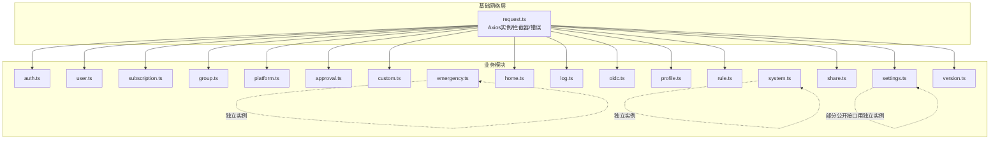
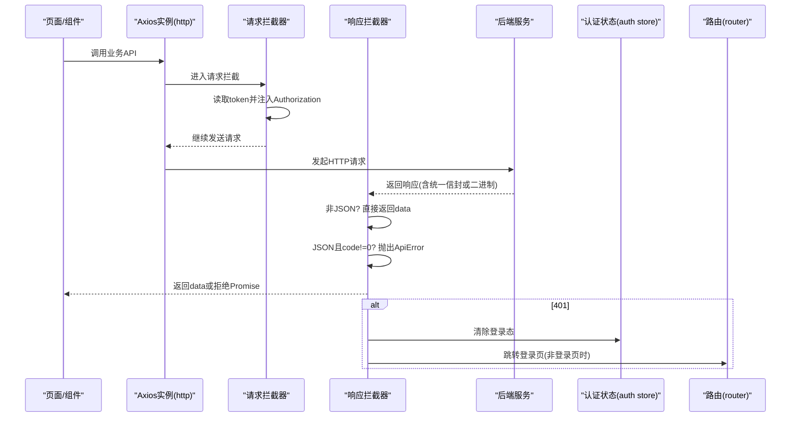
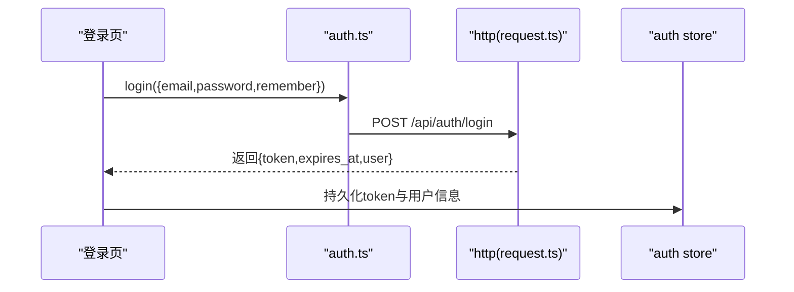
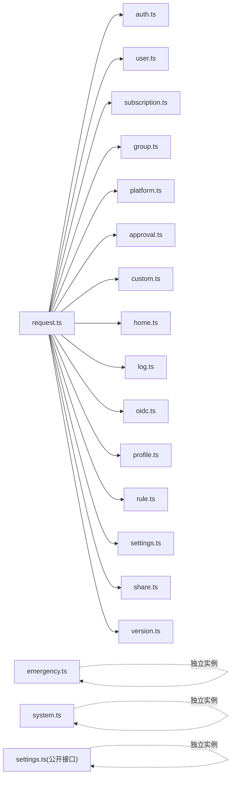

# API集成

<cite>
**本文引用的文件**
- [frontend/src/api/request.ts](file://frontend/src/api/request.ts)
- [frontend/src/api/auth.ts](file://frontend/src/api/auth.ts)
- [frontend/src/api/user.ts](file://frontend/src/api/user.ts)
- [frontend/src/api/subscription.ts](file://frontend/src/api/subscription.ts)
- [frontend/src/api/group.ts](file://frontend/src/api/group.ts)
- [frontend/src/api/platform.ts](file://frontend/src/api/platform.ts)
- [frontend/src/api/approval.ts](file://frontend/src/api/approval.ts)
- [frontend/src/api/custom.ts](file://frontend/src/api/custom.ts)
- [frontend/src/api/emergency.ts](file://frontend/src/api/emergency.ts)
- [frontend/src/api/home.ts](file://frontend/src/api/home.ts)
- [frontend/src/api/log.ts](file://frontend/src/api/log.ts)
- [frontend/src/api/oidc.ts](file://frontend/src/api/oidc.ts)
- [frontend/src/api/profile.ts](file://frontend/src/api/profile.ts)
- [frontend/src/api/rule.ts](file://frontend/src/api/rule.ts)
- [frontend/src/api/settings.ts](file://frontend/src/api/settings.ts)
- [frontend/src/api/share.ts](file://frontend/src/api/share.ts)
- [frontend/src/api/system.ts](file://frontend/src/api/system.ts)
- [frontend/src/api/version.ts](file://frontend/src/api/version.ts)
</cite>

## 目录
1. [简介](#简介)
2. [项目结构](#项目结构)
3. [核心组件](#核心组件)
4. [架构总览](#架构总览)
5. [详细组件分析](#详细组件分析)
6. [依赖关系分析](#依赖关系分析)
7. [性能与可靠性](#性能与可靠性)
8. [故障排查指南](#故障排查指南)
9. [结论](#结论)
10. [附录](#附录)

## 简介
本文件面向前端开发者，系统化说明本项目的前端API集成方案：以Axios为核心的HTTP请求封装、统一拦截器机制、错误处理策略；按业务模块组织API接口（认证、用户管理、订阅管理、平台管理、规则、分享、设置、日志、应急恢复等）；并覆盖文件上传下载、公开接口、版本管理等高级能力。文档同时给出开发期工具链建议（Mock、测试、版本管理），帮助团队高效协作与稳定交付。

## 项目结构
前端API层位于 frontend/src/api，采用“基础网络层 + 业务模块”的分层组织方式：
- 基础网络层：request.ts 提供统一的Axios实例、请求/响应拦截器、错误处理与UI提示。
- 业务模块：每个ts文件对应一个业务域（如auth、user、subscription、platform等），仅暴露方法，不关心网络细节。
- 特殊场景：emergency.ts、system.ts、settings.ts中的公开接口使用独立axios实例，避免鉴权拦截干扰。

图表来源
- [frontend/src/api/request.ts:1-89](file://frontend/src/api/request.ts#L1-L89)
- [frontend/src/api/emergency.ts:1-33](file://frontend/src/api/emergency.ts#L1-L33)
- [frontend/src/api/system.ts:1-8](file://frontend/src/api/system.ts#L1-L8)
- [frontend/src/api/settings.ts:91-105](file://frontend/src/api/settings.ts#L91-L105)

章节来源
- [frontend/src/api/request.ts:1-89](file://frontend/src/api/request.ts#L1-L89)

## 核心组件
- Axios实例与全局配置
  - baseURL统一为/api，超时时间默认15秒。
  - 所有业务模块通过http导入该实例，保证一致的网络行为。
- 请求拦截器
  - 自动从本地存储读取token并注入Authorization头，实现无感鉴权。
- 响应拦截器
  - 非JSON响应（如blob下载、文本预览）直接返回原始data，跳过统一解包。
  - JSON响应按统一信封结构解包：code=0视为成功，否则抛出ApiError；调用方直接拿到data字段。
  - 401时清除登录态并跳转登录页（登录页自身401不重复跳转）。
- 错误处理
  - ApiError携带HTTP状态码，便于页面区分表单级错误与全局提示。
  - handleApiError将常见状态码映射为用户友好的中文提示，支持429的Retry-After文案。
- 特殊实例
  - emergency.ts：独立axios实例，baseURL为/api/emergency，不走401拦截，适合无会话的应急流程。
  - system.ts：独立axios实例访问系统状态，避免鉴权影响。
  - settings.ts：部分公开配置接口使用独立axios实例，无需登录即可获取。

章节来源
- [frontend/src/api/request.ts:1-89](file://frontend/src/api/request.ts#L1-L89)
- [frontend/src/api/emergency.ts:1-33](file://frontend/src/api/emergency.ts#L1-L33)
- [frontend/src/api/system.ts:1-8](file://frontend/src/api/system.ts#L1-L8)
- [frontend/src/api/settings.ts:91-105](file://frontend/src/api/settings.ts#L91-L105)

## 架构总览
下图展示了典型请求生命周期：发起请求→注入凭据→服务端处理→响应解包→错误统一处理→UI反馈。

图表来源
- [frontend/src/api/request.ts:1-89](file://frontend/src/api/request.ts#L1-L89)

## 详细组件分析

### 认证模块（auth.ts）
- 功能范围：注册、登录、当前用户信息、登出、忘记密码、重置密码。
- 数据契约：
  - 登录返回包含token、过期时间与用户信息。
  - 注册可能返回待审核状态或管理员标识。
- 鉴权流程：
  - 登录成功后由上层store保存token；后续请求经请求拦截器自动携带。
  - 401时统一清理并跳转登录。

图表来源
- [frontend/src/api/auth.ts:1-28](file://frontend/src/api/auth.ts#L1-L28)
- [frontend/src/api/request.ts:1-89](file://frontend/src/api/request.ts#L1-L89)

章节来源
- [frontend/src/api/auth.ts:1-28](file://frontend/src/api/auth.ts#L1-L28)

### 用户管理模块（user.ts）
- 功能范围：分页查询用户列表、创建/更新/删除用户、角色变更、令牌撤销、密码重置、OIDC绑定清理、批量发送密码链接、状态切换。
- 数据契约：
  - 列表接口返回{list,total}，调用方取list/total进行分页展示。
  - 用户对象包含组、来源、状态、是否绑定OIDC等元信息。

章节来源
- [frontend/src/api/user.ts:1-42](file://frontend/src/api/user.ts#L1-L42)

### 订阅管理模块（subscription.ts）
- 功能范围：列出平台下的订阅池、创建/更新/删除订阅、校验slug可用性。
- 数据契约：
  - listSubscriptions返回{list,total}，并进一步解包为数组供列表渲染。
  - 订阅项包含slug、名称、平台、当前版本、被选中的组数等。

章节来源
- [frontend/src/api/subscription.ts:1-35](file://frontend/src/api/subscription.ts#L1-L35)

### 用户组模块（group.ts）
- 功能范围：列出组、获取组详情（含选择集合）、创建/更新/删除组、批量设置选择。
- 数据契约：
  - getGroup返回嵌套结构{group,selections}，在接口层解包为扁平对象，避免调用方误用undefined。
  - 组详情包含子资源计数与是否需要重新选择的标记。

章节来源
- [frontend/src/api/group.ts:1-36](file://frontend/src/api/group.ts#L1-L36)

### 平台管理模块（platform.ts）
- 功能范围：平台CRUD、安装程序上传与删除、级联统计。
- 高级能力：
  - 文件上传：使用FormData与onUploadProgress回调上报进度百分比。
  - 删除安装程序：支持一键清理。

章节来源
- [frontend/src/api/platform.ts:1-41](file://frontend/src/api/platform.ts#L1-L41)

### 审批中心（approval.ts）
- 功能范围：待审用户列表、单个批准/拒绝、批量批准。
- 数据契约：
  - 列表返回{list,total}，支持分页参数。

章节来源
- [frontend/src/api/approval.ts:1-20](file://frontend/src/api/approval.ts#L1-L20)

### 自定义订阅（custom.ts）
- 功能范围：为指定用户新增/更新自定义订阅（文件或文本模式）、删除。
- 数据契约：
  - upsertCustomText支持mode=text的文本模式提交。

章节来源
- [frontend/src/api/custom.ts:1-19](file://frontend/src/api/custom.ts#L1-L19)

### 应急恢复（emergency.ts）
- 功能范围：验证码校验、管理员密码重置、系统重新初始化。
- 设计要点：
  - 独立axios实例，baseURL=/api/emergency，不走401拦截，适用于无会话场景。
  - 统一解包逻辑unwrap确保错误可感知。

章节来源
- [frontend/src/api/emergency.ts:1-33](file://frontend/src/api/emergency.ts#L1-L33)

### 首页数据（home.ts）
- 功能范围：获取平台卡片列表、刷新下载token、获取更新时间。
- 数据契约：
  - 平台卡片包含下载URL、状态、可选的管理员池内订阅列表等。

章节来源
- [frontend/src/api/home.ts:1-32](file://frontend/src/api/home.ts#L1-L32)

### 日志模块（log.ts）
- 功能范围：访问日志查询与清空、实时日志流短期Token申请。
- 数据契约：
  - 访问日志条目包含用户、IP、下载类型、状态、失败原因等。
  - 流式日志需先申请短期token再建立连接。

章节来源
- [frontend/src/api/log.ts:1-29](file://frontend/src/api/log.ts#L1-L29)

### OIDC模块（oidc.ts）
- 功能范围：OIDC连通性测试、配置下发、模拟登录、绑定入口。
- 适用场景：管理员配置OIDC前后验证连通性，以及用户侧绑定账号。

章节来源
- [frontend/src/api/oidc.ts:1-11](file://frontend/src/api/oidc.ts#L1-L11)

### 个人中心（profile.ts）
- 功能范围：修改用户名、邮箱、密码。
- 安全注意：修改敏感信息需遵循后端校验与提示。

章节来源
- [frontend/src/api/profile.ts:1-8](file://frontend/src/api/profile.ts#L1-L8)

### 规则模块（rule.ts）
- 功能范围：管理端规则CRUD、刷新共享Token、用户端规则列表与预览。
- 高级能力：
  - 预览接口返回纯文本，使用responseType='text'绕过统一JSON解包。

章节来源
- [frontend/src/api/rule.ts:1-27](file://frontend/src/api/rule.ts#L1-L27)

### 设置模块（settings.ts）
- 功能范围：OIDC、本地认证、验证码、SMTP、站点信息、限流、日志级别、公告/页脚、调试开关、配置导入导出、备份下载、一键清空。
- 高级能力：
  - 公开接口：站点信息与公告/页脚使用独立axios实例，无需登录。
  - 文件操作：导出配置与备份下载返回Blob，需浏览器端处理下载。
  - Setup导入：未配置状态下可用，受IP限流保护。

章节来源
- [frontend/src/api/settings.ts:1-105](file://frontend/src/api/settings.ts#L1-L105)

### 分享订阅（share.ts）
- 功能范围：分享列表、创建/重命名/删除、刷新/吊销Token。
- 数据契约：
  - 分享项包含token状态与有效期相关字段。

章节来源
- [frontend/src/api/share.ts:1-21](file://frontend/src/api/share.ts#L1-L21)

### 系统状态（system.ts）
- 功能范围：获取系统状态，用于守卫判断。
- 设计要点：
  - 独立axios实例，避免鉴权拦截影响健康检查类接口。

章节来源
- [frontend/src/api/system.ts:1-8](file://frontend/src/api/system.ts#L1-L8)

### 通用版本管理（version.ts）
- 功能范围：对四类资源复用同一套版本操作（列表、创建、切换、预览、删除），通过前缀参数化适配不同资源。
- 高级能力：
  - 文本模式创建需附加查询参数mode=text；文件上传使用FormData。
  - 预览接口返回文本，使用responseType='text'。

章节来源
- [frontend/src/api/version.ts:1-31](file://frontend/src/api/version.ts#L1-L31)

## 依赖关系分析
- request.ts是基础设施，被所有业务模块依赖。
- 业务模块之间相互独立，仅通过http实例交互后端。
- 特殊模块（emergency、system、settings部分）引入独立axios实例，避免全局拦截器影响。

图表来源
- [frontend/src/api/request.ts:1-89](file://frontend/src/api/request.ts#L1-L89)
- [frontend/src/api/emergency.ts:1-33](file://frontend/src/api/emergency.ts#L1-L33)
- [frontend/src/api/system.ts:1-8](file://frontend/src/api/system.ts#L1-L8)
- [frontend/src/api/settings.ts:91-105](file://frontend/src/api/settings.ts#L91-L105)

章节来源
- [frontend/src/api/request.ts:1-89](file://frontend/src/api/request.ts#L1-L89)

## 性能与可靠性
- 超时控制：默认15秒超时，可根据接口特性在调用处覆盖。
- 缓存策略：当前未内置请求缓存。建议在业务层按需实现（如基于内存Map+TTL的轻量缓存），对高频只读接口（如平台列表、公告）生效。
- 重试机制：当前未内置重试。可在拦截器中针对幂等GET请求增加指数退避重试，或结合业务重试按钮。
- 并发限制：可通过请求队列或节流策略限制同域名并发数，避免雪崩。
- 大文件传输：上传使用FormData与onUploadProgress，下载使用Blob responseType，已具备基础能力。
- 错误降级：handleApiError提供统一提示，429支持Retry-After文案；401自动清理并跳转。

[本节为通用指导，不直接分析具体文件]

## 故障排查指南
- 401未登录或令牌过期
  - 现象：跳转到登录页，控制台输出诊断日志。
  - 排查：确认本地token是否存在；检查请求是否携带Authorization；核对后端鉴权逻辑。
- 429频繁操作
  - 现象：提示等待若干秒后重试。
  - 排查：查看后端限流配置；前端减少重复提交或增加防抖。
- 400输入校验失败
  - 现象：message.error提示，表单定位优先。
  - 排查：对照后端校验规则修正表单；必要时打印入参与错误消息。
- 409数据冲突
  - 现象：提示刷新后重试。
  - 排查：刷新列表后重试操作；检查唯一性约束。
- 500服务器内部错误
  - 现象：通用错误提示。
  - 排查：查看后端日志；复现步骤最小化；临时降级或回滚。
- 文件上传/下载异常
  - 上传：检查Content-Type是否为multipart/form-data；确认onUploadProgress回调触发。
  - 下载：确认responseType为blob；浏览器下载触发是否正常。

章节来源
- [frontend/src/api/request.ts:1-89](file://frontend/src/api/request.ts#L1-L89)
- [frontend/src/api/platform.ts:30-41](file://frontend/src/api/platform.ts#L30-L41)
- [frontend/src/api/settings.ts:97-105](file://frontend/src/api/settings.ts#L97-L105)

## 结论
本项目通过统一的Axios实例与拦截器实现了鉴权注入、统一解包与集中错误处理；各业务模块职责清晰、接口契约明确；针对文件上传下载、公开接口、应急恢复等场景提供了专用实现。建议在现有基础上按需补充缓存与重试机制，进一步提升用户体验与系统韧性。

[本节为总结性内容，不直接分析具体文件]

## 附录

### 开发工具链建议
- Mock数据
  - 使用Vite插件或本地代理在开发环境拦截/api/*，返回固定JSON或延迟响应，加速联调。
- 接口测试
  - 使用单元测试框架对request.ts与业务模块进行断言，覆盖401/429/500等分支。
- 版本管理
  - 通过version.ts抽象版本操作，配合后端版本表实现灰度发布与回滚。
- 文档同步
  - 保持API注释与前端类型定义同步，借助IDE提示降低沟通成本。

[本节为通用建议，不直接分析具体文件]