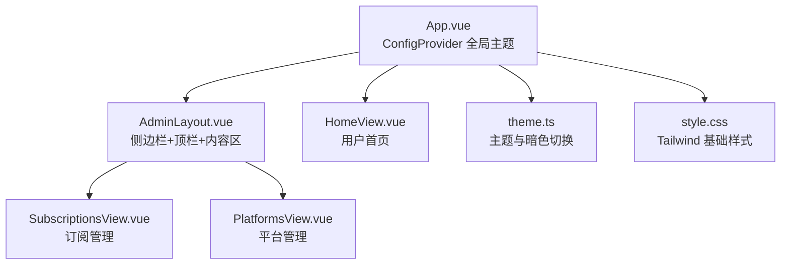
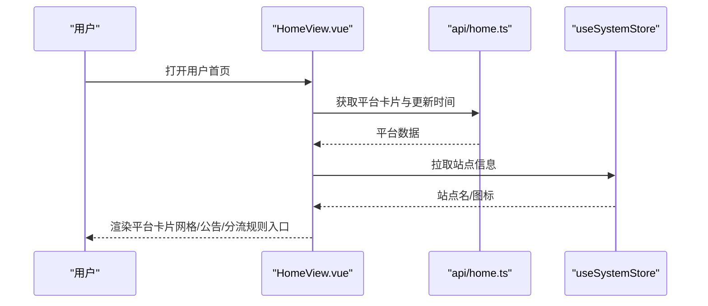
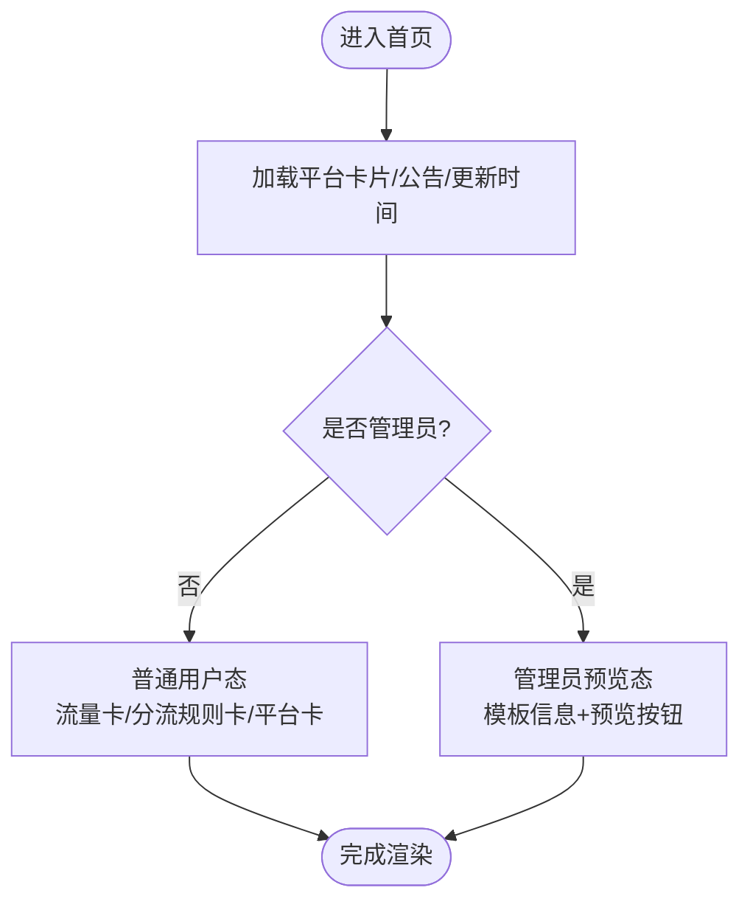
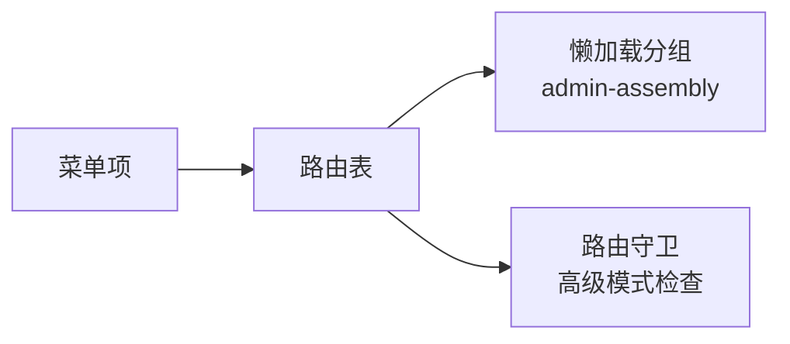
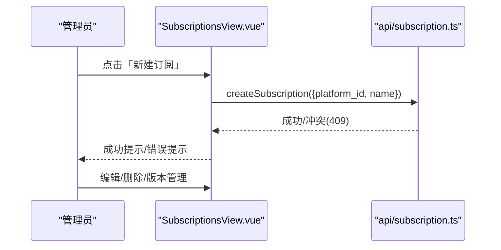
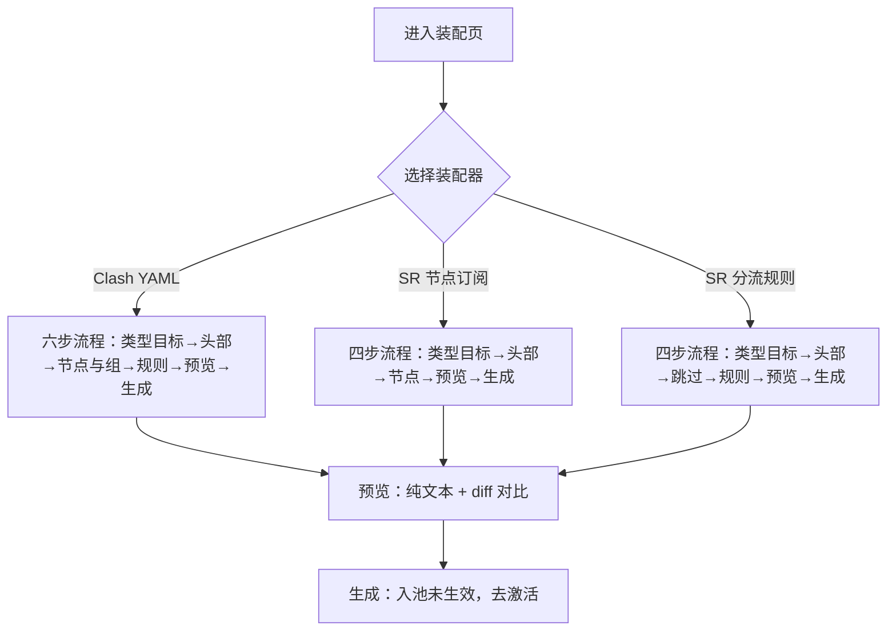
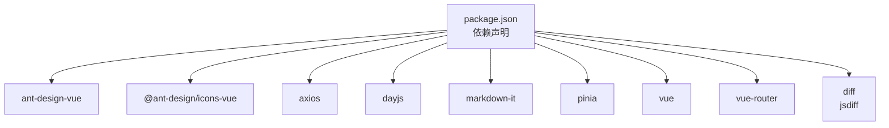

# 设计2 UI设计规范

<cite>
**本文引用的文件**
- [Design2-UI.md](file://Design2-UI.md)
- [Design2.md](file://Design2.md)
- [Design1-UI.md](file://docs/AchievedDocuments/Design1-UI.md)
- [theme.ts](file://frontend/src/theme.ts)
- [style.css](file://frontend/src/style.css)
- [App.vue](file://frontend/src/App.vue)
- [AdminLayout.vue](file://frontend/src/layouts/AdminLayout.vue)
- [HomeView.vue](file://frontend/src/views/HomeView.vue)
- [SubscriptionsView.vue](file://frontend/src/views/admin/SubscriptionsView.vue)
- [PlatformsView.vue](file://frontend/src/views/admin/PlatformsView.vue)
- [package.json](file://frontend/package.json)
</cite>

## 目录
1. [引言](#引言)
2. [项目结构](#项目结构)
3. [核心组件](#核心组件)
4. [架构总览](#架构总览)
5. [详细组件分析](#详细组件分析)
6. [依赖分析](#依赖分析)
7. [性能考虑](#性能考虑)
8. [故障排查指南](#故障排查指南)
9. [结论](#结论)
10. [附录](#附录)

## 引言
本规范承接 Design2.md 的增量能力（规则素材池、装配拼接与 Xray 对接），对受影响的全部界面给出可落地的 GUI 样式规格：布局结构、Ant Design Vue 组件映射、状态分支、关键交互与响应式规则。本文档为全量重写式自包含文档，不与存档的 Design1-UI.md 做增量拼接；Design1-UI.md 冻结不回写。范围红线：仅覆盖 UI 层、前端实现与前后端连接契约（端点形状/字段/轮询协议）；功能行为以 Design2.md 为准。

## 项目结构
- 前端采用 Vue 3 + Ant Design Vue + Tailwind CSS；主题通过 ConfigProvider 全局注入中文与主色，暗色模式由 useTheme composable 管理并持久化到 localStorage。
- 管理面板使用侧边栏 + 顶栏 + 内容区布局；移动端 Drawer 抽屉菜单，锁背景滚动。
- 用户首页按平台卡片网格展示，新增流量卡片与分流规则卡片。
- 新增路由与菜单项：订阅装配、节点管理、代理组管理、Xray 实例（高级模式）。

**图表来源**
- [App.vue:1-43](file://frontend/src/App.vue#L1-L43)
- [AdminLayout.vue:1-130](file://frontend/src/layouts/AdminLayout.vue#L1-L130)
- [HomeView.vue:1-231](file://frontend/src/views/HomeView.vue#L1-L231)
- [SubscriptionsView.vue:1-188](file://frontend/src/views/admin/SubscriptionsView.vue#L1-L188)
- [PlatformsView.vue:1-150](file://frontend/src/views/admin/PlatformsView.vue#L1-L150)
- [theme.ts:1-27](file://frontend/src/theme.ts#L1-L27)
- [style.css:1-16](file://frontend/src/style.css#L1-L16)

**章节来源**
- [App.vue:1-43](file://frontend/src/App.vue#L1-L43)
- [AdminLayout.vue:1-130](file://frontend/src/layouts/AdminLayout.vue#L1-L130)
- [HomeView.vue:1-231](file://frontend/src/views/HomeView.vue#L1-L231)
- [theme.ts:1-27](file://frontend/src/theme.ts#L1-L27)
- [style.css:1-16](file://frontend/src/style.css#L1-L16)

## 核心组件
- 通用顶栏 AppHeader：站点 ICON/名称、更新时间戳、管理面板入口、用户名 Dropdown、暗色切换开关。
- 三态列表 TriStateList：加载中 Skeleton / 空 Empty+引导 / 错误重试。
- 确认弹窗 ConfirmModal：统一危险操作二次确认。
- 通知封装 Notify：message/notification 统一调用。
- MarkdownView：公开公告/页脚 Markdown 渲染（html:false）。
- 新增 DiffView：文本差异视图（jsdiff 行级三色高亮，等宽字体、纵向滚动容器）。
- 拖拽排序交互：桌面端拖拽手柄，<768 降级为「上移/下移」按钮。
- pollTask 轮询任务封装：异步任务提交 → 间隔轮询 → 终态返回结果；卸载自动取消。

**章节来源**
- [Design2-UI.md:25-51](file://Design2-UI.md#L25-L51)
- [Design1-UI.md:45-55](file://docs/AchievedDocuments/Design1-UI.md#L45-L55)

## 架构总览
- 页面骨架：管理面板（Sider + Header + Content）、用户端（顶栏 + 主体卡片）。
- 路由与菜单：新增订阅装配、节点、代理组、Xray 实例；高级模式驱动显隐。
- 数据流：前端通过 api/* 模块调用后端端点；长任务使用 pollTask 轮询；超时与失败有兜底文案。
- 主题与国际化：ConfigProvider 全局 zh_CN，主色 #1677FF；暗色模式随 ConfigProvider 联动。

**图表来源**
- [HomeView.vue:1-231](file://frontend/src/views/HomeView.vue#L1-L231)
- [App.vue:1-43](file://frontend/src/App.vue#L1-L43)

**章节来源**
- [Design2-UI.md:54-108](file://Design2-UI.md#L54-L108)
- [Design2-UI.md:467-552](file://Design2-UI.md#L467-L552)

## 详细组件分析

### 用户首页（改造）
- 卡片堆叠顺序：流量卡片 → 分流规则卡片 → 平台卡片网格 → 公告栏卡片。
- 流量卡片：基础模式显示「不限流量」；高级模式显示已用/配额进度条，超限红色提示；受面板配置「流量卡片」开关控制。
- 分流规则卡片：全体用户可见，展示默认规则版本信息与复制链接；空态提示管理员暂未设置。
- 平台卡片：普通用户三态（一键导入/复制链接/刷新链接）；管理员预览形态（模板信息 + 按平台预览当前版本）。

**图表来源**
- [HomeView.vue:1-231](file://frontend/src/views/HomeView.vue#L1-L231)
- [Design2-UI.md:114-170](file://Design2-UI.md#L114-L170)

**章节来源**
- [Design2-UI.md:114-170](file://Design2-UI.md#L114-L170)

### 管理面板布局与路由骨架（增量）
- 侧边栏菜单新增：订阅装配、节点、代理组、Xray 实例（高级模式）。
- 路由表新增三行并迁组一行；懒加载分组调整至 admin-assembly。
- 路由守卫：高级模式未开启时访问高级路由重定向并提示。

**图表来源**
- [AdminLayout.vue:1-130](file://frontend/src/layouts/AdminLayout.vue#L1-L130)
- [Design2-UI.md:54-108](file://Design2-UI.md#L54-L108)

**章节来源**
- [Design2-UI.md:54-108](file://Design2-UI.md#L54-L108)

### 订阅管理（改造）
- 列表页改为平铺双态列表（不再按平台分组折叠）；列含平台名称、product_type、内容形态、当前版本、操作。
- 新建订阅弹窗：平台选择 + 名称；被占用平台禁用并标注「已有订阅」。
- 编辑弹窗：仅名称修改；组关联多选移除。
- 「已入池未生效」引导：行内高亮 + 快捷激活链接。
- 装配入口：PageHeader 右侧「前往装配」按钮。

**图表来源**
- [SubscriptionsView.vue:1-188](file://frontend/src/views/admin/SubscriptionsView.vue#L1-L188)
- [Design2-UI.md:177-184](file://Design2-UI.md#L177-L184)

**章节来源**
- [Design2-UI.md:177-184](file://Design2-UI.md#L177-L184)
- [SubscriptionsView.vue:1-188](file://frontend/src/views/admin/SubscriptionsView.vue#L1-L188)

### 平台管理（改造）
- 列表新增 product_type 列；新建平台表单新增 product_type 单选（yaml/subs，默认 yaml）。
- 平台编辑页：product_type 可校正；若与既有订阅条目不一致则拒绝并提示。
- 删除 ConfirmModal 影响清单沿用。

**章节来源**
- [Design2-UI.md:214-219](file://Design2-UI.md#L214-L219)
- [PlatformsView.vue:1-150](file://frontend/src/views/admin/PlatformsView.vue#L1-L150)

### 订阅装配页（占位页 → 实现）
- 单菜单入口页内 Tabs：规则素材池 / Clash YAML / SR 节点订阅 / SR 分流规则。
- 三类装配器共用框架：步骤条形态（默认）与单页多分区形态切换；localStorage 记忆。
- 预览步：全文纯文本预览；可选与当前激活版本 diff 对比（jsdiff 行级三色高亮）。
- 重新编辑流：从版本入口载入快照，悬空引用标记并剔除后再生成新版本。

**图表来源**
- [Design2-UI.md:273-366](file://Design2-UI.md#L273-L366)

**章节来源**
- [Design2-UI.md:273-366](file://Design2-UI.md#L273-L366)

### 节点管理页（新独立菜单）
- 列表：节点名称、来源标签、协议、地址:端口、公共节点标记、启用开关、allocatable/missing 标注、操作。
- manual 节点新增/编辑：协议注册表动态表单；凭据字段脱敏输入；重名冲突 409。
- xray 节点只读为主：enabled/is_public 两开关 + 删除；缺失节点提供删除处置。

**章节来源**
- [Design2-UI.md:369-397](file://Design2-UI.md#L369-L397)

### 代理组管理页（新独立菜单）
- 列表：组名称、类型 Tag、组类型、成员摘要、启用勾选（预设组）、操作。
- 自建组创建/编辑：基本信息、节点引用（有序列表支持拖拽）、子组引用（DAG 环形校验）、保存约束。

**章节来源**
- [Design2-UI.md:400-426](file://Design2-UI.md#L400-L426)

### Xray 实例页（新独立菜单，仅高级模式）
- 实例列表：名称、slug、api_addr、enabled 开关、采集状态、操作。
- 节点检测：刷新节点回执（新增/更新/missing/撞名跳过）。
- 开始初始化：幂等批量初始化，计数回执。
- 账号对账：待补推/无头用户，一键补推/清理。

**章节来源**
- [Design2-UI.md:429-464](file://Design2-UI.md#L429-L464)

## 依赖分析
- 前端依赖：ant-design-vue、@ant-design/icons-vue、axios、dayjs、markdown-it、pinia、vue、vue-router。
- 新增依赖：diff（jsdiff）用于预览 diff。
- 主题与国际化：ConfigProvider 全局 zh_CN，主色 #1677FF；暗色模式通过 useTheme 管理。

**图表来源**
- [package.json:1-37](file://frontend/package.json#L1-L37)

**章节来源**
- [package.json:1-37](file://frontend/package.json#L1-L37)
- [Design2-UI.md:540-541](file://Design2-UI.md#L540-L541)

## 性能考虑
- 列表分页：素材池详情条目分页（默认 20 条/页），避免整表加载。
- 轮询优化：pollTask 支持网络抖动容忍（连续失败 3 次才报错），卸载自动取消。
- 渲染性能：预览产物纯文本渲染，避免引入重型编辑器；DiffView 行级高亮轻量实现。
- 主题切换：ConfigProvider 全局联动，无逐组件手工适配。

[本节为通用指导，不直接分析具体文件]

## 故障排查指南
- 同步失败：素材池同步失败回执展示原因（拉取失败/空响应/零条目保护/解析跳过行数）。
- 权限不足：高级模式未开启访问高级路由重定向并提示；后端 403 统一处理。
- 重复冲突：池名/节点名/平台订阅占用/实例名/代理组名 409 提示。
- 轮询超时：任务仍在后台执行，请稍后刷新查看结果。
- 移动端兼容：<768 表格卡片化，拖拽降级为「上移/下移」按钮。

**章节来源**
- [Design2-UI.md:542-552](file://Design2-UI.md#L542-L552)
- [Design2-UI.md:554-591](file://Design2-UI.md#L554-L591)

## 结论
本规范完整覆盖了 Design2 受影响界面的 GUI 样式规格，包括用户首页改造、管理面板增强、订阅装配实现、节点/代理组/Xray 管理等。通过统一的组件约定、响应式策略与前后端契约，确保实施一致性与可维护性。建议构建前核对空态、加载态、错误态与移动端兼容性，遵循 AGENTS.md 编码约束。

[本节为总结，不直接分析具体文件]

## 附录
- 全局风格基础：主色 #1677FF，浅色布局，暗色模式手动切换 + localStorage 持久化。
- 响应式断点：台式 ≥1200 / 平板 768~1199 / 手机 <768。
- 空状态文案：新增页面空态统一口径，见 Design2-UI §10.2。
- 错误码映射：对齐 AGENTS.md §4.8，沿用 Design1-UI §7.3 基线。

**章节来源**
- [Design2-UI.md:25-51](file://Design2-UI.md#L25-L51)
- [Design2-UI.md:554-591](file://Design2-UI.md#L554-L591)
- [Design1-UI.md:8-36](file://docs/AchievedDocuments/Design1-UI.md#L8-L36)