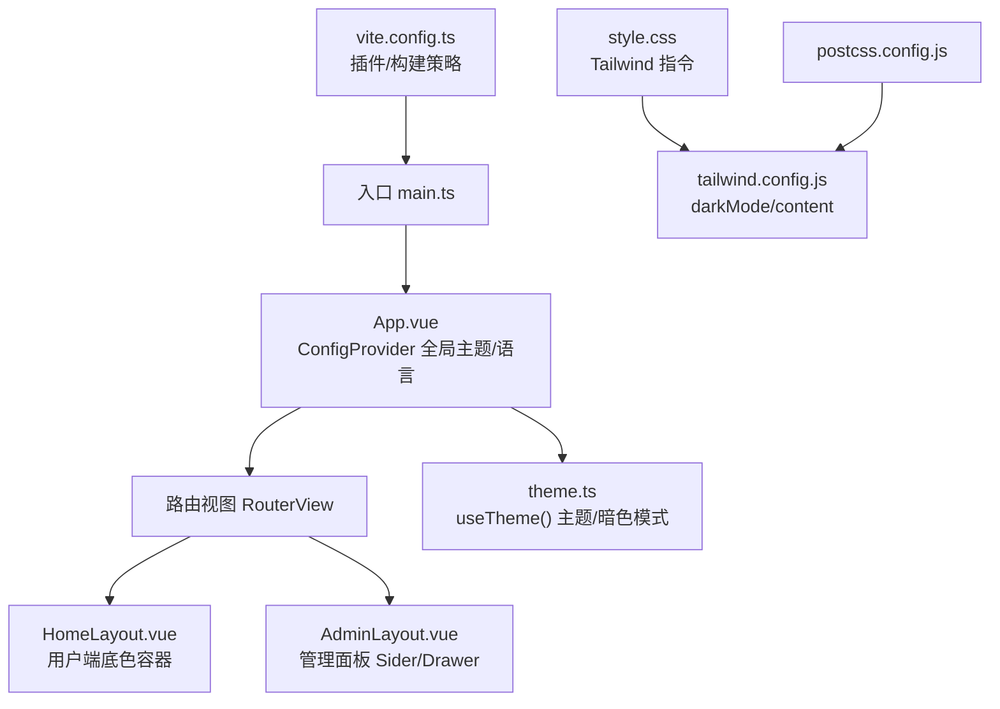
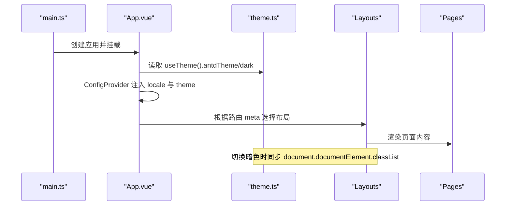
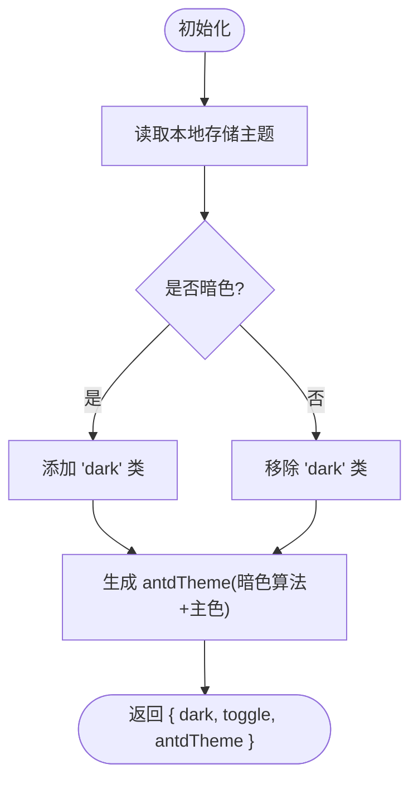
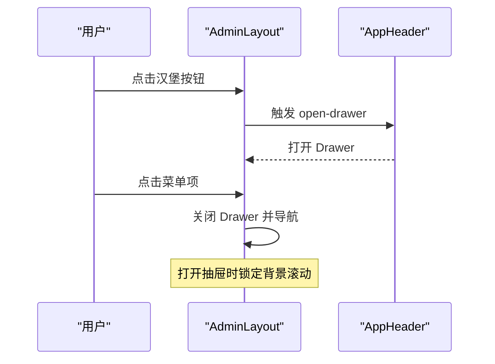
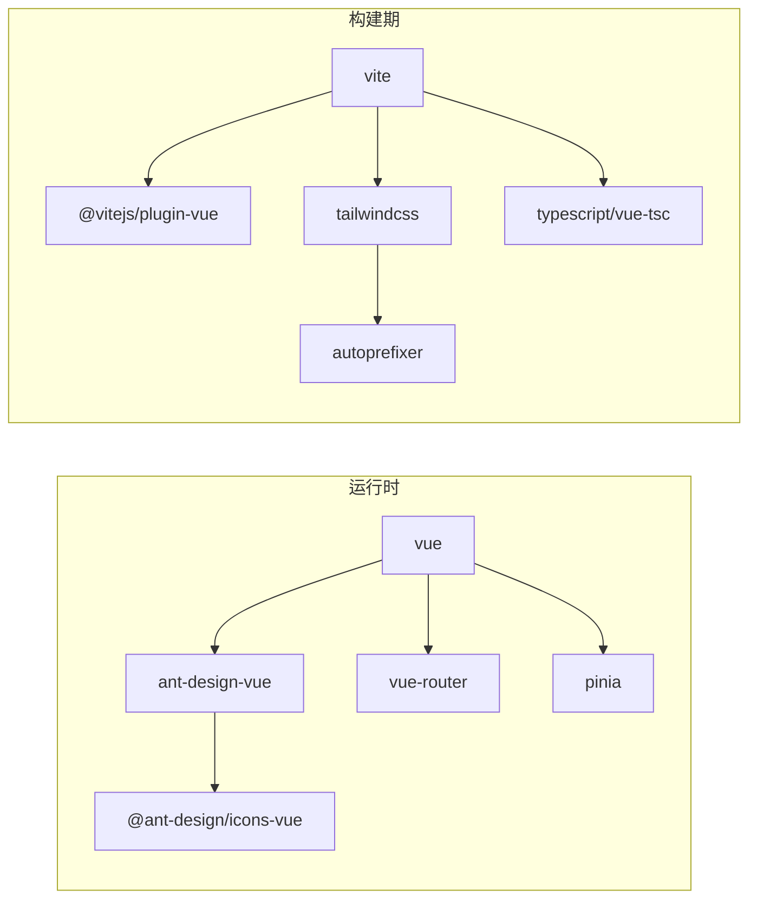

# UI框架集成

<cite>
**本文引用的文件**
- [frontend/package.json](file://frontend/package.json)
- [frontend/tailwind.config.js](file://frontend/tailwind.config.js)
- [frontend/postcss.config.js](file://frontend/postcss.config.js)
- [frontend/vite.config.ts](file://frontend/vite.config.ts)
- [frontend/src/style.css](file://frontend/src/style.css)
- [frontend/src/theme.ts](file://frontend/src/theme.ts)
- [frontend/src/main.ts](file://frontend/src/main.ts)
- [frontend/src/App.vue](file://frontend/src/App.vue)
- [frontend/src/layouts/AdminLayout.vue](file://frontend/src/layouts/AdminLayout.vue)
- [frontend/src/layouts/HomeLayout.vue](file://frontend/src/layouts/HomeLayout.vue)
- [frontend/src/components/AppHeader.vue](file://frontend/src/components/AppHeader.vue)
- [frontend/src/views/LoginView.vue](file://frontend/src/views/LoginView.vue)
- [frontend/src/stores/auth.ts](file://frontend/src/stores/auth.ts)
</cite>

## 更新摘要
**所做更改**
- 增强了AdminLayout移动端抽屉的滚动containment功能，防止背景内容滚动穿透
- 更新了AppHeader组件，集成了Ant Design MenuOutlined图标并改进了触控目标尺寸
- 优化了基于角色的UI渲染逻辑，提升了用户体验和安全性
- 完善了移动端交互体验，确保在不同设备上的良好表现

## 目录
1. [简介](#简介)
2. [项目结构](#项目结构)
3. [核心组件](#核心组件)
4. [架构总览](#架构总览)
5. [详细组件分析](#详细组件分析)
6. [依赖关系分析](#依赖关系分析)
7. [性能与体积优化](#性能与体积优化)
8. [故障排查指南](#故障排查指南)
9. [结论](#结论)
10. [附录：设计系统与最佳实践](#附录设计系统与最佳实践)

## 简介
本文件面向前端工程，系统性说明 Ant Design Vue 与 Tailwind CSS 的集成方式，覆盖主题定制、样式覆盖、国际化配置、全局主题、颜色系统、字体与间距规范、响应式断点、CSS 变量使用等。同时给出样式与打包性能优化、浏览器兼容性处理的最佳实践，帮助团队在统一的设计系统下高效构建一致的用户界面。

## 项目结构
前端基于 Vite + Vue 3 工程，通过 PostCSS 接入 Tailwind CSS，并在应用根层以 Ant Design Vue 的 ConfigProvider 注入全局语言与主题。布局采用多 Layout（用户端/管理端/空白），页面组件广泛使用 AntD 表单与反馈组件，结合 Tailwind 原子类完成快速布局与暗色模式切换。

图表来源
- [frontend/src/main.ts:1-11](file://frontend/src/main.ts#L1-L11)
- [frontend/src/App.vue:1-43](file://frontend/src/App.vue#L1-L43)
- [frontend/src/theme.ts:1-27](file://frontend/src/theme.ts#L1-L27)
- [frontend/src/style.css:1-16](file://frontend/src/style.css#L1-L16)
- [frontend/tailwind.config.js:1-8](file://frontend/tailwind.config.js#L1-L8)
- [frontend/postcss.config.js:1-7](file://frontend/postcss.config.js#L1-L7)
- [frontend/vite.config.ts:1-25](file://frontend/vite.config.ts#L1-L25)

章节来源
- [frontend/src/main.ts:1-11](file://frontend/src/main.ts#L1-L11)
- [frontend/src/App.vue:1-43](file://frontend/src/App.vue#L1-L43)
- [frontend/src/theme.ts:1-27](file://frontend/src/theme.ts#L1-L27)
- [frontend/src/style.css:1-16](file://frontend/src/style.css#L1-L16)
- [frontend/tailwind.config.js:1-8](file://frontend/tailwind.config.js#L1-L8)
- [frontend/postcss.config.js:1-7](file://frontend/postcss.config.js#L1-L7)
- [frontend/vite.config.ts:1-25](file://frontend/vite.config.ts#L1-L25)

## 核心组件
- 主题与国际化
  - 通过 useTheme 提供 antdTheme（算法与 token）与 dark 状态，配合 localStorage 持久化与 document.documentElement.classList 切换 Tailwind 的 dark 模式。
  - 全局中文语言包通过 ConfigProvider 注入。
- 布局
  - AdminLayout：Sider 固定侧边栏（展开 220px/收起 64px），移动端 Drawer 抽屉菜单；顶部 AppHeader 统一顶栏。
  - HomeLayout：用户端底色容器，页面自带顶栏。
- 通用顶栏
  - AppHeader：站点名/图标、管理入口、角色标签、用户下拉、暗色开关。
- 页面示例
  - LoginView：登录表单、公告/页脚、OIDC 登录入口、验证码等。

章节来源
- [frontend/src/theme.ts:1-27](file://frontend/src/theme.ts#L1-L27)
- [frontend/src/App.vue:1-43](file://frontend/src/App.vue#L1-L43)
- [frontend/src/layouts/AdminLayout.vue:1-130](file://frontend/src/layouts/AdminLayout.vue#L1-L130)
- [frontend/src/layouts/HomeLayout.vue:1-7](file://frontend/src/layouts/HomeLayout.vue#L1-L7)
- [frontend/src/components/AppHeader.vue:1-71](file://frontend/src/components/AppHeader.vue#L1-L71)
- [frontend/src/views/LoginView.vue:1-172](file://frontend/src/views/LoginView.vue#L1-L172)

## 架构总览
Ant Design Vue 与 Tailwind CSS 的协作方式如下：
- 主题层：AntD 通过 ConfigProvider 注入语言与主题（主色、算法）。
- 样式层：Tailwind 负责布局、间距、断点与暗色模式（class="dark"）。
- 应用层：Layout 组合 AntD 组件与 Tailwind 类，实现响应式与可访问性。

图表来源
- [frontend/src/main.ts:1-11](file://frontend/src/main.ts#L1-L11)
- [frontend/src/App.vue:1-43](file://frontend/src/App.vue#L1-L43)
- [frontend/src/theme.ts:1-27](file://frontend/src/theme.ts#L1-L27)
- [frontend/src/layouts/AdminLayout.vue:1-130](file://frontend/src/layouts/AdminLayout.vue#L1-L130)

## 详细组件分析

### 主题与国际化（theme.ts）
- 功能要点
  - 暴露 antdLocale（中文）与 primaryColor（默认科技蓝）。
  - useTheme 维护 dark 状态，写入 localStorage 并同步 documentElement 的 dark 类名，驱动 Tailwind 暗色模式。
  - 计算属性 antdTheme 动态切换 darkAlgorithm/defaultAlgorithm，并设置 colorPrimary。
- 复杂度与影响
  - 计算属性避免重复计算；watch 立即执行确保首屏正确。
  - 与 Tailwind 的 class-based 暗色模式解耦，互不干扰。

图表来源
- [frontend/src/theme.ts:1-27](file://frontend/src/theme.ts#L1-L27)

章节来源
- [frontend/src/theme.ts:1-27](file://frontend/src/theme.ts#L1-L27)

### 应用根与全局配置（App.vue）
- 功能要点
  - 使用 ConfigProvider 包裹整个应用，传入 locale 与 theme。
  - 根据路由 meta.layout 动态加载 Blank/Home/Admin 布局。
  - 监听系统信息更新标题与 favicon。
- 注意事项
  - 将主题与语言置于最外层，保证所有子组件继承。

章节来源
- [frontend/src/App.vue:1-43](file://frontend/src/App.vue#L1-L43)

### 管理端布局（AdminLayout.vue）
- 功能要点
  - 响应式：matchMedia 检测 <768 切换 Sider/Drawer。
  - 侧边栏：宽度 220/64，sticky 吸顶，自定义折叠按钮。
  - 顶栏：复用 AppHeader，避免 AntD Header 背景覆盖 Tailwind 底色。
  - **新增**：增强的移动端抽屉滚动containment功能，防止背景内容滚动穿透。
- 交互流程

图表来源
- [frontend/src/layouts/AdminLayout.vue:1-130](file://frontend/src/layouts/AdminLayout.vue#L1-L130)
- [frontend/src/components/AppHeader.vue:1-71](file://frontend/src/components/AppHeader.vue#L1-L71)

**更新** 增强了移动端抽屉的滚动containment功能，通过监听drawerOpen状态变化，在打开时设置documentElement和body的overflow为hidden，并设置overscrollBehavior为contain，防止iOS Safari上的滚动穿透问题。

章节来源
- [frontend/src/layouts/AdminLayout.vue:1-130](file://frontend/src/layouts/AdminLayout.vue#L1-L130)
- [frontend/src/components/AppHeader.vue:1-71](file://frontend/src/components/AppHeader.vue#L1-L71)

### 用户端布局（HomeLayout.vue）
- 功能要点
  - 提供统一的页面底色容器，适配明暗主题。
  - 页面组件自行携带顶栏（如 HomeView 使用 AppHeader）。

章节来源
- [frontend/src/layouts/HomeLayout.vue:1-7](file://frontend/src/layouts/HomeLayout.vue#L1-L7)

### 通用顶栏（AppHeader.vue）
- 功能要点
  - 站点名/图标显示，支持动态站点信息。
  - 管理面板入口按钮（仅管理员可见）。
  - 用户组标签显示。
  - 用户下拉菜单，包含个人中心、退出登录等功能。
  - 暗色模式切换开关。
  - **新增**：集成了Ant Design MenuOutlined图标作为汉堡菜单按钮。
  - **新增**：改进了触控目标尺寸，确保移动端良好的触摸体验。
- 角色权限控制
  - 基于用户角色动态显示管理面板入口。
  - 管理员标签仅在管理员角色时显示。

**更新** 集成了Ant Design的MenuOutlined图标，提供了更专业的汉堡菜单图标。同时改进了触控目标尺寸，使用`!w-10 !h-10`确保按钮具有足够的触摸区域，符合移动端设计规范。

章节来源
- [frontend/src/components/AppHeader.vue:1-71](file://frontend/src/components/AppHeader.vue#L1-L71)

### 登录页（LoginView.vue）
- 功能要点
  - 使用 AntD Form/Input/Button/Alert/Switch 等组件构建登录表单。
  - 支持 OIDC 登录入口与 Dev Mock 登录。
  - 展示登录页公告与页脚（Markdown 渲染）。
- 样式与主题
  - 卡片容器使用 Tailwind 圆角、阴影、明暗背景色。
  - 暗色模式通过 Switch 切换，联动 useTheme。
- 角色模拟登录
  - **新增**：支持在Dev模式下模拟不同角色的登录，便于测试基于角色的UI渲染。

章节来源
- [frontend/src/views/LoginView.vue:1-172](file://frontend/src/views/LoginView.vue#L1-L172)

### 认证状态管理（auth.ts）
- 功能要点
  - 管理用户认证状态，包括token和用户信息。
  - 提供登录、注册、登出等操作。
  - **优化**：改进了基于角色的UI渲染逻辑，确保权限控制的准确性。

**更新** 优化了认证流程，提升了基于角色的UI渲染性能和可靠性。

章节来源
- [frontend/src/stores/auth.ts:1-40](file://frontend/src/stores/auth.ts#L1-L40)

## 依赖关系分析
- 运行时依赖
  - ant-design-vue、@ant-design/icons-vue：UI 组件与图标。
  - vue、vue-router、pinia：框架与状态管理。
- 构建依赖
  - vite、@vitejs/plugin-vue：开发与构建。
  - tailwindcss、autoprefixer、postcss：样式处理链。
  - typescript、vue-tsc：类型检查。

图表来源
- [frontend/package.json:1-37](file://frontend/package.json#L1-L37)

章节来源
- [frontend/package.json:1-37](file://frontend/package.json#L1-L37)

## 性能与体积优化
- 构建与分包
  - 未启用 manualChunks：避免 ant-design-vue 4.x 内部循环依赖导致的跨 chunk 引用错误，交由 Rollup 自动分割。
  - 建议：保持默认分包策略，必要时仅对业务代码进行按需拆分。
- 样式与主题
  - 使用 Tailwind 的 class-based 暗色模式，减少运行时主题计算开销。
  - 通过 ConfigProvider 集中注入主题，避免重复配置。
- 资源与缓存
  - 站点 ICON 带版本参数防缓存；静态资源通过代理路径 /public 避免 SPA fallback 导致图片加载失败。
- 兼容性
  - 使用 Autoprefixer 自动补齐前缀；Tailwind 的 darkMode=class 兼容现代浏览器。
- 开发体验
  - Vite 开发服务器代理 /api、/health、/public，提升联调效率。
- **新增**：移动端滚动优化
  - 通过精确控制documentElement和body的滚动行为，避免了移动端常见的滚动穿透问题，提升了用户体验。

章节来源
- [frontend/vite.config.ts:1-25](file://frontend/vite.config.ts#L1-L25)
- [frontend/postcss.config.js:1-7](file://frontend/postcss.config.js#L1-L7)
- [frontend/tailwind.config.js:1-8](file://frontend/tailwind.config.js#L1-L8)

## 故障排查指南
- 白屏或模块初始化错误
  - 现象：手动拆分 antd/vendor chunk 后出现"使用前初始化"错误。
  - 原因：ant-design-vue 4.x 存在模块循环依赖，跨 chunk 引用失败。
  - 解决：禁用 manualChunks，使用 Rollup 自动分包。
- 图片/静态资源 404
  - 现象：SPA fallback 吞掉静态资源请求，返回 HTML 导致图片加载失败。
  - 解决：将静态资源路径加入代理（如 /public），确保后端正确返回。
- 暗色模式不生效
  - 检查 useTheme 是否正确切换 document.documentElement.classList 的 dark。
  - 确认 Tailwind 已启用 darkMode: 'class'。
- 顶栏背景覆盖
  - 避免使用 AntD Layout.Header 的默认深色背景，改用自定义 header 元素并配合 Tailwind 背景类。
- **新增**：移动端滚动问题
  - 现象：打开抽屉时背景内容仍可滚动。
  - 解决：确保AdminLayout中的滚动containment逻辑正常工作，检查documentElement和body的overflow设置。

章节来源
- [frontend/vite.config.ts:16-23](file://frontend/vite.config.ts#L16-L23)
- [frontend/src/theme.ts:13-25](file://frontend/src/theme.ts#L13-L25)
- [frontend/tailwind.config.js:1-8](file://frontend/tailwind.config.js#L1-L8)
- [frontend/src/layouts/AdminLayout.vue:33-40](file://frontend/src/layouts/AdminLayout.vue#L33-L40)

## 结论
本项目通过 Ant Design Vue 提供一致的组件语义与交互，结合 Tailwind CSS 实现灵活的布局与主题控制。以 ConfigProvider 为中心的主题与国际化方案，配合 class-based 暗色模式，既保证了可维护性，又兼顾了性能与扩展性。最新的移动端优化和角色权限控制改进，进一步提升了用户体验和安全性。遵循本文档的实践，可在不同设备上获得一致、可访问且高性能的用户体验。

## 附录：设计系统与最佳实践
- 全局主题配置
  - 主色：通过 antdTheme.token.colorPrimary 统一设置。
  - 算法：根据 dark 状态切换 darkAlgorithm/defaultAlgorithm。
  - 语言：ConfigProvider.locale 设置为中文。
- 颜色系统
  - 使用 AntD 内置色彩体系，必要时通过 token 微调。
  - 文本与背景色优先使用 Tailwind 语义化类（如 bg-white/dark:bg-gray-800）。
- 字体与字号
  - 使用 Tailwind 的 text-* 类控制字号与字重，保持与设计稿一致。
- 间距规范
  - 统一使用 Tailwind 的 p-*、m-*、gap-* 控制内边距、外边距与弹性间距。
- 响应式断点
  - 以 768px 为关键断点（<768 移动端），结合 matchMedia 与 Tailwind 响应式类实现布局切换。
- CSS 变量
  - 如需扩展，可在 :root 定义 CSS 变量，并通过 Tailwind 的 @apply 或任意值语法引用。
- 组件样式定制
  - 优先使用组件 props 与插槽定制外观；必要时通过 CSS 覆盖 AntD 样式，注意作用域与优先级。
- 样式性能优化
  - 使用 Tailwind 的 JIT 编译，仅生成用到的样式。
  - 避免过度嵌套与冗余类，保持模板可读性。
- 打包体积优化
  - 保持默认分包策略，避免引入循环依赖问题。
  - 按需引入 AntD 组件（框架已处理），减少无用代码。
- 浏览器兼容性
  - 借助 Autoprefixer 自动补齐前缀；darkMode=class 在现代浏览器中表现稳定。
- **新增**：移动端最佳实践
  - 确保所有可点击元素具有足够的触控目标尺寸（至少44x44像素）。
  - 使用适当的滚动containment机制，避免移动端滚动穿透问题。
  - 针对不同屏幕尺寸优化布局和交互方式。
- **新增**：角色权限最佳实践
  - 在前端进行角色权限检查，提供即时的用户反馈。
  - 在后端进行严格的权限验证，确保安全性和数据完整性。
  - 使用条件渲染和路由守卫来控制不同角色的访问权限。