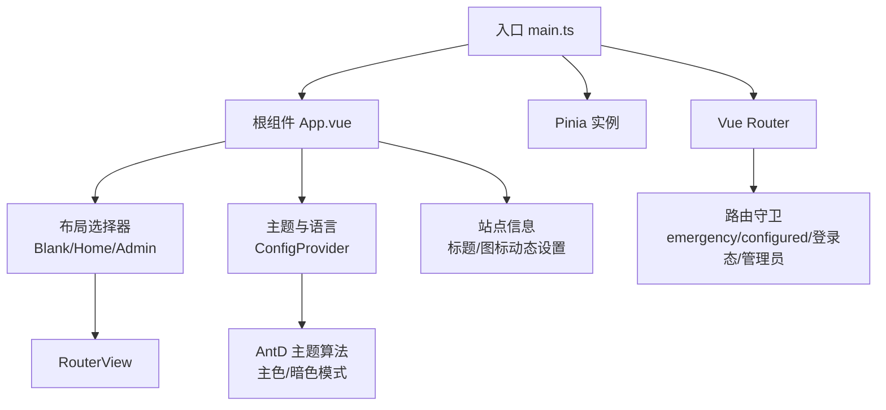
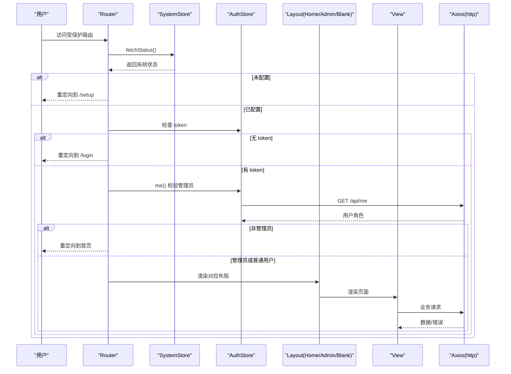
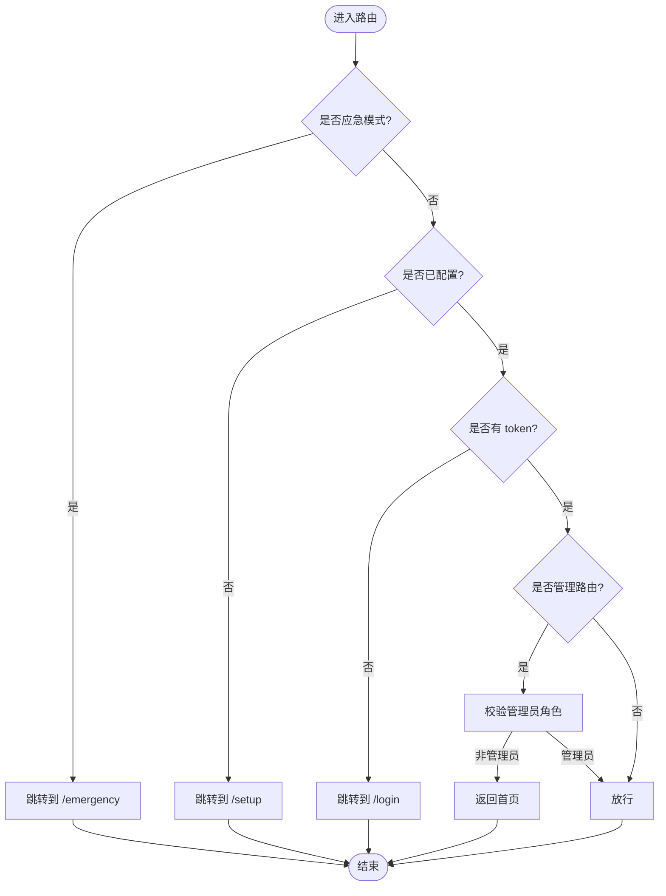
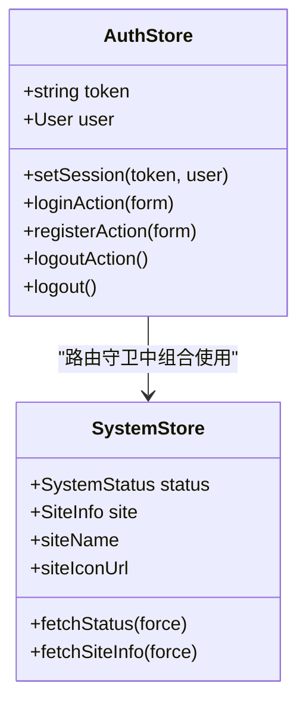
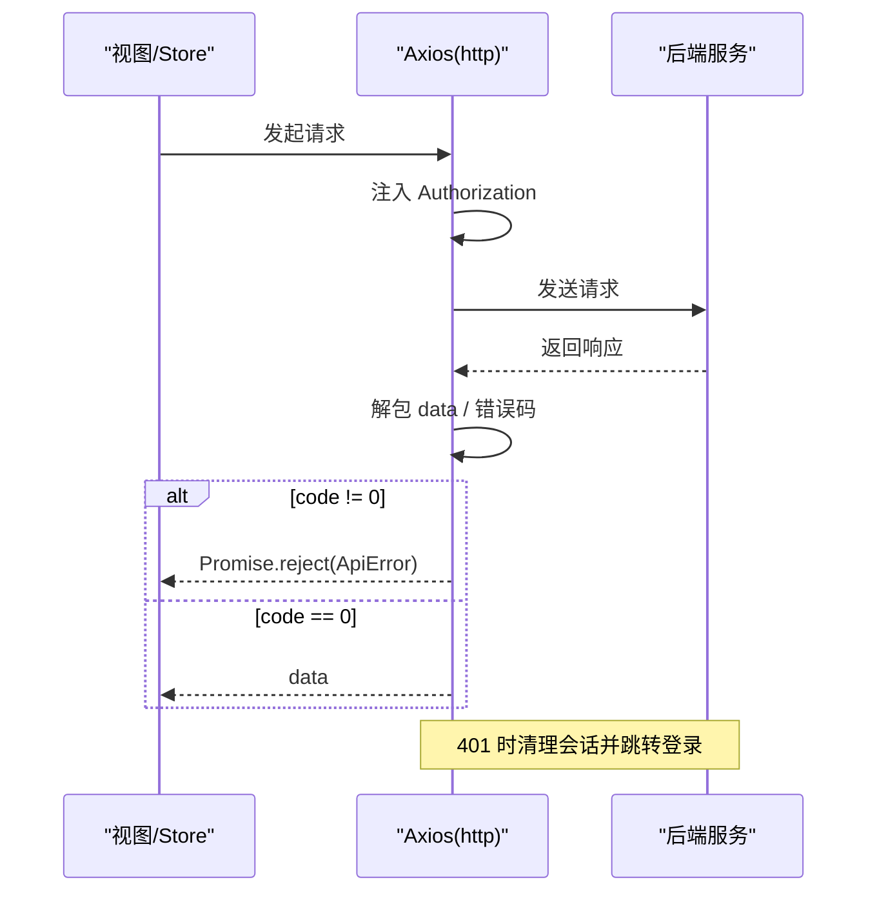
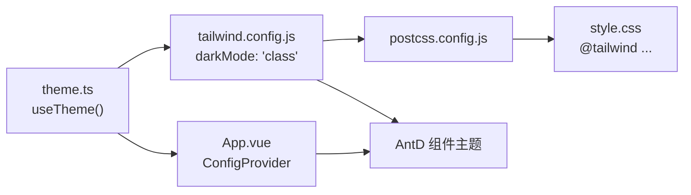
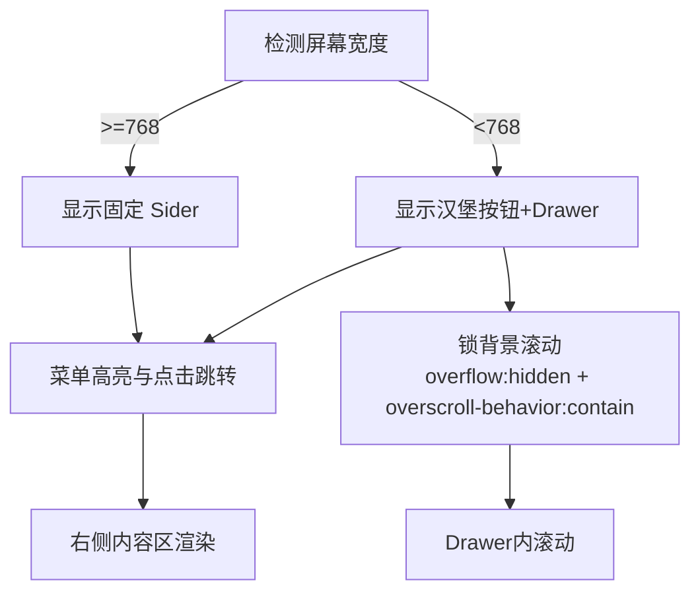
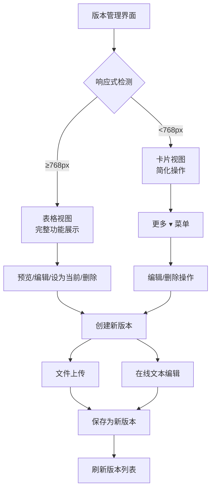
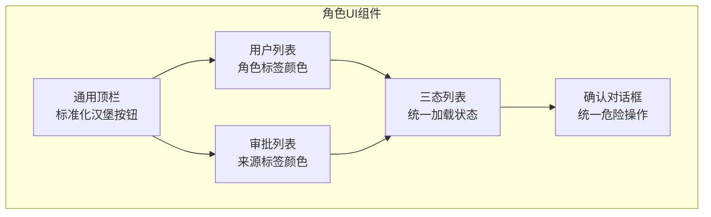
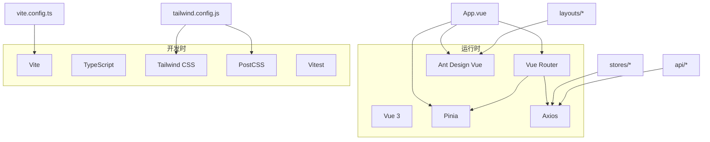

# 前端架构

<cite>
**本文引用的文件**
- [frontend/package.json](file://frontend/package.json)
- [frontend/src/main.ts](file://frontend/src/main.ts)
- [frontend/src/App.vue](file://frontend/src/App.vue)
- [frontend/vite.config.ts](file://frontend/vite.config.ts)
- [frontend/src/router/index.ts](file://frontend/src/router/index.ts)
- [frontend/src/stores/auth.ts](file://frontend/src/stores/auth.ts)
- [frontend/src/stores/system.ts](file://frontend/src/stores/system.ts)
- [frontend/src/theme.ts](file://frontend/src/theme.ts)
- [frontend/src/api/request.ts](file://frontend/src/api/request.ts)
- [frontend/tailwind.config.js](file://frontend/tailwind.config.js)
- [frontend/postcss.config.js](file://frontend/postcss.config.js)
- [frontend/src/layouts/AdminLayout.vue](file://frontend/src/layouts/AdminLayout.vue)
- [frontend/src/layouts/HomeLayout.vue](file://frontend/src/layouts/HomeLayout.vue)
- [frontend/src/components/AppHeader.vue](file://frontend/src/components/AppHeader.vue)
- [frontend/src/components/TriStateList.vue](file://frontend/src/components/TriStateList.vue)
- [frontend/src/components/ConfirmModal.vue](file://frontend/src/components/ConfirmModal.vue)
- [frontend/src/views/admin/VersionManageView.vue](file://frontend/src/views/admin/VersionManageView.vue)
- [frontend/src/views/admin/UsersView.vue](file://frontend/src/views/admin/UsersView.vue)
- [frontend/src/views/admin/ApprovalsView.vue](file://frontend/src/views/admin/ApprovalsView.vue)
- [frontend/src/views/admin/SubscriptionsView.vue](file://frontend/src/views/admin/SubscriptionsView.vue)
- [frontend/src/views/admin/GroupsView.vue](file://frontend/src/views/admin/GroupsView.vue)
- [frontend/src/views/admin/RulesView.vue](file://frontend/src/views/admin/RulesView.vue)
- [frontend/src/views/admin/PlatformsView.vue](file://frontend/src/views/admin/PlatformsView.vue)
- [frontend/src/style.css](file://frontend/src/style.css)
- [frontend/vitest.config.ts](file://frontend/vitest.config.ts)
</cite>

## 更新摘要
**变更内容**
- 确立了移动端响应式表格渲染的最终实现方案，采用逐页内联实现而非统一组件
- 使用 isMobile 检查与 matchMedia <768 条件渲染桌面表格或移动卡片布局
- 增强了版本管理界面的响应式布局和在线编辑功能
- 改进了移动端用户体验，优化了抽屉滚动行为和汉堡菜单交互模式
- 提升了角色基于UI组件的可访问性和视觉一致性
- 完善了响应式布局在不同设备上的表现，实现了表格和卡片双显示模式

## 目录
1. [简介](#简介)
2. [项目结构](#项目结构)
3. [核心组件](#核心组件)
4. [架构总览](#架构总览)
5. [详细组件分析](#详细组件分析)
6. [依赖关系分析](#依赖关系分析)
7. [性能考量](#性能考量)
8. [故障排查指南](#故障排查指南)
9. [结论](#结论)
10. [附录](#附录)

## 简介
本文件面向基于 Vue 3 + TypeScript 的前端工程，系统化阐述组件化设计、状态管理（Pinia）、路由与守卫、API 集成、UI 组件库（Ant Design Vue + Tailwind CSS）使用方式、主题定制与响应式适配、构建流程、开发环境配置与测试策略。文档以仓库实际代码为依据，提供可追溯的源码定位与可视化图示，帮助读者快速理解并高效扩展该前端应用。**最新版本重点确立了移动端响应式表格渲染的最终实现方案，通过逐页内联实现的方式，使用 isMobile 检查与 matchMedia <768 条件渲染桌面表格或移动卡片布局，大幅提升了移动端用户体验。**

## 项目结构
前端采用 Vite 作为构建工具，Vue 3 单文件组件组织业务视图，Pinia 管理全局状态，Vue Router 负责路由与权限守卫，Axios 封装 HTTP 请求与错误处理，Ant Design Vue 提供 UI 组件与主题能力，Tailwind CSS 提供原子化样式与暗色模式支持。

**图表来源**
- [frontend/src/main.ts:1-11](file://frontend/src/main.ts#L1-L11)
- [frontend/src/App.vue:1-43](file://frontend/src/App.vue#L1-L43)
- [frontend/src/router/index.ts:1-132](file://frontend/src/router/index.ts#L1-L132)
- [frontend/src/theme.ts:1-27](file://frontend/src/theme.ts#L1-L27)

**章节来源**
- [frontend/src/main.ts:1-11](file://frontend/src/main.ts#L1-L11)
- [frontend/src/App.vue:1-43](file://frontend/src/App.vue#L1-L43)
- [frontend/vite.config.ts:1-25](file://frontend/vite.config.ts#L1-L25)
- [frontend/tailwind.config.js:1-8](file://frontend/tailwind.config.js#L1-L8)
- [frontend/postcss.config.js:1-7](file://frontend/postcss.config.js#L1-L7)

## 核心组件
- 应用启动与装配：创建 Vue 应用，挂载 Pinia 与 Router，引入全局样式。
- 根组件：通过 Ant Design ConfigProvider 注入中文语言包与主题；根据路由 meta.layout 动态切换 Blank/Home/Admin 三种布局；监听系统站点信息，动态更新浏览器标题与 favicon。
- 布局组件：
  - AdminLayout：管理面板侧边栏菜单、移动端 Drawer 抽屉菜单、顶部导航、内容区卡片容器，响应式断点 <768px。**已增强移动端滚动行为，防止背景滚动穿透**。
  - HomeLayout：用户端页面底色容器，页面自带顶栏。
- 主题与语言：统一主色、暗色模式切换，持久化到 localStorage，并与 Tailwind darkMode class 联动。
- 路由与守卫：集中定义公开、用户端、管理端路由；实现 emergency → configured → 登录态 → 管理员的多阶段守卫；懒加载路由与版本管理子路由复用。
- 状态管理：
  - auth：token/user 存取、登录/注册/登出 action，本地凭据与后端接口协同。
  - system：系统状态缓存、站点信息获取与计算属性暴露（站点名、图标）。
- API 集成：Axios 实例统一 baseURL、超时、请求拦截注入 Authorization、响应拦截解包统一结构与错误映射、401 自动清理会话并跳转登录。
- 构建与样式：Vite 插件、别名、开发代理、构建产物分割策略；Tailwind 启用 class 暗色模式；PostCSS 链式处理。

**章节来源**
- [frontend/src/main.ts:1-11](file://frontend/src/main.ts#L1-L11)
- [frontend/src/App.vue:1-43](file://frontend/src/App.vue#L1-L43)
- [frontend/src/layouts/AdminLayout.vue:1-130](file://frontend/src/layouts/AdminLayout.vue#L1-L130)
- [frontend/src/layouts/HomeLayout.vue:1-7](file://frontend/src/layouts/HomeLayout.vue#L1-L7)
- [frontend/src/theme.ts:1-27](file://frontend/src/theme.ts#L1-L27)
- [frontend/src/router/index.ts:1-132](file://frontend/src/router/index.ts#L1-L132)
- [frontend/src/stores/auth.ts:1-40](file://frontend/src/stores/auth.ts#L1-L40)
- [frontend/src/stores/system.ts:1-28](file://frontend/src/stores/system.ts#L1-L28)
- [frontend/src/api/request.ts:1-89](file://frontend/src/api/request.ts#L1-L89)
- [frontend/vite.config.ts:1-25](file://frontend/vite.config.ts#L1-L25)
- [frontend/tailwind.config.js:1-8](file://frontend/tailwind.config.js#L1-L8)
- [frontend/postcss.config.js:1-7](file://frontend/postcss.config.js#L1-L7)

## 架构总览
整体采用"入口装配 → 根组件布局 → 路由分发 → 页面视图 → 状态与 API"的分层架构。根组件通过 ConfigProvider 统一主题与语言，按路由元信息选择布局；路由守卫在访问前进行安全校验；页面通过 Pinia 管理状态，调用 Axios 封装的 API 模块与后端交互。

**图表来源**
- [frontend/src/router/index.ts:96-128](file://frontend/src/router/index.ts#L96-L128)
- [frontend/src/stores/system.ts:10-26](file://frontend/src/stores/system.ts#L10-L26)
- [frontend/src/stores/auth.ts:6-38](file://frontend/src/stores/auth.ts#L6-L38)
- [frontend/src/api/request.ts:1-89](file://frontend/src/api/request.ts#L1-L89)

## 详细组件分析

### 路由与守卫
- 路由分组：公开路由（blank 布局）、用户端路由（home 布局）、管理端路由（admin 布局），均使用懒加载提升首屏性能。
- 版本管理子路由：复用 VersionManageView，通过 props 传递 ownerType、ownerId、apiPrefix、resourceName、backPath，减少重复代码。
- 守卫顺序：emergency → configured → 登录态 → 管理员；失败时给出合理回退路径。
- 进度条：轻量自实现，进入路由开始，离开完成并移除 DOM。

**图表来源**
- [frontend/src/router/index.ts:96-128](file://frontend/src/router/index.ts#L96-L128)

**章节来源**
- [frontend/src/router/index.ts:1-132](file://frontend/src/router/index.ts#L1-L132)

### 状态管理（Pinia）
- Auth Store：维护 token 与 user，提供 setSession、loginAction、registerAction、logoutAction；退出为客户端语义，接口失败不阻断。
- System Store：缓存系统状态与站点信息，提供 fetchStatus、fetchSiteInfo；计算站点名称与图标 URL，供 App 与页面共用。

**图表来源**
- [frontend/src/stores/auth.ts:1-40](file://frontend/src/stores/auth.ts#L1-L40)
- [frontend/src/stores/system.ts:1-28](file://frontend/src/stores/system.ts#L1-L28)

**章节来源**
- [frontend/src/stores/auth.ts:1-40](file://frontend/src/stores/auth.ts#L1-L40)
- [frontend/src/stores/system.ts:1-28](file://frontend/src/stores/system.ts#L1-L28)

### API 集成与错误处理
- Axios 实例：baseURL=/api，超时 15s；请求拦截自动注入 Authorization；响应拦截解包统一结构，非 JSON 类型原样返回。
- 错误处理：401 清理会话并跳转登录；统一 ApiError 携带状态码；handleApiError 将错误码映射为友好提示（400/403/409/429/500）。
- 开发诊断：401 时在开发环境输出警告日志便于定位。

**图表来源**
- [frontend/src/api/request.ts:1-89](file://frontend/src/api/request.ts#L1-L89)

**章节来源**
- [frontend/src/api/request.ts:1-89](file://frontend/src/api/request.ts#L1-L89)

### 主题与样式体系
- Ant Design Vue：通过 ConfigProvider 注入中文语言包与主题；主色固定为科技蓝；暗色模式通过 darkAlgorithm 切换。
- Tailwind CSS：启用 class 暗色模式，与 document.documentElement.classList 联动；提供原子化样式与响应式类。
- PostCSS：串联 tailwindcss 与 autoprefixer，确保兼容性与按需生成。
- 全局样式：重置基础样式，保证 #app 高度与最小高度一致。

**图表来源**
- [frontend/src/theme.ts:1-27](file://frontend/src/theme.ts#L1-L27)
- [frontend/src/App.vue:1-43](file://frontend/src/App.vue#L1-L43)
- [frontend/tailwind.config.js:1-8](file://frontend/tailwind.config.js#L1-L8)
- [frontend/postcss.config.js:1-7](file://frontend/postcss.config.js#L1-L7)
- [frontend/src/style.css:1-16](file://frontend/src/style.css#L1-L16)

**章节来源**
- [frontend/src/theme.ts:1-27](file://frontend/src/theme.ts#L1-L27)
- [frontend/src/App.vue:1-43](file://frontend/src/App.vue#L1-L43)
- [frontend/tailwind.config.js:1-8](file://frontend/tailwind.config.js#L1-L8)
- [frontend/postcss.config.js:1-7](file://frontend/postcss.config.js#L1-L7)
- [frontend/src/style.css:1-16](file://frontend/src/style.css#L1-L16)

### 页面布局与响应式适配

#### 管理面板布局（AdminLayout）
- 侧边栏宽度 220/64，<768px 切换为 Drawer 抽屉菜单。
- **已增强移动端滚动行为**：打开 Drawer 时锁定 html 和 body 的滚动，防止背景内容滚动穿透，同时设置 overscroll-behavior 阻止边缘回弹。
- 顶部导航与内容区白底卡片容器；底部固定操作区（返回主页、收起菜单）。
- 响应式断点 <768px 时自动切换为移动端模式。

#### 用户端布局（HomeLayout）
- 用户端底色容器，页面组件自带顶栏。

#### 通用顶栏（AppHeader）
- **标准化汉堡菜单交互**：在移动端显示汉堡按钮，点击触发 Drawer 打开，提供一致的触控体验。
- 站点信息显示、用户菜单、暗色模式切换等功能。
- 40px 触控区域，符合移动端触控目标规范。

**图表来源**
- [frontend/src/layouts/AdminLayout.vue:15-56](file://frontend/src/layouts/AdminLayout.vue#L15-L56)
- [frontend/src/layouts/AdminLayout.vue:33-40](file://frontend/src/layouts/AdminLayout.vue#L33-L40)
- [frontend/src/layouts/AdminLayout.vue:65-119](file://frontend/src/layouts/AdminLayout.vue#L65-L119)
- [frontend/src/components/AppHeader.vue:36-40](file://frontend/src/components/AppHeader.vue#L36-L40)

**章节来源**
- [frontend/src/layouts/AdminLayout.vue:1-130](file://frontend/src/layouts/AdminLayout.vue#L1-L130)
- [frontend/src/layouts/HomeLayout.vue:1-7](file://frontend/src/layouts/HomeLayout.vue#L1-L7)
- [frontend/src/components/AppHeader.vue:1-71](file://frontend/src/components/AppHeader.vue#L1-L71)

### 增强的版本管理界面

#### 版本管理视图（VersionManageView）
- **响应式双显示模式**：≥768px 显示表格视图，<768px 自动切换为卡片视图，提供更好的移动端体验。
- **在线编辑功能**：支持从空白起点创建新版本，或基于现有版本内容进行编辑修改，保存后自动生成新版本而不覆盖原版本。
- **文件上传与文本编辑**：提供文件上传（≤50MB）和在线文本编辑两种创建方式，通过 Tabs 组件切换。
- **版本预览与管理**：支持版本内容预览、设为当前版本、删除等操作，当前激活版本禁止删除。
- **移动端优化**：卡片视图包含"更多 ▾"下拉菜单，整合编辑和删除操作，节省屏幕空间。

**图表来源**
- [frontend/src/views/admin/VersionManageView.vue:23-66](file://frontend/src/views/admin/VersionManageView.vue#L23-L66)
- [frontend/src/views/admin/VersionManageView.vue:206-265](file://frontend/src/views/admin/VersionManageView.vue#L206-L265)
- [frontend/src/views/admin/VersionManageView.vue:267-280](file://frontend/src/views/admin/VersionManageView.vue#L267-L280)

**章节来源**
- [frontend/src/views/admin/VersionManageView.vue:1-318](file://frontend/src/views/admin/VersionManageView.vue#L1-L318)

### 角色基于的UI组件改进

#### 三态列表组件（TriStateList）
- 统一的加载中/空/列表三态展示，提供更好的用户体验。
- 支持错误状态和重试功能。

#### 确认对话框组件（ConfirmModal）
- 统一的危险操作确认对话框，禁止浏览器原生 confirm。
- 支持确认词输入，提高操作安全性。

#### 用户管理界面（UsersView）
- **改进了角色显示的视觉一致性**：管理员标签使用红色，普通用户标签使用蓝色。
- 响应式设计：≥768px 显示表格，<768px 显示卡片布局。
- 完善的权限控制：当前用户无法对自己执行某些操作。

#### 审批中心界面（ApprovalsView）
- **优化了角色相关操作的视觉反馈**：不同来源的用户使用不同的颜色标签区分。
- 批量操作功能的可用性改进。

**图表来源**
- [frontend/src/views/admin/UsersView.vue:455-458](file://frontend/src/views/admin/UsersView.vue#L455-L458)
- [frontend/src/views/admin/ApprovalsView.vue:144-149](file://frontend/src/views/admin/ApprovalsView.vue#L144-L149)
- [frontend/src/components/TriStateList.vue:1-22](file://frontend/src/components/TriStateList.vue#L1-L22)
- [frontend/src/components/ConfirmModal.vue:1-29](file://frontend/src/components/ConfirmModal.vue#L1-L29)
- [frontend/src/components/AppHeader.vue:36-40](file://frontend/src/components/AppHeader.vue#L36-L40)

**章节来源**
- [frontend/src/views/admin/UsersView.vue:1-628](file://frontend/src/views/admin/UsersView.vue#L1-L628)
- [frontend/src/views/admin/ApprovalsView.vue:1-214](file://frontend/src/views/admin/ApprovalsView.vue#L1-L214)
- [frontend/src/components/TriStateList.vue:1-22](file://frontend/src/components/TriStateList.vue#L1-L22)
- [frontend/src/components/ConfirmModal.vue:1-29](file://frontend/src/components/ConfirmModal.vue#L1-L29)
- [frontend/src/components/AppHeader.vue:1-71](file://frontend/src/components/AppHeader.vue#L1-L71)

### 构建流程与开发环境
- 脚本命令：dev/build/test/test:watch；构建前执行 vue-tsc 类型检查。
- Vite 配置：Vue 插件、别名 @→src、开发代理 /api、/health、/public；构建时避免手动拆分 ant-design-vue 导致循环依赖。
- 测试配置：Vitest 使用 jsdom 环境，全局开启，setupFiles 初始化。

**章节来源**
- [frontend/package.json:1-37](file://frontend/package.json#L1-L37)
- [frontend/vite.config.ts:1-25](file://frontend/vite.config.ts#L1-L25)
- [frontend/vitest.config.ts:1-14](file://frontend/vitest.config.ts#L1-L14)

## 依赖关系分析
- 运行时依赖：Vue、Vue Router、Pinia、Axios、Ant Design Vue、Dayjs、Markdown-it。
- 开发依赖：Vite、TypeScript、vue-tsc、Tailwind CSS、PostCSS、Autoprefixer、Vitest、jsdom、@vue/test-utils。
- 模块耦合：App.vue 依赖 theme、stores、layouts；router 依赖 stores 与 api；stores 依赖 api；api 依赖 router 与 stores；布局依赖 AntD 与 Icons。

**图表来源**
- [frontend/package.json:12-34](file://frontend/package.json#L12-L34)
- [frontend/src/App.vue:1-43](file://frontend/src/App.vue#L1-L43)
- [frontend/src/router/index.ts:1-132](file://frontend/src/router/index.ts#L1-L132)
- [frontend/src/stores/auth.ts:1-40](file://frontend/src/stores/auth.ts#L1-L40)
- [frontend/src/api/request.ts:1-89](file://frontend/src/api/request.ts#L1-L89)
- [frontend/vite.config.ts:1-25](file://frontend/vite.config.ts#L1-L25)
- [frontend/tailwind.config.js:1-8](file://frontend/tailwind.config.js#L1-L8)
- [frontend/postcss.config.js:1-7](file://frontend/postcss.config.js#L1-L7)

**章节来源**
- [frontend/package.json:1-37](file://frontend/package.json#L1-L37)
- [frontend/vite.config.ts:1-25](file://frontend/vite.config.ts#L1-L25)
- [frontend/tailwind.config.js:1-8](file://frontend/tailwind.config.js#L1-L8)
- [frontend/postcss.config.js:1-7](file://frontend/postcss.config.js#L1-L7)

## 性能考量
- 路由级懒加载：所有页面与子路由按需导入，减少首屏体积。
- 构建产物优化：避免对 ant-design-vue 进行 manualChunks 拆分，防止跨 chunk 循环引用导致白屏；交由 Rollup 自动分割。
- 资源缓存：开发代理 /public 静态资源，避免 SPA fallback 导致图片等被吞掉。
- 网络请求：统一超时与错误处理，减少重复逻辑与异常分支。
- 主题与样式：Tailwind 按需生成，减少冗余 CSS；暗色模式通过 class 切换，避免全量重绘。
- **移动端优化**：Drawer 滚动锁定避免不必要的重排重绘，提升滚动性能；响应式布局减少移动端渲染负担。
- **版本管理优化**：在线编辑功能避免频繁的文件上传操作，提升编辑效率。
- **响应式表格优化**：采用逐页内联实现的响应式表格渲染，避免了统一组件的额外开销，提升了渲染性能。

[本节为通用指导，无需源码引用]

## 故障排查指南
- 401 未登录或令牌过期：
  - 现象：页面跳转至登录页，控制台出现诊断日志。
  - 处理：确认请求是否携带 Authorization；检查后端鉴权；必要时重新登录。
- 400/403/409/429/500 错误：
  - 现象：message 提示相应文案。
  - 处理：根据错误码定位表单校验、权限、冲突、限流或服务端问题。
- 路由守卫死循环：
  - 现象：反复跳转 /login 或 /setup。
  - 处理：检查系统状态获取是否成功；确认 public 路由标记；验证管理员角色判断。
- 构建白屏：
  - 现象：生产构建后页面空白。
  - 处理：不要手动拆分 ant-design-vue；检查代理与静态资源路径；确认 vite build 输出。
- **移动端滚动问题**：
  - 现象：Drawer 打开时背景内容滚动或触摸事件穿透。
  - 处理：检查 drawerOpen 状态是否正确控制 overflow 和 overscrollBehavior；确认 iOS Safari 兼容性。
- **版本管理在线编辑问题**：
  - 现象：在线编辑功能无法正常工作或版本保存失败。
  - 处理：检查版本预览接口是否正常；确认文本编辑器状态管理；验证文件大小限制。
- **响应式表格渲染问题**：
  - 现象：移动端表格显示异常或卡片布局不正确。
  - 处理：检查 isMobile 状态是否正确更新；确认 matchMedia 监听器是否正确绑定；验证响应式断点设置。

**章节来源**
- [frontend/src/api/request.ts:29-53](file://frontend/src/api/request.ts#L29-L53)
- [frontend/src/router/index.ts:96-128](file://frontend/src/router/index.ts#L96-L128)
- [frontend/vite.config.ts:16-23](file://frontend/vite.config.ts#L16-L23)
- [frontend/src/layouts/AdminLayout.vue:33-40](file://frontend/src/layouts/AdminLayout.vue#L33-L40)
- [frontend/src/views/admin/VersionManageView.vue:112-145](file://frontend/src/views/admin/VersionManageView.vue#L112-L145)
- [frontend/src/views/admin/VersionManageView.vue:23-27](file://frontend/src/views/admin/VersionManageView.vue#L23-L27)

## 结论
该前端工程以 Vue 3 + TypeScript 为核心，结合 Pinia、Vue Router、Axios、Ant Design Vue 与 Tailwind CSS，形成了清晰的分层架构与完善的开发体验。通过路由守卫保障安全，通过主题与布局组件实现一致的视觉与交互，通过统一的 API 封装与错误处理提升健壮性。**最新的改进重点确立了移动端响应式表格渲染的最终实现方案，通过逐页内联实现的方式，使用 isMobile 检查与 matchMedia <768 条件渲染桌面表格或移动卡片布局，大幅提升了移动端用户体验，包括优化的抽屉滚动行为、标准化的汉堡菜单交互以及改进的角色基于UI组件的可访问性和视觉一致性**。建议在后续迭代中继续遵循懒加载、按需引入与统一错误处理的实践，持续优化首屏性能与可维护性。

[本节为总结性内容，无需源码引用]

## 附录
- 开发命令
  - 启动开发服务器：npm run dev
  - 构建生产版本：npm run build
  - 运行单元测试：npm run test
  - 监听模式测试：npm run test:watch
- 关键配置文件
  - 构建与代理：vite.config.ts
  - 样式与主题：tailwind.config.js、postcss.config.js、theme.ts
  - 测试环境：vitest.config.ts

**章节来源**
- [frontend/package.json:6-10](file://frontend/package.json#L6-L10)
- [frontend/vite.config.ts:1-25](file://frontend/vite.config.ts#L1-L25)
- [frontend/tailwind.config.js:1-8](file://frontend/tailwind.config.js#L1-L8)
- [frontend/postcss.config.js:1-7](file://frontend/postcss.config.js#L1-L7)
- [frontend/vitest.config.ts:1-14](file://frontend/vitest.config.ts#L1-L14)