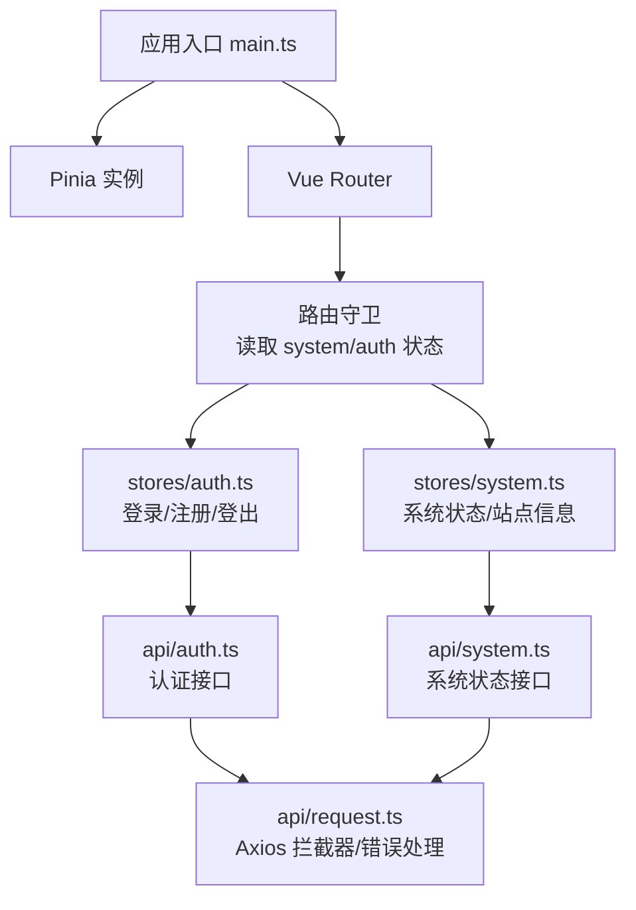
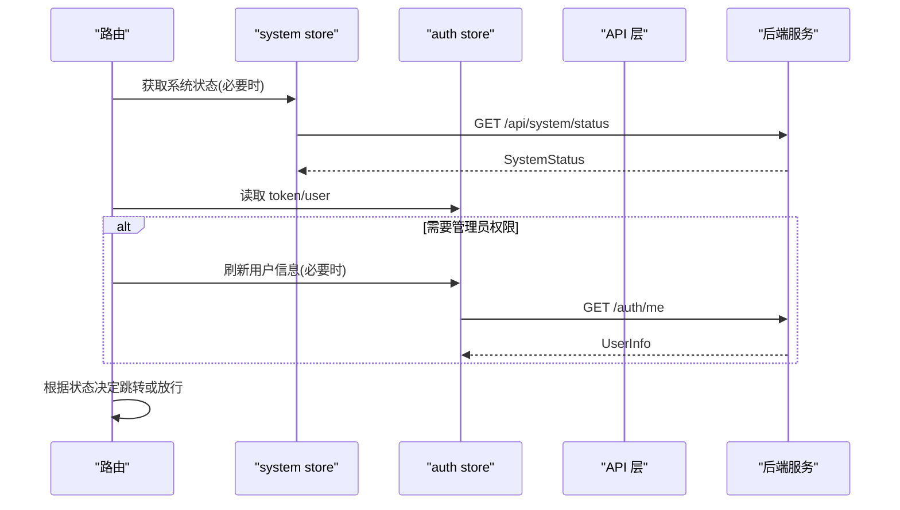
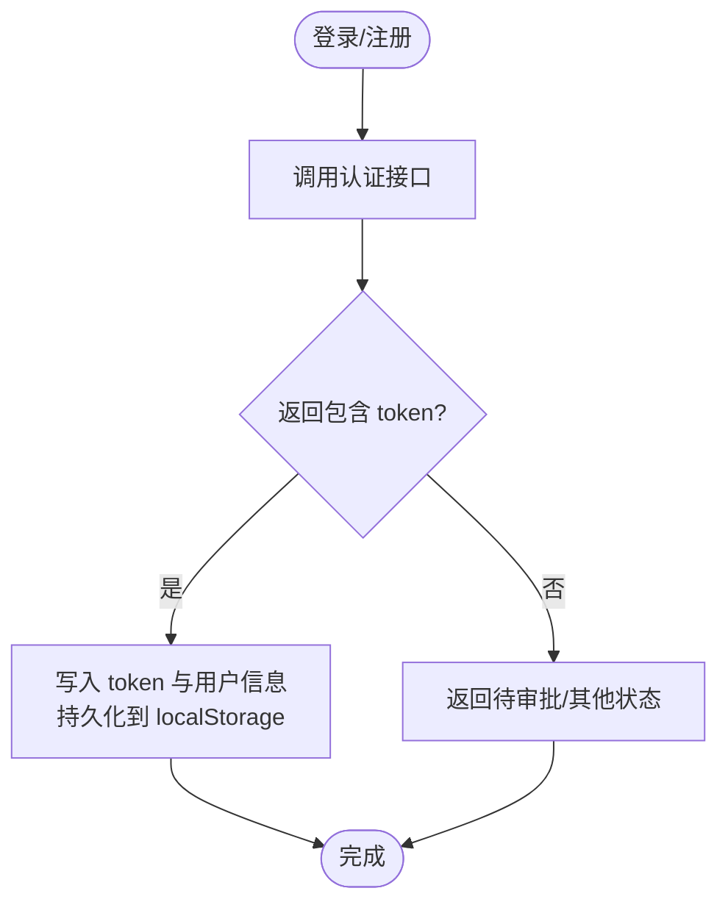
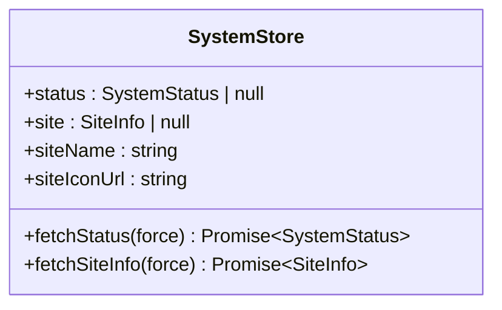
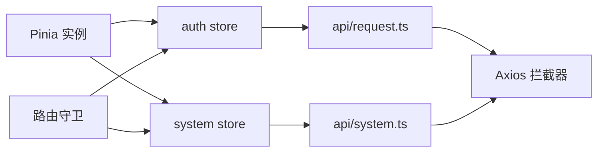
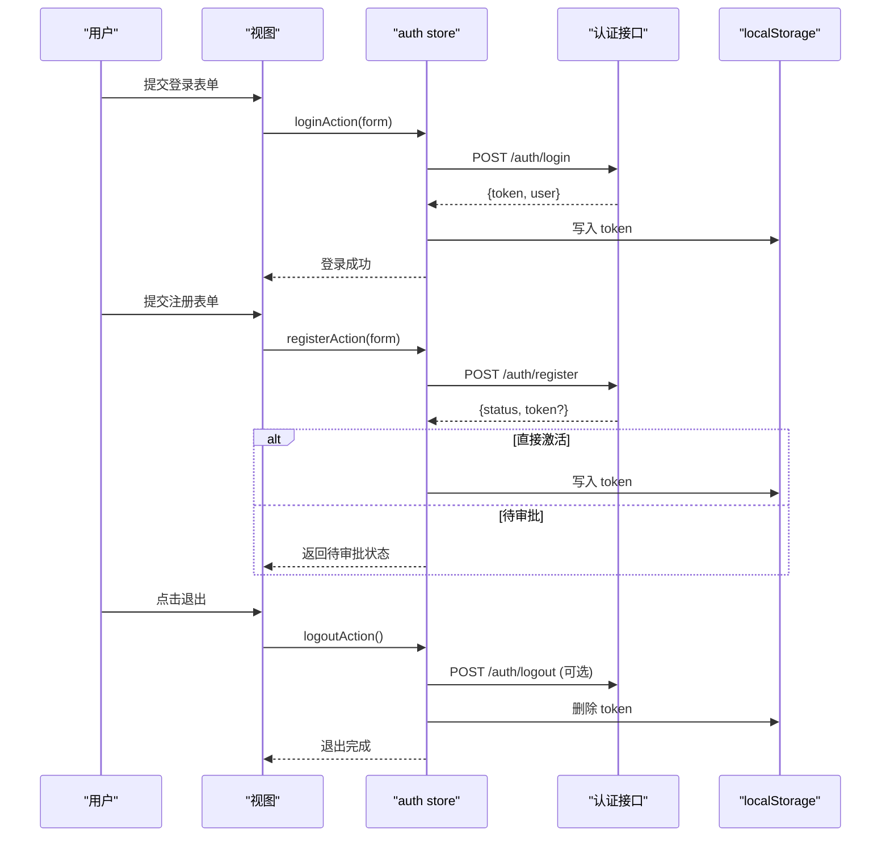

# 状态管理

<cite>
**本文引用的文件**
- [frontend/src/stores/auth.ts](file://frontend/src/stores/auth.ts)
- [frontend/src/stores/system.ts](file://frontend/src/stores/system.ts)
- [frontend/src/main.ts](file://frontend/src/main.ts)
- [frontend/src/router/index.ts](file://frontend/src/router/index.ts)
- [frontend/src/api/request.ts](file://frontend/src/api/request.ts)
- [frontend/src/api/auth.ts](file://frontend/src/api/auth.ts)
- [frontend/src/api/system.ts](file://frontend/src/api/system.ts)
- [frontend/src/api/settings.ts](file://frontend/src/api/settings.ts)
- [frontend/src/vite-env.d.ts](file://frontend/src/vite-env.d.ts)
- [frontend/tests/auth-store.spec.ts](file://frontend/tests/auth-store.spec.ts)
- [frontend/package.json](file://frontend/package.json)
</cite>

## 目录
1. [简介](#简介)
2. [项目结构](#项目结构)
3. [核心组件](#核心组件)
4. [架构总览](#架构总览)
5. [详细组件分析](#详细组件分析)
6. [依赖关系分析](#依赖关系分析)
7. [性能与可维护性](#性能与可维护性)
8. [故障排查指南](#故障排查指南)
9. [结论](#结论)
10. [附录](#附录)

## 简介
本文件面向前端状态管理，基于 Pinia 对认证状态（auth）与系统状态（system）进行统一建模与管理。文档覆盖 store 设计原则、状态定义、getter 计算属性、action 异步操作、持久化策略、调试技巧、性能优化以及版本兼容与迁移方法，并结合路由守卫与 API 层实现给出端到端流程说明。

## 项目结构
前端采用 Vue 3 + TypeScript + Vite 构建，使用 Pinia 作为状态管理库，Axios 封装 HTTP 请求并集中处理鉴权与错误映射。状态管理集中在 stores 目录，API 封装在 api 目录，路由守卫在 router 中集成状态判断。

图表来源
- [frontend/src/main.ts:1-11](file://frontend/src/main.ts#L1-L11)
- [frontend/src/router/index.ts:96-128](file://frontend/src/router/index.ts#L96-L128)
- [frontend/src/stores/auth.ts:1-40](file://frontend/src/stores/auth.ts#L1-L40)
- [frontend/src/stores/system.ts:1-28](file://frontend/src/stores/system.ts#L1-L28)
- [frontend/src/api/request.ts:1-89](file://frontend/src/api/request.ts#L1-L89)

章节来源
- [frontend/src/main.ts:1-11](file://frontend/src/main.ts#L1-L11)
- [frontend/package.json:1-37](file://frontend/package.json#L1-L37)

## 核心组件
- auth store：负责用户凭据与登录态的本地持久化与生命周期管理，提供登录、注册、登出等 action，并在成功时写入 token 与用户信息。
- system store：负责系统运行状态与站点公开信息的缓存与获取，提供按需拉取能力与站点名称、图标等派生 getter。
- 路由守卫：结合 system 与 auth 状态完成页面访问控制（应急模式、初始化配置、登录态校验、管理员权限）。
- API 层：统一 Axios 实例、Bearer 注入、401 自动清理与跳转、错误码到 UI 提示的统一映射。

章节来源
- [frontend/src/stores/auth.ts:1-40](file://frontend/src/stores/auth.ts#L1-L40)
- [frontend/src/stores/system.ts:1-28](file://frontend/src/stores/system.ts#L1-L28)
- [frontend/src/router/index.ts:96-128](file://frontend/src/router/index.ts#L96-L128)
- [frontend/src/api/request.ts:1-89](file://frontend/src/api/request.ts#L1-L89)

## 架构总览
下图展示从路由进入页面到状态更新与网络请求的完整时序，包括系统状态预检、登录态校验、管理员角色检查与 API 调用。

图表来源
- [frontend/src/router/index.ts:96-128](file://frontend/src/router/index.ts#L96-L128)
- [frontend/src/stores/system.ts:10-26](file://frontend/src/stores/system.ts#L10-L26)
- [frontend/src/stores/auth.ts:6-39](file://frontend/src/stores/auth.ts#L6-L39)
- [frontend/src/api/system.ts:1-8](file://frontend/src/api/system.ts#L1-L8)
- [frontend/src/api/auth.ts:16-21](file://frontend/src/api/auth.ts#L16-L21)

## 详细组件分析

### Auth Store（认证状态）
- 状态字段
  - token：当前会话令牌，优先从 localStorage 恢复。
  - user：当前用户信息，用于权限判断与界面展示。
- Getter/派生
  - 通过 computed 可在组件中派生“是否已登录”等布尔值（示例：token 非空即视为已登录）。
- Action
  - setSession：登录/注册成功后写入 token 与可选用户信息，同时持久化到 localStorage。
  - logoutLocal：清除本地凭据（客户端语义），不依赖服务端结果。
  - loginAction：调用登录接口，成功后写入 session。
  - registerAction：调用注册接口；若直接激活则写入 token，否则返回待审批状态。
  - logoutAction：尝试调用服务端登出接口，失败不影响本地清理。
- 持久化
  - 使用 localStorage 键 token 保存会话；首次加载时从 localStorage 恢复 token。
- 与路由/全局错误处理联动
  - 路由守卫在无 token 且目标非公开路由时跳转到登录页。
  - API 响应拦截器在 401 时调用 auth.logout 并跳转登录页（除登录页自身）。

图表来源
- [frontend/src/stores/auth.ts:11-37](file://frontend/src/stores/auth.ts#L11-L37)
- [frontend/src/api/auth.ts:16-21](file://frontend/src/api/auth.ts#L16-L21)

章节来源
- [frontend/src/stores/auth.ts:1-40](file://frontend/src/stores/auth.ts#L1-L40)
- [frontend/src/api/auth.ts:1-28](file://frontend/src/api/auth.ts#L1-L28)
- [frontend/src/api/request.ts:16-43](file://frontend/src/api/request.ts#L16-L43)
- [frontend/src/router/index.ts:112-126](file://frontend/src/router/index.ts#L112-L126)
- [frontend/tests/auth-store.spec.ts:1-65](file://frontend/tests/auth-store.spec.ts#L1-L65)

### System Store（系统状态）
- 状态字段
  - status：系统运行状态（如是否已配置、是否处于应急模式、是否允许本地登录等）。
  - site：站点公开信息（站点名称、图标 URL）。
- Getter/派生
  - siteName：站点名称，若未设置则回退为默认文案。
  - siteIconUrl：站点图标 URL。
- Action
  - fetchStatus：按需拉取系统状态，命中缓存则直接返回。
  - fetchSiteInfo：按需拉取站点公开信息，命中缓存则直接返回。
- 用途
  - 路由守卫依据 configured/emergency 等字段进行页面重定向。
  - 登录页/首页/顶栏等公共区域复用站点名称与图标。

图表来源
- [frontend/src/stores/system.ts:10-26](file://frontend/src/stores/system.ts#L10-L26)
- [frontend/src/api/system.ts:1-8](file://frontend/src/api/system.ts#L1-L8)
- [frontend/src/api/settings.ts:52-55](file://frontend/src/api/settings.ts#L52-L55)

章节来源
- [frontend/src/stores/system.ts:1-28](file://frontend/src/stores/system.ts#L1-L28)
- [frontend/src/api/system.ts:1-8](file://frontend/src/api/system.ts#L1-L8)
- [frontend/src/api/settings.ts:52-55](file://frontend/src/api/settings.ts#L52-L55)
- [frontend/src/router/index.ts:96-111](file://frontend/src/router/index.ts#L96-L111)

### 类型定义
- UserInfo：用户基本信息、角色、分组、状态与来源等。
- SystemStatus：系统运行标志位与能力开关（应急模式、是否已配置、是否允许本地登录/自注册、验证码提供者等）。
- SiteInfo：站点公开信息（名称、图标）。

章节来源
- [frontend/src/vite-env.d.ts:10-35](file://frontend/src/vite-env.d.ts#L10-L35)
- [frontend/src/api/settings.ts:52-55](file://frontend/src/api/settings.ts#L52-L55)

## 依赖关系分析
- Pinia 在应用启动时创建并挂载，所有 store 共享同一实例。
- 路由守卫依赖 system 与 auth 状态，必要时触发 me 接口刷新用户信息。
- API 层通过 Axios 拦截器自动注入 Bearer Token，并在 401 时调用 auth.logout 并跳转登录页。
- system store 使用独立 axios 实例绕过鉴权拦截器以获取公开系统状态。

图表来源
- [frontend/src/main.ts:1-11](file://frontend/src/main.ts#L1-L11)
- [frontend/src/router/index.ts:96-128](file://frontend/src/router/index.ts#L96-L128)
- [frontend/src/api/request.ts:1-89](file://frontend/src/api/request.ts#L1-L89)
- [frontend/src/api/system.ts:1-8](file://frontend/src/api/system.ts#L1-L8)

章节来源
- [frontend/src/main.ts:1-11](file://frontend/src/main.ts#L1-L11)
- [frontend/src/router/index.ts:96-128](file://frontend/src/router/index.ts#L96-L128)
- [frontend/src/api/request.ts:1-89](file://frontend/src/api/request.ts#L1-L89)
- [frontend/src/api/system.ts:1-8](file://frontend/src/api/system.ts#L1-L8)

## 性能与可维护性

- 状态持久化
  - 使用 localStorage 存储 token，首次加载时恢复，避免重复登录。
  - 建议：对敏感数据谨慎持久化；如需更安全的持久化方案可考虑加密存储或内存+短期缓存组合。
- 状态调试
  - 开发环境下 401 会输出诊断日志，便于定位鉴权问题。
  - 可使用浏览器开发者工具查看 Pinia 状态树与变更历史（配合官方插件）。
- 性能优化
  - system store 的 fetchStatus/fetchSiteInfo 支持 force 参数，避免重复请求；命中缓存直接返回。
  - 路由懒加载与代码分割减少首屏体积。
  - 将高频读、低频写的状态拆分到不同 store，降低不必要的重渲染。
- 版本兼容与迁移
  - 当后端接口字段演进时，建议在 store 层做兼容处理（例如字段缺失时的默认值）。
  - 对于旧版 token 格式或用户信息结构，可在 setSession 处做转换与降级。
  - 针对系统状态新增字段，确保路由守卫与 UI 对未知字段具备容错能力。
- 测试与验证
  - 通过单元测试 mock API，验证登录/注册/登出行为与本地状态一致性。
  - 重点覆盖：登录成功写 token、注册待审批不写 token、登出清理本地状态、401 自动清理等场景。

章节来源
- [frontend/src/stores/auth.ts:11-37](file://frontend/src/stores/auth.ts#L11-L37)
- [frontend/src/stores/system.ts:12-23](file://frontend/src/stores/system.ts#L12-L23)
- [frontend/src/api/request.ts:32-43](file://frontend/src/api/request.ts#L32-L43)
- [frontend/tests/auth-store.spec.ts:25-63](file://frontend/tests/auth-store.spec.ts#L25-L63)

## 故障排查指南
- 登录后仍被重定向到登录页
  - 检查 localStorage 中是否存在 token，确认 setSession 是否执行。
  - 检查路由守卫逻辑是否正确识别 token。
- 401 频繁出现
  - 确认请求是否携带 Authorization 头（由 request 拦截器注入）。
  - 关注 401 响应拦截器是否触发了自动登出与跳转。
- 系统状态异常导致无法进入管理页
  - 检查 system store 的 fetchStatus 是否成功返回 configured/emergency 等关键字段。
  - 确认路由守卫对 configured 与 emergency 的判断是否符合预期。
- 站点名称/图标未显示
  - 检查 system store 的 fetchSiteInfo 是否调用成功，siteName/siteIconUrl 是否正确派生。

章节来源
- [frontend/src/router/index.ts:96-128](file://frontend/src/router/index.ts#L96-L128)
- [frontend/src/api/request.ts:16-43](file://frontend/src/api/request.ts#L16-L43)
- [frontend/src/stores/system.ts:12-26](file://frontend/src/stores/system.ts#L12-L26)

## 结论
本项目基于 Pinia 实现了清晰的前端状态管理：auth store 聚焦认证生命周期与本地持久化，system store 负责系统运行状态与站点公开信息缓存。路由守卫与 API 拦截器协同完成鉴权与错误处理，形成完整的访问控制闭环。通过合理的缓存策略、类型定义与测试覆盖，系统在可维护性与性能方面具备良好的基础。后续可按需扩展更多业务 store，并持续完善状态迁移与兼容性策略。

## 附录

### 关键流程图：登录/注册/登出

图表来源
- [frontend/src/stores/auth.ts:23-37](file://frontend/src/stores/auth.ts#L23-L37)
- [frontend/src/api/auth.ts:16-21](file://frontend/src/api/auth.ts#L16-L21)