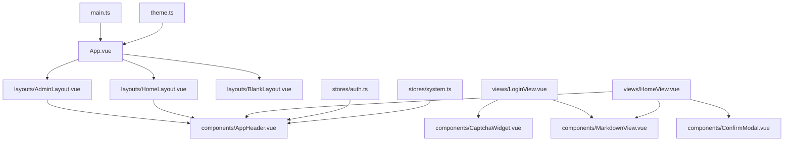
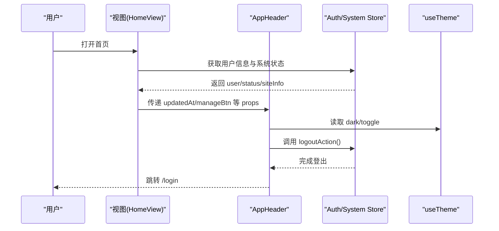
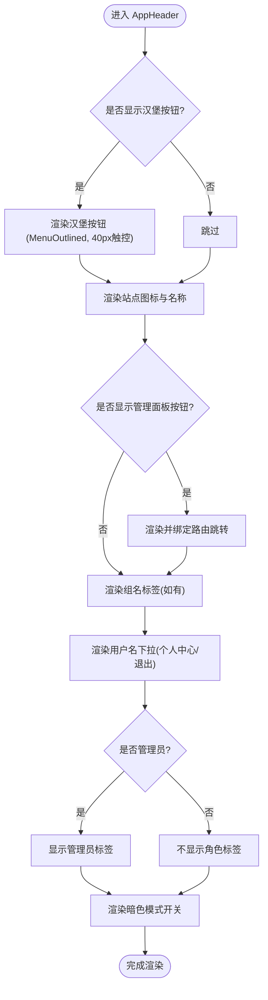
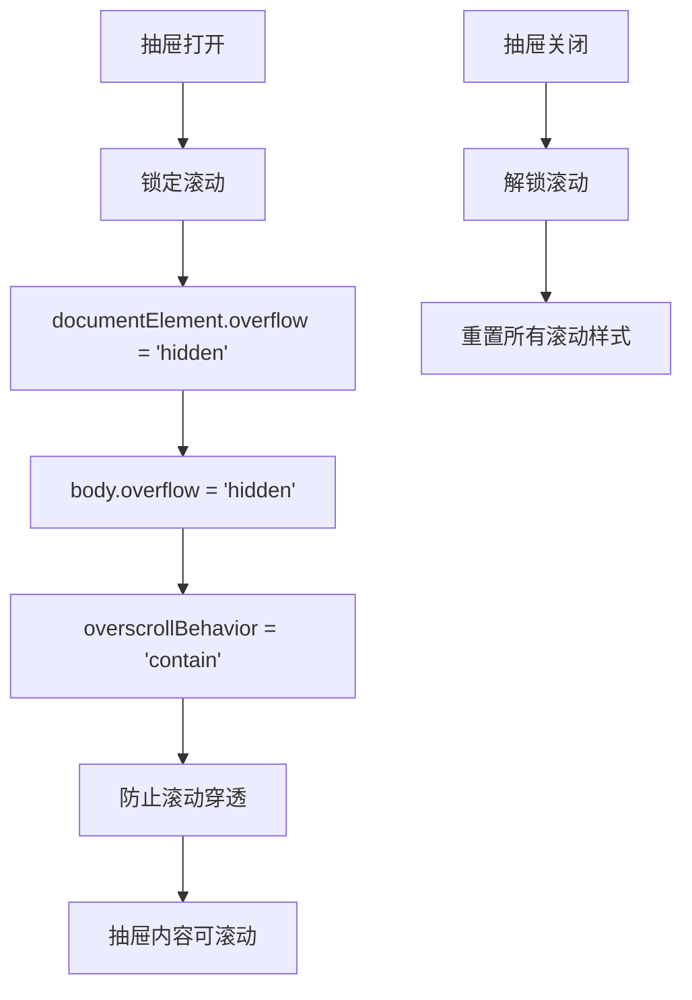
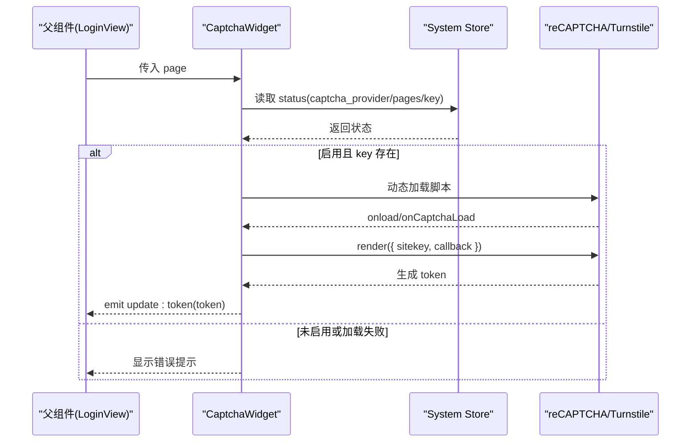
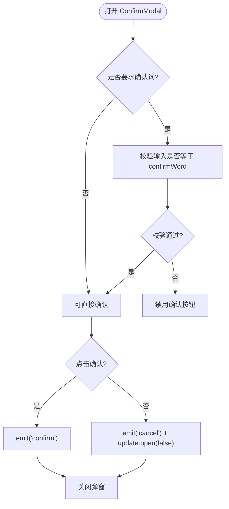
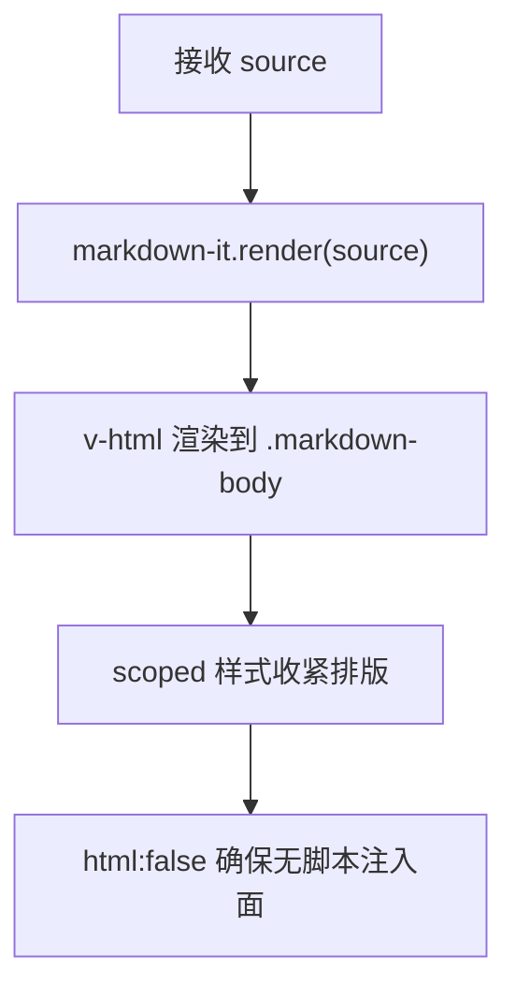
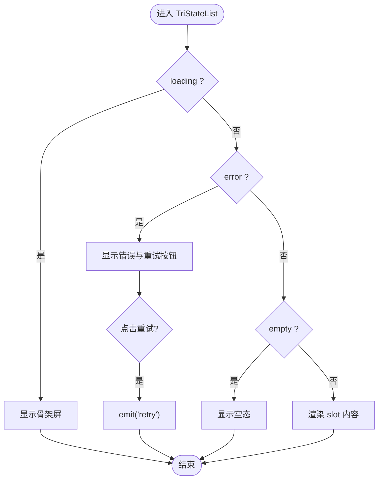
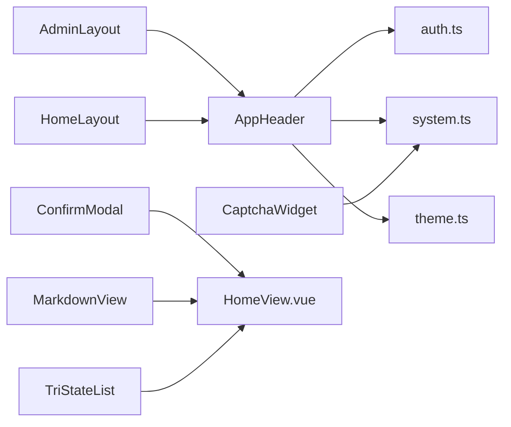

</think>

基于我对代码的分析，我现在可以更新组件设计文档。根据更新原因，主要涉及以下三个方面的改进：

1. **移动端抽屉滚动行为增强**：使用双元素滚动锁定（html+body overflow:hidden + overscroll-behavior:contain）以兼容 iOS Safari
2. **汉堡菜单按钮改进**：使用 MenuOutlined 图标和 40px 触控目标
3. **用户角色显示逻辑修正**：管理员标签仅对管理员显示

现在我将更新文档：

# 组件设计

<cite>
**本文引用的文件**
- [AppHeader.vue](file://frontend/src/components/AppHeader.vue)
- [CaptchaWidget.vue](file://frontend/src/components/CaptchaWidget.vue)
- [ConfirmModal.vue](file://frontend/src/components/ConfirmModal.vue)
- [MarkdownView.vue](file://frontend/src/components/MarkdownView.vue)
- [TriStateList.vue](file://frontend/src/components/TriStateList.vue)
- [AdminLayout.vue](file://frontend/src/layouts/AdminLayout.vue)
- [HomeLayout.vue](file://frontend/src/layouts/HomeLayout.vue)
- [theme.ts](file://frontend/src/theme.ts)
- [auth.ts](file://frontend/src/stores/auth.ts)
- [system.ts](file://frontend/src/stores/system.ts)
- [LoginView.vue](file://frontend/src/views/LoginView.vue)
- [HomeView.vue](file://frontend/src/views/HomeView.vue)
- [App.vue](file://frontend/src/App.vue)
- [main.ts](file://frontend/src/main.ts)
</cite>

## 更新摘要
**变更内容**
- 增强了移动端抽屉滚动行为，实现双元素滚动锁定以兼容 iOS Safari
- 改进了汉堡菜单按钮，使用 MenuOutlined 图标和 40px 触控目标
- 修正了用户角色显示逻辑，管理员标签仅对管理员显示
- 更新了 AppHeader 组件的交互细节和样式规范

## 目录
1. [简介](#简介)
2. [项目结构](#项目结构)
3. [核心组件](#核心组件)
4. [架构总览](#架构总览)
5. [详细组件分析](#详细组件分析)
6. [依赖关系分析](#依赖关系分析)
7. [性能考虑](#性能考虑)
8. [故障排查指南](#故障排查指南)
9. [结论](#结论)
10. [附录](#附录)

## 简介
本设计文档聚焦于基于 Vue 3 的前端组件化架构，围绕自定义组件的设计模式、Props 定义、事件处理、插槽使用等核心概念展开。重点说明以下业务组件的实现与用法：
- AppHeader 头部组件
- CaptchaWidget 验证码组件
- ConfirmModal 确认模态框
- MarkdownView 文档查看器
- TriStateList 三态列表

同时提供组件复用策略、样式隔离、响应式设计最佳实践，以及组件测试方法与性能优化技巧。

## 项目结构
前端采用按功能分层的组织方式：
- components：通用业务组件（头部、验证码、确认框、Markdown 渲染、三态列表）
- layouts：页面级布局（用户端、管理端、空白布局）
- stores：状态管理（认证、系统信息）
- views：页面视图（登录、首页等）
- theme：主题与暗色模式 composable
- main.ts：应用入口，挂载 Pinia 与 Router

**图表来源**
- [main.ts:1-11](file://frontend/src/main.ts#L1-L11)
- [App.vue:1-43](file://frontend/src/App.vue#L1-L43)
- [AdminLayout.vue:1-130](file://frontend/src/layouts/AdminLayout.vue#L1-L130)
- [HomeLayout.vue:1-7](file://frontend/src/layouts/HomeLayout.vue#L1-L7)
- [AppHeader.vue:1-71](file://frontend/src/components/AppHeader.vue#L1-L71)
- [CaptchaWidget.vue:1-77](file://frontend/src/components/CaptchaWidget.vue#L1-L77)
- [MarkdownView.vue:1-55](file://frontend/src/components/MarkdownView.vue#L1-L55)
- [ConfirmModal.vue:1-29](file://frontend/src/components/ConfirmModal.vue#L1-L29)
- [auth.ts:1-40](file://frontend/src/stores/auth.ts#L1-L40)
- [system.ts:1-28](file://frontend/src/stores/system.ts#L1-L28)
- [theme.ts:1-27](file://frontend/src/theme.ts#L1-L27)

章节来源
- [main.ts:1-11](file://frontend/src/main.ts#L1-L11)
- [App.vue:1-43](file://frontend/src/App.vue#L1-L43)

## 核心组件
- AppHeader：通用顶栏，展示站点名、更新时间、管理面板入口、组名标签、用户名下拉菜单、暗色模式切换；支持汉堡按钮触发 Drawer。
- CaptchaWidget：根据后端配置动态加载 reCAPTCHA 或 Turnstile，失败时显示错误提示，通过事件将 token 回传给父组件。
- ConfirmModal：统一确认对话框，支持危险操作高亮、输入确认词校验、加载态控制。
- MarkdownView：安全渲染 Markdown，禁用原始 HTML，链接防误链，输出样式收紧适配内容区。
- TriStateList：封装加载中、空数据、错误重试三种状态的 UI 呈现，简化列表页模板逻辑。

章节来源
- [AppHeader.vue:1-71](file://frontend/src/components/AppHeader.vue#L1-L71)
- [CaptchaWidget.vue:1-77](file://frontend/src/components/CaptchaWidget.vue#L1-L77)
- [ConfirmModal.vue:1-29](file://frontend/src/components/ConfirmModal.vue#L1-L29)
- [MarkdownView.vue:1-55](file://frontend/src/components/MarkdownView.vue#L1-L55)
- [TriStateList.vue:1-22](file://frontend/src/components/TriStateList.vue#L1-L22)

## 架构总览
整体采用"布局 + 组件 + 状态"的清晰分层：
- 布局层：AdminLayout 与 HomeLayout 负责页面骨架与导航，AppHeader 作为通用头部。
- 组件层：各业务组件职责单一，通过 Props 接收数据，通过事件向上传递交互结果。
- 状态层：Pinia store 集中管理认证与系统信息，组件按需读取与更新。
- 主题层：useTheme composable 提供暗色模式切换与 AntD 主题联动。

**图表来源**
- [HomeView.vue:1-211](file://frontend/src/views/HomeView.vue#L1-L211)
- [AppHeader.vue:1-71](file://frontend/src/components/AppHeader.vue#L1-L71)
- [auth.ts:1-40](file://frontend/src/stores/auth.ts#L1-L40)
- [system.ts:1-28](file://frontend/src/stores/system.ts#L1-L28)
- [theme.ts:1-27](file://frontend/src/theme.ts#L1-L27)

## 详细组件分析

### AppHeader 头部组件
- 设计模式：组合式 API + defineProps/defineEmits；通过 computed 派生管理员角色与组名。
- Props：updatedAt（可选）、manageBtn（是否显示管理面板入口）、burger（移动端汉堡按钮）。
- 事件：open-drawer（用于管理端 Drawer 开关）。
- 行为：
  - 根据系统站点信息展示图标与名称。
  - 管理员可见"管理面板"按钮，点击路由跳转。
  - 用户名下拉包含个人中心与退出登录；退出后跳转登录页。
  - **更新**：角色标签仅对管理员显示，普通用户不再显示"用户"标签。
  - 暗色模式开关与 useTheme 联动，持久化到 localStorage。
- 样式：使用 Tailwind 类实现响应式布局与暗色适配；避免覆盖 AntD Layout.Header 默认背景。
- **更新**：汉堡按钮使用 MenuOutlined 图标，设置 40px 触控目标尺寸以提升移动端用户体验。

**图表来源**
- [AppHeader.vue:1-71](file://frontend/src/components/AppHeader.vue#L1-L71)
- [theme.ts:1-27](file://frontend/src/theme.ts#L1-L27)
- [auth.ts:1-40](file://frontend/src/stores/auth.ts#L1-L40)

章节来源
- [AppHeader.vue:1-71](file://frontend/src/components/AppHeader.vue#L1-L71)
- [AdminLayout.vue:1-130](file://frontend/src/layouts/AdminLayout.vue#L1-L130)

### AdminLayout 布局组件
- 设计模式：响应式布局，支持桌面端侧边栏和移动端抽屉式菜单。
- 行为：
  - 检测移动端设备，切换不同的导航模式。
  - **更新**：实现了增强的移动端滚动锁定机制，使用双元素滚动锁定（html+body overflow:hidden + overscroll-behavior:contain）以确保 iOS Safari 兼容性。
  - 管理抽屉打开时防止背景滚动穿透。
  - 提供完整的导航菜单和底部操作区域。

**图表来源**
- [AdminLayout.vue:33-40](file://frontend/src/layouts/AdminLayout.vue#L33-L40)

章节来源
- [AdminLayout.vue:1-130](file://frontend/src/layouts/AdminLayout.vue#L1-L130)

### CaptchaWidget 验证码组件
- 设计模式：根据系统状态动态启用与加载第三方脚本；onMounted 中注入脚本并监听加载成功/失败。
- Props：page（'register'|'login'|'forgot'），用于判断是否在启用页面列表中。
- 事件：update:token（将验证码 token 回传给父表单）。
- 行为：
  - enabled 计算属性与后端 captcha_provider/captcha_pages/captcha_site_key 对齐。
  - 根据 provider 选择 reCAPTCHA 或 Turnstile 脚本地址。
  - 全局回调 onCaptchaLoad 与 onload 事件分别处理不同提供商的初始化时机。
  - 脚本加载失败时显示错误提示，避免静默卡死。
- 样式：Alert 错误提示，容器 id 为 captcha-container 供 SDK 渲染。

**图表来源**
- [CaptchaWidget.vue:1-77](file://frontend/src/components/CaptchaWidget.vue#L1-L77)
- [system.ts:1-28](file://frontend/src/stores/system.ts#L1-L28)
- [LoginView.vue:1-172](file://frontend/src/views/LoginView.vue#L1-L172)

章节来源
- [CaptchaWidget.vue:1-77](file://frontend/src/components/CaptchaWidget.vue#L1-L77)
- [LoginView.vue:1-172](file://frontend/src/views/LoginView.vue#L1-L172)

### ConfirmModal 确认模态框
- 设计模式：受控 open 状态，支持 loading、danger、confirmWord 校验。
- Props：open、title、content（可被插槽扩展）、danger、confirmWord、loading。
- 事件：confirm、cancel、update:open。
- 行为：
  - 当 confirmWord 存在时，需输入正确文本才允许确认。
  - ok 按钮支持 danger 高亮与 loading 态。
  - 插槽支持在 Modal 内插入自定义内容。
- 使用场景：刷新订阅链接、删除等危险操作的二次确认。

**图表来源**
- [ConfirmModal.vue:1-29](file://frontend/src/components/ConfirmModal.vue#L1-L29)
- [HomeView.vue:1-211](file://frontend/src/views/HomeView.vue#L1-L211)

章节来源
- [ConfirmModal.vue:1-29](file://frontend/src/components/ConfirmModal.vue#L1-L29)
- [HomeView.vue:1-211](file://frontend/src/views/HomeView.vue#L1-L211)

### MarkdownView 文档查看器
- 设计模式：单例 markdown-it 实例，html:false 禁止原始 HTML，linkify:false 防止误链；computed 缓存渲染结果。
- Props：source（Markdown 字符串）。
- 行为：
  - 使用 v-html 渲染白名单输出，避免存储型 XSS。
  - 样式 scoped 限制影响范围，链接换行、段落间距紧凑。
- 使用场景：公告、页脚、帮助文档等内容的安全渲染。

**图表来源**
- [MarkdownView.vue:1-55](file://frontend/src/components/MarkdownView.vue#L1-L55)

章节来源
- [MarkdownView.vue:1-55](file://frontend/src/components/MarkdownView.vue#L1-L55)

### TriStateList 三态列表
- 设计模式：封装 loading、empty、error 三种状态，slot 承载实际列表内容。
- Props：loading、empty、error（可选错误信息）、emptyText（空态文案）。
- 事件：retry（触发重试）。
- 行为：
  - 加载中显示骨架屏。
  - 错误时显示 Result 与重试按钮。
  - 空数据时显示 Empty。
  - 正常数据时渲染 slot。
- 使用场景：平台卡片网格、订阅列表等需要统一状态展示的页面。

**图表来源**
- [TriStateList.vue:1-22](file://frontend/src/components/TriStateList.vue#L1-L22)

章节来源
- [TriStateList.vue:1-22](file://frontend/src/components/TriStateList.vue#L1-L22)

## 依赖关系分析
- 组件间耦合度低：各组件通过 Props/Events 通信，不直接引用彼此。
- 与 Store 的解耦：组件仅消费 auth.ts 与 system.ts 暴露的状态与方法，便于替换与测试。
- 主题与布局：App.vue 通过 ConfigProvider 注入主题与语言；布局组件负责导航与响应式切换。
- 外部依赖：Ant Design Vue 提供基础 UI；Tailwind 负责样式；markdown-it 用于安全渲染。

**图表来源**
- [AppHeader.vue:1-71](file://frontend/src/components/AppHeader.vue#L1-L71)
- [CaptchaWidget.vue:1-77](file://frontend/src/components/CaptchaWidget.vue#L1-L77)
- [ConfirmModal.vue:1-29](file://frontend/src/components/ConfirmModal.vue#L1-L29)
- [MarkdownView.vue:1-55](file://frontend/src/components/MarkdownView.vue#L1-L55)
- [TriStateList.vue:1-22](file://frontend/src/components/TriStateList.vue#L1-L22)
- [AdminLayout.vue:1-130](file://frontend/src/layouts/AdminLayout.vue#L1-L130)
- [HomeLayout.vue:1-7](file://frontend/src/layouts/HomeLayout.vue#L1-L7)
- [auth.ts:1-40](file://frontend/src/stores/auth.ts#L1-L40)
- [system.ts:1-28](file://frontend/src/stores/system.ts#L1-L28)
- [theme.ts:1-27](file://frontend/src/theme.ts#L1-L27)

章节来源
- [App.vue:1-43](file://frontend/src/App.vue#L1-L43)
- [AdminLayout.vue:1-130](file://frontend/src/layouts/AdminLayout.vue#L1-L130)
- [HomeLayout.vue:1-7](file://frontend/src/layouts/HomeLayout.vue#L1-L7)

## 性能考虑
- 懒加载验证码脚本：仅在启用且挂载时动态注入，减少首屏开销。
- 计算属性缓存：AppHeader 中的 isAdmin/groupName、ConfirmModal 的 okDisabled、MarkdownView 的 rendered 均使用 computed，避免重复计算。
- 条件渲染：TriStateList 通过 v-if/v-else-if 分支渲染，减少不必要的 DOM 节点。
- 样式隔离：MarkdownView 使用 scoped 样式，避免全局污染；Tailwind 原子类提升构建与运行时效率。
- 主题切换：useTheme 通过 watch 同步 localStorage 与 document class，避免全量重绘。
- **更新**：移动端滚动锁定使用原生 DOM 操作，避免额外的框架开销。

## 故障排查指南
- 验证码加载失败：CaptchaWidget 会在脚本加载失败时显示错误提示，检查网络与提供商配置（captcha_provider/captcha_site_key）。
- 管理员无法看到管理面板按钮：确认 AppHeader 的 manageBtn 与 auth.user.role 是否为 admin。
- **更新**：角色标签显示异常：确认 isAdmin 计算属性是否正确判断用户角色，管理员标签应仅对 role === 'admin' 的用户显示。
- 暗色模式无效：检查 useTheme 的 toggle 是否正确绑定，localStorage 中 theme 键值是否为 'dark'/'light'。
- Markdown 渲染异常：确认 source 非空，markdown-it 已启用 html:false；检查样式覆盖是否影响链接换行。
- 列表状态不正确：TriStateList 的 loading/empty/error 优先级为 loading > error > empty > slot，检查父组件状态赋值。
- **更新**：移动端滚动问题：检查 AdminLayout 中的滚动锁定逻辑是否正确执行，确保 html 和 body 元素的 overflow 和 overscrollBehavior 属性设置正确。

章节来源
- [CaptchaWidget.vue:1-77](file://frontend/src/components/CaptchaWidget.vue#L1-L77)
- [AppHeader.vue:1-71](file://frontend/src/components/AppHeader.vue#L1-L71)
- [AdminLayout.vue:33-40](file://frontend/src/layouts/AdminLayout.vue#L33-L40)
- [theme.ts:1-27](file://frontend/src/theme.ts#L1-L27)
- [MarkdownView.vue:1-55](file://frontend/src/components/MarkdownView.vue#L1-L55)
- [TriStateList.vue:1-22](file://frontend/src/components/TriStateList.vue#L1-L22)

## 结论
本项目以清晰的组件分层与单一职责原则构建了可扩展的前端架构。通过 Props/Events 的明确契约、Store 的状态集中管理、useTheme 的主题联动，实现了良好的可维护性与可测试性。验证码的动态加载、Markdown 的安全渲染、三态列表的统一状态展示等实践，显著提升了用户体验与健壮性。

**更新后的改进**包括增强的移动端体验（iOS Safari 兼容性）、改进的交互设计（40px 触控目标）和更精确的角色显示逻辑。建议在后续迭代中继续遵循这些模式，并结合单元测试与性能监控进一步优化。

## 附录

### 组件复用策略
- 抽象共性：将加载/空/错误状态抽象为 TriStateList，减少重复模板。
- 配置驱动：CaptchaWidget 根据系统状态决定启用与提供商，便于多环境部署。
- 插槽扩展：ConfirmModal 支持插槽插入自定义内容，提高灵活性。

### 样式隔离与响应式
- 使用 Tailwind 原子类实现响应式布局（如 grid-cols-1/md:grid-cols-2/xl:grid-cols-3）。
- MarkdownView 使用 scoped 样式限制影响范围，避免全局污染。
- 暗色模式通过 document.documentElement.classList.toggle('dark') 与 Tailwind dark: 前缀联动。
- **更新**：移动端触控目标符合 40px 最小尺寸规范，提升触摸体验。

### 组件测试方法
- 单元测试：对 Composables（如 useTheme）进行断言，验证 localStorage 与 class 切换。
- 组件测试：模拟 Props 与 Events，验证渲染分支（如 TriStateList 的 loading/error/empty）。
- 集成测试：模拟验证码脚本加载成功/失败，验证 update:token 事件与错误提示。
- **更新**：移动端测试：验证抽屉滚动锁定在不同浏览器（特别是 iOS Safari）上的行为一致性。

### 性能优化技巧
- 懒加载与按需引入：验证码脚本动态注入，减少首屏体积。
- 计算属性与记忆化：避免重复计算与渲染。
- 条件渲染与最小化 DOM：使用 v-if 分支减少无用节点。
- 主题切换优化：watch 同步 localStorage 与 class，避免全量重绘。
- **更新**：滚动锁定优化：使用原生 DOM API 直接操作，避免框架开销。

[本节为通用指导，无需具体文件引用]