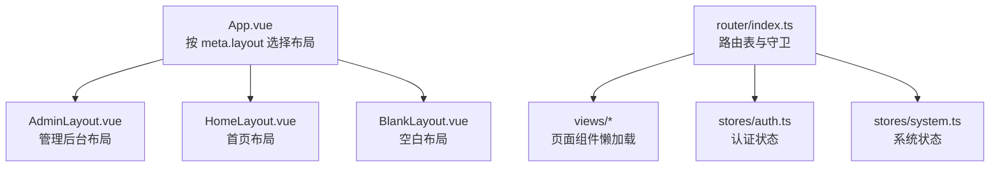
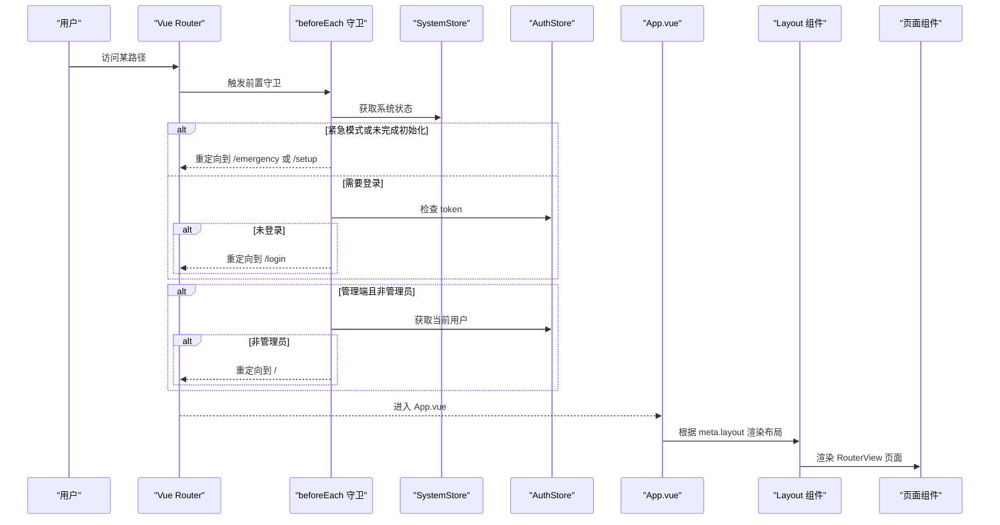
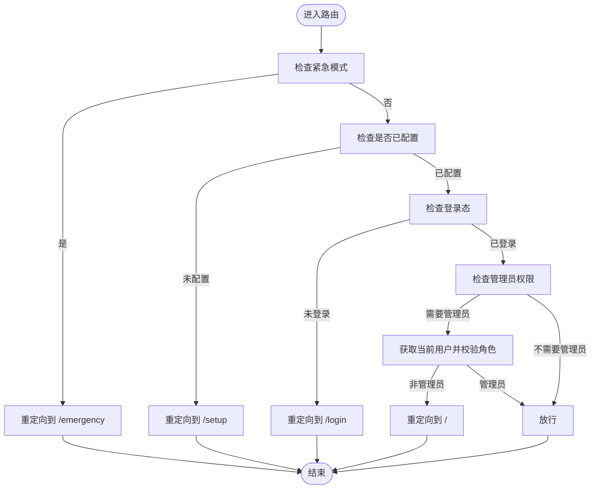
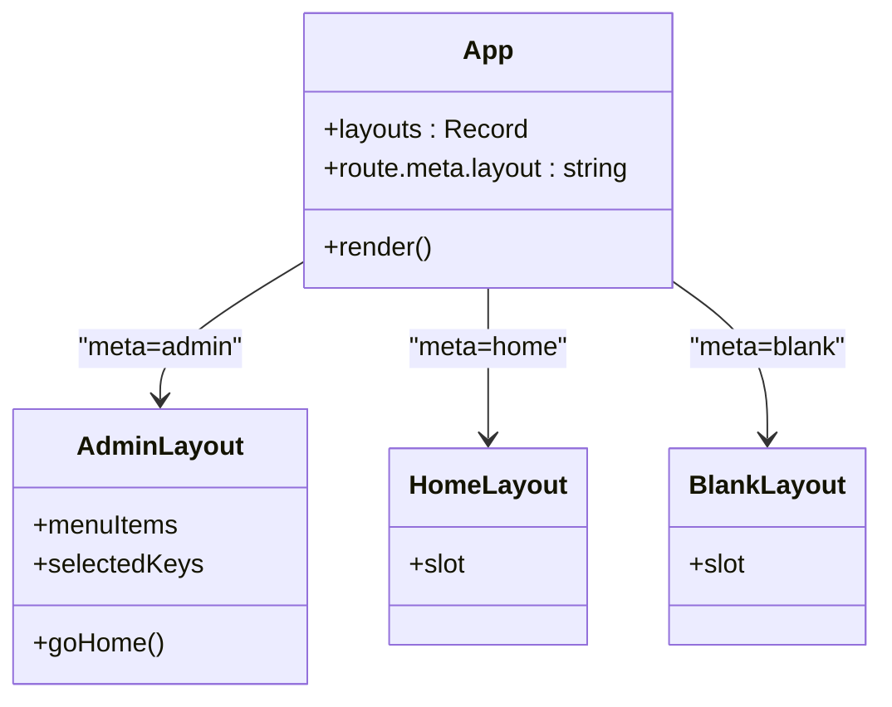
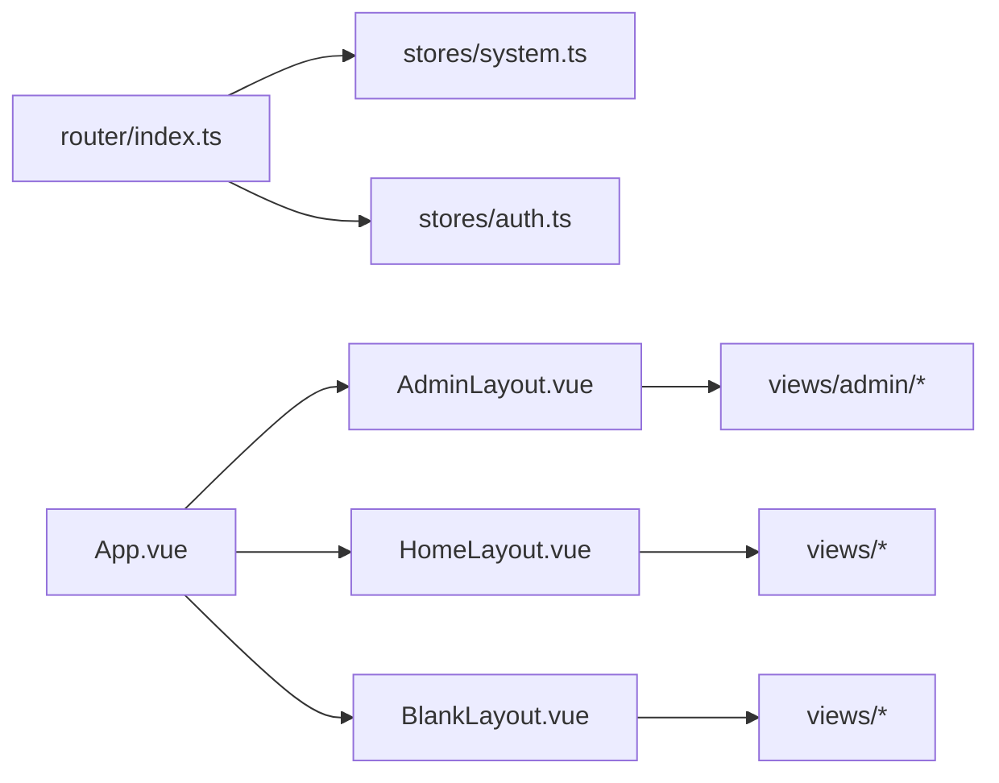

# 路由配置

<cite>
**本文引用的文件**
- [frontend/src/router/index.ts](file://frontend/src/router/index.ts)
- [frontend/src/App.vue](file://frontend/src/App.vue)
- [frontend/src/layouts/AdminLayout.vue](file://frontend/src/layouts/AdminLayout.vue)
- [frontend/src/layouts/HomeLayout.vue](file://frontend/src/layouts/HomeLayout.vue)
- [frontend/src/layouts/BlankLayout.vue](file://frontend/src/layouts/BlankLayout.vue)
- [frontend/src/stores/auth.ts](file://frontend/src/stores/auth.ts)
- [frontend/src/stores/system.ts](file://frontend/src/stores/system.ts)
- [frontend/src/views/admin/VersionManageView.vue](file://frontend/src/views/admin/VersionManageView.vue)
</cite>

## 目录
1. [简介](#简介)
2. [项目结构](#项目结构)
3. [核心组件](#核心组件)
4. [架构总览](#架构总览)
5. [详细组件分析](#详细组件分析)
6. [依赖关系分析](#依赖关系分析)
7. [性能与SEO优化](#性能与seo优化)
8. [故障排查指南](#故障排查指南)
9. [结论](#结论)

## 简介
本文件面向前端路由配置，基于 Vue Router 实现统一的路由架构设计。文档涵盖：
- 路由模块划分（管理端、用户端、公开页）
- 嵌套路由与动态路由（版本管理子路由）
- 路由守卫（紧急模式、初始化状态、登录态、管理员角色）
- 三种布局模式（AdminLayout、HomeLayout、BlankLayout）的使用场景与切换机制
- 路由懒加载、权限控制、面包屑导航、路由元信息
- 路由性能优化与 SEO 友好配置建议

## 项目结构
前端路由定义位于 router/index.ts，通过 createWebHistory 创建历史模式路由；App.vue 根据 route.meta.layout 动态渲染对应布局组件；各页面按功能分目录组织（views/admin、views 等），并通过懒加载按需引入。

图表来源
- [frontend/src/App.vue:1-43](file://frontend/src/App.vue#L1-L43)
- [frontend/src/router/index.ts:1-132](file://frontend/src/router/index.ts#L1-L132)

章节来源
- [frontend/src/router/index.ts:1-132](file://frontend/src/router/index.ts#L1-L132)
- [frontend/src/App.vue:1-43](file://frontend/src/App.vue#L1-L43)

## 核心组件
- 路由表与守卫：集中定义所有路由、元信息与全局前置守卫，负责跳转逻辑与进度条提示。
- 布局组件：
  - AdminLayout：管理后台侧边栏+顶栏+内容区，支持移动端抽屉菜单。
  - HomeLayout：用户端页面底色容器，页面自带顶栏。
  - BlankLayout：无登录态居中布局，用于登录、注册、重置等页面。
- 状态管理：
  - auth.ts：维护 token、用户信息，提供登录/注册/登出动作。
  - system.ts：缓存系统状态与站点信息，供守卫与页面复用。

章节来源
- [frontend/src/router/index.ts:1-132](file://frontend/src/router/index.ts#L1-L132)
- [frontend/src/layouts/AdminLayout.vue:1-120](file://frontend/src/layouts/AdminLayout.vue#L1-L120)
- [frontend/src/layouts/HomeLayout.vue:1-7](file://frontend/src/layouts/HomeLayout.vue#L1-L7)
- [frontend/src/layouts/BlankLayout.vue:1-7](file://frontend/src/layouts/BlankLayout.vue#L1-L7)
- [frontend/src/stores/auth.ts:1-40](file://frontend/src/stores/auth.ts#L1-L40)
- [frontend/src/stores/system.ts:1-28](file://frontend/src/stores/system.ts#L1-L28)

## 架构总览
路由架构以“路由表 + 守卫 + 布局”为核心：
- 路由表：将公开、用户端、管理端三类路由合并，并统一设置 meta 字段（layout、requiresAdmin、public）。
- 守卫：在 beforeEach 中依次执行紧急模式检查、初始化状态检查、登录态校验、管理员角色校验。
- 布局：App.vue 读取 route.meta.layout 动态渲染对应布局，RouterView 渲染具体页面。

图表来源
- [frontend/src/router/index.ts:96-129](file://frontend/src/router/index.ts#L96-L129)
- [frontend/src/App.vue:36-42](file://frontend/src/App.vue#L36-L42)

## 详细组件分析

### 路由表与模块划分
- 公开路由（blank 布局）：应急恢复、安装引导、登录、注册、忘记密码、重置密码、待处理、OIDC 回调、404。
- 用户端路由（home 布局）：首页、规则、个人中心。
- 管理端路由（admin 布局）：订阅、用户组、分享、平台、用户、审批中心、规则、面板配置、日志、订阅装配。
- 版本管理子路由：四条子路由复用 VersionManageView，通过 props 注入 ownerType、ownerId、apiPrefix、resourceName、backPath，并在 meta 中标记 requiresAdmin。

章节来源
- [frontend/src/router/index.ts:7-70](file://frontend/src/router/index.ts#L7-L70)

### 嵌套路由与动态路由
- 版本管理子路由为动态路由，匹配 /admin/{resource}/:id/versions，使用 props 映射参数，便于通用视图复用。
- 高亮逻辑：AdminLayout 根据路由段定位父级菜单项，确保子路由时父菜单高亮。

章节来源
- [frontend/src/router/index.ts:7-25](file://frontend/src/router/index.ts#L7-L25)
- [frontend/src/layouts/AdminLayout.vue:47-51](file://frontend/src/layouts/AdminLayout.vue#L47-L51)
- [frontend/src/views/admin/VersionManageView.vue:13-28](file://frontend/src/views/admin/VersionManageView.vue#L13-L28)

### 路由守卫与权限控制
- 顺序执行：
  1) 紧急模式：若系统处于 emergency，强制跳转到 /emergency（白名单允许自身）。
  2) 初始化状态：未配置时任意路径跳转到 /setup；已配置时访问 /setup 跳转到 /login。
  3) 登录态：非 public 路由且无 token 跳转到 /login；已登录访问 /login 跳转到 /。
  4) 管理员角色：requiresAdmin 路由需实时校验用户角色，非管理员回首页。
- 进度条：beforeEach 启动顶部进度条，afterEach 完成清理。

图表来源
- [frontend/src/router/index.ts:96-129](file://frontend/src/router/index.ts#L96-L129)

章节来源
- [frontend/src/router/index.ts:96-129](file://frontend/src/router/index.ts#L96-L129)
- [frontend/src/stores/system.ts:10-16](file://frontend/src/stores/system.ts#L10-L16)
- [frontend/src/stores/auth.ts:6-38](file://frontend/src/stores/auth.ts#L6-L38)

### 布局模式与切换机制
- 切换依据：route.meta.layout 决定渲染的布局组件。
- 三种布局：
  - AdminLayout：管理后台，包含侧边栏、顶栏、内容区；响应式 Drawer 适配移动端。
  - HomeLayout：用户端底色容器，页面组件自带顶栏。
  - BlankLayout：居中布局，用于无需登录态的页面。
- 动态渲染：App.vue 通过 layouts 映射表与 component :is 动态选择布局。

图表来源
- [frontend/src/App.vue:12-15](file://frontend/src/App.vue#L12-L15)
- [frontend/src/App.vue:36-42](file://frontend/src/App.vue#L36-L42)
- [frontend/src/layouts/AdminLayout.vue:1-120](file://frontend/src/layouts/AdminLayout.vue#L1-L120)
- [frontend/src/layouts/HomeLayout.vue:1-7](file://frontend/src/layouts/HomeLayout.vue#L1-L7)
- [frontend/src/layouts/BlankLayout.vue:1-7](file://frontend/src/layouts/BlankLayout.vue#L1-L7)

章节来源
- [frontend/src/App.vue:12-15](file://frontend/src/App.vue#L12-L15)
- [frontend/src/App.vue:36-42](file://frontend/src/App.vue#L36-L42)
- [frontend/src/layouts/AdminLayout.vue:1-120](file://frontend/src/layouts/AdminLayout.vue#L1-L120)
- [frontend/src/layouts/HomeLayout.vue:1-7](file://frontend/src/layouts/HomeLayout.vue#L1-L7)
- [frontend/src/layouts/BlankLayout.vue:1-7](file://frontend/src/layouts/BlankLayout.vue#L1-L7)

### 面包屑导航与返回逻辑
- 版本管理子路由通过 backPath 指定返回上级列表页路径，页面内提供返回按钮。
- 该机制适用于多资源类型的版本管理场景，避免硬编码返回逻辑。

章节来源
- [frontend/src/router/index.ts:7-25](file://frontend/src/router/index.ts#L7-L25)
- [frontend/src/views/admin/VersionManageView.vue:13-28](file://frontend/src/views/admin/VersionManageView.vue#L13-L28)
- [frontend/src/views/admin/VersionManageView.vue:145-156](file://frontend/src/views/admin/VersionManageView.vue#L145-L156)

### 路由元信息与高级特性
- 元信息字段：
  - layout：选择布局（blank/home/admin）。
  - public：标记公开路由，跳过登录态校验。
  - requiresAdmin：标记管理端路由，需管理员角色。
- 扩展建议：
  - 面包屑：可在路由 meta 中增加 breadcrumb 数组，结合布局或页面组件渲染。
  - 权限控制：结合后端接口返回的角色/权限，在守卫或页面层进行细粒度控制。
  - 路由懒加载：已在路由表中采用 () => import(...) 方式实现代码分割。

章节来源
- [frontend/src/router/index.ts:7-70](file://frontend/src/router/index.ts#L7-L70)

## 依赖关系分析
- 路由与状态：
  - 守卫依赖 SystemStore 获取系统状态，依赖 AuthStore 获取用户凭据与角色。
  - 登录后跳转与权限判断均基于 store 中的 token 与 user。
- 布局与页面：
  - App.vue 根据 meta.layout 选择布局，布局内通过 RouterView 渲染页面。
  - AdminLayout 的菜单高亮与返回主界面逻辑依赖路由与状态。

图表来源
- [frontend/src/router/index.ts:1-132](file://frontend/src/router/index.ts#L1-L132)
- [frontend/src/App.vue:1-43](file://frontend/src/App.vue#L1-L43)
- [frontend/src/stores/system.ts:1-28](file://frontend/src/stores/system.ts#L1-L28)
- [frontend/src/stores/auth.ts:1-40](file://frontend/src/stores/auth.ts#L1-L40)

章节来源
- [frontend/src/router/index.ts:1-132](file://frontend/src/router/index.ts#L1-L132)
- [frontend/src/App.vue:1-43](file://frontend/src/App.vue#L1-L43)
- [frontend/src/stores/system.ts:1-28](file://frontend/src/stores/system.ts#L1-L28)
- [frontend/src/stores/auth.ts:1-40](file://frontend/src/stores/auth.ts#L1-L40)

## 性能与SEO优化
- 路由懒加载：已在路由表中使用动态导入，减少首屏体积，提升加载速度。
- 代码分割：每个页面独立 chunk，按需加载，降低初始包大小。
- 预取策略：可考虑对高频访问页面（如首页、规则）使用 prefetch 或 preload 提升体验。
- SEO 友好：
  - 当前使用 history 模式，服务端需正确配置 SPA 回退至 index.html。
  - 建议在路由 meta 中补充 title、description、keywords，并在页面挂载时更新 document.title 与 meta 标签。
  - 对于静态内容较多的页面，可考虑 SSR 或预渲染以提升搜索引擎抓取效果。
- 进度条：轻量自实现，避免引入额外库，减少网络请求与解析开销。

[本节为通用指导，不直接分析具体文件]

## 故障排查指南
- 无法进入管理端：
  - 检查 requiresAdmin 路由是否被拦截，确认用户角色是否为 admin。
  - 查看守卫中对 me() 接口的调用是否成功，失败会重定向到 /login。
- 循环重定向：
  - 检查 public 路由是否正确标记，避免受保护路由误判。
  - 确认紧急模式与初始化状态逻辑不会导致死循环。
- 布局异常：
  - 确认 route.meta.layout 是否存在，默认回退到 home。
  - 检查 App.vue 中 layouts 映射是否正确。
- 移动端菜单问题：
  - 检查 isMobile 断点与 Drawer 打开逻辑，确保窗口 resize 事件监听正常。

章节来源
- [frontend/src/router/index.ts:96-129](file://frontend/src/router/index.ts#L96-L129)
- [frontend/src/App.vue:36-42](file://frontend/src/App.vue#L36-L42)
- [frontend/src/layouts/AdminLayout.vue:15-31](file://frontend/src/layouts/AdminLayout.vue#L15-L31)

## 结论
本项目基于 Vue Router 构建了清晰的路由架构：通过路由表集中管理、守卫统一权限控制、布局组件灵活切换。版本管理子路由通过 props 驱动实现复用，兼顾可扩展性与可维护性。结合懒加载与轻量进度条，整体性能表现良好。后续可在此基础上扩展面包屑、细粒度权限控制与 SEO 优化策略，进一步提升用户体验与可发现性。