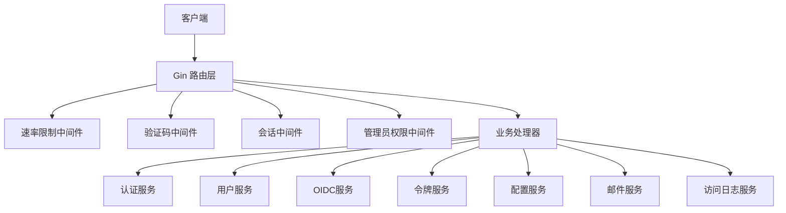
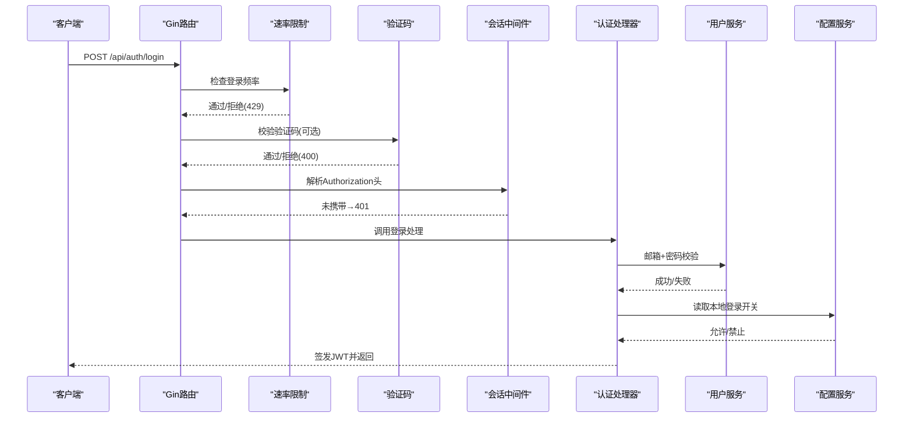
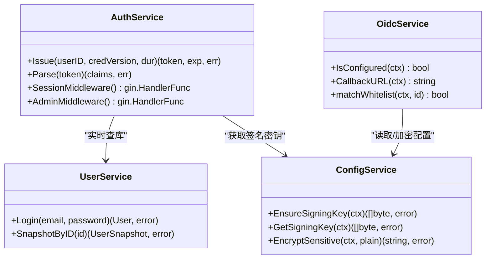
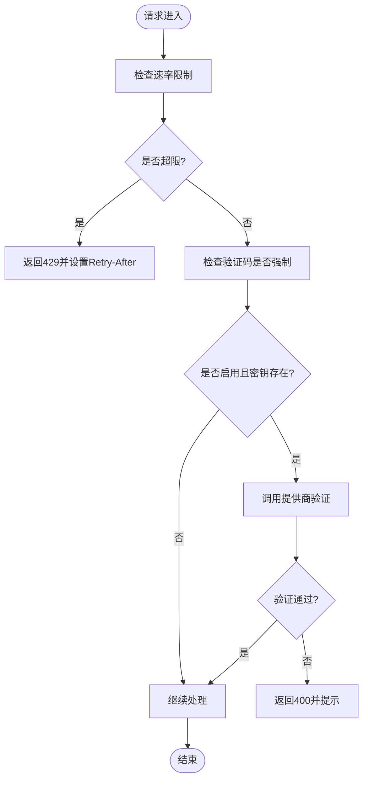
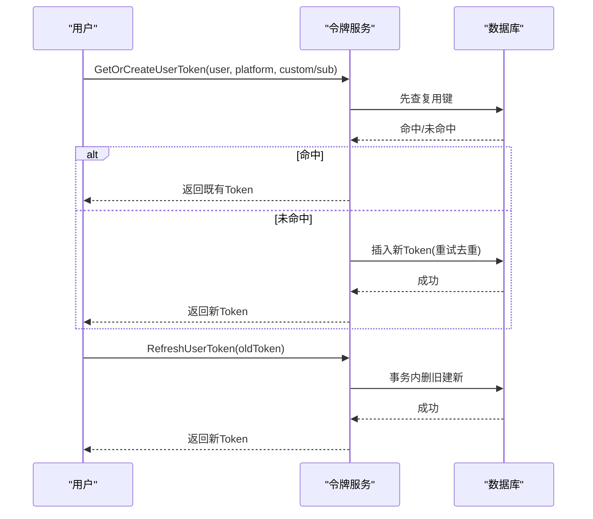
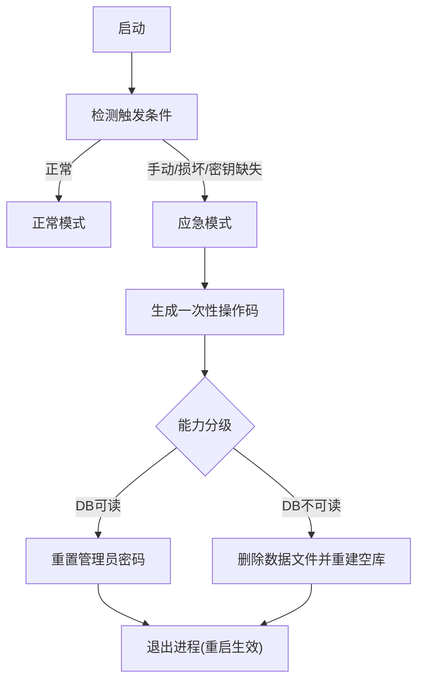
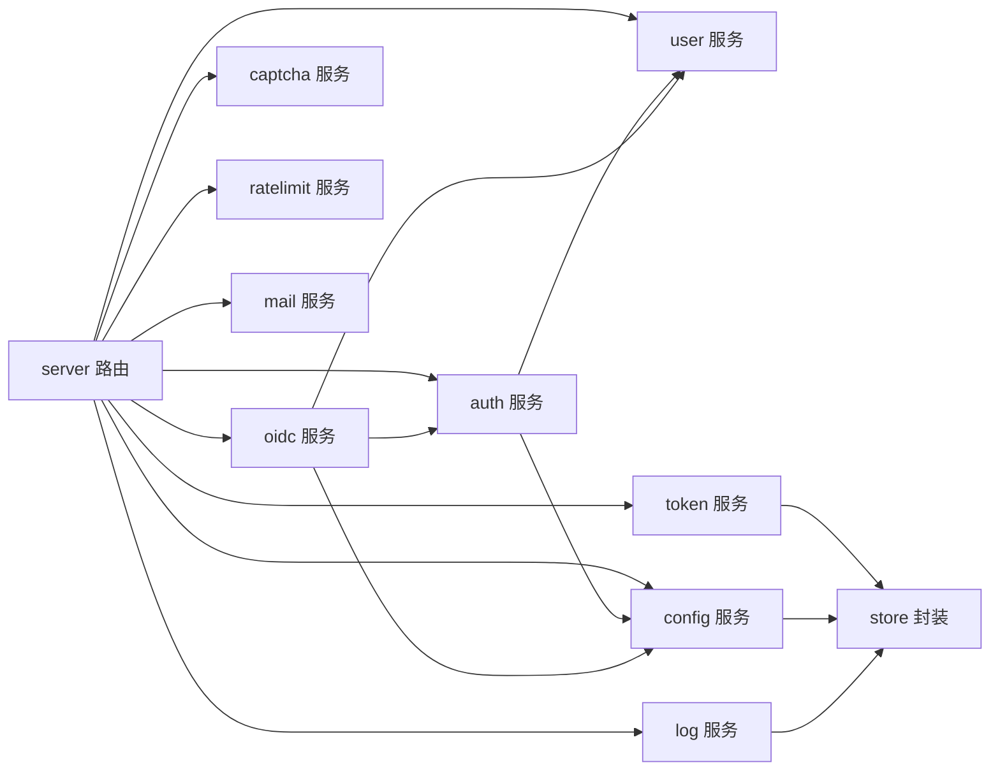

# 安全考虑

<cite>
**本文引用的文件**
- [backend/internal/auth/auth.go](file://backend/internal/auth/auth.go)
- [backend/internal/oidc/oidc.go](file://backend/internal/oidc/oidc.go)
- [backend/internal/ratelimit/ratelimit.go](file://backend/internal/ratelimit/ratelimit.go)
- [backend/internal/captcha/captcha.go](file://backend/internal/captcha/captcha.go)
- [backend/internal/token/token.go](file://backend/internal/token/token.go)
- [backend/internal/config/config.go](file://backend/internal/config/config.go)
- [backend/internal/log/access.go](file://backend/internal/log/access.go)
- [backend/internal/server/auth.go](file://backend/internal/server/auth.go)
- [backend/internal/user/user.go](file://backend/internal/user/user.go)
- [backend/internal/emergency/emergency.go](file://backend/internal/emergency/emergency.go)
- [backend/internal/setup/setup.go](file://backend/internal/setup/setup.go)
- [backend/internal/mail/mail.go](file://backend/internal/mail/mail.go)
- [backend/cmd/server/main.go](file://backend/cmd/server/main.go)
- [frontend/index.html](file://frontend/index.html)
- [Design1.md](../../../../../docs/reports/Design/Design1.md)
</cite>

## 目录
1. [简介](#简介)
2. [项目结构](#项目结构)
3. [核心组件](#核心组件)
4. [架构总览](#架构总览)
5. [详细组件分析](#详细组件分析)
6. [依赖关系分析](#依赖关系分析)
7. [性能与安全权衡](#性能与安全权衡)
8. [故障排查指南](#故障排查指南)
9. [结论](#结论)
10. [附录：最佳实践与渗透测试建议](#附录最佳实践与渗透测试建议)

## 简介
本文件面向VPN订阅管理系统的安全设计与防护，覆盖认证授权（JWT、OIDC、密码哈希）、输入校验与过滤、SQL注入防护、XSS防护、速率限制、验证码集成、访问日志审计、敏感配置加密存储、应急恢复机制等。同时提供安全配置最佳实践、漏洞扫描建议与应急响应流程，并给出常见威胁的防护方案与渗透测试指导。

## 项目结构
后端采用分层模块化设计：
- 接入层（server）：路由注册、中间件链（限流、验证码、会话鉴权、管理员权限）。
- 业务层：auth（会话与密码）、oidc（OIDC集成）、user（用户与首管理员）、token（下载/分享/规则令牌）、config（系统配置与敏感数据加解密）、captcha（验证码服务）、ratelimit（速率限制）、mail（SMTP邮件）、log（访问日志）、emergency（应急恢复）、setup（初始化引导）。
- 基础设施：store（数据库封装）、migrations（迁移脚本）、cron（定时清理）。
- 前端：CSP策略、验证码组件、管理面板危险操作二次确认。

图表来源
- [backend/internal/server/auth.go:25-34](file://backend/internal/server/auth.go#L25-L34)
- [backend/internal/ratelimit/ratelimit.go:40-59](file://backend/internal/ratelimit/ratelimit.go#L40-L59)
- [backend/internal/captcha/captcha.go:110-127](file://backend/internal/captcha/captcha.go#L110-L127)
- [backend/internal/auth/auth.go:145-179](file://backend/internal/auth/auth.go#L145-L179)

章节来源
- [backend/internal/server/auth.go:25-34](file://backend/internal/server/auth.go#L25-L34)
- [backend/cmd/server/main.go:24-99](file://backend/cmd/server/main.go#L24-L99)

## 核心组件
- 认证与会话：基于HS256签名的JWT，最小载荷（用户ID、凭据版本），每次请求实时查库校验状态与凭据版本；支持“记住我”与OIDC固定会话时长。
- OIDC集成：发现文档缓存、PKCE授权流、白名单匹配、敏感参数加密存储。
- 速率限制：按IP固定窗口计数，可配置阈值，超限返回429与Retry-After。
- 验证码：reCAPTCHA/Turnstile，页面级强制校验，密钥缺失时降级并记录告警。
- 令牌体系：下载Token三态复用键、轮替与生命周期联动；分享/规则Token创建与轮替。
- 配置与敏感数据：AES-256-GCM加密落库，签名密钥由Setup生成并派生加密密钥。
- 访问日志：按日期范围分页查询，90天自动清理。
- 应急恢复：手动/自动触发，一次性操作码，重置管理员密码与重新初始化。

章节来源
- [backend/internal/auth/auth.go:22-135](file://backend/internal/auth/auth.go#L22-L135)
- [backend/internal/oidc/oidc.go:23-239](file://backend/internal/oidc/oidc.go#L23-L239)
- [backend/internal/ratelimit/ratelimit.go:17-89](file://backend/internal/ratelimit/ratelimit.go#L17-L89)
- [backend/internal/captcha/captcha.go:23-131](file://backend/internal/captcha/captcha.go#L23-L131)
- [backend/internal/token/token.go:1-244](file://backend/internal/token/token.go#L1-L244)
- [backend/internal/config/config.go:24-361](file://backend/internal/config/config.go#L24-L361)
- [backend/internal/log/access.go:16-123](file://backend/internal/log/access.go#L16-L123)
- [backend/internal/emergency/emergency.go:1-213](file://backend/internal/emergency/emergency.go#L1-L213)

## 架构总览
下图展示登录/注册链路中的安全中间件链路与关键校验点。

图表来源
- [backend/internal/server/auth.go:25-34](file://backend/internal/server/auth.go#L25-L34)
- [backend/internal/ratelimit/ratelimit.go:40-59](file://backend/internal/ratelimit/ratelimit.go#L40-L59)
- [backend/internal/captcha/captcha.go:110-127](file://backend/internal/captcha/captcha.go#L110-L127)
- [backend/internal/auth/auth.go:145-179](file://backend/internal/auth/auth.go#L145-L179)
- [backend/internal/user/user.go:170-187](file://backend/internal/user/user.go#L170-L187)
- [backend/internal/config/config.go:24-37](file://backend/internal/config/config.go#L24-L37)

## 详细组件分析

### 认证与授权（JWT、OIDC、密码）
- JWT签发与校验：使用HS256签名，载荷仅含用户ID与凭据版本；解析时严格限定算法为HMAC，避免弱算法攻击。
- 会话中间件：每次请求从数据库拉取用户快照，比对credential_version与status=active，防止越权与失效会话。
- 管理员权限：AdminMiddleware叠加在会话中间件之后，确保管理端点仅admin角色可访问。
- OIDC集成：发现文档缓存、白名单匹配、敏感参数加密存储；回调地址由前端URL推导。
- 密码安全：bcrypt哈希，统一最小长度校验；重置流程用后即删令牌，成功后递增credential_version使旧会话失效。

图表来源
- [backend/internal/auth/auth.go:66-135](file://backend/internal/auth/auth.go#L66-L135)
- [backend/internal/auth/auth.go:145-192](file://backend/internal/auth/auth.go#L145-L192)
- [backend/internal/user/user.go:170-202](file://backend/internal/user/user.go#L170-L202)
- [backend/internal/oidc/oidc.go:75-155](file://backend/internal/oidc/oidc.go#L75-L155)
- [backend/internal/config/config.go:282-361](file://backend/internal/config/config.go#L282-L361)

章节来源
- [backend/internal/auth/auth.go:22-192](file://backend/internal/auth/auth.go#L22-L192)
- [backend/internal/user/user.go:170-202](file://backend/internal/user/user.go#L170-L202)
- [backend/internal/oidc/oidc.go:75-239](file://backend/internal/oidc/oidc.go#L75-L239)
- [backend/internal/config/config.go:282-361](file://backend/internal/config/config.go#L282-L361)

### 输入验证与过滤、SQL注入防护、XSS防护
- 输入验证：注册/登录/重置等接口使用结构化绑定与长度限制；邮箱规范化（trim、小写、控制字符拒绝）；密码复杂度校验。
- SQL注入防护：所有查询使用参数化语句（?占位符），无字符串拼接；事务内读配置避免连接池死锁。
- XSS防护：前端启用Content Security Policy（CSP），仅放行验证码脚本外链；样式按需放宽unsafe-inline以兼容框架动态样式。
- 路径穿越防护：设计文档要求所有含用户输入的路径操作进行防穿越校验（如..逃逸）。

章节来源
- [backend/internal/server/auth.go:36-42](file://backend/internal/server/auth.go#L36-L42)
- [backend/internal/user/user.go:84-91](file://backend/internal/user/user.go#L84-L91)
- [backend/internal/config/config.go:57-79](file://backend/internal/config/config.go#L57-L79)
- [frontend/index.html:7-9](file://frontend/index.html#L7-L9)
- [Design1.md:846-851](../../../../../docs/reports/Design/Design1.md#L846-L851)

### 速率限制与验证码集成
- 速率限制：按IP维度固定窗口计数，分钟槽粒度；可配置阈值（登录/注册/找回密码/下载）；超限返回429与Retry-After头。
- 验证码：支持reCAPTCHA/Turnstile；页面级强制校验；密钥缺失时跳过校验并记录warn日志；通过ShouldBindBodyWithJSON避免重复读取body。

图表来源
- [backend/internal/ratelimit/ratelimit.go:40-59](file://backend/internal/ratelimit/ratelimit.go#L40-L59)
- [backend/internal/captcha/captcha.go:41-58](file://backend/internal/captcha/captcha.go#L41-L58)
- [backend/internal/captcha/captcha.go:60-106](file://backend/internal/captcha/captcha.go#L60-L106)
- [backend/internal/captcha/captcha.go:110-127](file://backend/internal/captcha/captcha.go#L110-L127)

章节来源
- [backend/internal/ratelimit/ratelimit.go:17-89](file://backend/internal/ratelimit/ratelimit.go#L17-L89)
- [backend/internal/captcha/captcha.go:23-131](file://backend/internal/captcha/captcha.go#L23-L131)

### 令牌体系与生命周期联动
- 下载Token：三态复用键（无标识/自定义/显式订阅），并发首建先查后建；轮替时同事务删旧建新；删除场景（组上传覆盖、订阅删除、自定义删除、角色降级）级联清理。
- 分享/规则Token：创建时自动生成；轮替时旧删新写并刷新时间戳；吊销即物理删除。

图表来源
- [backend/internal/token/token.go:48-88](file://backend/internal/token/token.go#L48-L88)
- [backend/internal/token/token.go:125-156](file://backend/internal/token/token.go#L125-L156)
- [backend/internal/token/token.go:176-235](file://backend/internal/token/token.go#L176-L235)

章节来源
- [backend/internal/token/token.go:1-244](file://backend/internal/token/token.go#L1-L244)

### 敏感配置加密与导出导入
- 敏感配置：smtp_password、OIDC client_secret等以AES-256-GCM密文落库；加密密钥由签名密钥经HKDF派生，单一密钥管理。
- 导出导入：导出需密码保护；导入需确认词与正确密码解密；错误密码导致解密失败。

章节来源
- [backend/internal/config/config.go:39-46](file://backend/internal/config/config.go#L39-L46)
- [backend/internal/config/config.go:220-280](file://backend/internal/config/config.go#L220-L280)
- [backend/internal/config/config.go:335-361](file://backend/internal/config/config.go#L335-L361)
- [backend/internal/mail/mail.go:19-40](file://backend/internal/mail/mail.go#L19-L40)

### 访问日志与审计
- 访问日志：记录用户、IP、下载类型、平台、资源标识、状态与失败原因；支持按日期范围分页查询与清空。
- 自动清理：90天定时任务清理历史日志，降低存储压力。

章节来源
- [backend/internal/log/access.go:16-123](file://backend/internal/log/access.go#L16-L123)
- [backend/cmd/server/main.go:89-91](file://backend/cmd/server/main.go#L89-L91)

### 应急恢复模式
- 触发条件：环境变量手动触发、数据库损坏/不可读、关键配置损坏（configured=true但签名密钥缺失）。
- 能力分级：数据库可读时可重置管理员密码；不可读时执行文件级重建。
- 一次性操作码：进程内存中保存，每次提交即消耗并重新生成，恒定时间比较防时序侧信道。

图表来源
- [backend/internal/emergency/emergency.go:50-66](file://backend/internal/emergency/emergency.go#L50-L66)
- [backend/internal/emergency/emergency.go:91-116](file://backend/internal/emergency/emergency.go#L91-L116)
- [backend/internal/emergency/emergency.go:118-213](file://backend/internal/emergency/emergency.go#L118-L213)
- [backend/cmd/server/main.go:42-59](file://backend/cmd/server/main.go#L42-L59)

章节来源
- [backend/internal/emergency/emergency.go:1-213](file://backend/internal/emergency/emergency.go#L1-L213)
- [backend/cmd/server/main.go:42-59](file://backend/cmd/server/main.go#L42-L59)

## 依赖关系分析
- 模块耦合：auth依赖config与user；oidc依赖config、auth、user；server聚合各服务；ratelimit与captcha作为中间件独立可插拔。
- 外部依赖：Gin路由、JWT库、bcrypt、HTTP客户端（超时与限长）、SQLite（store封装）。
- 循环依赖规避：log包通过*sql.DB注入避免与store循环依赖；user实现auth.UserSource接口解耦。

图表来源
- [backend/internal/server/auth.go:25-34](file://backend/internal/server/auth.go#L25-L34)
- [backend/internal/auth/auth.go:87-96](file://backend/internal/auth/auth.go#L87-L96)
- [backend/internal/oidc/oidc.go:53-73](file://backend/internal/oidc/oidc.go#L53-L73)
- [backend/internal/log/access.go:16-25](file://backend/internal/log/access.go#L16-L25)

章节来源
- [backend/internal/server/auth.go:25-34](file://backend/internal/server/auth.go#L25-L34)
- [backend/internal/log/access.go:16-25](file://backend/internal/log/access.go#L16-L25)

## 性能与安全权衡
- 会话校验实时查库：安全性高但增加数据库负载；可通过合理索引与连接池优化缓解。
- 速率限制内存桶：简单高效，注意GC周期清理过期槽；生产环境可考虑Redis集中式限流。
- 验证码第三方API：网络失败降级并记录告警；需设置超时与重试上限，避免阻塞主流程。
- 大文件上传：安装包流式落盘避免整读内存；反代层调整client_max_body_size，前后端双重大小校验。

[本节为通用指导，不直接分析具体文件]

## 故障排查指南
- 登录失败：检查本地登录开关、邮箱格式、密码复杂度、账号状态；查看限流与验证码状态。
- 会话无效：确认JWT算法匹配、签名密钥存在、用户快照有效且credential_version一致。
- 验证码失败：核对provider与secret_key配置；网络不可达或响应异常时返回明确错误。
- 访问日志为空：检查日期范围解析与分页参数；确认定时清理任务运行。
- 应急模式：查看触发原因与操作码；数据库可读时重置管理员密码，不可读时执行文件重建。

章节来源
- [backend/internal/server/auth.go:99-134](file://backend/internal/server/auth.go#L99-L134)
- [backend/internal/auth/auth.go:145-179](file://backend/internal/auth/auth.go#L145-L179)
- [backend/internal/captcha/captcha.go:60-106](file://backend/internal/captcha/captcha.go#L60-L106)
- [backend/internal/log/access.go:41-92](file://backend/internal/log/access.go#L41-L92)
- [backend/internal/emergency/emergency.go:50-66](file://backend/internal/emergency/emergency.go#L50-L66)

## 结论
系统在认证授权、输入校验、SQL注入防护、XSS防护、速率限制、验证码、访问日志、敏感配置加密与应急恢复等方面具备完整的安全设计。通过中间件链与业务层协同，形成纵深防御；结合CSP、参数化查询与最小权限原则，有效降低常见攻击面。建议在生产环境持续加固配置、定期扫描与演练应急响应。

[本节为总结性内容，不直接分析具体文件]

## 附录：最佳实践与渗透测试建议

### 安全配置最佳实践
- 启用HTTPS与严格CSP，仅放行必要外链；生产环境关闭调试与开发特性。
- 配置TRUST_PROXY为auto或on（根据部署拓扑），确保ClientIP与前端URL推导正确。
- 开启本地登录与自注册的最小可用策略；必要时启用审批与白名单。
- 启用验证码于高风险入口（登录/注册/找回密码），并确保密钥配置与网络可达。
- 设置合理的速率限制阈值，并根据流量特征调优。
- 定期轮换签名密钥与敏感配置；导出导入需强密码与确认词。
- 启用访问日志并配置90天自动清理；保留足够审计窗口。

章节来源
- [frontend/index.html:7-9](file://frontend/index.html#L7-L9)
- [backend/internal/setup/setup.go:159-196](file://backend/internal/setup/setup.go#L159-L196)
- [backend/internal/ratelimit/ratelimit.go:17-23](file://backend/internal/ratelimit/ratelimit.go#L17-L23)
- [backend/internal/captcha/captcha.go:23-28](file://backend/internal/captcha/captcha.go#L23-L28)
- [backend/internal/log/access.go:89-91](file://backend/internal/log/access.go#L89-L91)

### 漏洞扫描与加固建议
- 依赖扫描：定期扫描Go模块与前端npm依赖，修复已知CVE。
- 代码审计：关注参数化查询、输入校验、错误信息泄露、敏感信息输出。
- 运行时防护：WAF规则拦截常见攻击向量；限制请求体大小与超时。
- 配置基线：禁用不必要的功能（如调试端点、默认账户）；最小权限原则。

[本节为通用指导，不直接分析具体文件]

### 应急响应流程
- 触发判定：环境变量手动触发或自动检测（数据库损坏/密钥缺失）。
- 能力分级：数据库可读时重置管理员密码；不可读时执行文件重建。
- 操作码保护：一次性操作码，恒定时间比较；每次提交即消耗并重新生成。
- 回滚与恢复：一键清空数据后回到Setup流程；会话与令牌全部失效。

章节来源
- [backend/internal/emergency/emergency.go:50-66](file://backend/internal/emergency/emergency.go#L50-L66)
- [backend/internal/emergency/emergency.go:91-116](file://backend/internal/emergency/emergency.go#L91-L116)
- [backend/internal/emergency/emergency.go:188-213](file://backend/internal/emergency/emergency.go#L188-L213)

### 渗透测试指导
- 认证绕过：尝试JWT算法替换、密钥泄露、会话劫持；验证中间件链顺序与权限校验。
- 暴力破解：测试速率限制与验证码有效性；观察429与400响应。
- 注入攻击：对输入字段进行SQL注入与命令注入测试；验证参数化查询与过滤。
- XSS与CSP：尝试注入脚本与事件处理器；验证CSP策略是否阻断。
- 越权访问：横向/纵向越权测试；验证会话中间件与管理员中间件组合。
- 文件上传：测试大小限制、流式落盘、路径穿越；验证反代配置。
- 应急模式：验证一次性操作码与能力分级；确认重置与重建流程安全。

[本节为通用指导，不直接分析具体文件]