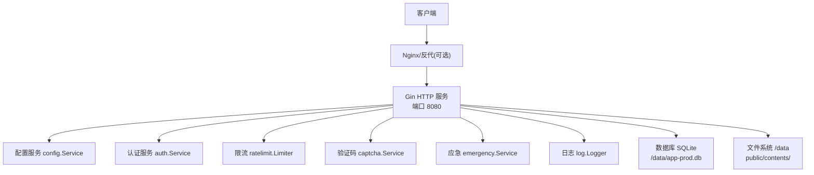
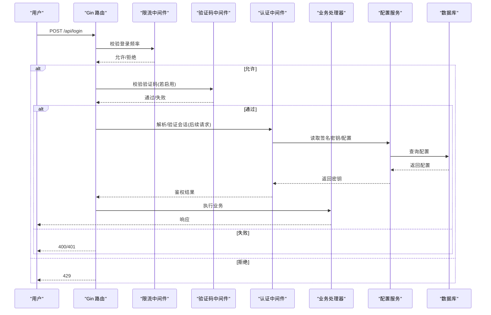
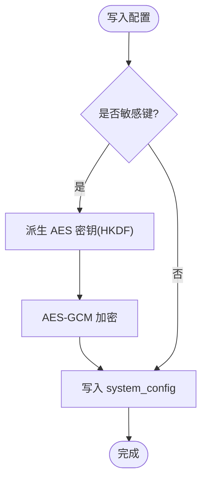
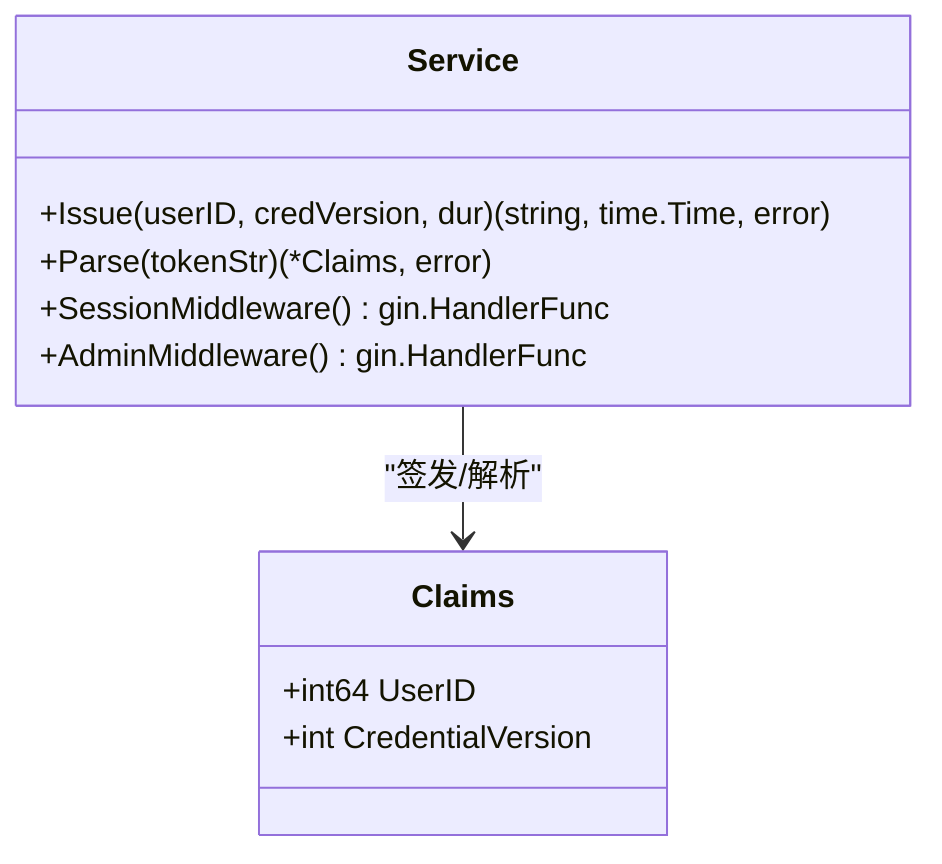
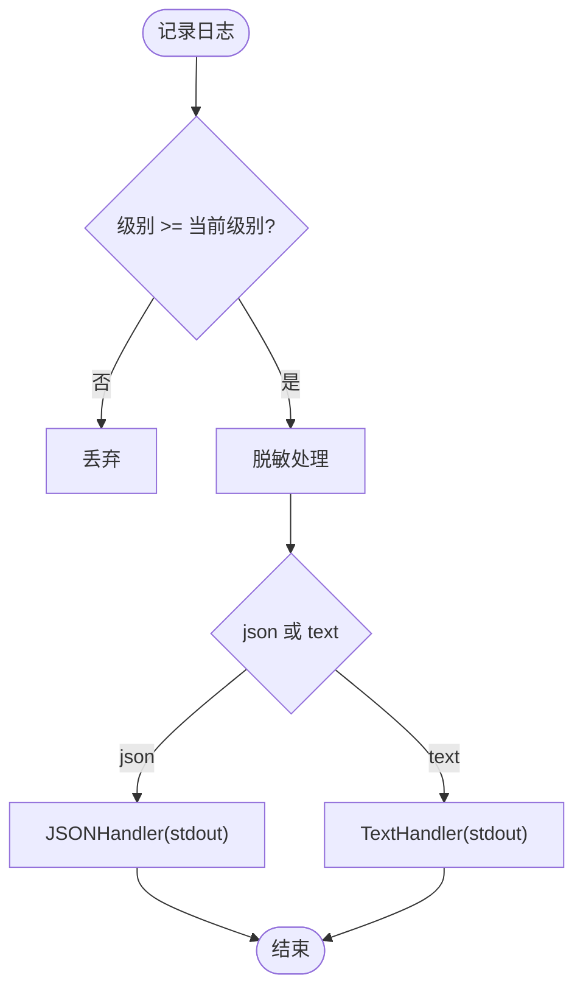
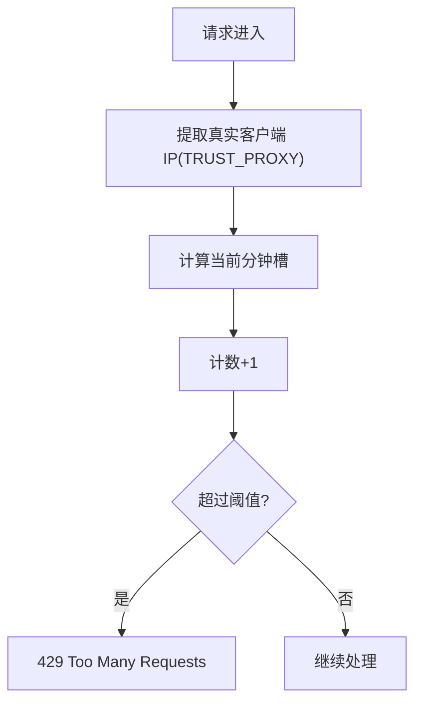
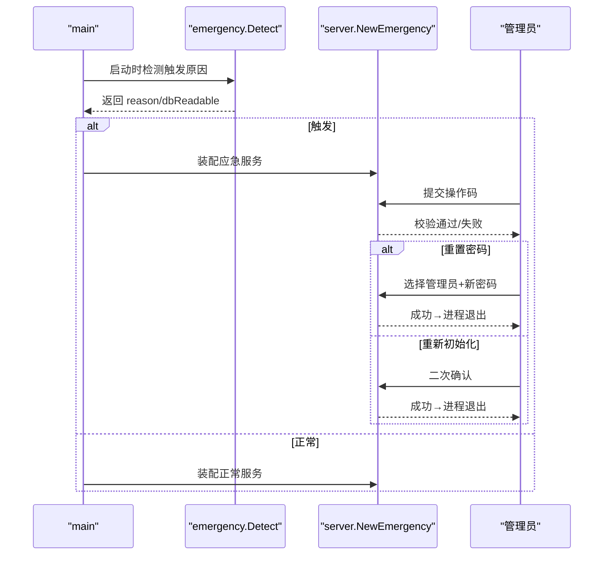
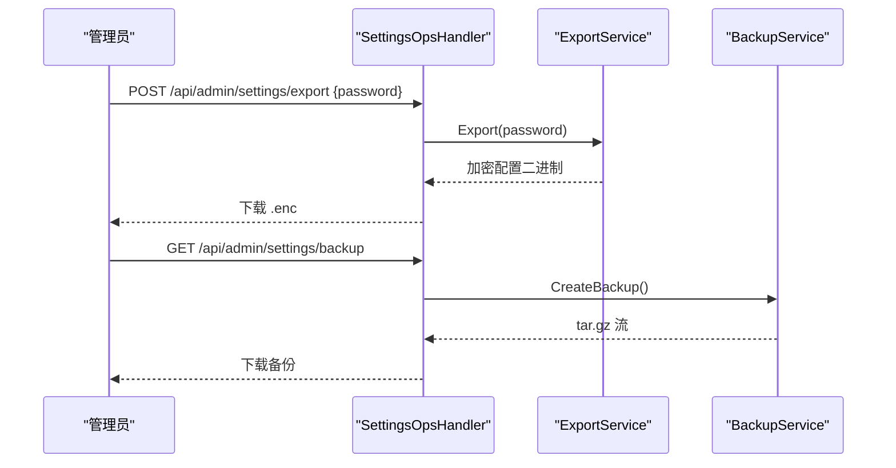
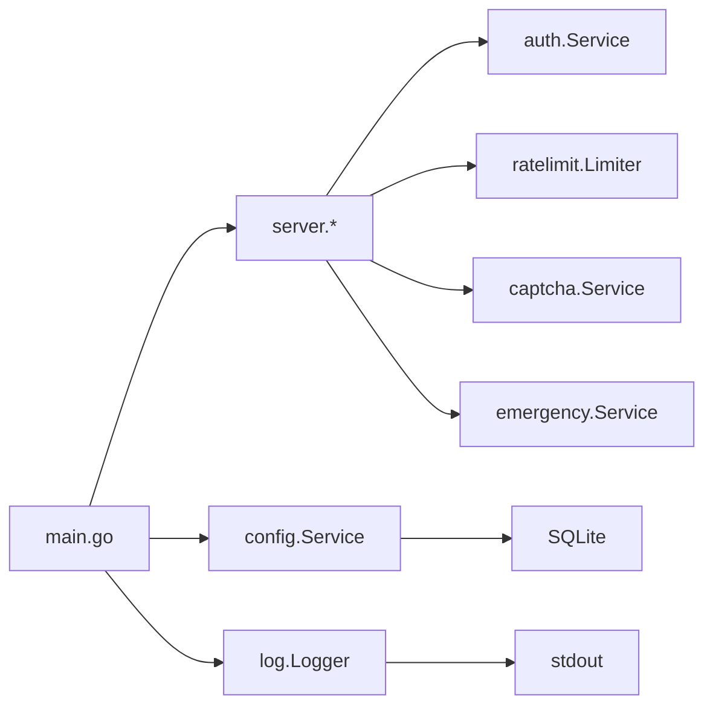

# 安全配置最佳实践

<cite>
**本文引用的文件**
- [backend/internal/config/config.go](file://backend/internal/config/config.go)
- [backend/internal/config/admin.go](file://backend/internal/config/admin.go)
- [backend/internal/auth/auth.go](file://backend/internal/auth/auth.go)
- [backend/internal/log/log.go](file://backend/internal/log/log.go)
- [backend/internal/ratelimit/ratelimit.go](file://backend/internal/ratelimit/ratelimit.go)
- [backend/internal/captcha/captcha.go](file://backend/internal/captcha/captcha.go)
- [backend/internal/emergency/emergency.go](file://backend/internal/emergency/emergency.go)
- [backend/internal/server/settings_ops.go](file://backend/internal/server/settings_ops.go)
- [backend/cmd/server/main.go](file://backend/cmd/server/main.go)
- [Dockerfile](file://Dockerfile)
- [docker-compose.yml](file://docker-compose.yml)
- [docker-compose.yml.example](file://docker-compose.yml.example)
</cite>

## 目录
1. [简介](#简介)
2. [项目结构](#项目结构)
3. [核心组件](#核心组件)
4. [架构总览](#架构总览)
5. [详细组件分析](#详细组件分析)
6. [依赖关系分析](#依赖关系分析)
7. [性能与安全权衡](#性能与安全权衡)
8. [故障排查指南](#故障排查指南)
9. [结论](#结论)
10. [附录：生产部署清单与基线检查](#附录生产部署清单与基线检查)

## 简介
本文件面向生产环境，提供系统的安全配置最佳实践，覆盖环境变量管理、容器安全、密码策略、会话超时、日志级别、访问控制、备份与恢复、应急模式、变更审批与回滚等。文档基于代码库中的实际实现进行说明，确保可落地、可审计、可回滚。

## 项目结构
- 后端服务以 Go 编写，采用分层架构：入口(main)、HTTP路由(server)、业务逻辑(internal/*)、配置存储(config)、认证(auth)、日志(log)、限流(ratelimit)、验证码(captcha)、应急(emergency)。
- 容器化构建使用多阶段 Dockerfile，最小运行时镜像运行非 root 用户；数据持久化通过卷挂载到 /data。
- 部署编排使用 docker-compose，支持两种接入方式（推荐公网反代 + 仅绑定回环；或内网直连）。

**图示来源**
- [backend/cmd/server/main.go:24-98](file://backend/cmd/server/main.go#L24-L98)
- [backend/internal/config/config.go:48-111](file://backend/internal/config/config.go#L48-L111)
- [backend/internal/auth/auth.go:87-135](file://backend/internal/auth/auth.go#L87-L135)
- [backend/internal/ratelimit/ratelimit.go:25-60](file://backend/internal/ratelimit/ratelimit.go#L25-L60)
- [backend/internal/captcha/captcha.go:30-58](file://backend/internal/captcha/captcha.go#L30-L58)
- [backend/internal/emergency/emergency.go:36-85](file://backend/internal/emergency/emergency.go#L36-L85)
- [backend/internal/log/log.go:40-57](file://backend/internal/log/log.go#L40-L57)

**章节来源**
- [backend/cmd/server/main.go:24-98](file://backend/cmd/server/main.go#L24-L98)
- [Dockerfile:1-31](file://Dockerfile#L1-L31)
- [docker-compose.yml:1-28](file://docker-compose.yml#L1-L28)
- [docker-compose.yml.example:5-41](file://docker-compose.yml.example#L5-L41)

## 核心组件
- 配置服务：集中管理 system_config 表键值对，敏感字段自动加密落库，支持事务读写、类型化读取、运行时日志级别切换。
- 认证服务：JWT 签发与校验、密码哈希与复杂度校验、会话中间件、管理员角色校验。
- 日志服务：分级输出、JSON/控制台双格式、token 脱敏处理器、运行时级别切换。
- 限流服务：按 IP 固定窗口计数，分钟级限流，可配置阈值并立即生效。
- 验证码服务：reCAPTCHA/Turnstile 服务端校验，页面级强制开关，密钥缺失时降级并告警。
- 应急服务：手动/自动触发、一次性操作码、能力分级（重置管理员密码/重新初始化）、进程退出由编排重启。
- 运维端点：一键清空、配置导入导出（仅生产）、备份下载、Setup 导入（未配置态暴露且限流）。

**章节来源**
- [backend/internal/config/config.go:24-111](file://backend/internal/config/config.go#L24-L111)
- [backend/internal/auth/auth.go:22-135](file://backend/internal/auth/auth.go#L22-L135)
- [backend/internal/log/log.go:11-57](file://backend/internal/log/log.go#L11-L57)
- [backend/internal/ratelimit/ratelimit.go:17-60](file://backend/internal/ratelimit/ratelimit.go#L17-L60)
- [backend/internal/captcha/captcha.go:23-58](file://backend/internal/captcha/captcha.go#L23-L58)
- [backend/internal/emergency/emergency.go:23-85](file://backend/internal/emergency/emergency.go#L23-L85)
- [backend/internal/server/settings_ops.go:19-38](file://backend/internal/server/settings_ops.go#L19-L38)

## 架构总览
下图展示关键安全路径：登录/注册/找回密码经过限流与验证码校验；会话凭据经 JWT 签发与校验；敏感配置加密存储；日志脱敏；应急模式阻断业务 API 并提供救援能力。

**图示来源**
- [backend/internal/ratelimit/ratelimit.go:40-60](file://backend/internal/ratelimit/ratelimit.go#L40-L60)
- [backend/internal/captcha/captcha.go:108-127](file://backend/internal/captcha/captcha.go#L108-L127)
- [backend/internal/auth/auth.go:144-179](file://backend/internal/auth/auth.go#L144-L179)
- [backend/internal/config/config.go:57-111](file://backend/internal/config/config.go#L57-L111)

## 详细组件分析

### 配置与敏感数据保护
- 敏感键集合：通过 RegisterSensitive 登记后，写入自动加密、读取自动解密；密文无法解密直接报错，防止静默使用损坏数据。
- 加密方案：AES-256-GCM，密钥由签名密钥经 HKDF-SHA256 派生；nonce 随机生成；base64url 编码。
- 签名密钥：首次使用时 EnsureSigningKey 生成 32 字节随机值并落库；事务内 EnsureSigningKeyTx 保证 Setup/OIDC 设置原子性。
- 配置键示例：log_level、app_mode、allow_local_login、allow_selfreg、selfreg_approval、frontend_url、callback_url 等。

**图示来源**
- [backend/internal/config/config.go:94-111](file://backend/internal/config/config.go#L94-L111)
- [backend/internal/config/config.go:220-280](file://backend/internal/config/config.go#L220-L280)
- [backend/internal/config/config.go:294-333](file://backend/internal/config/config.go#L294-L333)

**章节来源**
- [backend/internal/config/config.go:24-111](file://backend/internal/config/config.go#L24-L111)
- [backend/internal/config/config.go:220-361](file://backend/internal/config/config.go#L220-L361)

### 认证与会话安全
- 密码策略：统一最小长度 8 字符；bcrypt 哈希；所有本地密码入口一致。
- 会话时长：记住我 7 天；不勾选 24 小时；OIDC 固定 7 天。
- 凭据载荷：仅包含 user_id 与 credential_version，权限信息每次实时查库，避免缓存越权。
- 中间件：SessionMiddleware 解析令牌 → 实时查库比对 credential_version → 校验状态 active；AdminMiddleware 叠加角色 admin 校验。

**图示来源**
- [backend/internal/auth/auth.go:22-135](file://backend/internal/auth/auth.go#L22-L135)
- [backend/internal/auth/auth.go:144-192](file://backend/internal/auth/auth.go#L144-L192)

**章节来源**
- [backend/internal/auth/auth.go:22-135](file://backend/internal/auth/auth.go#L22-L135)
- [backend/internal/auth/auth.go:144-192](file://backend/internal/auth/auth.go#L144-L192)

### 日志与脱敏
- 日志级别：debug/info/warn/error，运行时 SetLevel 立即生效；默认 info。
- 输出格式：console/json 双格式；stdout 输出。
- 脱敏：RedactHandler 对消息与字符串属性中的 token=xxx 参数值替换为 ***，防止泄露。

**图示来源**
- [backend/internal/log/log.go:21-57](file://backend/internal/log/log.go#L21-L57)
- [backend/internal/log/log.go:62-118](file://backend/internal/log/log.go#L62-L118)

**章节来源**
- [backend/internal/log/log.go:11-57](file://backend/internal/log/log.go#L11-L57)
- [backend/internal/log/log.go:62-118](file://backend/internal/log/log.go#L62-L118)

### 访问控制与速率限制
- 限流维度：按 IP 固定窗口（每分钟），作用域 scope+IP+分钟槽。
- 阈值配置：login/register/forgot/download，修改后立即生效。
- 验证码：页面级强制开关，密钥缺失时跳过校验并记 warn；支持 reCAPTCHA/Turnstile。

**图示来源**
- [backend/internal/ratelimit/ratelimit.go:40-60](file://backend/internal/ratelimit/ratelimit.go#L40-L60)
- [backend/internal/captcha/captcha.go:41-58](file://backend/internal/captcha/captcha.go#L41-L58)

**章节来源**
- [backend/internal/ratelimit/ratelimit.go:17-60](file://backend/internal/ratelimit/ratelimit.go#L17-L60)
- [backend/internal/captcha/captcha.go:23-58](file://backend/internal/captcha/captcha.go#L23-L58)

### 应急恢复模式
- 触发条件：环境变量 RESET_ADMIN_PASSWORD 手动触发；数据库不可读/损坏；configured=true 但签名密钥缺失。
- 一次性操作码：8 位字符集（去易混淆），内存存储，每次提交即消耗失效并重新生成。
- 能力分级：仅环境变量触发且数据库可读时提供重置管理员密码；否则仅保留重新初始化。
- 行为：应急期间业务 API 与下载端点返回 503；健康检查返回 503；仅白名单路由可用。

**图示来源**
- [backend/internal/emergency/emergency.go:50-85](file://backend/internal/emergency/emergency.go#L50-L85)
- [backend/internal/emergency/emergency.go:108-116](file://backend/internal/emergency/emergency.go#L108-L116)
- [backend/internal/emergency/emergency.go:120-186](file://backend/internal/emergency/emergency.go#L120-L186)
- [backend/cmd/server/main.go:70-75](file://backend/cmd/server/main.go#L70-L75)

**章节来源**
- [backend/internal/emergency/emergency.go:23-85](file://backend/internal/emergency/emergency.go#L23-L85)
- [backend/internal/emergency/emergency.go:108-213](file://backend/internal/emergency/emergency.go#L108-L213)
- [backend/cmd/server/main.go:70-75](file://backend/cmd/server/main.go#L70-L75)

### 运维端点与数据安全
- 一键清空：需确认词 RESET + 二次确认；先清库再删文件；内存态复位；回到未配置状态。
- 配置导出：仅生产模式；导出密码 ≥8 字符；整体加密下载。
- 配置导入：面板导入需会话+管理员；Setup 导入在未配置态暴露，叠加限流；严格整体覆盖；导入后签名密钥替换导致全部会话失效。
- 备份下载：SQLite 一致性快照 + 版本文件 + public 资源打包 tar.gz。

**图示来源**
- [backend/internal/server/settings_ops.go:56-80](file://backend/internal/server/settings_ops.go#L56-L80)
- [backend/internal/server/settings_ops.go:141-151](file://backend/internal/server/settings_ops.go#L141-L151)

**章节来源**
- [backend/internal/server/settings_ops.go:19-38](file://backend/internal/server/settings_ops.go#L19-L38)
- [backend/internal/server/settings_ops.go:56-151](file://backend/internal/server/settings_ops.go#L56-L151)

## 依赖关系分析
- main 负责环境变量解析、日志初始化、数据库迁移、应急检测、服务装配与优雅退出。
- server 层将 session/admin 中间件与业务路由组合；settings_ops 提供运维能力。
- config 被 auth、admin、captcha、ratelimit、emergency 等多处引用，作为配置中心。
- log 提供全局 logger 与运行时级别控制；token 脱敏贯穿所有日志输出。

**图示来源**
- [backend/cmd/server/main.go:24-98](file://backend/cmd/server/main.go#L24-L98)
- [backend/internal/server/settings_ops.go:19-38](file://backend/internal/server/settings_ops.go#L19-L38)

**章节来源**
- [backend/cmd/server/main.go:24-98](file://backend/cmd/server/main.go#L24-L98)
- [backend/internal/server/settings_ops.go:19-38](file://backend/internal/server/settings_ops.go#L19-L38)

## 性能与安全权衡
- 日志级别：生产默认 info，调试期可临时提升 debug，注意磁盘 IO 与敏感信息脱敏。
- 限流阈值：根据业务量调整 login/register/forgot/download，避免误伤正常用户。
- 验证码：密钥缺失时降级并告警，避免阻塞主流程；建议尽快补齐密钥。
- 备份：WAL checkpoint 或 VACUUM INTO 一致性快照，避免影响在线服务。

[本节为通用指导，无需特定文件来源]

## 故障排查指南
- 登录失败：检查 TRUST_PROXY 设置是否正确解析真实 IP；查看限流与验证码中间件日志。
- 会话无效：确认签名密钥存在；credential_version 是否递增；管理员禁用/重置密码会失效旧会话。
- 配置错误：敏感字段解密失败会报错；检查 system_config 中对应键是否存在。
- 应急模式：从运行日志获取一次性操作码；根据触发原因执行重置密码或重新初始化。

**章节来源**
- [backend/internal/ratelimit/ratelimit.go:40-60](file://backend/internal/ratelimit/ratelimit.go#L40-L60)
- [backend/internal/captcha/captcha.go:41-58](file://backend/internal/captcha/captcha.go#L41-L58)
- [backend/internal/config/config.go:70-78](file://backend/internal/config/config.go#L70-L78)
- [backend/internal/emergency/emergency.go:91-116](file://backend/internal/emergency/emergency.go#L91-L116)

## 结论
本实践围绕“最小权限、纵深防御、可观测、可恢复”的原则，结合代码实现给出生产环境的安全配置要点。重点包括：环境变量与模式隔离、敏感配置加密、强密码与会话控制、限流与验证码、日志脱敏与级别控制、应急恢复与备份、运维端点安全。建议配合外部反代承担 TLS 与域名接入，并在 CI/CD 中纳入安全扫描与基线检查。

[本节为总结，无需特定文件来源]

## 附录：生产部署清单与基线检查

### 环境变量与模式
- APP_MODE：生产必须为 prod；dev 仅本地调试。
- LOG_LEVEL：生产默认 info；可按需调至 warn/error。
- LOG_FORMAT：接入日志采集系统时使用 json。
- PORT：默认 8080；仅绑定回环并由反代暴露。
- TRUST_PROXY：auto/on/off；公网直连建议 off，反代场景 auto。
- DATA_DIR：默认 ./data；容器内映射到 /data 卷。
- RESET_ADMIN_PASSWORD：仅在应急恢复时临时设置，完成后移除。

**章节来源**
- [backend/cmd/server/main.go:24-36](file://backend/cmd/server/main.go#L24-L36)
- [docker-compose.yml:12-18](file://docker-compose.yml#L12-L18)
- [docker-compose.yml.example:19-31](file://docker-compose.yml.example#L19-L31)

### 容器与文件系统
- 镜像：多阶段构建，CGO_ENABLED=0，静态编译，去除符号与调试信息。
- 运行用户：非 root 用户 app；/data 目录所有权 app:app。
- 卷：单一数据卷承载数据库与内容文件；/public 资源位于卷内。
- 健康检查：/health 在应急模式返回 503；compose healthcheck 用于状态展示。

**章节来源**
- [Dockerfile:9-31](file://Dockerfile#L9-L31)
- [docker-compose.yml:10-24](file://docker-compose.yml#L10-L24)

### 密码与会话
- 密码最小长度：≥8 字符；bcrypt 哈希。
- 会话时长：记住我 7 天；不勾选 24 小时；OIDC 固定 7 天。
- 凭据载荷：仅 user_id 与 credential_version；权限实时查库。
- 管理员重置：应急模式一次性操作码防护；成功后 credential_version 递增使旧会话失效。

**章节来源**
- [backend/internal/auth/auth.go:22-50](file://backend/internal/auth/auth.go#L22-L50)
- [backend/internal/auth/auth.go:98-135](file://backend/internal/auth/auth.go#L98-L135)
- [backend/internal/emergency/emergency.go:165-186](file://backend/internal/emergency/emergency.go#L165-L186)

### 访问控制与验证码
- 限流：按 IP 分钟级计数；阈值可配置并立即生效。
- 验证码：页面级强制；密钥缺失时降级并告警；支持 reCAPTCHA/Turnstile。
- 管理员端点：会话校验 + 角色 admin 双层保护。

**章节来源**
- [backend/internal/ratelimit/ratelimit.go:17-60](file://backend/internal/ratelimit/ratelimit.go#L17-L60)
- [backend/internal/captcha/captcha.go:23-58](file://backend/internal/captcha/captcha.go#L23-L58)
- [backend/internal/auth/auth.go:182-192](file://backend/internal/auth/auth.go#L182-L192)

### 日志与脱敏
- 级别：info 默认；运行时切换；生产建议 info/warn/error。
- 格式：console/json；stdout 输出便于采集。
- 脱敏：token 查询参数值一律替换为 ***。

**章节来源**
- [backend/internal/log/log.go:21-57](file://backend/internal/log/log.go#L21-L57)
- [backend/internal/log/log.go:62-118](file://backend/internal/log/log.go#L62-L118)

### 备份与恢复
- 备份：SQLite 一致性快照 + 版本文件 + public 资源打包 tar.gz。
- 导出：仅生产；导出密码 ≥8；整体加密。
- 导入：面板导入需管理员；Setup 导入在未配置态暴露且限流；严格整体覆盖；导入后需重启容器并重新登录。

**章节来源**
- [backend/internal/server/settings_ops.go:56-151](file://backend/internal/server/settings_ops.go#L56-L151)

### 应急恢复
- 触发：环境变量手动触发；数据库不可读/损坏；关键配置损坏。
- 操作码：一次性、内存存储、日志可见。
- 能力：仅环境变量触发且数据库可读时重置管理员密码；否则仅重新初始化。
- 行为：应急期间业务 API 503；健康检查 503。

**章节来源**
- [backend/internal/emergency/emergency.go:50-85](file://backend/internal/emergency/emergency.go#L50-L85)
- [backend/internal/emergency/emergency.go:108-213](file://backend/internal/emergency/emergency.go#L108-L213)

### 安全基线检查清单
- 模式与环境变量
  - APP_MODE=prod；LOG_LEVEL=info；TRUST_PROXY 合理设置；DATA_DIR 指向卷。
- 容器与网络
  - 仅绑定 127.0.0.1:8080；由反代暴露 HTTPS；健康检查配置。
- 认证与会话
  - 密码策略启用；会话时长符合预期；管理员角色校验生效。
- 访问控制
  - 限流阈值合理；验证码密钥已配置；管理员端点受保护。
- 日志与监控
  - 日志级别 info；JSON 格式接入采集；token 脱敏生效。
- 备份与恢复
  - 备份下载可用；导出/导入流程演练；导入后重启并重新登录。
- 应急恢复
  - 应急模式可触发；操作码机制有效；重置密码/重新初始化流程演练。

[本节为清单汇总，无需特定文件来源]