# 数据安全与保护

<cite>
**本文引用的文件**
- [backend/internal/config/config.go](file://backend/internal/config/config.go)
- [backend/internal/config/admin.go](file://backend/internal/config/admin.go)
- [backend/internal/auth/auth.go](file://backend/internal/auth/auth.go)
- [backend/internal/log/log.go](file://backend/internal/log/log.go)
- [backend/internal/token/token.go](file://backend/internal/token/token.go)
- [backend/internal/store/store.go](file://backend/internal/store/store.go)
- [backend/internal/backup/backup.go](file://backend/internal/backup/backup.go)
- [backend/internal/dataclear/dataclear.go](file://backend/internal/dataclear/dataclear.go)
- [backend/internal/emergency/emergency.go](file://backend/internal/emergency/emergency.go)
- [backend/internal/ratelimit/ratelimit.go](file://backend/internal/ratelimit/ratelimit.go)
- [backend/internal/mail/mail.go](file://backend/internal/mail/mail.go)
- [backend/internal/cron/cleanup.go](file://backend/internal/cron/cleanup.go)
- [backend/cmd/server/main.go](file://backend/cmd/server/main.go)
</cite>

## 目录
1. [简介](#简介)
2. [项目结构](#项目结构)
3. [核心组件](#核心组件)
4. [架构总览](#架构总览)
5. [详细组件分析](#详细组件分析)
6. [依赖关系分析](#依赖关系分析)
7. [性能与安全权衡](#性能与安全权衡)
8. [故障排查指南](#故障排查指南)
9. [结论](#结论)
10. [附录](#附录)

## 简介
本文件聚焦系统的数据安全与保护，覆盖敏感信息加密存储、数据库连接与迁移安全、数据传输加密、密钥管理、备份与恢复、日志脱敏、错误信息处理、临时文件清理、访问控制与权限验证、审计日志等。目标是确保数据在传输与存储过程中的机密性与完整性，并提供可操作的安全配置与使用指南。

## 项目结构
后端采用分层架构：
- 接入层：HTTP 服务装配、中间件（鉴权、限流、日志）
- 业务层：认证、用户、配置、订阅、规则、分享、邮件等
- 数据层：SQLite 封装、版本化迁移、事务助手
- 安全能力：配置加解密、令牌生成与轮替、应急恢复、备份与一键清空、日志脱敏、定时清理

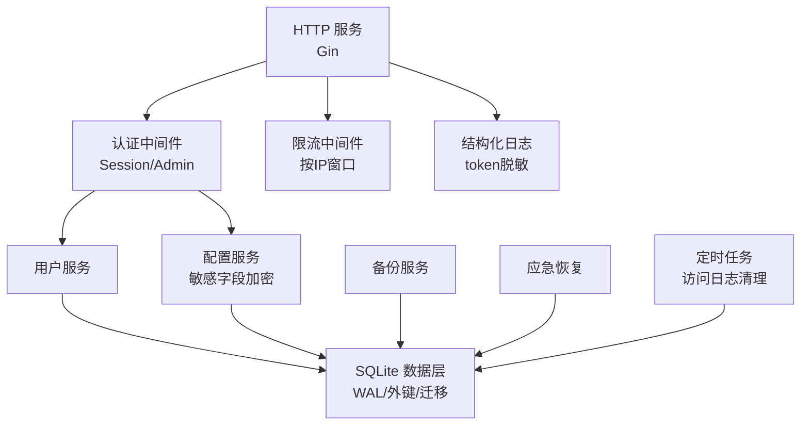

图表来源
- [backend/cmd/server/main.go:24-98](file://backend/cmd/server/main.go#L24-L98)
- [backend/internal/store/store.go:31-52](file://backend/internal/store/store.go#L31-L52)
- [backend/internal/config/config.go:57-111](file://backend/internal/config/config.go#L57-L111)
- [backend/internal/auth/auth.go:144-192](file://backend/internal/auth/auth.go#L144-L192)
- [backend/internal/ratelimit/ratelimit.go:40-60](file://backend/internal/ratelimit/ratelimit.go#L40-L60)
- [backend/internal/log/log.go:40-57](file://backend/internal/log/log.go#L40-L57)
- [backend/internal/backup/backup.go:30-65](file://backend/internal/backup/backup.go#L30-L65)
- [backend/internal/emergency/emergency.go:50-66](file://backend/internal/emergency/emergency.go#L50-L66)
- [backend/internal/cron/cleanup.go:10-29](file://backend/internal/cron/cleanup.go#L10-L29)

章节来源
- [backend/cmd/server/main.go:24-98](file://backend/cmd/server/main.go#L24-L98)
- [backend/internal/store/store.go:31-52](file://backend/internal/store/store.go#L31-L52)

## 核心组件
- 配置服务：提供系统配置的读写、类型化读取、敏感字段自动加密/解密；签名密钥自动生成与派生；事务内读写支持。
- 认证服务：密码哈希校验、JWT 签发与解析、会话中间件、管理员角色校验。
- 数据层：SQLite 单写者模型、WAL、外键约束、版本化迁移、BEGIN IMMEDIATE 事务。
- 令牌服务：下载/分享/规则令牌生成、复用键、刷新轮替、生命周期联动删除。
- 备份服务：一致性快照 + 资源打包 tar.gz；符号链接保留。
- 应急恢复：手动/自动触发、一次性操作码、重置管理员密码、重新初始化。
- 日志与脱敏：分级输出、JSON/文本双格式、token 查询参数脱敏、运行时级别切换。
- 限流：按 IP 固定窗口计数，防暴力破解与滥用。
- 邮件：SMTP TLS/STARTTLS 发送，敏感密码加密落库，启用范围控制。
- 定时清理：访问日志 90 天自动清理。

章节来源
- [backend/internal/config/config.go:24-111](file://backend/internal/config/config.go#L24-L111)
- [backend/internal/auth/auth.go:22-135](file://backend/internal/auth/auth.go#L22-L135)
- [backend/internal/store/store.go:31-164](file://backend/internal/store/store.go#L31-L164)
- [backend/internal/token/token.go:29-172](file://backend/internal/token/token.go#L29-L172)
- [backend/internal/backup/backup.go:30-79](file://backend/internal/backup/backup.go#L30-L79)
- [backend/internal/emergency/emergency.go:50-116](file://backend/internal/emergency/emergency.go#L50-L116)
- [backend/internal/log/log.go:40-118](file://backend/internal/log/log.go#L40-L118)
- [backend/internal/ratelimit/ratelimit.go:17-60](file://backend/internal/ratelimit/ratelimit.go#L17-L60)
- [backend/internal/mail/mail.go:19-150](file://backend/internal/mail/mail.go#L19-L150)
- [backend/internal/cron/cleanup.go:10-38](file://backend/internal/cron/cleanup.go#L10-L38)

## 架构总览
下图展示关键安全流程：登录与会话校验、配置敏感字段加密、备份与应急恢复。

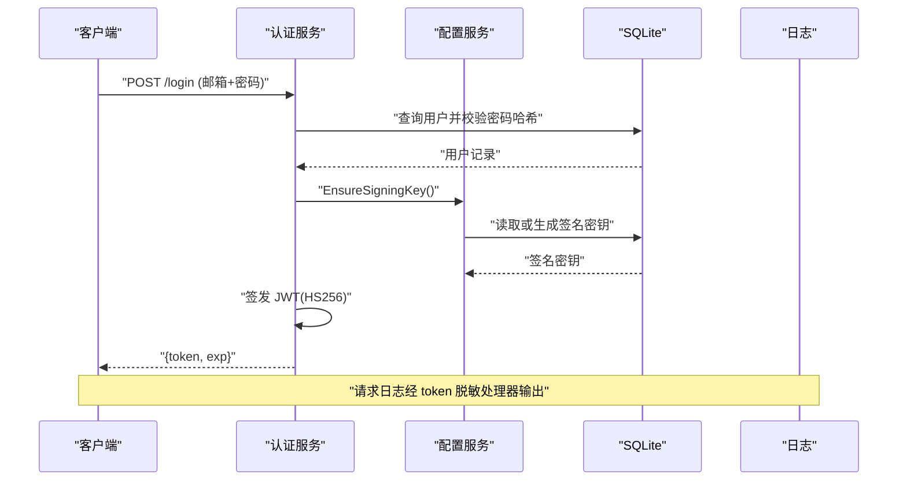

图表来源
- [backend/internal/auth/auth.go:98-135](file://backend/internal/auth/auth.go#L98-L135)
- [backend/internal/config/config.go:294-313](file://backend/internal/config/config.go#L294-L313)
- [backend/internal/log/log.go:40-57](file://backend/internal/log/log.go#L40-L57)

## 详细组件分析

### 敏感信息加密存储与密钥管理
- 敏感配置键登记机制：通过注册表将 SMTP 密码等标记为敏感，写入时自动加密、读取时自动解密。
- 加密算法：AES-256-GCM，nonce 随机生成，密文以 base64url(nonce||ciphertext) 存储；解密失败返回明确错误，防止静默使用损坏数据。
- 密钥派生：由签名密钥经 HKDF-SHA256 派生 32 字节 AES 密钥，info 固定，全程统一。
- 签名密钥：Setup 时生成 32 字节随机值，明文落库；缺失时拒绝启动或验签失败；事务内确保原子性。
- 面板回显脱敏：GET 返回 "***"，PUT 空串表示不修改；OIDC Client Secret 同样加密落库与脱敏回显。

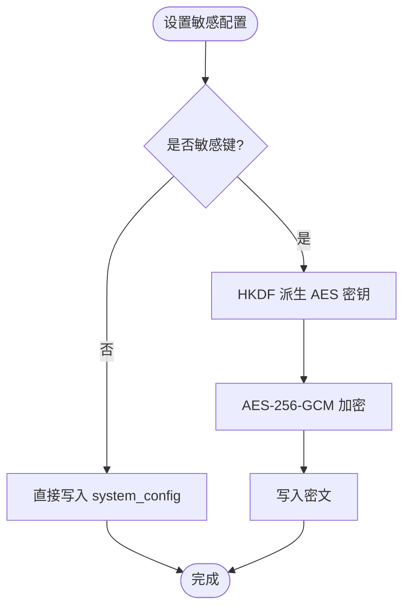

图表来源
- [backend/internal/config/config.go:39-111](file://backend/internal/config/config.go#L39-L111)
- [backend/internal/config/config.go:220-280](file://backend/internal/config/config.go#L220-L280)
- [backend/internal/config/admin.go:91-106](file://backend/internal/config/admin.go#L91-L106)

章节来源
- [backend/internal/config/config.go:39-111](file://backend/internal/config/config.go#L39-L111)
- [backend/internal/config/config.go:220-313](file://backend/internal/config/config.go#L220-L313)
- [backend/internal/config/admin.go:91-106](file://backend/internal/config/admin.go#L91-L106)

### 数据库连接与迁移安全
- 连接参数：WAL 模式、外键开启、busy_timeout 设置，单写者模型避免并发写冲突。
- 迁移框架：按版本号顺序执行未应用迁移；迁移与其版本记录在同一事务内写入；数据库版本高于代码支持版本拒绝启动。
- 事务助手：TxImmediate 基于 DSN _txlock=immediate 实现 BEGIN IMMEDIATE，先读后写场景串行化。

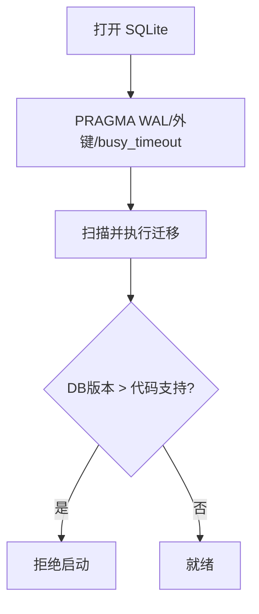

图表来源
- [backend/internal/store/store.go:31-52](file://backend/internal/store/store.go#L31-L52)
- [backend/internal/store/store.go:62-128](file://backend/internal/store/store.go#L62-L128)
- [backend/internal/store/store.go:147-164](file://backend/internal/store/store.go#L147-L164)

章节来源
- [backend/internal/store/store.go:31-164](file://backend/internal/store/store.go#L31-L164)

### 数据传输加密
- HTTP 传输：建议部署于 HTTPS 反向代理；可信代理策略由 TRUST_PROXY 控制，正确解析真实客户端 IP。
- SMTP 传输：默认 TLS 直连；若配置明文则尝试 STARTTLS 升级；发件人/收件人/主题清洗换行防头注入。

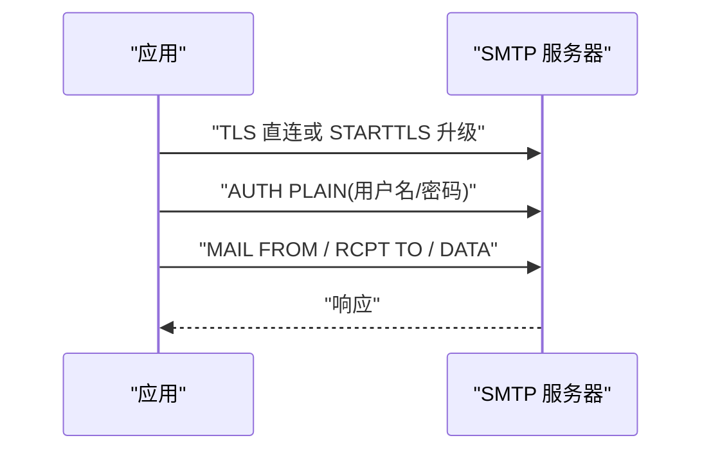

图表来源
- [backend/internal/mail/mail.go:60-134](file://backend/internal/mail/mail.go#L60-L134)

章节来源
- [backend/internal/mail/mail.go:60-134](file://backend/internal/mail/mail.go#L60-L134)

### 访问控制与权限验证
- 会话凭据：仅包含 user_id 与 credential_version，禁止角色/组入凭据；每次请求实时查库比对状态与版本。
- 管理员校验：AdminMiddleware 叠加在会话校验之后，要求 role=admin。
- 限流：按 IP 固定窗口计数，登录/注册/找回密码/下载分别限流，阈值可动态调整。

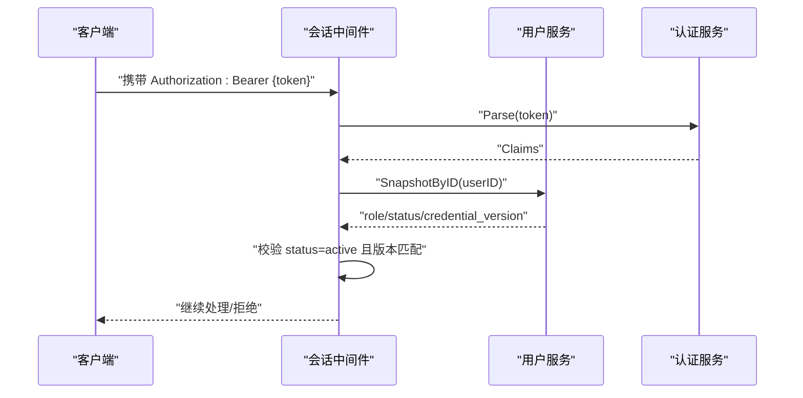

图表来源
- [backend/internal/auth/auth.go:144-192](file://backend/internal/auth/auth.go#L144-L192)
- [backend/internal/ratelimit/ratelimit.go:40-60](file://backend/internal/ratelimit/ratelimit.go#L40-L60)

章节来源
- [backend/internal/auth/auth.go:144-192](file://backend/internal/auth/auth.go#L144-L192)
- [backend/internal/ratelimit/ratelimit.go:17-60](file://backend/internal/ratelimit/ratelimit.go#L17-L60)

### 令牌与共享资源安全
- 下载 Token：三态复用键（user+platform±custom_sub_id±subscription_id），并发首建先查后建，冲突重试；刷新同事务删旧建新。
- 分享/规则 Token：创建时自动生成；刷新物理轮替；吊销物理删除。
- 生命周期联动：删除订阅/自定义/用户时级联删除相关 Token。

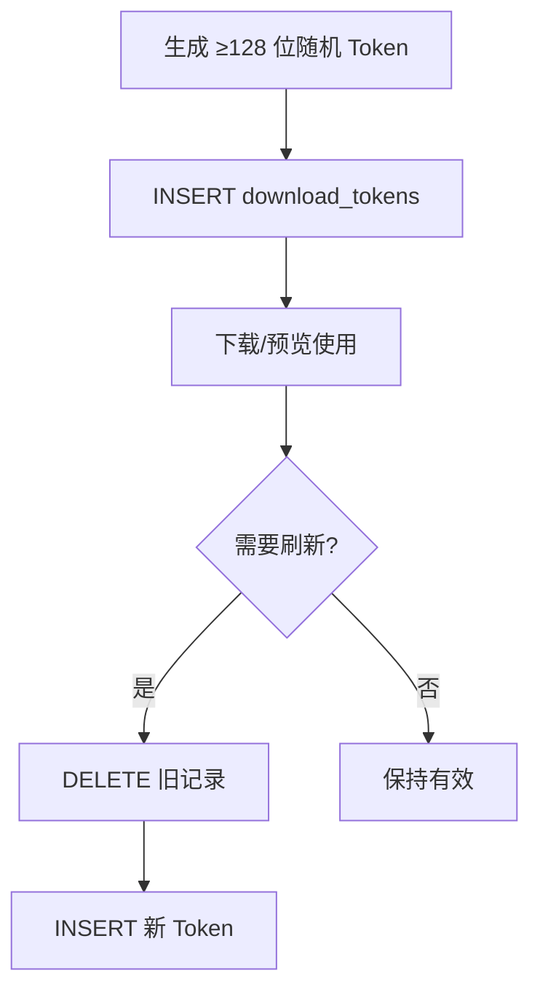

图表来源
- [backend/internal/token/token.go:29-88](file://backend/internal/token/token.go#L29-L88)
- [backend/internal/token/token.go:125-172](file://backend/internal/token/token.go#L125-L172)
- [backend/internal/token/token.go:176-235](file://backend/internal/token/token.go#L176-L235)

章节来源
- [backend/internal/token/token.go:29-235](file://backend/internal/token/token.go#L29-L235)

### 备份与恢复
- 一致性快照：优先 VACUUM INTO；不支持时降级为 WAL checkpoint 后拷贝主文件。
- 打包内容：app.db + contents/ + public/，保留符号链接；仅覆盖备份侧，不影响运行。
- 恢复后自检：以 DB 为准重建「当前」指针。

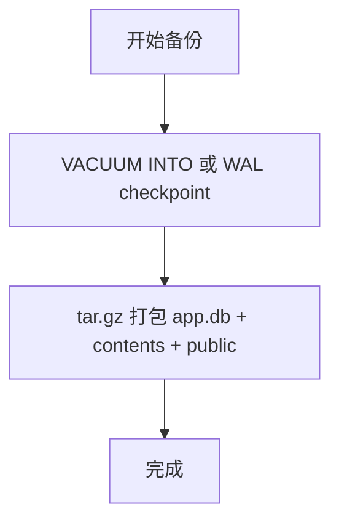

图表来源
- [backend/internal/backup/backup.go:30-79](file://backend/internal/backup/backup.go#L30-L79)

章节来源
- [backend/internal/backup/backup.go:30-79](file://backend/internal/backup/backup.go#L30-L79)

### 应急恢复与一键清空
- 触发判定：环境变量手动触发；数据库不可用/损坏；configured=true 但签名密钥缺失。
- 能力分级：仅当数据库可读且满足条件时提供重置管理员密码；否则降级为重新初始化。
- 一键清空：先清库（事务）再删数据文件；内存态复位；旧会话因签名密钥轮换自然失效。

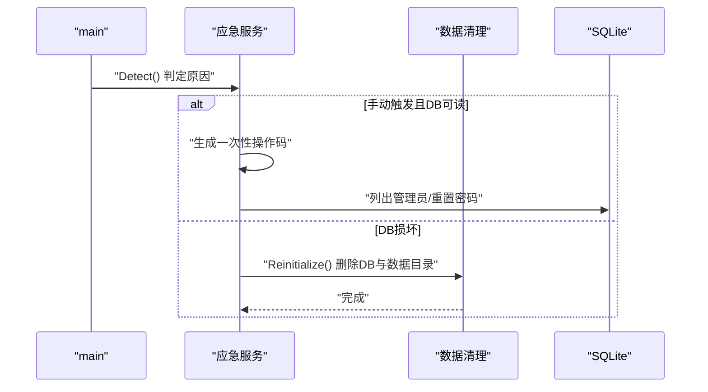

图表来源
- [backend/internal/emergency/emergency.go:50-116](file://backend/internal/emergency/emergency.go#L50-L116)
- [backend/internal/dataclear/dataclear.go:54-82](file://backend/internal/dataclear/dataclear.go#L54-L82)
- [backend/cmd/server/main.go:42-75](file://backend/cmd/server/main.go#L42-L75)

章节来源
- [backend/internal/emergency/emergency.go:50-116](file://backend/internal/emergency/emergency.go#L50-L116)
- [backend/internal/dataclear/dataclear.go:54-82](file://backend/internal/dataclear/dataclear.go#L54-L82)
- [backend/cmd/server/main.go:42-75](file://backend/cmd/server/main.go#L42-L75)

### 日志脱敏与错误信息处理
- 日志脱敏：所有消息与字符串属性经 RedactHandler 处理，?token=xxx 与 &token=xxx 的值替换为 ***。
- 错误信息：5xx 对外返回通用信息，详情仅入日志；panic 恢复统一转 500。
- 运行时级别：SetLevel 立即生效，持久化到配置键。

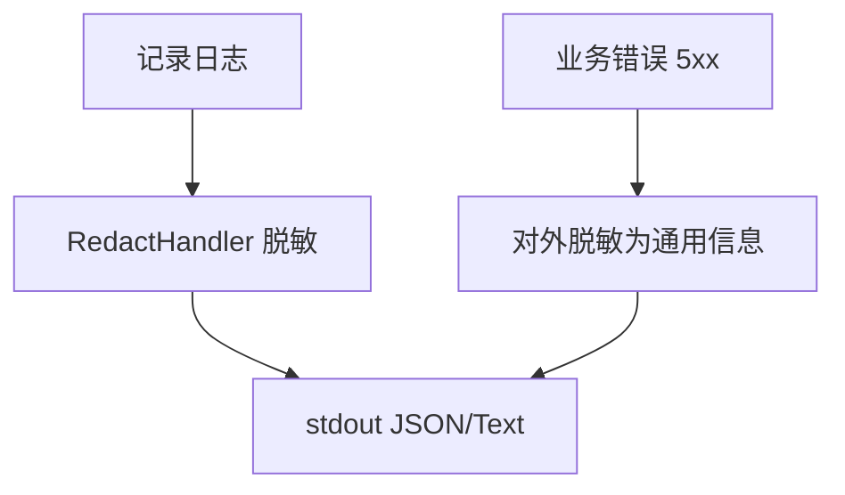

图表来源
- [backend/internal/log/log.go:40-118](file://backend/internal/log/log.go#L40-L118)
- [backend/internal/config/admin.go:577-585](file://backend/internal/config/admin.go#L577-L585)

章节来源
- [backend/internal/log/log.go:40-118](file://backend/internal/log/log.go#L40-L118)
- [backend/internal/config/admin.go:577-585](file://backend/internal/config/admin.go#L577-L585)

### 临时文件清理与审计日志
- 临时文件：备份过程中生成的临时快照文件在完成后删除。
- 审计日志：访问日志表定期清理 90 天前记录，防止无限增长。

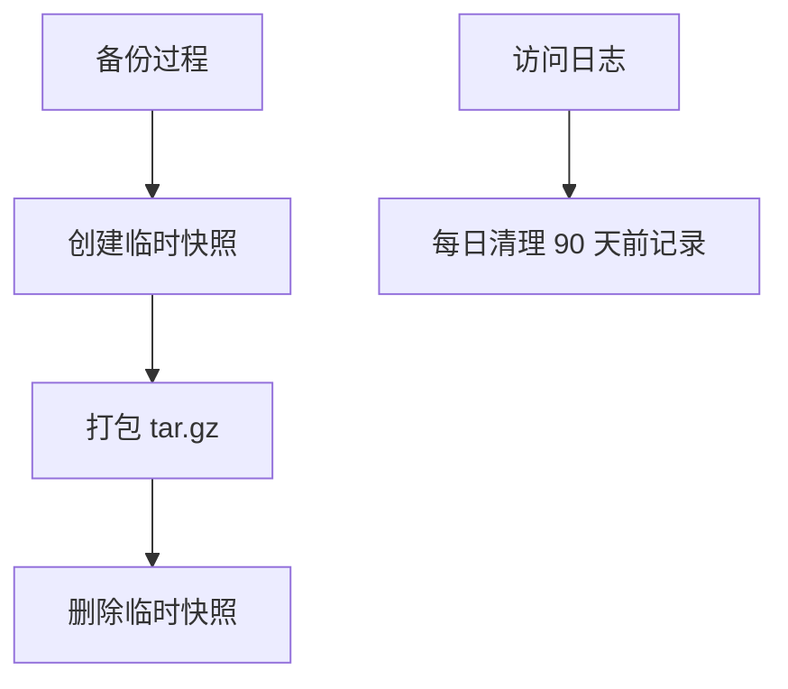

图表来源
- [backend/internal/backup/backup.go:30-65](file://backend/internal/backup/backup.go#L30-L65)
- [backend/internal/cron/cleanup.go:10-38](file://backend/internal/cron/cleanup.go#L10-L38)

章节来源
- [backend/internal/backup/backup.go:30-65](file://backend/internal/backup/backup.go#L30-L65)
- [backend/internal/cron/cleanup.go:10-38](file://backend/internal/cron/cleanup.go#L10-L38)

## 依赖关系分析
- 配置服务依赖数据层进行持久化；认证服务依赖配置服务获取签名密钥；令牌服务依赖数据层进行 CRUD；备份与应急恢复依赖数据层与文件系统；日志与限流作为横切关注点被各模块使用。
- 循环依赖规避：config 包通过接口 OidcOps 与 oidc 解耦；auth 通过 UserSource 接口与 user 解耦。

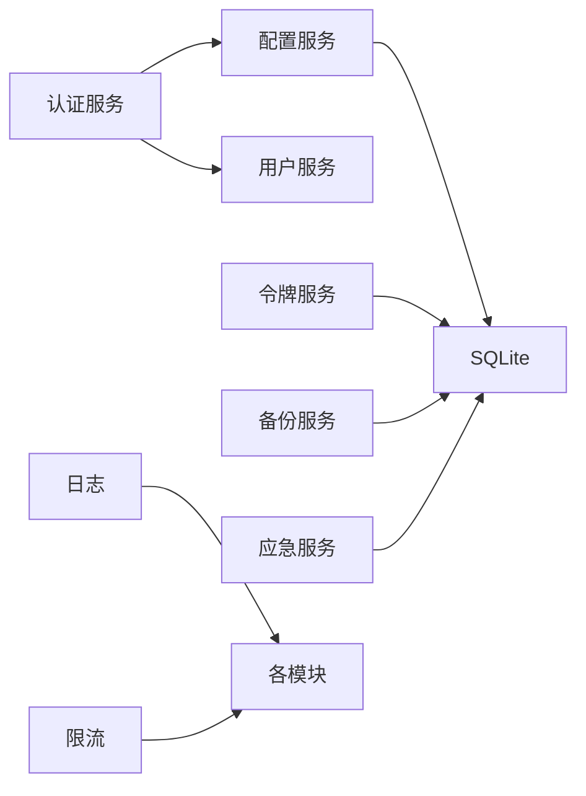

图表来源
- [backend/internal/config/config.go:48-55](file://backend/internal/config/config.go#L48-L55)
- [backend/internal/auth/auth.go:87-96](file://backend/internal/auth/auth.go#L87-L96)
- [backend/internal/token/token.go:19-27](file://backend/internal/token/token.go#L19-L27)
- [backend/internal/backup/backup.go:19-28](file://backend/internal/backup/backup.go#L19-L28)
- [backend/internal/emergency/emergency.go:36-48](file://backend/internal/emergency/emergency.go#L36-L48)
- [backend/internal/log/log.go:11-17](file://backend/internal/log/log.go#L11-L17)
- [backend/internal/ratelimit/ratelimit.go:25-37](file://backend/internal/ratelimit/ratelimit.go#L25-L37)

章节来源
- [backend/internal/config/config.go:48-55](file://backend/internal/config/config.go#L48-L55)
- [backend/internal/auth/auth.go:87-96](file://backend/internal/auth/auth.go#L87-L96)
- [backend/internal/token/token.go:19-27](file://backend/internal/token/token.go#L19-L27)
- [backend/internal/backup/backup.go:19-28](file://backend/internal/backup/backup.go#L19-L28)
- [backend/internal/emergency/emergency.go:36-48](file://backend/internal/emergency/emergency.go#L36-L48)
- [backend/internal/log/log.go:11-17](file://backend/internal/log/log.go#L11-L17)
- [backend/internal/ratelimit/ratelimit.go:25-37](file://backend/internal/ratelimit/ratelimit.go#L25-L37)

## 性能与安全权衡
- SQLite 单写者模型与 WAL：提升读性能同时保证写一致性与并发安全；busy_timeout 降低锁争用失败概率。
- 配置加解密：AES-GCM 提供机密性与完整性校验；HKDF 派生减少密钥管理复杂度。
- 令牌轮替：刷新在同事务内完成，避免竞态；复用键减少重复创建开销。
- 日志脱敏：额外正则与属性遍历带来轻微开销，但保障敏感信息不泄露。
- 限流：内存桶按分钟槽过期，GC 防止内存泄漏；阈值可动态调整平衡用户体验与安全。

[本节为一般性讨论，无需特定文件引用]

## 故障排查指南
- 无法登录或会话失效：检查签名密钥是否存在；确认 credential_version 与用户快照一致；查看 5xx 错误是否被脱敏。
- 配置读取失败：确认敏感键已登记；检查密文是否被篡改；查看解密错误日志。
- 备份失败：检查 VACUUM INTO 是否受驱动限制；查看 WAL checkpoint 降级路径；确认数据目录权限。
- 应急模式触发：查看触发原因（手动/DB损坏/密钥缺失）；根据能力分级选择重置密码或重新初始化。
- 邮件发送失败：检查 SMTP 配置与 TLS/STARTTLS；确认启用范围；查看具体错误信息。

章节来源
- [backend/internal/auth/auth.go:118-135](file://backend/internal/auth/auth.go#L118-L135)
- [backend/internal/config/config.go:70-78](file://backend/internal/config/config.go#L70-L78)
- [backend/internal/backup/backup.go:67-79](file://backend/internal/backup/backup.go#L67-L79)
- [backend/internal/emergency/emergency.go:50-66](file://backend/internal/emergency/emergency.go#L50-L66)
- [backend/internal/mail/mail.go:60-134](file://backend/internal/mail/mail.go#L60-L134)

## 结论
本系统通过多层安全机制确保数据的机密性与完整性：敏感配置 AES-GCM 加密、签名密钥统一管理、JWT HS256 会话校验、SQLite WAL 与外键约束、HTTPS/SMTP 传输加密、日志脱敏与错误信息处理、备份与应急恢复、限流与审计日志。建议在生产环境启用 HTTPS、严格配置 TRUST_PROXY、定期备份与演练恢复、合理设置限流阈值与日志级别，并遵循最小权限原则进行运维操作。

[本节为总结性内容，无需特定文件引用]

## 附录
- 配置键参考：
  - 认证与登录：allow_local_login、allow_selfreg、selfreg_approval
  - OIDC：oidc_provider_type、oidc_configured、oidc_approval、oidc_whitelist
  - 验证码：captcha_provider、captcha_site_key、captcha_secret_key、captcha_pages
  - 速率限制：ratelimit_login、ratelimit_register、ratelimit_forgot、ratelimit_download
  - 日志级别：log_level
  - 站点信息：site_name、site_icon_url、site_icon_version
  - 公告与页脚：announcement、login_announcement、login_footer
  - 调试模式：debug_mode

章节来源
- [backend/internal/config/admin.go:31-49](file://backend/internal/config/admin.go#L31-L49)
- [backend/internal/config/admin.go:250-333](file://backend/internal/config/admin.go#L250-L333)
- [backend/internal/config/admin.go:471-527](file://backend/internal/config/admin.go#L471-L527)
- [backend/internal/config/admin.go:529-585](file://backend/internal/config/admin.go#L529-L585)