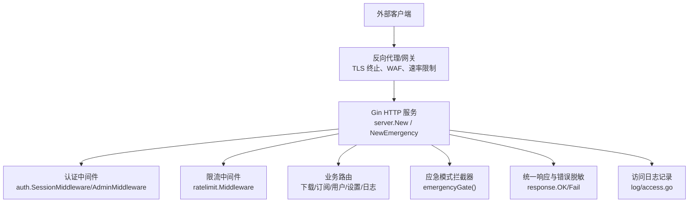
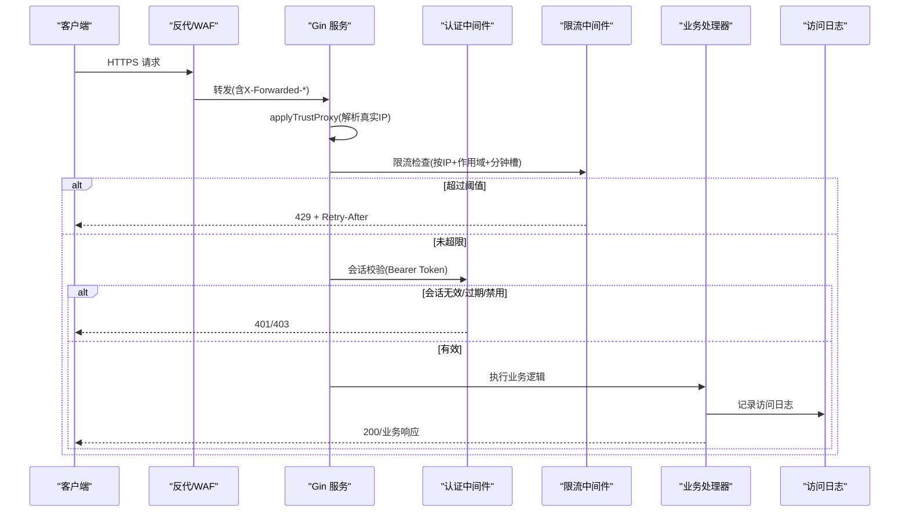
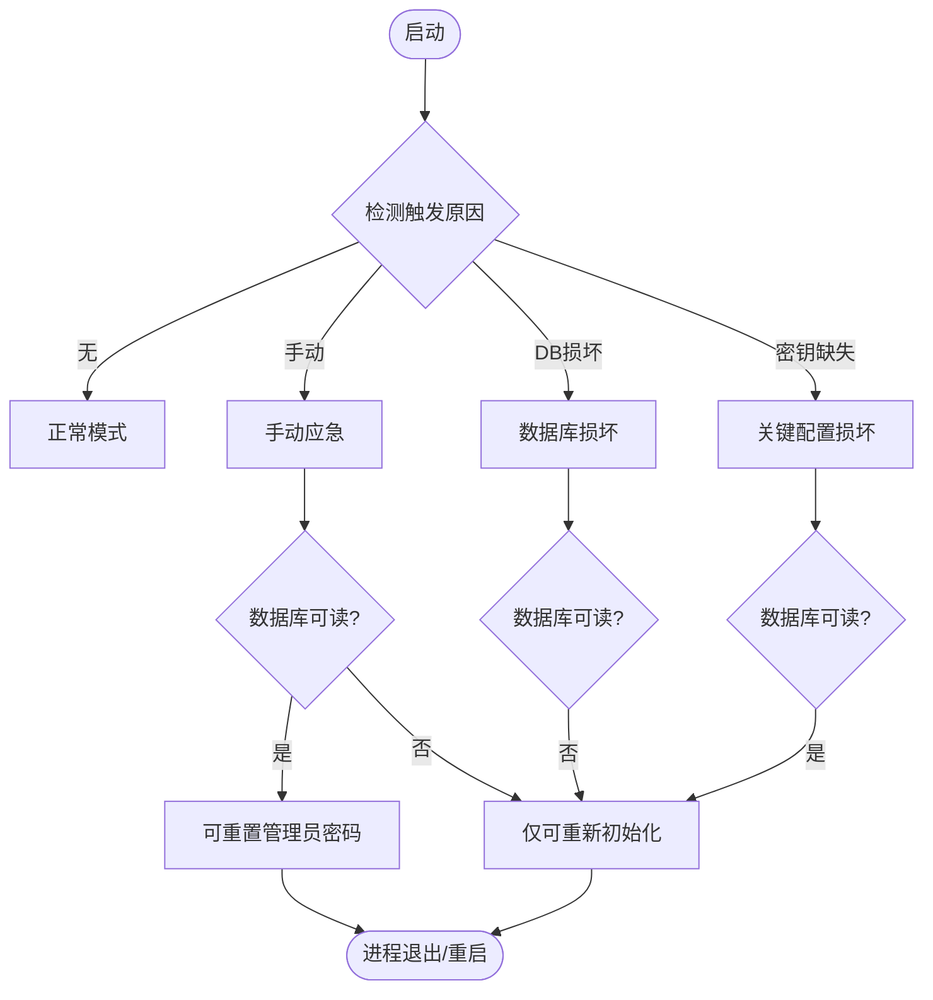
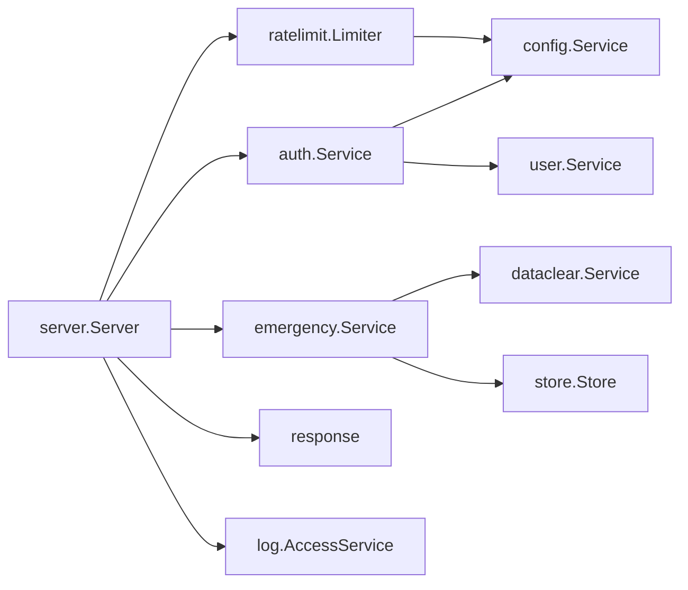

# 网络安全防护

<cite>
**本文引用的文件**
- [backend/cmd/server/main.go](file://backend/cmd/server/main.go)
- [backend/internal/server/server.go](file://backend/internal/server/server.go)
- [backend/internal/ratelimit/ratelimit.go](file://backend/internal/ratelimit/ratelimit.go)
- [backend/internal/auth/auth.go](file://backend/internal/auth/auth.go)
- [backend/internal/emergency/emergency.go](file://backend/internal/emergency/emergency.go)
- [backend/internal/config/config.go](file://backend/internal/config/config.go)
- [backend/internal/response/response.go](file://backend/internal/response/response.go)
- [backend/internal/log/access.go](file://backend/internal/log/access.go)
- [docker-compose.yml](file://docker-compose.yml)
- [Dockerfile](file://Dockerfile)
- [Reference/Xray-Core-API.md](file://Reference/Xray-Core-API.md)
</cite>

## 目录
1. [简介](#简介)
2. [项目结构](#项目结构)
3. [核心组件](#核心组件)
4. [架构总览](#架构总览)
5. [详细组件分析](#详细组件分析)
6. [依赖关系分析](#依赖关系分析)
7. [性能与安全权衡](#性能与安全权衡)
8. [故障排查指南](#故障排查指南)
9. [结论](#结论)
10. [附录](#附录)

## 简介
本安全文档聚焦于该系统的网络层与运行期安全防护，覆盖 HTTPS/TLS 终止、CORS/跨域策略、请求头安全、紧急模式下的安全降级、安全响应头、DDoS 防护、IP 白名单、请求频率限制、安全监控与异常检测、入侵告警、防火墙规则、SSL 证书管理与网络安全审计等主题。内容严格基于仓库中的实现与设计决策，确保可落地与可验证。

## 项目结构
后端采用 Go + Gin 框架，HTTP 服务在 server 包中装配；认证与会话由 auth 包提供；限流中间件位于 ratelimit；应急恢复模式由 emergency 包实现；配置与敏感数据加密由 config 包管理；统一响应与错误脱敏由 response 包处理；访问日志由 log/access 提供。部署通过 Docker 构建并暴露 8080 端口，健康检查使用 /health。

图表来源
- [backend/internal/server/server.go:63-158](file://backend/internal/server/server.go#L63-L158)
- [backend/internal/auth/auth.go:144-192](file://backend/internal/auth/auth.go#L144-L192)
- [backend/internal/ratelimit/ratelimit.go:40-60](file://backend/internal/ratelimit/ratelimit.go#L40-L60)
- [backend/internal/response/response.go:35-50](file://backend/internal/response/response.go#L35-L50)
- [backend/internal/log/access.go:16-25](file://backend/internal/log/access.go#L16-L25)

章节来源
- [backend/cmd/server/main.go:24-99](file://backend/cmd/server/main.go#L24-L99)
- [backend/internal/server/server.go:63-158](file://backend/internal/server/server.go#L63-L158)
- [docker-compose.yml:1-28](file://docker-compose.yml#L1-L28)
- [Dockerfile:1-31](file://Dockerfile#L1-L31)

## 核心组件
- 信任代理与真实 IP：通过 TRUST_PROXY 控制是否信任 X-Forwarded-* 等转发头，影响限流与日志中的 ClientIP。
- 会话与鉴权：HS256 JWT，最小化载荷（仅用户 ID 与凭据版本号），每次请求实时查库校验状态与版本。
- 请求频率限制：按 IP 固定窗口（分钟级）对登录、注册、找回密码、下载进行限流，超限返回 429 与 Retry-After。
- 应急模式：启动时自动或手动触发，降级为仅开放系统状态、站点信息、应急端点与静态资源，业务 API 返回 503。
- 配置与敏感数据：敏感配置以 AES-256-GCM 加密落库，密钥由签名密钥经 HKDF 派生。
- 统一响应与错误脱敏：5xx 默认对外脱敏，调试模式可开启详情输出。
- 访问日志：记录下载相关访问日志，支持分页查询与清空，定时清理保留期。

章节来源
- [backend/internal/server/server.go:197-209](file://backend/internal/server/server.go#L197-L209)
- [backend/internal/auth/auth.go:98-135](file://backend/internal/auth/auth.go#L98-L135)
- [backend/internal/ratelimit/ratelimit.go:17-60](file://backend/internal/ratelimit/ratelimit.go#L17-L60)
- [backend/internal/emergency/emergency.go:50-85](file://backend/internal/emergency/emergency.go#L50-L85)
- [backend/internal/config/config.go:220-280](file://backend/internal/config/config.go#L220-L280)
- [backend/internal/response/response.go:27-50](file://backend/internal/response/response.go#L27-L50)
- [backend/internal/log/access.go:16-25](file://backend/internal/log/access.go#L16-L25)

## 架构总览
下图展示从客户端到后端各安全组件的调用链与职责边界，包括 TLS 终止、信任代理、认证、限流、应急拦截与日志记录。

图表来源
- [backend/internal/server/server.go:197-223](file://backend/internal/server/server.go#L197-L223)
- [backend/internal/auth/auth.go:144-179](file://backend/internal/auth/auth.go#L144-L179)
- [backend/internal/ratelimit/ratelimit.go:40-60](file://backend/internal/ratelimit/ratelimit.go#L40-L60)
- [backend/internal/log/access.go:16-25](file://backend/internal/log/access.go#L16-L25)

## 详细组件分析

### HTTPS/TLS 与反向代理
- 部署形态：容器暴露 8080 端口，建议由外部反代承担 TLS 终止与域名接入；局域网直连场景可注释掉回环绑定，直接映射端口，但需知悉明文风险。
- 信任代理：TRUST_PROXY 支持 auto/on/off，auto 仅信任回环与私有网段，on 全信任（多跳代理场景），off 从不信任（公网直连防伪造）。
- 健康检查：/health 用于 compose healthcheck，应急模式下返回 503。

章节来源
- [docker-compose.yml:1-28](file://docker-compose.yml#L1-L28)
- [backend/internal/server/server.go:197-209](file://backend/internal/server/server.go#L197-L209)
- [backend/internal/server/server.go:160-193](file://backend/internal/server/server.go#L160-L193)

### CORS 与跨域策略
- 当前代码未内置全局 CORS 中间件。若前端与后端跨域部署，应在反向代理或网关层配置允许的 Origin、方法、头部与预检缓存；或在 Gin 引擎上按需添加 CORS 中间件。
- 建议：
  - 明确允许的来源白名单，避免通配符 *。
  - 限制暴露的安全相关响应头。
  - 对需要认证的跨域请求启用凭证模式并配合 Cookie SameSite 策略。

[本节为通用实践说明，不直接分析具体文件]

### 请求头安全与响应头
- 统一响应：所有响应通过 response.OK/Fail 封装，5xx 默认对外脱敏，仅在调试模式返回详情。
- 建议补充的安全响应头（可在反代或 Gin 中间件层设置）：
  - Strict-Transport-Security（强制 HTTPS）
  - Content-Security-Policy（限制脚本与资源加载）
  - X-Content-Type-Options: nosniff
  - X-Frame-Options: DENY/SAMEORIGIN
  - Referrer-Policy: strict-origin-when-cross-origin
  - Permissions-Policy（限制浏览器特性）
- 附加平台头：测试显示存在“Clash Verge 附加头”的行为，建议在平台级配置注入附加响应头，避免硬编码。

章节来源
- [backend/internal/response/response.go:27-50](file://backend/internal/response/response.go#L27-L50)
- [backend/internal/setup/setup_test.go:86-105](file://backend/internal/setup/setup_test.go#L86-L105)

### 认证与会话安全
- 令牌算法：HS256，使用系统签名密钥签发与校验；缺失签名密钥将导致验签失败。
- 最小化载荷：仅包含用户 ID 与凭据版本号，角色与权限实时查库，禁止缓存。
- 会话失效机制：禁用、改邮箱、密码重置等操作会递增凭据版本号，现有会话立即失效。
- 管理员保护：AdminMiddleware 叠加在 SessionMiddleware 之后，双重保障。

章节来源
- [backend/internal/auth/auth.go:98-135](file://backend/internal/auth/auth.go#L98-L135)
- [backend/internal/auth/auth.go:144-192](file://backend/internal/auth/auth.go#L144-L192)

### 请求频率限制（防暴力破解与滥用）
- 维度：按 IP + 作用域 + 分钟槽计数。
- 范围：登录、注册、找回密码、下载接口独立限流，默认值可通过配置键动态调整。
- 行为：超限返回 429 并附带 Retry-After 秒数；GC 定期清理过期桶防止内存泄漏。
- 注意：TRUST_PROXY=off 时，公网直连下转发头不可信，避免被绕过。

章节来源
- [backend/internal/ratelimit/ratelimit.go:17-89](file://backend/internal/ratelimit/ratelimit.go#L17-L89)
- [backend/internal/server/server.go:197-209](file://backend/internal/server/server.go#L197-L209)

### 紧急模式下的安全降级
- 触发条件：
  - 手动：设置环境变量 RESET_ADMIN_PASSWORD 非空。
  - 自动：数据库无法连接/损坏（integrity_check 失败）、关键配置损坏（configured=true 但签名密钥缺失）。
- 能力分级：
  - 重置管理员密码：仅环境变量触发且数据库可读时可用；用户表为空时不可用。
  - 重新初始化：数据库可连接时 SQL 清空；不可读时删除数据库文件与数据目录后重建。
- 一次性操作码：进程内存存储，提交即消耗并重新生成，输出至运行日志，页面不展示任何词。
- 服务降级：仅开放系统状态、站点信息、应急端点与静态资源；业务 API 与下载端点返回 503；/health 返回 503。

图表来源
- [backend/internal/emergency/emergency.go:50-85](file://backend/internal/emergency/emergency.go#L50-L85)
- [backend/internal/emergency/emergency.go:120-213](file://backend/internal/emergency/emergency.go#L120-L213)
- [backend/internal/server/server.go:160-193](file://backend/internal/server/server.go#L160-L193)

章节来源
- [backend/internal/emergency/emergency.go:50-213](file://backend/internal/emergency/emergency.go#L50-L213)
- [backend/internal/server/server.go:160-193](file://backend/internal/server/server.go#L160-L193)

### 安全监控、异常检测与入侵告警
- 访问日志：记录下载类型、用户、平台、IP、状态与失败原因，支持按日期范围查询与清空；默认保留 90 天自动清理。
- 运行日志：分级日志（debug/info/warn/error），支持运行时切换；SSE 实时推送运行日志，便于对接 WAF 与集中式日志系统。
- 异常处理：panic 统一捕获转 500，内部错误默认脱敏；调试模式可开启详情输出。
- 建议告警：
  - 高频 429/401/403 告警（暴力破解/越权尝试）
  - 5xx 突增告警（服务异常）
  - 应急模式触发告警（数据库损坏/密钥缺失）
  - 限流阈值频繁命中告警（疑似 DDoS/扫描）

章节来源
- [backend/internal/log/access.go:16-123](file://backend/internal/log/access.go#L16-L123)
- [backend/internal/server/server.go:211-237](file://backend/internal/server/server.go#L211-L237)
- [backend/internal/response/response.go:27-50](file://backend/internal/response/response.go#L27-L50)

### DDoS 防护、IP 白名单与请求频率限制
- 应用层限流：按 IP 固定窗口限流，适用于登录、注册、找回密码、下载等高风险接口。
- 反向代理/WAF：建议在前置层实施：
  - 连接速率限制与并发限制
  - 请求体大小限制
  - 恶意 UA/路径扫描拦截
  - 地理/IP 黑名单与白名单
- IP 白名单：对于 gRPC 管理接口（如 Xray-core），当前设计指出无认证与 TLS，安全边界由部署者控制，建议使用 IP 白名单限制访问来源。

章节来源
- [backend/internal/ratelimit/ratelimit.go:17-89](file://backend/internal/ratelimit/ratelimit.go#L17-L89)
- [Reference/Xray-Core-API.md:8-14](file://Reference/Xray-Core-API.md#L8-L14)

### SSL 证书管理与审计
- 证书管理：由外部反代负责 TLS 终止与证书更新；容器内不持有私钥。
- 审计要点：
  - 访问日志与运行日志集中采集与分析
  - 变更审计：面板配置导入导出、一键清空、备份下载等高危操作需二次确认并记录
  - 合规性：敏感配置加密落库，签名密钥由系统自动生成与管理

章节来源
- [backend/internal/config/config.go:220-280](file://backend/internal/config/config.go#L220-L280)
- [backend/internal/log/access.go:16-123](file://backend/internal/log/access.go#L16-L123)

## 依赖关系分析
- server 依赖 auth、ratelimit、emergency、response、log 等模块，形成清晰的接入层与业务层解耦。
- auth 依赖 config（签名密钥）与 user（用户快照），避免循环依赖。
- emergency 依赖 dataclear、store、config，具备灾难恢复能力。
- ratelimit 依赖 config（动态阈值）与 response（统一失败响应）。

图表来源
- [backend/internal/server/server.go:63-158](file://backend/internal/server/server.go#L63-L158)
- [backend/internal/auth/auth.go:87-96](file://backend/internal/auth/auth.go#L87-L96)
- [backend/internal/emergency/emergency.go:36-48](file://backend/internal/emergency/emergency.go#L36-L48)
- [backend/internal/ratelimit/ratelimit.go:27-37](file://backend/internal/ratelimit/ratelimit.go#L27-L37)

章节来源
- [backend/internal/server/server.go:63-158](file://backend/internal/server/server.go#L63-L158)
- [backend/internal/auth/auth.go:87-96](file://backend/internal/auth/auth.go#L87-L96)
- [backend/internal/emergency/emergency.go:36-48](file://backend/internal/emergency/emergency.go#L36-L48)
- [backend/internal/ratelimit/ratelimit.go:27-37](file://backend/internal/ratelimit/ratelimit.go#L27-L37)

## 性能与安全权衡
- 信任代理与限流：TRUST_PROXY=off 可防止转发头伪造绕过限流，但需确保反向代理正确传递真实 IP。
- 会话校验：每次请求实时查库保证安全性，但增加数据库压力；在高并发场景可考虑本地缓存短期快照（需谨慎设计失效策略）。
- 限流粒度：按 IP 在 NAT 共享环境下可能误伤；可根据部署环境调高阈值或结合用户态限流。
- 应急模式：降级期间仅开放必要端点，降低攻击面；业务中断时间可控，适合灾难恢复。

[本节为通用指导，不直接分析具体文件]

## 故障排查指南
- 应急模式：
  - 查看 docker compose logs 获取一次性操作码；根据触发原因选择重置管理员密码或重新初始化。
  - 完成后移除环境变量并重启容器。
- 限流问题：
  - 检查 TRUST_PROXY 设置与前置代理是否正确传递 X-Forwarded-For。
  - 调整对应作用域的限流阈值（登录/注册/找回/下载）。
- 认证失败：
  - 检查签名密钥是否存在；确认凭据版本号是否递增（禁用/改邮箱/密码重置）。
- 访问日志：
  - 使用访问日志查询功能定位失败原因与来源 IP；必要时清空历史日志释放空间。

章节来源
- [backend/internal/emergency/emergency.go:91-116](file://backend/internal/emergency/emergency.go#L91-L116)
- [backend/internal/ratelimit/ratelimit.go:40-60](file://backend/internal/ratelimit/ratelimit.go#L40-L60)
- [backend/internal/auth/auth.go:118-135](file://backend/internal/auth/auth.go#L118-L135)
- [backend/internal/log/access.go:41-101](file://backend/internal/log/access.go#L41-L101)

## 结论
该系统在网络层提供了较为完善的安全基础：信任代理控制、会话鉴权、请求频率限制、应急模式降级、统一响应与错误脱敏、访问日志与运行日志。建议在生产环境中结合反向代理/WAF 强化 HTTPS/TLS、CORS、请求头安全与 DDoS 防护，并通过集中式日志与告警实现安全监控与入侵检测。同时，遵循最小权限原则与零信任理念，持续审计与加固。

[本节为总结性内容，不直接分析具体文件]

## 附录
- 环境变量参考：
  - APP_MODE：dev/prod
  - LOG_LEVEL：debug/info/warn/error
  - TRUST_PROXY：auto/on/off
  - PORT：服务端口
  - DATA_DIR：数据目录
  - RESET_ADMIN_PASSWORD：手动触发应急模式
- 健康检查：/health（应急模式返回 503）
- 安全建议清单：
  - 使用外部反代进行 TLS 终止与证书管理
  - 配置严格的 CORS 策略与 CSP
  - 启用 WAF 与前置限流
  - 集中采集日志并设置告警阈值
  - 定期审计配置与访问日志

[本节为补充信息，不直接分析具体文件]