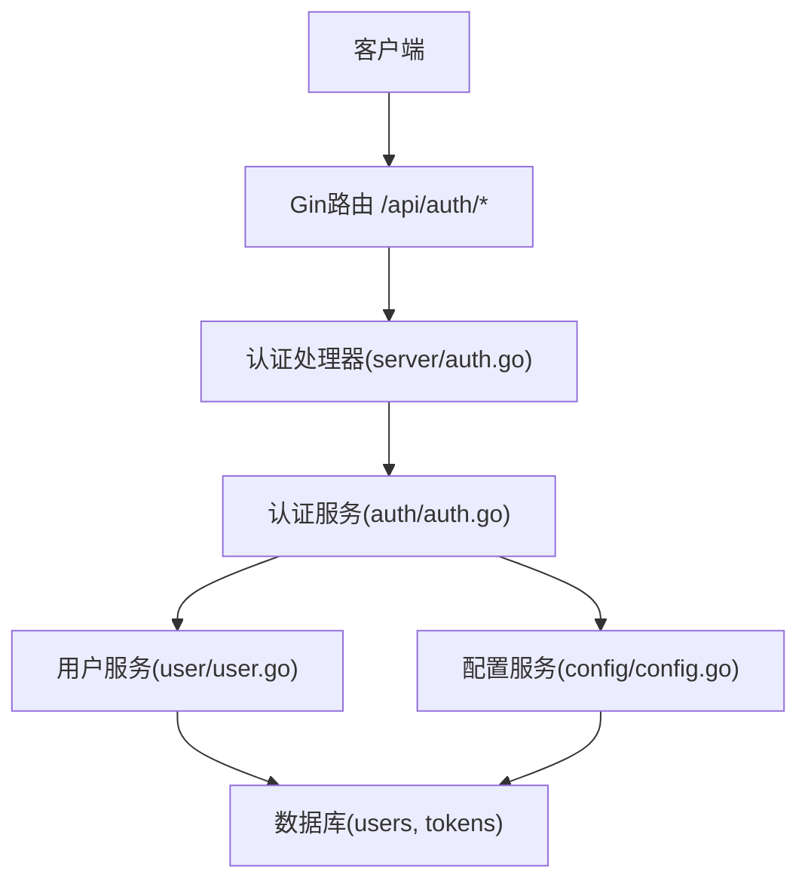
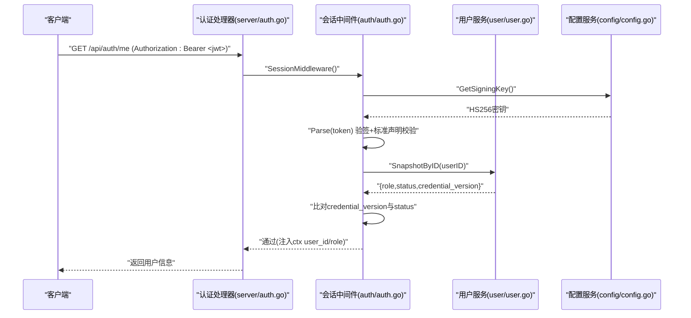
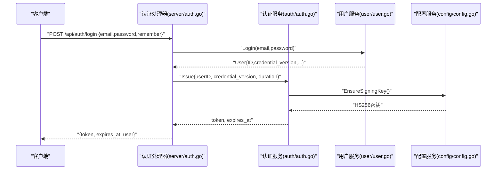
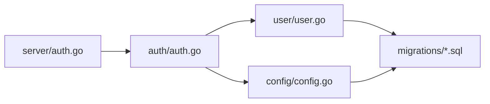

# JWT令牌管理

<cite>
**本文引用的文件**
- [backend/internal/auth/auth.go](file://backend/internal/auth/auth.go)
- [backend/internal/server/auth.go](file://backend/internal/server/auth.go)
- [backend/internal/config/config.go](file://backend/internal/config/config.go)
- [backend/internal/user/user.go](file://backend/internal/user/user.go)
- [backend/migrations/0002_users.sql](file://backend/migrations/0002_users.sql)
- [backend/migrations/1004_tokens.sql](file://backend/migrations/1004_tokens.sql)
</cite>

## 目录
1. [简介](#简介)
2. [项目结构](#项目结构)
3. [核心组件](#核心组件)
4. [架构总览](#架构总览)
5. [详细组件分析](#详细组件分析)
6. [依赖关系分析](#依赖关系分析)
7. [性能考量](#性能考量)
8. [故障排查指南](#故障排查指南)
9. [结论](#结论)
10. [附录：安全最佳实践与示例路径](#附录：安全最佳实践与示例路径)

## 简介
本文件系统性说明本项目中JWT会话令牌的签发、解析与验证机制，重点覆盖Claims结构设计（包含UserID与CredentialVersion）、HS256签名算法使用、会话有效期控制策略；并阐述令牌刷新机制、凭证版本控制原理、令牌撤销实现方式。同时给出密钥管理、算法选择、过期时间设置等安全最佳实践，并提供生成与验证的代码片段路径，解释如何防止令牌重放攻击与跨站请求伪造（CSRF）。

## 项目结构
后端采用分层设计：
- 接入层（server）：注册登录等HTTP端点，调用认证服务签发/校验会话。
- 认证服务（auth）：负责JWT签发、解析、中间件校验、凭据版本比对。
- 配置服务（config）：提供签名密钥的获取与确保存在，以及敏感配置加解密。
- 用户服务（user）：提供用户快照查询，供会话中间件实时校验状态与凭据版本。
- 数据库迁移：定义users表中的credential_version字段，以及下载/分享/规则Token表结构。

图表来源
- [backend/internal/server/auth.go:24-34](file://backend/internal/server/auth.go#L24-L34)
- [backend/internal/auth/auth.go:98-135](file://backend/internal/auth/auth.go#L98-L135)
- [backend/internal/config/config.go:282-313](file://backend/internal/config/config.go#L282-L313)
- [backend/internal/user/user.go:189-201](file://backend/internal/user/user.go#L189-L201)

章节来源
- [backend/internal/server/auth.go:24-34](file://backend/internal/server/auth.go#L24-L34)
- [backend/internal/auth/auth.go:98-135](file://backend/internal/auth/auth.go#L98-L135)
- [backend/internal/config/config.go:282-313](file://backend/internal/config/config.go#L282-L313)
- [backend/internal/user/user.go:189-201](file://backend/internal/user/user.go#L189-L201)
- [backend/migrations/0002_users.sql:1-17](file://backend/migrations/0002_users.sql#L1-L17)

## 核心组件
- 认证服务（auth.Service）
  - Issue：使用HS256对Claims进行签名，签发JWT并返回token与过期时间。
  - Parse：解析并验签JWT，强制要求HMAC算法匹配。
  - SessionMiddleware：从Authorization头提取Bearer Token，解析后实时查库取用户快照，比对credential_version与status，注入上下文用户ID与角色。
- 配置服务（config.Service）
  - EnsureSigningKey/GetSigningKey：确保并读取HS256签名密钥（明文落库），缺失时返回错误以阻止签发/验签。
- 用户服务（user.Service）
  - SnapshotByID：按用户ID查询role、status、credential_version，供会话中间件实时校验。
- 数据模型
  - users.credential_version：用于会话失效与批量撤销。
  - download/share/rule tokens：用于资源访问的短期随机令牌（非JWT），支持轮替与吊销。

章节来源
- [backend/internal/auth/auth.go:66-135](file://backend/internal/auth/auth.go#L66-L135)
- [backend/internal/config/config.go:282-313](file://backend/internal/config/config.go#L282-L313)
- [backend/internal/user/user.go:189-201](file://backend/internal/user/user.go#L189-L201)
- [backend/migrations/0002_users.sql:1-17](file://backend/migrations/0002_users.sql#L1-L17)
- [backend/migrations/1004_tokens.sql:1-47](file://backend/migrations/1004_tokens.sql#L1-L47)

## 架构总览
下图展示一次受保护API请求的完整流程：客户端携带JWT，服务端中间件解析、验签、实时查库校验凭据版本与账号状态，通过后进入业务处理。

图表来源
- [backend/internal/server/auth.go:24-34](file://backend/internal/server/auth.go#L24-L34)
- [backend/internal/auth/auth.go:144-180](file://backend/internal/auth/auth.go#L144-L180)
- [backend/internal/config/config.go:282-292](file://backend/internal/config/config.go#L282-L292)
- [backend/internal/user/user.go:189-201](file://backend/internal/user/user.go#L189-L201)

## 详细组件分析

### JWT Claims设计与签发
- Claims结构
  - 仅包含最小必要信息：用户ID（uid）与凭据版本号（cv），以及标准声明（IssuedAt、ExpiresAt等）。
  - 角色、组等权限信息不入JWT，每次请求实时查库，避免缓存不一致导致的越权风险。
- 签发过程
  - 使用HS256算法对Claims进行签名。
  - 签发前确保签名密钥存在（若未配置则自动生成并落库）。
  - 根据“记住我”选项决定会话时长：默认24小时，勾选记住我为7天。
- 代码片段路径
  - Claims定义与Issue实现：[backend/internal/auth/auth.go:66-116](file://backend/internal/auth/auth.go#L66-L116)
  - 会话时长常量：[backend/internal/auth/auth.go:22-28](file://backend/internal/auth/auth.go#L22-L28)
  - 签名密钥确保：[backend/internal/config/config.go:294-313](file://backend/internal/config/config.go#L294-L313)

章节来源
- [backend/internal/auth/auth.go:22-28](file://backend/internal/auth/auth.go#L22-L28)
- [backend/internal/auth/auth.go:66-116](file://backend/internal/auth/auth.go#L66-L116)
- [backend/internal/config/config.go:294-313](file://backend/internal/config/config.go#L294-L313)

### JWT解析与验证
- 解析与验签
  - 强制要求算法为HMAC（HS256），拒绝其他算法。
  - 验签失败或标准声明校验失败均返回未授权。
- 实时校验
  - 解析成功后，按userID实时查询用户快照，比对credential_version与status。
  - 若版本不匹配或状态非active，立即拒绝。
- 代码片段路径
  - Parse与中间件校验逻辑：[backend/internal/auth/auth.go:118-180](file://backend/internal/auth/auth.go#L118-L180)
  - 用户快照查询：[backend/internal/user/user.go:189-201](file://backend/internal/user/user.go#L189-L201)

章节来源
- [backend/internal/auth/auth.go:118-180](file://backend/internal/auth/auth.go#L118-L180)
- [backend/internal/user/user.go:189-201](file://backend/internal/user/user.go#L189-L201)

### 会话有效期控制策略
- 默认会话时长：24小时（不勾选记住我）。
- 记住我：7天。
- OIDC固定会话：7天（无记住我选项）。
- 过期时间由签发时计算并写入标准声明ExpiresAt，解析时由库自动校验。
- 代码片段路径
  - 会话时长常量：[backend/internal/auth/auth.go:22-28](file://backend/internal/auth/auth.go#L22-L28)
  - 登录/注册签发时长选择：[backend/internal/server/auth.go:80-134](file://backend/internal/server/auth.go#L80-L134)

章节来源
- [backend/internal/auth/auth.go:22-28](file://backend/internal/auth/auth.go#L22-L28)
- [backend/internal/server/auth.go:80-134](file://backend/internal/server/auth.go#L80-L134)

### 令牌刷新机制
- 当前会话JWT为无状态，服务端不存储会话；前端在过期前可重新登录或按需刷新。
- 对于下载/分享/规则等资源访问令牌（非JWT），提供轮替接口：旧令牌失效，新令牌生效，保证同一复用键不变。
- 代码片段路径
  - 下载令牌轮替：[backend/internal/token/token.go:125-156](file://backend/internal/token/token.go#L125-L156)
  - 分享令牌轮替：[backend/internal/token/token.go:189-195](file://backend/internal/token/token.go#L189-L195)
  - 规则令牌轮替：[backend/internal/token/token.go:210-234](file://backend/internal/token/token.go#L210-L234)

章节来源
- [backend/internal/token/token.go:125-156](file://backend/internal/token/token.go#L125-L156)
- [backend/internal/token/token.go:189-195](file://backend/internal/token/token.go#L189-L195)
- [backend/internal/token/token.go:210-234](file://backend/internal/token/token.go#L210-L234)

### 凭证版本控制原理
- 每个用户拥有credential_version字段，初始为0。
- 当密码修改、禁用/激活等操作时，应递增该版本。
- 会话中间件在每次请求时比对JWT中的cv与数据库中的cv，不匹配则拒绝，实现“批量撤销”效果。
- 代码片段路径
  - 用户表字段定义：[backend/migrations/0002_users.sql:1-17](file://backend/migrations/0002_users.sql#L1-L17)
  - 中间件版本比对：[backend/internal/auth/auth.go:160-170](file://backend/internal/auth/auth.go#L160-L170)
  - 快照查询包含credential_version：[backend/internal/user/user.go:189-201](file://backend/internal/user/user.go#L189-L201)

章节来源
- [backend/migrations/0002_users.sql:1-17](file://backend/migrations/0002_users.sql#L1-L17)
- [backend/internal/auth/auth.go:160-170](file://backend/internal/auth/auth.go#L160-L170)
- [backend/internal/user/user.go:189-201](file://backend/internal/user/user.go#L189-L201)

### 令牌撤销实现方式
- 会话JWT撤销：通过递增用户的credential_version，使所有旧JWT在新请求时被拒绝。
- 资源访问令牌撤销：物理删除对应记录（如download/share/rule tokens），或通过轮替替换为新令牌。
- 代码片段路径
  - 会话撤销（版本比对）：[backend/internal/auth/auth.go:160-170](file://backend/internal/auth/auth.go#L160-L170)
  - 下载令牌删除：[backend/internal/token/token.go:92-123](file://backend/internal/token/token.go#L92-L123)
  - 分享/规则令牌删除与轮替：[backend/internal/token/token.go:189-234](file://backend/internal/token/token.go#L189-L234)

章节来源
- [backend/internal/auth/auth.go:160-170](file://backend/internal/auth/auth.go#L160-L170)
- [backend/internal/token/token.go:92-123](file://backend/internal/token/token.go#L92-L123)
- [backend/internal/token/token.go:189-234](file://backend/internal/token/token.go#L189-L234)

### 登录/注册流程与JWT签发时序

图表来源
- [backend/internal/server/auth.go:99-134](file://backend/internal/server/auth.go#L99-L134)
- [backend/internal/auth/auth.go:98-116](file://backend/internal/auth/auth.go#L98-L116)
- [backend/internal/config/config.go:294-313](file://backend/internal/config/config.go#L294-L313)

章节来源
- [backend/internal/server/auth.go:99-134](file://backend/internal/server/auth.go#L99-L134)
- [backend/internal/auth/auth.go:98-116](file://backend/internal/auth/auth.go#L98-L116)
- [backend/internal/config/config.go:294-313](file://backend/internal/config/config.go#L294-L313)

## 依赖关系分析
- auth.Service依赖config.Service获取HS256密钥，依赖user.Service获取用户快照。
- server.AuthHandler组合auth中间件与业务处理器，形成鉴权链路。
- 数据库迁移定义了users表的credential_version与各类tokens表结构，支撑会话与资源访问控制。

图表来源
- [backend/internal/server/auth.go:24-34](file://backend/internal/server/auth.go#L24-L34)
- [backend/internal/auth/auth.go:98-180](file://backend/internal/auth/auth.go#L98-L180)
- [backend/internal/config/config.go:282-313](file://backend/internal/config/config.go#L282-L313)
- [backend/internal/user/user.go:189-201](file://backend/internal/user/user.go#L189-L201)
- [backend/migrations/0002_users.sql:1-17](file://backend/migrations/0002_users.sql#L1-L17)
- [backend/migrations/1004_tokens.sql:1-47](file://backend/migrations/1004_tokens.sql#L1-L47)

章节来源
- [backend/internal/server/auth.go:24-34](file://backend/internal/server/auth.go#L24-L34)
- [backend/internal/auth/auth.go:98-180](file://backend/internal/auth/auth.go#L98-L180)
- [backend/internal/config/config.go:282-313](file://backend/internal/config/config.go#L282-L313)
- [backend/internal/user/user.go:189-201](file://backend/internal/user/user.go#L189-L201)
- [backend/migrations/0002_users.sql:1-17](file://backend/migrations/0002_users.sql#L1-L17)
- [backend/migrations/1004_tokens.sql:1-47](file://backend/migrations/1004_tokens.sql#L1-L47)

## 性能考量
- JWT无状态：无需服务端会话存储，减少数据库压力。
- 实时查库：每次请求都查询用户快照，确保权限与状态一致，但会增加DB负载；可通过合理索引与缓存策略优化（注意一致性）。
- 令牌轮替：资源访问令牌采用“旧删新写”原子事务，避免并发冲突。
- 限流与验证码：登录/注册/忘记密码入口叠加限流与验证码，降低暴力破解风险。

章节来源
- [backend/internal/server/auth.go:24-34](file://backend/internal/server/auth.go#L24-L34)
- [backend/internal/token/token.go:125-156](file://backend/internal/token/token.go#L125-L156)

## 故障排查指南
- 未授权（401）常见原因
  - Authorization头缺失或格式错误。
  - JWT验签失败（密钥不一致或篡改）。
  - 用户不存在或状态非active。
  - credential_version不匹配（已批量撤销）。
- 相关错误处理路径
  - 会话中间件错误分支：[backend/internal/auth/auth.go:144-180](file://backend/internal/auth/auth.go#L144-L180)
  - 登录失败统一提示：[backend/internal/server/auth.go:111-119](file://backend/internal/server/auth.go#L111-L119)
  - 重置链接无效或过期：[backend/internal/server/auth.go:173-196](file://backend/internal/server/auth.go#L173-L196)

章节来源
- [backend/internal/auth/auth.go:144-180](file://backend/internal/auth/auth.go#L144-L180)
- [backend/internal/server/auth.go:111-119](file://backend/internal/server/auth.go#L111-L119)
- [backend/internal/server/auth.go:173-196](file://backend/internal/server/auth.go#L173-L196)

## 结论
本项目采用JWT作为会话载体，结合HS256签名与最小化Claims设计，配合实时查库校验与凭据版本控制，实现了高安全性与易扩展的认证体系。资源访问令牌采用随机值与轮替机制，支持细粒度撤销与审计。整体架构清晰、职责分离，便于维护与安全加固。

## 附录：安全最佳实践与示例路径

- 密钥管理
  - HS256密钥由配置服务确保存在，缺失时自动生成并落库；生产环境建议将密钥置于环境变量或密钥管理服务，避免明文落库。
  - 参考路径：[backend/internal/config/config.go:294-313](file://backend/internal/config/config.go#L294-L313)

- 算法选择
  - 强制使用HS256，并在解析时校验算法类型，防止降级攻击。
  - 参考路径：[backend/internal/auth/auth.go:118-135](file://backend/internal/auth/auth.go#L118-L135)

- 过期时间设置
  - 默认24小时，记住我7天；可根据业务调整，但需平衡安全与体验。
  - 参考路径：[backend/internal/auth/auth.go:22-28](file://backend/internal/auth/auth.go#L22-L28)

- 防止令牌重放攻击
  - 使用HTTPS传输，避免中间人窃听。
  - 短生命周期JWT+刷新策略（前端在过期前重新登录或刷新）。
  - 资源访问令牌采用一次性或轮替机制，降低重放价值。
  - 参考路径：[backend/internal/token/token.go:125-156](file://backend/internal/token/token.go#L125-L156)

- 防止跨站请求伪造（CSRF）
  - 使用Bearer Token模式，避免Cookie自动携带。
  - 严格校验Origin/Referer（可选）。
  - 对敏感操作实施二次确认或验证码。
  - 参考路径：[backend/internal/server/auth.go:24-34](file://backend/internal/server/auth.go#L24-L34)

- 令牌生成与验证代码示例路径
  - 签发JWT：[backend/internal/auth/auth.go:98-116](file://backend/internal/auth/auth.go#L98-L116)
  - 解析与验签JWT：[backend/internal/auth/auth.go:118-135](file://backend/internal/auth/auth.go#L118-L135)
  - 会话中间件校验：[backend/internal/auth/auth.go:144-180](file://backend/internal/auth/auth.go#L144-L180)
  - 登录签发流程：[backend/internal/server/auth.go:99-134](file://backend/internal/server/auth.go#L99-L134)