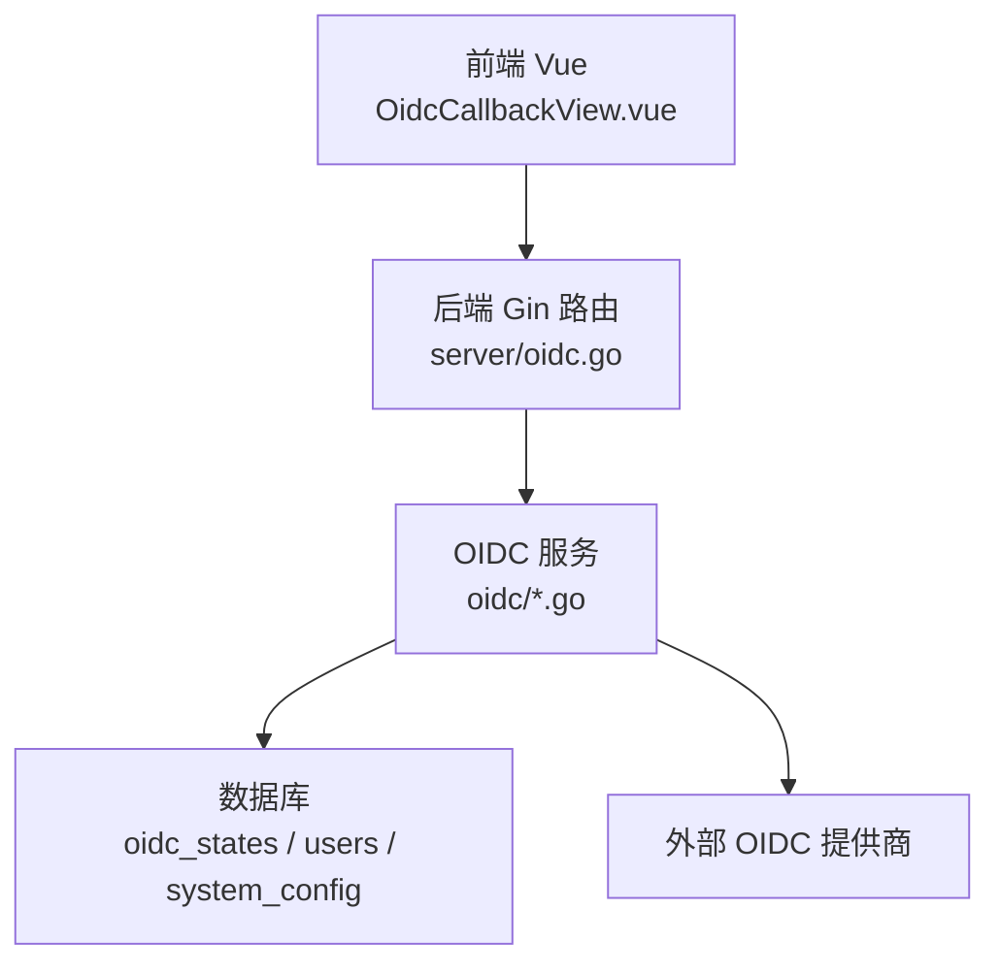
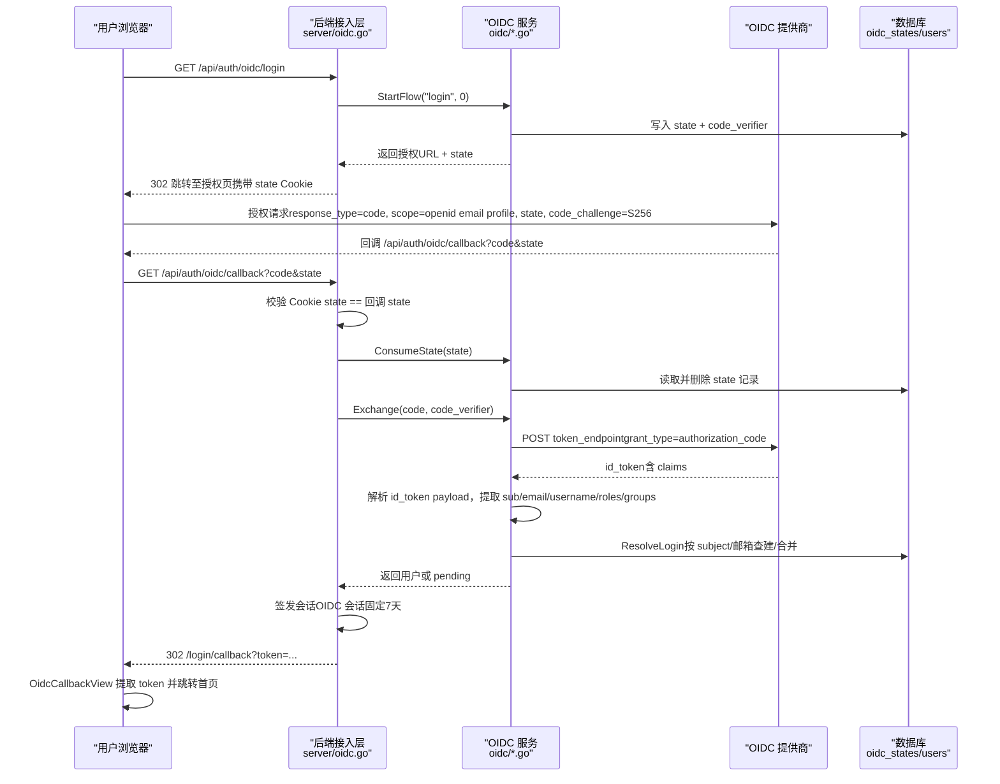
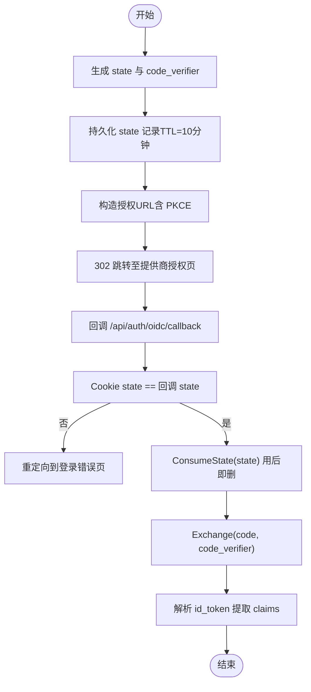
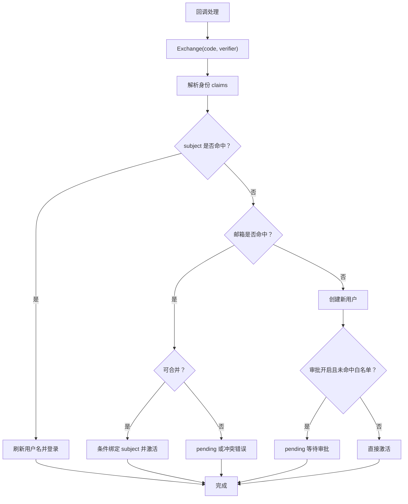
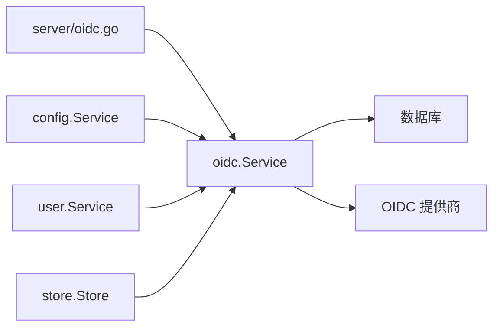

# OIDC单点登录集成

<cite>
**本文引用的文件**
- [backend/internal/oidc/oidc.go](file://backend/internal/oidc/oidc.go)
- [backend/internal/oidc/flow.go](file://backend/internal/oidc/flow.go)
- [backend/internal/oidc/helpers.go](file://backend/internal/oidc/helpers.go)
- [backend/internal/oidc/mock.go](file://backend/internal/oidc/mock.go)
- [backend/internal/oidc/resolve.go](file://backend/internal/oidc/resolve.go)
- [backend/internal/server/oidc.go](file://backend/internal/server/oidc.go)
- [backend/internal/user/oidc.go](file://backend/internal/user/oidc.go)
- [backend/migrations/0004_oidc.sql](file://backend/migrations/0004_oidc.sql)
- [frontend/src/views/OidcCallbackView.vue](file://frontend/src/views/OidcCallbackView.vue)
- [frontend/src/api/oidc.ts](file://frontend/src/api/oidc.ts)
</cite>

## 目录
1. [简介](#简介)
2. [项目结构](#项目结构)
3. [核心组件](#核心组件)
4. [架构总览](#架构总览)
5. [详细组件分析](#详细组件分析)
6. [依赖关系分析](#依赖关系分析)
7. [性能与安全考量](#性能与安全考量)
8. [故障排查指南](#故障排查指南)
9. [结论](#结论)
10. [附录：常见提供商配置示例](#附录常见提供商配置示例)

## 简介
本文件面向需要在系统中集成 OpenID Connect（OIDC）单点登录的读者，系统性说明授权码流程、状态参数验证、回调处理机制、用户信息获取、角色与组映射、白名单审批策略、会话管理与本地认证集成，以及多因素认证与账户关联的处理方式。文档同时提供常见 OIDC 提供商的配置要点与排错建议。

## 项目结构
后端采用分层设计：
- 接入层：Gin 路由处理器负责发起授权、处理回调、绑定等 HTTP 端点。
- 业务层：OIDC Service 实现发现文档缓存、PKCE 授权码流程、state 持久化与校验、token 交换、身份解析、用户查建合并与绑定、白名单匹配、测试连接等。
- 数据层：通过 store 访问数据库；migrations 定义 oidc_states 表用于 state 存储与过期清理。
- 前端：Vue 页面与 API 封装，完成回调中转、令牌设置与跳转。

图表来源
- [backend/internal/server/oidc.go:19-27](file://backend/internal/server/oidc.go#L19-L27)
- [backend/internal/oidc/oidc.go:53-73](file://backend/internal/oidc/oidc.go#L53-L73)
- [backend/migrations/0004_oidc.sql:1-9](file://backend/migrations/0004_oidc.sql#L1-L9)

章节来源
- [backend/internal/server/oidc.go:19-27](file://backend/internal/server/oidc.go#L19-L27)
- [backend/internal/oidc/oidc.go:53-73](file://backend/internal/oidc/oidc.go#L53-L73)
- [backend/migrations/0004_oidc.sql:1-9](file://backend/migrations/0004_oidc.sql#L1-L9)

## 核心组件
- OIDC 服务（Service）：封装发现文档获取与缓存、PKCE 授权码流程、state 生成与消费、token 交换、身份解析、用户查建合并、绑定、白名单匹配、测试连接等。
- 接入处理器（Handler）：注册 /api/auth/oidc/login、/callback、/bind、/mock/login、/test 等端点，协调会话签发与重定向。
- 用户服务扩展：按 subject/邮箱查询、刷新用户名、条件绑定 subject、从 OIDC 创建新用户并处理首管理员逻辑。
- 迁移脚本：创建 oidc_states 表用于 state 存储与 TTL 清理。
- 前端回调页：提取后端返回的 token，存入本地状态并跳转首页。

章节来源
- [backend/internal/oidc/oidc.go:53-73](file://backend/internal/oidc/oidc.go#L53-L73)
- [backend/internal/server/oidc.go:19-27](file://backend/internal/server/oidc.go#L19-L27)
- [backend/internal/user/oidc.go:13-27](file://backend/internal/user/oidc.go#L13-L27)
- [backend/migrations/0004_oidc.sql:1-9](file://backend/migrations/0004_oidc.sql#L1-L9)
- [frontend/src/views/OidcCallbackView.vue:1-21](file://frontend/src/views/OidcCallbackView.vue#L1-L21)

## 架构总览
下图展示一次完整的 OIDC 授权码流程（含 PKCE），从浏览器发起登录到最终建立会话的全过程。

图表来源
- [backend/internal/server/oidc.go:31-89](file://backend/internal/server/oidc.go#L31-L89)
- [backend/internal/oidc/flow.go:27-62](file://backend/internal/oidc/flow.go#L27-L62)
- [backend/internal/oidc/flow.go:95-119](file://backend/internal/oidc/flow.go#L95-L119)
- [backend/internal/oidc/flow.go:132-227](file://backend/internal/oidc/flow.go#L132-L227)
- [backend/internal/oidc/resolve.go:17-83](file://backend/internal/oidc/resolve.go#L17-L83)
- [backend/migrations/0004_oidc.sql:1-9](file://backend/migrations/0004_oidc.sql#L1-L9)

## 详细组件分析

### 授权码流程与 PKCE
- 启动流程：生成高熵 state（≥128位）与 code_verifier，持久化到 oidc_states，构造授权 URL（包含 response_type=code、scope=openid email profile、state、code_challenge=S256）。
- PKCE 挑战：使用 SHA-256 对 verifier 进行哈希并 Base64URL 编码得到 challenge。
- 回调处理：比对 Cookie state 与回调参数 state，调用 ConsumeState 一次性读取并删除记录，防止重放攻击。
- Token 交换：POST token_endpoint 换取 id_token，解析 payload 提取身份字段。

图表来源
- [backend/internal/oidc/flow.go:27-62](file://backend/internal/oidc/flow.go#L27-L62)
- [backend/internal/oidc/flow.go:95-119](file://backend/internal/oidc/flow.go#L95-L119)
- [backend/internal/oidc/flow.go:132-227](file://backend/internal/oidc/flow.go#L132-L227)
- [backend/internal/oidc/helpers.go:24-38](file://backend/internal/oidc/helpers.go#L24-L38)

章节来源
- [backend/internal/oidc/flow.go:27-62](file://backend/internal/oidc/flow.go#L27-L62)
- [backend/internal/oidc/flow.go:95-119](file://backend/internal/oidc/flow.go#L95-L119)
- [backend/internal/oidc/flow.go:132-227](file://backend/internal/oidc/flow.go#L132-L227)
- [backend/internal/oidc/helpers.go:24-38](file://backend/internal/oidc/helpers.go#L24-L38)

### 状态参数验证与会话安全
- State 生成：使用加密安全随机数填充，长度满足 ≥128 位要求。
- State 存储：写入 oidc_states，附带 code_verifier、intent、bind_user_id、created_at。
- TTL 清理：每次写入前清理过期记录，避免独立定时任务。
- 三重校验：Cookie state == 回调参数 state == 存储记录存在且未过期，用后即删防重放。
- 会话固定：OIDC 会话固定为 7 天，无“记住我”选项。

章节来源
- [backend/internal/oidc/flow.go:27-62](file://backend/internal/oidc/flow.go#L27-L62)
- [backend/internal/oidc/flow.go:70-85](file://backend/internal/oidc/flow.go#L70-L85)
- [backend/internal/oidc/flow.go:95-119](file://backend/internal/oidc/flow.go#L95-L119)
- [backend/internal/server/oidc.go:31-89](file://backend/internal/server/oidc.go#L31-L89)
- [backend/migrations/0004_oidc.sql:1-9](file://backend/migrations/0004_oidc.sql#L1-L9)

### 回调处理机制与用户查建合并
- 回调入口：/api/auth/oidc/callback，执行三重校验后调用 Exchange 获取身份。
- 身份解析：从 id_token payload 提取 sub、email、email_verified、preferred_username/name、roles、groups。
- 用户查建：
  - 命中 subject：直接登录，刷新 username 为提供商最新值。
  - 命中邮箱：若目标账号未绑定其他 OIDC 且邮箱已验证，则自动合并并激活；待审批账号则绑定 subject 并进入 pending。
  - 均不存在：创建新用户，首管理员免审批并激活；否则根据审批开关与白名单决定是否 pending。
- 绑定流程：intent=bind 时校验 subject 未绑定其他账号，写入目标账号，不签发会话。

图表来源
- [backend/internal/server/oidc.go:42-89](file://backend/internal/server/oidc.go#L42-L89)
- [backend/internal/oidc/flow.go:132-227](file://backend/internal/oidc/flow.go#L132-L227)
- [backend/internal/oidc/resolve.go:17-83](file://backend/internal/oidc/resolve.go#L17-L83)
- [backend/internal/user/oidc.go:13-27](file://backend/internal/user/oidc.go#L13-L27)
- [backend/internal/user/oidc.go:68-119](file://backend/internal/user/oidc.go#L68-L119)

章节来源
- [backend/internal/server/oidc.go:42-89](file://backend/internal/server/oidc.go#L42-L89)
- [backend/internal/oidc/resolve.go:17-83](file://backend/internal/oidc/resolve.go#L17-L83)
- [backend/internal/user/oidc.go:13-27](file://backend/internal/user/oidc.go#L13-L27)
- [backend/internal/user/oidc.go:68-119](file://backend/internal/user/oidc.go#L68-L119)

### 配置管理、客户端ID与密钥、重定向URL
- 配置键：
  - oidc_provider_type：当前提供商类型（keycloak/auth0/generic/mock）。
  - oidc_configured：是否已配置。
  - oidc_params_*：各提供商参数 JSON（base_url、realm、client_id、client_secret 密文）。
  - oidc_approval：新用户审批开关。
  - oidc_whitelist：白名单 JSON（role_claim_path、role_values、group_claim_path、group_values）。
- 敏感字段：client_secret 在落库前经加密存储，读取时解密。
- 回调地址：由前端地址拼接 /api/auth/oidc/callback。
- 发现文档：支持 /.well-known/openid-configuration 与 Keycloak realms 路径，带内存缓存。

章节来源
- [backend/internal/oidc/oidc.go:23-33](file://backend/internal/oidc/oidc.go#L23-L33)
- [backend/internal/oidc/oidc.go:75-155](file://backend/internal/oidc/oidc.go#L75-L155)
- [backend/internal/oidc/oidc.go:157-212](file://backend/internal/oidc/oidc.go#L157-L212)

### 用户信息获取、角色映射与权限同步
- 身份信息：sub、email、email_verified、username（优先 preferred_username，其次 name，最后邮箱前缀）。
- 角色与组：从 realm_access.roles 与 groups 提取，供后续权限系统使用。
- 白名单匹配：
  - 读取 role_claim_path/group_claim_path 与对应允许值集合。
  - 支持点分路径取值（如 realm_access.roles），兼容字符串与数组。
  - 任一命中即视为白名单通过，跳过审批直接激活。
- 首次管理员：空表时首个登录者自动成为 admin 并激活，不受审批开关影响。

章节来源
- [backend/internal/oidc/flow.go:132-227](file://backend/internal/oidc/flow.go#L132-L227)
- [backend/internal/oidc/oidc.go:214-238](file://backend/internal/oidc/oidc.go#L214-L238)
- [backend/internal/oidc/helpers.go:40-88](file://backend/internal/oidc/helpers.go#L40-L88)
- [backend/internal/user/oidc.go:68-119](file://backend/internal/user/oidc.go#L68-L119)

### 会话管理与本地认证集成
- OIDC 会话：固定 7 天，无“记住我”，通过 auth 服务签发会话凭据。
- 本地认证：系统保留本地登录能力（allow_local_login），与 OIDC 并行；OIDC 登录成功后走统一会话签发。
- 前端回调页：/login/callback 提取 token 存入本地状态并立即清空 URL，随后跳转首页。

章节来源
- [backend/internal/server/oidc.go:68-89](file://backend/internal/server/oidc.go#L68-L89)
- [frontend/src/views/OidcCallbackView.vue:1-21](file://frontend/src/views/OidcCallbackView.vue#L1-L21)

### 多因素认证与账户关联
- 多因素认证（MFA）：本实现未内置 MFA 流程；可在 OIDC 提供商侧启用 MFA，系统仅信任提供商返回的身份与 claims。
- 账户关联：
  - 支持按邮箱自动合并（需邮箱已验证且目标账号未绑定其他 OIDC）。
  - 支持手动绑定（intent=bind），校验 subject 未绑定其他账号后写入。
  - 待审批账号可绑定 subject 并继续等待审批。

章节来源
- [backend/internal/oidc/resolve.go:17-83](file://backend/internal/oidc/resolve.go#L17-L83)
- [backend/internal/oidc/resolve.go:85-103](file://backend/internal/oidc/resolve.go#L85-L103)
- [backend/internal/user/oidc.go:42-66](file://backend/internal/user/oidc.go#L42-L66)

## 依赖关系分析
- 接入层依赖 OIDC 服务与认证服务。
- OIDC 服务依赖配置服务、用户服务、store 与外部 HTTP 客户端。
- 用户服务依赖 store 与配置服务（首管理员标记）。
- 迁移脚本提供 oidc_states 表结构。

图表来源
- [backend/internal/server/oidc.go:13-27](file://backend/internal/server/oidc.go#L13-L27)
- [backend/internal/oidc/oidc.go:53-73](file://backend/internal/oidc/oidc.go#L53-L73)
- [backend/internal/user/oidc.go:1-11](file://backend/internal/user/oidc.go#L1-L11)

章节来源
- [backend/internal/server/oidc.go:13-27](file://backend/internal/server/oidc.go#L13-L27)
- [backend/internal/oidc/oidc.go:53-73](file://backend/internal/oidc/oidc.go#L53-L73)
- [backend/internal/user/oidc.go:1-11](file://backend/internal/user/oidc.go#L1-L11)

## 性能与安全考量
- 性能
  - 发现文档缓存：按 base_url + realm 缓存，减少网络开销。
  - 并发安全：使用互斥锁保护缓存读写；state 写入使用 BEGIN IMMEDIATE 事务防并发覆盖。
  - 资源限制：HTTP 响应体读取限制大小，避免大响应导致内存压力。
- 安全
  - PKCE：强制使用 S256，防止授权码拦截。
  - State 一次性：用后即删，结合 Cookie 与回调参数三重校验。
  - 敏感配置：client_secret 加密存储，读取时解密。
  - 会话固定：OIDC 会话固定时长，降低长期会话风险。
  - 白名单：基于 claims 路径匹配，控制新用户审批策略。

[本节为通用指导，无需具体文件引用]

## 故障排查指南
- 回调报错 state_mismatch/state_expired：检查 Cookie 与回调参数是否一致，确认 state 未过期。
- exchange_failed：检查 token_endpoint 可达性与 client_id/secret 是否正确，查看提供商返回的错误信息。
- resolve_failed：检查用户是否存在、是否禁用、邮箱是否验证、是否已绑定其他 OIDC。
- 测试连接失败：确认 base_url 与 client_id 必填，发现文档可访问；若提供商不支持 client_credentials，会降级为警告。

章节来源
- [backend/internal/server/oidc.go:42-89](file://backend/internal/server/oidc.go#L42-L89)
- [backend/internal/oidc/mock.go:81-107](file://backend/internal/oidc/mock.go#L81-L107)
- [backend/internal/oidc/flow.go:132-227](file://backend/internal/oidc/flow.go#L132-L227)

## 结论
本实现提供了完整且安全的 OIDC 授权码流程，涵盖 PKCE、state 校验、回调处理、用户查建合并、角色与组映射、白名单审批、会话管理与账户关联。通过发现文档缓存与事务级操作保障性能与一致性。生产环境建议启用可信提供商与必要的签名校验，并根据组织策略配置白名单与审批流程。

[本节为总结性内容，无需具体文件引用]

## 附录：常见提供商配置示例
以下为常见 OIDC 提供商的关键配置项与注意事项（以系统配置键与字段为准）：
- Keycloak
  - provider_type: keycloak
  - base_url: Keycloak 服务器地址
  - realm: 租户域
  - client_id: 应用客户端 ID
  - client_secret: 客户端密钥（加密存储）
  - 回调地址：前端地址 + /api/auth/oidc/callback
- Auth0
  - provider_type: auth0
  - base_url: Auth0 域名
  - client_id: 应用客户端 ID
  - client_secret: 客户端密钥（加密存储）
  - 回调地址：同上
- Generic（通用）
  - provider_type: generic
  - base_url: 任意符合 OIDC 规范的提供商地址
  - client_id/client_secret: 按提供商要求配置
  - 回调地址：同上
- Mock（开发测试）
  - provider_type: mock
  - 仅 Dev 模式可用，模拟登录接口 /auth/oidc/mock/login 可直接签发会话

提示
- 使用 /api/oidc/test 端点进行连接测试，验证发现文档可达性与配置完整性。
- 白名单配置（role_claim_path、group_claim_path 及允许值）可控制新用户是否直接进入审批流程。
- 首管理员机制确保系统初始化后可直接获得管理员权限。

章节来源
- [backend/internal/oidc/oidc.go:23-33](file://backend/internal/oidc/oidc.go#L23-L33)
- [backend/internal/oidc/mock.go:81-107](file://backend/internal/oidc/mock.go#L81-L107)
- [backend/internal/server/oidc.go:141-163](file://backend/internal/server/oidc.go#L141-L163)
- [frontend/src/api/oidc.ts:4-11](file://frontend/src/api/oidc.ts#L4-L11)