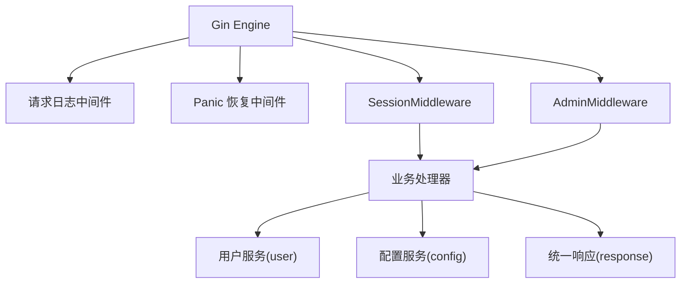
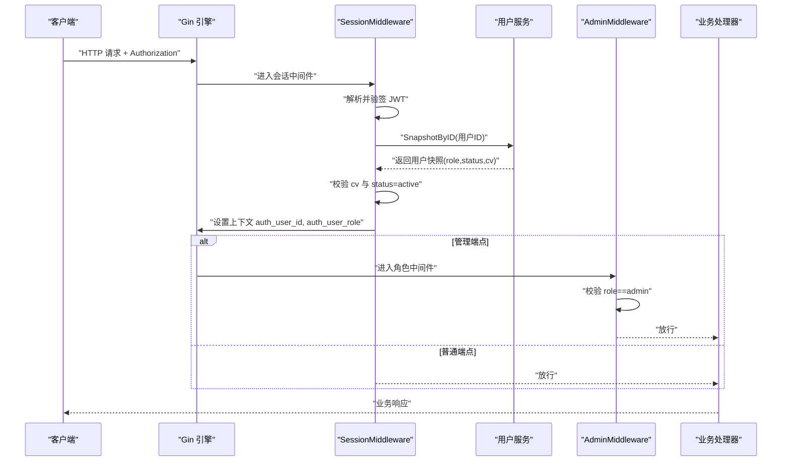
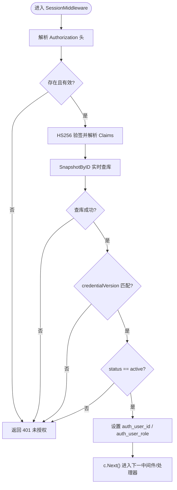
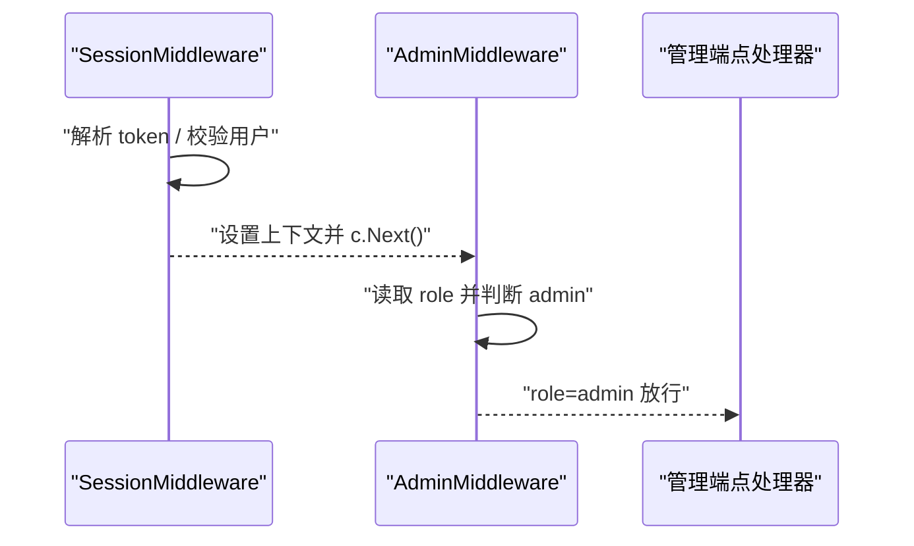
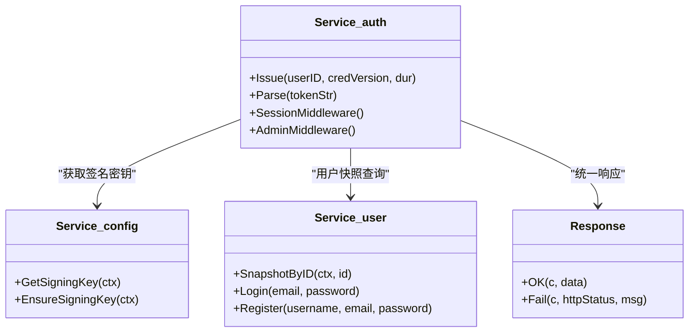

# 会话管理与中间件

<cite>
**本文引用的文件**
- [backend/internal/auth/auth.go](file://backend/internal/auth/auth.go)
- [backend/internal/server/server.go](file://backend/internal/server/server.go)
- [backend/internal/server/auth.go](file://backend/internal/server/auth.go)
- [backend/internal/user/user.go](file://backend/internal/user/user.go)
- [backend/internal/config/config.go](file://backend/internal/config/config.go)
- [backend/internal/response/response.go](file://backend/internal/response/response.go)
- [backend/cmd/server/main.go](file://backend/cmd/server/main.go)
</cite>

## 目录
1. [简介](#简介)
2. [项目结构](#项目结构)
3. [核心组件](#核心组件)
4. [架构总览](#架构总览)
5. [详细组件分析](#详细组件分析)
6. [依赖关系分析](#依赖关系分析)
7. [性能与并发](#性能与并发)
8. [故障排查指南](#故障排查指南)
9. [结论](#结论)
10. [附录：常见认证场景与中间件配置示例](#附录常见认证场景与中间件配置示例)

## 简介
本文件聚焦于 Gin 框架下的会话管理与中间件机制，系统性说明以下要点：
- SessionMiddleware 的完整认证流程：令牌解析、用户快照验证、权限检查。
- AdminMiddleware 的角色校验逻辑与中间件组合模式。
- 会话状态管理、用户上下文传递、错误处理机制。
- 自定义中间件的编写指南与扩展认证逻辑的方法。
- 并发安全、性能优化、日志记录等实现细节。
- 常见认证场景及对应的中间件配置示例。

## 项目结构
后端采用分层设计：
- 接入层（server）负责 HTTP 路由装配、全局中间件（请求日志、panic 恢复）、以及业务域路由注册。
- 认证服务（auth）提供凭据签发/校验、会话中间件、管理员角色中间件。
- 用户服务（user）提供用户注册、登录、快照查询等能力。
- 配置服务（config）提供系统配置读写、签名密钥管理、敏感配置加解密。
- 统一响应（response）封装成功与失败响应格式，并支持调试模式下的详情输出。

图表来源
- [backend/internal/server/server.go:62-158](file://backend/internal/server/server.go#L62-L158)
- [backend/internal/auth/auth.go:144-192](file://backend/internal/auth/auth.go#L144-L192)

章节来源
- [backend/internal/server/server.go:62-158](file://backend/internal/server/server.go#L62-L158)
- [backend/cmd/server/main.go:24-99](file://backend/cmd/server/main.go#L24-L99)

## 核心组件
- 认证服务（auth.Service）
  - 负责 JWT 签发与解析、会话中间件、管理员中间件。
  - 通过 UserSource 接口注入用户快照查询，避免循环依赖。
- 用户服务（user.Service）
  - 提供 SnapshotByID 实现，返回最小用户信息用于会话校验。
- 配置服务（config.Service）
  - 提供签名密钥获取与生成，确保 JWT 验签可用。
- 统一响应（response）
  - 提供 OK/Fail 方法，统一错误码与消息，并在 5xx 时脱敏或按调试模式输出详情。

章节来源
- [backend/internal/auth/auth.go:66-192](file://backend/internal/auth/auth.go#L66-L192)
- [backend/internal/user/user.go:189-202](file://backend/internal/user/user.go#L189-L202)
- [backend/internal/config/config.go:282-313](file://backend/internal/config/config.go#L282-L313)
- [backend/internal/response/response.go:14-51](file://backend/internal/response/response.go#L14-L51)

## 架构总览
整体认证链路如下：
- 客户端携带 Authorization: Bearer <token> 访问受保护端点。
- Gin 引擎先执行全局中间件（请求日志、panic 恢复）。
- 再执行 SessionMiddleware：解析 token → 验签 → 实时查库取用户快照 → 校验 credential_version 与 status → 写入上下文。
- 若为管理端点，继续执行 AdminMiddleware：校验 role == "admin"。
- 最终执行业务处理器，使用 c.GetInt64("auth_user_id") 与 c.GetString("auth_user_role") 获取当前用户信息。

图表来源
- [backend/internal/auth/auth.go:144-192](file://backend/internal/auth/auth.go#L144-L192)
- [backend/internal/user/user.go:189-202](file://backend/internal/user/user.go#L189-L202)
- [backend/internal/server/server.go:62-158](file://backend/internal/server/server.go#L62-L158)

## 详细组件分析

### SessionMiddleware 认证流程
- 令牌解析
  - 从请求头 Authorization 提取 Bearer token。
  - 调用 config.GetSigningKey 获取签名密钥，使用 HS256 验签。
  - 解析出 Claims（包含 userID 与 credentialVersion）。
- 用户快照验证
  - 通过 user.SnapshotByID 实时查库，获取用户的 role、status、credentialVersion。
  - 比对 credentialVersion 是否一致；不一致则拒绝（需重新登录）。
  - 校验 status 是否为 active；否则拒绝。
- 上下文传递
  - 将用户 ID 与角色写入 gin.Context，供后续处理器读取。
- 错误处理
  - 缺失 token、验签失败、用户不存在、cv 不匹配、非 active 均返回 401。
  - 使用 response.Fail 统一响应格式。

图表来源
- [backend/internal/auth/auth.go:144-192](file://backend/internal/auth/auth.go#L144-L192)
- [backend/internal/config/config.go:282-313](file://backend/internal/config/config.go#L282-L313)
- [backend/internal/user/user.go:189-202](file://backend/internal/user/user.go#L189-L202)
- [backend/internal/response/response.go:40-51](file://backend/internal/response/response.go#L40-L51)

章节来源
- [backend/internal/auth/auth.go:144-192](file://backend/internal/auth/auth.go#L144-L192)
- [backend/internal/user/user.go:189-202](file://backend/internal/user/user.go#L189-L202)
- [backend/internal/config/config.go:282-313](file://backend/internal/config/config.go#L282-L313)
- [backend/internal/response/response.go:40-51](file://backend/internal/response/response.go#L40-L51)

### AdminMiddleware 角色校验与组合模式
- 角色校验逻辑
  - 从上下文读取 auth_user_role，必须为 "admin"，否则返回 403。
- 中间件组合模式
  - 在路由注册时，将 SessionMiddleware 与 AdminMiddleware 叠加使用，形成“先会话后角色”的链式校验。
  - 所有管理端点（平台、订阅、组、规则、用户管理、设置、审批、日志等）均采用此组合。

图表来源
- [backend/internal/auth/auth.go:182-192](file://backend/internal/auth/auth.go#L182-L192)
- [backend/internal/server/server.go:85-153](file://backend/internal/server/server.go#L85-L153)

章节来源
- [backend/internal/auth/auth.go:182-192](file://backend/internal/auth/auth.go#L182-L192)
- [backend/internal/server/server.go:85-153](file://backend/internal/server/server.go#L85-L153)

### 会话状态管理与上下文传递
- 会话状态
  - 无服务端会话存储，采用无状态 JWT；每次请求验签并实时查库确认有效性。
  - 通过 credentialVersion 实现“密码重置/禁用/降级”时立即失效全部现有会话。
- 上下文传递
  - 使用 gin.Context 的键值对传递当前用户 ID 与角色，处理器通过 GetInt64/GetString 获取。
- 生命周期联动
  - 管理员禁用用户时，同一事务内递增 credentialVersion 并物理删除下载 Token，防止竞态窗口。
  - 管理员降级用户（admin→user）时，级联清理显式订阅 Token。

章节来源
- [backend/internal/auth/auth.go:66-192](file://backend/internal/auth/auth.go#L66-L192)
- [backend/internal/user/admin.go:258-297](file://backend/internal/user/admin.go#L258-L297)
- [backend/internal/user/admin.go:409-454](file://backend/internal/user/admin.go#L409-L454)

### 错误处理机制
- 统一响应
  - 使用 response.OK 与 response.Fail 封装成功与失败响应。
  - 5xx 错误默认对外脱敏为“服务器内部错误”，仅在调试模式下返回真实错误详情。
- 认证错误
  - 401：token 缺失、验签失败、用户不存在、cv 不匹配、非 active。
  - 403：角色不足（非 admin）。
- 日志记录
  - 请求日志中间件记录 method、path、status、latency_ms。
  - panic 恢复中间件捕获异常并记录路径与错误信息。

章节来源
- [backend/internal/response/response.go:14-51](file://backend/internal/response/response.go#L14-L51)
- [backend/internal/server/server.go:211-237](file://backend/internal/server/server.go#L211-L237)

## 依赖关系分析
- 认证服务依赖配置服务获取签名密钥，依赖用户服务进行快照查询。
- 用户服务实现 UserSource 接口，被认证服务以接口形式注入，避免循环依赖。
- 路由装配在 server.New 中集中完成，各业务域路由按需叠加中间件。

图表来源
- [backend/internal/auth/auth.go:66-192](file://backend/internal/auth/auth.go#L66-L192)
- [backend/internal/user/user.go:189-202](file://backend/internal/user/user.go#L189-L202)
- [backend/internal/config/config.go:282-313](file://backend/internal/config/config.go#L282-L313)
- [backend/internal/response/response.go:14-51](file://backend/internal/response/response.go#L14-L51)

章节来源
- [backend/internal/auth/auth.go:66-192](file://backend/internal/auth/auth.go#L66-L192)
- [backend/internal/user/user.go:189-202](file://backend/internal/user/user.go#L189-L202)
- [backend/internal/config/config.go:282-313](file://backend/internal/config/config.go#L282-L313)
- [backend/internal/response/response.go:14-51](file://backend/internal/response/response.go#L14-L51)

## 性能与并发
- 实时查库
  - 会话校验每次都查库获取用户快照，避免缓存导致的状态不一致。
- 事务与并发安全
  - 管理员操作（禁用、降级、删除）使用 BEGIN IMMEDIATE 事务，保证原子性与一致性。
  - 下载 Token 的创建与刷新在同一事务内进行，避免竞争条件。
- 性能优化
  - 列表查询使用批量填充避免 N+1。
  - 限流中间件对注册、登录、忘记密码等入口进行速率限制。
- 日志记录
  - 请求日志记录耗时与状态码，便于性能分析与问题定位。
  - panic 恢复记录异常堆栈与路径，便于快速定位问题。

章节来源
- [backend/internal/server/server.go:62-158](file://backend/internal/server/server.go#L62-L158)
- [backend/internal/token/token.go:48-88](file://backend/internal/token/token.go#L48-L88)
- [backend/internal/user/admin.go:258-297](file://backend/internal/user/admin.go#L258-L297)
- [backend/internal/user/admin.go:409-454](file://backend/internal/user/admin.go#L409-L454)

## 故障排查指南
- 常见问题
  - 401 未授权：检查 Authorization 头是否正确、JWT 是否过期、用户是否 active、credentialVersion 是否匹配。
  - 403 权限不足：检查用户角色是否为 admin。
  - 5xx 错误：查看日志中的 panic 恢复信息与请求路径，开启调试模式可获取更详细信息。
- 排查步骤
  - 检查签名密钥是否存在且正确。
  - 检查用户状态与 credentialVersion。
  - 查看请求日志与错误日志，定位具体错误位置。
  - 对于管理操作，检查事务是否成功提交，相关资源是否级联清理。

章节来源
- [backend/internal/auth/auth.go:144-192](file://backend/internal/auth/auth.go#L144-L192)
- [backend/internal/server/server.go:211-237](file://backend/internal/server/server.go#L211-L237)
- [backend/internal/response/response.go:40-51](file://backend/internal/response/response.go#L40-L51)

## 结论
本项目通过 SessionMiddleware 与 AdminMiddleware 实现了基于 JWT 的无状态会话管理与细粒度权限控制。结合实时查库、credentialVersion 机制与事务保障，确保了会话的有效性与数据一致性。统一的错误处理与日志记录提升了系统的可维护性与可观测性。通过中间件组合模式，可以灵活地为不同业务域配置不同的认证与权限策略。

## 附录：常见认证场景与中间件配置示例
- 仅需要会话认证的端点
  - 使用 SessionMiddleware 即可，例如个人中心、首页数据。
- 需要管理员权限的端点
  - 同时使用 SessionMiddleware 与 AdminMiddleware，例如平台管理、订阅管理、用户管理等。
- 开放端点
  - 无需任何认证中间件，例如健康检查、站点信息。

章节来源
- [backend/internal/server/server.go:85-153](file://backend/internal/server/server.go#L85-L153)