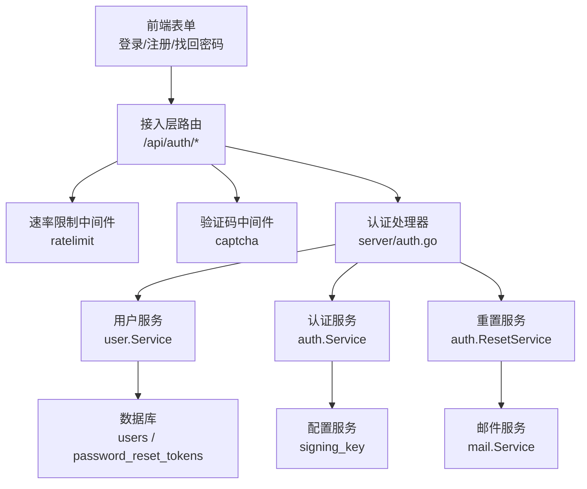
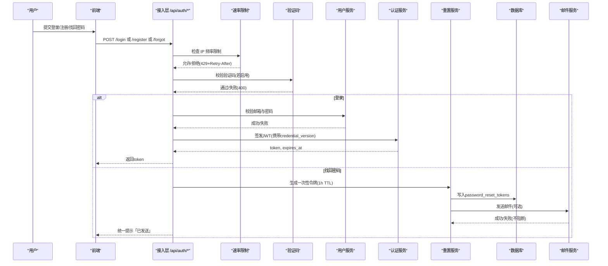
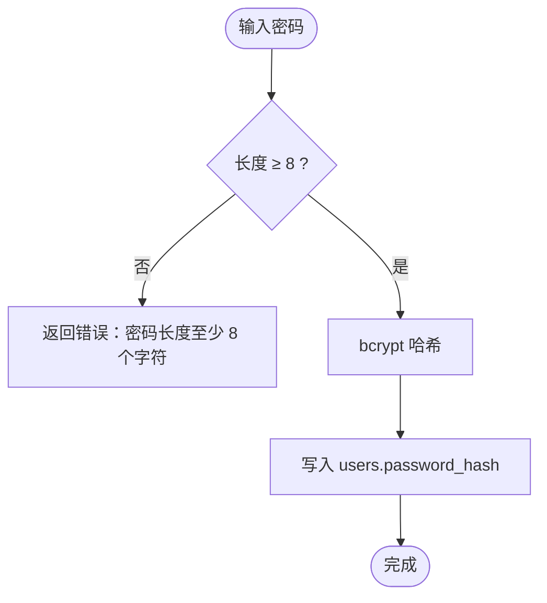
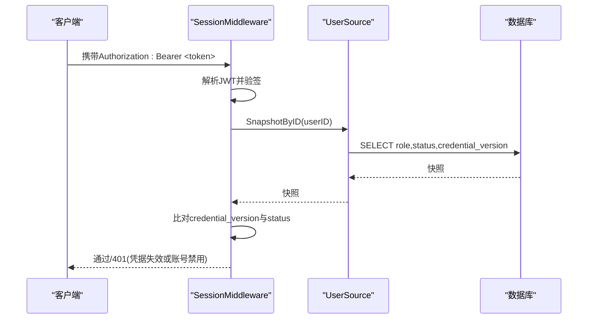
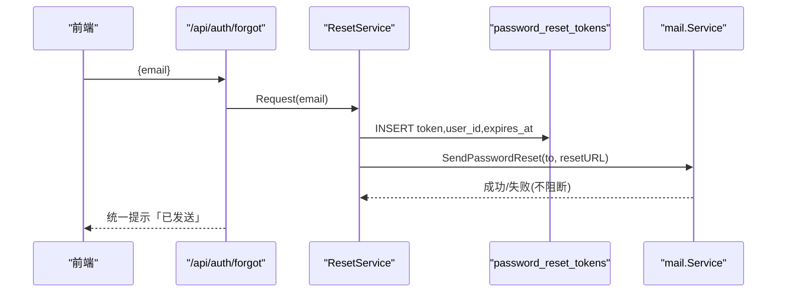
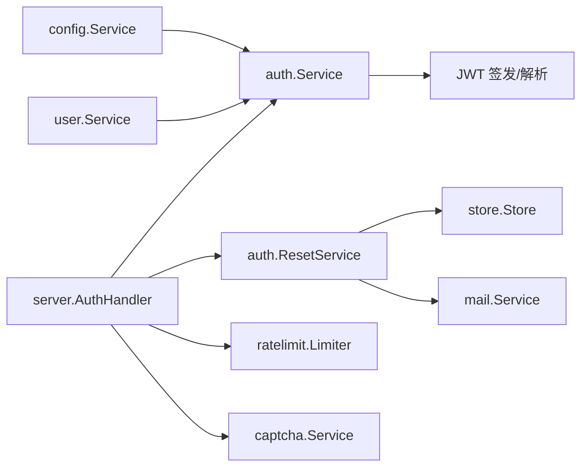

# 密码安全与存储

<cite>
**本文引用的文件**
- [backend/internal/auth/auth.go](file://backend/internal/auth/auth.go)
- [backend/internal/auth/reset.go](file://backend/internal/auth/reset.go)
- [backend/internal/user/user.go](file://backend/internal/user/user.go)
- [backend/internal/server/auth.go](file://backend/internal/server/auth.go)
- [backend/internal/captcha/captcha.go](file://backend/internal/captcha/captcha.go)
- [backend/internal/ratelimit/ratelimit.go](file://backend/internal/ratelimit/ratelimit.go)
- [backend/internal/mail/mail.go](file://backend/internal/mail/mail.go)
- [backend/migrations/0002_users.sql](file://backend/migrations/0002_users.sql)
- [backend/migrations/0005_reset_tokens.sql](file://backend/migrations/0005_reset_tokens.sql)
</cite>

## 目录
1. [简介](#简介)
2. [项目结构](#项目结构)
3. [核心组件](#核心组件)
4. [架构总览](#架构总览)
5. [详细组件分析](#详细组件分析)
6. [依赖关系分析](#依赖关系分析)
7. [性能与安全考量](#性能与安全考量)
8. [故障排查指南](#故障排查指南)
9. [结论](#结论)
10. [附录：迁移策略与向后兼容](#附录：迁移策略与向后兼容)

## 简介
本文件聚焦于系统的密码安全与存储方案，覆盖以下主题：
- bcrypt 哈希算法的使用与密码强度校验（最小长度 8 字符）
- 邮箱格式校验与控制字符过滤
- 密码重置流程、一次性令牌生成与邮件发送安全机制
- 防暴力破解措施：登录失败限制、验证码集成、IP 频率限制
- 加密存储最佳实践：防止彩虹表攻击与时间差攻击
- 密码迁移策略与向后兼容性考虑

## 项目结构
围绕密码安全的关键模块分布如下：
- 认证与密码处理：auth 包提供 bcrypt 哈希/校验、密码复杂度校验、邮箱规范化、JWT 会话签发与校验中间件
- 用户服务：user 包实现注册、登录、快照查询等
- 密码重置：reset 服务负责一次性令牌生成、验证与用后即删，并递增凭据版本号使旧会话失效
- 验证码：captcha 支持 reCAPTCHA/Turnstile 配置与服务端校验
- 速率限制：ratelimit 按 IP 固定窗口限流，返回 429 与 Retry-After
- 邮件：mail 提供 SMTP 发送能力，支持 TLS/STARTTLS，并对邮件头进行清洗
- 数据库迁移：users 表包含 password_hash 与 credential_version；reset_tokens 表用于一次性令牌

图表来源
- [backend/internal/server/auth.go:24-34](file://backend/internal/server/auth.go#L24-L34)
- [backend/internal/ratelimit/ratelimit.go:40-59](file://backend/internal/ratelimit/ratelimit.go#L40-L59)
- [backend/internal/captcha/captcha.go:41-127](file://backend/internal/captcha/captcha.go#L41-L127)
- [backend/internal/auth/auth.go:98-135](file://backend/internal/auth/auth.go#L98-L135)
- [backend/internal/auth/reset.go:54-147](file://backend/internal/auth/reset.go#L54-L147)
- [backend/internal/mail/mail.go:60-134](file://backend/internal/mail/mail.go#L60-L134)
- [backend/migrations/0002_users.sql:1-17](file://backend/migrations/0002_users.sql#L1-L17)
- [backend/migrations/0005_reset_tokens.sql:1-9](file://backend/migrations/0005_reset_tokens.sql#L1-L9)

章节来源
- [backend/internal/server/auth.go:24-34](file://backend/internal/server/auth.go#L24-L34)
- [backend/internal/ratelimit/ratelimit.go:40-59](file://backend/internal/ratelimit/ratelimit.go#L40-L59)
- [backend/internal/captcha/captcha.go:41-127](file://backend/internal/captcha/captcha.go#L41-L127)
- [backend/internal/auth/auth.go:98-135](file://backend/internal/auth/auth.go#L98-L135)
- [backend/internal/auth/reset.go:54-147](file://backend/internal/auth/reset.go#L54-L147)
- [backend/internal/mail/mail.go:60-134](file://backend/internal/mail/mail.go#L60-L134)
- [backend/migrations/0002_users.sql:1-17](file://backend/migrations/0002_users.sql#L1-L17)
- [backend/migrations/0005_reset_tokens.sql:1-9](file://backend/migrations/0005_reset_tokens.sql#L1-L9)

## 核心组件
- 密码哈希与校验：使用 bcrypt 默认成本因子进行哈希与比对，所有本地密码入口统一复杂度校验（≥8 字符）
- 邮箱规范化：trim + 小写化 + 基本格式校验，拒绝控制字符，避免 SMTP 头注入
- 会话凭据：JWT HS256 签名，载荷仅含 user_id 与 credential_version，每次请求实时查库校验状态与版本
- 密码重置：一次性令牌（≥128 位熵），1 小时 TTL，用后即删，成功后递增 credential_version 使旧会话立即失效
- 验证码：reCAPTCHA/Turnstile 可配置启用，缺失密钥时兜底跳过并记录告警
- 速率限制：按 IP 固定窗口计数，超限返回 429 与 Retry-After
- 邮件发送：SMTP TLS/STARTTLS，敏感配置加密落库，邮件头清洗防注入

章节来源
- [backend/internal/auth/auth.go:30-64](file://backend/internal/auth/auth.go#L30-L64)
- [backend/internal/auth/auth.go:98-135](file://backend/internal/auth/auth.go#L98-L135)
- [backend/internal/auth/reset.go:54-147](file://backend/internal/auth/reset.go#L54-L147)
- [backend/internal/captcha/captcha.go:41-127](file://backend/internal/captcha/captcha.go#L41-L127)
- [backend/internal/ratelimit/ratelimit.go:40-59](file://backend/internal/ratelimit/ratelimit.go#L40-L59)
- [backend/internal/mail/mail.go:60-134](file://backend/internal/mail/mail.go#L60-L134)

## 架构总览
下图展示了从前端到后端的完整认证与密码重置链路，包括限流、验证码、会话校验与凭据版本失效机制。

图表来源
- [backend/internal/server/auth.go:24-34](file://backend/internal/server/auth.go#L24-L34)
- [backend/internal/ratelimit/ratelimit.go:40-59](file://backend/internal/ratelimit/ratelimit.go#L40-L59)
- [backend/internal/captcha/captcha.go:41-127](file://backend/internal/captcha/captcha.go#L41-L127)
- [backend/internal/user/user.go:170-187](file://backend/internal/user/user.go#L170-L187)
- [backend/internal/auth/auth.go:98-135](file://backend/internal/auth/auth.go#L98-L135)
- [backend/internal/auth/reset.go:54-147](file://backend/internal/auth/reset.go#L54-L147)
- [backend/internal/mail/mail.go:60-134](file://backend/internal/mail/mail.go#L60-L134)

## 详细组件分析

### 密码哈希与强度校验
- 使用 bcrypt 默认成本因子进行哈希与校验，确保计算开销足以抵御离线爆破
- 所有本地密码入口统一复杂度校验：最小长度 8 字符
- 邮箱规范化：trim + 小写化 + 基本格式校验，拒绝控制字符，避免 SMTP 头注入

图表来源
- [backend/internal/auth/auth.go:30-50](file://backend/internal/auth/auth.go#L30-L50)
- [backend/migrations/0002_users.sql:1-17](file://backend/migrations/0002_users.sql#L1-L17)

章节来源
- [backend/internal/auth/auth.go:30-50](file://backend/internal/auth/auth.go#L30-L50)
- [backend/migrations/0002_users.sql:1-17](file://backend/migrations/0002_users.sql#L1-L17)

### 邮箱格式校验与控制字符过滤
- 规范化：trim + 小写化
- 格式校验：非空、长度 ≤254、包含 @
- 控制字符过滤：拒绝 ASCII < 0x20 与 0x7f，防止 SMTP 头注入

章节来源
- [backend/internal/auth/auth.go:52-64](file://backend/internal/auth/auth.go#L52-L64)

### 会话凭据与凭据版本失效
- JWT HS256 签名，载荷仅含 user_id 与 credential_version，禁止角色/组入凭据
- 每次请求解析凭据后实时查库取用户快照，比对 credential_version 与 status=active
- 修改密码或重置密码后递增 credential_version，使全部现有会话立即失效

图表来源
- [backend/internal/auth/auth.go:98-135](file://backend/internal/auth/auth.go#L98-L135)
- [backend/internal/auth/auth.go:144-180](file://backend/internal/auth/auth.go#L144-L180)
- [backend/internal/user/user.go:189-202](file://backend/internal/user/user.go#L189-L202)

章节来源
- [backend/internal/auth/auth.go:98-135](file://backend/internal/auth/auth.go#L98-L135)
- [backend/internal/auth/auth.go:144-180](file://backend/internal/auth/auth.go#L144-L180)
- [backend/internal/user/user.go:189-202](file://backend/internal/user/user.go#L189-L202)

### 密码重置流程与一次性令牌
- 生成一次性令牌：≥128 位熵（32 字节随机值），base64url 编码
- 存储：password_reset_tokens(token,user_id,expires_at)，TTL 1 小时
- 校验：存在 + 未过期 + 未使用 → 设置新密码（bcrypt）→ 用后即删 → 递增 credential_version
- 邮件发送：SMTP TLS/STARTTLS，敏感配置加密落库；发送失败不阻断主流程

图表来源
- [backend/internal/auth/reset.go:54-85](file://backend/internal/auth/reset.go#L54-L85)
- [backend/internal/mail/mail.go:183-189](file://backend/internal/mail/mail.go#L183-L189)
- [backend/migrations/0005_reset_tokens.sql:1-9](file://backend/migrations/0005_reset_tokens.sql#L1-L9)

章节来源
- [backend/internal/auth/reset.go:54-85](file://backend/internal/auth/reset.go#L54-L85)
- [backend/internal/mail/mail.go:183-189](file://backend/internal/mail/mail.go#L183-L189)
- [backend/migrations/0005_reset_tokens.sql:1-9](file://backend/migrations/0005_reset_tokens.sql#L1-L9)

### 验证码集成
- 支持 reCAPTCHA/Turnstile，配置项：provider、site_key、secret_key、pages
- 启用判定：provider 非 off 且页面在 pages 且 secret_key 已配置
- 缺失密钥时兜底跳过并记录 warn 日志，保证可用性
- 中间件从请求体读取 captcha_token 并调用提供商验证接口

章节来源
- [backend/internal/captcha/captcha.go:23-127](file://backend/internal/captcha/captcha.go#L23-L127)

### 速率限制（防暴力破解）
- 按 IP 固定窗口计数（分钟槽），阈值来自 system_config，每次请求实时读取
- 超限返回 429 与 Retry-After 头，作用于登录/注册/找回密码端点
- 真实客户端 IP 解析遵循 TRUST_PROXY 策略

章节来源
- [backend/internal/ratelimit/ratelimit.go:17-59](file://backend/internal/ratelimit/ratelimit.go#L17-L59)
- [backend/internal/server/auth.go:24-34](file://backend/internal/server/auth.go#L24-L34)

### 邮件发送安全机制
- SMTP TLS 直连或 STARTTLS 升级，支持明文路径尝试升级
- 敏感配置（smtp_password）以 AES-256-GCM 加密落库
- 邮件头清洗：替换换行符，防止 SMTP 头注入

章节来源
- [backend/internal/mail/mail.go:60-139](file://backend/internal/mail/mail.go#L60-L139)
- [backend/internal/config/config.go:39-46](file://backend/internal/config/config.go#L39-L46)

## 依赖关系分析
- auth 包依赖 config 获取 signing_key，依赖 user 包提供的 UserSource 接口进行快照查询
- reset 服务依赖 store 写入一次性令牌，依赖 mail 服务发送邮件（可注入 nil 降级为日志）
- server/auth.go 将 ratelimit 与 captcha 中间件叠加到认证路由，形成防护链
- user 包实现 UserSource 接口，供 auth 中间件实时查库校验会话

图表来源
- [backend/internal/auth/auth.go:87-96](file://backend/internal/auth/auth.go#L87-L96)
- [backend/internal/auth/reset.go:36-47](file://backend/internal/auth/reset.go#L36-L47)
- [backend/internal/server/auth.go:16-34](file://backend/internal/server/auth.go#L16-L34)

章节来源
- [backend/internal/auth/auth.go:87-96](file://backend/internal/auth/auth.go#L87-L96)
- [backend/internal/auth/reset.go:36-47](file://backend/internal/auth/reset.go#L36-L47)
- [backend/internal/server/auth.go:16-34](file://backend/internal/server/auth.go#L16-L34)

## 性能与安全考量
- 密码哈希：bcrypt 默认成本因子平衡安全性与性能；在高负载场景可评估调整成本因子
- 会话校验：每次请求实时查库，避免缓存权限信息，确保 credential_version 变更即时生效
- 一次性令牌：≥128 位熵，1 小时 TTL，用后即删，降低重放风险
- 验证码：可选启用，缺失密钥时兜底跳过并记录告警，保障可用性
- 速率限制：固定窗口计数，内存中桶清理，防止内存泄漏
- 邮件安全：TLS/STARTTLS，敏感配置加密，邮件头清洗

[本节为通用指导，无需具体文件引用]

## 故障排查指南
- 验证码校验失败：检查 provider、site_key、secret_key 配置；确认页面在 captcha_pages；查看 warn 日志
- 速率限制触发：检查 ratelimit_* 配置；关注 429 响应与 Retry-After 头
- 重置令牌无效：确认令牌存在、未过期、未使用；查看 password_reset_tokens 表
- 会话失效：检查 credential_version 是否递增；确认用户状态为 active
- 邮件发送失败：检查 SMTP 配置（host/port/user/password/tls）；查看发送失败日志

章节来源
- [backend/internal/captcha/captcha.go:41-127](file://backend/internal/captcha/captcha.go#L41-L127)
- [backend/internal/ratelimit/ratelimit.go:40-59](file://backend/internal/ratelimit/ratelimit.go#L40-L59)
- [backend/internal/auth/reset.go:115-147](file://backend/internal/auth/reset.go#L115-L147)
- [backend/internal/auth/auth.go:144-180](file://backend/internal/auth/auth.go#L144-L180)
- [backend/internal/mail/mail.go:60-134](file://backend/internal/mail/mail.go#L60-L134)

## 结论
系统采用 bcrypt 哈希与 JWT 会话机制，结合一次性令牌、验证码与速率限制，构建了完整的密码安全与存储体系。通过 credential_version 实现会话即时失效，配合邮箱规范化与控制字符过滤、邮件头清洗，有效防御常见攻击面。建议在生产环境持续评估 bcrypt 成本因子与限流阈值，并根据业务需求启用验证码与邮件功能。

[本节为总结性内容，无需具体文件引用]

## 附录：迁移策略与向后兼容
- 数据结构：
  - users 表包含 password_hash 与 credential_version，支持 OIDC-only 用户（无本地密码）
  - password_reset_tokens 表用于一次性令牌，具备 TTL 与用后即删语义
- 向后兼容：
  - 新增字段与表不影响既有功能；OIDC-only 用户仍可正常登录（通过 OIDC）
  - 凭据版本递增确保旧会话失效，避免新旧密码混用导致的安全问题
- 迁移步骤建议：
  - 先执行迁移脚本创建/扩展表结构
  - 部署新版本后端，确保 credential_version 递增逻辑生效
  - 逐步启用验证码与速率限制，观察日志与指标
  - 如需调整 bcrypt 成本因子，建议在低峰期滚动更新并监控性能

章节来源
- [backend/migrations/0002_users.sql:1-17](file://backend/migrations/0002_users.sql#L1-L17)
- [backend/migrations/0005_reset_tokens.sql:1-9](file://backend/migrations/0005_reset_tokens.sql#L1-L9)
- [backend/internal/auth/auth.go:144-180](file://backend/internal/auth/auth.go#L144-L180)
- [backend/internal/auth/reset.go:115-147](file://backend/internal/auth/reset.go#L115-L147)