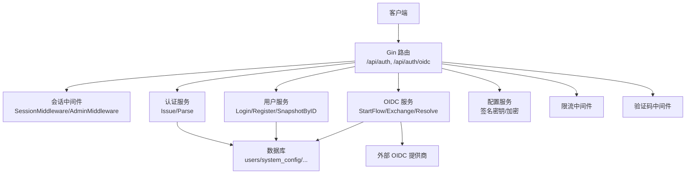
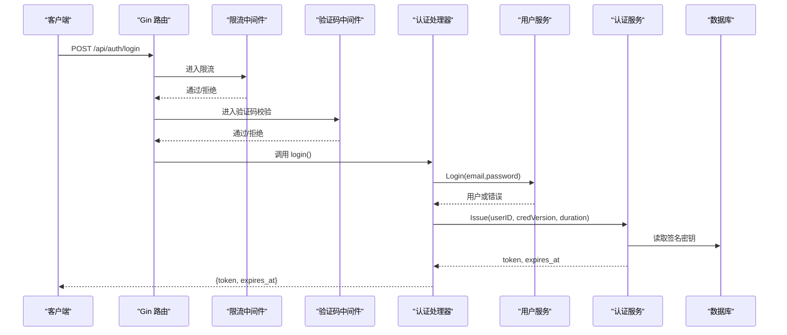
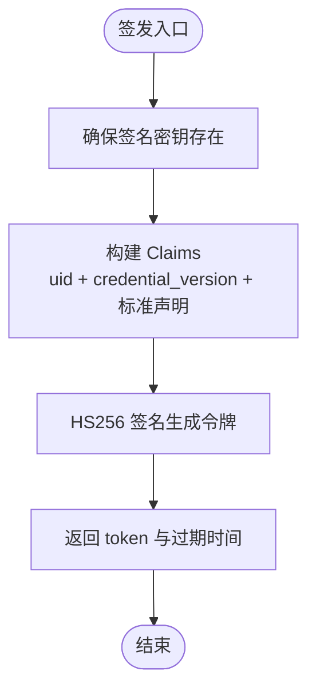
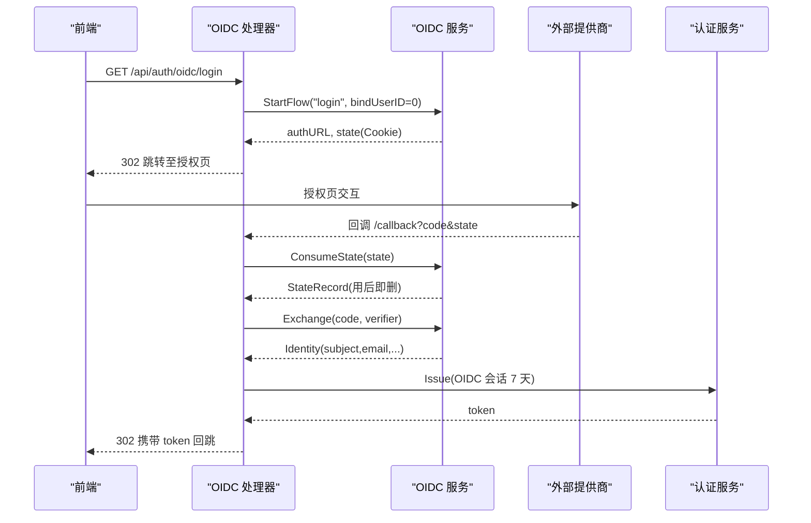
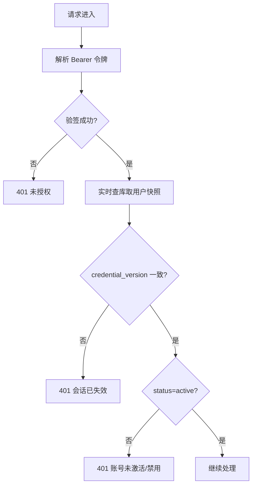
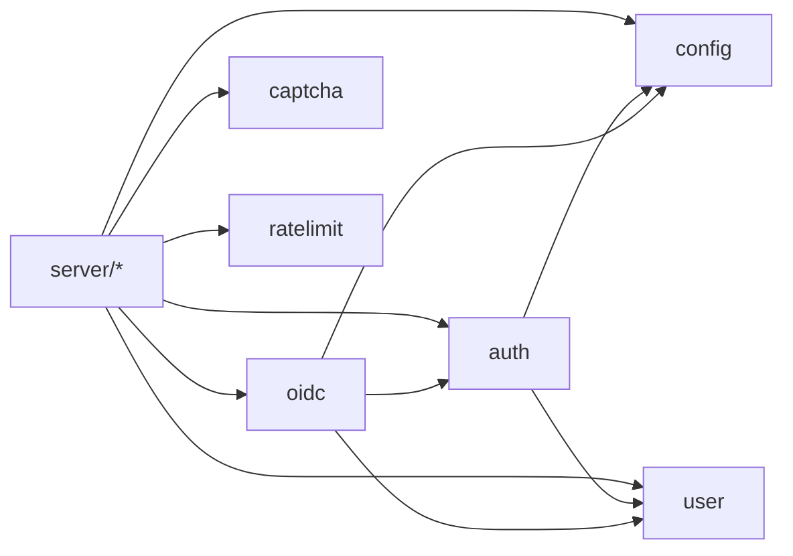

# 认证与授权安全

<cite>
**本文引用的文件**
- [backend/internal/auth/auth.go](file://backend/internal/auth/auth.go)
- [backend/internal/auth/reset.go](file://backend/internal/auth/reset.go)
- [backend/internal/oidc/oidc.go](file://backend/internal/oidc/oidc.go)
- [backend/internal/oidc/flow.go](file://backend/internal/oidc/flow.go)
- [backend/internal/server/auth.go](file://backend/internal/server/auth.go)
- [backend/internal/server/oidc.go](file://backend/internal/server/oidc.go)
- [backend/internal/config/config.go](file://backend/internal/config/config.go)
- [backend/internal/ratelimit/ratelimit.go](file://backend/internal/ratelimit/ratelimit.go)
- [backend/internal/captcha/captcha.go](file://backend/internal/captcha/captcha.go)
- [backend/internal/user/user.go](file://backend/internal/user/user.go)
- [backend/internal/token/token.go](file://backend/internal/token/token.go)
- [backend/migrations/0004_oidc.sql](file://backend/migrations/0004_oidc.sql)
- [backend/migrations/0005_reset_tokens.sql](file://backend/migrations/0005_reset_tokens.sql)
- [backend/migrations/1004_tokens.sql](file://backend/migrations/1004_tokens.sql)
</cite>

## 目录
1. [简介](#简介)
2. [项目结构](#项目结构)
3. [核心组件](#核心组件)
4. [架构总览](#架构总览)
5. [详细组件分析](#详细组件分析)
6. [依赖关系分析](#依赖关系分析)
7. [性能与安全特性](#性能与安全特性)
8. [故障排查指南](#故障排查指南)
9. [结论](#结论)
10. [附录：最佳实践与配置清单](#附录最佳实践与配置清单)

## 简介
本文件聚焦于系统的认证与授权安全能力，覆盖以下关键主题：
- JWT 会话令牌机制（签发、解析、失效策略）
- OIDC 单点登录集成（PKCE、state 防重放、白名单与审批）
- 密码加密存储（bcrypt）、邮箱格式校验、密码复杂度校验
- 会话管理（中间件鉴权、凭据版本控制、有效期）
- 权限验证中间件（角色校验）
- 用户快照机制（实时查库、避免缓存越权）
- 安全措施（限流、验证码、防枚举、防暴力破解）
- 常见威胁防护（会话劫持、CSRF、暴力破解、重放攻击）
- 令牌刷新策略、多因素认证建议

## 项目结构
后端采用分层设计：接入层（server）→ 业务服务（auth、user、oidc、token、config、captcha、ratelimit）→ 数据持久化（store + migrations）。安全相关的关键路径如下：
- 本地登录/注册/重置：server/auth → user → auth（密码哈希、JWT）
- OIDC 流程：server/oidc → oidc（PKCE/state）→ auth（签发会话）
- 鉴权中间件：auth.SessionMiddleware / AdminMiddleware
- 敏感配置与密钥：config（签名密钥、AES-GCM 加密）
- 防护：ratelimit（限流）、captcha（验证码）

图表来源
- [backend/internal/server/auth.go:25-34](file://backend/internal/server/auth.go#L25-L34)
- [backend/internal/server/oidc.go:19-27](file://backend/internal/server/oidc.go#L19-L27)
- [backend/internal/auth/auth.go:144-192](file://backend/internal/auth/auth.go#L144-L192)
- [backend/internal/config/config.go:282-313](file://backend/internal/config/config.go#L282-L313)

章节来源
- [backend/internal/server/auth.go:25-34](file://backend/internal/server/auth.go#L25-L34)
- [backend/internal/server/oidc.go:19-27](file://backend/internal/server/oidc.go#L19-L27)

## 核心组件
- 认证服务（auth.Service）
  - 密码哈希/校验（bcrypt）
  - 邮箱规范化与非法字符过滤
  - JWT 签发与解析（HS256，含 credential_version）
  - 会话中间件（解析令牌、实时查库比对快照、状态检查）
  - 管理员角色中间件
- 用户服务（user.Service）
  - 注册（首管理员机制、组归属、审批开关）
  - 登录（统一错误提示防枚举）
  - 用户快照（供中间件实时校验）
- OIDC 服务（oidc.Service）
  - PKCE S256 授权码流程
  - state 持久化与一次性消费（防重放）
  - 发现文档获取与缓存
  - 身份解析与白名单匹配
  - 绑定/登录流程处理
- 配置服务（config.Service）
  - 系统配置读写（布尔/整数/JSON）
  - 签名密钥管理与确保存在
  - AES-256-GCM 敏感值加密/解密（HKDF 派生密钥）
- 限流与验证码
  - 按 IP 固定窗口限流（分钟级桶）
  - reCAPTCHA/Turnstile 服务端校验
- 下载 Token 服务（token.Service）
  - 三态复用键、并发安全创建、轮替与生命周期联动

章节来源
- [backend/internal/auth/auth.go:30-135](file://backend/internal/auth/auth.go#L30-L135)
- [backend/internal/user/user.go:82-187](file://backend/internal/user/user.go#L82-L187)
- [backend/internal/oidc/oidc.go:23-239](file://backend/internal/oidc/oidc.go#L23-L239)
- [backend/internal/oidc/flow.go:27-119](file://backend/internal/oidc/flow.go#L27-L119)
- [backend/internal/config/config.go:220-361](file://backend/internal/config/config.go#L220-L361)
- [backend/internal/ratelimit/ratelimit.go:17-89](file://backend/internal/ratelimit/ratelimit.go#L17-L89)
- [backend/internal/captcha/captcha.go:23-131](file://backend/internal/captcha/captcha.go#L23-L131)
- [backend/internal/token/token.go:29-156](file://backend/internal/token/token.go#L29-L156)

## 架构总览
下图展示了从请求到鉴权的完整链路，包括中间件链路与关键安全控制点。

图表来源
- [backend/internal/server/auth.go:25-34](file://backend/internal/server/auth.go#L25-L34)
- [backend/internal/server/auth.go:99-134](file://backend/internal/server/auth.go#L99-L134)
- [backend/internal/auth/auth.go:98-135](file://backend/internal/auth/auth.go#L98-L135)
- [backend/internal/config/config.go:282-313](file://backend/internal/config/config.go#L282-L313)

## 详细组件分析

### JWT 会话令牌机制
- 算法与载荷
  - HS256 对称签名；载荷仅包含用户标识与凭据版本号，禁止将角色/组等权限信息放入令牌，每次请求实时查库校验。
  - 有效期：本地登录支持“记住我”（7 天）与默认（24 小时），OIDC 固定 7 天。
- 签发与解析
  - 签发前确保签名密钥存在；解析时强制要求 HMAC 算法并校验签名。
- 失效策略
  - 通过 credential_version 与用户快照比对实现“一键失效”；密码重置会递增该版本，使所有现有会话立即失效。
- 传输与存储
  - 通过 Authorization: Bearer 头传递；前端在退出时清除本地令牌。

图表来源
- [backend/internal/auth/auth.go:98-135](file://backend/internal/auth/auth.go#L98-L135)
- [backend/internal/config/config.go:282-313](file://backend/internal/config/config.go#L282-L313)

章节来源
- [backend/internal/auth/auth.go:22-135](file://backend/internal/auth/auth.go#L22-L135)
- [backend/internal/auth/reset.go:115-148](file://backend/internal/auth/reset.go#L115-L148)

### OIDC 单点登录集成
- 授权流程
  - 使用 PKCE S256：生成 code_verifier 与 challenge，防止授权码拦截。
  - state 随机值（≥128 位）持久化，回调时用后即删，结合 Cookie state 三重校验防重放。
- 身份解析
  - 从 id_token 提取 sub/email/username 等；支持 Keycloak realm roles 与 groups claims。
- 白名单与审批
  - 可配置白名单（role/group claim 路径与取值），命中则激活；未配置或解析失败按空白名单处理。
  - 新用户可进入待审批流程，由管理员审批后激活。
- 会话签发
  - 登录成功后签发固定 7 天的 OIDC 会话令牌。

图表来源
- [backend/internal/oidc/flow.go:27-119](file://backend/internal/oidc/flow.go#L27-L119)
- [backend/internal/oidc/oidc.go:157-239](file://backend/internal/oidc/oidc.go#L157-L239)
- [backend/internal/server/oidc.go:31-89](file://backend/internal/server/oidc.go#L31-L89)
- [backend/internal/auth/auth.go:98-135](file://backend/internal/auth/auth.go#L98-L135)

章节来源
- [backend/internal/oidc/flow.go:27-119](file://backend/internal/oidc/flow.go#L27-L119)
- [backend/internal/oidc/oidc.go:23-239](file://backend/internal/oidc/oidc.go#L23-L239)
- [backend/internal/server/oidc.go:31-89](file://backend/internal/server/oidc.go#L31-L89)

### 密码加密存储与复杂度校验
- 密码哈希：使用 bcrypt（默认成本），提供哈希与校验函数。
- 复杂度校验：最小长度 8 字符，所有本地密码入口统一。
- 邮箱校验：trim + 小写化，拒绝控制字符，限制长度，必须包含 @。
- 登录错误提示：统一“邮箱或密码错误”，防止枚举。

章节来源
- [backend/internal/auth/auth.go:30-64](file://backend/internal/auth/auth.go#L30-L64)
- [backend/internal/user/user.go:170-187](file://backend/internal/user/user.go#L170-L187)

### 会话管理与权限验证中间件
- 会话中间件
  - 从 Authorization 头解析 Bearer 令牌，验签并解析 Claims。
  - 实时查询用户快照（id、role、status、credential_version），比对版本与状态。
  - 将用户 ID 与角色注入上下文，供后续处理器使用。
- 管理员中间件
  - 叠加在会话中间件之后，校验 role=admin。

图表来源
- [backend/internal/auth/auth.go:144-192](file://backend/internal/auth/auth.go#L144-L192)

章节来源
- [backend/internal/auth/auth.go:144-192](file://backend/internal/auth/auth.go#L144-L192)

### 用户快照机制
- 目的：避免在令牌中缓存角色/组等权限信息，每次请求实时查库，保证权限变更即时生效。
- 实现：auth.UserSource 接口由 user.Service 实现，SnapshotByID 返回最小必要字段。

章节来源
- [backend/internal/auth/auth.go:74-85](file://backend/internal/auth/auth.go#L74-L85)
- [backend/internal/user/user.go:189-202](file://backend/internal/user/user.go#L189-L202)

### 密码重置流程
- 一次性令牌：≥128 位熵，1 小时 TTL，用后即删。
- 重置完成：设置新密码（bcrypt），递增 credential_version，使全部现有会话失效。
- 防枚举：无论邮箱是否存在均返回统一响应。

章节来源
- [backend/internal/auth/reset.go:54-148](file://backend/internal/auth/reset.go#L54-L148)
- [backend/migrations/0005_reset_tokens.sql:1-9](file://backend/migrations/0005_reset_tokens.sql#L1-L9)

### 下载 Token 体系（附加安全能力）
- 三态复用键：无标识（组解析）、自定义订阅、显式订阅互斥且可选。
- 并发安全：BEGIN IMMEDIATE 事务内先查后建，冲突重试。
- 生命周期联动：删除订阅/自定义/用户时级联清理；支持轮替旧失效新生效。

章节来源
- [backend/internal/token/token.go:48-156](file://backend/internal/token/token.go#L48-L156)
- [backend/migrations/1004_tokens.sql:4-15](file://backend/migrations/1004_tokens.sql#L4-L15)

## 依赖关系分析
- 模块耦合
  - server 层依赖 auth、user、oidc、config、captcha、ratelimit。
  - auth 依赖 config（签名密钥）与 user（UserSource 接口）。
  - oidc 依赖 auth、user、config 与外部提供商。
  - config 独立提供配置与加解密能力。
- 外部依赖
  - JWT 库用于令牌签发/解析。
  - bcrypt 用于密码哈希。
  - 外部 OIDC 提供商（Keycloak/Auth0/Generic/Mock）。

图表来源
- [backend/internal/server/auth.go:1-34](file://backend/internal/server/auth.go#L1-L34)
- [backend/internal/server/oidc.go:1-27](file://backend/internal/server/oidc.go#L1-L27)
- [backend/internal/auth/auth.go:1-20](file://backend/internal/auth/auth.go#L1-L20)
- [backend/internal/oidc/oidc.go:1-21](file://backend/internal/oidc/oidc.go#L1-L21)

章节来源
- [backend/internal/server/auth.go:1-34](file://backend/internal/server/auth.go#L1-L34)
- [backend/internal/server/oidc.go:1-27](file://backend/internal/server/oidc.go#L1-L27)

## 性能与安全特性
- 性能
  - 发现文档缓存（按 base_url+realm 键），减少外部网络开销。
  - 限流基于内存桶，按分钟槽清理，避免无限增长。
  - 事务内操作（BEGIN IMMEDIATE）串行化关键路径，降低锁竞争。
- 安全
  - 令牌不含权限信息，实时查库校验，避免缓存越权。
  - 凭据版本控制，密码重置/禁用即刻失效所有会话。
  - PKCE + state 一次性消费，防授权码重放与 CSRF。
  - 限流与验证码组合，抵御暴力破解与自动化攻击。
  - 敏感配置 AES-256-GCM 加密，密钥由 HKDF 派生。

[本节为通用指导，不直接分析具体文件]

## 故障排查指南
- 常见问题定位
  - 令牌无效/过期：检查 Authorization 头格式、签名密钥是否配置、credential_version 是否变更。
  - OIDC 回调失败：核对 state 一致性、state 记录是否被消费、外部提供商可达性。
  - 登录失败：确认邮箱格式、密码复杂度、账号状态是否为 active。
  - 验证码失败：检查 captcha_provider 与 secret_key 配置、第三方服务可达性。
  - 限流触发：查看 Retry-After 头部，调整 ratelimit_* 配置。
- 日志与监控
  - 关注“验证码服务不可达”“发现文档不可达”“密文校验失败”等告警。
  - 审计登录/注册/重置/下载访问日志，识别异常模式。

章节来源
- [backend/internal/captcha/captcha.go:60-106](file://backend/internal/captcha/captcha.go#L60-L106)
- [backend/internal/oidc/oidc.go:157-205](file://backend/internal/oidc/oidc.go#L157-L205)
- [backend/internal/ratelimit/ratelimit.go:40-59](file://backend/internal/ratelimit/ratelimit.go#L40-L59)
- [backend/internal/auth/auth.go:118-135](file://backend/internal/auth/auth.go#L118-L135)

## 结论
本系统在认证与授权方面实现了较为完善的安全基线：
- 使用强密码哈希与严格输入校验，防止弱口令与注入风险。
- 通过 JWT 与凭据版本控制实现细粒度会话失效。
- OIDC 集成遵循 PKCE 与 state 一次性消费，保障授权流程安全。
- 限流与验证码有效缓解暴力破解与自动化攻击。
- 实时快照与最小权限原则降低越权风险。
在生产环境中，建议进一步启用 HTTPS、严格 CSP、定期轮换密钥与审查日志。

[本节为总结，不直接分析具体文件]

## 附录：最佳实践与配置清单

### 认证流程最佳实践
- 始终使用 HTTPS 传输令牌与敏感数据。
- 禁止在令牌中承载角色/组等权限信息。
- 对登录/注册/找回密码端点启用限流与验证码。
- 使用长随机 state 与 PKCE，回调时进行三重校验。
- 密码重置使用一次性短 TTL 令牌，完成后递增凭据版本。

### 令牌刷新策略
- 当前实现为固定有效期会话；如需刷新，可在前端维护短期 refresh_token，后端提供刷新端点以签发新会话。
- 刷新时应校验原会话有效性，并记录刷新事件。

### 多因素认证（MFA）配置指南
- 建议在登录成功后增加 MFA 步骤（如 TOTP/短信/邮件验证码）。
- 将 MFA 状态与用户账户关联，并在会话中间件中校验。
- 对关键操作（如修改密码、绑定 OIDC）强制二次验证。

### 威胁防护要点
- 会话劫持：使用 HttpOnly、Secure Cookie（OIDC state），HTTPS 传输，及时失效会话。
- CSRF：OIDC state 与 SameSite 策略；对敏感写操作实施 CSRF 保护。
- 暴力破解：限流 + 验证码；统一错误提示防枚举。
- 重放攻击：state 一次性消费；下载 Token 轮替与级联清理。

章节来源
- [backend/internal/server/auth.go:25-34](file://backend/internal/server/auth.go#L25-L34)
- [backend/internal/server/oidc.go:31-89](file://backend/internal/server/oidc.go#L31-L89)
- [backend/internal/auth/auth.go:144-192](file://backend/internal/auth/auth.go#L144-L192)
- [backend/internal/ratelimit/ratelimit.go:40-59](file://backend/internal/ratelimit/ratelimit.go#L40-L59)
- [backend/internal/captcha/captcha.go:41-106](file://backend/internal/captcha/captcha.go#L41-L106)
- [backend/internal/oidc/flow.go:70-119](file://backend/internal/oidc/flow.go#L70-L119)
- [backend/internal/token/token.go:125-156](file://backend/internal/token/token.go#L125-L156)