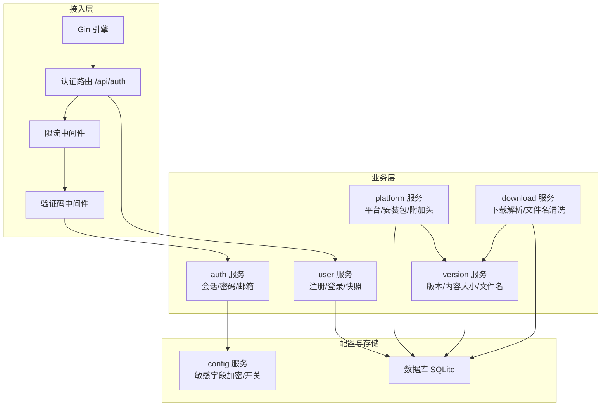
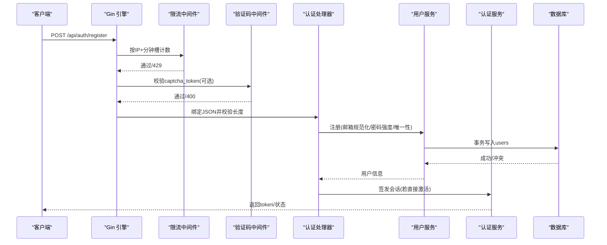
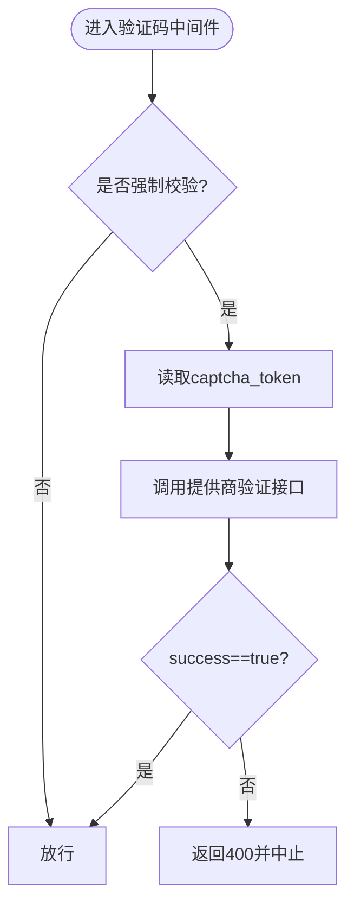
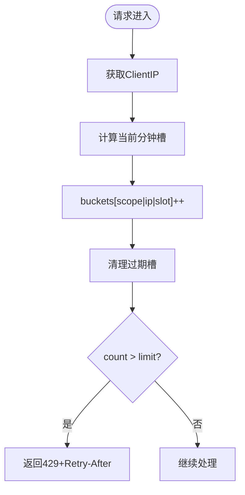
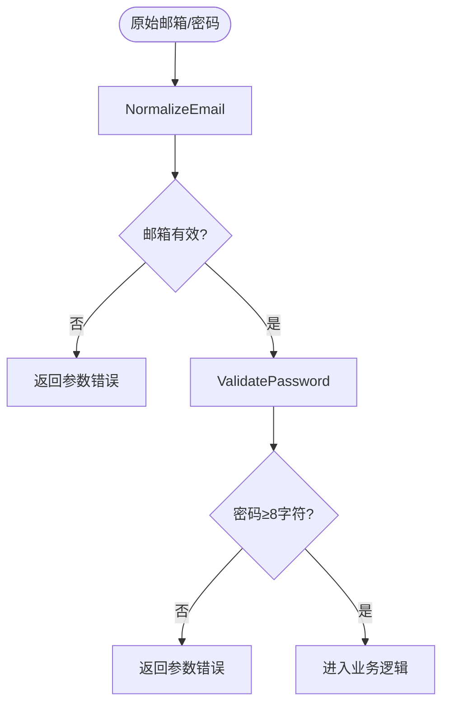
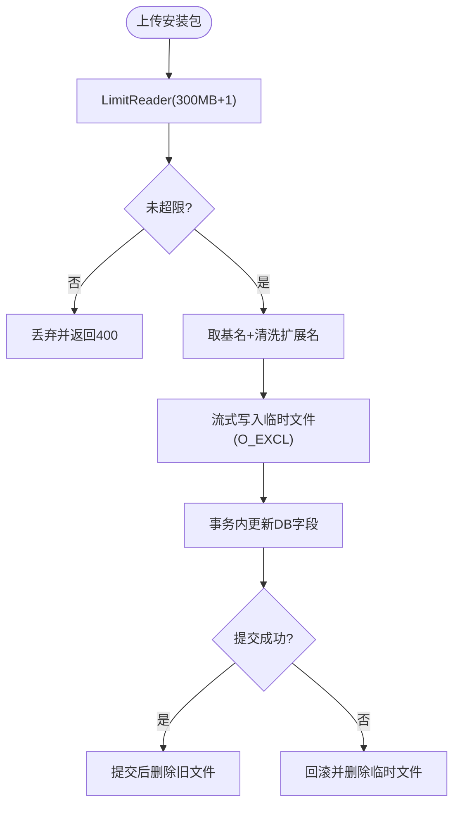
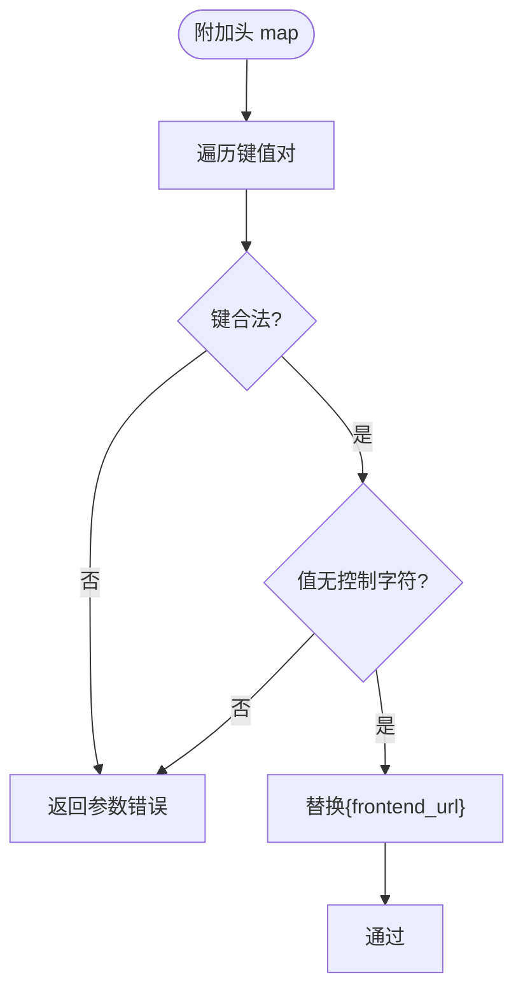
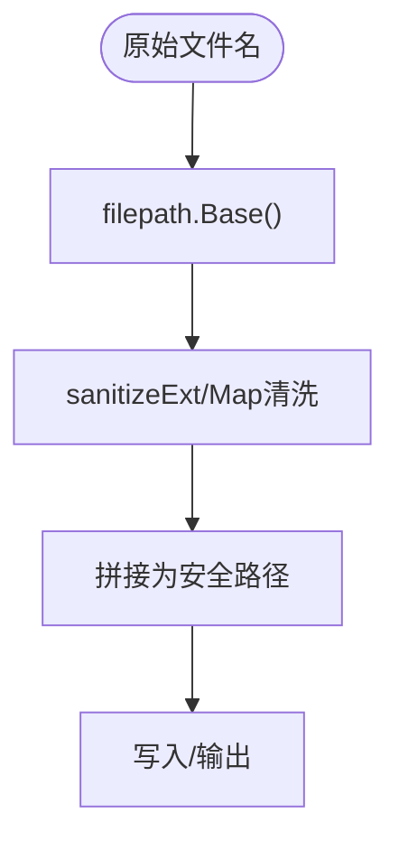
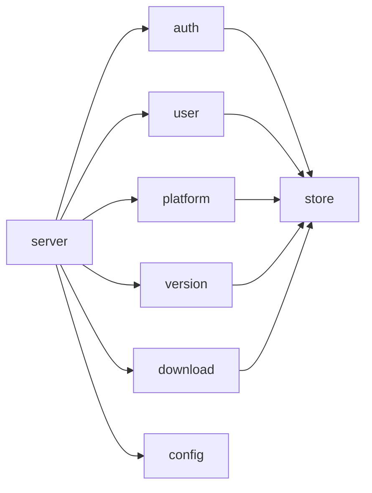

# 输入验证与过滤

<cite>
**本文引用的文件**
- [backend/internal/captcha/captcha.go](file://backend/internal/captcha/captcha.go)
- [backend/internal/ratelimit/ratelimit.go](file://backend/internal/ratelimit/ratelimit.go)
- [backend/internal/auth/auth.go](file://backend/internal/auth/auth.go)
- [backend/internal/user/user.go](file://backend/internal/user/user.go)
- [backend/internal/server/server.go](file://backend/internal/server/server.go)
- [backend/internal/server/auth.go](file://backend/internal/server/auth.go)
- [backend/internal/download/download.go](file://backend/internal/download/download.go)
- [backend/internal/version/version.go](file://backend/internal/version/version.go)
- [backend/internal/platform/platform.go](file://backend/internal/platform/platform.go)
- [backend/internal/config/admin.go](file://backend/internal/config/admin.go)
</cite>

## 目录
1. [简介](#简介)
2. [项目结构](#项目结构)
3. [核心组件](#核心组件)
4. [架构总览](#架构总览)
5. [详细组件分析](#详细组件分析)
6. [依赖关系分析](#依赖关系分析)
7. [性能与安全考量](#性能与安全考量)
8. [故障排查指南](#故障排查指南)
9. [结论](#结论)
10. [附录](#附录)

## 简介
本文件面向“输入验证与过滤”的安全主题，系统性梳理本项目在用户输入侧的防护策略与实现：验证码集成、速率限制、邮箱格式校验、密码强度检查、文件上传验证、响应头注入防护、路径穿越防护、SQL 注入防护（参数化查询）、XSS/存储型 XSS 防护（前端渲染策略）等。同时给出输入清洗最佳实践、自定义验证规则开发指南，以及命令注入、路径遍历等攻击面的防护措施说明。

## 项目结构
后端采用分层架构：接入层（Gin 路由与中间件）→ 业务服务层（auth/user/platform/version 等）→ 数据访问层（store + SQL）。安全能力以中间件与服务函数形式嵌入请求链路，确保统一入口、统一校验、统一错误处理。

图表来源
- [backend/internal/server/server.go:63-157](file://backend/internal/server/server.go#L63-L157)
- [backend/internal/server/auth.go:24-34](file://backend/internal/server/auth.go#L24-L34)
- [backend/internal/ratelimit/ratelimit.go:27-60](file://backend/internal/ratelimit/ratelimit.go#L27-L60)
- [backend/internal/captcha/captcha.go:30-127](file://backend/internal/captcha/captcha.go#L30-L127)
- [backend/internal/auth/auth.go:22-135](file://backend/internal/auth/auth.go#L22-L135)
- [backend/internal/user/user.go:82-187](file://backend/internal/user/user.go#L82-L187)
- [backend/internal/platform/platform.go:217-380](file://backend/internal/platform/platform.go#L217-L380)
- [backend/internal/version/version.go:25-180](file://backend/internal/version/version.go#L25-L180)
- [backend/internal/download/download.go:53-146](file://backend/internal/download/download.go#L53-L146)
- [backend/internal/config/admin.go:390-452](file://backend/internal/config/admin.go#L390-L452)

章节来源
- [backend/internal/server/server.go:63-157](file://backend/internal/server/server.go#L63-L157)
- [backend/internal/server/auth.go:24-34](file://backend/internal/server/auth.go#L24-L34)

## 核心组件
- 验证码服务：支持 reCAPTCHA/Turnstile，按页面启用，密钥缺失时降级并告警。
- 速率限制：按 IP 固定窗口计数，可配置阈值，返回 429 与 Retry-After。
- 认证服务：密码哈希/校验、最小化凭据签发与校验、邮箱规范化与控制字符拒绝。
- 用户服务：注册/登录流程中的邮箱唯一性、首管理员机制、状态控制。
- 平台服务：安装包上传大小限制、流式落盘、扩展名清洗、附加响应头校验防注入。
- 版本服务：内容大小上限、版本原子切换、文件名默认补全。
- 下载服务：Token 三态解析、失败原因记录、文件名清洗。
- 配置服务：敏感配置 AES-256-GCM 加密、站点 ICON 白名单与尺寸限制、公告/页脚长度限制。

章节来源
- [backend/internal/captcha/captcha.go:30-127](file://backend/internal/captcha/captcha.go#L30-L127)
- [backend/internal/ratelimit/ratelimit.go:27-60](file://backend/internal/ratelimit/ratelimit.go#L27-L60)
- [backend/internal/auth/auth.go:22-135](file://backend/internal/auth/auth.go#L22-L135)
- [backend/internal/user/user.go:82-187](file://backend/internal/user/user.go#L82-L187)
- [backend/internal/platform/platform.go:217-380](file://backend/internal/platform/platform.go#L217-L380)
- [backend/internal/version/version.go:25-180](file://backend/internal/version/version.go#L25-L180)
- [backend/internal/download/download.go:53-146](file://backend/internal/download/download.go#L53-L146)
- [backend/internal/config/admin.go:390-452](file://backend/internal/config/admin.go#L390-L452)

## 架构总览
下图展示认证相关请求从进入网关到最终落库的关键安全步骤：限流 → 验证码 → 参数绑定 → 业务校验 → 会话签发。

图表来源
- [backend/internal/server/auth.go:24-91](file://backend/internal/server/auth.go#L24-L91)
- [backend/internal/ratelimit/ratelimit.go:39-60](file://backend/internal/ratelimit/ratelimit.go#L39-L60)
- [backend/internal/captcha/captcha.go:108-127](file://backend/internal/captcha/captcha.go#L108-L127)
- [backend/internal/user/user.go:82-154](file://backend/internal/user/user.go#L82-L154)
- [backend/internal/auth/auth.go:98-116](file://backend/internal/auth/auth.go#L98-L116)

## 详细组件分析

### 验证码集成（reCAPTCHA/Turnstile）
- 页面级强制校验：根据配置决定 register/login/forgot 是否启用。
- 密钥缺失降级：运行中未配置密钥时跳过校验并记录警告，避免阻断主流程。
- 服务端校验：构造表单调用提供商接口，仅接受 success=true 的响应。
- 中间件集成：使用 ShouldBindBodyWithJSON 读取 body 并缓存至 context，避免重复读取。

图表来源
- [backend/internal/captcha/captcha.go:41-106](file://backend/internal/captcha/captcha.go#L41-L106)
- [backend/internal/captcha/captcha.go:108-127](file://backend/internal/captcha/captcha.go#L108-L127)

章节来源
- [backend/internal/captcha/captcha.go:41-127](file://backend/internal/captcha/captcha.go#L41-L127)

### 速率限制（按 IP 固定窗口）
- 维度：作用域(scope)+IP+分钟槽；每次请求递增计数。
- 配置：登录/注册/找回密码/下载独立阈值，运行时读取立即生效。
- 响应：超限返回 429，附带 Retry-After 秒数。
- 内存清理：每请求触发 gc，删除过期槽防止内存泄漏。

图表来源
- [backend/internal/ratelimit/ratelimit.go:39-60](file://backend/internal/ratelimit/ratelimit.go#L39-L60)
- [backend/internal/ratelimit/ratelimit.go:62-81](file://backend/internal/ratelimit/ratelimit.go#L62-L81)

章节来源
- [backend/internal/ratelimit/ratelimit.go:39-81](file://backend/internal/ratelimit/ratelimit.go#L39-L81)

### 邮箱格式验证与密码强度检查
- 邮箱规范化：trim + 小写化，拒绝控制字符（防 SMTP 头注入），长度与格式校验。
- 密码强度：所有本地密码入口统一要求至少 8 个字符。
- 登录/注册：统一错误提示，防止枚举攻击。

图表来源
- [backend/internal/auth/auth.go:44-64](file://backend/internal/auth/auth.go#L44-L64)
- [backend/internal/user/user.go:82-91](file://backend/internal/user/user.go#L82-L91)
- [backend/internal/server/auth.go:36-42](file://backend/internal/server/auth.go#L36-L42)

章节来源
- [backend/internal/auth/auth.go:44-64](file://backend/internal/auth/auth.go#L44-L64)
- [backend/internal/user/user.go:82-91](file://backend/internal/user/user.go#L82-L91)
- [backend/internal/server/auth.go:36-42](file://backend/internal/server/auth.go#L36-L42)

### 文件上传验证（安装包与站点图标）
- 安装包：
  - 大小限制：≤300MB，流式落盘，超限即中止并清理临时文件。
  - 文件名安全：仅取基名与扩展名，扩展名经清洗（仅字母数字点），防路径穿越。
  - 并发安全：O_EXCL 创建新文件，事务内更新 DB，提交后删旧文件。
- 站点图标：
  - 大小限制：≤2MB，扩展名白名单（png/jpeg/webp/ico），拒绝 SVG/GIF 以防存储型 XSS。
  - 版本化 URL：?v=序号递增，避免缓存旧图。

图表来源
- [backend/internal/platform/platform.go:266-334](file://backend/internal/platform/platform.go#L266-L334)
- [backend/internal/platform/platform.go:369-380](file://backend/internal/platform/platform.go#L369-L380)
- [backend/internal/config/admin.go:413-452](file://backend/internal/config/admin.go#L413-L452)

章节来源
- [backend/internal/platform/platform.go:266-380](file://backend/internal/platform/platform.go#L266-L380)
- [backend/internal/config/admin.go:413-452](file://backend/internal/config/admin.go#L413-L452)

### 响应头注入防护（附加响应头）
- 键名校验：符合 HTTP 头名规范（RFC 7230 token），拒绝空格与控制字符。
- 值校验：拒绝控制字符，允许 {frontend_url} 占位符由服务端替换。
- 用途：平台附加响应头用于客户端配置注入，严格校验防止响应头注入。

图表来源
- [backend/internal/platform/platform.go:232-245](file://backend/internal/platform/platform.go#L232-L245)
- [backend/internal/download/download.go:119-146](file://backend/internal/download/download.go#L119-L146)

章节来源
- [backend/internal/platform/platform.go:232-245](file://backend/internal/platform/platform.go#L232-L245)
- [backend/internal/download/download.go:119-146](file://backend/internal/download/download.go#L119-L146)

### 路径穿越与文件名安全
- 安装包：仅取 base 与清洗后的扩展名，禁止目录穿越。
- 下载文件名：资源名 + 原始扩展名；分享/规则下载时对文件名进行清洗，去除控制字符与引号反斜杠。
- 版本文件：相对路径组织，启动自检重建 symlink，保证一致性。

图表来源
- [backend/internal/platform/platform.go:258-264](file://backend/internal/platform/platform.go#L258-L264)
- [backend/internal/platform/platform.go:369-380](file://backend/internal/platform/platform.go#L369-L380)
- [backend/internal/download/download.go:325-341](file://backend/internal/download/download.go#L325-L341)
- [backend/internal/version/version.go:110-123](file://backend/internal/version/version.go#L110-L123)

章节来源
- [backend/internal/platform/platform.go:258-264](file://backend/internal/platform/platform.go#L258-L264)
- [backend/internal/download/download.go:325-341](file://backend/internal/download/download.go#L325-L341)
- [backend/internal/version/version.go:110-123](file://backend/internal/version/version.go#L110-L123)

### SQL 注入防护
- 全部数据库操作使用参数化查询（? 占位符），杜绝字符串拼接。
- 动态表名使用白名单映射（如 ownerTable），避免任意 SQL 片段注入。

章节来源
- [backend/internal/user/user.go:97-131](file://backend/internal/user/user.go#L97-L131)
- [backend/internal/version/version.go:428-436](file://backend/internal/version/version.go#L428-L436)

### XSS 与存储型 XSS 防护
- 站点图标：拒绝 SVG/GIF，仅允许 png/jpeg/webp/ico，降低存储型 XSS 风险。
- 公告/页脚：前端以 Markdown 渲染且禁用原始 HTML，避免存储型 XSS。
- 下载文件名：清洗控制字符与特殊符号，避免另存文件名退化或注入。

章节来源
- [backend/internal/config/admin.go:398-452](file://backend/internal/config/admin.go#L398-L452)
- [backend/internal/download/download.go:325-341](file://backend/internal/download/download.go#L325-L341)

### 会话与权限校验
- 会话中间件：解析 JWT，实时查库比对 credential_version 与 status，确保会话有效性。
- 管理员中间件：叠加角色校验，保护管理端点。

章节来源
- [backend/internal/auth/auth.go:144-192](file://backend/internal/auth/auth.go#L144-L192)

## 依赖关系分析
- 接入层依赖：server 组装各服务，注册路由与中间件链。
- 业务层依赖：auth/user/platform/version/download 相互协作，通过 store 访问数据库。
- 配置依赖：config 提供敏感字段加密与开关控制，影响验证码、限流、SMTP 等行为。

图表来源
- [backend/internal/server/server.go:63-157](file://backend/internal/server/server.go#L63-L157)

章节来源
- [backend/internal/server/server.go:63-157](file://backend/internal/server/server.go#L63-L157)

## 性能与安全考量
- 限流：内存桶 + 每分钟槽，轻量高效；gc 及时释放过期数据。
- 验证码：超时 10s 的外部请求，避免阻塞；密钥缺失降级保障可用性。
- 文件上传：流式落盘与大小限制，避免整读内存；并发 O_EXCL 防覆盖。
- 版本管理：事务内原子切换，symlink 原子替换，保证一致性与回滚安全。
- 配置：敏感字段加密落库，运行时读取阈值即时生效。

## 故障排查指南
- 验证码失败：检查 provider、site_key、secret_key 与 captcha_pages 配置；网络不可达会返回错误。
- 限流触发：查看对应 scope 的阈值配置；确认 ClientIP 解析是否正确（TRUST_PROXY）。
- 邮箱/密码错误：确认 NormalizeEmail 与 ValidatePassword 规则；统一错误提示避免枚举。
- 安装包上传失败：检查大小限制、扩展名清洗、磁盘空间与权限；事务失败会清理临时文件。
- 附加头异常：检查键名是否符合 HTTP 头规范，值是否含控制字符。
- 下载失败：关注 AccessEntry 的 fail_reason（token_invalid/unassigned/version_missing）。

章节来源
- [backend/internal/captcha/captcha.go:60-106](file://backend/internal/captcha/captcha.go#L60-L106)
- [backend/internal/ratelimit/ratelimit.go:39-60](file://backend/internal/ratelimit/ratelimit.go#L39-L60)
- [backend/internal/platform/platform.go:266-334](file://backend/internal/platform/platform.go#L266-L334)
- [backend/internal/download/download.go:53-146](file://backend/internal/download/download.go#L53-L146)

## 结论
本项目在输入验证与过滤方面形成了多层防御体系：接入层限流与验证码、业务层严格的邮箱/密码/文件大小与格式校验、文件系统层面的路径穿越与文件名清洗、数据库层的参数化查询与白名单表名、配置层的敏感字段加密与运行时开关。整体设计兼顾安全性与可用性，并通过中间件与服务函数解耦，便于扩展与维护。

## 附录
- 自定义验证规则开发指南：
  - 新增字段校验：在服务层定义结构化体并使用 binding 标签（如 required/min/max），或在业务函数中进行显式校验。
  - 新增文件格式校验：参考 platform 的 sanitizeExt 与 allowedIconExts，结合 io.LimitReader 进行大小限制。
  - 新增响应头校验：参考 ValidateExtraHeaders，确保键名与值不含控制字符，必要时引入正则约束。
  - 新增验证码页面：在 config 的 captcha_pages 中添加页面名，并在 server 路由上挂载 captcha.Middleware。
- 命令注入防护建议：
  - 避免直接使用用户输入执行系统命令；如需执行，应使用白名单参数与隔离环境。
  - 所有外部命令参数必须经过严格白名单校验与转义。
- 路径遍历防护建议：
  - 始终使用 filepath.Base 与相对路径组织；对外部路径进行前缀校验与白名单映射。
  - 对文件读写操作进行权限与存在性检查，失败时记录日志并返回通用错误。