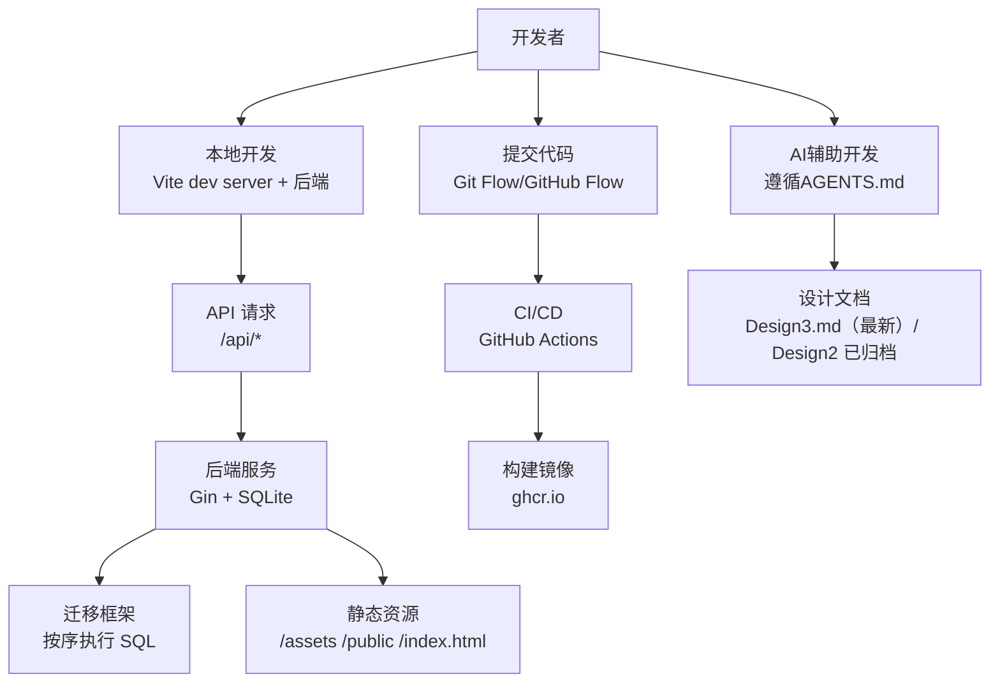
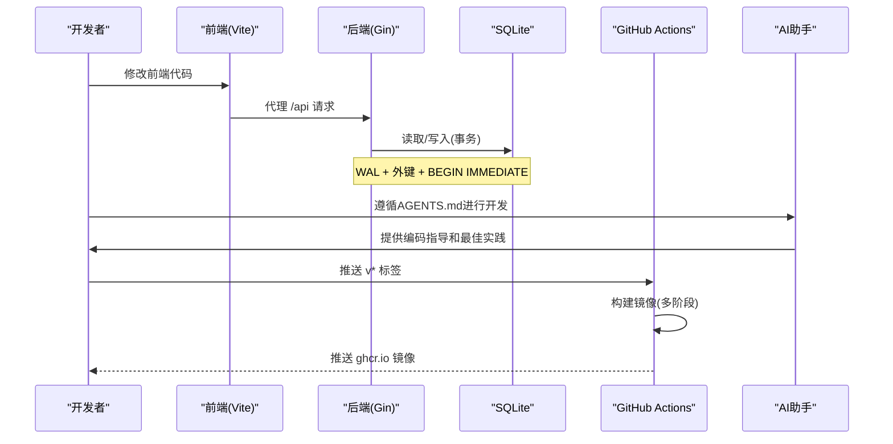
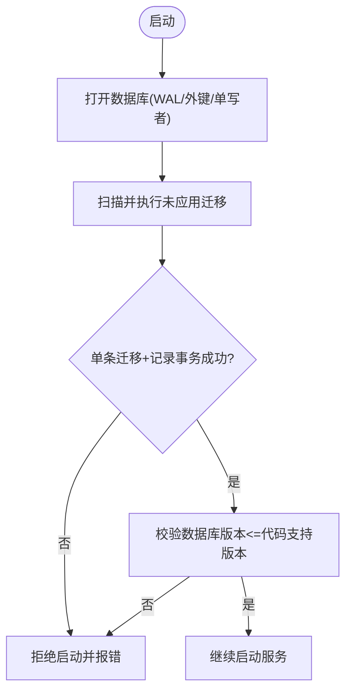
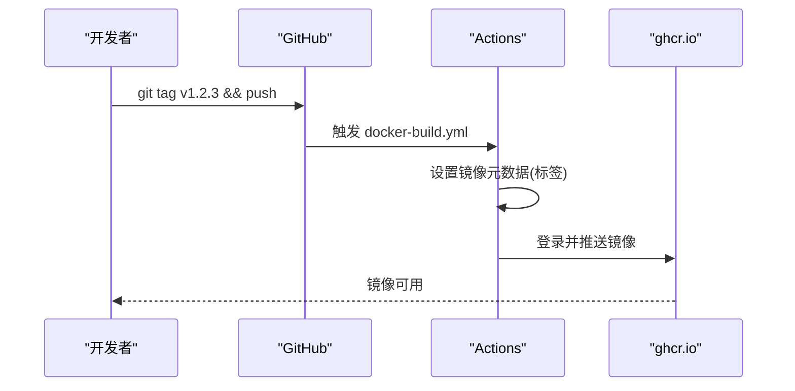
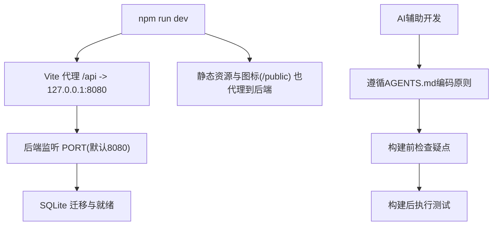
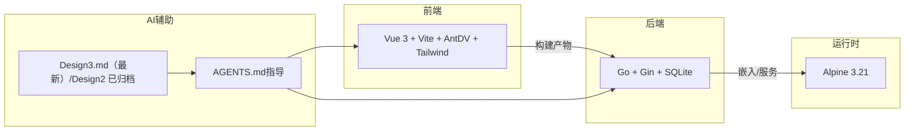

# 开发工作流

<cite>
**本文引用的文件**
- [README.md](../../../../../README.md)
- [Dockerfile](file://Dockerfile)
- [docker-compose.yml](file://docker-compose.yml)
- [.github/workflows/docker-build.yml](file://.github/workflows/docker-build.yml)
- [backend/cmd/server/main.go](file://backend/cmd/server/main.go)
- [backend/internal/store/store.go](file://backend/internal/store/store.go)
- [backend/migrations/embed.go](file://backend/migrations/embed.go)
- [backend/migrations/0001_init.sql](file://backend/migrations/0001_init.sql)
- [frontend/vite.config.ts](file://frontend/vite.config.ts)
- [frontend/package.json](file://frontend/package.json)
- [backend/go.mod](file://backend/go.mod)
- [.smoke-test.sh](file://.smoke-test.sh)
- [AGENTS.md](../../../../../AGENTS.md)
- [Design2.md](../../../../../docs/reports/Design/Design2.md)
- [Design2-UI.md](../../../../../docs/reports/Design/Design2-UI.md)
</cite>

## 更新摘要
**变更内容**
- 更新了AI编码指导原则和设计文档体系
- 明确了 Design2.md/Design2-UI.md 为已实现并归档的增量设计基线，当前最新设计为 Design3.md
- 增强了AI辅助开发工作流的指导规范
- 更新了文档优先级和执行规则
- 强化了构建验证和测试要求

## 目录
1. [简介](#简介)
2. [项目结构](#项目结构)
3. [核心组件](#核心组件)
4. [架构总览](#架构总览)
5. [详细组件分析](#详细组件分析)
6. [依赖关系分析](#依赖关系分析)
7. [性能与构建优化](#性能与构建优化)
8. [故障排查指南](#故障排查指南)
9. [结论](#结论)
10. [附录：命令速查](#附录命令速查)

## 简介
本规范面向团队在 VPN 订阅管理系统上的标准化开发与协作，覆盖功能开发流程、数据库迁移管理、版本发布流程、Git 分支策略、代码合并与冲突解决、构建脚本使用、Docker 镜像构建、持续集成配置，以及开发工具链、热重载与开发服务器优化。目标是让每位成员在同一套规则下高效协作，保证质量与可维护性。

**更新** 基于最新的AI编码指导原则，强化了文档体系和AI辅助开发的规范要求。

## 项目结构
- 后端（Go + Gin + SQLite）：单二进制运行，内嵌前端产物，提供 API 与静态资源服务。
- 前端（Vue 3 + Vite + Ant Design Vue + Tailwind CSS）：独立开发服务器，代理 /api 到后端。
- 容器化：多阶段 Dockerfile 构建；Compose 一键启动；GitHub Actions 自动构建并推送镜像。
- 数据层：SQLite WAL 模式，版本化迁移框架，迁移失败拒绝启动，禁止降级运行。
- **文档体系**：采用分层文档结构，AGENTS.md为强要求文档，Design2.md/Design2-UI.md为已归档增量设计，Design3.md为当前最新设计文档。

**图表来源**
- [Dockerfile:1-31](file://Dockerfile#L1-L31)
- [docker-compose.yml:1-28](file://docker-compose.yml#L1-L28)
- [.github/workflows/docker-build.yml:1-53](file://.github/workflows/docker-build.yml#L1-L53)
- [backend/cmd/server/main.go:24-99](file://backend/cmd/server/main.go#L24-L99)
- [AGENTS.md:178-225](../../../../../AGENTS.md#L178-L225)

**章节来源**
- [README.md:221-259](../../../../../README.md#L221-L259)
- [Dockerfile:1-31](file://Dockerfile#L1-L31)
- [docker-compose.yml:1-28](file://docker-compose.yml#L1-L28)
- [AGENTS.md:178-225](../../../../../AGENTS.md#L178-L225)

## 核心组件
- 应用入口与生命周期：环境变量解析、日志初始化、数据库连接与迁移、HTTP 服务装配、优雅退出、应急模式。
- 数据层与迁移：WAL 模式、外键启用、单写者模型、BEGIN IMMEDIATE 事务、迁移串行化与回滚边界校验。
- 前端开发：Vite 代理 /api、/health、/public；构建时避免手动拆分导致循环依赖。
- 容器与 CI：多阶段构建、最小运行时、健康检查、标签触发镜像推送。
- **AI辅助开发**：遵循AGENTS.md的强要求文档，确保编码质量和一致性。

**章节来源**
- [backend/cmd/server/main.go:24-99](file://backend/cmd/server/main.go#L24-L99)
- [backend/internal/store/store.go:31-128](file://backend/internal/store/store.go#L31-L128)
- [frontend/vite.config.ts:5-24](file://frontend/vite.config.ts#L5-L24)
- [Dockerfile:1-31](file://Dockerfile#L1-L31)
- [.github/workflows/docker-build.yml:1-53](file://.github/workflows/docker-build.yml#L1-L53)
- [AGENTS.md:18-52](../../../../../AGENTS.md#L18-L52)

## 架构总览
系统采用"前后端一体化交付"的容器架构：前端通过 Vite 开发期代理到后端，生产环境由后端内嵌静态资源统一提供服务；数据库为嵌入式 SQLite，迁移在启动时执行；CI 在打 tag 时构建镜像并推送到 ghcr.io。

**更新** 增加了AI辅助开发流程和文档体系的集成。

**图表来源**
- [frontend/vite.config.ts:8-14](file://frontend/vite.config.ts#L8-L14)
- [backend/internal/store/store.go:40-51](file://backend/internal/store/store.go#L40-L51)
- [backend/internal/store/store.go:147-164](file://backend/internal/store/store.go#L147-L164)
- [.github/workflows/docker-build.yml:11-53](file://.github/workflows/docker-build.yml#L11-L53)
- [AGENTS.md:55-87](../../../../../AGENTS.md#L55-L87)

## 详细组件分析

### 数据库迁移管理
- 迁移文件命名：NNNN_name.sql，按版本号升序执行未应用的迁移。
- 迁移登记：schema_migrations 表记录已应用版本。
- 原子性：每条迁移与其版本记录在同一事务内写入，失败即拒绝启动，不进入半迁移状态。
- 回滚边界：若数据库 schema 版本高于当前代码支持版本，拒绝启动（禁止降级）。
- 嵌入机制：migrations 目录通过 go:embed 嵌入二进制，确保单二进制分发。

**图表来源**
- [backend/internal/store/store.go:62-128](file://backend/internal/store/store.go#L62-L128)
- [backend/migrations/embed.go:1-8](file://backend/migrations/embed.go#L1-L8)
- [backend/migrations/0001_init.sql:1-13](file://backend/migrations/0001_init.sql#L1-L13)

**章节来源**
- [backend/internal/store/store.go:62-128](file://backend/internal/store/store.go#L62-L128)
- [backend/migrations/embed.go:1-8](file://backend/migrations/embed.go#L1-L8)
- [backend/migrations/0001_init.sql:1-13](file://backend/migrations/0001_init.sql#L1-L13)

### 版本发布流程（CI/CD）
- 触发条件：推送 v* 标签或手动触发 workflow_dispatch。
- 镜像标签：semver raw、latest（默认分支）、sha。
- 认证与推送：使用 GITHUB_TOKEN 登录 ghcr.io 并推送镜像。
- 建议：仅当所有测试通过后打 tag 触发发布。

**图表来源**
- [.github/workflows/docker-build.yml:11-53](file://.github/workflows/docker-build.yml#L11-L53)

**章节来源**
- [.github/workflows/docker-build.yml:1-53](file://.github/workflows/docker-build.yml#L1-L53)

### Git 分支策略与合并规范
- 推荐策略：Git Flow（适合有稳定版与频繁迭代的团队），或 GitHub Flow（简单分支模型）。
- 分支命名：
  - main：生产稳定分支
  - develop：集成开发分支
  - feature/*：功能分支
  - release/*：发布候选分支
  - hotfix/*：紧急修复分支
- 合并规范：
  - Pull Request 必须通过 CI（构建、测试、冒烟）。
  - 至少一名 reviewer 批准。
  - 合并前保持分支与目标分支同步（rebase 或 merge 策略一致）。
- 冲突解决策略：
  - 优先 rebase 到最新目标分支，再解决冲突。
  - 大冲突建议拆分为更小的 PR。
  - 对数据库迁移文件变更需特别谨慎，确保顺序与幂等。

[本节为通用实践说明，不直接引用具体文件]

### 构建脚本与本地开发
- 后端：
  - 编译/检查/测试：参考 README 中命令。
  - 环境变量：APP_MODE、LOG_LEVEL、LOG_FORMAT、PORT、TRUST_PROXY、DATA_DIR、RESET_ADMIN_PASSWORD。
- 前端：
  - 开发：npm run dev（Vite dev server，代理 /api 到 127.0.0.1:8080）。
  - 构建：npm run build（TypeScript 类型检查 + Vite 构建）。
- 容器：
  - 构建：docker compose build
  - 启动：docker compose up -d
  - 健康检查：/health 返回 ok

**更新** 增加了AI辅助开发的构建验证要求。

**图表来源**
- [frontend/vite.config.ts:8-14](file://frontend/vite.config.ts#L8-L14)
- [backend/cmd/server/main.go:24-36](file://backend/cmd/server/main.go#L24-L36)
- [docker-compose.yml:12-18](file://docker-compose.yml#L12-L18)
- [AGENTS.md:66-77](../../../../../AGENTS.md#L66-L77)

**章节来源**
- [README.md:248-259](../../../../../README.md#L248-L259)
- [frontend/package.json:6-11](file://frontend/package.json#L6-L11)
- [backend/cmd/server/main.go:24-36](file://backend/cmd/server/main.go#L24-L36)
- [docker-compose.yml:12-18](file://docker-compose.yml#L12-L18)
- [AGENTS.md:66-77](../../../../../AGENTS.md#L66-L77)

### 热重载与开发服务器优化
- 前端热重载：Vite 默认开启模块热替换（HMR），修改即时生效。
- API 代理：/api、/health、/public 均代理至后端，避免跨域问题。
- 构建优化：不手动拆分 chunk，交由 Rollup 自动分割，避免 ant-design-vue 内部循环依赖导致的白屏。
- 缓存策略：生产环境下 /assets 长期缓存，/public 可缓存，SPA 页面 no-store。

**章节来源**
- [frontend/vite.config.ts:5-24](file://frontend/vite.config.ts#L5-L24)
- [Dockerfile:1-31](file://Dockerfile#L1-L31)

### 冒烟测试与端到端验证
- 提供 .smoke-test.sh，自动化验证 Setup、注册、创建订阅与版本、组关联、下载、分享订阅、规则下载等关键路径。
- 建议在本地或 CI 中先运行冒烟测试，确保基础链路畅通。

**更新** 增加了AI辅助开发的测试验证要求。

**章节来源**
- [.smoke-test.sh:1-73](file://.smoke-test.sh#L1-L73)
- [AGENTS.md:71-77](../../../../../AGENTS.md#L71-L77)

### AI辅助开发工作流
**新增** 基于AGENTS.md的AI辅助开发规范：

- **文档优先级**：AGENTS.md > Design > Build > Issue
- **当前设计文档**：Design3.md（当前最新）；已实现并归档基线为 Design2.md（增量能力设计）和 Design2-UI.md（GUI规格）
- **AI行为准则**：
  - 不确定时必须提问，禁止自行决策
  - 无明确指令不得自行改动
  - 构建前必须检查疑点
  - 构建后必须测试验证
  - 变更前必须进行影响评估
  - 功能完成后必须同步文档

- **编码原则**：
  - 简单轻量化：不引入不必要的抽象和重型框架
  - 不过度防御：合理假设输入有效，不堆叠冗余检查
  - 零配置启动：docker compose up -d 即可启动
  - 安全底线不妥协：五项安全要求缺一不可
  - 数据一致性：版本创建/切换必须并发安全

**章节来源**
- [AGENTS.md:18-52](../../../../../AGENTS.md#L18-L52)
- [AGENTS.md:55-87](../../../../../AGENTS.md#L55-L87)
- [AGENTS.md:178-225](../../../../../AGENTS.md#L178-L225)

## 依赖关系分析
- 后端依赖：Gin、JWT、SQLite（modernc.org/sqlite，零 CGO）、标准库 log/slog。
- 前端依赖：Vue 3、Vite、Ant Design Vue、Tailwind CSS、Pinia、Axios。
- 容器与 CI：Node 22（前端构建）、Go 1.25（后端编译）、Alpine 3.21（运行时）。

**图表来源**
- [backend/go.mod:1-10](file://backend/go.mod#L1-L10)
- [frontend/package.json:12-35](file://frontend/package.json#L12-L35)
- [Dockerfile:1-31](file://Dockerfile#L1-L31)
- [AGENTS.md:178-225](../../../../../AGENTS.md#L178-L225)

**章节来源**
- [backend/go.mod:1-10](file://backend/go.mod#L1-L10)
- [frontend/package.json:12-35](file://frontend/package.json#L12-L35)
- [Dockerfile:1-31](file://Dockerfile#L1-L31)
- [AGENTS.md:178-225](../../../../../AGENTS.md#L178-L225)

## 性能与构建优化
- 数据库：WAL 模式、外键启用、busy_timeout、单写者模型，降低并发写冲突。
- 事务：TxImmediate 以 BEGIN IMMEDIATE 开启，先读后写场景串行化，避免脏读与竞争。
- 构建：CGO_ENABLED=0 静态编译，-trimpath -ldflags="-s -w" 减小体积；多阶段构建复用缓存。
- 前端：避免手动拆分 chunk，减少浏览器加载错误风险；静态资源分级缓存。
- **AI辅助优化**：遵循编码原则，避免过度设计和性能浪费。

**章节来源**
- [backend/internal/store/store.go:40-51](file://backend/internal/store/store.go#L40-L51)
- [backend/internal/store/store.go:147-164](file://backend/internal/store/store.go#L147-L164)
- [Dockerfile:9-18](file://Dockerfile#L9-L18)
- [frontend/vite.config.ts:16-23](file://frontend/vite.config.ts#L16-L23)
- [AGENTS.md:20-31](../../../../../AGENTS.md#L20-L31)

## 故障排查指南
- 启动失败：
  - 检查 APP_MODE、PORT、DATA_DIR 等环境变量是否正确。
  - 查看日志是否提示迁移失败或数据库损坏；异常时会进入应急模式并提供救援能力。
- 无法访问：
  - 确认端口映射与防火墙；健康检查 /health 应返回 ok。
  - 若通过反代，确认 TRUST_PROXY 设置与转发头正确。
- 前端资源 404：
  - 开发期确认 Vite 代理 /public 指向后端。
  - 生产环境确认静态资源路径与 SPA 回退逻辑。
- 数据库损坏：
  - 使用面板备份恢复；必要时通过应急模式重置或重建。
- **AI辅助排查**：遇到问题时遵循AGENTS.md的行为准则，不确定时主动提问。

**章节来源**
- [backend/cmd/server/main.go:40-59](file://backend/cmd/server/main.go#L40-L59)
- [docker-compose.yml:19-24](file://docker-compose.yml#L19-L24)
- [frontend/vite.config.ts:8-14](file://frontend/vite.config.ts#L8-L14)
- [AGENTS.md:57-70](../../../../../AGENTS.md#L57-L70)

## 结论
本规范将需求、设计、实现、测试、部署与运维串联成闭环，配合 Git 分支策略、代码合并规范与 CI/CD，确保团队协作高效且可控。通过标准化的迁移管理、容器化与监控，提升系统的稳定性与可维护性。

**更新** 新增了AI辅助开发工作流，通过AGENTS.md的强要求文档和Design2系列设计文档，为AI编码助手提供了精确的指导，确保开发质量和一致性。

## 附录：命令速查
- 后端
  - 编译/检查/测试：见 README 对应命令
  - 运行：go run ./cmd/server
- 前端
  - 开发：npm run dev
  - 构建：npm run build
  - 测试：npm test / npm run test:watch
- 容器
  - 构建：docker compose build
  - 启动：docker compose up -d
  - 停止：docker compose down
- 冒烟测试
  - 运行：bash .smoke-test.sh
- **AI辅助开发**
  - 构建前检查：cd backend && go build ./... && go vet ./...
  - 前端构建验证：cd frontend && npm run build
  - 单元测试：cd backend && go test ./...

**更新** 增加了AI辅助开发的验证命令。

**章节来源**
- [README.md:248-259](../../../../../README.md#L248-L259)
- [frontend/package.json:6-11](file://frontend/package.json#L6-L11)
- [.smoke-test.sh:1-73](file://.smoke-test.sh#L1-L73)
- [AGENTS.md:152-164](../../../../../AGENTS.md#L152-L164)