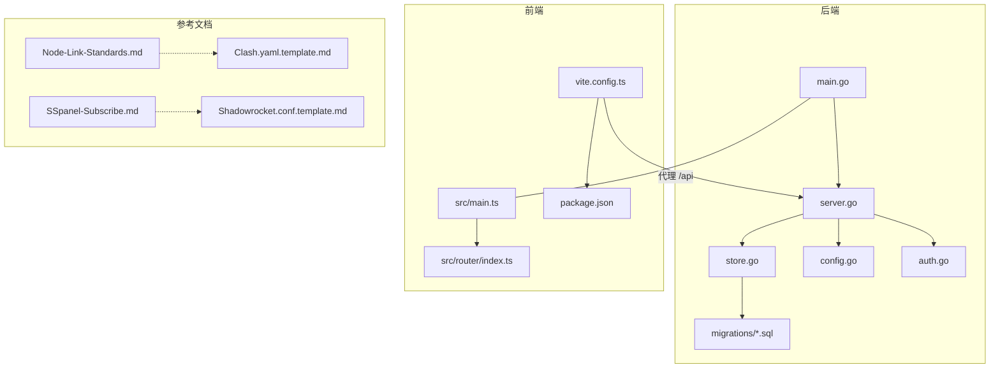
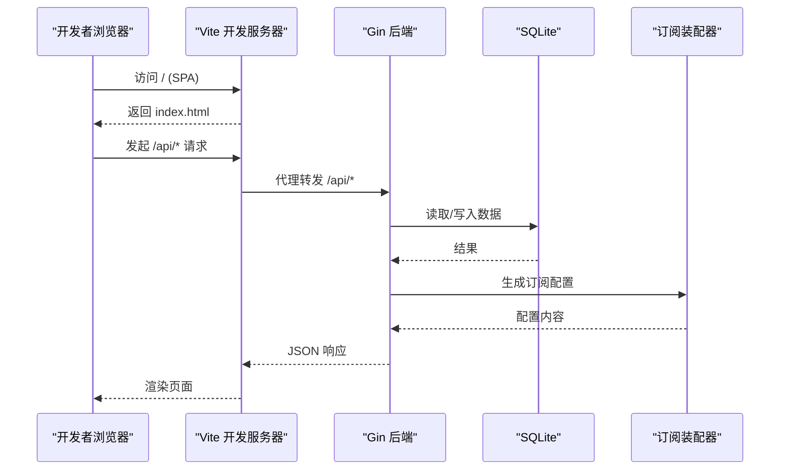
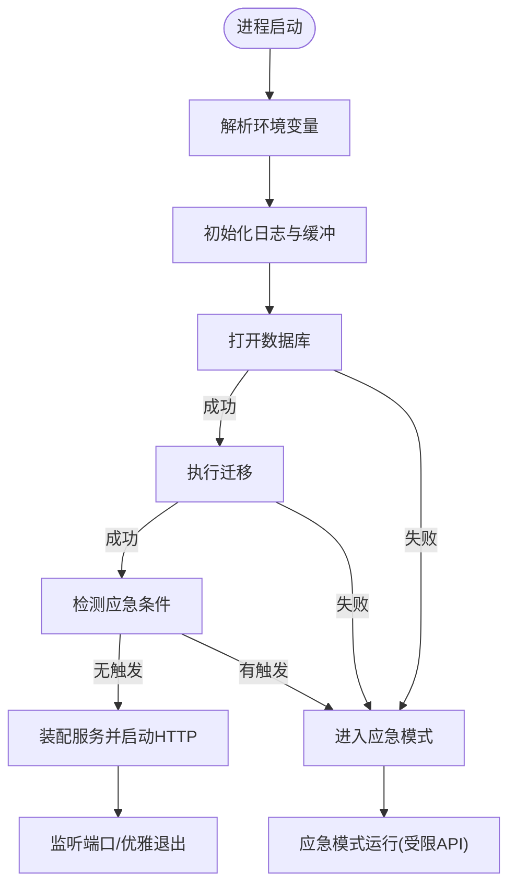
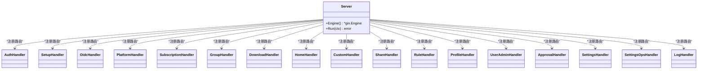
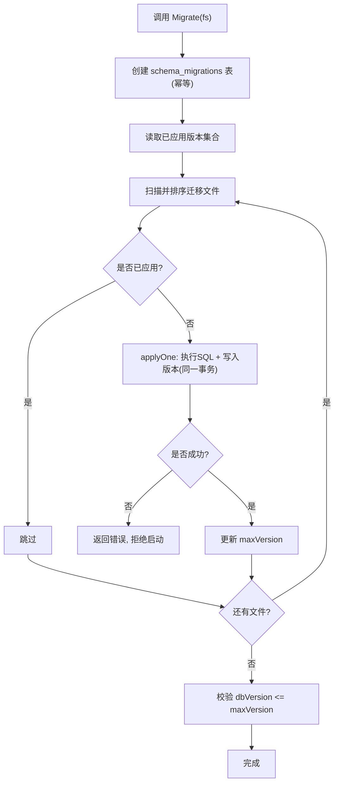
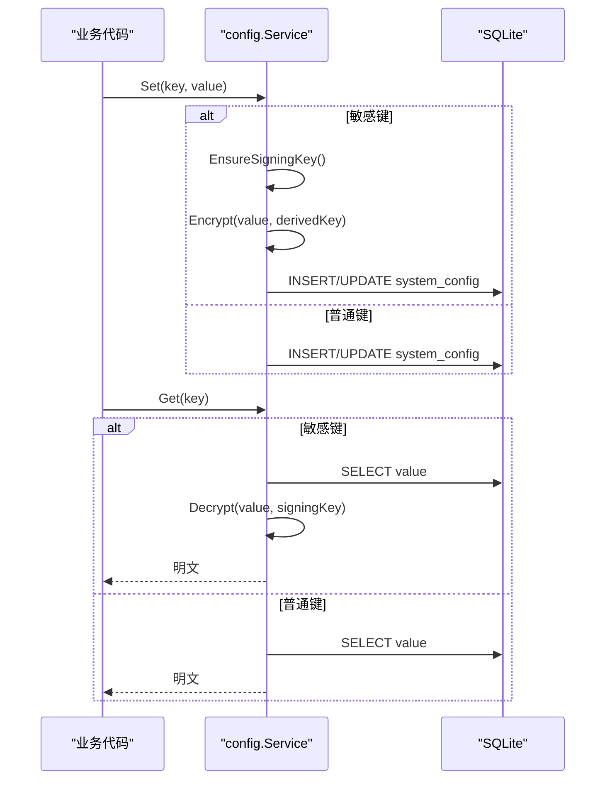
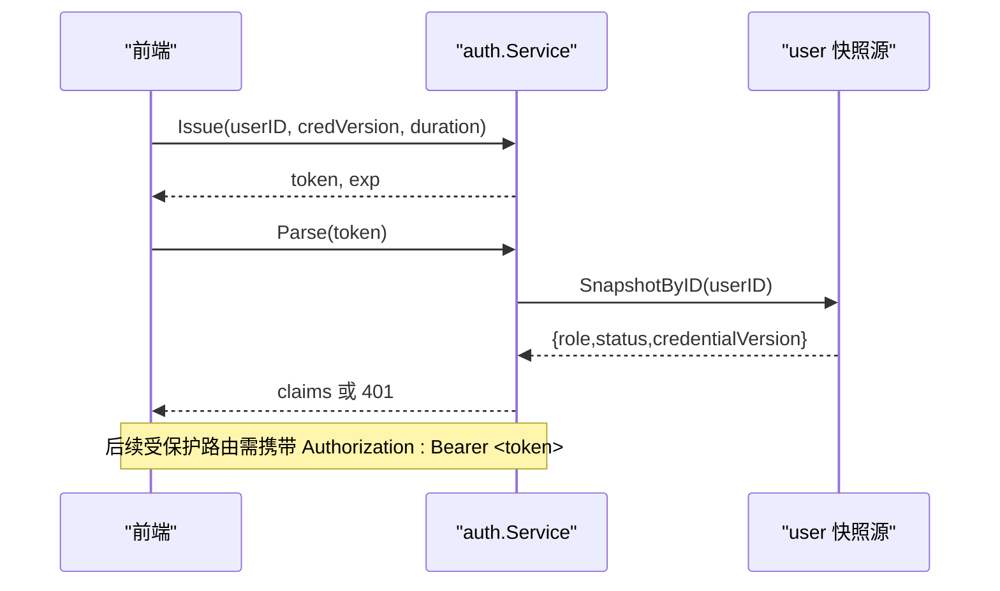
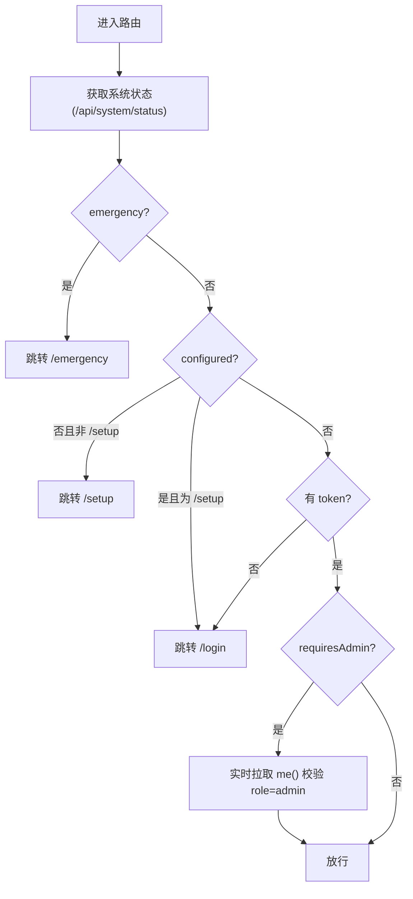
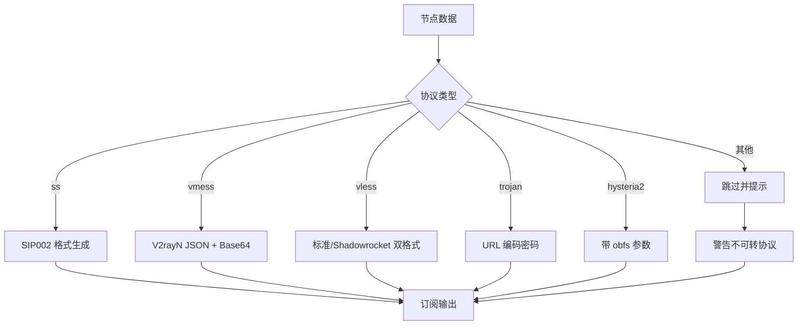
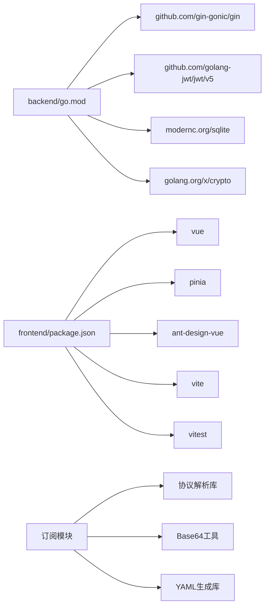

# 开发指南

<cite>
**本文引用的文件**
- [README.md](file://README.md)
- [Dockerfile](file://Dockerfile)
- [docker-compose.yml](file://docker-compose.yml)
- [backend/go.mod](file://backend/go.mod)
- [backend/cmd/server/main.go](file://backend/cmd/server/main.go)
- [backend/internal/server/server.go](file://backend/internal/server/server.go)
- [backend/internal/store/store.go](file://backend/internal/store/store.go)
- [backend/migrations/embed.go](file://backend/migrations/embed.go)
- [backend/migrations/0001_init.sql](file://backend/migrations/0001_init.sql)
- [backend/internal/config/config.go](file://backend/internal/config/config.go)
- [backend/internal/auth/auth.go](file://backend/internal/auth/auth.go)
- [frontend/package.json](file://frontend/package.json)
- [frontend/vite.config.ts](file://frontend/vite.config.ts)
- [frontend/src/main.ts](file://frontend/src/main.ts)
- [frontend/src/router/index.ts](file://frontend/src/router/index.ts)
- [frontend/src/stores/auth.ts](file://frontend/src/stores/auth.ts)
- [frontend/tests/setup.ts](file://frontend/tests/setup.ts)
- [Node-Link-Standards.md](file://docs/Reference/Node-Link-Standards.md)
- [SSpanel-Subscribe.md](file://docs/Reference/SSpanel-Subscribe.md)
- [Clash.yaml.template.md](file://docs/DocTemplates/Clash.yaml.template.md)
- [Shadowrocket.conf.template.md](file://docs/DocTemplates/Shadowrocket.conf.template.md)
- [DailyData.txt.template.md](file://docs/DocTemplates/DailyData.txt.template.md)
</cite>

## 更新摘要
**变更内容**
- 新增节点链接标准与订阅机制参考文档，增强协议兼容性指导
- 添加 Clash YAML、Shadowrocket 配置和每日数据格式模板
- 完善订阅装配器设计验证和实现规范
- 扩展开发工作流中的模板使用和协议处理最佳实践

## 目录
1. [简介](#简介)
2. [项目结构](#项目结构)
3. [核心组件](#核心组件)
4. [架构总览](#架构总览)
5. [详细组件分析](#详细组件分析)
6. [依赖关系分析](#依赖关系分析)
7. [性能与可观测性](#性能与可观测性)
8. [故障排查指南](#故障排查指南)
9. [结论](#结论)
10. [附录：常用命令与环境配置](#附录：常用命令与环境配置)

## 简介
本指南面向希望参与贡献的开发者，覆盖从环境搭建、代码规范、项目结构说明到调试技巧的全流程。重点包括后端 Go 模块开发、前端 Vue 组件开发、数据库迁移管理、测试编写、代码审查标准、提交与分支策略、常用命令、IDE 建议以及性能分析与排障方法。

**更新** 新增节点链接标准、订阅机制分析和配置模板使用指导，为订阅生成和协议转换提供完整的开发参考。

## 项目结构
- 后端（Go）
  - 入口与启动流程：cmd/server/main.go
  - HTTP 服务装配与路由注册：internal/server/server.go
  - 数据层与迁移框架：internal/store/store.go、migrations/*.sql、migrations/embed.go
  - 配置中心与敏感信息加解密：internal/config/config.go
  - 认证与会话中间件：internal/auth/auth.go
  - 依赖声明：backend/go.mod
- 前端（Vue 3 + Vite）
  - 应用入口与状态初始化：frontend/src/main.ts
  - 路由与守卫：frontend/src/router/index.ts
  - 构建与代理配置：frontend/vite.config.ts
  - 包管理与脚本：frontend/package.json
  - 测试全局设置：frontend/tests/setup.ts
- 部署与运行
  - 多阶段镜像构建：Dockerfile
  - 本地编排与健康检查：docker-compose.yml
  - 快速开始与使用说明：README.md
- **新增** 参考文档与模板
  - 节点链接标准分析：docs/Reference/Node-Link-Standards.md
  - 订阅机制研究：docs/Reference/SSpanel-Subscribe.md
  - 配置模板：docs/DocTemplates/ 下的各类配置文件模板

**图表来源**
- [backend/cmd/server/main.go:24-99](file://backend/cmd/server/main.go#L24-L99)
- [backend/internal/server/server.go:63-157](file://backend/internal/server/server.go#L63-L157)
- [backend/internal/store/store.go:32-52](file://backend/internal/store/store.go#L32-L52)
- [backend/migrations/embed.go:1-8](file://backend/migrations/embed.go#L1-L8)
- [frontend/vite.config.ts:8-15](file://frontend/vite.config.ts#L8-L15)
- [frontend/src/main.ts:1-11](file://frontend/src/main.ts#L1-L11)
- [Node-Link-Standards.md:1-144](file://docs/Reference/Node-Link-Standards.md#L1-L144)
- [SSpanel-Subscribe.md:1-200](file://docs/Reference/SSpanel-Subscribe.md#L1-L200)

**章节来源**
- [README.md:221-259](file://README.md#L221-L259)
- [Dockerfile:1-31](file://Dockerfile#L1-L31)
- [docker-compose.yml:1-28](file://docker-compose.yml#L1-L28)

## 核心组件
- 启动与生命周期
  - 环境变量解析、日志初始化、数据库打开与迁移、应急模式检测、HTTP 服务装配与优雅退出。
- HTTP 服务装配
  - 统一响应、请求日志、panic 恢复、信任代理、健康端点、按域注册路由（认证、平台、订阅、用户组、Token、下载、规则、分享、管理员、配置、日志等）。
- 数据层
  - SQLite 单写者模型、WAL、外键、busy_timeout；版本化迁移（文件名 NNNN_name.sql），迁移失败拒绝启动并进入应急模式。
- 配置中心
  - system_config 表承载全部配置；敏感字段 AES-256-GCM 加密存储；事务内读写与签名密钥派生。
- 认证与会话
  - HS256 JWT 凭据；会话中间件实时查库校验角色/状态/凭据版本；管理员中间件叠加保护。
- 前端
  - Vue 3 + Pinia + Router；Vite 开发服务器代理 /api 到后端；路由守卫实现 emergency → configured → 登录态 → 管理员权限控制。
- **新增** 订阅装配器
  - 基于 Node-Link-Standards.md 的协议兼容性分析，支持多种代理协议的链接生成和转换。
  - 遵循 SSpanel-Subscribe.md 的订阅机制规范，确保与主流面板的互操作性。

**章节来源**
- [backend/cmd/server/main.go:24-99](file://backend/cmd/server/main.go#L24-L99)
- [backend/internal/server/server.go:63-157](file://backend/internal/server/server.go#L63-L157)
- [backend/internal/store/store.go:62-128](file://backend/internal/store/store.go#L62-L128)
- [backend/internal/config/config.go:57-111](file://backend/internal/config/config.go#L57-L111)
- [backend/internal/auth/auth.go:98-193](file://backend/internal/auth/auth.go#L98-L193)
- [frontend/src/router/index.ts:96-129](file://frontend/src/router/index.ts#L96-L129)
- [Node-Link-Standards.md:84-127](file://docs/Reference/Node-Link-Standards.md#L84-L127)

## 架构总览
系统采用"前后端分离 + 单容器打包"的架构：前端由 Vite 构建为静态资源，嵌入后端二进制并通过 Gin 提供静态服务；后端以 Gin 暴露 REST API，SQLite 作为嵌入式数据库，所有数据持久化在 /data 卷中。

**更新** 新增订阅装配器架构，支持 Clash YAML 和 Shadowrocket 配置的自动生成，基于标准化的节点链接协议。

**图表来源**
- [frontend/vite.config.ts:8-15](file://frontend/vite.config.ts#L8-L15)
- [backend/internal/server/server.go:63-157](file://backend/internal/server/server.go#L63-L157)
- [backend/internal/store/store.go:32-52](file://backend/internal/store/store.go#L32-L52)
- [Node-Link-Standards.md:84-127](file://docs/Reference/Node-Link-Standards.md#L84-L127)

## 详细组件分析

### 后端启动与应急模式
- 启动流程
  - 解析环境变量（APP_MODE、LOG_LEVEL、PORT、TRUST_PROXY、DATA_DIR、RESET_ADMIN_PASSWORD）。
  - 初始化日志与环形缓冲，打开数据库并执行迁移。
  - 检测应急条件（数据库损坏/迁移失败/关键配置损坏/手动触发），若命中则进入应急模式，仅暴露系统状态、站点信息与应急端点。
  - 正常模式下装配各业务服务与路由，启动 HTTP 服务并监听信号优雅退出。
- 应急模式
  - 通过 NewEmergency 注册最小路由集，/health 返回 503，业务接口被拦截返回 503，便于运维诊断与恢复。

**图表来源**
- [backend/cmd/server/main.go:24-99](file://backend/cmd/server/main.go#L24-L99)
- [backend/cmd/server/main.go:108-126](file://backend/cmd/server/main.go#L108-L126)

**章节来源**
- [backend/cmd/server/main.go:24-99](file://backend/cmd/server/main.go#L24-L99)
- [backend/cmd/server/main.go:108-126](file://backend/cmd/server/main.go#L108-L126)

### HTTP 服务装配与路由
- 统一中间件：请求日志、panic 恢复、信任代理策略。
- 健康端点：/health 用于编排健康检查。
- 路由注册顺序：认证 → Setup → OIDC → 平台/订阅/用户组 → Token/下载/首页 → 自定义/分享 → 规则/个人中心 → 用户管理 → 审批 → 配置 → 运维操作 → 日志查看 → 静态资源。
- 依赖注入：所有服务通过构造函数传入，避免包级全局变量。

**图表来源**
- [backend/internal/server/server.go:63-157](file://backend/internal/server/server.go#L63-L157)

**章节来源**
- [backend/internal/server/server.go:63-157](file://backend/internal/server/server.go#L63-L157)

### 数据层与迁移
- 连接参数：WAL 模式、外键启用、busy_timeout=5000、单写者（MaxOpenConns=1）。
- 迁移框架：
  - 迁移文件命名 NNNN_name.sql，按版本号升序执行未应用项。
  - 每条迁移与其版本记录在同一事务内写入，任一失败即拒绝启动。
  - 数据库版本高于代码支持版本时拒绝启动（防降级）。
- 事务助手：TxImmediate 基于 DSN _txlock=immediate 实现 BEGIN IMMEDIATE，适用于"先读后写"场景。

**图表来源**
- [backend/internal/store/store.go:62-128](file://backend/internal/store/store.go#L62-L128)
- [backend/migrations/0001_init.sql:1-13](file://backend/migrations/0001_init.sql#L1-L13)

**章节来源**
- [backend/internal/store/store.go:32-52](file://backend/internal/store/store.go#L32-L52)
- [backend/internal/store/store.go:62-128](file://backend/internal/store/store.go#L62-L128)
- [backend/migrations/embed.go:1-8](file://backend/migrations/embed.go#L1-L8)
- [backend/migrations/0001_init.sql:1-13](file://backend/migrations/0001_init.sql#L1-L13)

### 配置中心与安全
- 配置存储：system_config 表 key/value 形式。
- 敏感配置：使用 AES-256-GCM 加密存储，密钥由 signing_key 经 HKDF-SHA256 派生。
- 事务安全：GetTx/SetTx 在事务内读取/写入，避免连接池死锁。
- 默认值与类型化读取：GetBool/GetInt/GetJSONStringSlice 提供容错默认值。

**图表来源**
- [backend/internal/config/config.go:57-111](file://backend/internal/config/config.go#L57-L111)
- [backend/internal/config/config.go:220-361](file://backend/internal/config/config.go#L220-L361)

**章节来源**
- [backend/internal/config/config.go:57-111](file://backend/internal/config/config.go#L57-L111)
- [backend/internal/config/config.go:220-361](file://backend/internal/config/config.go#L220-L361)

### 认证与会话
- 密码哈希：bcrypt。
- 凭据签发：HS256 JWT，载荷仅含 user_id 与 credential_version，角色/组不缓存于凭据。
- 会话中间件：解析令牌 → 实时查库获取用户快照 → 比对 credential_version → 校验状态 → 注入上下文。
- 管理员中间件：叠加在会话之后，校验 role=admin。

**图表来源**
- [backend/internal/auth/auth.go:98-193](file://backend/internal/auth/auth.go#L98-L193)

**章节来源**
- [backend/internal/auth/auth.go:98-193](file://backend/internal/auth/auth.go#L98-L193)

### 前端路由与守卫
- 路由组织：公开页、用户端、管理端（懒加载）、版本管理子路由复用。
- 守卫顺序：emergency → configured → 登录态 → 管理员角色；顶部进度条自实现。
- 开发代理：/api、/health、/public 代理至后端 127.0.0.1:8080。

**图表来源**
- [frontend/src/router/index.ts:96-129](file://frontend/src/router/index.ts#L96-L129)
- [frontend/vite.config.ts:8-15](file://frontend/vite.config.ts#L8-L15)

**章节来源**
- [frontend/src/router/index.ts:1-132](file://frontend/src/router/index.ts#L1-L132)
- [frontend/vite.config.ts:1-25](file://frontend/vite.config.ts#L1-L25)

### 测试与质量保障
- 后端
  - 每个业务包均提供 *_test.go，配合 go test ./... 执行。
  - 建议新增功能同步补充单元测试与边界用例。
- 前端
  - 使用 Vitest + jsdom；tests/setup.ts 补齐 AntD 所需浏览器 API。
  - 脚本：npm run test / npm run test:watch。
- **新增** 订阅装配器测试
  - 基于 Node-Link-Standards.md 的协议兼容性测试
  - 验证 Clash YAML 和 Shadowrocket 配置生成的正确性

**章节来源**
- [frontend/tests/setup.ts:1-25](file://frontend/tests/setup.ts#L1-L25)
- [frontend/package.json:6-11](file://frontend/package.json#L6-L11)
- [Node-Link-Standards.md:84-127](file://docs/Reference/Node-Link-Standards.md#L84-L127)

### 订阅装配器与协议兼容性
**新增** 基于最新参考文档的订阅装配器实现指导：

- **协议支持矩阵**
  - 完全支持：ss、vmess、vless、trojan、hysteria2、tuic、wireguard、http、socks5
  - 部分支持：hysteria（有限参数）、anytls
  - 不支持：snell、mieru、masque、openvpn、ssh、shadowquic、trusttunnel、tailscale
- **链接生成规范**
  - 名称统一 URL 编码，server 域名转 punycode
  - 查询参数使用 URLSearchParams 自动编码
  - 布尔值统一输出 "1"，无参数不输出 "?"
- **Shadowrocket 原生参数风格**
  - base64 userinfo + query 形态为主输出格式
  - xtls=2 表示 REALITY，peer 表示 SNI
  - pbk/sid 为 REALITY 公钥和 short-id
- **Clash YAML 渲染**
  - manual 节点按 protocol_json 原样输出
  - 深度清理空对象但保留 false/0 值
  - 支持占位标记 # {{xray_nodes}} 注入

**图表来源**
- [Node-Link-Standards.md:21-43](file://docs/Reference/Node-Link-Standards.md#L21-L43)
- [Node-Link-Standards.md:84-127](file://docs/Reference/Node-Link-Standards.md#L84-L127)

**章节来源**
- [Node-Link-Standards.md:1-144](file://docs/Reference/Node-Link-Standards.md#L1-L144)
- [SSpanel-Subscribe.md:1-200](file://docs/Reference/SSpanel-Subscribe.md#L1-L200)

## 依赖关系分析
- 后端依赖
  - Gin 作为 Web 框架；JWT 用于会话；modernc.org/sqlite 纯 Go 驱动；golang.org/x/crypto 用于密码学。
- 前端依赖
  - Vue 3、Pinia、Vue Router、Ant Design Vue、Tailwind CSS、Vite、Vitest。
- **新增** 订阅相关依赖
  - 协议解析库（基于 urlclash-converter 逻辑）
  - Base64 编解码工具
  - YAML 生成库

**图表来源**
- [backend/go.mod:5-10](file://backend/go.mod#L5-L10)
- [frontend/package.json:12-35](file://frontend/package.json#L12-L35)
- [Node-Link-Standards.md:84-127](file://docs/Reference/Node-Link-Standards.md#L84-L127)

**章节来源**
- [backend/go.mod:1-50](file://backend/go.mod#L1-L50)
- [frontend/package.json:1-37](file://frontend/package.json#L1-L37)

## 性能与可观测性
- 数据库
  - WAL + 单写者 + busy_timeout，减少并发写冲突；迁移串行化避免竞争。
- 日志
  - 请求日志包含方法、路径、状态码、耗时；SSE 实时日志流（管理端）；访问日志自动清理（90 天）。
- 限流
  - 内置速率限制器，重置运行时状态时可一并复位计数。
- 前端
  - 路由级懒加载与代码分割；顶部进度条提升感知性能。
- **新增** 订阅性能优化
  - 批量节点处理，避免重复计算
  - 协议兼容性预检查，减少无效转换
  - 模板缓存机制，提升配置生成速度

## 故障排查指南
- 无法启动/迁移失败
  - 现象：启动日志提示迁移失败或数据库损坏，自动进入应急模式。
  - 处理：检查 /data 下数据库文件完整性；必要时使用面板备份恢复或重新初始化；确认程序版本不低于数据库 schema 版本。
- 健康检查失败
  - 现象：/health 返回 503。
  - 处理：确认处于应急模式或后端异常；查看容器日志定位根因。
- 认证失败
  - 现象：401 或"凭据无效/过期"。
  - 处理：检查 Authorization 头格式；确认服务端 signing_key 存在；核对 credential_version 是否变更。
- 前端代理问题
  - 现象：开发环境 /api 请求 404。
  - 处理：确认 vite.config.ts 代理目标 127.0.0.1:8080 可达；后端服务已启动。
- **新增** 订阅生成问题
  - 现象：生成的订阅链接无法导入客户端
  - 处理：检查协议兼容性，确认使用支持的协议格式；验证 Base64 编码是否正确；参考 Node-Link-Standards.md 的往返陷阱清单

**章节来源**
- [backend/cmd/server/main.go:24-99](file://backend/cmd/server/main.go#L24-L99)
- [backend/internal/server/server.go:160-193](file://backend/internal/server/server.go#L160-L193)
- [backend/internal/auth/auth.go:118-193](file://backend/internal/auth/auth.go#L118-193)
- [frontend/vite.config.ts:8-15](file://frontend/vite.config.ts#L8-L15)
- [Node-Link-Standards.md:63-83](file://docs/Reference/Node-Link-Standards.md#L63-L83)

## 结论
本项目以"单容器、零外部依赖、易部署"为目标，后端采用 Gin + SQLite 的轻量架构，前端使用 Vue 3 + Vite 提供现代体验。通过版本化迁移、配置加密、会话鉴权与完善的日志/监控能力，兼顾了安全性与可维护性。新增的订阅装配器和协议兼容性分析为代理订阅管理提供了完整的技术支撑。遵循本指南的流程与规范，可高效开展功能开发与协作贡献。

**更新** 新增的参考文档和模板文件为订阅生成和协议转换提供了详细的实现指导，确保了与主流代理生态的互操作性。

## 附录：常用命令与环境配置

- 本地开发
  - 后端：cd backend && go run ./cmd/server
  - 前端：cd frontend && npm run dev
  - 构建验证：go build ./... && go vet ./... && go test ./...；cd frontend && npm run build
- 容器化
  - 一键构建与运行：docker compose up -d --build
  - 健康检查：curl http://127.0.0.1:8080/health
- 环境变量（部分）
  - APP_MODE：dev|prod
  - LOG_LEVEL：debug|info|warn|error
  - LOG_FORMAT：console|json
  - PORT：监听端口
  - TRUST_PROXY：auto|on|off
  - DATA_DIR：数据目录
  - RESET_ADMIN_PASSWORD：应急恢复开关
- IDE 建议
  - Go：安装 Go 工具链与 gopls，开启 go mod tidy 与 go vet 检查。
  - Vue：安装 Volar/TypeScript 插件，配置 @ 别名指向 src。
  - Docker：使用官方镜像进行构建与运行，确保 /data 卷挂载。
- **新增** 订阅开发工具
  - 使用 Node-Link-Standards.md 作为协议兼容性参考
  - 参考模板文件进行配置生成测试
  - 验证 Shadowrocket 和 Clash 客户端的导入兼容性

**章节来源**
- [README.md:230-259](file://README.md#L230-L259)
- [docker-compose.yml:12-18](file://docker-compose.yml#L12-L18)
- [frontend/package.json:6-11](file://frontend/package.json#L6-L11)
- [Node-Link-Standards.md:84-127](file://docs/Reference/Node-Link-Standards.md#L84-L127)
- [Clash.yaml.template.md:1-321](file://docs/DocTemplates/Clash.yaml.template.md#L1-L321)
- [Shadowrocket.conf.template.md:1-47](file://docs/DocTemplates/Shadowrocket.conf.template.md#L1-L47)