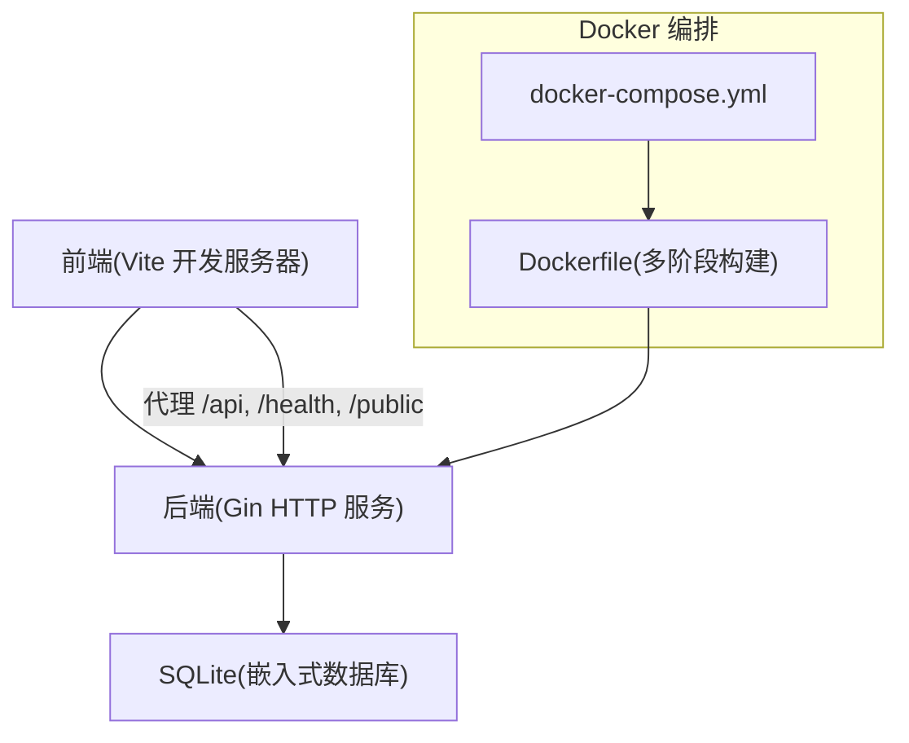
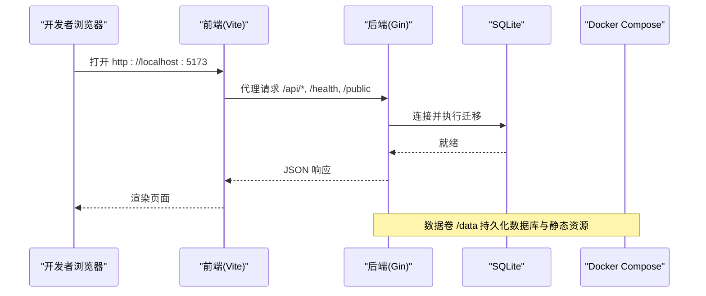
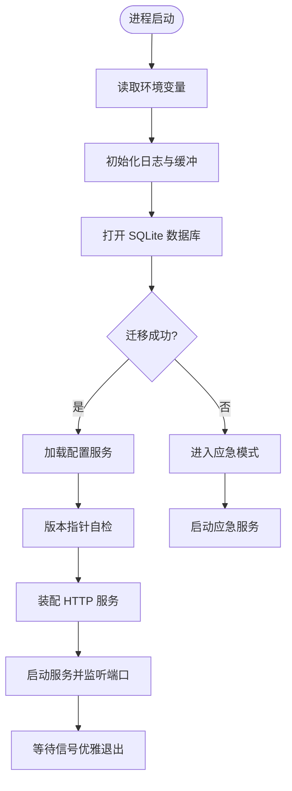
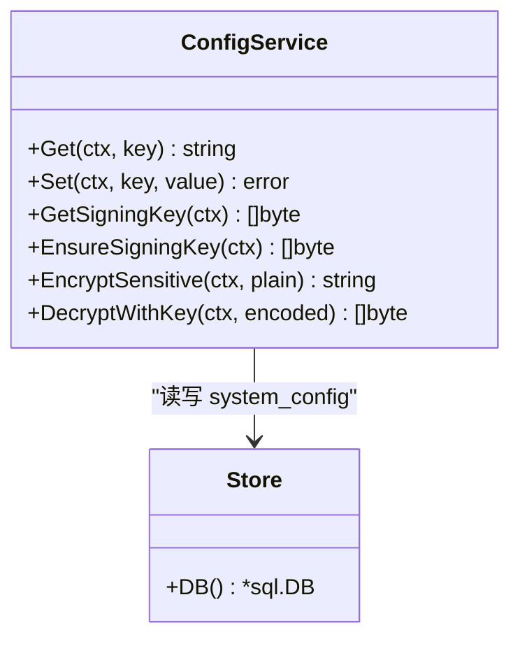
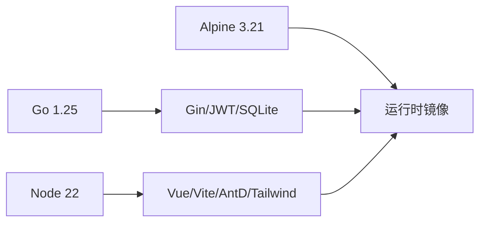

# 开发环境搭建

<cite>
**本文引用的文件**
- [README.md](../../../../../README.md)
- [backend/cmd/server/main.go](file://backend/cmd/server/main.go)
- [backend/go.mod](file://backend/go.mod)
- [backend/internal/config/config.go](file://backend/internal/config/config.go)
- [backend/migrations/0001_init.sql](file://backend/migrations/0001_init.sql)
- [frontend/package.json](file://frontend/package.json)
- [frontend/vite.config.ts](file://frontend/vite.config.ts)
- [Dockerfile](file://Dockerfile)
- [docker-compose.yml](file://docker-compose.yml)
- [docker-compose.yml.example](file://docker-compose.yml.example)
</cite>

## 目录
1. [简介](#简介)
2. [项目结构](#项目结构)
3. [核心组件](#核心组件)
4. [架构总览](#架构总览)
5. [详细组件分析](#详细组件分析)
6. [依赖关系分析](#依赖关系分析)
7. [性能与构建注意事项](#性能与构建注意事项)
8. [故障排查指南](#故障排查指南)
9. [结论](#结论)
10. [附录：分系统安装步骤与环境变量](#附录：分系统安装步骤与环境变量)

## 简介
本指南面向首次参与本项目开发的工程师，目标是帮助你在 Windows、macOS、Linux 上快速搭建本地开发环境，完成 Go 后端、Node.js/Vue 前端、SQLite 数据库的初始化，并通过 Docker Compose 或本地进程启动服务，最终验证端到端可用。

技术栈概览（来自仓库说明）：
- 后端：Go + Gin + SQLite（嵌入式存储，零外部数据库依赖）
- 前端：Vue 3 + Vite + Ant Design Vue + Tailwind CSS
- 部署：单容器镜像（API + 前端静态资源一体），数据卷持久化

## 项目结构
- backend：Go 后端源码，入口为 cmd/server/main.go；使用 go.mod 管理依赖；migrations 存放 SQLite 迁移脚本；web/dist 由多阶段构建注入。
- frontend：Vue 3 + Vite 前端工程，package.json 定义脚本与依赖，vite.config.ts 配置开发代理与构建选项。
- 根目录：Dockerfile 多阶段构建镜像；docker-compose.yml 提供开发编排；docker-compose.yml.example 提供生产模板；README.md 包含快速开始与本地开发命令。

图表来源
- [frontend/vite.config.ts:8-14](file://frontend/vite.config.ts#L8-L14)
- [backend/cmd/server/main.go:24-98](file://backend/cmd/server/main.go#L24-L98)
- [Dockerfile:1-31](file://Dockerfile#L1-L31)
- [docker-compose.yml:1-28](file://docker-compose.yml#L1-L28)

章节来源
- [README.md:230-259](../../../../../README.md#L230-L259)
- [backend/go.mod:1-10](file://backend/go.mod#L1-L10)
- [frontend/package.json:1-37](file://frontend/package.json#L1-L37)
- [Dockerfile:1-31](file://Dockerfile#L1-L31)
- [docker-compose.yml:1-28](file://docker-compose.yml#L1-L28)

## 核心组件
- 后端服务：负责环境变量解析、日志初始化、数据库迁移、路由装配、优雅退出与应急模式处理。
- 配置服务：基于 system_config 表实现键值配置读写，敏感字段加密存储。
- 数据库：SQLite 嵌入式存储，通过 migrations 进行版本化迁移。
- 前端：Vite 开发服务器，代理 API 到后端；构建产物嵌入后端二进制。
- 容器化：多阶段构建镜像，非 root 运行，数据卷持久化。

章节来源
- [backend/cmd/server/main.go:24-98](file://backend/cmd/server/main.go#L24-L98)
- [backend/internal/config/config.go:24-111](file://backend/internal/config/config.go#L24-L111)
- [backend/migrations/0001_init.sql:1-13](file://backend/migrations/0001_init.sql#L1-L13)
- [frontend/vite.config.ts:8-14](file://frontend/vite.config.ts#L8-L14)
- [Dockerfile:1-31](file://Dockerfile#L1-L31)

## 架构总览
下图展示了本地开发与容器化运行的整体交互：前端通过 Vite 代理访问后端 API；后端启动时执行数据库迁移并加载配置；数据与静态资源通过数据卷持久化。

图表来源
- [frontend/vite.config.ts:8-14](file://frontend/vite.config.ts#L8-L14)
- [backend/cmd/server/main.go:40-60](file://backend/cmd/server/main.go#L40-L60)
- [docker-compose.yml:10-24](file://docker-compose.yml#L10-L24)

## 详细组件分析

### 后端服务启动流程
- 读取环境变量（APP_MODE、LOG_LEVEL、LOG_FORMAT、PORT、TRUST_PROXY、DATA_DIR、RESET_ADMIN_PASSWORD）。
- 初始化日志与环形缓冲，按模式选择数据库文件名。
- 打开 SQLite 并执行迁移；失败则进入应急模式。
- 装配配置、用户、版本检查、HTTP 服务，启动访问日志清理任务。
- 监听信号，优雅退出。

图表来源
- [backend/cmd/server/main.go:24-98](file://backend/cmd/server/main.go#L24-L98)
- [backend/cmd/server/main.go:108-126](file://backend/cmd/server/main.go#L108-L126)

章节来源
- [backend/cmd/server/main.go:24-98](file://backend/cmd/server/main.go#L24-L98)
- [backend/cmd/server/main.go:101-106](file://backend/cmd/server/main.go#L101-L106)

### 配置服务与敏感数据保护
- 配置以 key/value 形式存储在 system_config 表。
- 敏感字段通过 AES-256-GCM 加密存储，密钥由签名密钥经 HKDF 派生。
- 提供 Get/Set、事务内读写、布尔/整数类型化读取等能力。

图表来源
- [backend/internal/config/config.go:24-111](file://backend/internal/config/config.go#L24-L111)
- [backend/internal/config/config.go:220-361](file://backend/internal/config/config.go#L220-L361)

章节来源
- [backend/internal/config/config.go:24-111](file://backend/internal/config/config.go#L24-L111)
- [backend/internal/config/config.go:220-361](file://backend/internal/config/config.go#L220-L361)

### 数据库与迁移
- 首张表 schema_migrations 记录迁移版本。
- system_config 承载系统配置。
- 启动时自动执行迁移，确保数据库结构与版本一致。

章节来源
- [backend/migrations/0001_init.sql:1-13](file://backend/migrations/0001_init.sql#L1-L13)
- [backend/cmd/server/main.go:40-60](file://backend/cmd/server/main.go#L40-L60)

### 前端开发服务器与代理
- Vite 开发服务器默认在 5173 端口。
- 将 /api、/health、/public 代理到后端 127.0.0.1:8080，便于前后端联调。
- 构建产物由后端多阶段构建注入，生产环境无需单独部署前端。

章节来源
- [frontend/vite.config.ts:8-14](file://frontend/vite.config.ts#L8-L14)
- [frontend/package.json:6-10](file://frontend/package.json#L6-L10)
- [Dockerfile:1-17](file://Dockerfile#L1-L17)

### Docker 与 Compose
- 多阶段构建：先 Node 构建前端，再 Go 静态编译后端，最后最小运行时镜像。
- 数据卷 /data 持久化数据库与静态资源。
- healthcheck 探测 /health 接口用于健康检查。
- 提供开发 compose 与生产示例 compose。

章节来源
- [Dockerfile:1-31](file://Dockerfile#L1-L31)
- [docker-compose.yml:1-28](file://docker-compose.yml#L1-L28)
- [docker-compose.yml.example:1-41](file://docker-compose.yml.example#L1-L41)

## 依赖关系分析
- 后端依赖：Gin 框架、JWT、SQLite 嵌入式驱动、标准库等。
- 前端依赖：Vue 3、Ant Design Vue、Axios、Pinia、Vite、Tailwind 等。
- 构建依赖：Node 22（前端）、Go 1.25（后端）、Alpine Linux（运行时）。

图表来源
- [backend/go.mod:1-10](file://backend/go.mod#L1-L10)
- [frontend/package.json:12-35](file://frontend/package.json#L12-L35)
- [Dockerfile:1-31](file://Dockerfile#L1-L31)

章节来源
- [backend/go.mod:1-10](file://backend/go.mod#L1-L10)
- [frontend/package.json:12-35](file://frontend/package.json#L12-L35)
- [Dockerfile:1-31](file://Dockerfile#L1-L31)

## 性能与构建注意事项
- 后端静态编译：CGO_ENABLED=0，减小体积，提升启动速度。
- 前端构建：避免手动拆分 ant-design-vue chunk，防止循环依赖导致白屏。
- 数据持久化：所有数据位于 /data 数据卷，升级不丢数据。
- 日志级别：开发建议 debug，生产建议 info/json 接入采集。

章节来源
- [Dockerfile:9-17](file://Dockerfile#L9-L17)
- [frontend/vite.config.ts:16-23](file://frontend/vite.config.ts#L16-L23)
- [docker-compose.yml.example:19-27](file://docker-compose.yml.example#L19-L27)

## 故障排查指南
- 无法打开数据库：程序会自动进入应急模式，仅暴露系统与应急端点，查看日志定位原因。
- 迁移失败：同样进入应急模式，可通过面板或日志获取操作码进行恢复。
- 端口冲突：修改 PORT 环境变量或 docker-compose 映射端口。
- 代理问题：确认 Vite 代理目标为 127.0.0.1:8080，且后端已启动。
- 权限问题：容器内以非 root 运行，确保 /data 目录可写。

章节来源
- [backend/cmd/server/main.go:40-60](file://backend/cmd/server/main.go#L40-L60)
- [backend/cmd/server/main.go:108-126](file://backend/cmd/server/main.go#L108-L126)
- [docker-compose.yml:19-24](file://docker-compose.yml#L19-L24)

## 结论
通过本指南，你可以在不同操作系统上完成 Go、Node.js、SQLite 的安装与配置，使用 npm 安装前端依赖，使用 go mod 管理后端依赖，借助 Docker Compose 一键拉起服务，并完成数据库初始化与服务验证。推荐优先使用容器化方式部署，以获得一致的构建与运行体验。

## 附录：分系统安装步骤与环境变量

### 通用前置
- 安装 Git、Docker、Docker Compose（或使用 docker compose 子命令）。
- 克隆仓库后，根目录存在 docker-compose.yml 与 README 中的快速开始命令。

章节来源
- [README.md:65-93](../../../../../README.md#L65-L93)
- [docker-compose.yml:1-28](file://docker-compose.yml#L1-L28)

### Windows
- 安装 Go 1.25+（若需本地运行后端）：设置 GOPATH、GOROOT，并将 Go bin 加入 PATH。
- 安装 Node.js 22+（若需本地运行前端）：安装完成后验证 node -v、npm -v。
- 安装 SQLite：由于后端使用嵌入式 SQLite 驱动，无需额外安装数据库。
- IDE 推荐：VS Code（安装 Go、Vue 插件）或 GoLand（启用 Go 模块与数据库工具）。
- 环境变量：可在系统“环境变量”中设置 APP_MODE、LOG_LEVEL、PORT、TRUST_PROXY、DATA_DIR。
- 启动：
  - 容器化：cd 到仓库根目录，执行 docker compose up -d。
  - 本地开发：
    - 后端：cd backend && go run ./cmd/server
    - 前端：cd frontend && npm install && npm run dev

章节来源
- [backend/go.mod:1-10](file://backend/go.mod#L1-L10)
- [frontend/package.json:6-10](file://frontend/package.json#L6-L10)
- [frontend/vite.config.ts:8-14](file://frontend/vite.config.ts#L8-L14)
- [README.md:248-259](../../../../../README.md#L248-L259)

### macOS
- 安装 Go：brew install go@1.25（或直接下载官方安装包）。
- 安装 Node.js：brew install node@22 或 nvm。
- SQLite：无需额外安装。
- IDE 推荐：VS Code 或 GoLand。
- 环境变量：export 或在 ~/.zshrc 中添加。
- 启动：同 Windows 步骤。

章节来源
- [backend/go.mod:1-10](file://backend/go.mod#L1-L10)
- [frontend/package.json:6-10](file://frontend/package.json#L6-L10)
- [README.md:248-259](../../../../../README.md#L248-L259)

### Linux
- 安装 Go：下载二进制包或包管理器安装。
- 安装 Node.js：nvm 或包管理器安装 v22。
- SQLite：无需额外安装。
- IDE 推荐：VS Code 或 GoLand。
- 环境变量：写入 shell 配置文件或 systemd 服务环境。
- 启动：同 Windows/macOS 步骤。

章节来源
- [backend/go.mod:1-10](file://backend/go.mod#L1-L10)
- [frontend/package.json:6-10](file://frontend/package.json#L6-L10)
- [README.md:248-259](../../../../../README.md#L248-L259)

### 后端依赖管理（go mod）
- 进入 backend 目录，执行 go mod download 或 go build 自动拉取依赖。
- 如需更新依赖：go get -u ./... 后 go mod tidy。

章节来源
- [backend/go.mod:1-10](file://backend/go.mod#L1-L10)
- [Dockerfile:11-17](file://Dockerfile#L11-L17)

### 前端依赖安装（npm）
- 进入 frontend 目录，执行 npm install。
- 开发：npm run dev（Vite 默认 5173 端口，代理 /api 到后端 8080）。
- 构建：npm run build（产物由后端多阶段构建注入）。

章节来源
- [frontend/package.json:6-10](file://frontend/package.json#L6-L10)
- [frontend/vite.config.ts:8-14](file://frontend/vite.config.ts#L8-L14)
- [Dockerfile:1-17](file://Dockerfile#L1-L17)

### Docker 环境准备
- 确保 Docker 与 Compose 可用。
- 根目录执行 docker compose up -d 即可构建并启动服务。
- 数据卷 vpn-data 持久化全部数据。

章节来源
- [docker-compose.yml:1-28](file://docker-compose.yml#L1-L28)
- [docker-compose.yml.example:1-41](file://docker-compose.yml.example#L1-L41)
- [Dockerfile:1-31](file://Dockerfile#L1-L31)

### 环境变量配置
- 常用变量：
  - APP_MODE：dev 或 prod（影响数据库文件名与行为）
  - LOG_LEVEL：debug/info/warn/error
  - LOG_FORMAT：console/json
  - PORT：服务监听端口（默认 8080）
  - TRUST_PROXY：auto/on/off（真实客户端 IP 解析策略）
  - DATA_DIR：数据目录（默认 ./data）
  - RESET_ADMIN_PASSWORD：应急恢复开关（见下方说明）
- 在 docker-compose.yml 或 .env 文件中设置，或通过系统环境变量注入。

章节来源
- [backend/cmd/server/main.go:24-36](file://backend/cmd/server/main.go#L24-L36)
- [docker-compose.yml:12-17](file://docker-compose.yml#L12-L17)
- [docker-compose.yml.example:19-30](file://docker-compose.yml.example#L19-L30)
- [README.md:194-213](../../../../../README.md#L194-L213)

### 数据库初始化
- 首次启动时，后端自动创建 schema_migrations 与 system_config 表，并执行迁移。
- 数据保存在 /data 数据卷中，升级不影响数据。

章节来源
- [backend/migrations/0001_init.sql:1-13](file://backend/migrations/0001_init.sql#L1-L13)
- [backend/cmd/server/main.go:40-60](file://backend/cmd/server/main.go#L40-L60)
- [docker-compose.yml:10-11](file://docker-compose.yml#L10-L11)

### 服务启动验证
- 健康检查：curl http://127.0.0.1:8080/health 或浏览器访问。
- 前端开发：http://localhost:5173，代理 /api 到后端。
- 容器健康：docker compose ps 查看状态，healthcheck 探测 /health。

章节来源
- [frontend/vite.config.ts:8-14](file://frontend/vite.config.ts#L8-L14)
- [docker-compose.yml:19-24](file://docker-compose.yml#L19-L24)
- [README.md:248-259](../../../../../README.md#L248-L259)

### 应急恢复（管理员密码救援）
- 在 docker-compose.yml 中设置 RESET_ADMIN_PASSWORD: "1" 并重启容器。
- 查看容器日志获取一次性操作码，完成重置后移除该变量并重启恢复正常服务。

章节来源
- [docker-compose.yml:16-17](file://docker-compose.yml#L16-L17)
- [docker-compose.yml.example:28-30](file://docker-compose.yml.example#L28-L30)
- [README.md:205-213](../../../../../README.md#L205-L213)