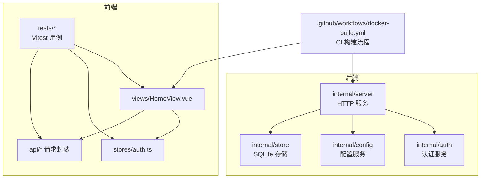
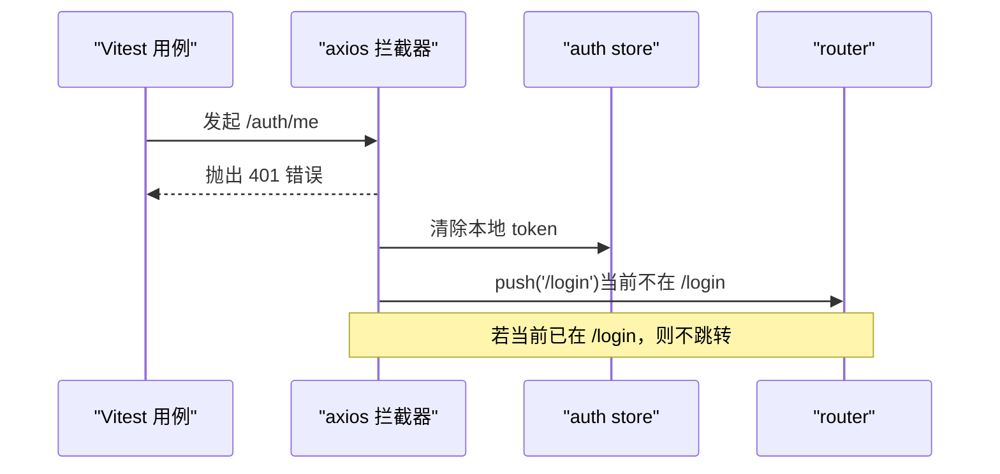
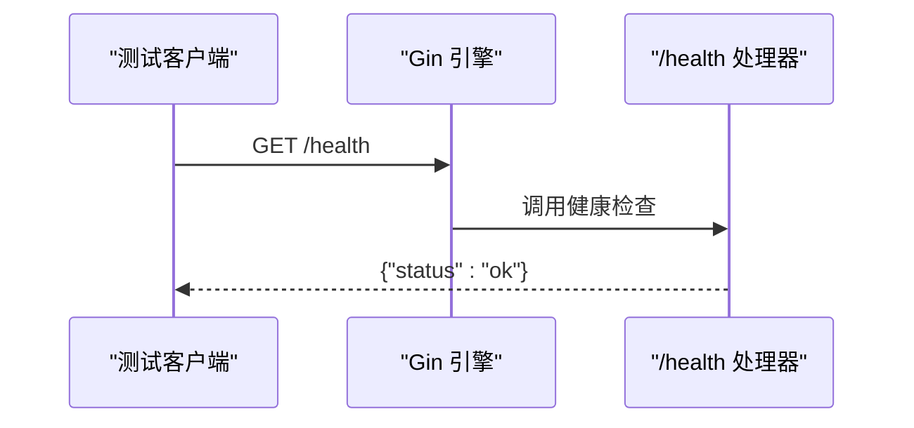
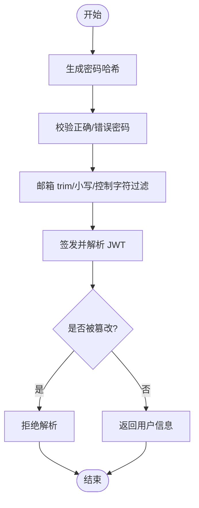
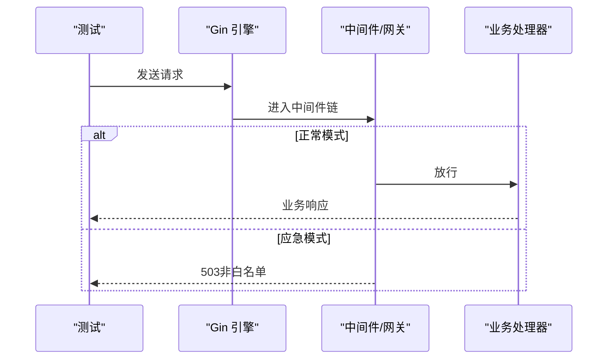
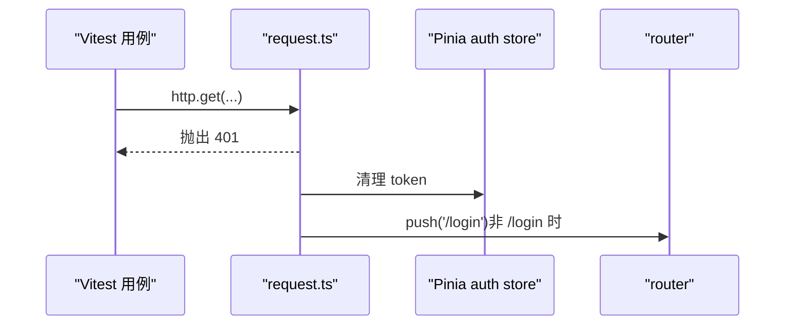
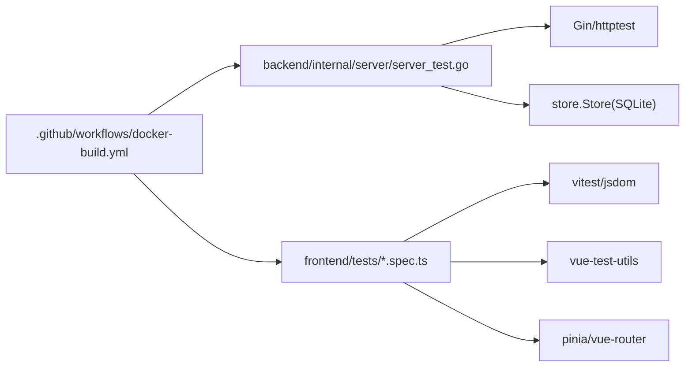

# 测试指南

<cite>
**本文引用的文件**
- [backend/go.mod](file://backend/go.mod)
- [.github/workflows/docker-build.yml](file://.github/workflows/docker-build.yml)
- [frontend/package.json](file://frontend/package.json)
- [frontend/vitest.config.ts](file://frontend/vitest.config.ts)
- [frontend/tests/setup.ts](file://frontend/tests/setup.ts)
- [frontend/tests/request.spec.ts](file://frontend/tests/request.spec.ts)
- [frontend/tests/auth-store.spec.ts](file://frontend/tests/auth-store.spec.ts)
- [frontend/tests/home-view.spec.ts](file://frontend/tests/home-view.spec.ts)
- [frontend/tests/router-guard.spec.ts](file://frontend/tests/router-guard.spec.ts)
- [backend/internal/server/server_test.go](file://backend/internal/server/server_test.go)
- [backend/internal/auth/auth_test.go](file://backend/internal/auth/auth_test.go)
- [backend/internal/config/config_test.go](file://backend/internal/config/config_test.go)
- [backend/internal/config/export_test.go](file://backend/internal/config/export_test.go)
- [backend/internal/oidc/mock.go](file://backend/internal/oidc/mock.go)
</cite>

## 目录
1. [简介](#简介)
2. [项目结构](#项目结构)
3. [核心组件](#核心组件)
4. [架构总览](#架构总览)
5. [详细组件分析](#详细组件分析)
6. [依赖分析](#依赖分析)
7. [性能考虑](#性能考虑)
8. [故障排查指南](#故障排查指南)
9. [结论](#结论)
10. [附录](#附录)

## 简介
本指南面向后端（Go）与前端（Vue/Vitest）的测试策略与实践，覆盖单元测试、集成测试、端到端测试的设计与落地；包含测试数据准备、Mock 使用、覆盖率要求、用例编写规范、断言最佳实践、异步测试处理；并说明在 CI/CD 中的自动化执行、报告生成与性能测试工具的使用建议。

## 项目结构
- 后端采用 Go 标准 testing 框架，按模块内聚组织测试文件（如 internal/*_test.go），通过临时 SQLite 数据库与最小迁移脚本构造隔离环境。
- 前端基于 Vitest + jsdom，配合 Vue Test Utils 进行组件与路由守卫测试，使用 Pinia 管理状态并通过 vi.mock 隔离外部依赖。
- CI 目前提供 Docker 镜像构建工作流；可在其中扩展前后端测试步骤与报告收集。

**图表来源**
- [backend/internal/server/server_test.go:22-71](file://backend/internal/server/server_test.go#L22-L71)
- [frontend/vitest.config.ts:1-13](file://frontend/vitest.config.ts#L1-L13)
- [.github/workflows/docker-build.yml:17-52](file://.github/workflows/docker-build.yml#L17-L52)

**章节来源**
- [backend/go.mod:1-50](file://backend/go.mod#L1-L50)
- [frontend/package.json:1-37](file://frontend/package.json#L1-L37)
- [frontend/vitest.config.ts:1-13](file://frontend/vitest.config.ts#L1-L13)
- [.github/workflows/docker-build.yml:17-52](file://.github/workflows/docker-build.yml#L17-L52)

## 核心组件
- 后端测试基座：通过临时目录 + 内存/文件型 SQLite + 最小迁移脚本，保证每个测试独立、可重复、无副作用。
- 前端测试基座：jsdom 环境补齐浏览器 API（matchMedia、getComputedStyle），统一初始化 Pinia 与路由，mock 网络与第三方库。
- 关键被测对象：
  - 后端：认证哈希/校验、邮箱规范化、OIDC 模拟登录与连接测试、服务器健康检查与应急模式、限流等。
  - 前端：axios 拦截器对 401 的处理、auth store 登录/注册/登出、首页平台卡片三态渲染、路由守卫 configured 逻辑。

**章节来源**
- [backend/internal/auth/auth_test.go:14-114](file://backend/internal/auth/auth_test.go#L14-L114)
- [backend/internal/server/server_test.go:22-71](file://backend/internal/server/server_test.go#L22-L71)
- [frontend/tests/setup.ts:1-25](file://frontend/tests/setup.ts#L1-L25)
- [frontend/tests/request.spec.ts:1-56](file://frontend/tests/request.spec.ts#L1-L56)
- [frontend/tests/auth-store.spec.ts:1-65](file://frontend/tests/auth-store.spec.ts#L1-L65)
- [frontend/tests/home-view.spec.ts:1-101](file://frontend/tests/home-view.spec.ts#L1-L101)
- [frontend/tests/router-guard.spec.ts:1-53](file://frontend/tests/router-guard.spec.ts#L1-L53)

## 架构总览
下图展示一次“登录失败触发 401 跳转”的前端链路，以及后端“健康检查”的响应路径。

**图表来源**
- [frontend/tests/request.spec.ts:1-56](file://frontend/tests/request.spec.ts#L1-L56)

**图表来源**
- [backend/internal/server/server_test.go:73-87](file://backend/internal/server/server_test.go#L73-L87)

## 详细组件分析

### 后端：认证与凭据测试
- 密码哈希与校验往返、长度与字符集校验、邮箱规范化、JWT 签发与解析、篡改签名拒绝。
- 测试数据：临时 SQLite + 最小迁移；日志输出限制为 error。
- 关键点：避免真实网络与外部依赖；通过最小化迁移确保表结构满足被测逻辑。

**图表来源**
- [backend/internal/auth/auth_test.go:34-114](file://backend/internal/auth/auth_test.go#L34-L114)

**章节来源**
- [backend/internal/auth/auth_test.go:14-114](file://backend/internal/auth/auth_test.go#L14-L114)

### 后端：服务器与健康/应急模式
- 健康检查、公开公告、系统状态、应急模式下的白名单与 503 行为、限流验证。
- 测试方法：httptest.NewRequest + Engine.ServeHTTP 直接驱动 Gin 引擎，断言状态码与 JSON 结构。

**图表来源**
- [backend/internal/server/server_test.go:234-251](file://backend/internal/server/server_test.go#L234-L251)
- [backend/internal/server/server_test.go:335-410](file://backend/internal/server/server_test.go#L335-L410)

**章节来源**
- [backend/internal/server/server_test.go:22-71](file://backend/internal/server/server_test.go#L22-L71)
- [backend/internal/server/server_test.go:73-175](file://backend/internal/server/server_test.go#L73-L175)
- [backend/internal/server/server_test.go:218-251](file://backend/internal/server/server_test.go#L218-L251)
- [backend/internal/server/server_test.go:253-292](file://backend/internal/server/server_test.go#L253-L292)
- [backend/internal/server/server_test.go:294-333](file://backend/internal/server/server_test.go#L294-L333)
- [backend/internal/server/server_test.go:335-430](file://backend/internal/server/server_test.go#L335-L430)

### 后端：配置与导出
- 通过最小迁移构造测试 Store，验证配置读写、敏感字段加密落库、导出服务的种子注入钩子。
- 重点：测试与生产一致的数据访问路径，但使用临时数据库与最小 schema。

**章节来源**
- [backend/internal/config/config_test.go:14-34](file://backend/internal/config/config_test.go#L14-L34)
- [backend/internal/config/export_test.go:14-41](file://backend/internal/config/export_test.go#L14-L41)

### 后端：OIDC 模拟与连接测试
- MockLogin/TestConnection：在 dev+mock provider 下复用真实合并/冲突逻辑；发现文档可达性校验与 client_credentials 验证（不支持时降级警告）。
- 价值：无需真实 OIDC 提供商即可覆盖复杂分支。

**章节来源**
- [backend/internal/oidc/mock.go:17-107](file://backend/internal/oidc/mock.go#L17-L107)
- [backend/internal/oidc/mock.go:109-174](file://backend/internal/oidc/mock.go#L109-L174)

### 前端：Axios 拦截器与 401 处理
- 目标：401 时清空本地凭据并跳转到登录页；若当前已在登录页则不跳转。
- 方法：自定义 adapter 抛出 AxiosError 模拟 401，断言 localStorage 与 router.push。

**图表来源**
- [frontend/tests/request.spec.ts:1-56](file://frontend/tests/request.spec.ts#L1-L56)

**章节来源**
- [frontend/tests/request.spec.ts:1-56](file://frontend/tests/request.spec.ts#L1-L56)

### 前端：Auth Store 登录/注册/登出
- 目标：登录成功写入 token 与用户信息；注册根据审批状态决定是否写入 token；登出即使接口失败也清理本地状态。
- 方法：vi.mock 隔离 api/auth，断言 Pinia state 与 localStorage。

**章节来源**
- [frontend/tests/auth-store.spec.ts:1-65](file://frontend/tests/auth-store.spec.ts#L1-L65)

### 前端：首页平台卡片三态渲染
- 目标：已分配/未分配/自定义三种状态的 UI 文案与按钮可见性。
- 方法：mount 组件，mock home/auth/settings 接口，flushPromises 后断言文本。

**章节来源**
- [frontend/tests/home-view.spec.ts:1-101](file://frontend/tests/home-view.spec.ts#L1-L101)

### 前端：路由守卫 configured 逻辑
- 目标：未配置时任意路径跳 /setup；已配置且无 token 访问受保护路由跳 /login；已配置时访问 /setup 跳 /login。
- 方法：mock system 状态，断言重定向结果。

**章节来源**
- [frontend/tests/router-guard.spec.ts:1-53](file://frontend/tests/router-guard.spec.ts#L1-L53)

## 依赖分析
- 后端依赖：Gin、JWT、SQLite、日志等；测试通过 httptest 与临时 DB 解耦外部依赖。
- 前端依赖：Vue、Pinia、Vue Router、Ant Design Vue；测试通过 jsdom 与 vi.mock 隔离 DOM 与网络。
- CI 依赖：GitHub Actions + Docker Buildx；可扩展测试步骤与产物上传。

**图表来源**
- [backend/internal/server/server_test.go:22-71](file://backend/internal/server/server_test.go#L22-L71)
- [frontend/vitest.config.ts:1-13](file://frontend/vitest.config.ts#L1-L13)
- [.github/workflows/docker-build.yml:17-52](file://.github/workflows/docker-build.yml#L17-L52)

**章节来源**
- [backend/go.mod:1-50](file://backend/go.mod#L1-L50)
- [frontend/package.json:1-37](file://frontend/package.json#L1-L37)
- [.github/workflows/docker-build.yml:17-52](file://.github/workflows/docker-build.yml#L17-L52)

## 性能考虑
- 后端：
  - 使用临时 SQLite 与最小迁移，减少 IO 与启动开销。
  - 并发安全：避免共享全局状态，必要时使用 t.Parallel 并行执行互不干扰的用例。
  - 限流与应急模式路径需覆盖边界条件，避免热点路径回归。
- 前端：
  - 组件测试尽量 mock 网络与重型依赖，缩短单测运行时间。
  - 使用 flushPromises 等待异步更新，避免不稳定等待。
- CI：
  - 将测试作为构建前门禁，失败即阻断；按需并行执行前后端测试任务。
  - 收集覆盖率与测试报告，便于趋势分析与回归定位。

[本节为通用指导，不直接分析具体文件]

## 故障排查指南
- 后端常见问题：
  - 迁移失败：确认最小迁移脚本包含被测所需表结构。
  - 鉴权异常：检查 JWT 签发/解析与签名校验分支。
  - 应急模式误拦截：核对白名单路径与 503 行为。
- 前端常见问题：
  - jsdom 缺少 matchMedia/getComputedStyle：在 setup.ts 中补齐。
  - 401 跳转异常：确认当前路由判断与 localStorage 清理逻辑。
  - 组件渲染时序：使用 flushPromises 确保异步数据加载完成后再断言。

**章节来源**
- [backend/internal/server/server_test.go:234-251](file://backend/internal/server/server_test.go#L234-L251)
- [backend/internal/server/server_test.go:335-410](file://backend/internal/server/server_test.go#L335-L410)
- [frontend/tests/setup.ts:1-25](file://frontend/tests/setup.ts#L1-L25)
- [frontend/tests/request.spec.ts:1-56](file://frontend/tests/request.spec.ts#L1-L56)

## 结论
本项目已形成较为完善的测试体系：后端以临时 SQLite 与 httptest 实现高隔离度单元/集成测试；前端以 Vitest + jsdom 覆盖关键交互与状态流转。建议在现有基础上持续补充覆盖率阈值、端到端场景与性能基准，并在 CI 中固化执行与报告产出，保障质量与交付效率。

## 附录

### 测试类型与范围建议
- 单元测试
  - 后端：算法、校验、序列化/反序列化、权限判定、限流策略。
  - 前端：Store action、工具函数、组件局部逻辑。
- 集成测试
  - 后端：HTTP 层（Gin）、数据库事务、跨服务协作（如 OIDC 模拟）。
  - 前端：路由守卫、拦截器、多 Store 协作。
- 端到端测试
  - 推荐方案：Playwright/Cypress，覆盖登录→主页→订阅下载全流程；可与 CI 集成定期执行。

### 测试数据与 Mock 规范
- 后端：
  - 使用 t.TempDir() 与最小迁移脚本构造测试库；t.Cleanup 关闭资源。
  - 对外部依赖（邮件、OIDC、文件系统等）通过接口或参数注入替换为 Mock。
- 前端：
  - 使用 vi.mock 隔离 api/*、router、第三方库；setup.ts 统一补齐浏览器 API。
  - 使用 createPinia() 与 setActivePinia 隔离状态。

### 断言与异步测试最佳实践
- 断言：
  - 明确期望的状态码、JSON 结构与业务字段。
  - 对错误分支断言错误类型与消息语义。
- 异步：
  - 后端：使用 context.WithTimeout 控制超时；并发用例注意数据隔离。
  - 前端：await flushPromises() 或 await nextTick() 后断言；避免固定 sleep。

### 覆盖率要求
- 建议指标：
  - 后端：语句覆盖率 ≥ 80%，分支覆盖率 ≥ 70%。
  - 前端：语句覆盖率 ≥ 80%，分支覆盖率 ≥ 70%。
- 工具：
  - 后端：go test -coverprofile=coverage.out；结合 go tool cover 或第三方工具生成报告。
  - 前端：vitest --coverage；输出 HTML/JSON 报告。

### CI/CD 自动化与报告
- 当前工作流：Docker 镜像构建与推送。
- 建议扩展：
  - 新增 job：安装依赖 → 运行后端测试 → 运行前端测试 → 生成覆盖率与报告 → 上传制品。
  - 缓存 node_modules 与 Go 模块缓存，加速流水线。
  - 失败通知与报告归档，便于回溯。

**章节来源**
- [.github/workflows/docker-build.yml:17-52](file://.github/workflows/docker-build.yml#L17-L52)