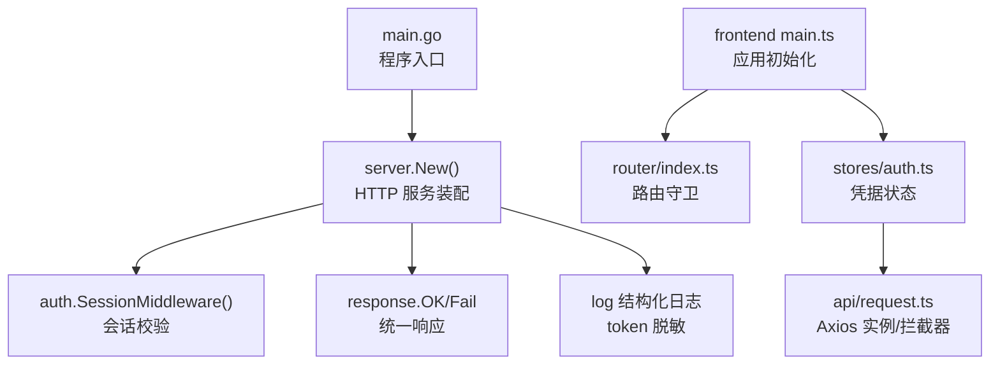
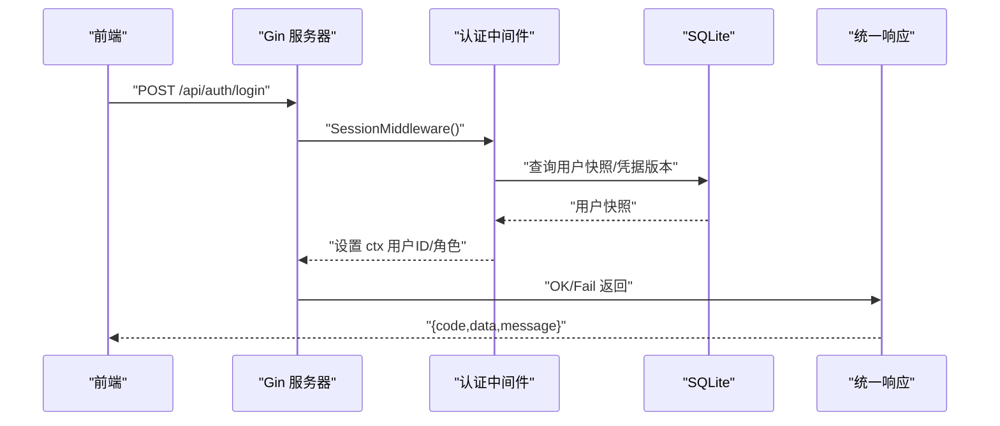
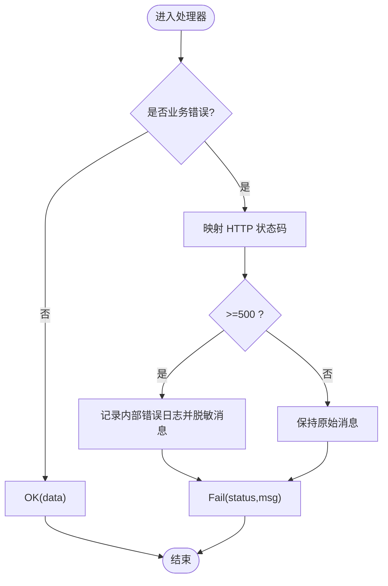
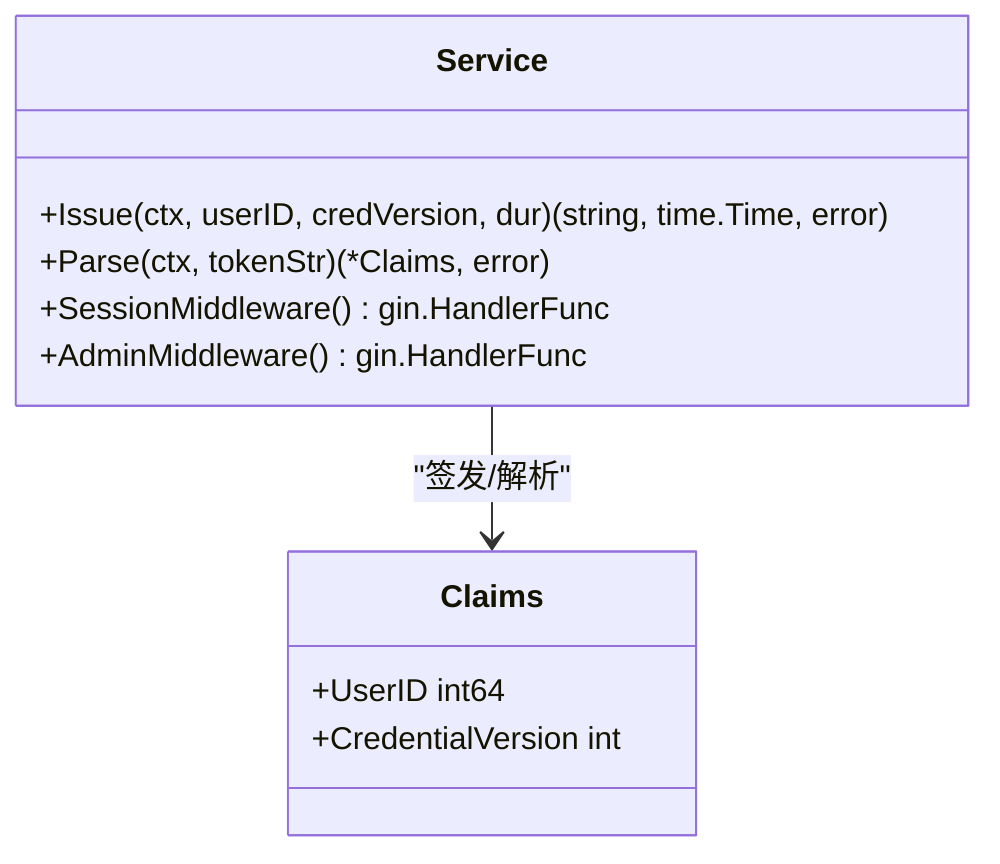
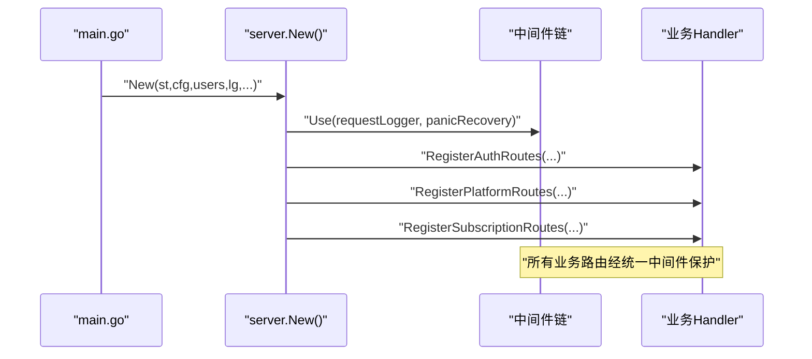
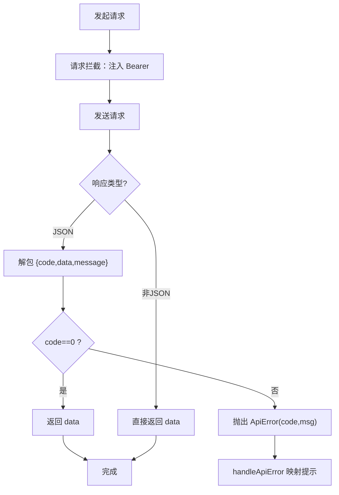
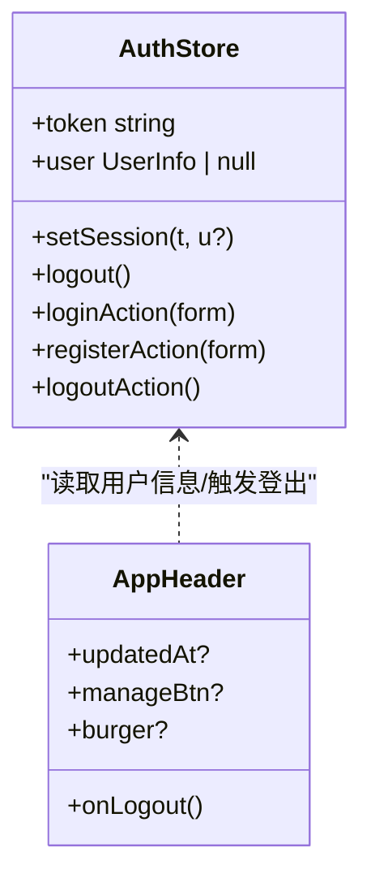
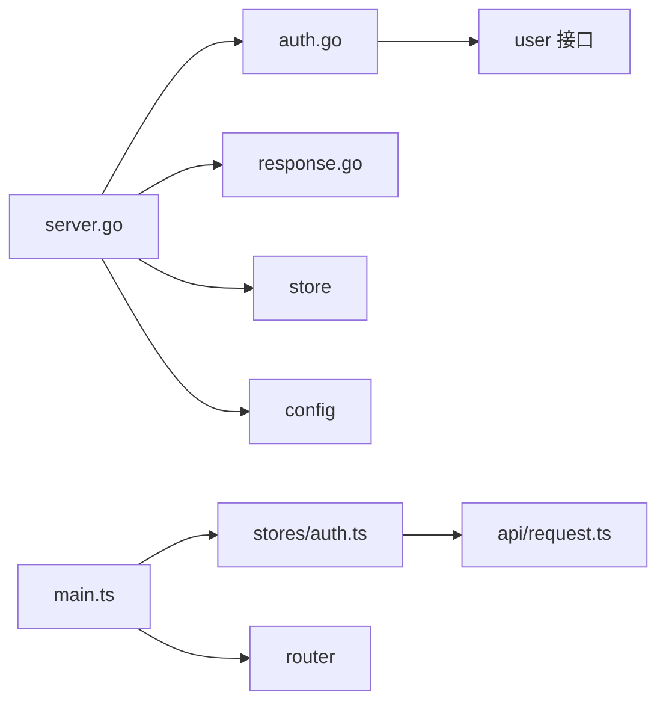

# 编码规范

<cite>
**本文引用的文件**
- [AGENTS.md](../../../../../AGENTS.md)
- [README.md](../../../../../README.md)
- [backend/go.mod](file://backend/go.mod)
- [backend/cmd/server/main.go](file://backend/cmd/server/main.go)
- [backend/internal/server/server.go](file://backend/internal/server/server.go)
- [backend/internal/response/response.go](file://backend/internal/response/response.go)
- [backend/internal/auth/auth.go](file://backend/internal/auth/auth.go)
- [frontend/package.json](file://frontend/package.json)
- [frontend/src/main.ts](file://frontend/src/main.ts)
- [frontend/src/api/request.ts](file://frontend/src/api/request.ts)
- [frontend/src/stores/auth.ts](file://frontend/src/stores/auth.ts)
- [frontend/src/components/AppHeader.vue](file://frontend/src/components/AppHeader.vue)
- [frontend/vite.config.ts](file://frontend/vite.config.ts)
</cite>

## 目录
1. [引言](#引言)
2. [项目结构](#项目结构)
3. [核心组件](#核心组件)
4. [架构总览](#架构总览)
5. [详细组件分析](#详细组件分析)
6. [依赖关系分析](#依赖关系分析)
7. [性能与并发注意事项](#性能与并发注意事项)
8. [故障排查指南](#故障排查指南)
9. [结论](#结论)
10. [附录：Git 与协作规范](#附录git-与协作规范)

## 引言
本规范面向后端 Go 与前端 TypeScript/Vue，统一命名、错误处理、并发、组件设计、状态管理、API 调用、格式化、注释、文件组织等实践；并给出代码审查清单、常见反模式避免方法以及 Git 提交、分支与 PR 流程。规范以仓库内既有实现为依据，确保“可执行、可验证、可演进”。

## 项目结构
- 后端采用 Go 单二进制 + Gin HTTP 服务，按业务域拆分处理器与服务，构造注入装配，统一响应与日志脱敏。
- 前端基于 Vue 3 + Vite + Ant Design Vue + Tailwind CSS，Pinia 状态管理，Axios 统一封装与拦截器。
- 构建与运行通过 Docker Compose 单容器部署，前后端一体化分发。

**图示来源**
- [backend/cmd/server/main.go:24-98](file://backend/cmd/server/main.go#L24-L98)
- [backend/internal/server/server.go:62-157](file://backend/internal/server/server.go#L62-L157)
- [backend/internal/response/response.go:14-50](file://backend/internal/response/response.go#L14-L50)
- [frontend/src/main.ts:1-11](file://frontend/src/main.ts#L1-L11)
- [frontend/src/stores/auth.ts:1-40](file://frontend/src/stores/auth.ts#L1-L40)
- [frontend/src/api/request.ts:1-89](file://frontend/src/api/request.ts#L1-L89)

**章节来源**
- [README.md:221-258](../../../../../README.md#L221-L258)
- [backend/cmd/server/main.go:24-98](file://backend/cmd/server/main.go#L24-L98)
- [frontend/src/main.ts:1-11](file://frontend/src/main.ts#L1-L11)

## 核心组件
- 后端
  - 统一响应：成功/失败/列表包裹结构，5xx 默认对外脱敏（调试模式可开启详情）。
  - 认证与会话：JWT HS256，凭据仅含用户 ID 与凭据版本；每次请求实时查库校验角色/状态。
  - 中间件：请求日志（方法/路径/状态/耗时）、panic 恢复、信任代理策略。
  - 服务装配：构造注入，禁止包级全局持有服务实例；按业务域拆分处理器。
- 前端
  - Axios 实例：统一 baseURL、超时、Bearer 注入、401 自动登出跳转。
  - 错误映射：将 HTTP 状态码映射为友好提示，集中处理 400/403/409/429/500。
  - 状态管理：Pinia 存储 token 与用户信息，提供登录/注册/登出 action。
  - 主题与布局：AntD 中文、暗色模式、响应式布局。

**章节来源**
- [backend/internal/response/response.go:14-50](file://backend/internal/response/response.go#L14-L50)
- [backend/internal/auth/auth.go:22-193](file://backend/internal/auth/auth.go#L22-L193)
- [backend/internal/server/server.go:62-157](file://backend/internal/server/server.go#L62-L157)
- [frontend/src/api/request.ts:1-89](file://frontend/src/api/request.ts#L1-L89)
- [frontend/src/stores/auth.ts:1-40](file://frontend/src/stores/auth.ts#L1-L40)

## 架构总览
后端以 Gin 为接入层，统一日志与响应；业务层按域拆分（认证、订阅、平台、规则、用户管理等），数据层通过 store 访问 SQLite；前端通过 Axios 与后端交互，Pinia 管理状态，Vue Router 控制页面与守卫。

**图示来源**
- [backend/internal/server/server.go:62-157](file://backend/internal/server/server.go#L62-L157)
- [backend/internal/auth/auth.go:144-193](file://backend/internal/auth/auth.go#L144-L193)
- [backend/internal/response/response.go:35-50](file://backend/internal/response/response.go#L35-L50)

## 详细组件分析

### 后端：统一响应与错误码约定
- 成功响应使用 { code: 0, data }；列表响应使用 { code: 0, data: { list, total } }。
- 错误响应 { code: <httpStatus>, message }；5xx 默认对外脱敏为“服务器内部错误”，调试模式可返回详情。
- 下载类端点业务错误返回 200 + 纯文本注释块，不返回 JSON/HTML。

**图示来源**
- [backend/internal/response/response.go:35-50](file://backend/internal/response/response.go#L35-L50)

**章节来源**
- [backend/internal/response/response.go:14-50](file://backend/internal/response/response.go#L14-L50)
- [AGENTS.md:131-136](../../../../../AGENTS.md#L131-L136)

### 后端：认证与会话中间件
- JWT HS256 签发与解析；Claims 仅包含用户 ID 与凭据版本。
- SessionMiddleware：解析 Bearer → 验签 → 实时查库取用户快照 → 比对凭据版本与状态 → 设置上下文用户ID/角色。
- AdminMiddleware：叠加在会话校验之后，校验角色为 admin。

**图示来源**
- [backend/internal/auth/auth.go:66-193](file://backend/internal/auth/auth.go#L66-L193)

**章节来源**
- [backend/internal/auth/auth.go:22-193](file://backend/internal/auth/auth.go#L22-L193)

### 后端：HTTP 服务装配与中间件
- 使用 gin.New 避免默认 logger/recovery 绕过脱敏与统一响应。
- 全局中间件：请求日志（方法/路径/状态/耗时）、panic 恢复（转 500）。
- 构造注入装配各业务域 Handler，禁止包级全局变量持有服务实例。

**图示来源**
- [backend/cmd/server/main.go:24-98](file://backend/cmd/server/main.go#L24-L98)
- [backend/internal/server/server.go:62-157](file://backend/internal/server/server.go#L62-L157)

**章节来源**
- [backend/internal/server/server.go:62-157](file://backend/internal/server/server.go#L62-L157)

### 前端：Axios 封装与错误处理
- 统一 baseURL=/api，超时 15s；请求拦截自动携带 Authorization: Bearer <token>。
- 响应拦截解包统一结构；非 JSON 响应（预览/下载）原样返回；401 清除凭据并跳转登录。
- 错误码映射：400/403/409 提示错误，429 警告并支持 Retry-After，500 通用文案。

**图示来源**
- [frontend/src/api/request.ts:1-89](file://frontend/src/api/request.ts#L1-L89)

**章节来源**
- [frontend/src/api/request.ts:1-89](file://frontend/src/api/request.ts#L1-L89)

### 前端：状态管理与主题
- Pinia 存储 token 与用户信息；提供 setSession/logout/loginAction/registerAction。
- 主题：AntD 中文、主色科技蓝、暗色模式切换并持久化到 localStorage。
- 组件：AppHeader 展示站点名、组标签、用户名下拉、退出登录、暗色开关。

**图示来源**
- [frontend/src/stores/auth.ts:1-40](file://frontend/src/stores/auth.ts#L1-L40)
- [frontend/src/components/AppHeader.vue:1-66](file://frontend/src/components/AppHeader.vue#L1-L66)

**章节来源**
- [frontend/src/stores/auth.ts:1-40](file://frontend/src/stores/auth.ts#L1-L40)
- [frontend/src/components/AppHeader.vue:1-66](file://frontend/src/components/AppHeader.vue#L1-L66)

## 依赖关系分析
- 后端模块依赖：server 依赖 auth/config/store/log/response 等；auth 依赖 config/user 接口；response 独立以避免循环依赖。
- 前端依赖：main.ts 引入 Pinia 与 Router；stores 依赖 api；components 依赖 stores/theme。

**图示来源**
- [backend/internal/server/server.go:62-157](file://backend/internal/server/server.go#L62-L157)
- [backend/internal/auth/auth.go:82-96](file://backend/internal/auth/auth.go#L82-L96)
- [backend/internal/response/response.go:1-12](file://backend/internal/response/response.go#L1-L12)
- [frontend/src/main.ts:1-11](file://frontend/src/main.ts#L1-L11)
- [frontend/src/stores/auth.ts:1-40](file://frontend/src/stores/auth.ts#L1-L40)
- [frontend/src/api/request.ts:1-89](file://frontend/src/api/request.ts#L1-L89)

**章节来源**
- [backend/go.mod:1-50](file://backend/go.mod#L1-L50)
- [frontend/package.json:1-37](file://frontend/package.json#L1-L37)

## 性能与并发注意事项
- 后端
  - 数据库：WAL 模式、外键启用、busy_timeout；迁移串行化，拒绝高版本启动。
  - 事务：先读后写场景使用 TxImmediate（BEGIN IMMEDIATE）保证原子性。
  - 日志：结构化输出，token 脱敏，避免散落 fmt.Println。
  - 中间件：panic 恢复统一 500，避免进程崩溃。
- 前端
  - 构建：不配置 manualChunks，避免 ant-design-vue 循环依赖导致白屏。
  - 网络：统一超时与重试策略（由业务决定），401 自动登出减少无效请求。
  - 渲染：路由级懒加载，关键列表三态（加载中/空/列表）。

**章节来源**
- [Build1.md:113-157](../../../../../docs/reports/Build/Build1.md#L113-L157)
- [Build1.md:228-350](../../../../../docs/reports/Build/Build1.md#L228-L350)
- [frontend/vite.config.ts:1-24](file://frontend/vite.config.ts#L1-L24)

## 故障排查指南
- 后端
  - 5xx 错误：查看日志中的“内部错误”字段，生产环境对外脱敏；调试模式可开启返回详情。
  - 认证失败：检查 Authorization 头格式、JWT 签名密钥是否存在、凭据版本是否一致。
  - 应急模式：当数据库损坏或关键配置缺失时进入应急模式，仅暴露系统状态/站点信息/应急端点。
- 前端
  - 401 跳转：确认本地 token 存在且未过期；检查后端鉴权中间件与路由守卫。
  - 白屏问题：避免手动分包 antd；检查 vite 配置与 rollup 自动分割。
  - 主题异常：确认 dark 类名与 localStorage 同步。

**章节来源**
- [backend/internal/response/response.go:27-50](file://backend/internal/response/response.go#L27-L50)
- [backend/internal/auth/auth.go:144-193](file://backend/internal/auth/auth.go#L144-L193)
- [backend/internal/server/server.go:160-193](file://backend/internal/server/server.go#L160-L193)
- [frontend/src/api/request.ts:16-43](file://frontend/src/api/request.ts#L16-L43)
- [frontend/vite.config.ts:16-23](file://frontend/vite.config.ts#L16-L23)

## 结论
本规范以仓库现有实现为基础，明确了后端 Go 与前端的统一约定与实践，涵盖命名、错误处理、并发、组件设计、状态管理、API 调用、格式化、注释与文件组织，并提供审查清单与反模式规避建议。遵循本规范可提升代码一致性、可维护性与安全性。

## 附录：Git 与协作规范
- 提交信息规范
  - 格式：<类型>(<范围>): <简述>
  - 类型：feat/fix/docs/style/refactor/perf/test/build/ci/chore/revert
  - 范围：如 backend/frontend/auth/server/stores/router
  - 示例：feat(backend): 新增管理员审批中心
- 分支命名约定
  - feature/<功能描述>
  - fix/<问题描述>
  - docs/<文档更新>
  - refactor/<重构>
  - perf/<性能优化>
  - test/<测试相关>
  - build/<构建脚本>
  - ci/<CI 配置>
  - chore/<杂项>
  - revert/<回滚>
- Pull Request 流程
  - 创建 PR 前确保编译与测试通过（后端 go build/vet/test；前端 npm run build/test）。
  - 关联 Issue/Design 文档编号，说明变更影响与验证方式。
  - 至少一名 reviewer 审核通过后合并；涉及安全/权限的变更需额外审查。
  - 合并后更新相关文档（Design/Build/Issue）并保持同步。

[本节为通用协作规范，不直接引用具体代码文件]