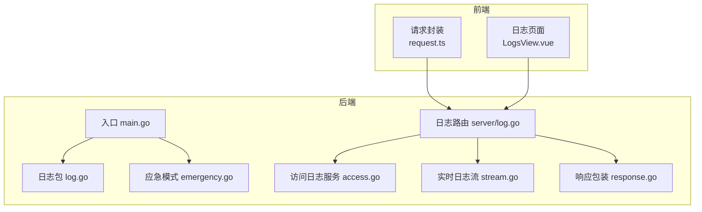
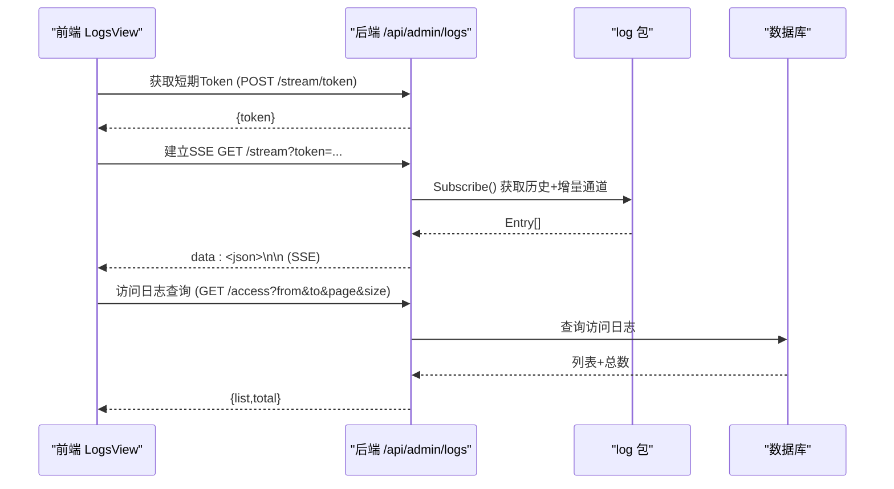
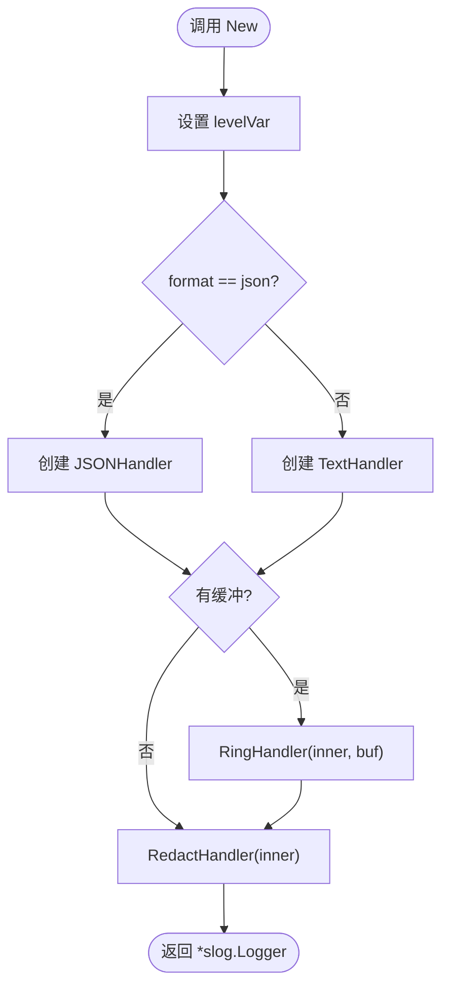
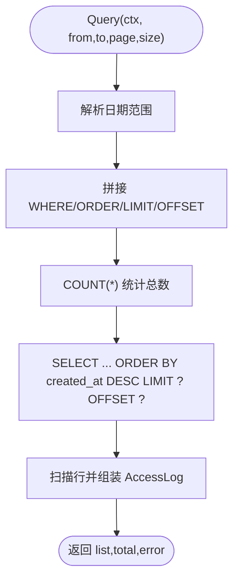
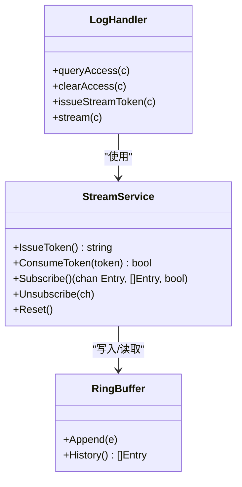
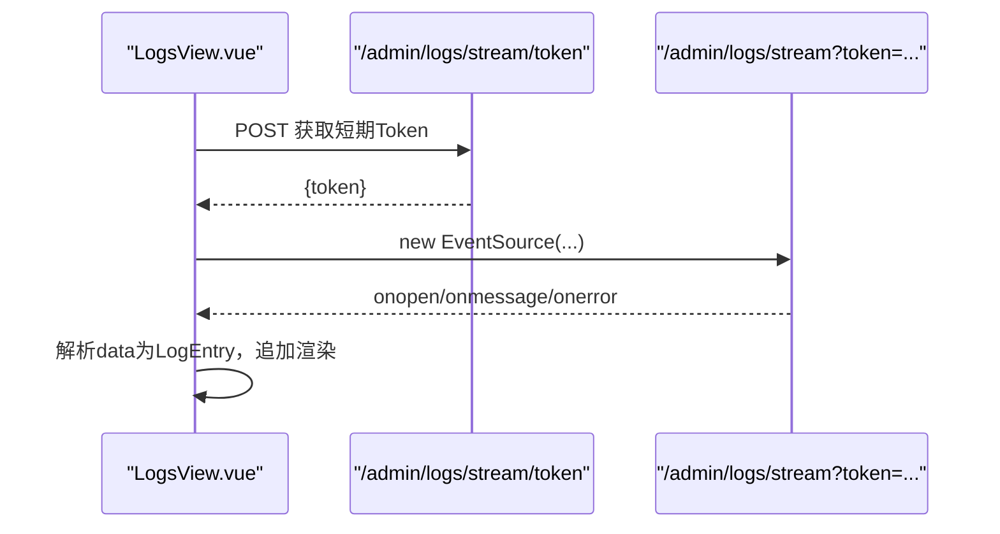
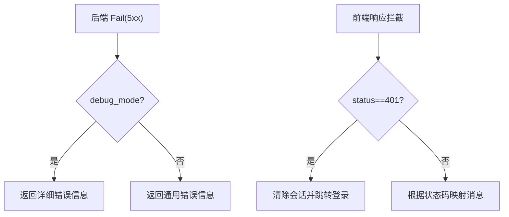
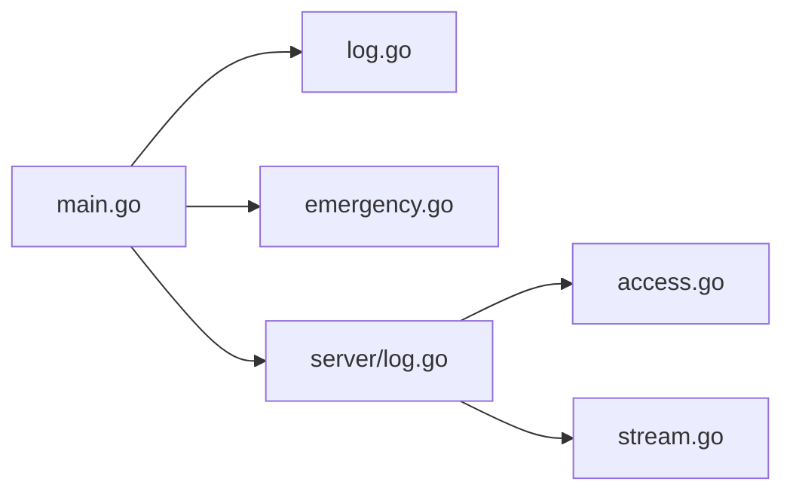
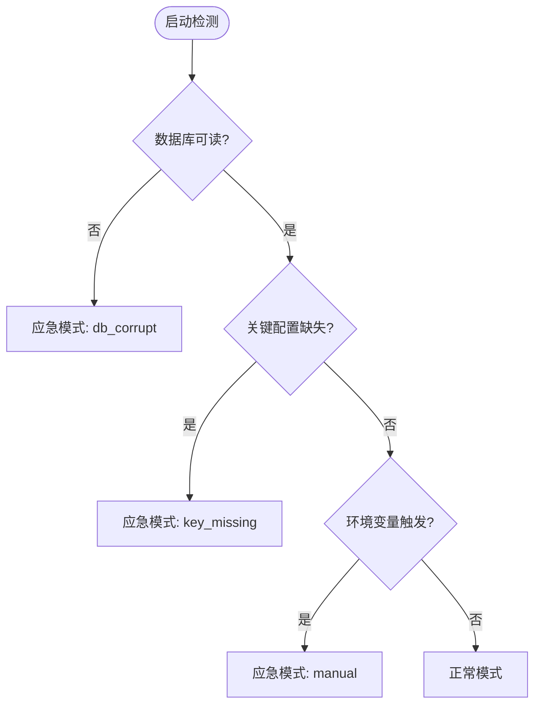

# 调试技巧

<cite>
**本文引用的文件**
- [backend/cmd/server/main.go](file://backend/cmd/server/main.go)
- [backend/internal/log/log.go](file://backend/internal/log/log.go)
- [backend/internal/log/access.go](file://backend/internal/log/access.go)
- [backend/internal/log/stream.go](file://backend/internal/log/stream.go)
- [backend/internal/server/log.go](file://backend/internal/server/log.go)
- [backend/internal/emergency/emergency.go](file://backend/internal/emergency/emergency.go)
- [backend/internal/response/response.go](file://backend/internal/response/response.go)
- [frontend/src/api/request.ts](file://frontend/src/api/request.ts)
- [frontend/src/api/log.ts](file://frontend/src/api/log.ts)
- [frontend/src/views/admin/LogsView.vue](file://frontend/src/views/admin/LogsView.vue)
</cite>

## 目录
1. [简介](#简介)
2. [项目结构](#项目结构)
3. [核心组件](#核心组件)
4. [架构总览](#架构总览)
5. [详细组件分析](#详细组件分析)
6. [依赖关系分析](#依赖关系分析)
7. [性能与可观测性](#性能与可观测性)
8. [故障排查指南](#故障排查指南)
9. [生产环境调试与应急处理](#生产环境调试与应急处理)
10. [结论](#结论)

## 简介
本文件面向该项目的后端 Go 服务与前端 Vue 应用，提供系统化的调试方法与故障排查技巧。内容覆盖：
- 后端日志体系、运行时级别切换、SSE 实时日志流、访问日志查询与清理
- 前端请求拦截、错误映射、网络请求调试
- 常见问题诊断流程、并发与内存相关注意事项
- 生产环境调试技巧与应急恢复方案

## 项目结构
本项目采用前后端分离架构：
- 后端 Go（Gin）提供 REST API、访问日志、实时日志流（SSE）、应急模式等能力
- 前端 Vue（Vite + Ant Design Vue）提供管理面板，包含访问日志查看与实时日志流页面

图表来源
- [backend/cmd/server/main.go:24-98](file://backend/cmd/server/main.go#L24-L98)
- [backend/internal/log/log.go:40-57](file://backend/internal/log/log.go#L40-L57)
- [backend/internal/log/access.go:16-41](file://backend/internal/log/access.go#L16-L41)
- [backend/internal/log/stream.go:117-128](file://backend/internal/log/stream.go#L117-L128)
- [backend/internal/server/log.go:21-30](file://backend/internal/server/log.go#L21-L30)
- [backend/internal/emergency/emergency.go:50-66](file://backend/internal/emergency/emergency.go#L50-L66)
- [backend/internal/response/response.go:27-45](file://backend/internal/response/response.go#L27-L45)

章节来源
- [backend/cmd/server/main.go:24-98](file://backend/cmd/server/main.go#L24-L98)
- [backend/internal/log/log.go:40-57](file://backend/internal/log/log.go#L40-L57)
- [backend/internal/log/access.go:16-41](file://backend/internal/log/access.go#L16-L41)
- [backend/internal/log/stream.go:117-128](file://backend/internal/log/stream.go#L117-L128)
- [backend/internal/server/log.go:21-30](file://backend/internal/server/log.go#L21-L30)
- [backend/internal/emergency/emergency.go:50-66](file://backend/internal/emergency/emergency.go#L50-L66)
- [backend/internal/response/response.go:27-45](file://backend/internal/response/response.go#L27-L45)

## 核心组件
- 结构化日志与脱敏：统一输出 stdout，支持 console/JSON 双格式；token 参数自动脱敏；支持运行时切换日志级别
- 访问日志：按日期范围分页查询、清空；记录下载类型、平台、资源标识、状态与失败原因
- 实时日志流：环形缓冲最近 500 条；一次性短期 Token 鉴权；全局 SSE 连接上限；历史+增量推送
- 前端日志查看：双页签（访问日志/实时日志流），支持暂停、过滤、重连与连接数超限提示
- 响应调试：可选 debug_mode 开关控制 5xx 是否返回详细内部信息（生产默认关闭）

章节来源
- [backend/internal/log/log.go:21-57](file://backend/internal/log/log.go#L21-L57)
- [backend/internal/log/access.go:41-101](file://backend/internal/log/access.go#L41-L101)
- [backend/internal/log/stream.go:16-20,30-65,117-180:16-20](file://backend/internal/log/stream.go#L16-L20)
- [backend/internal/server/log.go:32-103](file://backend/internal/server/log.go#L32-L103)
- [frontend/src/views/admin/LogsView.vue:66-146](file://frontend/src/views/admin/LogsView.vue#L66-L146)
- [backend/internal/response/response.go:27-45](file://backend/internal/response/response.go#L27-L45)

## 架构总览
后端启动时初始化日志、数据库迁移、版本自检、注册路由并启动 HTTP 服务；异常或关键配置损坏时进入应急模式，仅暴露最小可用能力。前端通过 Axios 实例统一发起请求，并在 401 时跳转登录；日志页面通过 SSE 订阅实时日志。

图表来源
- [backend/internal/server/log.go:21-30,63-103:21-30](file://backend/internal/server/log.go#L21-L30)
- [backend/internal/log/stream.go:166-180](file://backend/internal/log/stream.go#L166-L180)
- [backend/internal/log/access.go:41-92](file://backend/internal/log/access.go#L41-L92)
- [frontend/src/views/admin/LogsView.vue:80-115](file://frontend/src/views/admin/LogsView.vue#L80-L115)

## 详细组件分析

### 后端日志子系统（结构化日志、脱敏、运行时级别切换）
- 提供 New(level, format, buf?) 构建 logger，支持 JSON/文本输出到 stdout
- RedactHandler 对消息与字符串属性中的 token 查询参数进行脱敏
- SetLevel 运行时切换日志级别，立即生效（debug/info/warn/error）
- 支持接入 RingBuffer，将日志同时写入内存缓冲供 SSE 使用

图表来源
- [backend/internal/log/log.go:40-57](file://backend/internal/log/log.go#L40-L57)
- [backend/internal/log/log.go:62-117](file://backend/internal/log/log.go#L62-L117)

章节来源
- [backend/internal/log/log.go:21-57](file://backend/internal/log/log.go#L21-L57)
- [backend/internal/log/log.go:62-117](file://backend/internal/log/log.go#L62-L117)

### 访问日志服务（查询与清空）
- 支持 from/to 日期范围与 page/size 分页
- 统计总数与分页查询，空结果返回空数组而非 null
- 清空操作记录告警日志

图表来源
- [backend/internal/log/access.go:41-92](file://backend/internal/log/access.go#L41-L92)

章节来源
- [backend/internal/log/access.go:41-101](file://backend/internal/log/access.go#L41-L101)

### 实时日志流（SSE）
- 环形缓冲容量 500，满后覆盖最旧；定期紧凑化防止内存膨胀
- 一次性短期 Token（≥128 位，TTL 5 分钟，用后即删）
- 全局 SSE 连接上限 8；连接断开自动清理
- 先推历史再推增量，EventSource onopen 即时触发

图表来源
- [backend/internal/log/stream.go:16-65,117-208:16-65](file://backend/internal/log/stream.go#L16-L65)
- [backend/internal/server/log.go:53-103](file://backend/internal/server/log.go#L53-L103)

章节来源
- [backend/internal/log/stream.go:16-65,117-208:16-65](file://backend/internal/log/stream.go#L16-L65)
- [backend/internal/server/log.go:53-103](file://backend/internal/server/log.go#L53-L103)

### 前端日志查看页面（访问日志与 SSE 实时流）
- 访问日志：日期范围筛选、分页、清空确认
- 实时日志流：自动换取短期 Token，建立 EventSource；支持暂停、级别过滤、清屏；断线重连与连接数超限提示

图表来源
- [frontend/src/views/admin/LogsView.vue:80-146](file://frontend/src/views/admin/LogsView.vue#L80-L146)
- [frontend/src/api/log.ts:24-29](file://frontend/src/api/log.ts#L24-L29)

章节来源
- [frontend/src/views/admin/LogsView.vue:11-146](file://frontend/src/views/admin/LogsView.vue#L11-L146)
- [frontend/src/api/log.ts:24-29](file://frontend/src/api/log.ts#L24-L29)

### 响应调试与错误映射
- 后端可通过 debug_mode 控制 5xx 是否返回详细内部信息（生产默认关闭）
- 前端 Axios 拦截器统一解包、401 跳转登录、错误码→用户友好文案

图表来源
- [backend/internal/response/response.go:27-45](file://backend/internal/response/response.go#L27-L45)
- [frontend/src/api/request.ts:16-54](file://frontend/src/api/request.ts#L16-L54)

章节来源
- [backend/internal/response/response.go:27-45](file://backend/internal/response/response.go#L27-L45)
- [frontend/src/api/request.ts:16-54](file://frontend/src/api/request.ts#L16-L54)

## 依赖关系分析
- 入口 main.go 负责环境变量解析、日志初始化、数据库迁移、版本自检、服务装配与优雅退出
- 日志包被服务器路由引用，访问日志服务依赖 sql.DB，避免循环依赖
- 应急模式在启动阶段检测数据库可读性与关键配置，必要时降级运行

图表来源
- [backend/cmd/server/main.go:24-98](file://backend/cmd/server/main.go#L24-L98)
- [backend/internal/server/log.go:21-30](file://backend/internal/server/log.go#L21-L30)
- [backend/internal/log/access.go:16-25](file://backend/internal/log/access.go#L16-L25)
- [backend/internal/log/stream.go:117-128](file://backend/internal/log/stream.go#L117-L128)

章节来源
- [backend/cmd/server/main.go:24-98](file://backend/cmd/server/main.go#L24-L98)
- [backend/internal/server/log.go:21-30](file://backend/internal/server/log.go#L21-L30)

## 性能与可观测性
- 日志级别：支持运行时切换（debug/info/warn/error），便于问题定位与性能影响控制
- 访问日志：后端分页限制 size≤100，避免大结果集拖慢查询
- 实时日志流：环形缓冲固定容量，消费慢则丢弃事件，防止阻塞日志管道；全局 SSE 连接上限 8
- 前端渲染：实时日志最多保留 1000 条，避免 DOM 过大导致卡顿
- 响应调试：生产环境建议关闭 debug_mode，减少敏感信息泄露风险

章节来源
- [backend/internal/log/log.go:21-33](file://backend/internal/log/log.go#L21-L33)
- [backend/internal/log/access.go:41-48](file://backend/internal/log/access.go#L41-L48)
- [backend/internal/log/stream.go:16-20,41-58,166-180:16-20](file://backend/internal/log/stream.go#L16-L20)
- [frontend/src/views/admin/LogsView.vue:89-96](file://frontend/src/views/admin/LogsView.vue#L89-L96)
- [backend/internal/response/response.go:27-45](file://backend/internal/response/response.go#L27-L45)

## 故障排查指南

### 后端 Go 程序调试
- 本地开发
  - 使用 Delve 附加进程或启动调试：go build 后 dlv debug ./cmd/server
  - 结合日志级别设置为 debug，观察结构化日志与脱敏后的 token
  - 通过环境变量 LOG_LEVEL、LOG_FORMAT 控制输出
- 日志分析
  - 关注 error/warn 级别；利用访问日志快速定位下载失败原因
  - 使用 SSE 实时日志流观察问题发生时的上下文
- 数据库与迁移
  - 若迁移失败或数据库损坏，服务会自动进入应急模式，仅暴露最小能力
  - 检查应急模式触发原因与操作码（生成于运行日志）

章节来源
- [backend/cmd/server/main.go:39-59](file://backend/cmd/server/main.go#L39-L59)
- [backend/internal/log/log.go:21-33](file://backend/internal/log/log.go#L21-L33)
- [backend/internal/log/access.go:41-101](file://backend/internal/log/access.go#L41-L101)
- [backend/internal/emergency/emergency.go:50-86](file://backend/internal/emergency/emergency.go#L50-L86)

### 前端 Vue 应用调试
- 浏览器开发者工具
  - Network 面板：查看 /api 请求的 URL、请求头、响应体与耗时
  - Console 面板：查看前端警告与错误（如 401 诊断日志）
  - Sources 面板：断点调试 Vue 组件逻辑
- Vue DevTools
  - 检查组件状态、路由与 Vuex/Pinia 存储（本项目使用 stores）
- 网络请求调试
  - 使用 request.ts 的拦截器：401 自动跳转登录；错误码映射为用户友好文案
  - 对于非 JSON 响应（预览/下载），拦截器会原样返回，避免破坏响应体

章节来源
- [frontend/src/api/request.ts:9-43](file://frontend/src/api/request.ts#L9-L43)
- [frontend/src/views/admin/LogsView.vue:80-115](file://frontend/src/views/admin/LogsView.vue#L80-L115)

### 日志记录最佳实践
- 使用结构化日志，附带关键上下文（用户、平台、资源标识、IP、状态、失败原因）
- 开启 token 脱敏，避免敏感信息泄露
- 合理设置日志级别：开发 debug，生产 info；按需临时提升级别定位问题
- 访问日志用于追踪下载行为与失败原因；实时日志用于问题复现与根因分析

章节来源
- [backend/internal/log/access.go:27-39](file://backend/internal/log/access.go#L27-L39)
- [backend/internal/log/log.go:62-117](file://backend/internal/log/log.go#L62-L117)

### 错误追踪方法
- 后端：统一 Fail 响应，结合 debug_mode 控制是否返回详细错误；SSE 实时日志流辅助定位
- 前端：Axios 拦截器统一错误处理，401 自动登出并跳转；错误码映射到用户可见文案

章节来源
- [backend/internal/response/response.go:27-45](file://backend/internal/response/response.go#L27-L45)
- [frontend/src/api/request.ts:16-54](file://frontend/src/api/request.ts#L16-L54)

### 性能分析方法
- 后端
  - 降低日志级别以减少 I/O 开销
  - 访问日志分页查询限制 size≤100
  - SSE 连接上限保护服务端资源
- 前端
  - 实时日志渲染上限 1000 条，避免 DOM 过大
  - 暂停功能减少高频渲染压力

章节来源
- [backend/internal/log/access.go:41-48](file://backend/internal/log/access.go#L41-L48)
- [backend/internal/log/stream.go:16-20](file://backend/internal/log/stream.go#L16-L20)
- [frontend/src/views/admin/LogsView.vue:89-96](file://frontend/src/views/admin/LogsView.vue#L89-L96)

### 常见问题诊断流程
- 无法登录/频繁 401
  - 检查前端拦截器与路由跳转逻辑
  - 核对后端会话中间件与管理员权限校验
- 下载失败
  - 通过访问日志查看 download_type、platform、resource_slug、status、fail_reason
  - 结合实时日志观察具体错误上下文
- SSE 连接失败或频繁重连
  - 检查短期 Token 是否有效（一次性、TTL 5 分钟）
  - 注意连接数上限 8，过多连接会被拒绝
  - 前端已实现断线重连与超限提示

章节来源
- [frontend/src/api/request.ts:16-43](file://frontend/src/api/request.ts#L16-L43)
- [backend/internal/log/access.go:41-92](file://backend/internal/log/access.go#L41-L92)
- [backend/internal/log/stream.go:130-180](file://backend/internal/log/stream.go#L130-L180)
- [frontend/src/views/admin/LogsView.vue:99-115](file://frontend/src/views/admin/LogsView.vue#L99-L115)

### 内存泄漏检测
- 后端
  - 环形缓冲容量固定，消费慢时丢弃事件，避免阻塞；超过阈值会紧凑化切片，防止内存缓慢增长
  - 连接断开时自动清理订阅与通道，释放内存
- 前端
  - 实时日志最多保留 1000 条，避免数组无限增长
  - 离开页签时关闭 EventSource，避免悬挂连接

章节来源
- [backend/internal/log/stream.go:41-65,182-191:41-65](file://backend/internal/log/stream.go#L41-L65)
- [frontend/src/views/admin/LogsView.vue:89-96,117-122:89-96](file://frontend/src/views/admin/LogsView.vue#L89-L96)

### 并发问题排查
- SSE 连接上限 8，超过即拒绝并提示；多客户端同时打开日志页需协调
- 环形缓冲广播为非阻塞，消费者慢不影响生产者；但可能导致事件丢失，适合“尽力而为”的实时场景
- 访问日志查询使用分页与排序，避免全表扫描

章节来源
- [backend/internal/log/stream.go:16-20,166-180:16-20](file://backend/internal/log/stream.go#L16-L20)
- [backend/internal/log/access.go:41-92](file://backend/internal/log/access.go#L41-L92)

## 生产环境调试与应急处理

### 生产环境调试技巧
- 日志级别：默认 info，必要时临时提升至 debug 定位问题，完成后恢复
- 响应调试：生产环境保持 debug_mode 关闭，避免泄露内部细节
- 访问日志：定期导出与分析，识别异常下载与失败原因
- 实时日志：通过 SSE 观察线上问题，注意连接数上限与 Token 有效期

章节来源
- [backend/internal/log/log.go:21-33](file://backend/internal/log/log.go#L21-L33)
- [backend/internal/response/response.go:27-45](file://backend/internal/response/response.go#L27-L45)
- [backend/internal/log/stream.go:16-20,130-180:16-20](file://backend/internal/log/stream.go#L16-L20)

### 应急处理方案
- 触发条件：数据库损坏/不可读、关键配置缺失、手动环境变量触发
- 能力分级：根据数据库可读性提供不同能力（重置密码/重新初始化）
- 操作码：一次性操作码生成于运行日志，每次提交后失效并重新生成
- 重新初始化：可清空数据并重建空库，重启后进入 Setup

图表来源
- [backend/internal/emergency/emergency.go:50-66](file://backend/internal/emergency/emergency.go#L50-L66)

章节来源
- [backend/internal/emergency/emergency.go:50-86](file://backend/internal/emergency/emergency.go#L50-L86)
- [backend/internal/emergency/emergency.go:108-213](file://backend/internal/emergency/emergency.go#L108-L213)

## 结论
本项目提供了完善的日志与可观测性能力：结构化日志、访问日志、实时日志流与前端可视化界面，配合响应调试与应急模式，能够高效定位与解决问题。建议在开发与测试阶段充分利用 SSE 与访问日志，在生产环境谨慎调整日志级别与调试选项，确保稳定性与安全。