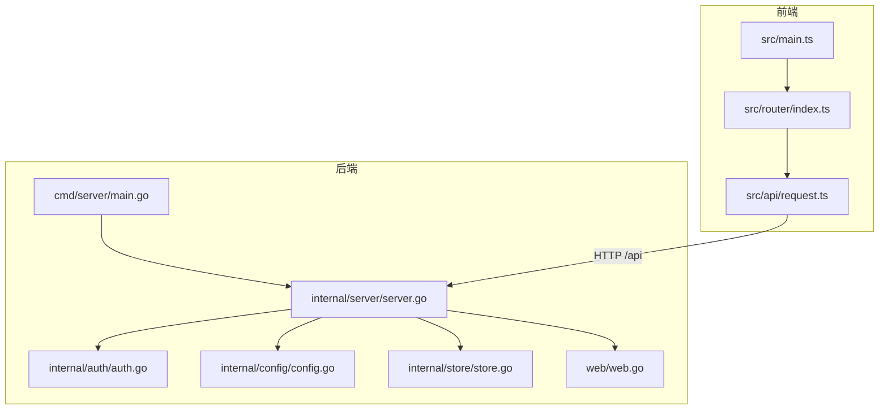
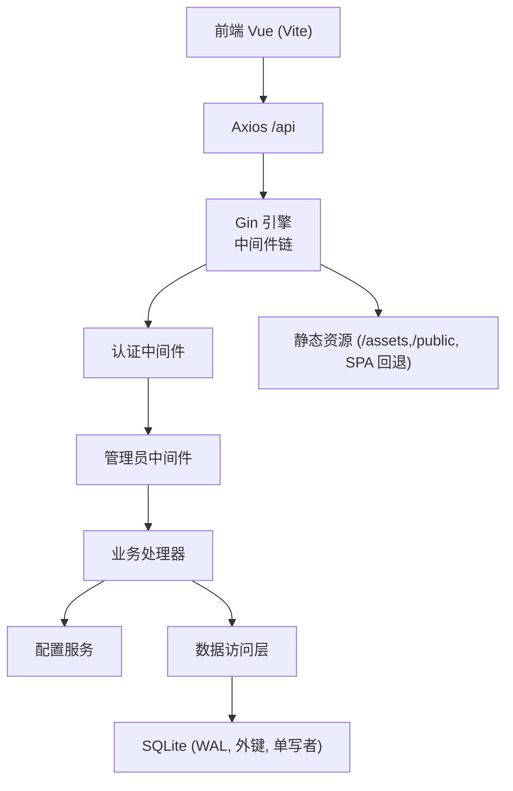
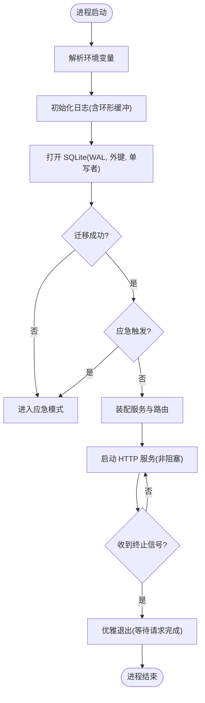
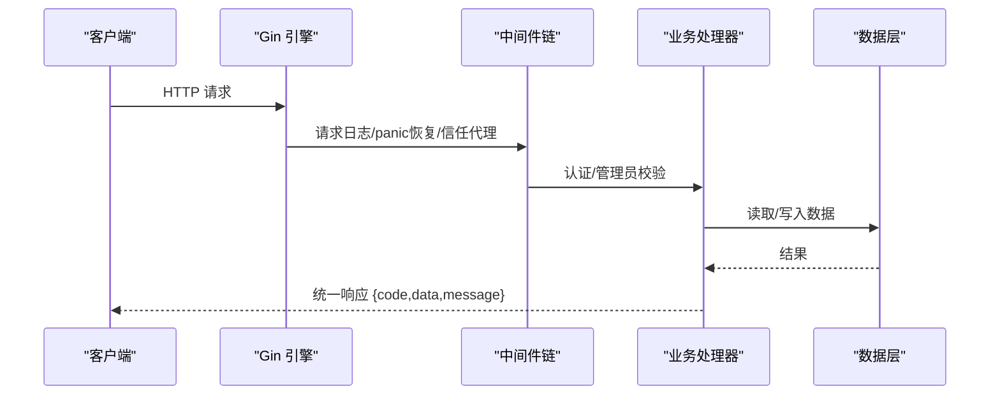
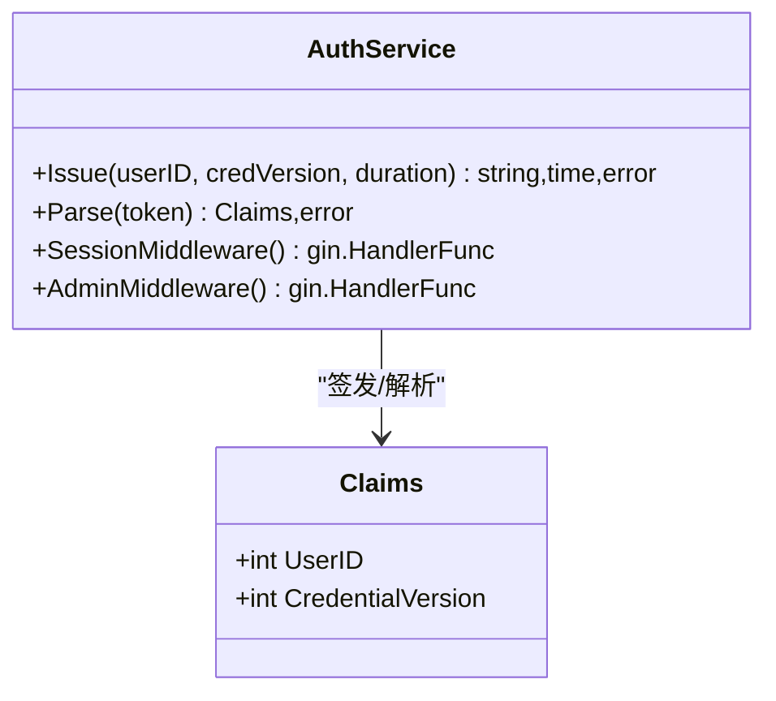
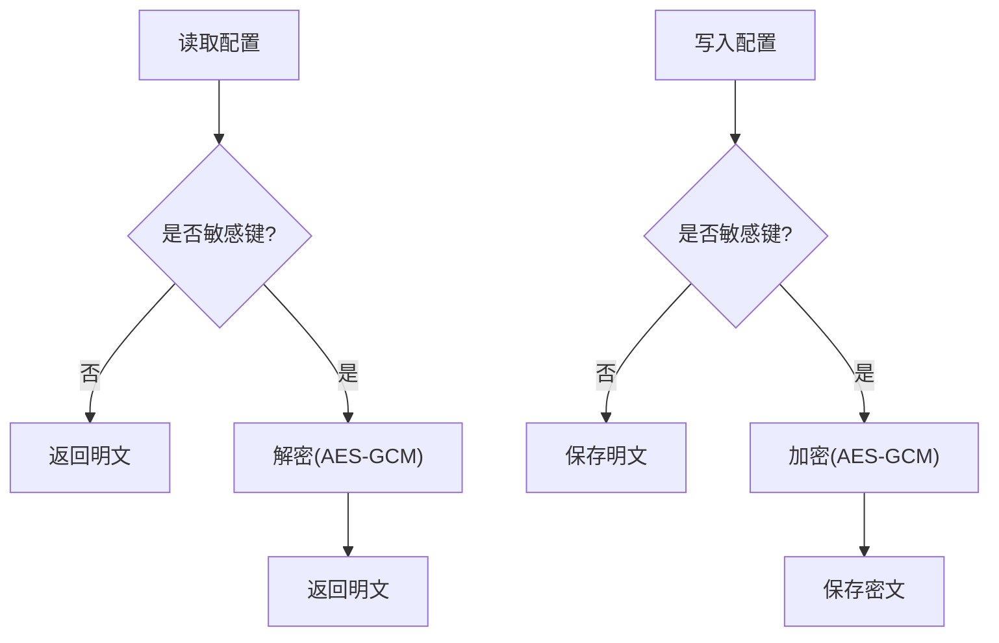
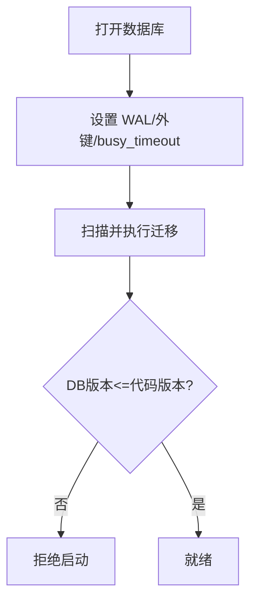
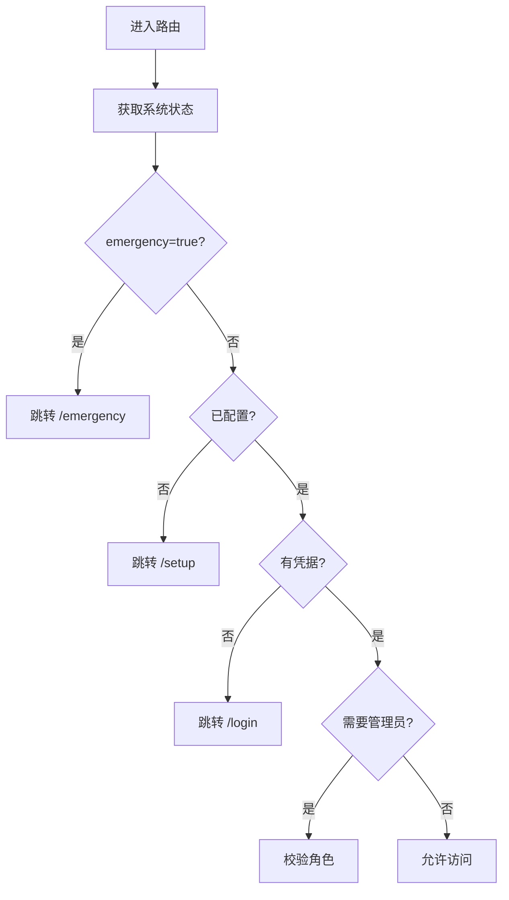
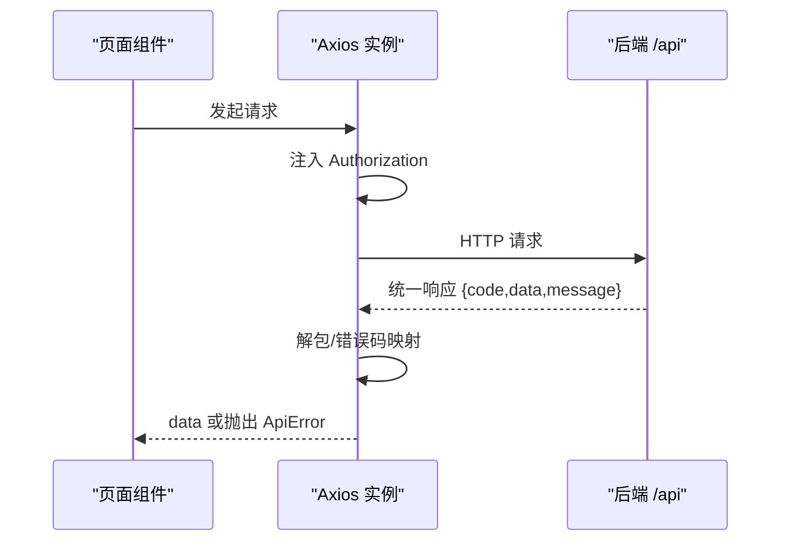
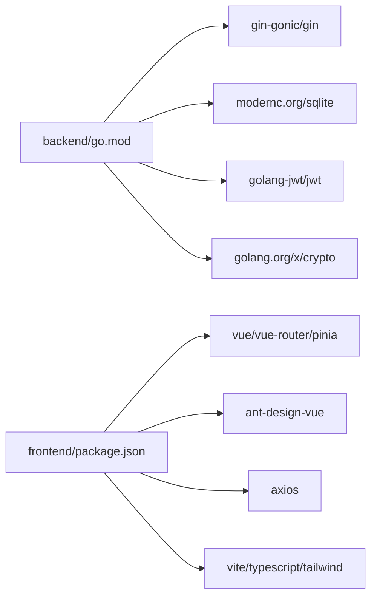

# 项目结构说明

<cite>
**本文引用的文件**
- [backend/cmd/server/main.go](file://backend/cmd/server/main.go)
- [backend/internal/server/server.go](file://backend/internal/server/server.go)
- [backend/internal/auth/auth.go](file://backend/internal/auth/auth.go)
- [backend/internal/config/config.go](file://backend/internal/config/config.go)
- [backend/internal/store/store.go](file://backend/internal/store/store.go)
- [backend/web/web.go](file://backend/web/web.go)
- [frontend/src/main.ts](file://frontend/src/main.ts)
- [frontend/src/router/index.ts](file://frontend/src/router/index.ts)
- [frontend/src/api/request.ts](file://frontend/src/api/request.ts)
- [frontend/vite.config.ts](file://frontend/vite.config.ts)
- [backend/go.mod](file://backend/go.mod)
- [frontend/package.json](file://frontend/package.json)
</cite>

## 目录
1. [简介](#简介)
2. [项目结构](#项目结构)
3. [核心组件](#核心组件)
4. [架构总览](#架构总览)
5. [详细组件分析](#详细组件分析)
6. [依赖关系分析](#依赖关系分析)
7. [性能与可靠性](#性能与可靠性)
8. [故障排查指南](#故障排查指南)
9. [结论](#结论)
10. [附录：前后端交互约定](#附录前后端交互约定)

## 简介
本项目是一个“VPN 订阅管理”系统，采用前后端分离架构：
- 后端使用 Go（Gin）提供 RESTful API、静态资源服务、中间件机制、统一响应格式、配置加密存储、SQLite 数据层与版本化迁移。
- 前端使用 Vue 3 + TypeScript + Vite，通过 Axios 调用后端 /api，具备路由守卫、状态管理与错误处理。

本说明聚焦于整体架构、目录组织、模块职责划分、前后端交互方式、静态资源管理、中间件机制以及代码组织最佳实践。

## 项目结构
- 后端（backend）
  - cmd/server：程序入口，负责环境变量解析、日志初始化、数据库迁移、服务装配与优雅退出。
  - internal：业务域与通用能力按包拆分，如 auth、config、store、server、user、subscription、rule、share、custom、approval、mail、log、version、token、group、platform、setup、oidc、captcha、ratelimit、response、backup、dataclear、emergency、download、slug、cron 等。
  - migrations：嵌入的 SQL 迁移脚本，启动时自动执行。
  - web：嵌入前端构建产物（dist），用于生产环境单二进制分发。
- 前端（frontend）
  - src：Vue 应用源码，包含 api、components、layouts、router、stores、utils、views 等。
  - public：静态资源（可被后端代理或内嵌）。
  - 配置文件：vite.config.ts、package.json、tailwind/postcss/tsconfig 等。

图表来源
- [backend/cmd/server/main.go:24-98](file://backend/cmd/server/main.go#L24-L98)
- [backend/internal/server/server.go:63-157](file://backend/internal/server/server.go#L63-L157)
- [backend/internal/auth/auth.go:144-192](file://backend/internal/auth/auth.go#L144-L192)
- [backend/internal/config/config.go:48-111](file://backend/internal/config/config.go#L48-L111)
- [backend/internal/store/store.go:32-60](file://backend/internal/store/store.go#L32-L60)
- [backend/web/web.go:6-7](file://backend/web/web.go#L6-L7)
- [frontend/src/main.ts:7-10](file://frontend/src/main.ts#L7-L10)
- [frontend/src/router/index.ts:72-128](file://frontend/src/router/index.ts#L72-L128)
- [frontend/src/api/request.ts:7-43](file://frontend/src/api/request.ts#L7-L43)

章节来源
- [backend/cmd/server/main.go:24-98](file://backend/cmd/server/main.go#L24-L98)
- [backend/internal/server/server.go:63-157](file://backend/internal/server/server.go#L63-L157)
- [frontend/src/main.ts:7-10](file://frontend/src/main.ts#L7-L10)
- [frontend/src/router/index.ts:72-128](file://frontend/src/router/index.ts#L72-L128)
- [frontend/src/api/request.ts:7-43](file://frontend/src/api/request.ts#L7-L43)

## 核心组件
- 程序入口与生命周期
  - main 负责环境变量解析、日志初始化、数据库打开与迁移、应急模式检测、服务装配与优雅退出。
- HTTP 服务与路由装配
  - server.New 构造 Gin 引擎，注册全局中间件（请求日志、panic 恢复）、健康检查、认证/管理员中间件、各业务域路由、静态资源与应急模式路由。
- 认证与会话
  - auth 提供密码哈希/校验、邮箱规范化、JWT 签发与解析、会话中间件与管理员角色中间件。
- 配置服务
  - config 提供基于 system_config 表的配置读写，敏感键 AES-GCM 加密存储，支持事务内读写与调试开关注入。
- 数据访问层
  - store 封装 SQLite（modernc/sqlite），WAL 模式、外键开启、单写者模型、版本化迁移框架、BEGIN IMMEDIATE 事务。
- 前端工程
  - Vue 3 + TS + Vite，Axios 统一拦截器处理 Bearer Token、401 跳转登录、统一错误码映射；路由守卫实现 emergency → configured → 登录态 → 管理员权限控制。

章节来源
- [backend/cmd/server/main.go:24-98](file://backend/cmd/server/main.go#L24-L98)
- [backend/internal/server/server.go:63-157](file://backend/internal/server/server.go#L63-L157)
- [backend/internal/auth/auth.go:22-192](file://backend/internal/auth/auth.go#L22-L192)
- [backend/internal/config/config.go:24-111](file://backend/internal/config/config.go#L24-L111)
- [backend/internal/store/store.go:32-60](file://backend/internal/store/store.go#L32-L60)
- [frontend/src/router/index.ts:96-128](file://frontend/src/router/index.ts#L96-L128)
- [frontend/src/api/request.ts:7-43](file://frontend/src/api/request.ts#L7-L43)

## 架构总览
后端采用分层设计：
- 接入层（server）：Gin 路由、中间件、静态资源、健康检查、应急模式。
- 业务层（auth、config、user、subscription、rule、share、custom、approval、mail、log、version、token、group、platform、setup、oidc、captcha、ratelimit、backup、dataclear、emergency、download 等）：按领域拆分，职责单一。
- 数据层（store）：SQLite 连接、迁移、事务、PRAGMA 设置。

前端采用模块化组织：
- 视图（views）：页面级组件。
- 路由（router）：路由表与守卫。
- 状态（stores）：Pinia 状态管理。
- API（api）：Axios 实例与接口封装。
- 组件（components）：通用 UI 组件。
- 布局（layouts）：页面布局。

图表来源
- [backend/internal/server/server.go:63-157](file://backend/internal/server/server.go#L63-L157)
- [backend/internal/auth/auth.go:144-192](file://backend/internal/auth/auth.go#L144-L192)
- [backend/internal/store/store.go:32-60](file://backend/internal/store/store.go#L32-L60)
- [frontend/src/api/request.ts:7-43](file://frontend/src/api/request.ts#L7-L43)

## 详细组件分析

### 后端：程序入口与生命周期
- 环境变量：APP_MODE、LOG_LEVEL、LOG_FORMAT、PORT、TRUST_PROXY、DATA_DIR、RESET_ADMIN_PASSWORD。
- 日志：环形缓冲 + 统一日志管道，SSE 实时流。
- 数据库：按模式选择 db 文件名，Open 失败进入应急模式；迁移失败进入应急模式。
- 应急模式：仅暴露系统状态、站点信息、应急端点与静态资源，业务 API 返回 503。
- 优雅退出：信号驱动，等待在途请求收尾。

图表来源
- [backend/cmd/server/main.go:24-98](file://backend/cmd/server/main.go#L24-L98)
- [backend/cmd/server/main.go:108-126](file://backend/cmd/server/main.go#L108-L126)

章节来源
- [backend/cmd/server/main.go:24-98](file://backend/cmd/server/main.go#L24-L98)
- [backend/cmd/server/main.go:108-126](file://backend/cmd/server/main.go#L108-L126)

### 后端：HTTP 服务与路由装配
- 中间件：请求日志（脱敏 token）、panic 恢复（统一 500）、信任代理策略（auto/on/off）。
- 认证与管理：SessionMiddleware、AdminMiddleware 组合保护管理端点。
- 业务域路由：平台、订阅、用户组、Token 下载、自定义订阅、分享订阅、规则、个人中心、用户管理、审批中心、面板配置、运维操作、日志查看。
- 静态资源：/assets、/public、SPA 回退。
- 应急模式：NewEmergency 仅注册必要端点与静态资源，/health 返回 503。

图表来源
- [backend/internal/server/server.go:63-157](file://backend/internal/server/server.go#L63-L157)
- [backend/internal/server/server.go:198-237](file://backend/internal/server/server.go#L198-L237)
- [backend/internal/response/response.go:14-50](file://backend/internal/response/response.go#L14-L50)

章节来源
- [backend/internal/server/server.go:63-157](file://backend/internal/server/server.go#L63-L157)
- [backend/internal/server/server.go:198-237](file://backend/internal/server/server.go#L198-L237)
- [backend/internal/response/response.go:14-50](file://backend/internal/response/response.go#L14-L50)

### 后端：认证与会话
- 密码：bcrypt 哈希与校验，最小长度校验。
- 邮箱：规范化（trim、小写、拒绝控制字符）。
- JWT：HS256，载荷仅含 user_id 与 credential_version；每次请求实时查库比对版本与状态。
- 中间件：SessionMiddleware 校验凭据并注入用户上下文；AdminMiddleware 校验角色。

图表来源
- [backend/internal/auth/auth.go:22-192](file://backend/internal/auth/auth.go#L22-L192)

章节来源
- [backend/internal/auth/auth.go:22-192](file://backend/internal/auth/auth.go#L22-L192)

### 后端：配置服务
- 配置键：configured、signing_key、log_level、app_mode、allow_local_login、allow_selfreg、selfreg_approval、admin_initialized、frontend_url、callback_url 等。
- 敏感键：AES-256-GCM 加密存储，密钥由 signing_key 经 HKDF 派生。
- 事务支持：GetTx/SetTx/EncryptWithTx，避免连接池死锁。
- 调试模式：SetDebugProvider 注入，5xx 返回详情（生产默认关闭）。

图表来源
- [backend/internal/config/config.go:24-111](file://backend/internal/config/config.go#L24-L111)
- [backend/internal/config/config.go:220-361](file://backend/internal/config/config.go#L220-L361)

章节来源
- [backend/internal/config/config.go:24-111](file://backend/internal/config/config.go#L24-L111)
- [backend/internal/config/config.go:220-361](file://backend/internal/config/config.go#L220-L361)

### 后端：数据访问层
- 连接：modernc.org/sqlite（纯 Go，零 CGO），WAL 模式、外键开启、busy_timeout=5s、单写者模型（MaxOpenConns=1）。
- 迁移：版本化迁移框架，按文件名排序执行未应用项，单条迁移与版本记录在同一事务内；数据库版本高于代码支持版本拒绝启动。
- 事务：TxImmediate 以 BEGIN IMMEDIATE 开启事务，读→判定→写全程串行化。

图表来源
- [backend/internal/store/store.go:32-60](file://backend/internal/store/store.go#L32-L60)
- [backend/internal/store/store.go:62-128](file://backend/internal/store/store.go#L62-L128)
- [backend/internal/store/store.go:147-164](file://backend/internal/store/store.go#L147-L164)

章节来源
- [backend/internal/store/store.go:32-60](file://backend/internal/store/store.go#L32-L60)
- [backend/internal/store/store.go:62-128](file://backend/internal/store/store.go#L62-L128)
- [backend/internal/store/store.go:147-164](file://backend/internal/store/store.go#L147-L164)

### 前端：路由与状态管理
- 路由守卫：emergency → configured → 登录态 → 管理员，顺序执行；公共路由白名单；懒加载路由。
- 状态：Pinia stores（auth、system）；系统状态获取失败不阻断，避免死循环。
- 进度条：轻量自实现顶部进度条。

图表来源
- [frontend/src/router/index.ts:96-128](file://frontend/src/router/index.ts#L96-L128)

章节来源
- [frontend/src/router/index.ts:96-128](file://frontend/src/router/index.ts#L96-L128)

### 前端：API 请求与错误处理
- Axios 实例：baseURL=/api，超时 15s。
- 请求拦截：自动携带 Bearer Token。
- 响应拦截：解包统一响应结构；非 JSON 响应原样返回；401 清除凭据并跳转登录；错误码映射为 UI 提示。
- 错误工具：handleApiError 统一错误展示。

图表来源
- [frontend/src/api/request.ts:7-43](file://frontend/src/api/request.ts#L7-L43)
- [frontend/src/api/request.ts:45-89](file://frontend/src/api/request.ts#L45-L89)

章节来源
- [frontend/src/api/request.ts:7-43](file://frontend/src/api/request.ts#L7-L43)
- [frontend/src/api/request.ts:45-89](file://frontend/src/api/request.ts#L45-L89)

### 静态资源管理
- 开发期：Vite 将 /api、/health、/public 代理到后端 8080，避免 SPA fallback 吞掉静态资源。
- 生产期：后端通过 web/web.go 嵌入前端 dist，提供 /assets、/public 与 SPA 回退。

章节来源
- [frontend/vite.config.ts:8-15](file://frontend/vite.config.ts#L8-L15)
- [backend/web/web.go:6-7](file://backend/web/web.go#L6-L7)

## 依赖关系分析
- 后端依赖
  - Gin 作为 Web 框架。
  - modernc.org/sqlite 作为嵌入式数据库。
  - golang-jwt/jwt 用于会话凭据。
  - golang.org/x/crypto 用于密码哈希与加密。
- 前端依赖
  - Vue 3、Vue Router、Pinia、Ant Design Vue、Axios、Dayjs、Markdown-it。
  - Vite、TypeScript、Tailwind、PostCSS、Vitest。

图表来源
- [backend/go.mod:5-10](file://backend/go.mod#L5-L10)
- [frontend/package.json:12-35](file://frontend/package.json#L12-L35)

章节来源
- [backend/go.mod:5-10](file://backend/go.mod#L5-L10)
- [frontend/package.json:12-35](file://frontend/package.json#L12-L35)

## 性能与可靠性
- 数据库
  - WAL 模式提升并发读性能；外键保证数据一致性；busy_timeout 降低忙冲突；单写者模型避免并发写竞争。
  - 迁移原子性：每条迁移与版本记录在同一事务内，失败即拒绝启动，防止半迁移状态。
- 中间件
  - 请求日志记录方法、路径、状态码、耗时；panic 恢复统一 500 响应并记录错误。
  - 信任代理策略支持 auto/on/off，适配不同部署环境。
- 认证与会话
  - JWT 仅携带必要字段，权限信息实时查库，避免缓存不一致；credential_version 支持凭据失效快速下线。
- 配置安全
  - 敏感配置 AES-GCM 加密存储，密钥由 signing_key 派生，防篡改。
- 前端
  - 路由懒加载减少首屏体积；统一错误处理提升用户体验；401 自动清理凭据并跳转登录。

[本节为通用指导，无需特定文件引用]

## 故障排查指南
- 启动失败
  - 数据库无法打开或迁移失败：自动进入应急模式，仅暴露系统状态与应急端点；检查 DATA_DIR 与 db 文件权限。
  - 信任代理配置错误：调整 TRUST_PROXY（auto/on/off）。
- 认证问题
  - 401 频繁出现：检查前端 Authorization 头注入与后端 SessionMiddleware；确认 signing_key 存在且一致。
  - 凭据版本不一致：修改密码或重置后需重新登录。
- 静态资源 404
  - 开发期确保 Vite 代理 /public 到后端；生产期确认 web/web.go 嵌入 dist。
- 日志与监控
  - 使用 SSE 实时查看日志；访问日志查询与清空；关注请求日志中的状态码与耗时。

章节来源
- [backend/cmd/server/main.go:24-98](file://backend/cmd/server/main.go#L24-L98)
- [backend/internal/server/server.go:198-237](file://backend/internal/server/server.go#L198-L237)
- [backend/internal/auth/auth.go:144-192](file://backend/internal/auth/auth.go#L144-L192)
- [frontend/src/api/request.ts:17-43](file://frontend/src/api/request.ts#L17-L43)
- [frontend/vite.config.ts:8-15](file://frontend/vite.config.ts#L8-L15)

## 结论
本项目采用清晰的分层架构与模块化组织：后端以 Gin 为核心，结合中间件、统一响应、配置加密与 SQLite 数据层；前端以 Vue 3 为基础，配合路由守卫与统一 API 处理。通过应急模式、版本化迁移与优雅退出保障系统可靠性。前后端通过 /api 进行 REST 交互，静态资源在开发与生产环境下分别通过代理与嵌入方式管理。遵循这些设计原则与最佳实践，可有效提升可维护性与扩展性。

[本节为总结性内容，无需特定文件引用]

## 附录：前后端交互约定
- 统一响应结构
  - 成功：{ code: 0, data: ... }
  - 失败：{ code: httpStatus, message: ... }
- 认证
  - 请求头：Authorization: Bearer <token>
  - 401：前端自动清理凭据并跳转登录
- 错误码
  - 400 输入校验失败
  - 401 会话缺失或无效
  - 403 权限不足
  - 409 数据冲突
  - 429 操作频繁
  - 500 服务器内部错误

章节来源
- [backend/internal/response/response.go:14-50](file://backend/internal/response/response.go#L14-L50)
- [frontend/src/api/request.ts:17-43](file://frontend/src/api/request.ts#L17-L43)