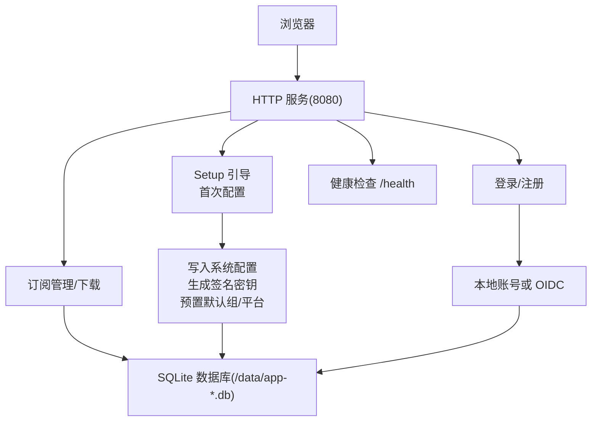
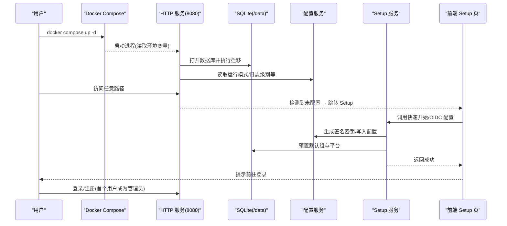
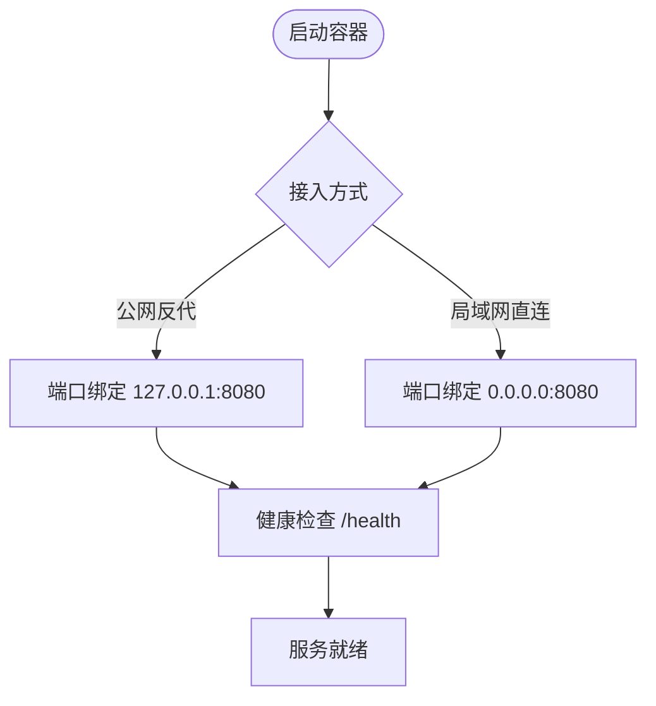
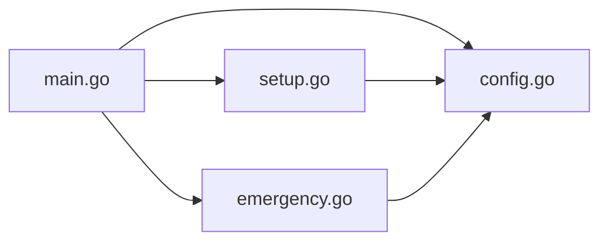

# 快速开始

<cite>
**本文引用的文件**
- [README.md](file://README.md)
- [docker-compose.yml](file://docker-compose.yml)
- [docker-compose.yml.example](file://docker-compose.yml.example)
- [Dockerfile](file://Dockerfile)
- [backend/cmd/server/main.go](file://backend/cmd/server/main.go)
- [backend/internal/setup/setup.go](file://backend/internal/setup/setup.go)
- [backend/internal/config/config.go](file://backend/internal/config/config.go)
- [frontend/src/views/SetupView.vue](file://frontend/src/views/SetupView.vue)
- [backend/internal/emergency/emergency.go](file://backend/internal/emergency/emergency.go)
</cite>

## 目录
1. [简介](#简介)
2. [项目结构](#项目结构)
3. [核心组件](#核心组件)
4. [架构总览](#架构总览)
5. [详细组件分析](#详细组件分析)
6. [依赖关系分析](#依赖关系分析)
7. [性能与部署注意事项](#性能与部署注意事项)
8. [故障排除指南](#故障排除指南)
9. [结论](#结论)
10. [附录：环境变量与端口映射速查](#附录环境变量与端口映射速查)

## 简介
本指南面向首次部署 VPN 订阅管理系统的用户，目标是在约 5 分钟内完成容器化部署、首次 Setup 引导、管理员账号注册与基础配置验证。系统采用单镜像（前端 + 后端一体化）+ SQLite 嵌入式数据库，支持本地账号与 OIDC 两种认证方式，并提供一键导入/导出与应急恢复能力。

## 项目结构
- 单容器镜像：通过多阶段构建将前端产物嵌入后端二进制，运行时仅暴露 8080 端口，数据持久化到 /data 卷。
- 启动流程：读取环境变量 → 打开数据库并执行迁移 → 检测是否进入应急模式 → 装配 HTTP 服务 → 启动健康检查端点。
- 首次访问：若系统未配置，前端路由自动跳转到 Setup 页面，提供“快速开始”和“高级配置（OIDC）”两条路径。



图表来源
- [Dockerfile:1-31](file://Dockerfile#L1-L31)
- [backend/cmd/server/main.go:24-98](file://backend/cmd/server/main.go#L24-L98)
- [backend/internal/setup/setup.go:41-69](file://backend/internal/setup/setup.go#L41-L69)

章节来源
- [README.md:65-114](file://README.md#L65-L114)
- [docker-compose.yml:1-28](file://docker-compose.yml#L1-L28)
- [docker-compose.yml.example:1-41](file://docker-compose.yml.example#L1-L41)
- [Dockerfile:1-31](file://Dockerfile#L1-L31)
- [backend/cmd/server/main.go:24-98](file://backend/cmd/server/main.go#L24-L98)

## 核心组件
- 启动与环境变量解析：APP_MODE、LOG_LEVEL、LOG_FORMAT、PORT、TRUST_PROXY、DATA_DIR、RESET_ADMIN_PASSWORD。
- 数据库与迁移：按运行模式选择 app-dev.db 或 app-prod.db；启动时执行内嵌迁移脚本。
- Setup 引导：快速开始（本地账号）与高级配置（OIDC），事务性写入配置与预置数据。
- 配置中心：系统配置键值存储，敏感字段加密落库，支持导出/导入。
- 应急恢复：当数据库损坏或关键配置缺失时，自动进入应急模式，支持重置管理员密码与重新初始化。

章节来源
- [backend/cmd/server/main.go:24-98](file://backend/cmd/server/main.go#L24-L98)
- [backend/internal/setup/setup.go:41-69](file://backend/internal/setup/setup.go#L41-L69)
- [backend/internal/config/config.go:24-37](file://backend/internal/config/config.go#L24-L37)
- [backend/internal/emergency/emergency.go:50-66](file://backend/internal/emergency/emergency.go#L50-L66)

## 架构总览
下图展示了从容器启动到 Setup 完成的端到端流程，包括环境变量、数据库、Setup 服务与前端交互。



图表来源
- [backend/cmd/server/main.go:24-98](file://backend/cmd/server/main.go#L24-L98)
- [backend/internal/setup/setup.go:41-69](file://backend/internal/setup/setup.go#L41-L69)
- [backend/internal/config/config.go:294-333](file://backend/internal/config/config.go#L294-L333)
- [frontend/src/views/SetupView.vue:33-45](file://frontend/src/views/SetupView.vue#L33-L45)

## 详细组件分析

### 一键部署与端口映射
- 使用官方预构建镜像或本地构建镜像均可。
- 推荐公网部署：仅绑定回环地址，由外部反向代理承担 TLS 与域名接入。
- 局域网直连：直接映射 8080 端口，注意明文传输风险。



图表来源
- [docker-compose.yml:4-18](file://docker-compose.yml#L4-L18)
- [docker-compose.yml.example:11-18](file://docker-compose.yml.example#L11-L18)
- [README.md:167-192](file://README.md#L167-L192)

章节来源
- [README.md:65-94](file://README.md#L65-L94)
- [docker-compose.yml:1-28](file://docker-compose.yml#L1-L28)
- [docker-compose.yml.example:1-41](file://docker-compose.yml.example#L1-L41)

### 首次 Setup 引导流程
- 访问站点后，若系统未配置，前端自动跳转到 Setup 页面。
- 快速开始：零配置完成，生成签名密钥、预置默认组与平台、设置 frontend_url。
- 高级配置：填写 OIDC 参数，测试连接，完成后同样写入配置与预置数据。

```mermaid
flowchart TD
A["访问站点"] --> B{"已配置?"}
B --> |否| C["Setup 页面"]
B --> |是| D["登录/首页"]
C --> E{"选择路径"}
E --> |快速开始| F["确认步"]
E --> |高级配置(OIDC)| G["填写参数/测试"]
F --> H["提交快速开始"]
G --> I["提交 OIDC 配置"]
H --> J["生成签名密钥/写入配置/预置数据"]
I --> J
J --> K["跳转登录"]
```

图表来源
- [frontend/src/views/SetupView.vue:33-45](file://frontend/src/views/SetupView.vue#L33-L45)
- [backend/internal/setup/setup.go:41-69](file://backend/internal/setup/setup.go#L41-L69)

章节来源
- [frontend/src/views/SetupView.vue:1-291](file://frontend/src/views/SetupView.vue#L1-L291)
- [backend/internal/setup/setup.go:41-69](file://backend/internal/setup/setup.go#L41-L69)

### 管理员账号注册
- 首个完成认证的用户自动成为管理员。
- 本地账号模式：Setup 完成后立即注册并登录。
- OIDC 模式：首个 OIDC 登录者成为管理员。

章节来源
- [README.md:111-114](file://README.md#L111-L114)
- [Design0.md:173-186](file://Design0.md#L173-L186)

### 基础配置设置
- 可在面板中配置认证开关、验证码、SMTP、站点信息、速率限制、日志级别、公告等。
- 支持配置导出/导入（生产模式可用），整体覆盖并替换签名密钥。

章节来源
- [README.md:57-62](file://README.md#L57-L62)
- [frontend/src/views/SetupView.vue:47-89](file://frontend/src/views/SetupView.vue#L47-L89)

## 依赖关系分析
- 启动入口 main.go 负责环境变量解析、数据库打开与迁移、应急模式检测、HTTP 服务装配与运行。
- Setup 服务依赖配置服务进行签名密钥生成与配置写入，并在同一事务中预置默认组与平台。
- 配置服务提供敏感字段加密/解密、布尔/整数类型化读取、事务内读写。
- 应急服务在数据库损坏或关键配置缺失时接管，提供一次性操作码与重置管理员密码能力。



图表来源
- [backend/cmd/server/main.go:24-98](file://backend/cmd/server/main.go#L24-L98)
- [backend/internal/setup/setup.go:41-69](file://backend/internal/setup/setup.go#L41-L69)
- [backend/internal/config/config.go:24-37](file://backend/internal/config/config.go#L24-L37)
- [backend/internal/emergency/emergency.go:50-66](file://backend/internal/emergency/emergency.go#L50-L66)

章节来源
- [backend/cmd/server/main.go:24-98](file://backend/cmd/server/main.go#L24-L98)
- [backend/internal/setup/setup.go:41-69](file://backend/internal/setup/setup.go#L41-L69)
- [backend/internal/config/config.go:24-37](file://backend/internal/config/config.go#L24-L37)
- [backend/internal/emergency/emergency.go:50-66](file://backend/internal/emergency/emergency.go#L50-L66)

## 性能与部署注意事项
- 单镜像一体化交付，减少依赖复杂度；SQLite 嵌入式存储适合中小规模场景。
- 健康检查端点 /health 用于监控与反代探活；应急模式下返回 503。
- 数据全部持久化到 /data 卷，升级不影响数据；建议定期备份。
- 公网部署建议使用外部反向代理处理 TLS，避免明文传输风险。

章节来源
- [Dockerfile:1-31](file://Dockerfile#L1-L31)
- [docker-compose.yml:19-24](file://docker-compose.yml#L19-L24)
- [docker-compose.yml.example:32-37](file://docker-compose.yml.example#L32-L37)
- [README.md:133-146](file://README.md#L133-L146)

## 故障排除指南
- 无法访问或健康检查失败：检查端口映射与防火墙；查看容器日志定位错误。
- 首次 Setup 重复提交：系统已配置时会返回冲突错误，需前往登录。
- 管理员密码丢失：设置 RESET_ADMIN_PASSWORD 环境变量重启进入应急模式，获取一次性操作码后重置密码，完成后移除变量并重启。
- 数据库损坏或迁移失败：自动进入应急模式，可执行重新初始化以重建空库。

章节来源
- [backend/internal/emergency/emergency.go:50-66](file://backend/internal/emergency/emergency.go#L50-L66)
- [backend/internal/emergency/emergency.go:108-116](file://backend/internal/emergency/emergency.go#L108-L116)
- [backend/internal/emergency/emergency.go:188-212](file://backend/internal/emergency/emergency.go#L188-L212)
- [README.md:205-213](file://README.md#L205-L213)

## 结论
通过 Docker Compose 一键部署与 Setup 引导，您可以在 5 分钟内完成 VPN 订阅管理系统的上线。推荐使用公网反代接入以提升安全性，并尽快注册管理员账号以关闭抢注窗口。日常运维可通过面板进行配置管理与备份，遇到问题优先查看健康检查与日志，必要时使用应急恢复功能。

## 附录：环境变量与端口映射速查
- 环境变量
  - APP_MODE：dev | prod（决定运行模式与数据库文件名）
  - LOG_LEVEL：debug | info | warn | error（初始日志级别）
  - LOG_FORMAT：console | json（日志格式）
  - PORT：监听端口（默认 8080）
  - TRUST_PROXY：auto | on | off（真实客户端 IP 解析策略）
  - DATA_DIR：数据目录（默认 ./data）
  - RESET_ADMIN_PASSWORD：非空时进入应急模式（管理员密码救援）
- 端口映射
  - 公网反代：127.0.0.1:8080:8080（推荐）
  - 局域网直连：8080:8080（注意明文风险）

章节来源
- [backend/cmd/server/main.go:24-28](file://backend/cmd/server/main.go#L24-L28)
- [docker-compose.yml:12-18](file://docker-compose.yml#L12-L18)
- [docker-compose.yml.example:19-30](file://docker-compose.yml.example#L19-L30)
- [README.md:194-213](file://README.md#L194-L213)