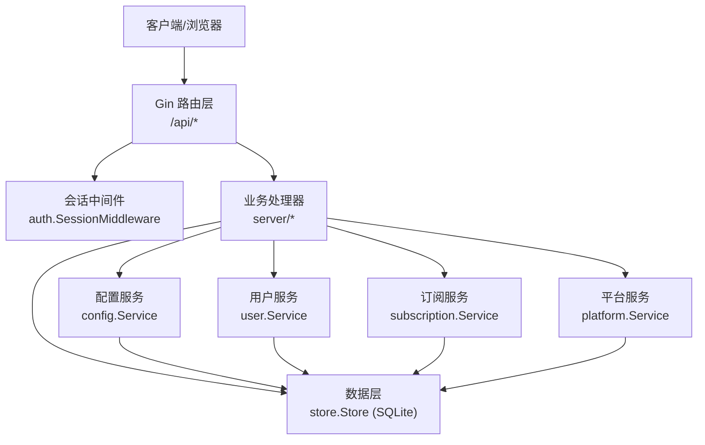
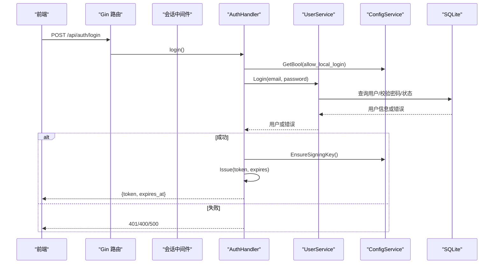
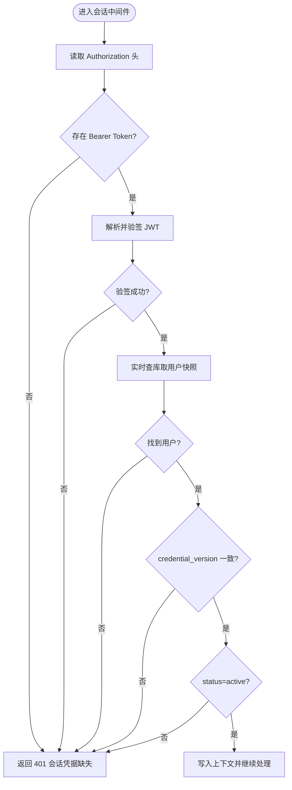
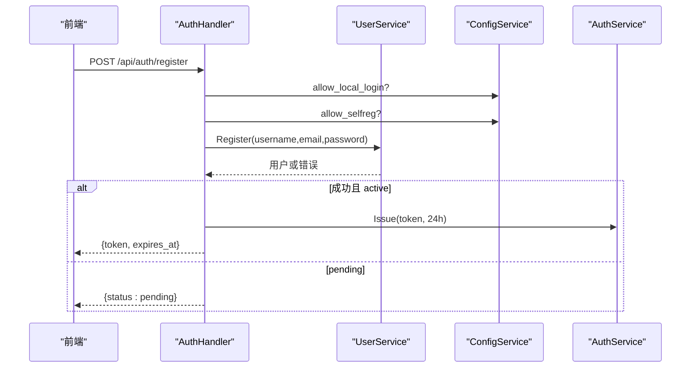
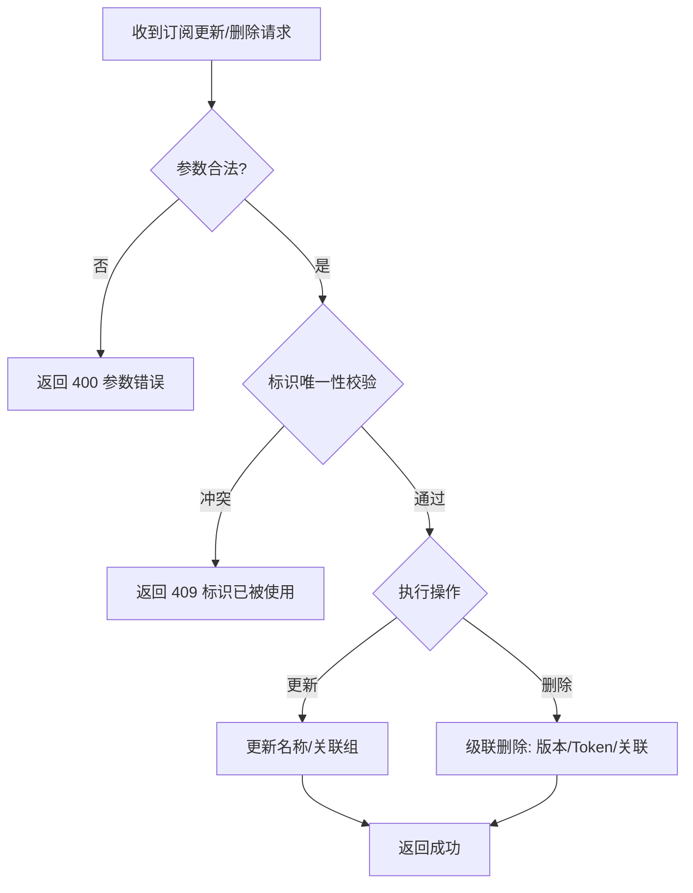
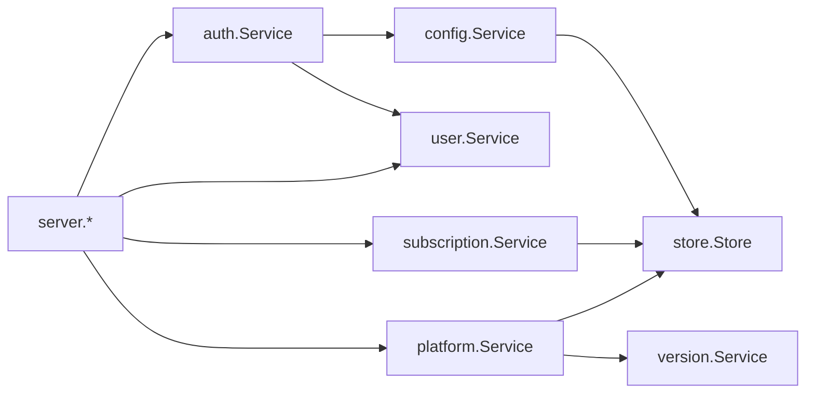

# 常见问题诊断

<cite>
**本文引用的文件**
- [backend/internal/auth/auth.go](file://backend/internal/auth/auth.go)
- [backend/internal/server/auth.go](file://backend/internal/server/auth.go)
- [backend/internal/user/user.go](file://backend/internal/user/user.go)
- [backend/internal/subscription/subscription.go](file://backend/internal/subscription/subscription.go)
- [backend/internal/platform/platform.go](file://backend/internal/platform/platform.go)
- [backend/internal/config/config.go](file://backend/internal/config/config.go)
- [backend/internal/response/response.go](file://backend/internal/response/response.go)
- [backend/internal/log/log.go](file://backend/internal/log/log.go)
- [backend/internal/store/store.go](file://backend/internal/store/store.go)
- [backend/cmd/server/main.go](file://backend/cmd/server/main.go)
</cite>

## 目录
1. [简介](#简介)
2. [项目结构](#项目结构)
3. [核心组件](#核心组件)
4. [架构总览](#架构总览)
5. [详细组件分析](#详细组件分析)
6. [依赖关系分析](#依赖关系分析)
7. [性能与稳定性考量](#性能与稳定性考量)
8. [故障排查指南](#故障排查指南)
9. [结论](#结论)
10. [附录：快速修复命令与检查清单](#附录快速修复命令与检查清单)

## 简介
本指南面向运维与开发，聚焦以下典型故障场景的“症状—原因—排查—解决”闭环：认证失败、用户登录异常、订阅更新错误、平台配置问题。内容基于后端代码实现，提供错误日志定位方法、配置文件检查清单、数据库状态验证步骤，以及可执行的快速修复建议与预防措施。

## 项目结构
系统采用 Go 后端 + Vue 前端的双端架构。后端以 Gin 为 HTTP 框架，SQLite 作为数据持久化；认证使用 JWT（HS256），敏感配置通过 AES-256-GCM 加密存储；启动流程包含数据库打开、迁移、应急模式检测与服务装配。

图表来源
- [backend/internal/server/auth.go:24-34](file://backend/internal/server/auth.go#L24-L34)
- [backend/internal/auth/auth.go:144-180](file://backend/internal/auth/auth.go#L144-L180)
- [backend/internal/store/store.go:32-52](file://backend/internal/store/store.go#L32-L52)

章节来源
- [backend/cmd/server/main.go:24-98](file://backend/cmd/server/main.go#L24-L98)
- [backend/internal/store/store.go:32-52](file://backend/internal/store/store.go#L32-L52)

## 核心组件
- 认证与会话：JWT 签发/解析、凭据版本校验、角色鉴权中间件。
- 用户服务：注册、登录、快照查询、首管理员机制。
- 订阅服务：CRUD、跨四类资源标识唯一性校验、级联删除。
- 平台服务：CRUD、安装包上传/删除、级联删除影响统计。
- 配置服务：系统配置读写、敏感值加解密、签名密钥管理。
- 数据层：SQLite 连接、WAL/外键/事务、迁移框架。
- 响应与日志：统一响应封装、结构化日志与 token 脱敏。

章节来源
- [backend/internal/auth/auth.go:22-135](file://backend/internal/auth/auth.go#L22-L135)
- [backend/internal/user/user.go:82-187](file://backend/internal/user/user.go#L82-L187)
- [backend/internal/subscription/subscription.go:28-115](file://backend/internal/subscription/subscription.go#L28-L115)
- [backend/internal/platform/platform.go:36-119](file://backend/internal/platform/platform.go#L36-L119)
- [backend/internal/config/config.go:24-111](file://backend/internal/config/config.go#L24-L111)
- [backend/internal/store/store.go:32-164](file://backend/internal/store/store.go#L32-L164)
- [backend/internal/response/response.go:14-51](file://backend/internal/response/response.go#L14-L51)
- [backend/internal/log/log.go:1-118](file://backend/internal/log/log.go#L1-L118)

## 架构总览
请求从前端进入 Gin 路由，经过限流、验证码等中间件后到达业务处理器；受保护接口由会话中间件校验 JWT 并实时查库比对凭据版本与账号状态；业务层调用配置、用户、订阅、平台等服务，最终通过 store 访问 SQLite。

图表来源
- [backend/internal/server/auth.go:99-134](file://backend/internal/server/auth.go#L99-L134)
- [backend/internal/auth/auth.go:98-135](file://backend/internal/auth/auth.go#L98-L135)
- [backend/internal/config/config.go:282-313](file://backend/internal/config/config.go#L282-L313)

## 详细组件分析

### 认证与会话（JWT）
- 关键点
  - 会话时长：记住我 7 天，不勾选 24 小时；OIDC 固定 7 天。
  - 凭据载荷仅含 user_id 与 credential_version，权限信息每次请求实时查库。
  - 中间件会解析 Authorization Bearer，验签后实时查库比对 credential_version 与 status=active。
- 常见错误
  - 缺失或无效/过期令牌 → 401
  - 凭据版本不一致 → 401（提示重新登录）
  - 账号未激活或被禁用 → 401
  - 签名密钥缺失 → 验签失败 → 401

图表来源
- [backend/internal/auth/auth.go:144-180](file://backend/internal/auth/auth.go#L144-L180)
- [backend/internal/config/config.go:282-313](file://backend/internal/config/config.go#L282-L313)

章节来源
- [backend/internal/auth/auth.go:22-135](file://backend/internal/auth/auth.go#L22-L135)
- [backend/internal/auth/auth.go:144-180](file://backend/internal/auth/auth.go#L144-L180)

### 用户登录与注册
- 登录流程
  - 本地登录开关控制；邮箱格式规范化；密码校验；非 active 拒绝。
  - 成功后签发 JWT，支持 remember 选项。
- 注册流程
  - 自注册可见性受 allow_selfreg 与用户表是否为空控制；首管理员免审批直接激活。
  - 新用户自动加入默认组；可选发送欢迎邮件。
- 常见错误
  - 邮箱或密码错误 → 401
  - 账号未激活或被禁用 → 401
  - 邮箱冲突 → 409
  - 参数非法 → 400

图表来源
- [backend/internal/server/auth.go:44-91](file://backend/internal/server/auth.go#L44-L91)
- [backend/internal/user/user.go:82-154](file://backend/internal/user/user.go#L82-L154)
- [backend/internal/auth/auth.go:98-116](file://backend/internal/auth/auth.go#L98-L116)

章节来源
- [backend/internal/server/auth.go:44-134](file://backend/internal/server/auth.go#L44-L134)
- [backend/internal/user/user.go:82-187](file://backend/internal/user/user.go#L82-L187)

### 订阅更新与删除
- 创建/更新
  - 手填标识需满足格式并通过跨四类资源全局唯一性校验；平台不可修改；关联组可重建。
- 删除
  - 级联删除：版本文件、下载 Token、订阅-组关联；受影响组置 needs_reselect（若回调已注入）。
- 常见错误
  - 标识冲突 → 409
  - 参数错误（名称为空、平台不存在等）→ 400
  - 订阅不存在 → 404

图表来源
- [backend/internal/subscription/subscription.go:86-115](file://backend/internal/subscription/subscription.go#L86-L115)
- [backend/internal/subscription/subscription.go:166-231](file://backend/internal/subscription/subscription.go#L166-L231)
- [backend/internal/subscription/subscription.go:276-332](file://backend/internal/subscription/subscription.go#L276-L332)

章节来源
- [backend/internal/subscription/subscription.go:28-115](file://backend/internal/subscription/subscription.go#L28-L115)
- [backend/internal/subscription/subscription.go:166-332](file://backend/internal/subscription/subscription.go#L166-L332)

### 平台配置与安装包
- 平台 CRUD
  - slug 自动生成；schemes 与 extra_headers 严格校验；列表附带删除影响统计。
- 安装包上传
  - 流式落盘、大小限制、文件名时间戳防缓存、并发安全（O_EXCL）、事务内原子更新。
- 删除
  - 级联删除安装包、订阅/自定义订阅及其版本、下载 Token。
- 常见错误
  - scheme/headers 非法 → 400
  - 安装包超限 → 400
  - 平台不存在 → 404

章节来源
- [backend/internal/platform/platform.go:68-119](file://backend/internal/platform/platform.go#L68-L119)
- [backend/internal/platform/platform.go:217-334](file://backend/internal/platform/platform.go#L217-L334)
- [backend/internal/platform/platform.go:382-474](file://backend/internal/platform/platform.go#L382-L474)

## 依赖关系分析
- 认证模块依赖配置服务获取签名密钥；会话中间件依赖用户服务实时快照。
- 订阅/平台服务依赖 store 进行事务与迁移；平台删除依赖版本组件清理文件。
- 配置服务对敏感字段进行加解密，依赖签名密钥派生 AES 密钥。
- 数据层保证 WAL、外键、单写者模型与迁移一致性。

图表来源
- [backend/internal/auth/auth.go:87-96](file://backend/internal/auth/auth.go#L87-L96)
- [backend/internal/subscription/subscription.go:28-41](file://backend/internal/subscription/subscription.go#L28-L41)
- [backend/internal/platform/platform.go:36-46](file://backend/internal/platform/platform.go#L36-L46)
- [backend/internal/config/config.go:48-55](file://backend/internal/config/config.go#L48-L55)
- [backend/internal/store/store.go:32-52](file://backend/internal/store/store.go#L32-L52)

章节来源
- [backend/internal/auth/auth.go:87-96](file://backend/internal/auth/auth.go#L87-L96)
- [backend/internal/subscription/subscription.go:28-41](file://backend/internal/subscription/subscription.go#L28-L41)
- [backend/internal/platform/platform.go:36-46](file://backend/internal/platform/platform.go#L36-L46)
- [backend/internal/config/config.go:48-55](file://backend/internal/config/config.go#L48-L55)
- [backend/internal/store/store.go:32-52](file://backend/internal/store/store.go#L32-L52)

## 性能与稳定性考量
- SQLite 单写者模型与 WAL 模式降低并发写冲突风险；busy_timeout 设置避免忙等待。
- 事务采用 BEGIN IMMEDIATE，读后写场景串行化，防止竞态条件。
- 安装包上传流式写入并限制大小，避免内存占用过高。
- 统一响应在 5xx 时对外脱敏，内部记录详细错误，便于生产安全与排障平衡。
- 日志输出支持 JSON/文本双格式，token 自动脱敏，避免敏感信息泄露。

章节来源
- [backend/internal/store/store.go:32-52](file://backend/internal/store/store.go#L32-L52)
- [backend/internal/store/store.go:147-164](file://backend/internal/store/store.go#L147-L164)
- [backend/internal/platform/platform.go:266-334](file://backend/internal/platform/platform.go#L266-L334)
- [backend/internal/response/response.go:40-51](file://backend/internal/response/response.go#L40-L51)
- [backend/internal/log/log.go:40-57](file://backend/internal/log/log.go#L40-L57)

## 故障排查指南

### 一、认证失败（401 未授权）
- 症状
  - 访问需要认证的接口返回 401，提示“会话凭据缺失/无效或已过期/凭据已失效，请重新登录/账号未激活或已被禁用”。
- 可能原因
  - 缺少或错误的 Authorization 头。
  - JWT 签名算法不匹配或签名密钥缺失。
  - 凭据版本不一致（用户改邮箱/密码后旧会话失效）。
  - 账号状态非 active（待审批/禁用）。
- 排查步骤
  - 检查请求是否携带正确的 Bearer Token。
  - 查看服务端日志中是否有“凭据解析失败/签名算法不匹配/签名密钥未配置”等错误。
  - 确认用户 credential_version 是否与令牌中一致（改邮箱/密码后会递增）。
  - 确认用户 status 是否为 active。
- 解决方案
  - 重新登录获取新 Token。
  - 确保系统已完成 Setup，签名密钥已生成。
  - 管理员检查用户状态与权限。
- 参考路径
  - [backend/internal/auth/auth.go:118-135](file://backend/internal/auth/auth.go#L118-L135)
  - [backend/internal/auth/auth.go:144-180](file://backend/internal/auth/auth.go#L144-L180)
  - [backend/internal/config/config.go:282-313](file://backend/internal/config/config.go#L282-L313)

章节来源
- [backend/internal/auth/auth.go:118-180](file://backend/internal/auth/auth.go#L118-L180)
- [backend/internal/config/config.go:282-313](file://backend/internal/config/config.go#L282-L313)

### 二、用户登录异常
- 症状
  - 登录失败返回 401，提示“邮箱或密码错误/账号未激活或已被禁用”。
- 可能原因
  - 本地登录被关闭。
  - 邮箱格式非法或不存在。
  - 密码错误。
  - 账号处于 pending 或禁用状态。
- 排查步骤
  - 检查配置 allow_local_login 是否为 true。
  - 核对邮箱格式与大小写规范化。
  - 查看用户表中的 status 与 password_hash 是否存在。
  - 关注验证码中间件是否启用但未在前端接入（导致 400）。
- 解决方案
  - 开启本地登录或改用 OIDC。
  - 重置密码或激活账号。
  - 接入验证码组件或关闭验证码强制校验。
- 参考路径
  - [backend/internal/server/auth.go:99-134](file://backend/internal/server/auth.go#L99-L134)
  - [backend/internal/user/user.go:170-187](file://backend/internal/user/user.go#L170-L187)

章节来源
- [backend/internal/server/auth.go:99-134](file://backend/internal/server/auth.go#L99-L134)
- [backend/internal/user/user.go:170-187](file://backend/internal/user/user.go#L170-L187)

### 三、订阅更新错误
- 症状
  - 创建/更新/删除订阅返回 400/409/404。
- 可能原因
  - 手填标识不符合格式或与四类资源冲突。
  - 平台不存在或名称为空。
  - 订阅不存在。
- 排查步骤
  - 校验标识格式与唯一性。
  - 检查平台 ID 是否存在。
  - 查看订阅是否存在及关联组是否正确。
- 解决方案
  - 修正标识或选择其他可用标识。
  - 先创建平台再创建订阅。
  - 确认订阅 ID 正确。
- 参考路径
  - [backend/internal/subscription/subscription.go:86-115](file://backend/internal/subscription/subscription.go#L86-L115)
  - [backend/internal/subscription/subscription.go:166-231](file://backend/internal/subscription/subscription.go#L166-L231)
  - [backend/internal/subscription/subscription.go:276-332](file://backend/internal/subscription/subscription.go#L276-L332)

章节来源
- [backend/internal/subscription/subscription.go:86-231](file://backend/internal/subscription/subscription.go#L86-L231)
- [backend/internal/subscription/subscription.go:276-332](file://backend/internal/subscription/subscription.go#L276-L332)

### 四、平台配置问题
- 症状
  - 平台创建/更新/删除失败，或安装包上传失败。
- 可能原因
  - schemes/extra_headers 包含控制字符或键名不合法。
  - 安装包超过大小限制。
  - 平台不存在。
- 排查步骤
  - 校验 schemes 与 headers 是否符合规范。
  - 检查安装包大小与文件名合法性。
  - 确认平台 ID 有效。
- 解决方案
  - 修正配置项格式。
  - 压缩或分片安装包。
  - 重新创建平台或选择已有平台。
- 参考路径
  - [backend/internal/platform/platform.go:217-245](file://backend/internal/platform/platform.go#L217-L245)
  - [backend/internal/platform/platform.go:266-334](file://backend/internal/platform/platform.go#L266-L334)
  - [backend/internal/platform/platform.go:382-474](file://backend/internal/platform/platform.go#L382-L474)

章节来源
- [backend/internal/platform/platform.go:217-334](file://backend/internal/platform/platform.go#L217-L334)
- [backend/internal/platform/platform.go:382-474](file://backend/internal/platform/platform.go#L382-L474)

### 五、数据库损坏与应急模式
- 症状
  - 启动时报错退出，无法进入正常服务；或页面显示应急恢复入口。
- 可能原因
  - 数据库文件损坏或迁移失败。
- 排查步骤
  - 查看启动日志中“打开数据库失败/迁移失败”的错误信息。
  - 检查 data 目录下的数据库文件与权限。
- 解决方案
  - 系统会自动进入应急模式，提供重新初始化入口。
  - 备份数据后尝试恢复或重建。
- 参考路径
  - [backend/cmd/server/main.go:42-59](file://backend/cmd/server/main.go#L42-L59)
  - [backend/internal/store/store.go:62-128](file://backend/internal/store/store.go#L62-L128)

章节来源
- [backend/cmd/server/main.go:42-59](file://backend/cmd/server/main.go#L42-L59)
- [backend/internal/store/store.go:62-128](file://backend/internal/store/store.go#L62-L128)

## 结论
通过对认证、用户、订阅、平台与配置等核心组件的分析，可以系统化地定位和解决常见故障。关键在于：
- 关注会话中间件的凭据版本与账号状态校验。
- 校验平台与订阅的配置合法性与唯一性。
- 利用统一响应与结构化日志快速定位错误。
- 在数据库异常时利用应急模式进行恢复。

## 附录：快速修复命令与检查清单

### 快速修复命令
- 重启服务（容器环境）
  - docker-compose restart
- 查看后端日志
  - docker-compose logs -f backend
- 检查数据库文件
  - ls -l ./data/app-prod.db
- 进入应急模式（如数据库损坏）
  - 设置环境变量 RESET_ADMIN_PASSWORD=1 后重启（触发应急模式）

### 配置检查清单
- 本地登录开关
  - 键：allow_local_login；值：true/false
- 自注册开关
  - 键：allow_selfreg；值：true/false
- 首管理员初始化标记
  - 键：admin_initialized；值：true/false
- 前端地址
  - 键：frontend_url；用于生成完整下载链接
- 签名密钥
  - 键：signing_key；缺失会导致 JWT 验签失败

### 数据库状态验证方法
- 检查迁移版本
  - SELECT MAX(version) FROM schema_migrations;
- 检查用户表是否为空（注册入口可见性）
  - SELECT COUNT(*) FROM users;
- 检查平台是否存在
  - SELECT COUNT(*) FROM platforms WHERE id = ?;
- 检查订阅是否存在
  - SELECT COUNT(*) FROM subscriptions WHERE id = ?;

章节来源
- [backend/internal/config/config.go:24-37](file://backend/internal/config/config.go#L24-L37)
- [backend/internal/config/config.go:282-313](file://backend/internal/config/config.go#L282-L313)
- [backend/internal/store/store.go:62-128](file://backend/internal/store/store.go#L62-L128)
- [backend/internal/user/user.go:204-214](file://backend/internal/user/user.go#L204-L214)
- [backend/internal/platform/platform.go:121-143](file://backend/internal/platform/platform.go#L121-L143)
- [backend/internal/subscription/subscription.go:334-351](file://backend/internal/subscription/subscription.go#L334-L351)