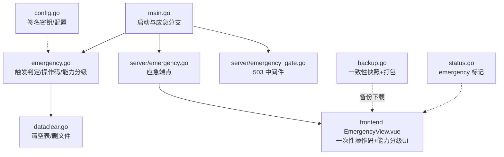
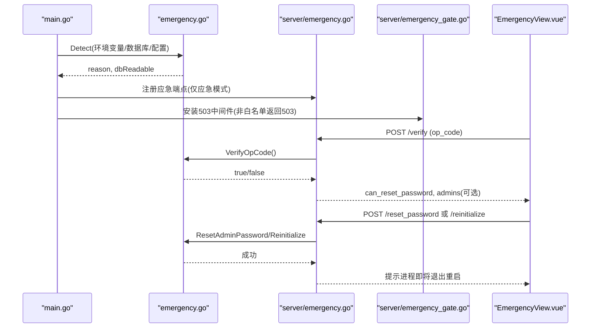
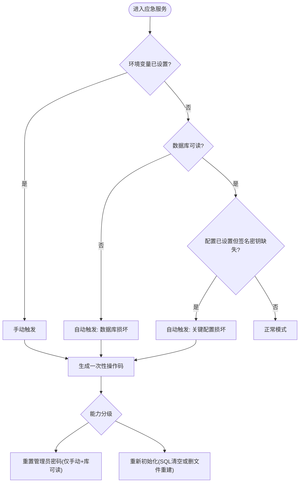
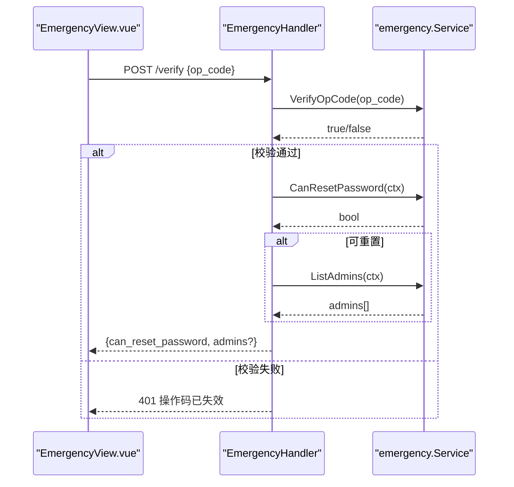
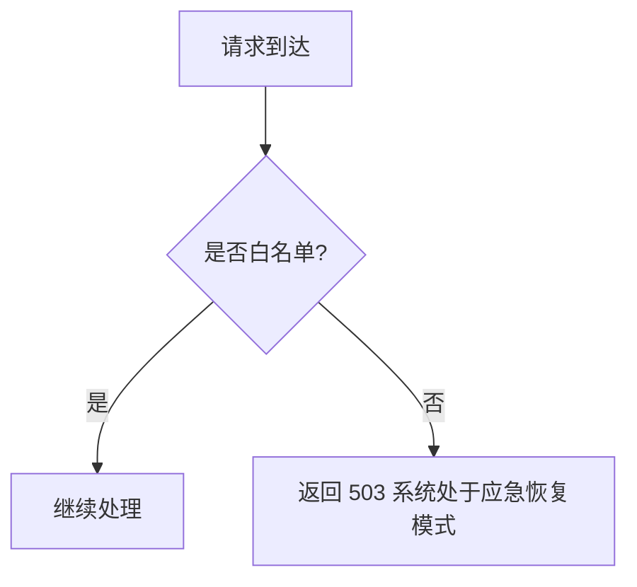
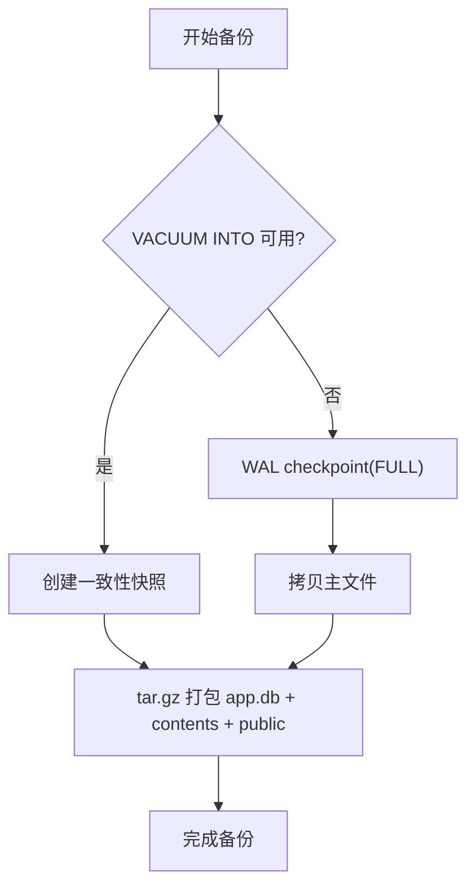
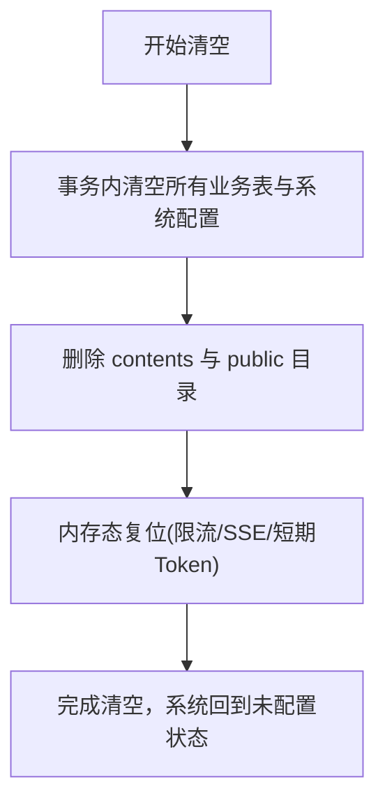
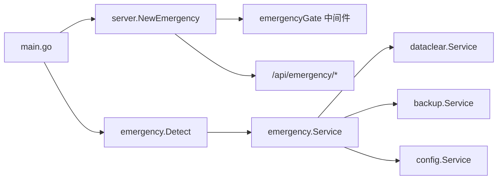

# 应急恢复机制

<cite>
**本文引用的文件**
- [backend/internal/emergency/emergency.go](file://backend/internal/emergency/emergency.go)
- [backend/internal/server/emergency.go](file://backend/internal/server/emergency.go)
- [backend/internal/server/emergency_gate.go](file://backend/internal/server/emergency_gate.go)
- [backend/cmd/server/main.go](file://backend/cmd/server/main.go)
- [backend/internal/backup/backup.go](file://backend/internal/backup/backup.go)
- [backend/internal/dataclear/dataclear.go](file://backend/internal/dataclear/dataclear.go)
- [frontend/src/views/EmergencyView.vue](file://frontend/src/views/EmergencyView.vue)
- [frontend/src/api/emergency.ts](file://frontend/src/api/emergency.ts)
- [backend/internal/server/status.go](file://backend/internal/server/status.go)
- [backend/internal/config/config.go](file://backend/internal/config/config.go)
</cite>

## 目录
1. [简介](#简介)
2. [项目结构](#项目结构)
3. [核心组件](#核心组件)
4. [架构总览](#架构总览)
5. [详细组件分析](#详细组件分析)
6. [依赖关系分析](#依赖关系分析)
7. [性能与可用性考量](#性能与可用性考量)
8. [故障排查指南](#故障排查指南)
9. [结论](#结论)
10. [附录：紧急操作步骤与回滚方案](#附录：紧急操作步骤与回滚方案)

## 简介
本文件面向运维与管理员，系统化说明系统的“应急恢复机制”，包括：
- 紧急模式的启用条件（手动/自动）
- 数据备份与一致性快照策略
- 系统重置（应急全清）流程与降级路径
- 灾难恢复预案、数据完整性验证、服务重启策略
- 紧急情况下的操作步骤、回滚方案与数据保护措施

该机制确保在数据库损坏、关键配置缺失或管理员密码丢失等极端场景下，仍可通过受控的救援通道快速恢复服务。

## 项目结构
应急恢复能力由后端业务层、接入层、前端页面与备份模块协同实现：
- 触发判定与操作码管理：emergency 包
- 应急路由与网关拦截：server/emergency.go、server/emergency_gate.go
- 启动装配与模式切换：main.go
- 备份与一致性快照：backup 包
- 一键清空与数据清理：dataclear 包
- 前端应急页与 API 调用：EmergencyView.vue、api/emergency.ts
- 系统状态暴露：status.go
- 配置与签名密钥：config.go

图表来源
- [backend/cmd/server/main.go:24-127](file://backend/cmd/server/main.go#L24-L127)
- [backend/internal/emergency/emergency.go:50-86](file://backend/internal/emergency/emergency.go#L50-L86)
- [backend/internal/server/emergency.go:20-26](file://backend/internal/server/emergency.go#L20-L26)
- [backend/internal/server/emergency_gate.go:12-41](file://backend/internal/server/emergency_gate.go#L12-L41)
- [backend/internal/backup/backup.go:30-65](file://backend/internal/backup/backup.go#L30-L65)
- [backend/internal/dataclear/dataclear.go:37-82](file://backend/internal/dataclear/dataclear.go#L37-L82)
- [frontend/src/views/EmergencyView.vue:1-164](file://frontend/src/views/EmergencyView.vue#L1-L164)
- [backend/internal/server/status.go:39-79](file://backend/internal/server/status.go#L39-L79)
- [backend/internal/config/config.go:24-37](file://backend/internal/config/config.go#L24-L37)

章节来源
- [backend/cmd/server/main.go:24-127](file://backend/cmd/server/main.go#L24-L127)
- [backend/internal/emergency/emergency.go:50-86](file://backend/internal/emergency/emergency.go#L50-L86)
- [backend/internal/server/emergency.go:20-26](file://backend/internal/server/emergency.go#L20-L26)
- [backend/internal/server/emergency_gate.go:12-41](file://backend/internal/server/emergency_gate.go#L12-L41)
- [backend/internal/backup/backup.go:30-65](file://backend/internal/backup/backup.go#L30-L65)
- [backend/internal/dataclear/dataclear.go:37-82](file://backend/internal/dataclear/dataclear.go#L37-L82)
- [frontend/src/views/EmergencyView.vue:1-164](file://frontend/src/views/EmergencyView.vue#L1-L164)
- [backend/internal/server/status.go:39-79](file://backend/internal/server/status.go#L39-L79)
- [backend/internal/config/config.go:24-37](file://backend/internal/config/config.go#L24-L37)

## 核心组件
- 应急服务（emergency.Service）：负责触发判定、一次性操作码生成与校验、能力分级（是否可重置管理员密码）、重置管理员密码、重新初始化（应急全清）。
- 应急接入层（EmergencyHandler）：提供 /api/emergency/* 三个端点，仅在应急模式下注册；对请求进行参数校验、操作码校验与能力检查。
- 应急网关（emergencyGate）：在应急模式下将非白名单路径返回 503，仅放行系统状态、站点信息、应急端点、静态资源与 SPA 回退。
- 备份服务（backup.Service）：通过 SQLite 一致性快照 + 版本文件与 public 资源打包 tar.gz，不阻断正常服务。
- 数据清理（dataclear.Service）：事务内清空全部业务数据与系统配置，并删除数据文件；支持内存态复位。
- 前端应急页（EmergencyView.vue）：独立全屏路由，展示触发原因、一次性操作码输入、能力分级操作（重置密码/重新初始化）。
- 系统状态（StatusHandler）：在应急模式下返回 emergency 标记、触发原因与可用能力。

章节来源
- [backend/internal/emergency/emergency.go:36-86](file://backend/internal/emergency/emergency.go#L36-L86)
- [backend/internal/server/emergency.go:15-26](file://backend/internal/server/emergency.go#L15-L26)
- [backend/internal/server/emergency_gate.go:12-41](file://backend/internal/server/emergency_gate.go#L12-L41)
- [backend/internal/backup/backup.go:19-65](file://backend/internal/backup/backup.go#L19-L65)
- [backend/internal/dataclear/dataclear.go:19-82](file://backend/internal/dataclear/dataclear.go#L19-L82)
- [frontend/src/views/EmergencyView.vue:1-164](file://frontend/src/views/EmergencyView.vue#L1-L164)
- [backend/internal/server/status.go:13-79](file://backend/internal/server/status.go#L13-L79)

## 架构总览
应急恢复的整体流程如下：
- 启动时检测：环境变量手动触发或自动检测（数据库损坏/关键配置缺失），进入应急模式。
- 生成一次性操作码：输出到运行日志，仅存进程内存，每次提交即消耗并重新生成。
- 前端强制跳转：根据系统状态中的 emergency 标记，强制跳转到应急页。
- 能力分级：仅环境变量触发且数据库可读时提供重置管理员密码；否则仅提供重新初始化。
- 执行救援：重置密码或重新初始化后，进程退出，由编排工具拉起，恢复正常 Setup。

图表来源
- [backend/cmd/server/main.go:70-75](file://backend/cmd/server/main.go#L70-L75)
- [backend/internal/emergency/emergency.go:50-86](file://backend/internal/emergency/emergency.go#L50-L86)
- [backend/internal/server/emergency.go:20-26](file://backend/internal/server/emergency.go#L20-L26)
- [backend/internal/server/emergency_gate.go:12-41](file://backend/internal/server/emergency_gate.go#L12-L41)
- [frontend/src/views/EmergencyView.vue:27-44](file://frontend/src/views/EmergencyView.vue#L27-L44)

## 详细组件分析

### 应急服务（emergency.Service）
- 触发判定：
  - 手动触发：设置环境变量 RESET_ADMIN_PASSWORD 非空。
  - 自动触发：数据库无法连接或损坏（PRAGMA integrity_check 失败）；关键配置损坏（configured=true 但签名密钥缺失）。
- 一次性操作码：
  - 8 位字符集（去易混淆字符），仅存进程内存，每次提交无论成败均消耗并重新生成。
- 能力分级：
  - 重置管理员密码：仅手动触发且数据库可读，用户表非空时可用。
  - 重新初始化：始终可用；数据库不可读时降级为删除数据库文件与数据目录后重建。
- 重置管理员密码：
  - 校验新密码强度，哈希存储，更新 credential_version，成功后进程退出。
- 重新初始化：
  - 数据库可读：事务内清空所有业务数据与系统配置，并删除数据文件。
  - 数据库不可读：删除数据库文件与 contents/public 目录，重启后进入 Setup。

图表来源
- [backend/internal/emergency/emergency.go:50-86](file://backend/internal/emergency/emergency.go#L50-L86)
- [backend/internal/emergency/emergency.go:120-186](file://backend/internal/emergency/emergency.go#L120-L186)
- [backend/internal/emergency/emergency.go:188-213](file://backend/internal/emergency/emergency.go#L188-L213)

章节来源
- [backend/internal/emergency/emergency.go:50-86](file://backend/internal/emergency/emergency.go#L50-L86)
- [backend/internal/emergency/emergency.go:120-186](file://backend/internal/emergency/emergency.go#L120-L186)
- [backend/internal/emergency/emergency.go:188-213](file://backend/internal/emergency/emergency.go#L188-L213)

### 应急接入层（EmergencyHandler）
- 端点：
  - POST /api/emergency/verify：校验一次性操作码，通过后返回可用能力与管理员名单（若可重置）。
  - POST /api/emergency/reset_password：一次性操作码 + user_id + 新密码；成功后进程退出。
  - POST /api/emergency/reinitialize：一次性操作码 + 二次确认；成功后进程退出。
- 安全约束：
  - 参数严格校验（长度、必填）。
  - 操作码严格一次性，失败也消耗。
  - 能力检查：当前环境不支持重置密码则拒绝。

图表来源
- [backend/internal/server/emergency.go:28-51](file://backend/internal/server/emergency.go#L28-L51)
- [backend/internal/emergency/emergency.go:108-116](file://backend/internal/emergency/emergency.go#L108-L116)
- [backend/internal/emergency/emergency.go:120-163](file://backend/internal/emergency/emergency.go#L120-L163)

章节来源
- [backend/internal/server/emergency.go:28-51](file://backend/internal/server/emergency.go#L28-L51)
- [backend/internal/server/emergency.go:53-78](file://backend/internal/server/emergency.go#L53-L78)
- [backend/internal/server/emergency.go:80-100](file://backend/internal/server/emergency.go#L80-L100)

### 应急网关（emergencyGate）
- 行为：在应急模式下，非白名单路径一律返回 503。
- 白名单：系统状态、站点信息、应急端点、静态资源（/assets、/public）、健康检查、SPA 回退。
- 目的：暂停业务 API 与下载端点，仅保留救援与基础能力。

图表来源
- [backend/internal/server/emergency_gate.go:12-41](file://backend/internal/server/emergency_gate.go#L12-L41)

章节来源
- [backend/internal/server/emergency_gate.go:12-41](file://backend/internal/server/emergency_gate.go#L12-L41)

### 备份服务（backup.Service）
- 一致性快照：优先使用 VACUUM INTO 创建一致性快照；驱动不支持时降级为 WAL checkpoint 后拷贝主文件。
- 打包内容：快照（app.db）+ 版本文件目录（contents，含符号链接）+ 站点资源（public）。
- 特性：不阻断正常服务；备份文件包含符号链接，恢复后启动自检以 DB 为准重建。

图表来源
- [backend/internal/backup/backup.go:30-79](file://backend/internal/backup/backup.go#L30-L79)
- [backend/internal/backup/backup.go:81-119](file://backend/internal/backup/backup.go#L81-L119)

章节来源
- [backend/internal/backup/backup.go:30-79](file://backend/internal/backup/backup.go#L30-L79)
- [backend/internal/backup/backup.go:81-119](file://backend/internal/backup/backup.go#L81-L119)

### 数据清理（dataclear.Service）
- 清空范围：事务内删除全部业务数据与系统配置（schema_migrations 保留）。
- 文件清理：删除 contents 与 public 目录；失败记录错误但不阻断回到 Setup。
- 内存态复位：限流计数、实时日志缓冲等运行时状态复位。
- 会话失效：签名密钥轮换导致旧凭据验签失败自然失效。

图表来源
- [backend/internal/dataclear/dataclear.go:37-82](file://backend/internal/dataclear/dataclear.go#L37-L82)

章节来源
- [backend/internal/dataclear/dataclear.go:37-82](file://backend/internal/dataclear/dataclear.go#L37-L82)

### 前端应急页（EmergencyView.vue）
- 功能：
  - 显示触发原因（manual/db_corrupt/key_missing）。
  - 一次性操作码输入与校验。
  - 能力分级渲染：重置管理员密码（仅手动+库可读）与重新初始化（始终可用）。
- 交互：
  - 校验失败提示“操作码已失效，请重新从运行日志获取”。
  - 重置密码需选择管理员账号、输入新密码并确认。
  - 重新初始化需二次确认，完成后提示进程即将退出重启。

章节来源
- [frontend/src/views/EmergencyView.vue:1-164](file://frontend/src/views/EmergencyView.vue#L1-L164)
- [frontend/src/api/emergency.ts:1-33](file://frontend/src/api/emergency.ts#L1-L33)

### 系统状态（StatusHandler）
- 在应急模式下返回：
  - emergency: true
  - emergency_reason: manual/db_corrupt/key_missing
  - can_reset_password: 是否可重置管理员密码
- 其他字段：configured、app_mode、认证与验证码相关配置。

章节来源
- [backend/internal/server/status.go:39-79](file://backend/internal/server/status.go#L39-L79)

## 依赖关系分析
- main.go 在启动阶段解析环境变量、打开数据库、执行迁移，并在异常或检测到应急条件时进入应急模式分支。
- emergency.Detect 决定触发原因与数据库可读性，影响能力分级。
- server.NewEmergency 仅注册应急端点与静态资源，配合 emergencyGate 中间件限制业务访问。
- backup 与 dataclear 被应急服务复用，分别用于备份与清空。
- config 提供配置读取与签名密钥管理，影响自动触发判定（key_missing）。

图表来源
- [backend/cmd/server/main.go:70-127](file://backend/cmd/server/main.go#L70-L127)
- [backend/internal/emergency/emergency.go:50-86](file://backend/internal/emergency/emergency.go#L50-L86)
- [backend/internal/server/emergency.go:20-26](file://backend/internal/server/emergency.go#L20-L26)
- [backend/internal/server/emergency_gate.go:12-41](file://backend/internal/server/emergency_gate.go#L12-L41)
- [backend/internal/backup/backup.go:19-65](file://backend/internal/backup/backup.go#L19-L65)
- [backend/internal/dataclear/dataclear.go:19-82](file://backend/internal/dataclear/dataclear.go#L19-L82)
- [backend/internal/config/config.go:24-37](file://backend/internal/config/config.go#L24-L37)

章节来源
- [backend/cmd/server/main.go:70-127](file://backend/cmd/server/main.go#L70-L127)
- [backend/internal/emergency/emergency.go:50-86](file://backend/internal/emergency/emergency.go#L50-L86)
- [backend/internal/server/emergency.go:20-26](file://backend/internal/server/emergency.go#L20-L26)
- [backend/internal/server/emergency_gate.go:12-41](file://backend/internal/server/emergency_gate.go#L12-L41)
- [backend/internal/backup/backup.go:19-65](file://backend/internal/backup/backup.go#L19-L65)
- [backend/internal/dataclear/dataclear.go:19-82](file://backend/internal/dataclear/dataclear.go#L19-L82)
- [backend/internal/config/config.go:24-37](file://backend/internal/config/config.go#L24-L37)

## 性能与可用性考量
- 备份过程不阻断正常服务，采用一致性快照避免 WAL 未 checkpoint 的数据遗漏。
- 应急模式期间业务 API 与下载端点返回 503，降低负载与风险。
- 一次性操作码仅存进程内存，避免落库带来的额外开销与泄露风险。
- 重新初始化在数据库不可读时降级为文件删除与重建，确保最小化恢复路径。
- 健康检查在应急模式下返回 503，便于编排与健康探针识别异常。

[本节为通用指导，无需特定文件引用]

## 故障排查指南
- 应急模式未进入：
  - 检查环境变量 RESET_ADMIN_PASSWORD 是否设置。
  - 检查数据库是否能打开与迁移是否成功。
  - 检查配置中 configured 与签名密钥是否存在。
- 操作码无效：
  - 每次提交都会消耗并重新生成，需从运行日志获取最新操作码。
- 重置管理员密码失败：
  - 确认当前环境允许重置（仅手动触发且数据库可读）。
  - 确认目标管理员账号存在且具备本地密码。
- 重新初始化失败：
  - 数据库可读时使用 SQL 清空；不可读时检查数据目录权限与磁盘空间。
- 备份下载失败：
  - 检查 SQLite 驱动是否支持 VACUUM INTO；如不支持将自动降级为 WAL checkpoint 后拷贝。

章节来源
- [backend/internal/emergency/emergency.go:50-86](file://backend/internal/emergency/emergency.go#L50-L86)
- [backend/internal/emergency/emergency.go:108-116](file://backend/internal/emergency/emergency.go#L108-L116)
- [backend/internal/emergency/emergency.go:120-186](file://backend/internal/emergency/emergency.go#L120-L186)
- [backend/internal/backup/backup.go:30-79](file://backend/internal/backup/backup.go#L30-L79)

## 结论
应急恢复机制通过严格的触发判定、一次性操作码防护与能力分级，确保在极端场景下仍可安全、可控地恢复服务。结合一致性备份与一键清空能力，系统能够在数据库损坏、关键配置缺失或管理员密码丢失时快速重建，保障业务连续性与数据安全。

[本节为总结，无需特定文件引用]

## 附录：紧急操作步骤与回滚方案

### 启用条件
- 手动触发：设置环境变量 RESET_ADMIN_PASSWORD 非空后重启容器。
- 自动触发：数据库无法连接或损坏（PRAGMA integrity_check 失败）；关键配置损坏（configured=true 但签名密钥缺失）。

章节来源
- [backend/internal/emergency/emergency.go:50-66](file://backend/internal/emergency/emergency.go#L50-L66)
- [backend/cmd/server/main.go:70-75](file://backend/cmd/server/main.go#L70-L75)

### 数据备份恢复流程
- 备份：
  - 使用备份接口创建一致性快照，打包 app.db、contents、public 为 tar.gz。
  - 若驱动不支持 VACUUM INTO，自动降级为 WAL checkpoint 后拷贝主文件。
- 恢复：
  - 将备份解压至数据目录，启动服务；启动自检以 DB 为准重建符号链接。

章节来源
- [backend/internal/backup/backup.go:30-79](file://backend/internal/backup/backup.go#L30-L79)
- [backend/internal/backup/backup.go:81-119](file://backend/internal/backup/backup.go#L81-L119)

### 系统重置操作
- 重新初始化（应急全清）：
  - 数据库可读：事务内清空所有业务数据与系统配置，并删除数据文件。
  - 数据库不可读：删除数据库文件与 contents/public 目录，重启后进入 Setup。
- 完成后进程退出，由编排工具拉起，进入首次配置。

章节来源
- [backend/internal/emergency/emergency.go:188-213](file://backend/internal/emergency/emergency.go#L188-L213)
- [backend/internal/dataclear/dataclear.go:37-82](file://backend/internal/dataclear/dataclear.go#L37-L82)

### 灾难恢复预案
- 数据库损坏：
  - 自动进入应急模式，提供重新初始化按钮；必要时删除数据库文件重建。
- 关键配置损坏：
  - 自动进入应急模式，提供重新初始化按钮；重建后重新生成签名密钥。
- 管理员密码丢失：
  - 手动触发应急模式，重置管理员密码；成功后进程退出，移除环境变量后重启。

章节来源
- [backend/internal/emergency/emergency.go:50-86](file://backend/internal/emergency/emergency.go#L50-L86)
- [backend/internal/emergency/emergency.go:120-186](file://backend/internal/emergency/emergency.go#L120-L186)

### 数据完整性验证
- 启动时执行 PRAGMA integrity_check，失败则进入应急模式。
- 备份前通过 VACUUM INTO 或 WAL checkpoint 保证一致性。

章节来源
- [backend/internal/emergency/emergency.go:68-75](file://backend/internal/emergency/emergency.go#L68-L75)
- [backend/internal/backup/backup.go:67-79](file://backend/internal/backup/backup.go#L67-L79)

### 服务重启策略
- 重置管理员密码或重新初始化成功后，进程主动退出，由编排工具拉起。
- 健康检查在应急模式下返回 503，避免误判为健康。

章节来源
- [backend/internal/server/emergency.go:53-78](file://backend/internal/server/emergency.go#L53-L78)
- [backend/internal/server/emergency.go:80-100](file://backend/internal/server/emergency.go#L80-L100)
- [backend/internal/server/health.go:9-16](file://backend/internal/server/health.go#L9-L16)

### 紧急情况下的操作步骤
1. 查看系统状态，确认 emergency 标记与触发原因。
2. 从运行日志获取一次性操作码。
3. 在应急页输入操作码，按能力分级执行：
   - 重置管理员密码：选择管理员账号，设置新密码，确认后进程退出。
   - 重新初始化：二次确认后执行全清，进程退出。
4. 移除环境变量（如 RESET_ADMIN_PASSWORD），重启容器恢复正常服务。

章节来源
- [frontend/src/views/EmergencyView.vue:27-95](file://frontend/src/views/EmergencyView.vue#L27-L95)
- [backend/internal/server/status.go:39-79](file://backend/internal/server/status.go#L39-L79)

### 回滚方案
- 备份优先：在执行任何破坏性操作前，先创建一致性备份。
- 恢复步骤：将备份解压至数据目录，重启服务；启动自检以 DB 为准重建符号链接。
- 若备份不可用：执行重新初始化，进入 Setup 重新配置。

章节来源
- [backend/internal/backup/backup.go:30-79](file://backend/internal/backup/backup.go#L30-L79)
- [backend/internal/emergency/emergency.go:188-213](file://backend/internal/emergency/emergency.go#L188-L213)

### 数据保护措施
- 一次性操作码：仅存进程内存，每次提交即消耗并重新生成，防止重放攻击。
- 能力分级：仅手动触发且数据库可读时提供重置管理员密码，降低无凭据重置风险。
- 会话失效：重置管理员密码后递增 credential_version，现有会话立即失效。
- 敏感配置加密：签名密钥派生 AES-256-GCM 密钥，保护敏感配置。

章节来源
- [backend/internal/emergency/emergency.go:91-116](file://backend/internal/emergency/emergency.go#L91-L116)
- [backend/internal/emergency/emergency.go:120-186](file://backend/internal/emergency/emergency.go#L120-L186)
- [backend/internal/config/config.go:220-361](file://backend/internal/config/config.go#L220-L361)