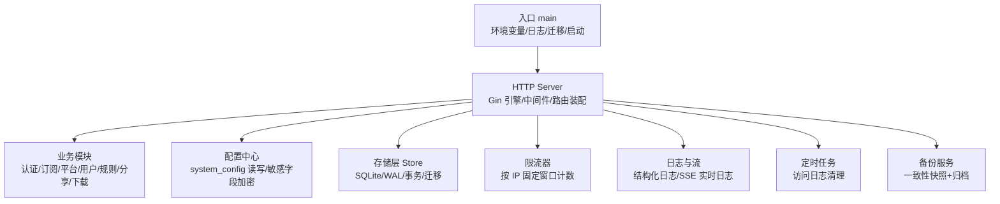
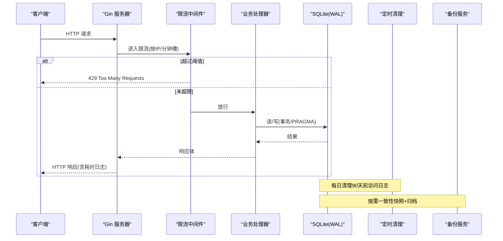
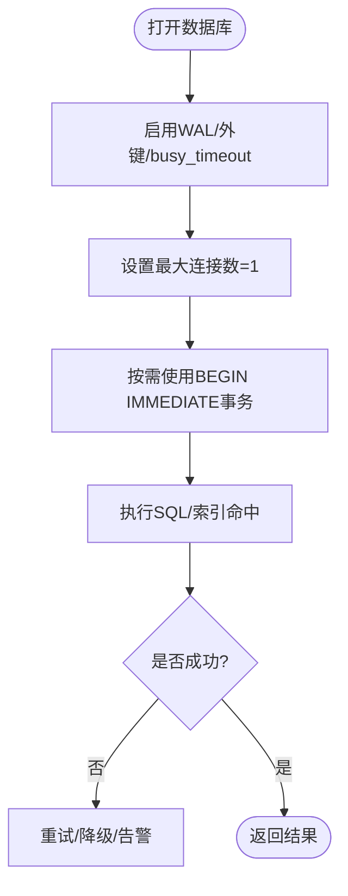
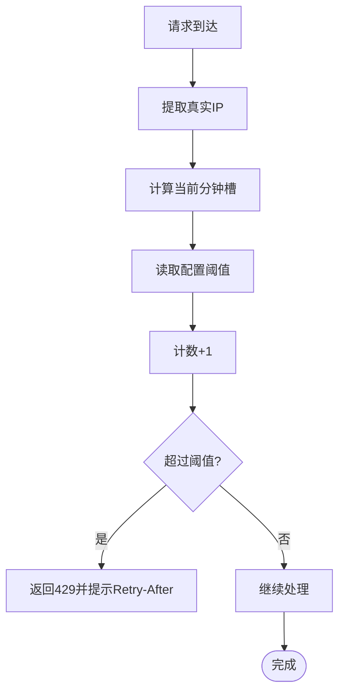
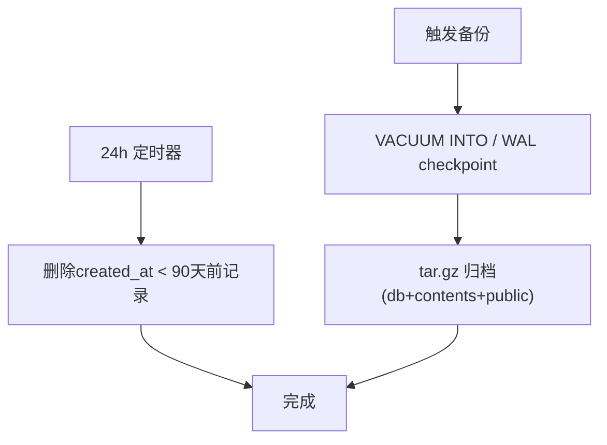
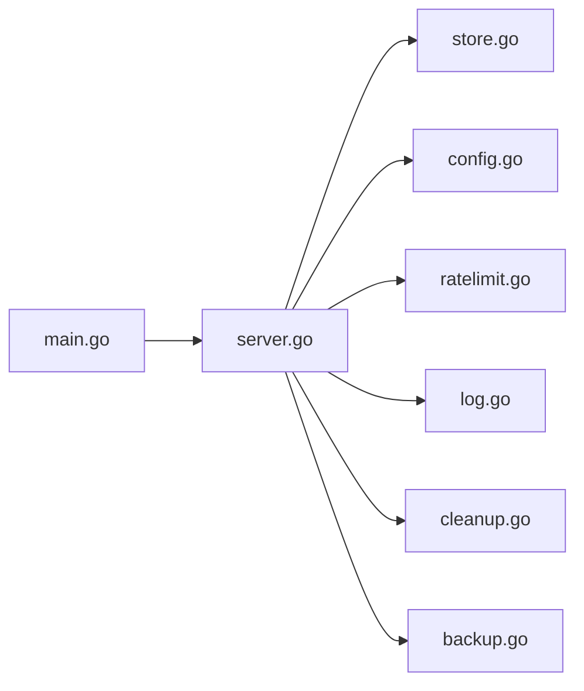

# 性能优化与调优

<cite>
**本文引用的文件**
- [backend/cmd/server/main.go](file://backend/cmd/server/main.go)
- [backend/internal/store/store.go](file://backend/internal/store/store.go)
- [backend/internal/config/config.go](file://backend/internal/config/config.go)
- [backend/internal/ratelimit/ratelimit.go](file://backend/internal/ratelimit/ratelimit.go)
- [backend/internal/log/log.go](file://backend/internal/log/log.go)
- [backend/internal/log/stream.go](file://backend/internal/log/stream.go)
- [backend/internal/server/server.go](file://backend/internal/server/server.go)
- [backend/internal/cron/cleanup.go](file://backend/internal/cron/cleanup.go)
- [backend/internal/backup/backup.go](file://backend/internal/backup/backup.go)
- [README.md](../../../../../README.md)
</cite>

## 目录
1. [简介](#简介)
2. [项目结构](#项目结构)
3. [核心组件](#核心组件)
4. [架构总览](#架构总览)
5. [详细组件分析](#详细组件分析)
6. [依赖关系分析](#依赖关系分析)
7. [性能考量](#性能考量)
8. [故障排查指南](#故障排查指南)
9. [结论](#结论)
10. [附录](#附录)

## 简介
本指南面向生产运维与后端开发者，围绕系统资源监控、内存使用分析、数据库性能调优、API 响应时间优化四个维度，提供可落地的实践方案。结合代码实现，说明如何识别瓶颈、分析 CPU/内存、优化查询、调整并发参数，并给出容量规划建议与常用工具使用方法。

## 项目结构
后端采用 Go + Gin 的 HTTP 服务，数据层基于 SQLite（modernc.org/sqlite），通过版本化迁移管理 schema；内置限流、日志、定时清理、备份等能力；前端为 Vue 3 + Vite，打包后以静态资源内嵌到二进制中。



图表来源
- [backend/cmd/server/main.go:24-98](file://backend/cmd/server/main.go#L24-L98)
- [backend/internal/server/server.go:63-157](file://backend/internal/server/server.go#L63-L157)
- [backend/internal/store/store.go:32-52](file://backend/internal/store/store.go#L32-L52)
- [backend/internal/ratelimit/ratelimit.go:25-60](file://backend/internal/ratelimit/ratelimit.go#L25-L60)
- [backend/internal/log/log.go:43-57](file://backend/internal/log/log.go#L43-L57)
- [backend/internal/cron/cleanup.go:12-28](file://backend/internal/cron/cleanup.go#L12-L28)
- [backend/internal/backup/backup.go:31-65](file://backend/internal/backup/backup.go#L31-L65)

章节来源
- [backend/cmd/server/main.go:24-98](file://backend/cmd/server/main.go#L24-L98)
- [backend/internal/server/server.go:63-157](file://backend/internal/server/server.go#L63-L157)
- [backend/internal/store/store.go:32-52](file://backend/internal/store/store.go#L32-L52)
- [README.md:194-204](../../../../../README.md#L194-L204)

## 核心组件
- 存储层 Store：WAL 模式、外键开启、busy_timeout、单写者模型（MaxOpenConns=1）、BEGIN IMMEDIATE 事务、版本化迁移。
- 配置中心 Config：system_config 表读写，敏感字段 AES-256-GCM 加密，运行时级别控制。
- 限流器 Limiter：按 IP 固定窗口（分钟槽）计数，支持动态阈值（从配置读取）。
- 日志与流：结构化日志（console/json），token 脱敏，环形缓冲 + SSE 实时日志。
- 定时任务：访问日志 90 天自动清理。
- 备份服务：一致性快照（VACUUM INTO 或 WAL checkpoint 降级）+ 归档。
- HTTP 服务：请求耗时记录、统一 panic 恢复、优雅退出。

章节来源
- [backend/internal/store/store.go:32-52](file://backend/internal/store/store.go#L32-L52)
- [backend/internal/config/config.go:57-111](file://backend/internal/config/config.go#L57-L111)
- [backend/internal/ratelimit/ratelimit.go:25-60](file://backend/internal/ratelimit/ratelimit.go#L25-L60)
- [backend/internal/log/log.go:43-57](file://backend/internal/log/log.go#L43-L57)
- [backend/internal/log/stream.go:17-47](file://backend/internal/log/stream.go#L17-L47)
- [backend/internal/cron/cleanup.go:12-28](file://backend/internal/cron/cleanup.go#L12-L28)
- [backend/internal/backup/backup.go:31-65](file://backend/internal/backup/backup.go#L31-L65)
- [backend/internal/server/server.go:212-223](file://backend/internal/server/server.go#L212-L223)

## 架构总览
下图展示一次典型 API 请求在系统中的流转路径，以及关键性能点（限流、日志、DB 事务、WAL、备份/清理）。



图表来源
- [backend/internal/ratelimit/ratelimit.go:40-60](file://backend/internal/ratelimit/ratelimit.go#L40-L60)
- [backend/internal/server/server.go:212-223](file://backend/internal/server/server.go#L212-L223)
- [backend/internal/store/store.go:32-52](file://backend/internal/store/store.go#L32-L52)
- [backend/internal/cron/cleanup.go:12-28](file://backend/internal/cron/cleanup.go#L12-L28)
- [backend/internal/backup/backup.go:31-65](file://backend/internal/backup/backup.go#L31-L65)

## 详细组件分析

### 存储层与数据库性能
- 连接与并发
  - 单写者模型：SetMaxOpenConns(1)，避免并发写 busy；配合 PRAGMA busy_timeout=5000ms 降低争用失败概率。
  - WAL 模式：提升读并发与写入吞吐，减少锁竞争；备份时优先 VACUUM INTO，否则回退到 PRAGMA wal_checkpoint(FULL)。
- 事务策略
  - BEGIN IMMEDIATE：用于“先读后写”场景，开启即持有写锁，串行化读→判定→写，避免死锁与脏写。
- 迁移与版本
  - 版本化迁移串行执行，任一失败拒绝启动；数据库版本高于代码支持版本时拒绝启动，防止回滚风险。
- 性能要点
  - 合理拆分事务粒度，尽量将只读操作放在事务前；批量写入合并；避免长事务阻塞写锁。
  - 对高频查询建立合适索引（由 SQL 设计决定），避免全表扫描。



图表来源
- [backend/internal/store/store.go:32-52](file://backend/internal/store/store.go#L32-L52)
- [backend/internal/store/store.go:147-164](file://backend/internal/store/store.go#L147-L164)
- [backend/internal/backup/backup.go:67-79](file://backend/internal/backup/backup.go#L67-L79)

章节来源
- [backend/internal/store/store.go:32-52](file://backend/internal/store/store.go#L32-L52)
- [backend/internal/store/store.go:62-128](file://backend/internal/store/store.go#L62-L128)
- [backend/internal/store/store.go:147-164](file://backend/internal/store/store.go#L147-L164)
- [backend/internal/backup/backup.go:67-79](file://backend/internal/backup/backup.go#L67-L79)

### 限流与并发控制
- 机制：按 IP 固定窗口（分钟槽）计数，阈值来自配置（登录/注册/找回密码/下载），修改立即生效。
- 内存占用：buckets map 定期 GC 过期槽，防止泄漏；Reset 接口支持一键清空（运维操作时同步重置）。
- 性能影响：高并发下 map 操作需加锁，但窗口粒度粗（分钟级），开销可控。



图表来源
- [backend/internal/ratelimit/ratelimit.go:40-60](file://backend/internal/ratelimit/ratelimit.go#L40-L60)
- [backend/internal/ratelimit/ratelimit.go:62-81](file://backend/internal/ratelimit/ratelimit.go#L62-L81)
- [backend/internal/ratelimit/ratelimit.go:83-88](file://backend/internal/ratelimit/ratelimit.go#L83-L88)

章节来源
- [backend/internal/ratelimit/ratelimit.go:17-23](file://backend/internal/ratelimit/ratelimit.go#L17-L23)
- [backend/internal/ratelimit/ratelimit.go:40-60](file://backend/internal/ratelimit/ratelimit.go#L40-L60)
- [backend/internal/ratelimit/ratelimit.go:62-88](file://backend/internal/ratelimit/ratelimit.go#L62-L88)

### 日志与实时监控
- 结构化日志：支持 console/json 输出，token 自动脱敏；可通过 SetLevel 运行时切换级别。
- 实时日志流：环形缓冲（最近 500 条）+ SSE 推送，消费慢则丢弃防阻塞；支持 Reset 同步清空。
- 访问日志：记录方法/路径/状态码/耗时毫秒，便于定位慢请求。

```mermaid
sequenceDiagram
participant App as "业务代码"
participant Log as "Logger"
participant RB as "RingBuffer"
participant SSE as "SSE流"
App->>Log : Info/Warn/Error/Debug
Log->>RB : Append(Entry)
RB-->>SSE : 广播最新日志(非阻塞)
Note over RB,SSE : 满覆盖最旧; 消费慢丢弃, 不阻塞日志管道
```

图表来源
- [backend/internal/log/log.go:43-57](file://backend/internal/log/log.go#L43-L57)
- [backend/internal/log/log.go:62-117](file://backend/internal/log/log.go#L62-L117)
- [backend/internal/log/stream.go:17-47](file://backend/internal/log/stream.go#L17-L47)
- [backend/internal/server/server.go:212-223](file://backend/internal/server/server.go#L212-L223)

章节来源
- [backend/internal/log/log.go:43-57](file://backend/internal/log/log.go#L43-L57)
- [backend/internal/log/log.go:62-117](file://backend/internal/log/log.go#L62-L117)
- [backend/internal/log/stream.go:17-47](file://backend/internal/log/stream.go#L17-L47)
- [backend/internal/server/server.go:212-223](file://backend/internal/server/server.go#L212-L223)

### 定时任务与资源回收
- 访问日志清理：每日执行一次，删除 90 天前的记录，避免表膨胀导致查询变慢。
- 备份：一致性快照（VACUUM INTO 或 WAL checkpoint 降级）+ 归档 contents/public，不影响正常服务。



图表来源
- [backend/internal/cron/cleanup.go:12-28](file://backend/internal/cron/cleanup.go#L12-L28)
- [backend/internal/backup/backup.go:31-65](file://backend/internal/backup/backup.go#L31-L65)
- [backend/internal/backup/backup.go:67-79](file://backend/internal/backup/backup.go#L67-L79)

章节来源
- [backend/internal/cron/cleanup.go:12-28](file://backend/internal/cron/cleanup.go#L12-L28)
- [backend/internal/backup/backup.go:31-65](file://backend/internal/backup/backup.go#L31-L65)

### HTTP 服务与响应时间优化
- 请求日志：记录 method/path/status/latency_ms，便于定位慢端点。
- Panic 恢复：统一捕获 panic，返回通用错误信息，详情入日志。
- 优雅退出：信号驱动关闭，等待在途请求收尾（超时保护）。

章节来源
- [backend/internal/server/server.go:212-237](file://backend/internal/server/server.go#L212-L237)
- [backend/internal/server/server.go:239-258](file://backend/internal/server/server.go#L239-L258)

## 依赖关系分析
- 入口 main 负责环境初始化、日志、迁移、应急模式检测、服务装配与启动。
- server 装配各业务模块，注入依赖（auth、setup、oidc、platform、subscription、group、token、download、custom、share、rule、user、approval、mail、config、version、log、ratelimit、backup）。
- store 提供统一的 SQLite 封装与迁移框架。
- config 提供 system_config 读写与敏感字段加密。
- ratelimit 提供按 IP 的限流中间件。
- log 提供结构化日志与实时流。
- cron 提供后台清理任务。
- backup 提供一致性备份。



图表来源
- [backend/cmd/server/main.go:24-98](file://backend/cmd/server/main.go#L24-L98)
- [backend/internal/server/server.go:63-157](file://backend/internal/server/server.go#L63-L157)

章节来源
- [backend/cmd/server/main.go:24-98](file://backend/cmd/server/main.go#L24-L98)
- [backend/internal/server/server.go:63-157](file://backend/internal/server/server.go#L63-L157)

## 性能考量

### 系统资源监控
- 指标采集
  - 应用层：通过请求日志中的 latency_ms 统计 P50/P95/P99 延迟；关注 429/5xx 比例。
  - 数据库层：WAL 模式下的写放大与检查点频率；通过备份流程观察 WAL 大小变化。
  - 日志层：环形缓冲容量与 SSE 订阅数量，避免过多连接造成内存压力。
- 工具建议
  - Linux 系统：top/htop、pidstat、iostat、vmstat、dmesg。
  - Go 程序：pprof（CPU/内存/阻塞/互斥）集成到 HTTP 服务（可在调试环境暴露 /debug/pprof）。
  - 数据库：SQLite 无外部进程，关注磁盘 IO 与 WAL 文件大小；必要时导出快照离线分析。

### 内存使用分析
- 关注点
  - 限流 buckets map 的规模与 GC 频率；确保每分钟槽及时清理。
  - 日志环形缓冲大小（默认 500 条），在高吞吐下避免频繁扩容。
  - 备份过程临时文件与 tar.gz 流式压缩，注意峰值内存。
- 分析方法
  - pprof 内存 profile：采样 heap 对象分布，定位大对象与泄漏。
  - 结合日志与指标，关联内存尖峰与特定请求/任务（如备份、大批量导入）。

### 数据库性能调优
- 已实现优化
  - WAL + busy_timeout + 单写者模型，降低写冲突。
  - BEGIN IMMEDIATE 事务串行化读→写，避免死锁。
  - 版本化迁移保证一致性与可回滚边界。
- 建议优化
  - 针对高频查询添加索引（由 SQL 设计决定）；避免 SELECT * 与大结果集。
  - 批量写入合并事务；避免在热路径中进行多次小事务。
  - 定期清理访问日志（已实现 90 天保留），避免表膨胀。
  - 备份期间避免高峰时段，或使用低峰期计划任务。

### API 响应时间优化
- 中间件层面
  - 限流保护热点接口（登录/注册/找回密码/下载），防止雪崩。
  - 统一 panic 恢复，避免异常堆栈泄露与额外开销。
- 业务层面
  - 减少 N+1 查询；合并多次 DB 调用。
  - 缓存热点只读数据（如站点信息、平台元数据），降低 DB 压力。
  - 大文件下载分块传输，限制单次响应体大小。
- 观测与回归
  - 基于 latency_ms 建立 SLO；对 P95/P99 超阈值的端点进行专项优化。
  - 压测前后对比指标，确保优化有效且无退化。

### 容量规划建议
- 单机 SQLite 适合中小规模；若 QPS 持续增长或并发写增多，考虑：
  - 水平扩展：多实例 + 反向代理负载均衡（读多写少场景）。
  - 数据库升级：迁移至 PostgreSQL/MySQL，解耦存储层。
  - 缓存层：Redis 缓存热点配置与只读数据。
- 资源估算
  - 根据峰值 QPS、平均响应时间、P99 目标，估算 CPU/内存/IO 需求。
  - 备份与清理任务避开业务高峰，预留 IO 带宽。

[本节为通用指导，不直接分析具体文件]

## 故障排查指南
- 常见症状
  - 429 频繁出现：检查限流阈值与配置键（登录/注册/找回密码/下载）。
  - 数据库忙/锁冲突：确认事务粒度与 BEGIN IMMEDIATE 使用；检查是否有长事务。
  - 日志堆积：检查 SSE 订阅数量与环形缓冲容量；必要时降低日志级别。
  - 备份失败：检查磁盘空间与权限；关注 WAL checkpoint 降级路径。
- 定位步骤
  - 查看请求日志中的 latency_ms 与 status，定位慢/错端点。
  - 使用 pprof 抓取 CPU/内存 profile，结合调用栈定位热点。
  - 导出数据库快照，离线分析慢查询与表大小。
  - 检查定时任务是否正常运行（访问日志清理、备份）。

章节来源
- [backend/internal/ratelimit/ratelimit.go:40-60](file://backend/internal/ratelimit/ratelimit.go#L40-L60)
- [backend/internal/store/store.go:147-164](file://backend/internal/store/store.go#L147-L164)
- [backend/internal/log/log.go:43-57](file://backend/internal/log/log.go#L43-L57)
- [backend/internal/backup/backup.go:67-79](file://backend/internal/backup/backup.go#L67-L79)

## 结论
本项目在存储层与中间件层面已具备较好的性能基础：WAL、单写者模型、BEGIN IMMEDIATE、限流、结构化日志与实时流、定时清理与一致性备份。生产环境中应重点关注：
- 通过请求日志与 pprof 持续观测延迟与资源使用；
- 合理设置限流阈值与日志级别，平衡体验与成本；
- 优化查询与事务粒度，避免长事务与锁竞争；
- 在低峰期执行备份与清理，保障稳定性；
- 根据增长趋势评估容量与架构演进（缓存/分库/分片）。

[本节为总结性内容，不直接分析具体文件]

## 附录

### 环境变量与运行参数
- APP_MODE：dev/prod，影响数据库文件与功能差异。
- LOG_LEVEL：debug/info/warn/error，运行时可切换。
- LOG_FORMAT：console/json。
- PORT：监听端口。
- TRUST_PROXY：auto/on/off，控制真实 IP 解析策略。
- RESET_ADMIN_PASSWORD：应急恢复开关。

章节来源
- [backend/cmd/server/main.go:24-35](file://backend/cmd/server/main.go#L24-L35)
- [README.md:194-204](../../../../../README.md#L194-L204)

### 关键实现参考路径
- 数据库连接与 PRAGMA：[store.go:32-52](file://backend/internal/store/store.go#L32-L52)
- 事务与迁移：[store.go:62-128](file://backend/internal/store/store.go#L62-L128), [store.go:147-164](file://backend/internal/store/store.go#L147-L164)
- 限流中间件：[ratelimit.go:40-60](file://backend/internal/ratelimit/ratelimit.go#L40-L60)
- 日志与实时流：[log.go:43-57](file://backend/internal/log/log.go#L43-L57), [stream.go:17-47](file://backend/internal/log/stream.go#L17-L47)
- 定时清理：[cleanup.go:12-28](file://backend/internal/cron/cleanup.go#L12-L28)
- 备份快照：[backup.go:31-65](file://backend/internal/backup/backup.go#L31-L65), [backup.go:67-79](file://backend/internal/backup/backup.go#L67-L79)
- 请求耗时记录：[server.go:212-223](file://backend/internal/server/server.go#L212-L223)