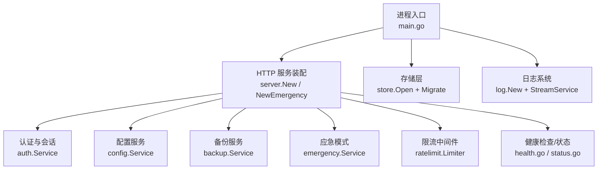
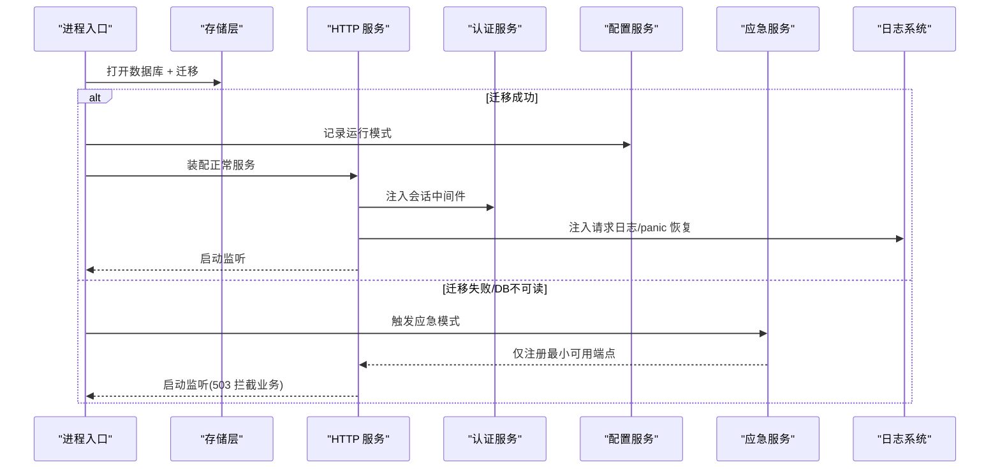
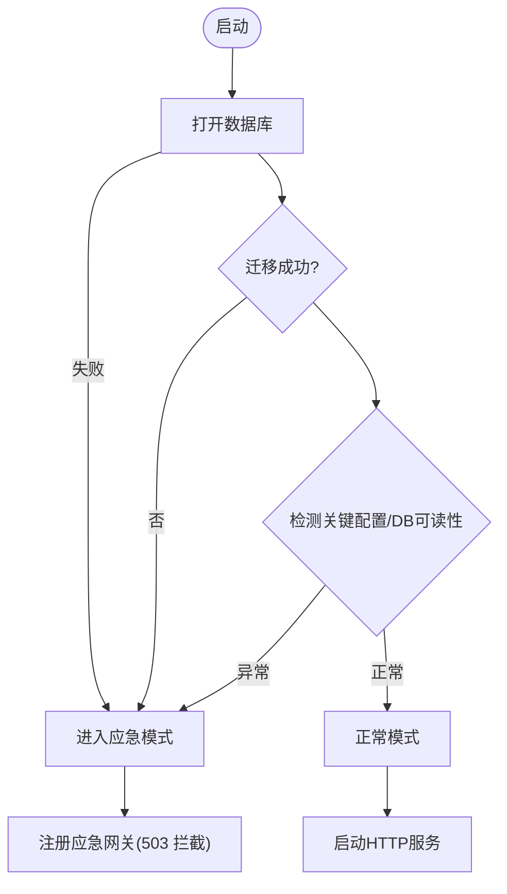
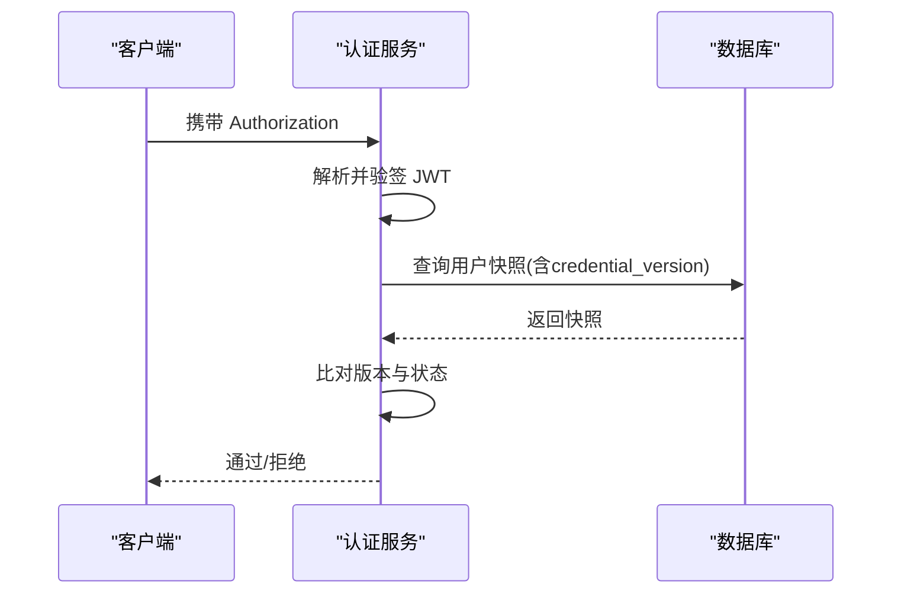
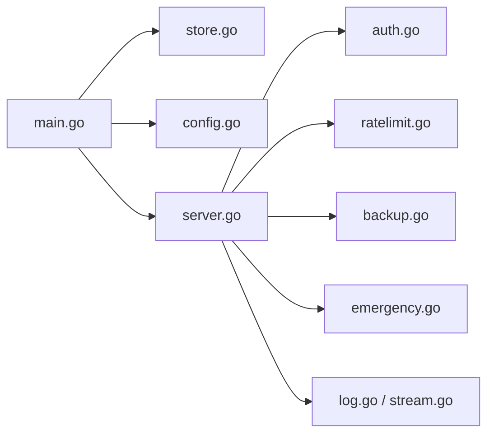

# 故障排除

<cite>
**本文引用的文件**
- [backend/cmd/server/main.go](file://backend/cmd/server/main.go)
- [backend/internal/emergency/emergency.go](file://backend/internal/emergency/emergency.go)
- [backend/internal/log/log.go](file://backend/internal/log/log.go)
- [backend/internal/log/stream.go](file://backend/internal/log/stream.go)
- [backend/internal/backup/backup.go](file://backend/internal/backup/backup.go)
- [backend/internal/auth/auth.go](file://backend/internal/auth/auth.go)
- [backend/internal/config/config.go](file://backend/internal/config/config.go)
- [backend/internal/store/store.go](file://backend/internal/store/store.go)
- [backend/internal/ratelimit/ratelimit.go](file://backend/internal/ratelimit/ratelimit.go)
- [backend/internal/response/response.go](file://backend/internal/response/response.go)
- [backend/internal/cron/cleanup.go](file://backend/internal/cron/cleanup.go)
- [backend/internal/server/server.go](file://backend/internal/server/server.go)
- [backend/internal/server/health.go](file://backend/internal/server/health.go)
- [backend/internal/server/status.go](file://backend/internal/server/status.go)
- [backend/internal/server/emergency_gate.go](file://backend/internal/server/emergency_gate.go)
</cite>

## 目录
1. [简介](#简介)
2. [项目结构](#项目结构)
3. [核心组件](#核心组件)
4. [架构总览](#架构总览)
5. [详细组件分析](#详细组件分析)
6. [依赖关系分析](#依赖关系分析)
7. [性能注意事项](#性能注意事项)
8. [故障排查指南](#故障排查指南)
9. [结论](#结论)
10. [附录](#附录)

## 简介
本指南面向系统管理员与运维人员，聚焦快速定位与解决系统问题。内容覆盖常见错误诊断、日志分析方法、性能瓶颈识别、内存泄漏检测、应急恢复机制、数据备份恢复、服务重启策略，以及典型故障场景（数据库损坏、认证失败、订阅更新异常）的解决方案；同时包含监控指标解读、告警配置建议与问题上报流程。

## 项目结构
后端采用分层与模块化设计：入口负责环境解析、日志初始化、数据库迁移、服务装配与优雅退出；业务域按功能划分（认证、配置、存储、备份、应急、限流、日志等）；HTTP 接入层统一注册路由、中间件与全局错误处理；前端通过 API 与状态端点交互。

**图表来源**
- [backend/cmd/server/main.go:24-99](file://backend/cmd/server/main.go#L24-L99)
- [backend/internal/server/server.go:62-158](file://backend/internal/server/server.go#L62-L158)
- [backend/internal/store/store.go:31-52](file://backend/internal/store/store.go#L31-L52)
- [backend/internal/log/log.go:40-57](file://backend/internal/log/log.go#L40-L57)

**章节来源**
- [backend/cmd/server/main.go:24-99](file://backend/cmd/server/main.go#L24-L99)
- [backend/internal/server/server.go:62-158](file://backend/internal/server/server.go#L62-L158)

## 核心组件
- 启动与应急模式：启动时探测数据库可读性与关键配置，自动进入应急模式并降级提供最小可用能力。
- 存储层：SQLite 单写者模型、WAL 模式、外键启用、迁移框架与事务助手。
- 认证与会话：JWT 签发/校验、凭据版本控制、会话中间件与管理员权限中间件。
- 配置服务：敏感配置 AES-GCM 加密、运行时级别切换、布尔/整数/JSON 数组读取。
- 日志系统：结构化日志、token 脱敏、环形缓冲与 SSE 实时日志流。
- 备份服务：一致性快照（VACUUM INTO/WAL checkpoint）、打包 contents/public。
- 限流：按 IP 固定窗口计数，支持运行时阈值配置与一键复位。
- 健康与状态：公开健康检查与系统状态端点，应急模式下返回 503。

**章节来源**
- [backend/cmd/server/main.go:24-99](file://backend/cmd/server/main.go#L24-L99)
- [backend/internal/store/store.go:31-52](file://backend/internal/store/store.go#L31-L52)
- [backend/internal/auth/auth.go:87-180](file://backend/internal/auth/auth.go#L87-L180)
- [backend/internal/config/config.go:220-361](file://backend/internal/config/config.go#L220-L361)
- [backend/internal/log/log.go:40-57](file://backend/internal/log/log.go#L40-L57)
- [backend/internal/log/stream.go:16-20](file://backend/internal/log/stream.go#L16-L20)
- [backend/internal/backup/backup.go:30-79](file://backend/internal/backup/backup.go#L30-L79)
- [backend/internal/ratelimit/ratelimit.go:17-23](file://backend/internal/ratelimit/ratelimit.go#L17-L23)
- [backend/internal/server/health.go:9-16](file://backend/internal/server/health.go#L9-L16)
- [backend/internal/server/status.go:39-78](file://backend/internal/server/status.go#L39-L78)

## 架构总览
系统以“启动→存储→服务装配→中间件→路由”为主线，结合应急模式与备份恢复形成高可用闭环。

**图表来源**
- [backend/cmd/server/main.go:40-99](file://backend/cmd/server/main.go#L40-L99)
- [backend/internal/server/server.go:160-193](file://backend/internal/server/server.go#L160-L193)
- [backend/internal/emergency/emergency.go:50-66](file://backend/internal/emergency/emergency.go#L50-L66)

## 详细组件分析

### 启动与应急模式
- 启动流程：环境变量解析→日志初始化→数据库打开与迁移→配置写入→服务装配→访问日志清理任务→信号驱动优雅退出。
- 应急模式触发：手动（环境变量）、数据库损坏或不可读、关键配置缺失（已标记 configured 但签名密钥缺失）。
- 应急模式能力分级：根据数据库是否可读提供不同能力（如重置管理员密码），并在非白名单路径返回 503。

**图表来源**
- [backend/cmd/server/main.go:40-99](file://backend/cmd/server/main.go#L40-L99)
- [backend/internal/emergency/emergency.go:50-66](file://backend/internal/emergency/emergency.go#L50-L66)
- [backend/internal/server/emergency_gate.go:12-41](file://backend/internal/server/emergency_gate.go#L12-L41)

**章节来源**
- [backend/cmd/server/main.go:40-99](file://backend/cmd/server/main.go#L40-L99)
- [backend/internal/emergency/emergency.go:50-66](file://backend/internal/emergency/emergency.go#L50-L66)
- [backend/internal/server/emergency_gate.go:12-41](file://backend/internal/server/emergency_gate.go#L12-L41)

### 存储层与迁移
- WAL 模式、外键开启、busy_timeout 设置，单写者模型避免并发写冲突。
- 迁移框架：按版本号顺序执行，单条迁移与版本记录在同一事务内，拒绝半迁移状态；数据库版本高于代码支持版本则拒绝启动。
- 事务助手：TxImmediate 用于先读后写的串行化场景。

**章节来源**
- [backend/internal/store/store.go:31-52](file://backend/internal/store/store.go#L31-L52)
- [backend/internal/store/store.go:62-128](file://backend/internal/store/store.go#L62-L128)
- [backend/internal/store/store.go:147-164](file://backend/internal/store/store.go#L147-L164)

### 认证与会话
- 密码哈希与复杂度校验；邮箱规范化。
- JWT 签发/解析：使用 HS256，载荷仅含用户 ID 与凭据版本；每次请求实时查库比对 credential_version 与账号状态。
- 中间件：会话校验 → 角色校验（admin）。

**图表来源**
- [backend/internal/auth/auth.go:98-135](file://backend/internal/auth/auth.go#L98-L135)
- [backend/internal/auth/auth.go:144-180](file://backend/internal/auth/auth.go#L144-L180)

**章节来源**
- [backend/internal/auth/auth.go:22-50](file://backend/internal/auth/auth.go#L22-L50)
- [backend/internal/auth/auth.go:98-180](file://backend/internal/auth/auth.go#L98-L180)

### 配置服务与安全
- 敏感配置 AES-256-GCM 加密，密钥由签名密钥经 HKDF 派生。
- 运行时读取布尔/整数/JSON 数组配置，解析失败回退默认值并记 warn。
- 确保签名密钥存在：为空则生成并落库。

**章节来源**
- [backend/internal/config/config.go:24-46](file://backend/internal/config/config.go#L24-L46)
- [backend/internal/config/config.go:220-361](file://backend/internal/config/config.go#L220-L361)

### 日志系统与实时监控
- 结构化日志：console/json 双格式，token 参数统一脱敏。
- 环形缓冲：最近 500 条，广播给活跃 SSE 订阅者（非阻塞）。
- 短期 Token：一次性、TTL 5 分钟，连接建立即删除。
- 连接上限：全局 8 个 SSE 连接。

**章节来源**
- [backend/internal/log/log.go:40-57](file://backend/internal/log/log.go#L40-L57)
- [backend/internal/log/stream.go:16-20](file://backend/internal/log/stream.go#L16-L20)
- [backend/internal/log/stream.go:130-154](file://backend/internal/log/stream.go#L130-L154)
- [backend/internal/log/stream.go:166-180](file://backend/internal/log/stream.go#L166-L180)

### 备份与恢复
- 一致性快照：优先 VACUUM INTO，不支持时降级为 WAL checkpoint 后拷贝主文件。
- 打包范围：app.db + contents（版本文件，保留符号链接）+ public（站点资源/安装包）。
- 恢复后启动自检：以 DB 为准重建「当前」指针。

**章节来源**
- [backend/internal/backup/backup.go:30-79](file://backend/internal/backup/backup.go#L30-L79)

### 限流与防刷
- 按 IP 固定窗口（分钟槽）计数，支持运行时阈值配置。
- 一键清空数据时同步复位内存态计数，防止误判。

**章节来源**
- [backend/internal/ratelimit/ratelimit.go:17-23](file://backend/internal/ratelimit/ratelimit.go#L17-L23)
- [backend/internal/ratelimit/ratelimit.go:40-60](file://backend/internal/ratelimit/ratelimit.go#L40-L60)
- [backend/internal/ratelimit/ratelimit.go:83-89](file://backend/internal/ratelimit/ratelimit.go#L83-L89)

### 健康检查与系统状态
- 健康检查：正常模式返回 ok；应急模式返回 503。
- 系统状态：暴露 configured/app_mode/emergency/本地登录开关/自注册/OIDC/验证码等信息。

**章节来源**
- [backend/internal/server/health.go:9-16](file://backend/internal/server/health.go#L9-L16)
- [backend/internal/server/server.go:171-174](file://backend/internal/server/server.go#L171-L174)
- [backend/internal/server/status.go:39-78](file://backend/internal/server/status.go#L39-L78)

## 依赖关系分析
- main 依赖 store/config/emergency/server/log/version/user 等模块进行装配。
- server 依赖 auth/setup/oidc/captcha/ratelimit/backup/export 等服务，并通过中间件链组合。
- emergency 依赖 dataclear 实现清库逻辑，并在应急模式提供能力分级。
- log 提供结构化输出与实时流，被 server 与业务模块复用。

**图表来源**
- [backend/cmd/server/main.go:12-22](file://backend/cmd/server/main.go#L12-L22)
- [backend/internal/server/server.go:14-38](file://backend/internal/server/server.go#L14-L38)

**章节来源**
- [backend/cmd/server/main.go:12-22](file://backend/cmd/server/main.go#L12-L22)
- [backend/internal/server/server.go:14-38](file://backend/internal/server/server.go#L14-L38)

## 性能注意事项
- SQLite 单写者模型与 WAL 模式减少写锁争用；迁移串行化避免并发冲突。
- 访问日志每日清理（90 天），避免表膨胀影响查询性能。
- 限流内存桶按分钟槽过期清理，防止内存泄漏。
- 日志环形缓冲容量受控，消费慢丢弃新消息，避免阻塞日志管道。
- 统一 panic 恢复，避免进程崩溃导致服务中断。

**章节来源**
- [backend/internal/store/store.go:31-52](file://backend/internal/store/store.go#L31-L52)
- [backend/internal/cron/cleanup.go:10-38](file://backend/internal/cron/cleanup.go#L10-L38)
- [backend/internal/ratelimit/ratelimit.go:62-71](file://backend/internal/ratelimit/ratelimit.go#L62-L71)
- [backend/internal/log/stream.go:30-58](file://backend/internal/log/stream.go#L30-L58)
- [backend/internal/server/server.go:225-237](file://backend/internal/server/server.go#L225-L237)

## 故障排查指南

### 常见错误诊断
- 数据库无法打开/迁移失败：启动日志出现“打开数据库失败/迁移失败”，自动进入应急模式；检查数据目录权限、磁盘空间与数据库完整性。
- 认证失败：401 响应，检查 Authorization 头、JWT 签名算法与密钥是否存在；核对用户状态与凭据版本。
- 限流触发：429 响应，查看 Retry-After 头；调整对应阈值的配置键。
- 内部错误：5xx 响应，生产环境对外隐藏详情，需查看服务端日志；调试模式可返回详细错误信息。

**章节来源**
- [backend/cmd/server/main.go:40-59](file://backend/cmd/server/main.go#L40-L59)
- [backend/internal/auth/auth.go:144-180](file://backend/internal/auth/auth.go#L144-L180)
- [backend/internal/ratelimit/ratelimit.go:40-60](file://backend/internal/ratelimit/ratelimit.go#L40-L60)
- [backend/internal/response/response.go:40-51](file://backend/internal/response/response.go#L40-L51)

### 日志分析方法
- 查看请求日志：方法、路径、状态码、耗时；注意 token 参数已被脱敏。
- 实时日志流：通过 SSE 订阅获取最近 500 条日志；连接数上限 8，Token 一次性且 TTL 5 分钟。
- 访问日志清理：超过 90 天的记录自动删除；若发现增长过快，检查高频接口与异常路径。

**章节来源**
- [backend/internal/server/server.go:211-223](file://backend/internal/server/server.go#L211-L223)
- [backend/internal/log/stream.go:16-20](file://backend/internal/log/stream.go#L16-L20)
- [backend/internal/log/stream.go:130-154](file://backend/internal/log/stream.go#L130-L154)
- [backend/internal/cron/cleanup.go:10-38](file://backend/internal/cron/cleanup.go#L10-L38)

### 性能瓶颈识别
- 关注 HTTP 请求耗时与 5xx 比例；定位慢接口与错误热点。
- 观察限流命中率与重试频率；必要时调整阈值。
- 监控 SQLite 忙等待与迁移执行时间；确认单写者模型下无长事务阻塞。

**章节来源**
- [backend/internal/server/server.go:211-223](file://backend/internal/server/server.go#L211-L223)
- [backend/internal/ratelimit/ratelimit.go:40-60](file://backend/internal/ratelimit/ratelimit.go#L40-L60)
- [backend/internal/store/store.go:62-128](file://backend/internal/store/store.go#L62-L128)

### 内存泄漏检测
- 限流内存桶按分钟槽清理；若发现持续增长，检查 gc 逻辑与时间同步。
- 日志环形缓冲容量受控，消费慢会丢弃；若内存仍增长，检查订阅者数量与连接管理。
- 应急操作码与短期 Token 均存于内存，进程重启后释放；若频繁创建未使用，关注调用方行为。

**章节来源**
- [backend/internal/ratelimit/ratelimit.go:62-71](file://backend/internal/ratelimit/ratelimit.go#L62-L71)
- [backend/internal/log/stream.go:30-58](file://backend/internal/log/stream.go#L30-L58)
- [backend/internal/emergency/emergency.go:91-116](file://backend/internal/emergency/emergency.go#L91-L116)
- [backend/internal/log/stream.go:130-154](file://backend/internal/log/stream.go#L130-L154)

### 应急恢复机制
- 触发原因：手动（环境变量）、数据库损坏、关键配置缺失。
- 能力分级：数据库可读时可重置管理员密码；不可读时提供重新初始化（全清）能力。
- 操作码：一次性、随机生成并输出到运行日志；提交后立即失效并重新生成。

**章节来源**
- [backend/internal/emergency/emergency.go:26-66](file://backend/internal/emergency/emergency.go#L26-L66)
- [backend/internal/emergency/emergency.go:91-116](file://backend/internal/emergency/emergency.go#L91-L116)
- [backend/internal/emergency/emergency.go:120-186](file://backend/internal/emergency/emergency.go#L120-L186)
- [backend/internal/emergency/emergency.go:188-213](file://backend/internal/emergency/emergency.go#L188-L213)

### 数据备份与恢复
- 备份：一致性快照（VACUUM INTO 或 WAL checkpoint）+ 打包 contents/public；不阻断正常服务。
- 恢复：解压后启动自检以 DB 为准重建「当前」指针；确保符号链接正确。
- 建议：定期备份并验证恢复流程；在变更前后各备份一次。

**章节来源**
- [backend/internal/backup/backup.go:30-79](file://backend/internal/backup/backup.go#L30-L79)

### 服务重启策略
- 正常模式：信号驱动优雅退出，等待在途请求收尾（超时 10 秒）。
- 应急模式：重置管理员密码或重新初始化成功后进程退出，由编排器拉起。
- 建议：滚动重启前执行备份；监控健康检查端点确认恢复。

**章节来源**
- [backend/internal/server/server.go:239-259](file://backend/internal/server/server.go#L239-L259)
- [backend/internal/emergency/emergency.go:165-186](file://backend/internal/emergency/emergency.go#L165-L186)

### 典型故障场景与解决方案
- 数据库损坏
  - 现象：启动报“打开数据库失败/迁移失败”，进入应急模式；健康检查返回 503。
  - 处理：查看运行日志中的应急操作码；选择重置管理员密码或重新初始化；恢复后验证迁移与健康检查。
  - 参考：应急检测、能力分级、重新初始化。

- 认证失败
  - 现象：401 响应，提示“会话凭据无效或已过期”。
  - 处理：检查 Authorization 头与签名密钥；确认用户状态与凭据版本；必要时重置密码并重新登录。
  - 参考：会话中间件、凭据版本校验。

- 订阅更新异常
  - 现象：订阅相关接口报错或下载失败。
  - 处理：检查版本组件与平台服务装配；确认订阅删除级联回调已注入；查看访问日志与错误日志定位具体步骤。
  - 参考：服务装配中订阅与版本组件注入、下载路由。

**章节来源**
- [backend/cmd/server/main.go:40-99](file://backend/cmd/server/main.go#L40-L99)
- [backend/internal/emergency/emergency.go:50-66](file://backend/internal/emergency/emergency.go#L50-L66)
- [backend/internal/auth/auth.go:144-180](file://backend/internal/auth/auth.go#L144-L180)
- [backend/internal/server/server.go:86-103](file://backend/internal/server/server.go#L86-L103)

### 监控指标解读与告警配置
- 健康检查：/health 正常返回 ok；应急模式返回 503。
- 系统状态：/api/system/status 暴露 configured/app_mode/emergency 等字段，便于前端与监控系统判断。
- 建议告警：
  - 健康检查连续失败（≥3 次）→ 立即告警。
  - 5xx 比例上升 → 告警并联动日志采集。
  - 限流命中率突增 → 告警并评估阈值。
  - 备份失败 → 告警并通知运维。

**章节来源**
- [backend/internal/server/health.go:9-16](file://backend/internal/server/health.go#L9-L16)
- [backend/internal/server/status.go:39-78](file://backend/internal/server/status.go#L39-L78)

### 问题上报流程
- 收集信息：健康检查与系统状态响应、最近 500 条日志（SSE 导出）、访问日志片段、错误堆栈（调试模式）。
- 初步定位：区分网络/鉴权/存储/业务链路；确认是否处于应急模式。
- 上报材料：时间线、请求 ID（如有）、关键配置键（脱敏）、备份文件（如需）。
- 协同处置：必要时执行备份恢复或重新初始化；变更后验证健康检查与核心流程。

[本节为通用流程说明，不直接分析具体文件]

## 结论
本系统通过启动自检、应急模式、备份恢复与统一日志/响应机制，构建了稳健的故障处理能力。管理员应熟悉健康检查与系统状态端点、日志分析方法、限流与备份策略，并结合典型故障场景快速定位与恢复。建议在变更前后执行备份与验证，持续优化监控与告警，提升整体可用性。

[本节为总结性内容，不直接分析具体文件]

## 附录
- 环境变量要点：APP_MODE、LOG_LEVEL、LOG_FORMAT、PORT、TRUST_PROXY、DATA_DIR、RESET_ADMIN_PASSWORD。
- 配置键要点：configured、signing_key、log_level、allow_local_login、allow_selfreg、selfreg_approval、admin_initialized、frontend_url、callback_url。
- 安全要点：token 脱敏、一次性操作码、短期 Token、AES-GCM 加密、HS256 签名。

**章节来源**
- [backend/cmd/server/main.go:24-35](file://backend/cmd/server/main.go#L24-L35)
- [backend/internal/config/config.go:24-37](file://backend/internal/config/config.go#L24-L37)
- [backend/internal/log/log.go:62-69](file://backend/internal/log/log.go#L62-L69)
- [backend/internal/emergency/emergency.go:91-116](file://backend/internal/emergency/emergency.go#L91-L116)
- [backend/internal/log/stream.go:130-154](file://backend/internal/log/stream.go#L130-L154)
- [backend/internal/config/config.go:220-361](file://backend/internal/config/config.go#L220-L361)
- [backend/internal/auth/auth.go:98-135](file://backend/internal/auth/auth.go#L98-L135)