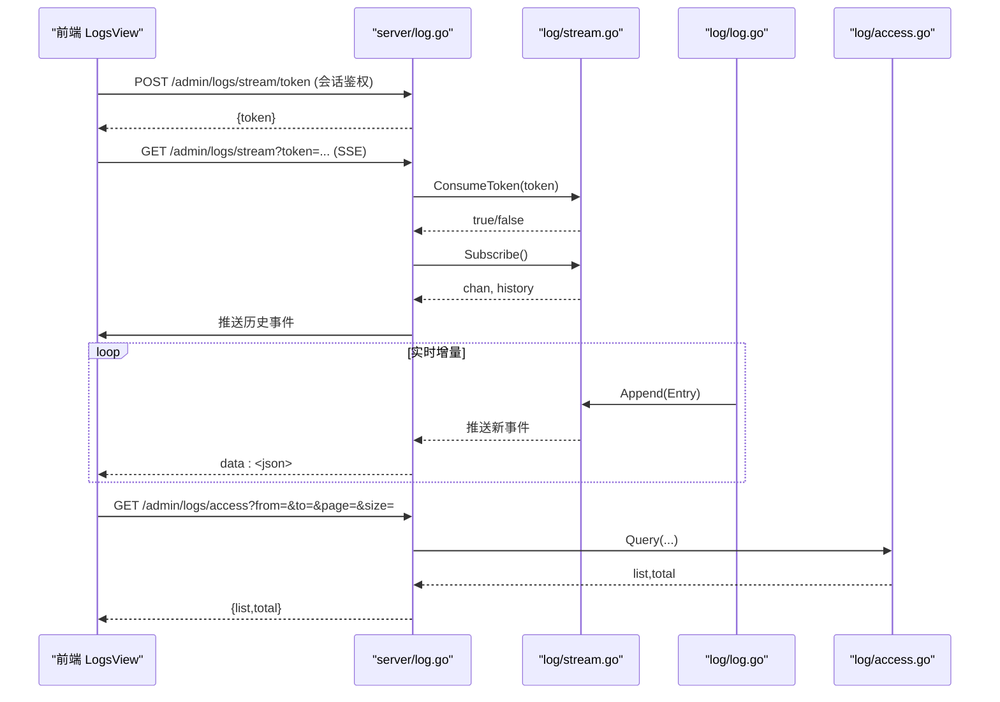
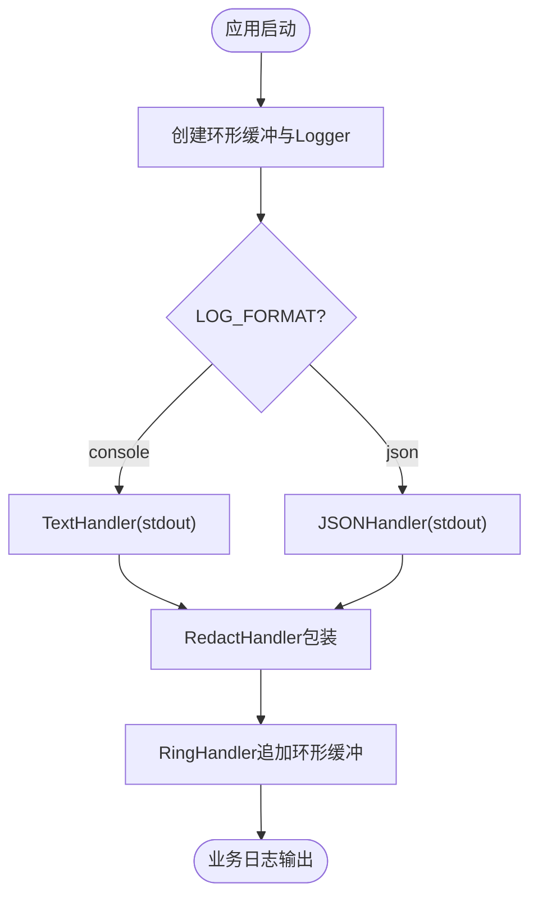
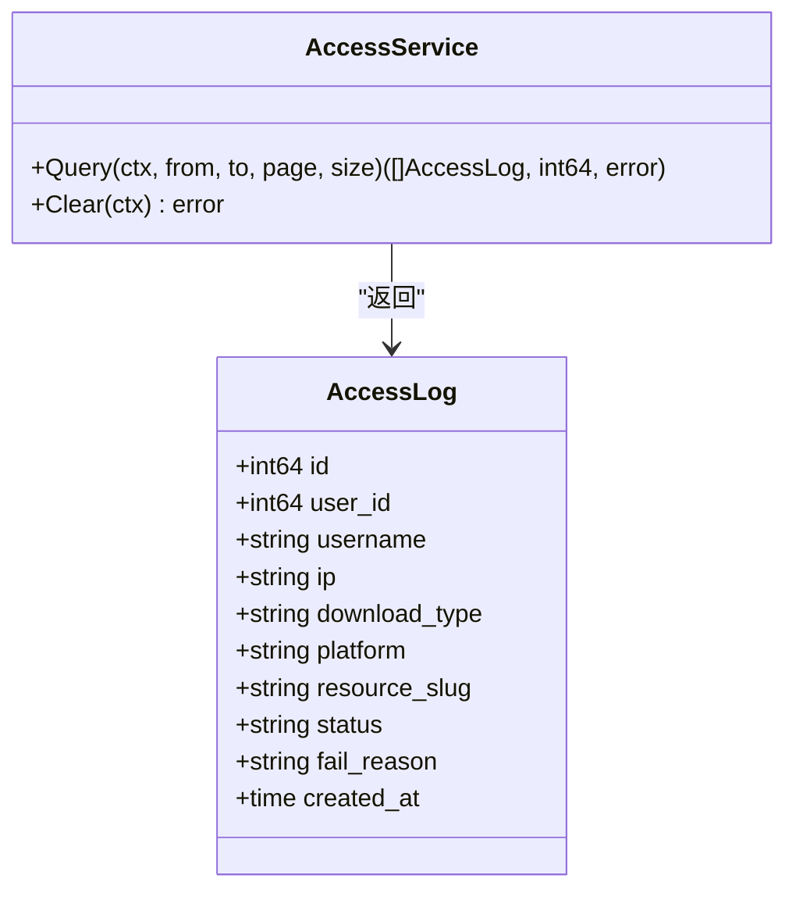
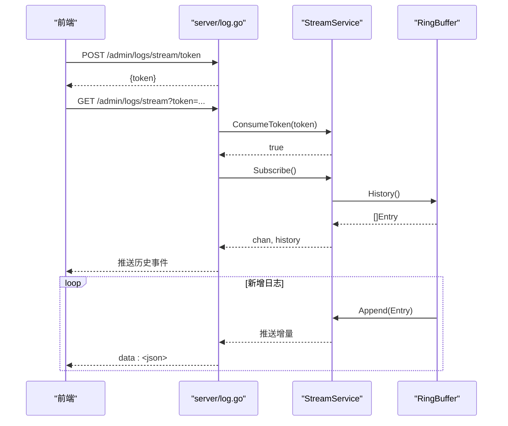
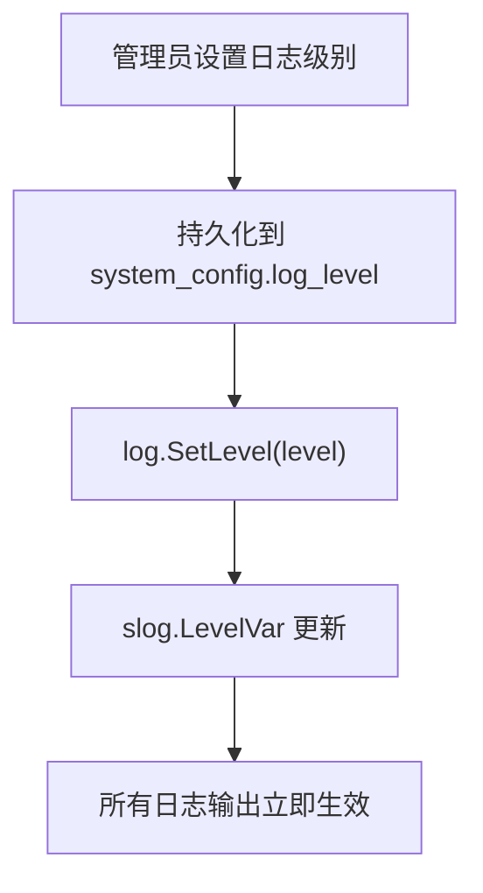
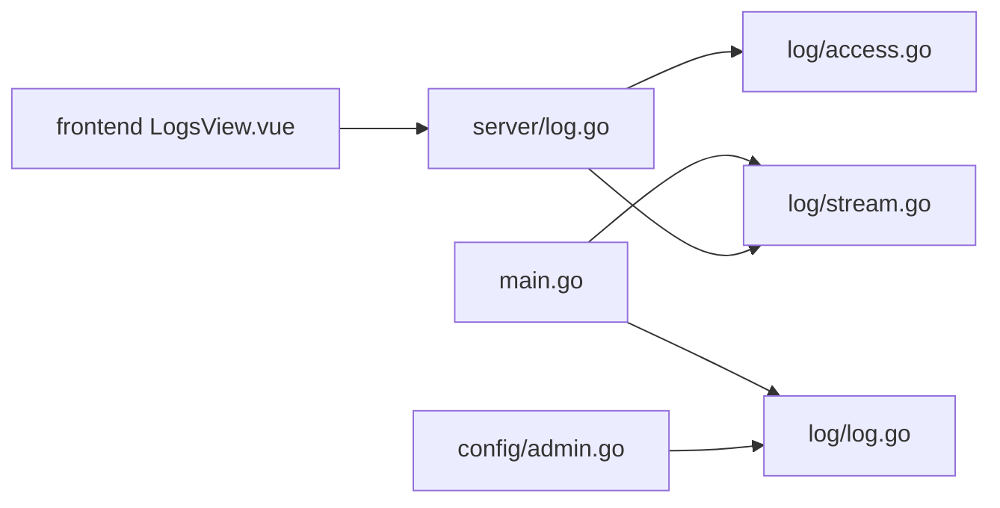

# 日志分析方法

<cite>
**本文引用的文件**
- [backend/cmd/server/main.go](file://backend/cmd/server/main.go)
- [backend/internal/log/log.go](file://backend/internal/log/log.go)
- [backend/internal/log/access.go](file://backend/internal/log/access.go)
- [backend/internal/log/stream.go](file://backend/internal/log/stream.go)
- [backend/internal/server/log.go](file://backend/internal/server/log.go)
- [backend/internal/config/admin.go](file://backend/internal/config/admin.go)
- [backend/internal/config/config.go](file://backend/internal/config/config.go)
- [backend/migrations/1004_tokens.sql](file://backend/migrations/1004_tokens.sql)
- [frontend/src/views/admin/LogsView.vue](file://frontend/src/views/admin/LogsView.vue)
- [frontend/src/api/log.ts](file://frontend/src/api/log.ts)
</cite>

## 目录
1. [简介](#简介)
2. [项目结构](#项目结构)
3. [核心组件](#核心组件)
4. [架构总览](#架构总览)
5. [详细组件分析](#详细组件分析)
6. [依赖关系分析](#依赖关系分析)
7. [性能与容量特性](#性能与容量特性)
8. [故障排查指南](#故障排查指南)
9. [结论](#结论)
10. [附录：常用查询与运维命令](#附录：常用查询与运维命令)

## 简介
本指南面向系统管理员与运维人员，系统化说明该系统的日志体系：日志分级、输出格式、访问日志与运行日志的查看与分析方法；实时日志流（SSE）的使用；日志级别切换与持久化；以及常见错误模式识别与性能瓶颈定位建议。文档同时给出前端界面操作路径与后端接口说明，便于快速上手。

## 项目结构
日志相关代码主要分布在后端日志包、服务端路由、配置管理、数据库迁移脚本以及前端日志查看页面中。整体组织方式如下：
- 日志核心能力：分级、脱敏、双格式输出、环形缓冲、SSE 推送
- 访问日志：按日期范围分页查询、清空
- 实时日志流：一次性短期 Token + SSE 连接管理 + 历史回放
- 配置管理：日志级别运行时切换并持久化
- 前端：访问日志表格与实时日志流终端视图

```mermaid
graph TB
subgraph "后端"
A["main.go<br/>启动与初始化"] --> B["log/log.go<br/>分级/脱敏/格式化"]
B --> C["log/stream.go<br/>环形缓冲+SSE服务"]
B --> D["log/access.go<br/>访问日志服务"]
E["server/log.go<br/>日志API端点"] --> C
E --> D
F["config/admin.go<br/>日志级别设置"] --> B
G["migrations/1004_tokens.sql<br/>access_logs表"] --> D
end
subgraph "前端"
H["LogsView.vue<br/>访问日志/实时流UI"] --> I["api/log.ts<br/>日志接口封装"]
I --> E
end
```

图表来源
- [backend/cmd/server/main.go:24-37](file://backend/cmd/server/main.go#L24-L37)
- [backend/internal/log/log.go:40-57](file://backend/internal/log/log.go#L40-L57)
- [backend/internal/log/stream.go:16-28](file://backend/internal/log/stream.go#L16-L28)
- [backend/internal/log/access.go:16-39](file://backend/internal/log/access.go#L16-L39)
- [backend/internal/server/log.go:21-30](file://backend/internal/server/log.go#L21-L30)
- [backend/internal/config/admin.go:507-527](file://backend/internal/config/admin.go#L507-L527)
- [backend/migrations/1004_tokens.sql:34-46](file://backend/migrations/1004_tokens.sql#L34-L46)
- [frontend/src/views/admin/LogsView.vue:1-10](file://frontend/src/views/admin/LogsView.vue#L1-L10)
- [frontend/src/api/log.ts:1-29](file://frontend/src/api/log.ts#L1-L29)

章节来源
- [backend/cmd/server/main.go:24-37](file://backend/cmd/server/main.go#L24-L37)
- [backend/internal/log/log.go:40-57](file://backend/internal/log/log.go#L40-L57)
- [backend/internal/log/stream.go:16-28](file://backend/internal/log/stream.go#L16-L28)
- [backend/internal/log/access.go:16-39](file://backend/internal/log/access.go#L16-L39)
- [backend/internal/server/log.go:21-30](file://backend/internal/server/log.go#L21-L30)
- [backend/internal/config/admin.go:507-527](file://backend/internal/config/admin.go#L507-L527)
- [backend/migrations/1004_tokens.sql:34-46](file://backend/migrations/1004_tokens.sql#L34-L46)
- [frontend/src/views/admin/LogsView.vue:1-10](file://frontend/src/views/admin/LogsView.vue#L1-L10)
- [frontend/src/api/log.ts:1-29](file://frontend/src/api/log.ts#L1-L29)

## 核心组件
- 结构化日志与分级控制：支持 debug/info/warn/error 四级，运行时切换立即生效；支持 console 文本与 JSON 两种输出格式；内置 token 参数脱敏。
- 访问日志服务：基于 access_logs 表，提供按日期范围分页查询与清空能力。
- 实时日志流服务：内存环形缓冲（最近 500 条），SSE 推送历史与增量；一次性短期 Token 鉴权；全局最多 8 个并发连接。
- 日志 API：访问日志查询/清空、短期 Token 发放、SSE 流。
- 配置管理：日志级别持久化到 system_config，并通过 LevelVar 即时生效。
- 前端日志查看：访问日志表格与实时日志流终端视图，支持级别过滤、暂停/继续、清屏等。

章节来源
- [backend/internal/log/log.go:21-57](file://backend/internal/log/log.go#L21-L57)
- [backend/internal/log/access.go:16-123](file://backend/internal/log/access.go#L16-L123)
- [backend/internal/log/stream.go:16-208](file://backend/internal/log/stream.go#L16-L208)
- [backend/internal/server/log.go:21-113](file://backend/internal/server/log.go#L21-L113)
- [backend/internal/config/admin.go:507-527](file://backend/internal/config/admin.go#L507-L527)
- [frontend/src/views/admin/LogsView.vue:66-147](file://frontend/src/views/admin/LogsView.vue#L66-L147)

## 架构总览
系统启动时创建环形缓冲与统一 logger，所有业务日志经 slog 管道输出至 stdout，并同时写入环形缓冲供 SSE 使用。访问日志通过独立服务读写数据库。前端通过 REST 接口获取访问日志，通过 SSE 订阅实时日志流。

图表来源
- [backend/internal/server/log.go:21-113](file://backend/internal/server/log.go#L21-L113)
- [backend/internal/log/stream.go:117-208](file://backend/internal/log/stream.go#L117-L208)
- [backend/internal/log/access.go:41-123](file://backend/internal/log/access.go#L41-L123)
- [backend/internal/log/log.go:40-57](file://backend/internal/log/log.go#L40-L57)

## 详细组件分析

### 日志核心：分级、格式化与脱敏
- 分级控制：通过全局 LevelVar 实现运行时切换，调用 SetLevel 后立即影响所有日志输出。
- 输出格式：根据 LOG_FORMAT 选择 TextHandler 或 JSONHandler，均输出至 stdout。
- 安全脱敏：RedactHandler 对消息与字符串属性中的 token 查询参数值进行替换，避免敏感信息泄露。
- 默认 Logger：main 启动时创建并设置为默认，业务模块可直接使用包级便捷函数。

图表来源
- [backend/cmd/server/main.go:33-37](file://backend/cmd/server/main.go#L33-L37)
- [backend/internal/log/log.go:40-57](file://backend/internal/log/log.go#L40-L57)
- [backend/internal/log/stream.go:67-98](file://backend/internal/log/stream.go#L67-L98)

章节来源
- [backend/internal/log/log.go:21-57](file://backend/internal/log/log.go#L21-L57)
- [backend/cmd/server/main.go:33-37](file://backend/cmd/server/main.go#L33-L37)

### 访问日志：结构与查询
- 数据模型：access_logs 表包含用户ID、IP、下载类型、平台、资源标识、状态、失败原因、时间戳等字段。
- 查询能力：支持 from/to 日期范围筛选（YYYY-MM-DD），后端分页（默认20条/页，最大100）。
- 清空能力：一键清空全部访问日志记录，需二次确认。
- 自动清理：90 天定时任务负责清理过期访问日志。

图表来源
- [backend/internal/log/access.go:16-123](file://backend/internal/log/access.go#L16-L123)
- [backend/migrations/1004_tokens.sql:34-46](file://backend/migrations/1004_tokens.sql#L34-L46)

章节来源
- [backend/internal/log/access.go:16-123](file://backend/internal/log/access.go#L16-L123)
- [backend/migrations/1004_tokens.sql:34-46](file://backend/migrations/1004_tokens.sql#L34-L46)

### 实时日志流：环形缓冲与SSE
- 环形缓冲：固定容量（最近 500 条），满后覆盖最旧；定期紧凑化防止内存缓慢增长。
- SSE 认证：一次性短期 Token（≥128位），未使用 5 分钟 TTL 过期；连接建立即删除 Token。
- 连接上限：全局最多 8 个 SSE 连接，超出返回 429。
- 历史回放：新连接先推送缓冲历史，再推送增量；断开自动清理订阅。

图表来源
- [backend/internal/log/stream.go:16-208](file://backend/internal/log/stream.go#L16-L208)
- [backend/internal/server/log.go:53-113](file://backend/internal/server/log.go#L53-L113)

章节来源
- [backend/internal/log/stream.go:16-208](file://backend/internal/log/stream.go#L16-L208)
- [backend/internal/server/log.go:53-113](file://backend/internal/server/log.go#L53-L113)

### 日志级别切换与持久化
- 配置键：system_config.log_level 存储当前日志级别。
- 运行时切换：SetLogLevel 持久化并调用 log.SetLevel，LevelVar 立即生效，无需重启。
- 前端面板：在设置分区提供日志级别单选（debug/info/warn/error）。

图表来源
- [backend/internal/config/admin.go:507-527](file://backend/internal/config/admin.go#L507-L527)
- [backend/internal/log/log.go:21-33](file://backend/internal/log/log.go#L21-L33)

章节来源
- [backend/internal/config/admin.go:507-527](file://backend/internal/config/admin.go#L507-L527)
- [backend/internal/log/log.go:21-33](file://backend/internal/log/log.go#L21-L33)

### 前端日志查看界面
- 访问日志页签：日期范围选择器、查询按钮、分页列表、清空日志（危险操作二次确认）。
- 实时日志流页签：级别过滤、暂停/继续、清屏、连接状态指示；终端风深色底、等宽字体、级别色块。
- 自动重连：断线提示并重连，多次失败提示可能达到连接数上限。

章节来源
- [frontend/src/views/admin/LogsView.vue:11-147](file://frontend/src/views/admin/LogsView.vue#L11-L147)
- [frontend/src/api/log.ts:1-29](file://frontend/src/api/log.ts#L1-L29)

## 依赖关系分析
- main 初始化日志与环形缓冲，注入 StreamService 到 server。
- server/log.go 暴露日志相关 API，依赖 AccessService 与 StreamService。
- config/admin.go 提供日志级别设置，调用 log.SetLevel 实现运行时切换。
- log/access.go 直接依赖 *sql.DB 访问 access_logs 表，避免循环依赖。
- 前端通过 api/log.ts 调用后端接口，LogsView.vue 渲染界面。

图表来源
- [backend/cmd/server/main.go:33-37](file://backend/cmd/server/main.go#L33-L37)
- [backend/internal/server/log.go:21-30](file://backend/internal/server/log.go#L21-L30)
- [backend/internal/config/admin.go:507-527](file://backend/internal/config/admin.go#L507-L527)
- [frontend/src/views/admin/LogsView.vue:1-10](file://frontend/src/views/admin/LogsView.vue#L1-L10)

章节来源
- [backend/cmd/server/main.go:33-37](file://backend/cmd/server/main.go#L33-L37)
- [backend/internal/server/log.go:21-30](file://backend/internal/server/log.go#L21-L30)
- [backend/internal/config/admin.go:507-527](file://backend/internal/config/admin.go#L507-L527)
- [frontend/src/views/admin/LogsView.vue:1-10](file://frontend/src/views/admin/LogsView.vue#L1-L10)

## 性能与容量特性
- 环形缓冲容量：固定 500 条，满后覆盖最旧；当底层切片容量超过 4 倍缓冲大小时会紧凑化，防止内存缓慢膨胀。
- SSE 连接上限：全局最多 8 个连接，超出返回 429，避免过多长连接影响服务器资源。
- 非阻塞广播：环形缓冲向订阅者推送采用非阻塞通道，消费慢则丢弃，确保日志管道不被拖慢。
- 前端渲染上限：实时日志流在前端保留最多 1000 条，避免浏览器卡顿。
- 访问日志分页：默认 20 条/页，最大 100 条/页，减少单次响应体积。

章节来源
- [backend/internal/log/stream.go:16-58](file://backend/internal/log/stream.go#L16-L58)
- [backend/internal/log/stream.go:166-180](file://backend/internal/log/stream.go#L166-L180)
- [backend/internal/log/access.go:41-51](file://backend/internal/log/access.go#L41-L51)
- [frontend/src/views/admin/LogsView.vue:90-96](file://frontend/src/views/admin/LogsView.vue#L90-L96)

## 故障排查指南
- 无法连接实时日志流
  - 现象：SSE 连接失败或频繁重连。
  - 可能原因：短期 Token 无效或已过期；连接数已达上限（8）；网络中断。
  - 处理：重新换取 Token；关闭其他日志页释放连接；检查网络。
  - 参考：[backend/internal/server/log.go:63-73](file://backend/internal/server/log.go#L63-L73)、[backend/internal/log/stream.go:130-154](file://backend/internal/log/stream.go#L130-L154)

- 访问日志为空
  - 现象：查询无记录。
  - 可能原因：所选日期范围无访问；尚未产生下载行为；被 90 天清理任务清除。
  - 处理：调整日期范围；触发下载行为；确认清理策略。
  - 参考：[backend/internal/log/access.go:41-92](file://backend/internal/log/access.go#L41-L92)

- 日志级别不生效
  - 现象：设置日志级别后仍为默认级别。
  - 可能原因：未正确持久化；SetLevel 未被调用。
  - 处理：通过设置面板保存日志级别；确认后端已调用 log.SetLevel。
  - 参考：[backend/internal/config/admin.go:517-527](file://backend/internal/config/admin.go#L517-L527)、[backend/internal/log/log.go:21-33](file://backend/internal/log/log.go#L21-L33)

- 敏感信息泄露风险
  - 现象：日志中出现 token 明文。
  - 处理：确认 RedactHandler 已启用；检查日志输出是否经过统一 logger。
  - 参考：[backend/internal/log/log.go:62-117](file://backend/internal/log/log.go#L62-L117)

章节来源
- [backend/internal/server/log.go:63-73](file://backend/internal/server/log.go#L63-L73)
- [backend/internal/log/stream.go:130-154](file://backend/internal/log/stream.go#L130-L154)
- [backend/internal/log/access.go:41-92](file://backend/internal/log/access.go#L41-L92)
- [backend/internal/config/admin.go:517-527](file://backend/internal/config/admin.go#L517-L527)
- [backend/internal/log/log.go:62-117](file://backend/internal/log/log.go#L62-L117)

## 结论
该系统提供了完善的日志能力：结构化分级日志、访问日志查询与清理、实时日志流 SSE 推送、运行时日志级别切换与持久化。通过环形缓冲与连接上限控制，兼顾了实时性与性能。前端提供了直观的日志查看界面，便于日常运维与问题定位。建议在生产环境保持 info 级别，仅在排障时临时切换到 debug，并及时恢复以减少噪音。

## 附录：常用查询与运维命令
- 查看访问日志
  - 前端：进入“日志查看”→“访问日志”，选择日期范围并点击查询。
  - 接口：GET /api/admin/logs/access?from=YYYY-MM-DD&to=YYYY-MM-DD&page=1&size=20
  - 参考：[backend/internal/server/log.go:32-42](file://backend/internal/server/log.go#L32-L42)、[frontend/src/views/admin/LogsView.vue:26-43](file://frontend/src/views/admin/LogsView.vue#L26-L43)

- 清空访问日志
  - 前端：点击“清空日志”，二次确认后执行。
  - 接口：POST /api/admin/logs/access/clear
  - 参考：[backend/internal/server/log.go:44-51](file://backend/internal/server/log.go#L44-L51)

- 开启实时日志流
  - 前端：进入“日志查看”→“实时日志流”，自动换取 Token 并连接。
  - 接口：POST /api/admin/logs/stream/token → GET /api/admin/logs/stream?token=...
  - 参考：[backend/internal/server/log.go:53-113](file://backend/internal/server/log.go#L53-L113)、[frontend/src/views/admin/LogsView.vue:80-115](file://frontend/src/views/admin/LogsView.vue#L80-L115)

- 切换日志级别
  - 前端：设置面板→日志级别，选择 debug/info/warn/error 并保存。
  - 后端：SetLogLevel 持久化并调用 log.SetLevel。
  - 参考：[backend/internal/config/admin.go:507-527](file://backend/internal/config/admin.go#L507-L527)

- 查看日志输出格式
  - 环境变量：LOG_LEVEL（默认 info）、LOG_FORMAT（默认 console）。
  - 参考：[backend/cmd/server/main.go:24-37](file://backend/cmd/server/main.go#L24-L37)

- 访问日志表结构
  - 表名：access_logs
  - 关键字段：user_id、ip、download_type、platform、resource_slug、status、fail_reason、created_at
  - 参考：[backend/migrations/1004_tokens.sql:34-46](file://backend/migrations/1004_tokens.sql#L34-L46)