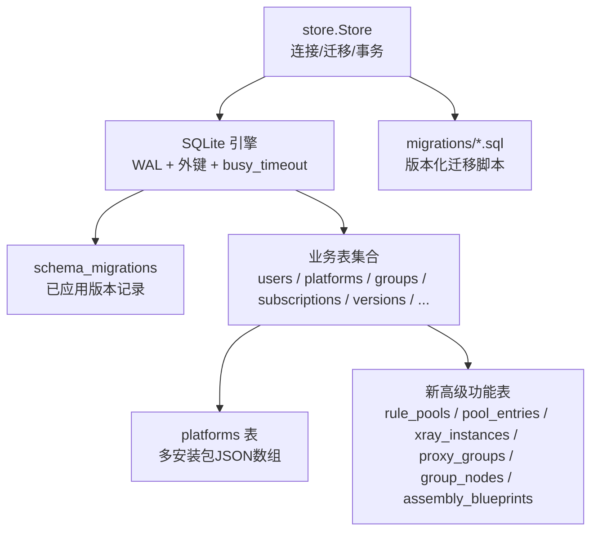
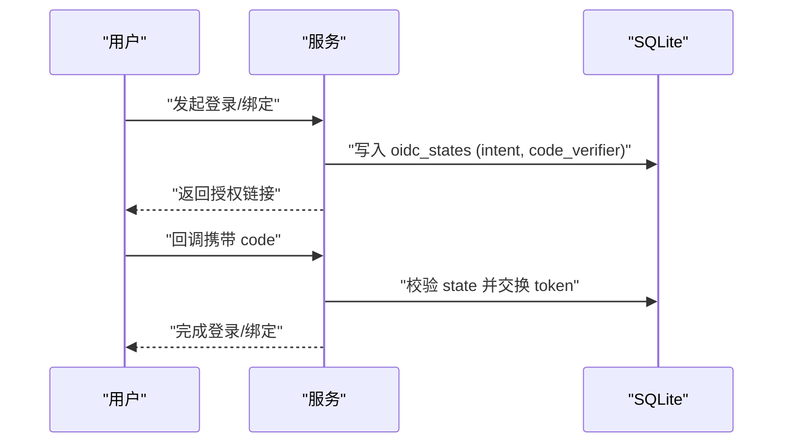
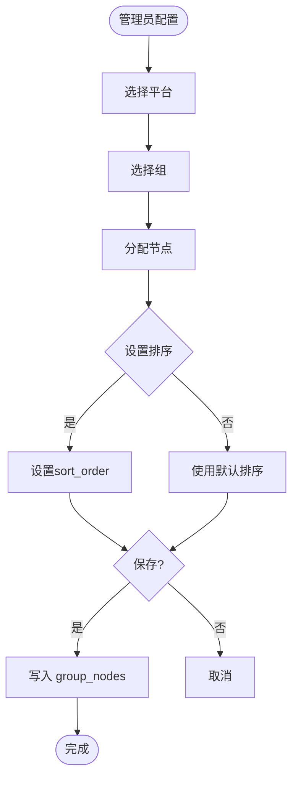
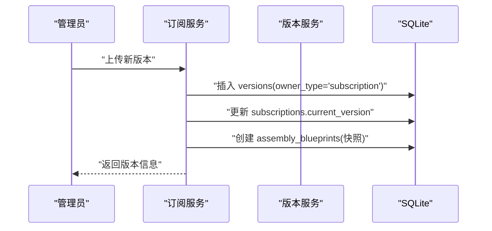
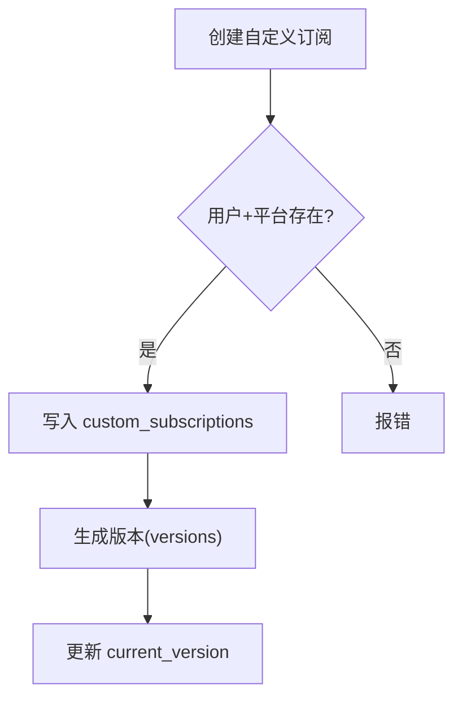
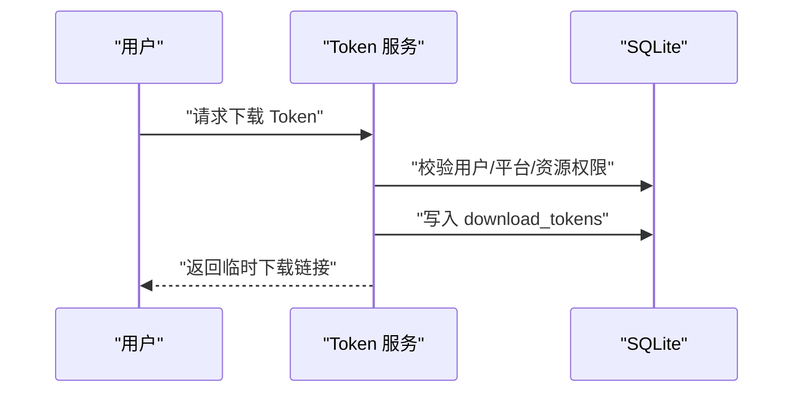
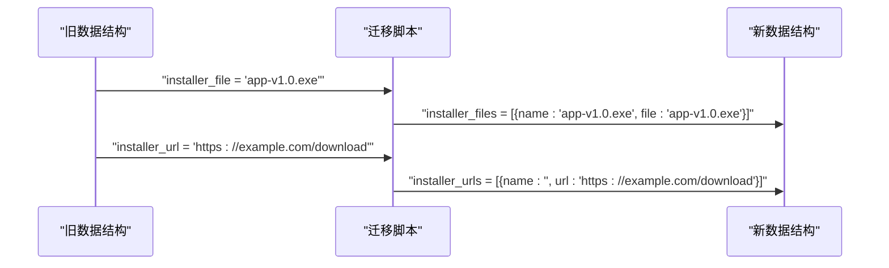
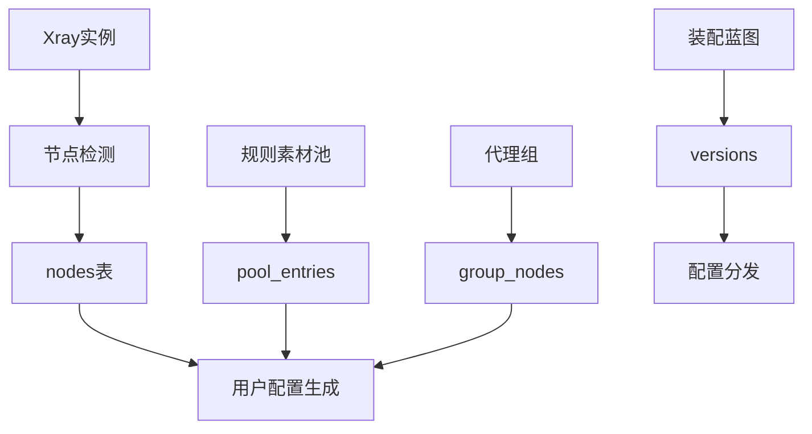
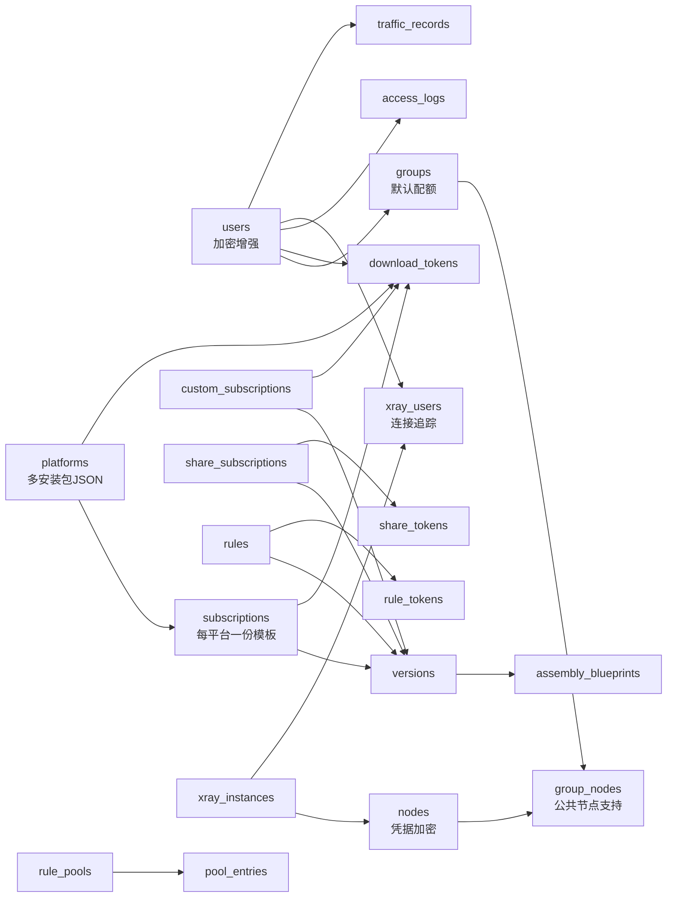

# 数据库设计

<cite>
**本文引用的文件**
- [backend/migrations/0001_init.sql](file://backend/migrations/0001_init.sql)
- [backend/migrations/0002_users.sql](file://backend/migrations/0002_users.sql)
- [backend/migrations/0003_groups_platforms.sql](file://backend/migrations/0003_groups_platforms.sql)
- [backend/migrations/0004_oidc.sql](file://backend/migrations/0004_oidc.sql)
- [backend/migrations/0005_reset_tokens.sql](file://backend/migrations/0005_reset_tokens.sql)
- [backend/migrations/1001_platforms.sql](file://backend/migrations/1001_platforms.sql)
- [backend/migrations/1002_subscriptions_versions.sql](file://backend/migrations/1002_subscriptions_versions.sql)
- [backend/migrations/1003_groups.sql](file://backend/migrations/1003_groups.sql)
- [backend/migrations/1004_tokens.sql](file://backend/migrations/1004_tokens.sql)
- [backend/migrations/1005_custom_share.sql](file://backend/migrations/1005_custom_share.sql)
- [backend/migrations/1006_rules.sql](file://backend/migrations/1006_rules.sql)
- [backend/migrations/1007_versions_filename.sql](file://backend/migrations/1007_versions_filename.sql)
- [backend/migrations/1008_platform_installers_multi.sql](file://backend/migrations/1008_platform_installers_multi.sql)
- [backend/internal/store/store.go](file://backend/internal/store/store.go)
- [backend/internal/platform/platform.go](file://backend/internal/platform/platform.go)
- [backend/internal/subscription/subscription.go](file://backend/internal/subscription/subscription.go)
- [backend/internal/server/subscription.go](file://backend/internal/server/subscription.go)
- [Design2.md](file://Design2.md)
</cite>

## 更新摘要
**变更内容**
- 订阅模板数据模型重构：从多订阅模式改为每平台一份订阅模板（UNIQUE(platform_id) + product_type）
- xray_users表增强：新增连接信息追踪字段，支持复合主键(user_id, instance_id, inbound_tag)
- group_nodes结构改进：支持公共节点自动可见功能，优化组与节点的分配关系
- 高级功能模块：新增Xray实例管理、规则素材池、代理组配置等高级功能表结构

## 目录
1. [简介](#简介)
2. [项目结构](#项目结构)
3. [核心组件](#核心组件)
4. [架构总览](#架构总览)
5. [详细组件分析](#详细组件分析)
6. [依赖关系分析](#依赖关系分析)
7. [性能考虑](#性能考虑)
8. [故障排查指南](#故障排查指南)
9. [结论](#结论)
10. [附录](#附录)

## 简介
本数据库设计文档面向 VPN 订阅管理系统的 SQLite 嵌入式数据层，覆盖实体表（用户、订阅、平台、组、版本等）的字段定义、数据类型、约束与索引；说明表间关系、外键约束与数据完整性规则；提供 ER 图与关键数据流图；并给出迁移策略、版本管理、备份恢复机制、性能优化建议、查询模式分析与数据生命周期管理。

**最新更新**：系统已完成订阅模板数据模型重构，采用每平台一份订阅模板的新模式，同时增强了xray_users表的连接信息追踪功能，改进了group_nodes结构以支持公共节点自动可见特性。

## 项目结构
后端使用 Go + modernc.org/sqlite 驱动，采用 WAL 模式与单写者模型，通过内嵌迁移脚本实现版本化 schema 演进。迁移文件位于 backend/migrations，由 store 包在启动时按版本号顺序应用，确保幂等与一致性。



**图表来源**
- [backend/internal/store/store.go:31-52](file://backend/internal/store/store.go#L31-L52)
- [backend/internal/store/store.go:62-128](file://backend/internal/store/store.go#L62-L128)
- [backend/migrations/0001_init.sql:1-13](file://backend/migrations/0001_init.sql#L1-L13)

**章节来源**
- [backend/internal/store/store.go:31-52](file://backend/internal/store/store.go#L31-L52)
- [backend/internal/store/store.go:62-128](file://backend/internal/store/store.go#L62-L128)
- [backend/migrations/0001_init.sql:1-13](file://backend/migrations/0001_init.sql#L1-L13)

## 核心组件
- 存储抽象：Store 封装数据库连接、迁移执行、事务工具（立即事务）。
- 迁移框架：基于 schema_migrations 的版本登记，按文件名前缀数字升序执行未应用迁移，失败即拒绝启动，防止半迁移状态。
- 安全与并发：WAL 模式、开启外键检查、busy_timeout 防忙锁、单写者模型（MaxOpenConns=1）、DSN 参数启用立即事务。

**章节来源**
- [backend/internal/store/store.go:31-52](file://backend/internal/store/store.go#L31-L52)
- [backend/internal/store/store.go:62-128](file://backend/internal/store/store.go#L62-L128)
- [backend/internal/store/store.go:147-164](file://backend/internal/store/store.go#L147-L164)

## 架构总览
下图展示系统主要实体及其关系，包括用户、组、平台、订阅、版本、自定义/分享订阅、规则、各类 Token 与访问日志，以及新增的高级功能表。

```mermaid
erDiagram
users {
integer id PK
text oidc_subject UK
text username
text email UK
text role
integer group_id FK
text password_hash
text user_source
text status
integer credential_version
text oidc_claims
text uuid_encrypted
text proxy_secret_encrypted
text quota_override
text expire_at
text quota_exceeded
timestamp created_at
timestamp updated_at
}
groups {
integer id PK
text slug UK
text name UK
integer is_default
integer needs_reselect
integer default_quota
timestamp created_at
timestamp updated_at
}
platforms {
integer id PK
text slug UK
text name
text description
text schemes
text extra_headers
text installer_files JSON
text installer_urls JSON
timestamp created_at
timestamp updated_at
}
subscriptions {
integer id PK
text slug UK
integer platform_id FK
integer current_version
timestamp created_at
timestamp updated_at
}
versions {
integer id PK
text owner_type
integer owner_id
integer version_no
text file_path
text file_name
timestamp created_at
timestamp updated_at
}
custom_subscriptions {
integer id PK
text slug UK
integer user_id FK
integer platform_id FK
integer current_version
timestamp created_at
timestamp updated_at
}
share_subscriptions {
integer id PK
text slug UK
text name
integer current_version
text token_status
timestamp created_at
timestamp updated_at
}
rules {
integer id PK
text slug UK
text name
text client_type
text schemes
integer current_version
timestamp created_at
timestamp updated_at
}
download_tokens {
integer id PK
text token UK
integer user_id FK
integer platform_id FK
integer custom_sub_id FK
integer subscription_id FK
timestamp created_at
timestamp updated_at
}
share_tokens {
integer id PK
text token UK
integer share_id FK
timestamp created_at
}
rule_tokens {
integer id PK
text token UK
integer rule_id FK
timestamp created_at
timestamp refreshed_at
}
access_logs {
integer id PK
integer user_id
text ip
text download_type
text platform
text resource_slug
text status
text fail_reason
timestamp created_at
}
rule_pools {
integer id PK
text name
text urls_json
timestamp last_synced_at
text sync_status
text sync_error
integer auto_sync
text sync_time
}
pool_entries {
integer id PK
integer pool_id FK
text rule_type
text match_value
text source
}
xray_instances {
integer id PK
text name
text api_addr
text api_tag
integer enabled
timestamp last_collect_at
text collect_status
text collect_error
}
nodes {
integer id PK
text source
text name
integer instance_id FK
text tag
text protocol
text host
integer port
text protocol_json
integer is_public
integer enabled
}
proxy_groups {
integer id PK
text name
text type
text preset_key
text definition_json
}
group_nodes {
integer group_id FK
integer node_id FK
integer sort_order
}
assembly_blueprints {
integer version_id PK FK
text target_syntax
text fixed_params_json
text selection_json
text custom_rules_json
}
xray_users {
integer user_id FK
integer instance_id FK
text inbound_tag
text email
text sync_status
text last_error
}
traffic_records {
integer user_id FK
text ym
integer uplink
integer downlink
}
users ||--o{ groups : "所属"
platforms ||--o{ subscriptions : "提供"
subscriptions ||--o{ versions : "拥有"
custom_subscriptions ||--o{ versions : "拥有"
share_subscriptions ||--o{ versions : "拥有"
rules ||--o{ versions : "拥有"
users ||--o{ download_tokens : "生成"
platforms ||--o{ download_tokens : "目标"
custom_subscriptions ||--o{ download_tokens : "可选"
subscriptions ||--o{ download_tokens : "可选"
share_subscriptions ||--o{ share_tokens : "绑定"
rules ||--o{ rule_tokens : "绑定"
users ||--o{ access_logs : "下载"
rule_pools ||--o{ pool_entries : "包含"
xray_instances ||--o{ nodes : "管理"
xray_instances ||--o{ xray_users : "推送"
users ||--o{ xray_users : "关联"
users ||--o{ traffic_records : "统计"
groups ||--o{ group_nodes : "分配"
nodes ||--o{ group_nodes : "分配"
versions ||--o{ assembly_blueprints : "快照"
```

**图表来源**
- [backend/migrations/0002_users.sql:1-17](file://backend/migrations/0002_users.sql#L1-L17)
- [backend/migrations/0003_groups_platforms.sql:1-23](file://backend/migrations/0003_groups_platforms.sql#L1-L23)
- [backend/migrations/1002_subscriptions_versions.sql:1-34](file://backend/migrations/1002_subscriptions_versions.sql#L1-L34)
- [backend/migrations/1003_groups.sql:1-16](file://backend/migrations/1003_groups.sql#L1-L16)
- [backend/migrations/1004_tokens.sql:1-47](file://backend/migrations/1004_tokens.sql#L1-L47)
- [backend/migrations/1005_custom_share.sql:1-27](file://backend/migrations/1005_custom_share.sql#L1-L27)
- [backend/migrations/1006_rules.sql:1-14](file://backend/migrations/1006_rules.sql#L1-L14)
- [backend/migrations/1007_versions_filename.sql:1-3](file://backend/migrations/1007_versions_filename.sql#L1-L3)
- [backend/migrations/1008_platform_installers_multi.sql:1-14](file://backend/migrations/1008_platform_installers_multi.sql#L1-L14)
- [Design2.md:352-368](file://Design2.md#L352-L368)

## 详细组件分析

### 用户与认证相关
- 用户表 users：内部稳定主键、OIDC 主体唯一、用户名必填、邮箱唯一、角色与来源限制、分组关联、凭据版本用于会话失效控制、创建/更新时间戳。**新增**：uuid_encrypted（AES-256-GCM加密）、proxy_secret_encrypted（每用户统一代理密码，AES-256-GCM）、quota_override（配额覆盖）、expire_at（到期预留）、quota_exceeded（超限标记）。
- OIDC 状态表 oidc_states：PKCE 流程状态、意图限定、过期清理索引。
- 密码重置令牌表 password_reset_tokens：强随机令牌、用户外键、TTL 过期时间、使用标记、用户索引。



**图表来源**
- [backend/migrations/0004_oidc.sql:1-9](file://backend/migrations/0004_oidc.sql#L1-L9)
- [backend/migrations/0005_reset_tokens.sql:1-9](file://backend/migrations/0005_reset_tokens.sql#L1-L9)
- [backend/migrations/0002_users.sql:1-17](file://backend/migrations/0002_users.sql#L1-L17)

**章节来源**
- [backend/migrations/0002_users.sql:1-17](file://backend/migrations/0002_users.sql#L1-L17)
- [backend/migrations/0004_oidc.sql:1-9](file://backend/migrations/0004_oidc.sql#L1-L9)
- [backend/migrations/0005_reset_tokens.sql:1-9](file://backend/migrations/0005_reset_tokens.sql#L1-L9)

### 平台与组
- 平台表 platforms：slug 唯一、名称不强制唯一、描述、URL 模板数组、扩展头 JSON、**多安装包JSON数组**、**多下载链接JSON数组**、时间戳。
- 组表 groups：slug/name 唯一、是否默认、是否需要重新选择、**default_quota（默认月度配额）**、时间戳。
- **新增**：group_nodes表替代原有的group_selections，支持组与节点的灵活分配，包含sort_order排序字段。

**更新**：平台表现已支持多安装包和多下载链接功能，通过JSON数组结构存储多个安装选项。组管理从订阅选择模式转变为节点分配模式。



**图表来源**
- [backend/migrations/0003_groups_platforms.sql:1-23](file://backend/migrations/0003_groups_platforms.sql#L1-L23)
- [backend/migrations/1003_groups.sql:1-16](file://backend/migrations/1003_groups.sql#L1-L16)
- [backend/migrations/1008_platform_installers_multi.sql:1-14](file://backend/migrations/1008_platform_installers_multi.sql#L1-L14)
- [Design2.md:360-361](file://Design2.md#L360-L361)

**章节来源**
- [backend/migrations/0003_groups_platforms.sql:1-23](file://backend/migrations/0003_groups_platforms.sql#L1-L23)
- [backend/migrations/1003_groups.sql:1-16](file://backend/migrations/1003_groups.sql#L1-L16)

### 订阅与版本
- 订阅表 subscriptions：**重大更新** - 从多订阅模式改为每平台一份订阅模板，添加 UNIQUE(platform_id) 约束和 product_type 字段（yaml/subs），简化了订阅管理逻辑。
- 版本表 versions：四类资源共用（subscription/rule/custom/share），owner_type+owner_id+version_no 唯一，记录文件路径与原始文件名。
- **新增**：assembly_blueprints表用于装配生成参数快照，与versions表1:1关联，支持ON DELETE CASCADE级联删除。



**图表来源**
- [backend/migrations/1002_subscriptions_versions.sql:1-34](file://backend/migrations/1002_subscriptions_versions.sql#L1-L34)
- [backend/migrations/1007_versions_filename.sql:1-3](file://backend/migrations/1007_versions_filename.sql#L1-L3)
- [Design2.md:367](file://Design2.md#L367)

**章节来源**
- [backend/migrations/1002_subscriptions_versions.sql:1-34](file://backend/migrations/1002_subscriptions_versions.sql#L1-L34)
- [backend/migrations/1007_versions_filename.sql:1-3](file://backend/migrations/1007_versions_filename.sql#L1-L3)

### 自定义订阅与分享订阅
- 自定义订阅 custom_subscriptions：为特定用户+平台上传，覆盖组分配，每用户每平台最多一份。
- 分享订阅 share_subscriptions：公开分享链接，支持 Token 激活/吊销状态。



**图表来源**
- [backend/migrations/1005_custom_share.sql:1-27](file://backend/migrations/1005_custom_share.sql#L1-L27)

**章节来源**
- [backend/migrations/1005_custom_share.sql:1-27](file://backend/migrations/1005_custom_share.sql#L1-L27)

### 分流规则与 Token
- 规则表 rules：slug 全局唯一、客户端类型固定、URL 模板数组、当前版本。
- 下载 Token 表 download_tokens：三态标识（custom_sub_id 与 subscription_id 互斥且可空），用户与平台外键。
- 分享 Token 表 share_tokens：绑定分享订阅。
- 规则 Token 表 rule_tokens：绑定规则，支持刷新时间。



**图表来源**
- [backend/migrations/1004_tokens.sql:1-47](file://backend/migrations/1004_tokens.sql#L1-L47)
- [backend/migrations/1006_rules.sql:1-14](file://backend/migrations/1006_rules.sql#L1-L14)

**章节来源**
- [backend/migrations/1004_tokens.sql:1-47](file://backend/migrations/1004_tokens.sql#L1-L47)
- [backend/migrations/1006_rules.sql:1-14](file://backend/migrations/1006_rules.sql#L1-L14)

### 访问日志
- 访问日志表 access_logs：记录下载行为、IP、类型、平台、资源 slug、状态与失败原因，便于审计与问题定位。

**章节来源**
- [backend/migrations/1004_tokens.sql:34-47](file://backend/migrations/1004_tokens.sql#L34-L47)

### 多安装包功能详解
**新增功能**：平台表现已支持多安装包和多下载链接配置，通过JSON数组结构实现。

#### 数据结构定义
- **installer_files**: JSON数组，每个元素包含 `name`（原始文件名）和 `file`（磁盘文件名）
- **installer_urls**: JSON数组，每个元素包含 `name`（展示名）和 `url`（外部地址）

#### 数据迁移策略
迁移脚本实现了从单值列到JSON数组的平滑过渡：
1. 为新列添加默认空数组 `[]`
2. 将现有单值数据转换为单元素JSON数组
3. 删除旧的单值列



**图表来源**
- [backend/migrations/1008_platform_installers_multi.sql:1-14](file://backend/migrations/1008_platform_installers_multi.sql#L1-L14)

#### API接口变更
- **创建平台**：支持传入 `installer_urls` 数组
- **更新平台**：支持更新 `installer_urls` 数组
- **获取平台**：返回完整的 `installer_files` 和 `installer_urls` 数组
- **上传安装包**：追加式上传，支持多文件并存
- **删除安装包**：按磁盘文件名精确删除单个文件

**章节来源**
- [backend/internal/platform/platform.go:50-80](file://backend/internal/platform/platform.go#L50-L80)
- [backend/internal/platform/platform.go:82-141](file://backend/internal/platform/platform.go#L82-L141)
- [backend/internal/platform/platform.go:306-412](file://backend/internal/platform/platform.go#L306-L412)

### 高级功能模块
**新增功能**：系统现已支持高级模式，包含Xray实例管理、规则素材池、代理组配置等高级功能。

#### Xray实例管理
- **xray_instances表**：管理Xray服务器实例，包含api_addr、api_tag、enabled状态、采集状态等字段
- **nodes表**：统一节点表，支持manual和xray两种来源，protocol_json字段以AES-256-GCM加密存储凭据字段
- **xray_users表**：记录用户与Xray实例的关联关系及同步状态，**增强**：新增复合主键(user_id, instance_id, inbound_tag)和连接信息追踪字段

#### 规则素材池
- **rule_pools表**：规则素材池，支持URL同步和手动添加，包含sync_time定时同步配置
- **pool_entries表**：素材池条目，支持去重合并，source字段区分url/manual来源

#### 代理组配置
- **proxy_groups表**：Clash代理组全局定义，支持preset/custom类型，definition_json存储组配置
- **group_nodes表**：替代原有的group_selections，支持组与节点的灵活分配和排序，**改进**：支持公共节点自动可见功能

#### 装配蓝图
- **assembly_blueprints表**：装配生成参数快照，与versions表1:1关联，支持target_syntax区分不同产物类型



**图表来源**
- [Design2.md:352-368](file://Design2.md#L352-L368)

**章节来源**
- [Design2.md:352-368](file://Design2.md#L352-L368)

## 依赖关系分析
- 外键约束：
  - users.group_id → groups.id
  - subscriptions.platform_id → platforms.id
  - custom_subscriptions.user_id/platform_id → users.id/platforms.id
  - share_subscriptions 无直接外键（仅 slug 命名空间约束）
  - rules 无直接外键（仅 slug 命名空间约束）
  - versions.owner_id 对应各资源表 id（逻辑外键，受业务约束）
  - download_tokens.user_id/platform_id/custom_sub_id/subscription_id → 对应表 id
  - share_tokens.share_id → share_subscriptions.id
  - rule_tokens.rule_id → rules.id
  - password_reset_tokens.user_id → users.id
  - **新增**：xray_instances.nodes.instance_id → xray_instances.id
  - **新增**：group_nodes.group_id/node_id → groups.id/nodes.id
  - **新增**：assembly_blueprints.version_id → versions.id ON DELETE CASCADE
  - **新增**：xray_users.user_id/instance_id → users.id/xray_instances.id
  - **新增**：traffic_records.user_id → users.id
- 唯一性约束：
  - users.oidc_subject、users.email、users.username（username 非唯一但业务上应唯一）
  - groups.slug/name
  - platforms.slug
  - **更新**：subscriptions.platform_id（每平台一份订阅模板）
  - custom_subscriptions.slug 及 (user_id, platform_id)
  - share_subscriptions.slug
  - rules.slug
  - 各 Token 表的 token 列
  - versions(owner_type, owner_id, version_no)
  - **新增**：pool_entries(pool_id, rule_type, match_value)
- 索引设计：
  - users(group_id)
  - subscriptions(platform_id)
  - versions(owner_type, owner_id, version_no)
  - download_tokens(user_id, platform_id)
  - access_logs(created_at)
  - **新增**：group_nodes(group_id)、group_nodes(node_id)
  - **新增**：xray_users(user_id, instance_id, inbound_tag)
  - **新增**：traffic_records(user_id, ym)



**图表来源**
- [backend/migrations/0002_users.sql:1-17](file://backend/migrations/0002_users.sql#L1-L17)
- [backend/migrations/0003_groups_platforms.sql:1-23](file://backend/migrations/0003_groups_platforms.sql#L1-L23)
- [backend/migrations/1002_subscriptions_versions.sql:1-34](file://backend/migrations/1002_subscriptions_versions.sql#L1-L34)
- [backend/migrations/1003_groups.sql:1-16](file://backend/migrations/1003_groups.sql#L1-L16)
- [backend/migrations/1004_tokens.sql:1-47](file://backend/migrations/1004_tokens.sql#L1-L47)
- [backend/migrations/1005_custom_share.sql:1-27](file://backend/migrations/1005_custom_share.sql#L1-L27)
- [backend/migrations/1006_rules.sql:1-14](file://backend/migrations/1006_rules.sql#L1-L14)
- [backend/migrations/1008_platform_installers_multi.sql:1-14](file://backend/migrations/1008_platform_installers_multi.sql#L1-L14)
- [Design2.md:352-368](file://Design2.md#L352-L368)

**章节来源**
- [backend/migrations/0002_users.sql:1-17](file://backend/migrations/0002_users.sql#L1-L17)
- [backend/migrations/0003_groups_platforms.sql:1-23](file://backend/migrations/0003_groups_platforms.sql#L1-L23)
- [backend/migrations/1002_subscriptions_versions.sql:1-34](file://backend/migrations/1002_subscriptions_versions.sql#L1-L34)
- [backend/migrations/1003_groups.sql:1-16](file://backend/migrations/1003_groups.sql#L1-L16)
- [backend/migrations/1004_tokens.sql:1-47](file://backend/migrations/1004_tokens.sql#L1-L47)
- [backend/migrations/1005_custom_share.sql:1-27](file://backend/migrations/1005_custom_share.sql#L1-L27)
- [backend/migrations/1006_rules.sql:1-14](file://backend/migrations/1006_rules.sql#L1-L14)

## 性能考虑
- 存储模式：WAL 提升并发读性能，配合 busy_timeout 降低忙锁冲突。
- 单写者模型：MaxOpenConns=1 避免 SQLite 并发写竞争，适合嵌入式场景。
- 索引优化：针对高频查询列建立索引（如 users.group_id、subscriptions.platform_id、versions 复合索引、download_tokens 用户+平台索引、access_logs 时间索引）。
- 事务策略：TxImmediate 以 BEGIN IMMEDIATE 保证"先读后写"原子性与串行化，避免脏读与竞态。
- 大对象与 JSON：**JSON数组字段优化** - installer_files 和 installer_urls 使用 TEXT(JSON)，注意查询时解析开销，必要时拆分或冗余必要字段。**多安装包场景下，JSON数组大小增长可控，单个安装包≤300MB限制**。
- 日志归档：access_logs 建议定期清理（如 90 天），避免膨胀影响查询性能。
- **新增**：加密字段性能考虑 - AES-256-GCM加密在读写时增加CPU开销，建议对频繁访问的凭据字段进行缓存。
- **新增**：Xray实例连接池 - 建议为Xray实例API调用建立连接池，避免频繁建立TCP连接。

**更新**：高级功能的性能考虑：
- 节点检测任务采用异步处理，避免阻塞主流程
- 规则素材池URL同步支持批量处理和错误隔离
- 装配蓝图生成采用增量更新，减少重复计算
- 流量统计采用UPSERT操作，避免重复累加
- **订阅模板简化** - 每平台一份模板减少了订阅管理的复杂性，提升了查询性能

**章节来源**
- [backend/internal/store/store.go:31-52](file://backend/internal/store/store.go#L31-L52)
- [backend/internal/store/store.go:147-164](file://backend/internal/store/store.go#L147-L164)
- [backend/migrations/1004_tokens.sql:34-47](file://backend/migrations/1004_tokens.sql#L34-L47)
- [backend/internal/platform/platform.go:306-367](file://backend/internal/platform/platform.go#L306-L367)
- [Design2.md:352-368](file://Design2.md#L352-L368)

## 故障排查指南
- 迁移失败：
  - 现象：启动时报错"迁移失败，拒绝启动"。
  - 处理：检查迁移文件命名是否符合 NNNN_name.sql；确认 SQL 语法与外键约束；查看 schema_migrations 记录。
  - 参考：[backend/internal/store/store.go:62-128](file://backend/internal/store/store.go#L62-L128)
- 数据库版本高于代码支持：
  - 现象：启动时报错"数据库 schema 版本高于当前代码支持版本，拒绝启动"。
  - 处理：升级程序版本，禁止降级运行。
  - 参考：[backend/internal/store/store.go:119-127](file://backend/internal/store/store.go#L119-L127)
- 外键约束冲突：
  - 现象：删除/更新导致外键失败。
  - 处理：检查 ON DELETE CASCADE/SET NULL 策略，确保引用完整性。
  - 参考：[backend/migrations/1002_subscriptions_versions.sql:27-34](file://backend/migrations/1002_subscriptions_versions.sql#L27-L34)
- 下载 Token 无效：
  - 现象：访问日志记录 token_invalid/unassigned。
  - 处理：核对 download_tokens 中 user_id/platform_id/custom_sub_id/subscription_id 组合有效性。
  - 参考：[backend/migrations/1004_tokens.sql:1-33](file://backend/migrations/1004_tokens.sql#L1-L33)
- **新增**：多安装包相关问题：
  - 现象：安装包上传失败或JSON解析错误
  - 处理：检查安装包文件大小限制（300MB）、文件名格式、JSON结构完整性
  - 参考：[backend/internal/platform/platform.go:270-291](file://backend/internal/platform/platform.go#L270-L291)
- **新增**：Xray实例连接问题：
  - 现象：实例不可达或节点检测失败
  - 处理：检查api_addr连通性、api_tag配置、防火墙规则
  - 参考：[Design2.md:358](file://Design2.md#L358)
- **新增**：加密字段解密失败：
  - 现象：读取加密字段时报错
  - 处理：检查密钥配置、加密算法一致性、数据完整性
  - 参考：[Design2.md:359](file://Design2.md#L359)
- **新增**：订阅模板冲突：
  - 现象：创建订阅时报平台ID冲突错误
  - 处理：检查是否存在同平台的现有订阅，遵循每平台一份模板的规则
  - 参考：[backend/internal/subscription/subscription.go:165-181](file://backend/internal/subscription/subscription.go#L165-L181)

**章节来源**
- [backend/internal/store/store.go:62-128](file://backend/internal/store/store.go#L62-L128)
- [backend/migrations/1002_subscriptions_versions.sql:27-34](file://backend/migrations/1002_subscriptions_versions.sql#L27-L34)
- [backend/migrations/1004_tokens.sql:1-33](file://backend/migrations/1004_tokens.sql#L1-L33)
- [backend/internal/platform/platform.go:270-291](file://backend/internal/platform/platform.go#L270-L291)
- [Design2.md:358-359](file://Design2.md#L358-L359)

## 结论
该数据库设计围绕"用户-组-平台-订阅-版本"的核心链路展开，通过统一版本表支撑多类资源的版本化管理，结合 Token 体系与访问日志实现安全的分发与审计。迁移框架保障 schema 演进的幂等与一致性，WAL 与索引优化提升性能。

**最新改进**：系统已完成订阅模板数据模型的重大重构，采用每平台一份订阅模板的新模式，简化了订阅管理逻辑。同时增强了xray_users表的连接信息追踪功能，改进了group_nodes结构以支持公共节点自动可见特性。平台表已完成从单值安装包到多安装包JSON数组结构的迁移，支持同一平台配置多个本地安装包和外部下载链接。向后兼容的迁移策略确保了现有数据的无缝转换，提升了系统的分发能力和用户体验。

建议在后续迭代中持续完善索引覆盖、日志清理策略与监控指标，确保系统在规模增长时的稳定性与可维护性。特别关注高级功能的性能优化和数据一致性保障。

## 附录

### 数据迁移策略与版本管理
- 迁移文件命名：NNNN_name.sql，按版本号升序执行。
- 幂等执行：schema_migrations 记录已应用版本，重复迁移跳过。
- 原子性：每条迁移与其版本记录在同一事务内提交，失败回滚。
- 回滚边界：数据库版本高于代码支持版本时拒绝启动，防止降级。

**更新**：第1008号迁移实现了从单值到JSON数组的平滑过渡，确保数据完整性和向后兼容性。高级功能相关的迁移将遵循相同的版本管理策略。订阅模板重构采用了显式的SQL清理和重建策略，确保数据一致性。

**章节来源**
- [backend/internal/store/store.go:62-128](file://backend/internal/store/store.go#L62-L128)
- [backend/migrations/0001_init.sql:1-13](file://backend/migrations/0001_init.sql#L1-L13)
- [backend/migrations/1008_platform_installers_multi.sql:1-14](file://backend/migrations/1008_platform_installers_multi.sql#L1-L14)
- [Design2.md:352-368](file://Design2.md#L352-L368)

### 备份与恢复机制
- 备份：由于使用 WAL 模式，建议在空闲时段进行文件级备份（主文件 + wal/shm），或使用 SQLite 提供的备份 API。
- 恢复：停止服务后替换主文件，重启服务并执行迁移（若版本不一致将拒绝启动）。
- 注意事项：确保备份期间无写操作，或采用快照方式保证一致性。
- **新增**：高级功能数据备份需特别注意加密字段和Xray实例配置的安全性。

**章节来源**
- [backend/internal/store/store.go:31-52](file://backend/internal/store/store.go#L31-L52)

### 数据生命周期管理
- 短期数据：password_reset_tokens、oidc_states 设置 TTL，定期清理过期记录。
- 日志数据：access_logs 保留 90 天，定期归档或删除旧记录。
- 版本数据：versions 保留历史版本以便回滚，结合业务策略清理无用版本。
- **安装包数据**：installer_files 中的磁盘文件需与JSON数组保持同步，删除时应同时清理物理文件。
- **新增**：Xray实例数据 - xray_instances、nodes、xray_users等表的数据需与实际的Xray服务器状态保持一致。
- **新增**：规则素材池 - rule_pools和pool_entries中的数据需定期同步和清理。

**章节来源**
- [backend/migrations/0004_oidc.sql:1-9](file://backend/migrations/0004_oidc.sql#L1-L9)
- [backend/migrations/0005_reset_tokens.sql:1-9](file://backend/migrations/0005_reset_tokens.sql#L1-L9)
- [backend/migrations/1004_tokens.sql:34-47](file://backend/migrations/1004_tokens.sql#L34-L47)
- [Design2.md:352-368](file://Design2.md#L352-L368)

### 查询模式分析
- 用户维度查询：按 group_id、role、status 过滤，建议索引覆盖。
- 订阅分发：按 platform_id、group_id 查询可用订阅，利用 subscription_group_rel 与 group_selections 索引。
- 版本查询：按 owner_type、owner_id 获取最新版本，利用 versions 复合索引。
- 下载统计：按 created_at、download_type、platform 聚合分析，利用 access_logs 索引。
- **平台安装包查询**：JSON数组字段的解析和过滤操作，注意性能影响。
- **新增**：Xray实例查询 - 按instance_id、enabled状态查询实例信息，支持节点列表和状态统计。
- **新增**：规则素材池查询 - 按pool_id、rule_type、source查询素材条目，支持批量同步和去重。
- **更新**：订阅模板查询 - 按platform_id查询平台对应的订阅模板，简化了查询逻辑。

**章节来源**
- [backend/migrations/0002_users.sql:1-17](file://backend/migrations/0002_users.sql#L1-L17)
- [backend/migrations/1002_subscriptions_versions.sql:1-34](file://backend/migrations/1002_subscriptions_versions.sql#L1-L34)
- [backend/migrations/1003_groups.sql:1-16](file://backend/migrations/1003_groups.sql#L1-L16)
- [backend/migrations/1004_tokens.sql:34-47](file://backend/migrations/1004_tokens.sql#L34-L47)
- [Design2.md:352-368](file://Design2.md#L352-L368)

### 多安装包功能技术细节
#### JSON数据结构规范
```json
{
  "installer_files": [
    {"name": "original-filename.exe", "file": "installer-1234567890.exe"},
    {"name": "setup-v2.0.msi", "file": "installer-1234567891.msi"}
  ],
  "installer_urls": [
    {"name": "官方下载", "url": "https://example.com/download"},
    {"name": "镜像站点", "url": "https://mirror.example.com/app"}
  ]
}
```

#### 数据验证规则
- 安装包文件名必须为基本文件名（防止路径穿越）
- 外部URL仅支持http/https协议
- 安装包大小限制：300MB
- 展示名长度限制：200字符
- JSON数组为空时使用默认值 `[]`

**章节来源**
- [backend/internal/platform/platform.go:270-291](file://backend/internal/platform/platform.go#L270-L291)
- [backend/internal/platform/platform.go:306-367](file://backend/internal/platform/platform.go#L306-L367)
- [backend/internal/platform/platform.go:582-610](file://backend/internal/platform/platform.go#L582-L610)

### 高级功能技术细节
#### 加密存储规范
- **AES-256-GCM加密**：用于敏感字段如uuid_encrypted、proxy_secret_encrypted、protocol_json中的凭据字段
- **加密范围**：仅凭据字段加密，非凭据字段保持明文
- **密钥管理**：建议使用环境变量或配置文件管理加密密钥

#### Xray实例管理
- **实例配置**：api_addr为TCP地址，支持IP白名单防护
- **节点检测**：通过ListInbounds API自动检测节点，支持upsert操作
- **状态监控**：记录last_collect_at、collect_status、collect_error等状态字段
- **连接追踪**：xray_users表新增连接信息追踪，支持复合主键(user_id, instance_id, inbound_tag)

#### 规则素材池
- **URL同步**：支持定时同步，默认每日04:00执行
- **去重机制**：基于(pool_id, rule_type, match_value)的唯一约束
- **来源区分**：source字段区分url/manual来源，URL同步不影响manual条目

#### 订阅模板重构
- **每平台一份模板**：UNIQUE(platform_id)约束确保每平台只有一份订阅模板
- **产品类型**：product_type字段区分yaml/subs两种模板类型
- **简化逻辑**：移除了复杂的订阅选择机制，采用更简洁的模板管理模式

**章节来源**
- [Design2.md:352-368](file://Design2.md#L352-L368)
- [backend/internal/subscription/subscription.go:165-181](file://backend/internal/subscription/subscription.go#L165-L181)