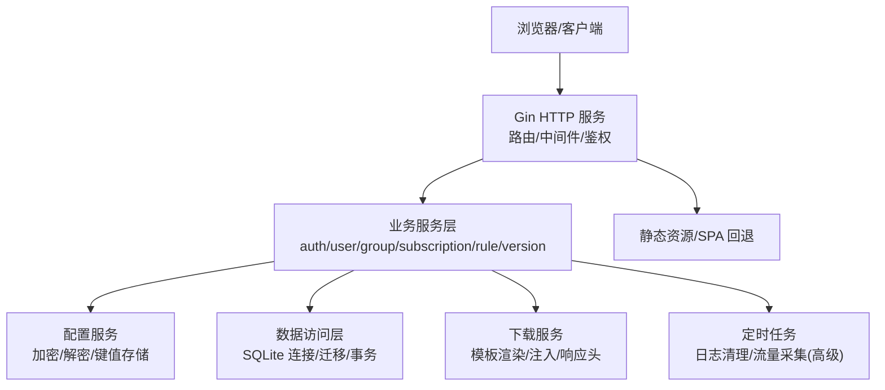
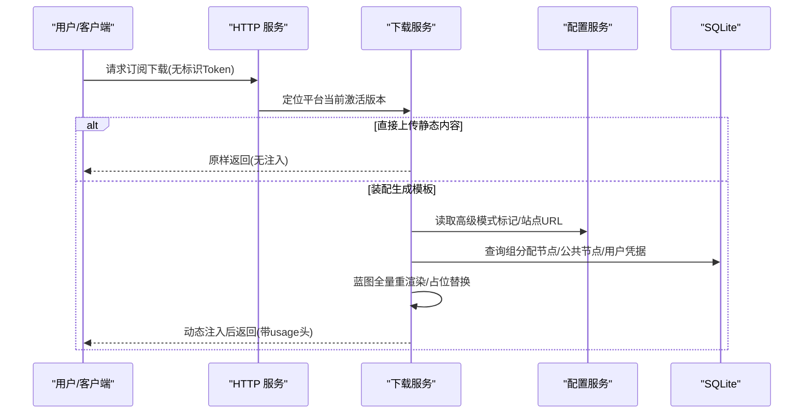
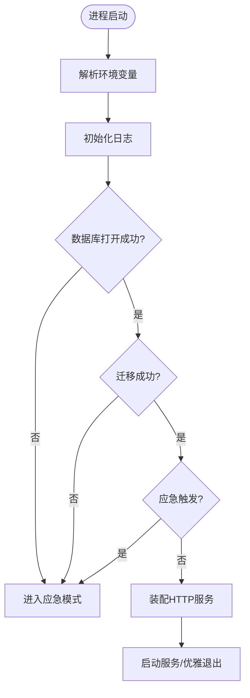
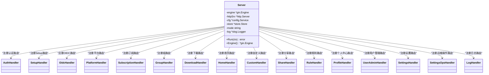
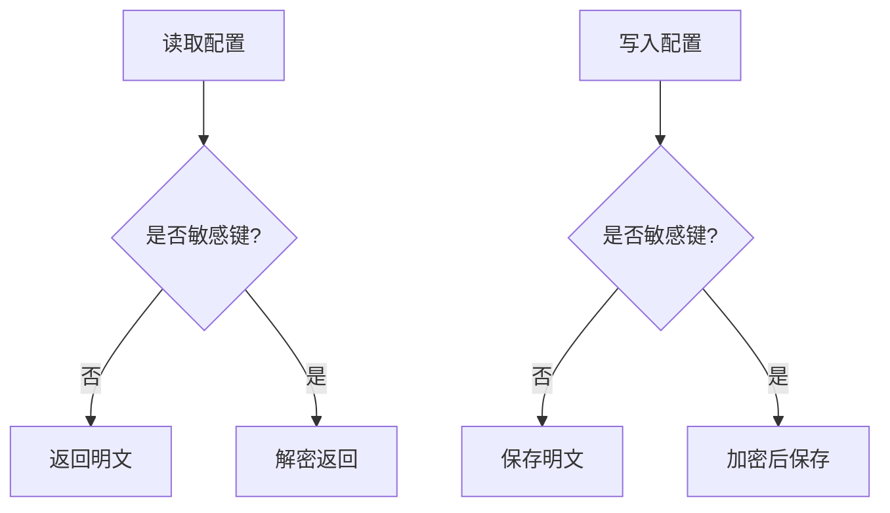
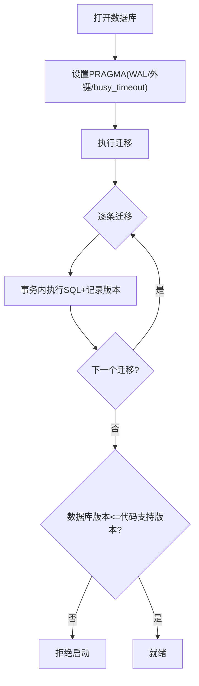
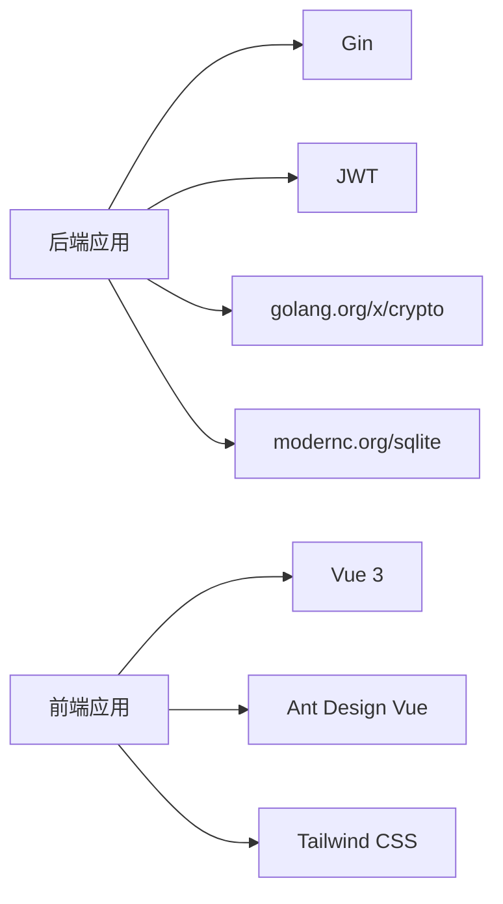

# 设计2设计验证报告

<cite>
**本文引用的文件**
- [README.md](file://README.md)
- [Design2.md](file://Design2.md)
- [Design2Report5.md](file://docs/AchievedDocuments/Design2Report5.md)
- [main.go](file://backend/cmd/server/main.go)
- [server.go](file://backend/internal/server/server.go)
- [config.go](file://backend/internal/config/config.go)
- [store.go](file://backend/internal/store/store.go)
- [go.mod](file://backend/go.mod)
- [package.json](file://frontend/package.json)
</cite>

## 目录
1. [引言](#引言)
2. [项目结构](#项目结构)
3. [核心组件](#核心组件)
4. [架构总览](#架构总览)
5. [详细组件分析](#详细组件分析)
6. [依赖关系分析](#依赖关系分析)
7. [性能考量](#性能考量)
8. [故障排查指南](#故障排查指南)
9. [结论](#结论)
10. [附录](#附录)

## 引言
本设计验证报告围绕“VPN 订阅管理系统”的 Design2（增量能力：规则素材池、装配拼接、配置生成与分发，以及高级模式 Xray 对接）进行系统性核验。报告从系统架构、组件关系、数据流、处理逻辑、集成点、错误处理与性能特征等维度展开，并结合仓库中的实现现状与构建文档核验结论，给出可操作的验证与落地建议。

## 项目结构
本项目采用前后端分离、单容器部署的架构：
- 后端：Go + Gin + SQLite（嵌入式），提供 HTTP API、静态资源服务、定时任务与迁移框架。
- 前端：Vue 3 + Vite + Ant Design Vue + Tailwind CSS，提供管理面板与用户界面。
- 部署：Docker 单镜像包含 API、前端产物与静态资源，数据卷持久化。

**图表来源**
- [main.go:24-99](file://backend/cmd/server/main.go#L24-L99)
- [server.go:62-157](file://backend/internal/server/server.go#L62-L157)
- [store.go:31-128](file://backend/internal/store/store.go#L31-L128)
- [config.go:57-168](file://backend/internal/config/config.go#L57-L168)

**章节来源**
- [README.md:32-63](file://README.md#L32-L63)
- [README.md:221-227](file://README.md#L221-L227)
- [main.go:24-99](file://backend/cmd/server/main.go#L24-L99)
- [server.go:62-157](file://backend/internal/server/server.go#L62-L157)

## 核心组件
- 启动与应急模式：负责环境变量解析、日志初始化、数据库迁移、服务装配与优雅退出；在数据库损坏或迁移失败时进入应急模式，仅暴露状态与恢复能力。
- HTTP 服务装配：集中注册各业务域路由（认证、设置、平台、订阅、用户、规则、分享、自定义、下载、首页等），并注入限流、会话、管理员中间件。
- 配置服务：基于 system_config 表提供键值存取，支持敏感字段 AES-256-GCM 加解密，使用 HKDF 派生密钥，提供事务内读写方法。
- 数据访问层：封装 SQLite 连接、WAL/外键/超时参数、版本化迁移框架与 BEGIN IMMEDIATE 事务工具。
- 前端工程：Vue 3 应用，提供管理面板与用户视图，通过 API 调用后端服务。

**章节来源**
- [main.go:24-99](file://backend/cmd/server/main.go#L24-L99)
- [server.go:62-157](file://backend/internal/server/server.go#L62-L157)
- [config.go:57-168](file://backend/internal/config/config.go#L57-L168)
- [store.go:31-128](file://backend/internal/store/store.go#L31-L128)
- [package.json:12-21](file://frontend/package.json#L12-L21)

## 架构总览
Design2 将系统划分为基础模式与高级模式：
- 基础模式：规则素材池、装配拼接、配置生成与分发，不依赖 Xray。
- 高级模式：Xray-core 对接，实现用户生命周期同步、流量配额管控与每用户专属订阅内容生成。

**图表来源**
- [server.go:86-112](file://backend/internal/server/server.go#L86-L112)
- [config.go:57-168](file://backend/internal/config/config.go#L57-L168)
- [Design2.md:304-333](file://Design2.md#L304-L333)

**章节来源**
- [Design2.md:8-22](file://Design2.md#L8-L22)
- [Design2.md:304-333](file://Design2.md#L304-L333)

## 详细组件分析

### 启动流程与应急模式
- 启动流程：解析环境变量 → 初始化日志 → 打开数据库 → 执行迁移 → 检测应急条件 → 装配服务 → 启动定时任务 → 监听端口。
- 应急模式：当数据库无法打开或迁移失败时，降级为仅暴露系统状态、站点信息与应急端点的最小可用服务，保障运维可观测与恢复。

**图表来源**
- [main.go:24-99](file://backend/cmd/server/main.go#L24-L99)

**章节来源**
- [main.go:24-99](file://backend/cmd/server/main.go#L24-L99)

### HTTP 服务装配与中间件
- 统一引擎：使用 gin.New 避免默认 logger/recovery 绕过脱敏与统一响应。
- 中间件链：信任代理策略、请求日志、panic 恢复、紧急模式门控。
- 路由装配：按序注册认证、Setup、OIDC、平台、订阅、用户、规则、分享、自定义、下载、首页、设置、日志等模块，并注入会话与管理员中间件。

**图表来源**
- [server.go:62-157](file://backend/internal/server/server.go#L62-L157)

**章节来源**
- [server.go:62-157](file://backend/internal/server/server.go#L62-L157)

### 配置服务与安全
- 配置存取：基于 system_config 表的键值存储，支持布尔/整数/JSON数组类型化读取。
- 敏感字段：AES-256-GCM 加密存储，密钥由签名密钥经 HKDF 派生，提供事务内加解密方法。
- 签名密钥：确保存在且唯一，用于派生加密密钥与后续扩展能力。

**图表来源**
- [config.go:57-168](file://backend/internal/config/config.go#L57-L168)
- [config.go:220-361](file://backend/internal/config/config.go#L220-L361)

**章节来源**
- [config.go:57-168](file://backend/internal/config/config.go#L57-L168)
- [config.go:220-361](file://backend/internal/config/config.go#L220-L361)

### 数据访问层与迁移
- 连接参数：WAL 模式、外键启用、busy_timeout 设置，单写者模型规避并发写冲突。
- 迁移框架：按文件名排序执行未应用迁移，迁移与版本记录在同一事务内写入，拒绝半迁移状态；数据库版本高于代码支持版本时拒绝启动。
- 事务工具：BEGIN IMMEDIATE 事务用于先读后写的串行化场景。

**图表来源**
- [store.go:31-128](file://backend/internal/store/store.go#L31-L128)

**章节来源**
- [store.go:31-128](file://backend/internal/store/store.go#L31-L128)

### 前端工程与依赖
- 技术栈：Vue 3、Vite、Ant Design Vue、Tailwind CSS、Pinia、Axios。
- 脚本：开发、构建、测试命令齐全，便于本地开发与CI集成。

**章节来源**
- [package.json:12-21](file://frontend/package.json#L12-L21)
- [package.json:6-11](file://frontend/package.json#L6-L11)

## 依赖关系分析
- 后端依赖：Gin 作为 Web 框架，JWT 用于令牌，golang.org/x/crypto 用于加密，modernc.org/sqlite 为嵌入式数据库驱动。
- 前端依赖：Vue 生态与 UI 组件库，构建工具链完整。

**图表来源**
- [go.mod:5-10](file://backend/go.mod#L5-L10)
- [package.json:12-21](file://frontend/package.json#L12-L21)

**章节来源**
- [go.mod:5-10](file://backend/go.mod#L5-L10)
- [package.json:12-21](file://frontend/package.json#L12-L21)

## 性能考量
- 数据库：WAL 模式提升并发读性能，单写者模型减少写冲突；busy_timeout 降低锁等待失败概率。
- 服务：Gin 轻量高效，中间件链短小精悍；请求日志与 panic 恢复不影响主路径性能。
- 下载：装配生成模板按需渲染，直接上传内容原样返回，避免不必要开销。
- 定时任务：访问日志清理与未来流量采集（高级模式）采用后台任务，避免阻塞请求。

[本节为通用性能讨论，不直接分析具体文件]

## 故障排查指南
- 启动失败：检查环境变量、数据库文件权限、迁移脚本完整性；查看日志中“打开数据库失败/迁移失败”提示。
- 应急模式：确认是否触发应急条件（数据库损坏/迁移失败/关键配置损坏），通过应急端点获取状态与恢复指引。
- 下载异常：确认平台当前激活版本是否存在；装配生成模板需正确勾选节点与素材池；直接上传内容原样返回，无需注入。
- 配置问题：敏感字段加解密失败会返回明确错误；检查签名密钥是否存在且有效。

**章节来源**
- [main.go:40-75](file://backend/cmd/server/main.go#L40-L75)
- [server.go:160-193](file://backend/internal/server/server.go#L160-L193)
- [config.go:220-361](file://backend/internal/config/config.go#L220-L361)

## 结论
Design2 的设计在基础模式与高级模式之间实现了清晰的能力分层：基础模式提供完整的订阅管理与装配能力，高级模式通过 Xray 对接实现用户生命周期同步与流量配额管控。当前实现已具备稳定的启动流程、HTTP 服务装配、配置安全与数据迁移框架，为后续 Build4–7 的增量能力落地奠定了坚实基础。建议在后续构建中重点关注以下方面：
- 完善高级模式中间件与端点保护（advancedMode）。
- 实现规则素材池与装配器（Clash YAML / SR subs / generic-subs / SR conf）。
- 接入 Xray-core gRPC 客户端，实现用户推送、流量采集与配额管理。
- 强化前端 UI 与后端端点对接，确保用户体验与功能一致性。

[本节为总结性内容，不直接分析具体文件]

## 附录
- 技术栈概览：后端 Go 1.25 + Gin + SQLite；前端 Vue 3 + Vite + Ant Design Vue + Tailwind CSS。
- 部署方式：单容器 Docker 镜像，数据卷持久化，支持一键部署与升级。
- 参考文档：Design2.md、Design2-UI.md、Build4–7.md、AGENTS.md 等。

[本节为补充信息，不直接分析具体文件]