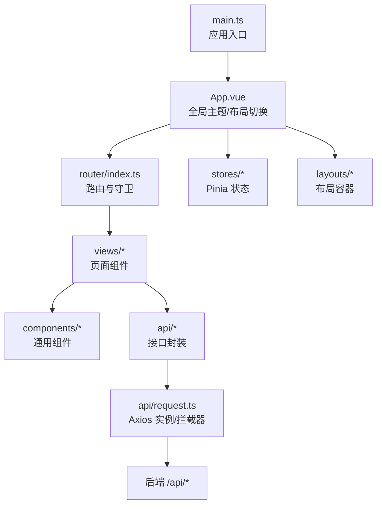
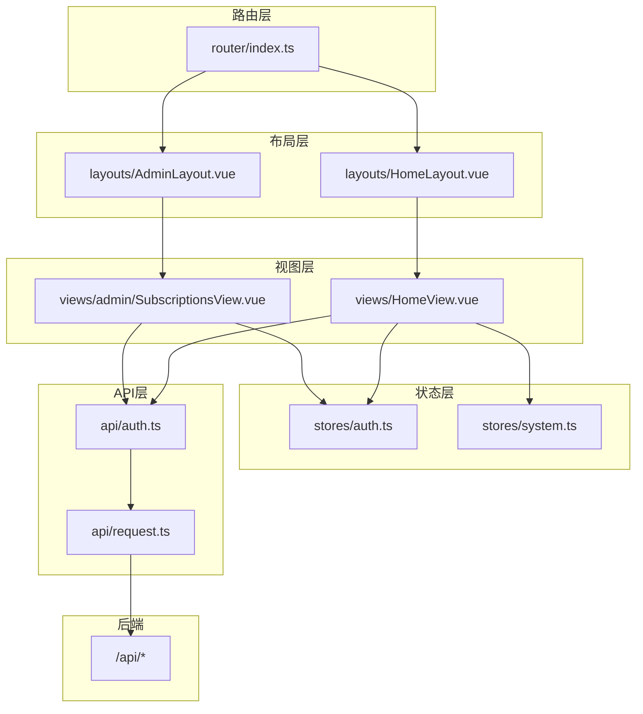
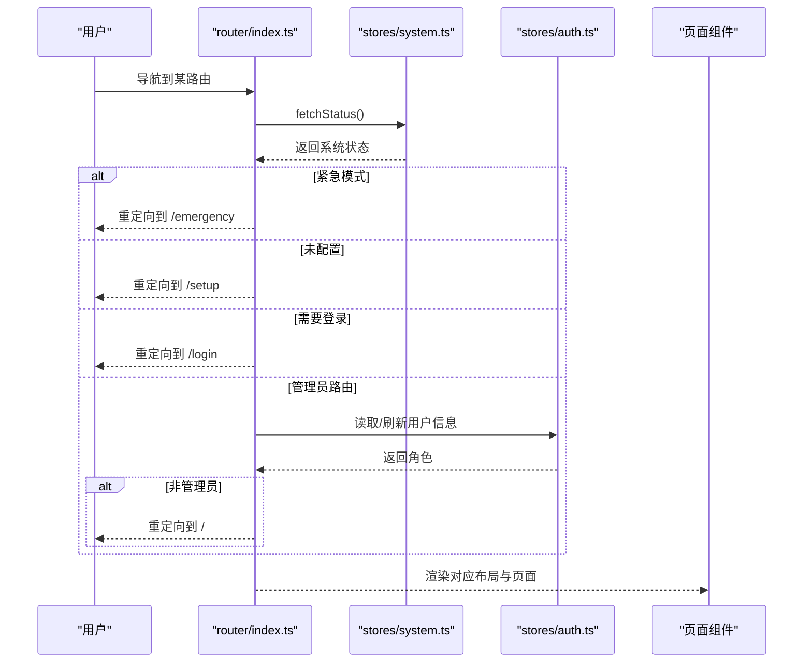
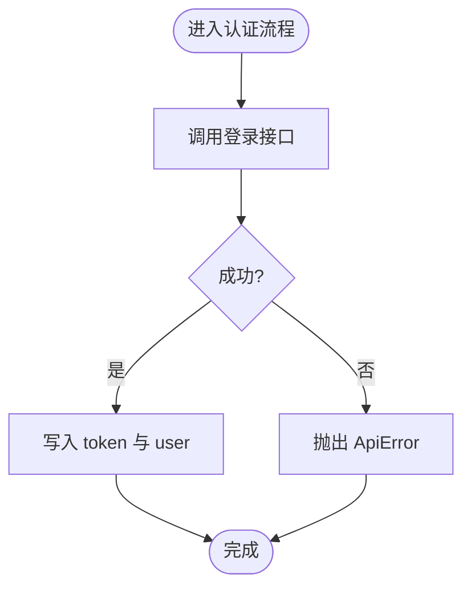
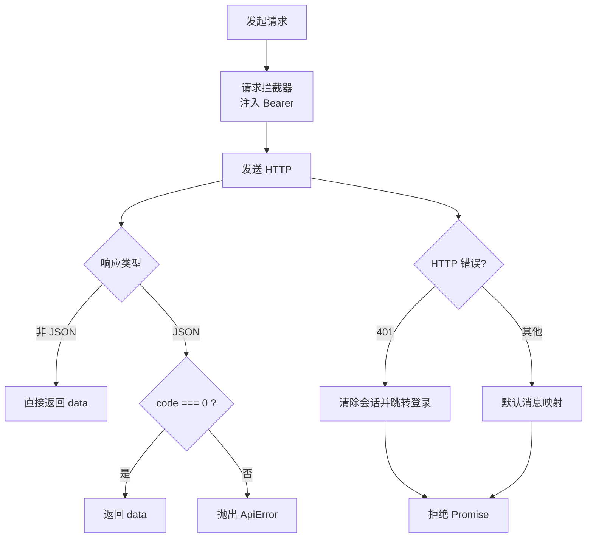
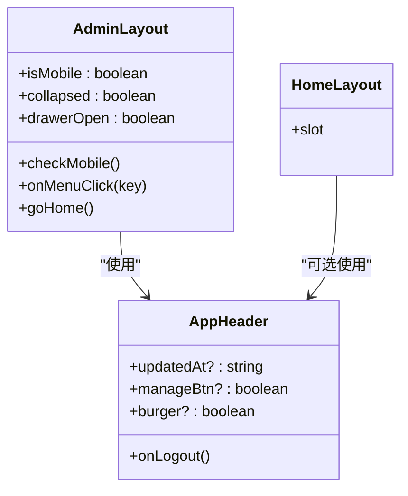
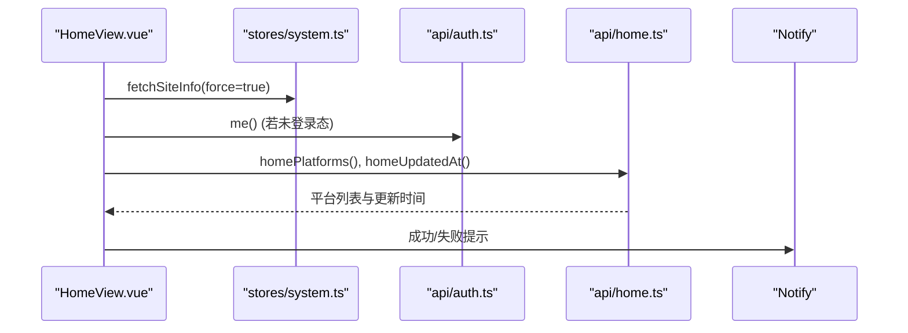
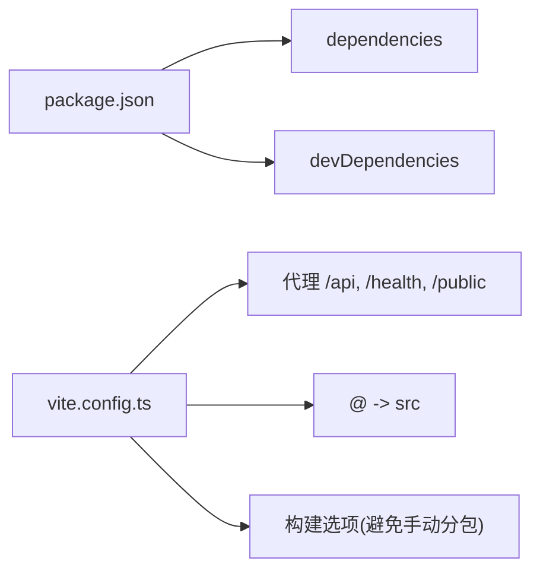

# 前端架构设计

<cite>
**本文引用的文件**
- [frontend/src/main.ts](file://frontend/src/main.ts)
- [frontend/src/App.vue](file://frontend/src/App.vue)
- [frontend/src/router/index.ts](file://frontend/src/router/index.ts)
- [frontend/src/stores/auth.ts](file://frontend/src/stores/auth.ts)
- [frontend/src/stores/system.ts](file://frontend/src/stores/system.ts)
- [frontend/src/api/request.ts](file://frontend/src/api/request.ts)
- [frontend/src/api/auth.ts](file://frontend/src/api/auth.ts)
- [frontend/src/layouts/AdminLayout.vue](file://frontend/src/layouts/AdminLayout.vue)
- [frontend/src/layouts/HomeLayout.vue](file://frontend/src/layouts/HomeLayout.vue)
- [frontend/src/components/AppHeader.vue](file://frontend/src/components/AppHeader.vue)
- [frontend/src/theme.ts](file://frontend/src/theme.ts)
- [frontend/src/views/HomeView.vue](file://frontend/src/views/HomeView.vue)
- [frontend/src/views/admin/SubscriptionsView.vue](file://frontend/src/views/admin/SubscriptionsView.vue)
- [frontend/vite.config.ts](file://frontend/vite.config.ts)
- [frontend/package.json](file://frontend/package.json)
</cite>

## 目录
1. [简介](#简介)
2. [项目结构](#项目结构)
3. [核心组件](#核心组件)
4. [架构总览](#架构总览)
5. [详细组件分析](#详细组件分析)
6. [依赖关系分析](#依赖关系分析)
7. [性能考量](#性能考量)
8. [故障排查指南](#故障排查指南)
9. [结论](#结论)
10. [附录](#附录)

## 简介
本文件面向 Vue 3 + TypeScript 单页应用（SPA）的前端架构设计，覆盖整体架构模式、路由与页面组织、状态管理、API 封装、UI 组件库集成、前后端通信机制、错误处理策略与响应式设计实现。文档提供架构图、组件关系图与数据流向图，帮助读者快速理解并维护该前端工程。

## 项目结构
前端采用 Vite 构建，基于 Vue 3 组合式 API，使用 Pinia 进行状态管理，Vue Router 管理路由，Ant Design Vue 作为 UI 组件库，Tailwind CSS 负责样式与响应式布局。入口文件初始化应用、注入 Pinia 与 Router，App 根组件通过 meta.layout 动态切换布局，路由守卫统一处理登录态、管理员权限与系统配置状态。

图表来源
- [frontend/src/main.ts:1-11](file://frontend/src/main.ts#L1-L11)
- [frontend/src/App.vue:1-43](file://frontend/src/App.vue#L1-L43)
- [frontend/src/router/index.ts:1-132](file://frontend/src/router/index.ts#L1-L132)
- [frontend/src/api/request.ts:1-89](file://frontend/src/api/request.ts#L1-L89)

章节来源
- [frontend/src/main.ts:1-11](file://frontend/src/main.ts#L1-L11)
- [frontend/src/App.vue:1-43](file://frontend/src/App.vue#L1-L43)
- [frontend/src/router/index.ts:1-132](file://frontend/src/router/index.ts#L1-L132)
- [frontend/package.json:1-37](file://frontend/package.json#L1-L37)

## 核心组件
- 应用启动与挂载：创建 Vue 应用，注册 Pinia 与 Router，挂载到 DOM。
- 根组件 App：全局中文与主题配置，根据路由 meta.layout 动态渲染布局容器；监听站点信息更新标题与 favicon。
- 路由与守卫：集中定义公开、用户端与管理端路由；在 beforeEach 中按顺序执行紧急模式、已配置检查、登录态校验、管理员角色校验；afterEach 控制顶部进度条。
- 状态管理：auth 存储 token 与用户信息并提供登录/注册/登出动作；system 缓存系统状态与站点信息，供守卫与页面复用。
- API 封装：Axios 实例统一 baseURL、超时、请求头注入 Bearer Token；响应拦截解包统一数据结构，401 自动清理会话并跳转；提供 ApiError 与 handleApiError 统一错误映射。
- 布局与组件：AdminLayout 提供侧边栏与移动端 Drawer；HomeLayout 提供用户端底色容器；AppHeader 为通用顶栏，支持站点名、公告、用户菜单与暗色模式切换。
- 主题：useTheme composable 管理暗色模式开关，持久化至 localStorage，联动 Tailwind 的 dark 类与 AntD 主题算法。

章节来源
- [frontend/src/stores/auth.ts:1-40](file://frontend/src/stores/auth.ts#L1-L40)
- [frontend/src/stores/system.ts:1-28](file://frontend/src/stores/system.ts#L1-L28)
- [frontend/src/api/request.ts:1-89](file://frontend/src/api/request.ts#L1-L89)
- [frontend/src/layouts/AdminLayout.vue:1-120](file://frontend/src/layouts/AdminLayout.vue#L1-L120)
- [frontend/src/layouts/HomeLayout.vue:1-7](file://frontend/src/layouts/HomeLayout.vue#L1-L7)
- [frontend/src/components/AppHeader.vue:1-66](file://frontend/src/components/AppHeader.vue#L1-L66)
- [frontend/src/theme.ts:1-27](file://frontend/src/theme.ts#L1-L27)

## 架构总览
本 SPA 采用“布局-页面-组件”分层与“路由-状态-API”横向切分的设计。路由决定展示哪个布局与页面；页面通过 Pinia 获取状态并调用 api 模块发起 HTTP 请求；请求经 request 层统一处理鉴权与错误；UI 由 Ant Design Vue 与 Tailwind 组合实现响应式界面。

图表来源
- [frontend/src/router/index.ts:1-132](file://frontend/src/router/index.ts#L1-L132)
- [frontend/src/layouts/AdminLayout.vue:1-120](file://frontend/src/layouts/AdminLayout.vue#L1-L120)
- [frontend/src/layouts/HomeLayout.vue:1-7](file://frontend/src/layouts/HomeLayout.vue#L1-L7)
- [frontend/src/views/HomeView.vue:1-211](file://frontend/src/views/HomeView.vue#L1-L211)
- [frontend/src/views/admin/SubscriptionsView.vue:1-188](file://frontend/src/views/admin/SubscriptionsView.vue#L1-L188)
- [frontend/src/stores/auth.ts:1-40](file://frontend/src/stores/auth.ts#L1-L40)
- [frontend/src/stores/system.ts:1-28](file://frontend/src/stores/system.ts#L1-L28)
- [frontend/src/api/auth.ts:1-28](file://frontend/src/api/auth.ts#L1-L28)
- [frontend/src/api/request.ts:1-89](file://frontend/src/api/request.ts#L1-L89)

## 详细组件分析

### 路由与守卫流程
- 路由表划分：公开路由（blank 布局）、用户端路由（home 布局）、管理端路由（admin 布局），版本管理子路由复用同一视图并通过 props 传递上下文。
- 守卫顺序：紧急模式优先 → 未配置强制 setup → 无凭据访问受保护路由跳转登录 → 已登录访问登录页重定向首页 → 管理路由实时校验管理员身份。
- 进度条：beforeEach 开始，afterEach 结束，轻量自实现避免引入额外库。

图表来源
- [frontend/src/router/index.ts:72-132](file://frontend/src/router/index.ts#L72-L132)
- [frontend/src/stores/system.ts:10-26](file://frontend/src/stores/system.ts#L10-L26)
- [frontend/src/stores/auth.ts:6-39](file://frontend/src/stores/auth.ts#L6-L39)

章节来源
- [frontend/src/router/index.ts:1-132](file://frontend/src/router/index.ts#L1-L132)

### 认证状态管理
- 凭据存取：token 同步到 localStorage，user 信息缓存于 store。
- 动作：登录/注册成功后写入会话；登出为客户端语义，接口失败不阻断；提供 me 用于守卫或页面刷新时恢复用户信息。

图表来源
- [frontend/src/stores/auth.ts:22-37](file://frontend/src/stores/auth.ts#L22-L37)
- [frontend/src/api/auth.ts:16-21](file://frontend/src/api/auth.ts#L16-L21)

章节来源
- [frontend/src/stores/auth.ts:1-40](file://frontend/src/stores/auth.ts#L1-L40)
- [frontend/src/api/auth.ts:1-28](file://frontend/src/api/auth.ts#L1-L28)

### API 封装与错误处理
- Axios 实例：baseURL=/api，超时 15s；请求拦截自动注入 Authorization: Bearer {token}。
- 响应拦截：非 JSON 原样返回；统一业务码非 0 抛 ApiError；401 清理本地会话并跳转登录（登录页自身 401 不跳转）。
- 错误映射：handleApiError 将常见状态码映射为用户可读提示，429 支持 Retry-After 秒数提示。

图表来源
- [frontend/src/api/request.ts:7-89](file://frontend/src/api/request.ts#L7-L89)

章节来源
- [frontend/src/api/request.ts:1-89](file://frontend/src/api/request.ts#L1-L89)

### 布局与响应式
- AdminLayout：桌面端固定侧边栏（220px/64px 收起），移动端使用 Drawer 抽屉菜单；监听窗口尺寸变化以切换布局；底部提供返回主界面与折叠按钮。
- HomeLayout：用户端底色容器，页面自带顶栏。
- AppHeader：通用顶栏，显示站点名、更新时间、管理面板入口、组名标签、用户名下拉菜单与暗色模式开关。

图表来源
- [frontend/src/layouts/AdminLayout.vue:1-120](file://frontend/src/layouts/AdminLayout.vue#L1-L120)
- [frontend/src/layouts/HomeLayout.vue:1-7](file://frontend/src/layouts/HomeLayout.vue#L1-L7)
- [frontend/src/components/AppHeader.vue:1-66](file://frontend/src/components/AppHeader.vue#L1-L66)

章节来源
- [frontend/src/layouts/AdminLayout.vue:1-120](file://frontend/src/layouts/AdminLayout.vue#L1-L120)
- [frontend/src/layouts/HomeLayout.vue:1-7](file://frontend/src/layouts/HomeLayout.vue#L1-L7)
- [frontend/src/components/AppHeader.vue:1-66](file://frontend/src/components/AppHeader.vue#L1-L66)

### 主题与国际化
- useTheme：维护暗色模式开关，持久化到 localStorage，切换 document.documentElement 的 dark 类以联动 Tailwind；同时生成 AntD 主题对象（darkAlgorithm/defaultAlgorithm + 主色）。
- 全局中文：antdLocale 注入 ConfigProvider，确保组件文案中文。

章节来源
- [frontend/src/theme.ts:1-27](file://frontend/src/theme.ts#L1-L27)
- [frontend/src/App.vue:1-43](file://frontend/src/App.vue#L1-L43)

### 页面示例：用户首页与管理端订阅
- HomeView：加载平台卡片、公告与更新时间；支持一键导入、复制链接、刷新链接、下载客户端；根据用户角色区分展示逻辑。
- SubscriptionsView：按平台分组展示订阅，支持新建/编辑/删除与版本跳转；关联用户组多选；创建后引导加入可用范围与设置默认订阅。

图表来源
- [frontend/src/views/HomeView.vue:27-45](file://frontend/src/views/HomeView.vue#L27-L45)
- [frontend/src/stores/system.ts:17-23](file://frontend/src/stores/system.ts#L17-L23)
- [frontend/src/api/auth.ts:16-21](file://frontend/src/api/auth.ts#L16-L21)

章节来源
- [frontend/src/views/HomeView.vue:1-211](file://frontend/src/views/HomeView.vue#L1-L211)
- [frontend/src/views/admin/SubscriptionsView.vue:1-188](file://frontend/src/views/admin/SubscriptionsView.vue#L1-L188)

## 依赖关系分析
- 构建与开发：Vite 插件启用 Vue 支持；别名 @ 指向 src；开发服务器代理 /api、/health、/public 到后端；构建阶段避免手动拆分 ant-design-vue 以避免循环依赖问题。
- 运行时依赖：Vue、Vue Router、Pinia、Axios、Ant Design Vue、Day.js、Markdown-it、Tailwind CSS。
- 测试：Vitest + jsdom，配合 @vue/test-utils。

图表来源
- [frontend/package.json:1-37](file://frontend/package.json#L1-L37)
- [frontend/vite.config.ts:1-25](file://frontend/vite.config.ts#L1-L25)

章节来源
- [frontend/package.json:1-37](file://frontend/package.json#L1-L37)
- [frontend/vite.config.ts:1-25](file://frontend/vite.config.ts#L1-L25)

## 性能考量
- 路由级懒加载：所有页面与版本管理子路由均按需 import，减少首屏体积。
- 代码分割策略：避免对 ant-design-vue 进行手动分包，交由 Rollup 自动分割，防止跨 chunk 循环引用导致白屏。
- 网络优化：Axios 超时 15s；公共静态资源路径 /public 走代理避免被 SPA fallback 吞掉。
- 状态缓存：system store 缓存系统状态与站点信息，避免重复请求；守卫内可复用。
- 渲染优化：AdminLayout 使用 sticky 吸顶与条件渲染侧边栏/Drawer，减少不必要的重排。

[本节为通用指导，无需特定文件来源]

## 故障排查指南
- 401 自动跳转：当后端返回 401，request 拦截器会清理本地会话并跳转登录；若当前已在登录页，则不跳转，由页面统一提示。
- 业务错误码：非 0 的业务码会抛出 ApiError，页面可通过 handleApiError 统一提示；429 支持读取 retryAfter 字段提示等待秒数。
- 路由守卫死循环：若系统状态获取失败，守卫仅依赖本地凭据判断，避免无限跳转；必要时检查 system.fetchStatus 与后端连通性。
- 构建白屏：如出现 Cannot access 'X' before initialization，检查是否误拆 ant-design-vue 为独立 chunk；保持默认输出配置。

章节来源
- [frontend/src/api/request.ts:16-59](file://frontend/src/api/request.ts#L16-L59)
- [frontend/src/router/index.ts:96-129](file://frontend/src/router/index.ts#L96-L129)
- [frontend/vite.config.ts:16-23](file://frontend/vite.config.ts#L16-L23)

## 结论
该前端工程采用清晰的 SPA 分层架构：路由驱动布局与页面，Pinia 管理全局状态，Axios 统一封装 API 与错误处理，Ant Design Vue 与 Tailwind 提供一致的 UI 与响应式体验。通过路由守卫、状态缓存与懒加载等策略，兼顾了安全性与性能。后续可在现有基础上扩展更多管理端功能与用户端能力，保持模块化与可维护性。

[本节为总结性内容，无需特定文件来源]

## 附录
- 关键入口与配置文件
  - 应用入口：[frontend/src/main.ts:1-11](file://frontend/src/main.ts#L1-L11)
  - 根组件：[frontend/src/App.vue:1-43](file://frontend/src/App.vue#L1-L43)
  - 路由与守卫：[frontend/src/router/index.ts:1-132](file://frontend/src/router/index.ts#L1-L132)
  - 构建配置：[frontend/vite.config.ts:1-25](file://frontend/vite.config.ts#L1-L25)
  - 依赖清单：[frontend/package.json:1-37](file://frontend/package.json#L1-L37)

[本节为索引性内容，无需特定文件来源]